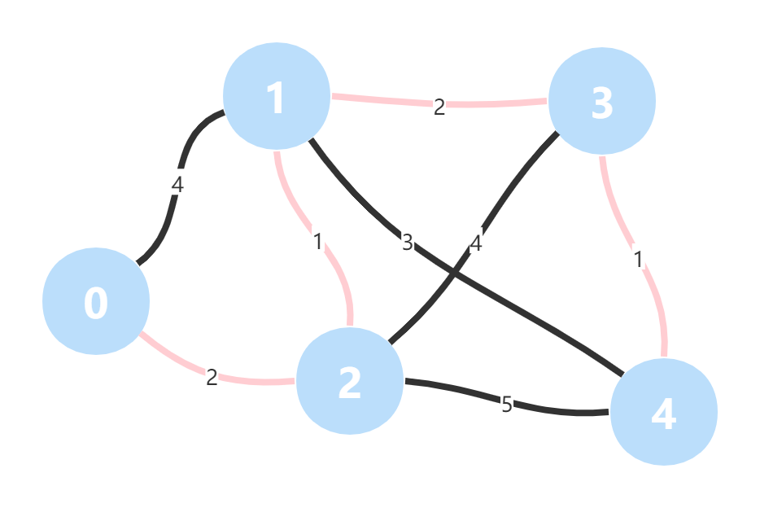

# 最短路径问题

> 第一次写算法相关的总结类文章，对以前学习到的知识点做个回顾，也尝试用精简的文字描述清楚。

最短路径问题（Shortest Path）：从图上的某一点到达另外一点，找到一条路径，使得权值之和最小（在下文中，路径的长短即权值之和的大小）。

- 对于无权图的最短路径，只需要用广度优先遍历（BFS）方法求解，选取最少边的路径即可；而对于有权图，有时途经更多边的路径权值之和可能会更小。
- 单源最短路径求解：起始点是固定点，求解从源点 src 到图中任一点的最短路径，常用的算法是 Dijkstra 算法和 Bellman-Ford 算法。
- 如要求出图中所有点的最短路径，则需要适用于求所有点对的最短路径算法：Floyd 算法。

[](https://ywh-oss.oss-cn-shenzhen.aliyuncs.com/Shortest Path.png)

为了更方便地描述算法，先给出有权图的 Java 实现（省略细节）。

有权边 `WeightedEdge`（兼容有向、无向）：

```
public class WeightedEdge implements Comparable<WeightedEdge> {
    
    // 起点，终点，权值
    private final int v, w, weight;
    
    public WeightedEdge(int v, int w, int weight) {
        this.v = v;
        this.w = w;
        this.weight = weight;
    }
    
    // ...
}
```

有权图 `WeightedGraph`：

```go
public class WeightedGraph {
    
    // 顶点数，边数
    private int V;
    private int E;
    
    /**
     * 邻接表：使用红黑树描述
     * [
     *      0: {1: 3, 2: 2, 3: -2},
     *      1: (2: 2, 3: 2, 4: 1)
     * ]
     */
    private TreeMap<Integer, Integer>[] adj;
    
    // 获取权值
    public int getWeight(int v, int w) {
        if (hasEdge(v, w)) {
            return adj[v].get(w);
        }
        throw new IllegalArgumentException(String.format("No edge %d-%d", v, w));
    }
    
     // 边是否存在
    public boolean hasEdge(int v, int w) {
        return adj[v].containsKey(w);
    }
    
    // ...
}
```

## Dijkstra 算法

该算法适用于无负权边的带权图（权值 >= 0，符合大多数情况），数组变量 `dis` 表示从 0 到 i 的最小权值之和，每轮循环：

- 找到当前没有过访问的（没有求解出最短路径的）节点中，距离当前节点路径最短的节点。
- 确认这个节点的最短路径即为当前大小。
- 根据这个节点的最短路径大小，更新其他节点的路径长度。

过程解析：由于不存在负权边，如果从 O 到达 A 的权值，小于从 O 到达其它任意顶点的权值（由于不可能经由其他点绕回来总和更小），则此时 **O-A** 即为最短路径。

```
     3
 +------[B]
 |   1   |
[O]-----[A]
 |   4   |
 +------[C]
```

对于满足第 1 步的顶点，确定已求得最短路径后可用于迭代求其他邻接点的最短路径：

从 A 出发，尝试判断经由 A 到达其它邻接点的权值之和是否会比当前从 O 出发的方案更小（`dis` 数组的值），是则更新：`dis[B] = min(dis[A] + weight[A][B])`。比如 **O-A-B** 比 **O-B** 小：

```
     3
 +------[B]
 |   1   | 1
[O]-----[A]
 |   4   | 1
 +------[C]
```

基本实现：

```go
public class WeightedGraph {
    // ...
    
    public Iterable<Integer> shortestPathDijkstra(int src, int dest) {
        int[] dis = new int[V], prev = new int[V];
        Arrays.fill(dis, Integer.MAX_VALUE);
        Arrays.fill(prev, -1);
        dis[src] = 0;
        prev[src] = src;

        // visited 用于记录“已确定最短距离”的顶点。
        boolean[] visited = new boolean[V];

        // 使用最小堆用于高效提取 dis 最小的顶点（同一个点可能存在多份）。
        // 而最小值必然是最近更新的结果，即距离已更新点 v 最近的点。
        PriorityQueue<int[]> pq = new PriorityQueue<>(Comparator.comparingInt(a -> a[1]));
        pq.add(new int[]{src, 0});

        // 每轮循环可决定（到达）一个点的最短距离。
        while (!pq.isEmpty()) {

            // 1. 利用最小堆找到 dis 最小值的顶点。
            int v = pq.poll()[0];

            // 2. 更新顶点状态，如果该点已经确定最短路径则跳过。
            if (visited[v]) {
                continue;
            }
            visited[v] = true;

//            // 找到到达终点的最短路径可提前结束（对于 Bellman Ford 算法，由于存在松弛操作，不能提前终止）。
//            if (v == dest) {
//                break;
//            }

            // 3. 根据刚才确定的解，更新邻接顶点的 dis 值。
            for (int w : adj(v)) {

                // 如果 w 未确定最短路径，且其目前的 dis 值大于经由 v 到达 w 的距离，则更新 dis[w] 并添加到最小堆。
                // 比如：
                //           3
                //       +------[w]
                //       |       | 1
                //      [0]-----[v]
                //           1
                // 此时 w 仍未确定，需要重新放入最小堆，用作下次继续更新。
                if (!visited[w] && dis[w] > dis[v] + getWeight(v, w)) {
                    dis[w] = dis[v] + getWeight(v, w);
                    pq.add(new int[]{w, dis[w]});
                    prev[w] = v;
                }
            }
        }

        // 根据 prev 数组求整个路径。
        LinkedList<Integer> ret = new LinkedList<>();
        if (!visited[dest]) {
            return ret;
        }
        int cur = dest;
        while (cur != src) {
            ret.addFirst(cur);
            cur = prev[cur];
        }
        ret.addFirst(src);
        return ret;
    }
}
```

实现细节：

- 使用最小堆用于高效提取 `dis` 最小的顶点（log(n)），而最小值必然是最近更新的结果，即距离已更新点 `v` 最近的点。
- 每轮循环可以决定到达一个点的最短距离：
  - 利用最小堆找到 `dis` 最小值的顶点。如果该点已经确定最短路径则跳过，否则更新顶点状态为已访问。
- 根据刚才确定的解，循环更新所有邻接顶点的 `dis` 值：如果 `w` 未确定最短路径，且其目前的 `dis` 值大于经由 `v` 到达 `w` 的距离，则更新 `dis[w]` 并添加到最小堆；否则需要重新放入最小堆，用作下次继续更新。
  - 遍历过程中用 `prev` 数组不断记录当前节点的上一个节点。
- 最终用 `prev` 数组反向求出整个路径。

时间复杂度：

- 由于每轮循环内都需要一层循环来找到 `dis` 最小的顶点，因此 Time: O(V^2)。
- 上面的实现利用了最小堆（优先级队列）记录边，无需判断所有顶点，因此 Time: O(E*log(E))。
- 使用索引堆（Index Heap），可进一步优化到 Time: O(V*log(E))。

> 点击链接可查看动图：[Dijkstra Visualzation (usfca.edu)](https://www.cs.usfca.edu/~galles/visualization/Dijkstra.html)

## Bellman-Ford 算法

相比起 Dijkstra Bellman-Ford 算法的优势是不受负权边的影响，是在无向图中也成立的有向图算法（因为无向图可以理解为对于每条边都有反向边的有向图）。

假设 `dis[v]` 是从 `s` 到 `v` 的经过边数不超过 `k` 的最短距离。

- 初始 `dis[s] = 0`，其余点为 MAX。
- 定义 **松弛操作（Repaxation）**：寻找每多经过一条边，可得到的最短距离（迂回计算最短路径）。进行第 `k` 次松弛操作，即找到从 `s` 到 `b` 的经过边数不超过 `k+1` 的最短距离。比如下图中 **O-B-A** 比 **O-A** 多经过一条边，但权值之和比 **O-A** 小，因此可更新最短路径：

```
     8
 +------[B]
 |   6   | -3
[O]-----[A]
dis[A] = min(dis[A], dis[B] + weight[B][A]);
dis[B] = min(dis[A], dis[A] + weight[A][B]);
```

- 对所有边进行 [1, v) 共 `v-1` 轮松弛操作，则求出到所有点经过的边数最多为 [1, v) 的最短路径。

**负权环**：环的路径和为负数，因此每绕一圈，权值之和会变得更小，这种情况下不存在最短路径。要判断负权环，只需要在第 `v-1` 轮松弛操作后多进行一轮，根据 `dis` 值是否还会更新，即可判断是否存在负权环、最短路径是否有意义。

```go
   [2]
 3/   \-6
[0]---[1]
    2
```

> 在无向图中，存在负权边即等于存在负权环，在有向图中则不一定。

基本实现：

```go
public class WeightedGraph {
    // ...
    public Iterable<Integer> shortestPathBellmanFord(int src, int dest) {
        int[] dis = new int[V], prev = new int[V];
        Arrays.fill(dis, Integer.MAX_VALUE);
        Arrays.fill(prev, -1);
        dis[src] = 0;

        // 进行 v-1 轮松弛操作。
        for (int pass = 1; pass < V; pass++) {

            // 在每轮操作中对所有的边进行松弛操作：遍历每个顶点的邻接顶点，即取出每条边。
            for (int v = 0; v < V; v++) {
                for (int w : adj(v)) {
                    // 如果 dis[v] 已被更新过，且 dis[w] 目前的 dis 值大于经由 v 到达 w 的距离，则更新 dis[w]。
                    if (dis[v] != Integer.MAX_VALUE && dis[w] > dis[v] + getWeight(v, w)) {
                        dis[w] = dis[v] + getWeight(v, w);
                        prev[w] = v;
                    }
                }
            }
        }

        // 判断是否有负权环：进行第 v 轮松弛操作。
        boolean hasNegCycle = false;
        for (int v = 0; v < V; v++) {
            for (int w : adj(v)) {
                if (dis[v] != Integer.MAX_VALUE && dis[w] > dis[v] + getWeight(v, w)) {
                    hasNegCycle = true;
                }
            }
        }

        LinkedList<Integer> ret = new LinkedList<>();
        // 存在负权环，返回空。
        if (hasNegCycle) {
            System.out.println("exist negative cycle");
            return ret;
        }
        // dis[dest] 没有被更新，表示 dest 不在路径上，返回空。
        if (dis[dest] == Integer.MAX_VALUE) {
            return ret;
        }
        int cur = dest;
        while (cur != src) {
            ret.addFirst(cur);
            cur = prev[cur];
        }
        ret.addFirst(src);
        return ret;
    }
}
```

实现细节：

- 对于 `V` 个节点的图，进行 `V-1` 次松弛操作：
  - 在每轮松弛操作中，遍历每个顶点 `v`，对于每个顶点再遍历其邻接顶点 `w`，取出每条边（v-w）。
- 如果 `dis[v]` 已被更新过，且 `dis[w]` 目前的 `dis` 值大于经由 `v` 到达 `w` 的距离，则更新 `dis[w]`。
  - 遍历过程中用 `prev` 数组不断记录当前节点的上一个节点。
- 进行第 V 轮松弛操作来判断是否有负权环，如果存在负权环，则直接返回空。
- 判断 `dis[dest]` 是否已被更新（非 MAX），如在刚才的松弛操作中未被更新，表示终点不在路径上，返回空。
- 最终用 `prev` 数组反向求出整个路径。

时间复杂度：O(V*E)

> ### SPFA 算法
>
> 实际上很多情况下不需要 `v-1` 轮松弛操作就可以找到最短路径，因此后续的松弛操作是浪费的。SPFA 算法在 Bellman-Ford 算法的基础上优化，使用一个队列记录只关注的顶点，每次只对这些顶点的邻边进行松弛操作。

## Floyd-Warshall 算法

前面两种算法只能求出单源最短路径，而 Floyd-Warshall 算法的特点是可以一次过求出所有点对最短路径，以及图的直径（所有点对最短路径的最大值）。

> 注意，所有点对的最短路径不是单源最短路径算法的叠加。

区别于 Bellman-Ford，其比较对象不是一条边，而是经由某点到达此处的最短路径的距离（可能已经过多条边）。

- 初始化，如果 **v-w** 边存在，有 `dis[v][w] = weight[v][w]`、`dis[v][v] = 0`；否则 `dis[v][w] = MAX`。
- 循环执行以下过程，其中：
  - `t` 循环相当于松弛操作，每轮循环求解出中间绕过 [0, t] 这些点的最短路径。
  - `v`、`w` 循环寻找最短路径的起始点和终止点。

```go
for (int t = 0; t < V; t++) {
    for (int v = 0; v < V; v++) {
        for (int w = 0; w < V; w++) {
            if (dis[v][t] + dis[t][w] < dis[v][w]) {
                dis[v][w] = dis[v][t] + dis[t][w];
            }
        }
    }
}
```

Floyd 算法同样要判断是否存在负权环：最终判断 `dis[v][v]` 是否有小于 0 的值，有则表示存在负权环，最短路径无意义。

```
     8
 +------[t]
 |   6   | -3
[v]-----[w]
```

基本实现：

```go
public class WeightedGraph {
    // ...
    public Iterable<Integer> shortestPathFloydWarshall(int src, int dest) {

        // dis[v][w] 表示 从 v 到 w 的最短路径长度。
        int[][] dis = new int[V][V];
        int[] prev = new int[V];
        Arrays.fill(prev, -1);
        for (int v = 0; v < V; v++) {
            Arrays.fill(dis[v], Integer.MAX_VALUE);
        }
        for (int v = 0; v < V; v++) {
            dis[v][v] = 0;
            for (int w : adj(v)) {
                dis[v][w] = getWeight(v, w);
            }
        }
        // 相当于松弛操作，每轮循环求解出中间绕过 [0, t] 这些点的最短路径。
        for (int t = 0; t < V; t++) {
            // 寻找最短路径的起始点和终止点。
            for (int v = 0; v < V; v++) {
                for (int w = 0; w < V; w++) {

                    //      8
                    //  +------[t]
                    //  |   6   | -3
                    // [v]-----[w]
                    if (dis[v][t] != Integer.MAX_VALUE && dis[t][w] != Integer.MAX_VALUE && dis[v][t] + dis[t][w] < dis[v][w]) {
                        dis[v][w] = dis[v][t] + dis[t][w];
                        prev[w] = v;
                    }
                }
            }
        }
        for (int v = 0; v < V; v++) {
            if (dis[v][v] < 0) {
                // 存在负权环，返回空。
                return Collections.emptyList();
            }
        }

        LinkedList<Integer> ret = new LinkedList<>();
        int cur = dest;
        while (cur != src) {
            ret.addFirst(cur);
            cur = prev[cur];
        }
        ret.addFirst(src);
        return ret;
    }
}
```

实现细节：

- Floyd-Warshall 算法的比较对象是经由某点到达某点的最短路径，因此需要使用二维的 `dis` 数组，且遍历过程中也是需要用 `prev` 数组记录当前节点的上一个节点。
- 与 Bellman-Ford 算法类似，Floyd-Warshall 算法也有 **松弛操作**，区别在于其每轮循环求解出中间绕过 [0, t] 这些点的最短路径。
- 最终也需要判断是否遍历 `dis` 数组的所有点对，判断是否有负值（表示负权环），返回空。

时间复杂度：O(V^3)

> 点击链接可查看动图：[Floyd-Warshall All-Pairs Shortest Path (usfca.edu)](https://www.cs.usfca.edu/~galles/visualization/Floyd.html)

## 总结

三种算法对比（对于稀疏图，V 远远小于 E）：

- Dijkstra：不能包含负权边，Time: O(V*log(E))。
- Bellman-Ford：可包含负权边，可检测负权环，Time: O(V*E)。
- Floyd-Warshall：可包含负权边，可检测负权环，Time: O(V^3)。

在上述的 Floyd-Warshall 算法的实现中，利用 `prev` 数组反向求解具体路径的写法存在一定问题，您可以找出并解决这个问题吗？

## 参考

- [Dijkstra’s algorithm - Wikipedia](https://en.wikipedia.org/wiki/Dijkstra's_algorithm)
- [Bellman–Ford algorithm - Wikipedia](https://en.wikipedia.org/wiki/Bellman–Ford_algorithm)
- [Floyd–Warshall algorithm - Wikipedia](https://en.wikipedia.org/wiki/Floyd–Warshall_algorithm)
- [Data Structure Visualization (usfca.edu)](https://www.cs.usfca.edu/~galles/visualization/Algorithms.html)