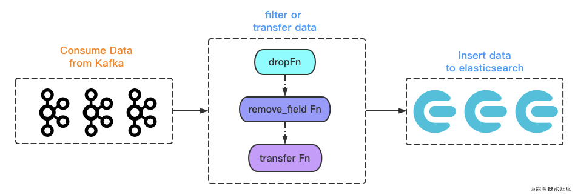
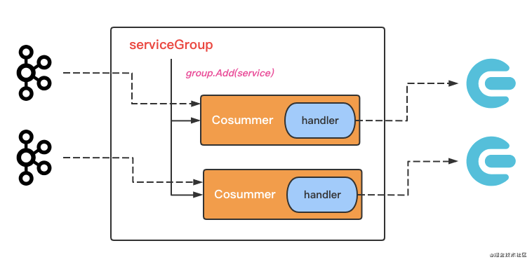

# 极速精简 Go 版 Logstash

## 前言

今天来介绍 `go-zero` 生态的另一个组件 `go-stash`。这是一个 `logstash` 的 Go 语言替代版，我们用 `go-stash` 相比原先的 `logstash` 节省了 2/3 的服务器资源。如果你在用 `logstash`，不妨试试，也可以看看基于 `go-zero` 实现这样的工具是多么的容易，这个工具作者仅用了两天时间。

## 整体架构

先从它的配置中，我们来看看设计架构。

```yaml
Clusters:
  - Input:
      Kafka:
        # Kafka 配置 --> 联动 go-queue
    Filters:
      # filter action
      - Action: drop            
      - Action: remove_field
      - Action: transfer      
    Output:
      ElasticSearch:
        # es 配置 {host, index}

```

看配置名：`kafka` 是数据输出端，`es` 是数据输入端，`filter` 抽象了数据处理过程。

对，整个 `go-stash` 就是如 config 配置中显示的，所见即所得。



## 启动

从 `stash.go` 的启动流程大致分为几个部分。因为可以配置多个 `cluster`，那从一个 `cluster` 分析：

1. 建立与 `es` 的连接【传入 `es` 配置】
2. 构建 `filter processors`【`es` 前置处理器，做数据过滤以及处理，可以设置多个】
3. 完善对 `es` 中 索引配置，启动 `handle` ，同时将 `filter` 加入 handle【处理输入输出】
4. 连接下游的 `kafka`，将上面创建的 `handle` 传入，完成 `kafka` 和 `es` 之间的数据消费和数据写入

## MessageHandler

在上面架构图中，中间的 `filter` 只是从 config 中看到，其实更详细是 `MessageHandler` 的一部分，做数据过滤和转换，下面来说说这块。

> 以下代码：https://github.com/tal-tech/go-stash/tree/master/stash/handler/handler.go

```go
type MessageHandler struct {
  writer  *es.Writer
  indexer *es.Index
  filters []filter.FilterFunc
}
```

这个就对应上面说的，`filter` 只是其中一部分，在结构上 `MessageHandler` 是对接下游 `es` ，但是没有看到对 `kafka` 的操作。

别急，从接口设计上 `MessageHandler` 实现了 `go-queue` 中 `ConsumeHandler` 接口。

这里，上下游就串联了：

1. `MessageHandler` 接管了 `es` 的操作，负责数据处理到数据写入
2. 对上实现了 `kafka` 的 `Consume` 操作。这样在消费过程中执行 `handler` 的操作，从而写入 `es`

实际上，`Consume()` 也是这么处理的：

```go
func (mh *MessageHandler) Consume(_, val string) error {
  var m map[string]interface{}
  // 反序列化从 kafka 中的消息
  if err := jsoniter.Unmarshal([]byte(val), &m); err != nil {
    return err
  }
  // es 写入index配置
  index := mh.indexer.GetIndex(m)
  // filter 链式处理【因为没有泛型，整个处理都是 `map进map出`】
  for _, proc := range mh.filters {
    if m = proc(m); m == nil {
      return nil
    }
  }
  bs, err := jsoniter.Marshal(m)
  if err != nil {
    return err
  }
  // es 写入
  return mh.writer.Write(index, string(bs))
}
```

## 数据流

说完了数据处理，以及上下游的连接点。但是数据要从 `kafka -> es` ，数据流出这个动作从 `kafka` 角度看，应该是由开发者主动 `pull data from kafka`。

那么数据流是怎么动起来？我们回到主程序 https://github.com/tal-tech/go-stash/blob/master/stash/stash.go

其实 [启动](https://xie.infoq.cn/article/2c050bf82a1b10fcd68ca69ca#启动) 整个流程中，其实就是一个组合模式：

```go
func main() {
  // 解析命令行参数，启动优雅退出
  ...
  // service 组合模式
  group := service.NewServiceGroup()
  defer group.Stop()

  for _, processor := range c.Clusters {
    // 连接es
    ...
    // filter processors 构建
    ...
    // 准备es的写入操作 {写入的index, 写入器writer}
    handle := handler.NewHandler(writer, indexer)
    handle.AddFilters(filters...)
    handle.AddFilters(filter.AddUriFieldFilter("url", "uri"))
    // 按照配置启动kafka，并将消费操作传入，同时加入组合器
    for _, k := range toKqConf(processor.Input.Kafka) {
      group.Add(kq.MustNewQueue(k, handle))
    }
  }
  // 启动这个组合器
  group.Start()
}
```

整个数据流，就和这个 `group` 组合器有关了。

```
group.Start()
  |- group.doStart()
    |- [service.Start() for service in group.services]
```

那么说明加入 `group` 的 `service` 都是实现 `Start()`。也就是说 `kafka` 端的启动逻辑在 `Start()`：

```
func (q *kafkaQueue) Start() {
  q.startConsumers()
  q.startProducers()

  q.producerRoutines.Wait()
  close(q.channel)
  q.consumerRoutines.Wait()
}
```

1. 启动 `kafka` 消费程序
2. 启动 `kafka` 消费拉取端【可能会被名字迷惑，实际上是从 `kafka` 拉取消息到 `q.channel`】
3. 消费程序终止，收尾工作

而我们传入 `kafka` 中的 `handler`，上文说过其实是 `Consume`，而这个方法就是在 `q.startConsumers()` 中执行的：

```
q.startConsumers()
  |- [q.consumeOne(key, value) for msg in q.channel]
    |- q.handler.Consume(key, value)
```

这样整个数据流就彻底串起来了：



## 总结

作为 `go-stash` 第一篇文章，本篇从架构和设计上整体介绍 `go-stash` ，有关性能和为什么我们要开发一个这样的组件，我们下篇文章逐渐揭晓。

https://github.com/tal-tech/go-stash

关于 `go-zero` 更多的设计和实现文章，可以持续关注我们。

https://github.com/tal-tech/go-zero

欢迎使用 go-zero 并 **star** 支持我们！