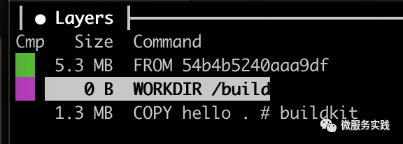

# 构建 Go 应用 docker 镜像的几种姿势

## 修炼背景

我夜以继日，加班加点开发了一个最简单的 Go Hello world 应用，虽然只是跑了打印一下就退出了，但是老板也要求我上线这个我能写出的唯一应用。

项目结构如下：

```
.
├── go.mod
└── hello.go
```

`hello.go` 代码如下：

```go
package main

func main() {
    println("hello world!")
}
```

并且，老板要求用 `docker` 部署，显得咱们紧跟潮流，高大上一点。。。

## 第一次尝试

我在拜访了一些武林朋友之后，发现把整个过程丢到 `docker` 里面去编译一下就好了，一番琢磨之后，我得到了如下 `Dockerfile`:

```dockerfile
FROM golang:alpine

WORKDIR /build

COPY hello.go .

RUN go build -o hello hello.go

CMD ["./hello"]
```

构建镜像：

```shell
$ docker build -t hello:v1 .
```

搞定，让我们凑近了看看。

```shell
$ docker run -it --rm hello:v1 ls -l /build
total 1260
-rwxr-xr-x    1 root     root       1281547 Mar  6 15:54 hello
-rw-r--r--    1 root     root            55 Mar  6 14:59 hello.go
```

好家伙，我好不容易写出来的代码也在里面，看来代码不能写的烂，不然运维妹子偷看了要笑话我。。。

我们再看看镜像到底有多大，据说大了拉取镜像就会比较慢呢

```shell
$ docker images | grep hello
hello   v1    2783ee221014   44 minutes ago   314MB
```

哇，居然有314MB，难道 `docker build` 一下变  `Java` 了吗？不是什么东西都是越大越好的。。。

让我们看看为啥这么大！


看看，我们跑第一个指令（`WORKDIR`）前就已经300+MB了，有点猛啊！

不管怎么说，我们先跑一下看看

```shell
$ docker run -it --rm hello:v1
hello world!
```

没问题呀，好歹可以工作嘛～

## 第二次尝试

经过一番烟酒，加上朋友指点，发现原来我们用的那个基础镜像实在太大了。

```shell
$ docker images | grep golang
golang    alpine     d026981a7165   2 days ago          313MB
```

并且朋友告诉我可以把代码先编译好，再拷贝进去，就不用那个巨大的基础镜像了，不过说起来容易，我还是好好花了点功夫的，最后 `Dockerfile` 长这样：

```dockerfile
FROM alpine

WORKDIR /build

COPY hello .

CMD ["./hello"]
```

跑一下试试

```shell
$ docker build -t hello:v2 .
...
=> ERROR [3/3] COPY hello .                         0.0s
------
 > [3/3] COPY hello .:
------
failed to compute cache key: "/hello" not found: not found
```

不对，`hello` 找不到，忘记先编译一下 `hello.go` 了，再来~

```shell
$ go build -o hello hello.go
```

再跑 `docker build -t hello:v2 .`，没问题，走两步试试。。。

```shell
$ docker run -it --rm hello:v2
standard_init_linux.go:228: exec user process caused: exec format error
```

失败！好吧，格式不对，原来我们开发机不是 `linux` 呀，再来~

```shell
$ GOOS=linux go build -o hello hello.go
```

重新 `docker build` 终于搞定了，赶紧跑下

```shell
$ docker run -it --rm hello:v2
hello world!
```

没问题，我们来看看内容和大小。

```shell
$ docker run -it --rm hello:v2 ls -l /build
total 1252
-rwxr-xr-x    1 root     root       1281587 Mar  6 16:18 hello
```

里面只有 `hello` 这个可执行文件，再也不用担心别人鄙视我的代码了~

```shell
$ docker images | grep hello
hello    v2   0dd53f016c93   53 seconds ago      6.61MB
hello    v1   ac0e37173b85   25 minutes ago      314MB
```

哇，6.61MB，绝对可以！



看看，我们跑第一个指令（`WORKDIR`）前面只有 5.3MB 了，开心啊！

## 第三次尝试

一顿炫耀之后，居然有人鄙视我，说现在流行什么多阶段构建，那么第二种方式到底有啥问题呢？细细琢磨之后发现，我们要能从 `Go` 代码构建出 `docker` 镜像，其中分为三步：

1. 本机编译 `Go` 代码，如果牵涉到 `cgo` 跨平台编译就会比较麻烦了
2. 用编译出的可执行文件构建 `docker` 镜像
3. 编写 `shell` 脚本或者 `makefile` 让这几步通过一个命令可以获得

多阶段构建就是把这一切都放到一个 `Dockerfile` 里，既没有源码泄漏，又不需要用脚本去跨平台编译，还获得了最小的镜像。

爱学习，追求完美的我最终写出了如下 `Dockerfile`，多一行则肥，少一行则瘦：

```dockerfile
FROM golang:alpine AS builder

WORKDIR /build

ADD go.mod .
COPY . .
RUN go build -o hello hello.go


FROM alpine

WORKDIR /build
COPY --from=builder /build/hello /build/hello

CMD ["./hello"]
```

第一个 `FROM` 开始的部分是构建一个 `builder` 镜像，目的是在其中编译出可执行文件 `hello`，第二个 `From` 开始的部分是从第一个镜像里 `copy` 出来可执行文件 `hello`，并且用尽可能小的基础镜像 `alpine` 以保障最终镜像尽可能小，至于为啥不用更小的 `scratch`，是因为 `scratch` 真的啥也没有，有问题连上去看一眼的机会都没有，而 `alpine` 也才 5MB，对我们的服务不会构成多少影响。

我们先跑了验证一下：

```shell
$ docker run -it --rm hello:v3
hello world!
```

没问题，正如预期！看看大小如何：

```shell
$ docker images | grep hello
hello    v3     f51e1116be11   8 hours ago    6.61MB
hello    v2     0dd53f016c93   8 hours ago    6.61MB
hello    v1     ac0e37173b85   8 hours ago    314MB
```

跟第二种方法构建的镜像大小完全一样。再看看镜像里的内容：

```shell
$ docker run -it --rm hello:v3 ls -l /build
total 1252
-rwxr-xr-x    1 root     root       1281547 Mar  6 16:32 hello
```

也是只有一个可执行的 `hello` 文件，完美！


跟第二个最终镜像基本是一致的，但我们简化了流程，只需要一个 `Dockerfile`，跑一条命令就好了，不需要我去整那些晦涩难懂的 `shell` 和 `makefile` 了。

## 神功练成

至此，团队小伙伴都觉得完美，纷纷给我点赞！但是，既追求完美，又喜欢偷懒（摸鱼）的我觉得吧，每次都让我写出这么个增一行则肥，减一行则瘦的 `Dockerfile`，我还是觉得挺烦的，于是我瞒着老板写了个工具，我来秀一秀~~

```
# 安装一下先
$ GOPROXY=https://goproxy.cn/,direct go install github.com/zeromicro/go-zero/tools/goctl@latest
# goctl migrate —verbose —version v1.3.1
# 一键编写 Dockerfile
$ goctl docker -go hello.go
```

搞定！看看生成的 `Dockerfile` 哈

```dockerfile
FROM golang:alpine AS builder

LABEL stage=gobuilder

ENV CGO_ENABLED 0
ENV GOOS linux
ENV GOPROXY https://goproxy.cn,direct

WORKDIR /build

ADD go.mod .
ADD go.sum .
RUN go mod download
COPY . .
RUN go build -ldflags="-s -w" -o /app/hello ./hello.go


FROM alpine

RUN apk update --no-cache && apk add --no-cache ca-certificates tzdata
ENV TZ Asia/Shanghai

WORKDIR /app
COPY --from=builder /app/hello /app/hello

CMD ["./hello"]
```

其中几点可以了解下：

- 默认禁用了 `cgo`
- 启用了 `GOPROXY`
- 去掉了调试信息 `-ldflags="-s -w"` 以减小镜像尺寸
- 安装了 `ca-certificates`，这样使用 `TLS`证书就没问题了
- 自动设置了本地时区，这样我们在日志里看到的是北京时间了

我们看看用这个自动生成的 `Dockerfile` 构建出的镜像大小：

```shell
$ docker images | grep hello
hello     v4    a7c3baed2706   4 seconds ago   7.97MB
hello     v3    f51e1116be11   8 hours ago     6.61MB
hello     v2    0dd53f016c93   8 hours ago     6.61MB
hello     v1    ac0e37173b85   9 hours ago     314MB
```

略微大一点，这是因为我们安装了 `ca-certificates` 和 `tzdata`。验证一下：


我们看看镜像里有啥：

```shell
$ docker run -it --rm hello:v4 ls -l /app
total 832
-rwxr-xr-x    1 root     root        851968 Mar  7 08:36 hello
```

也是只有 `hello` 可执行文件，并且文件大小从原来的 1281KB 减到了 851KB。跑一下看看：

```shell
$ docker run -it --rm hello:v4
hello world!
```

好了好了，不再纠缠 `Dockerfile` 了