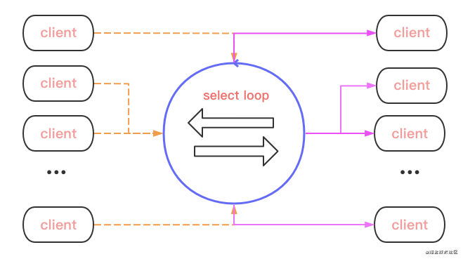
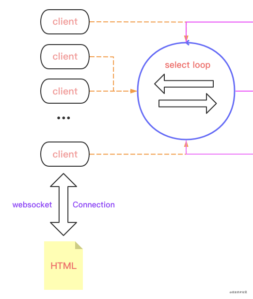

# [用 Go + WebSocket 快速实现一个 chat 服务](https://my.oschina.net/kevwan/blog/5004211)

## 前言

在 `go-zero` 开源之后，非常多的用户询问是否可以支持以及什么时候支持 `websocket`，终于在 `v1.1.6` 里面我们从框架层面让 `websocket` 的支持落地了，下面我们就以 `chat` 作为一个示例来讲解如何用 `go-zero` 来实现一个 `websocket` 服务。

## 整体设计

我们以 `zero-example` 中的 `chat` 聊天室为例来一步步一讲解 `websocket` 的实现，分为如下几个部分：

1. 多客户端接入
2. 消息广播
3. 客户端的及时上线下线
4. 全双工通信【客户端本身是发送端，也是接收端】

先放一张图，大致的数据传输：



中间有个 `select loop` 就是整个 `chat` 的 `engine`。首先要支撑双方通信：

- 得有一个交流数据的管道。客户端只管从 *管道* 读取/输送数据；
- 客户端在线情况。不能说你下线了，还往你那传输数据；

## 数据流

数据流是 `engine` 的主要功能，先不急着看代码，我们先想 `client` 怎么接入并被 `engine` 感知：

1. 首先是从前端发 `websocket` 请求；
2. 建立连接；准备接收/发送通道；
3. 注册到 `engine`；



```go
// HTML 操作 {js}
if (window["WebSocket"]) {
  conn = new WebSocket("ws://" + document.location.host + "/ws");
  conn.onclose = function (evt) {
    var item = document.createElement("div");
    item.innerHTML = "<b>Connection closed.</b>";
    appendLog(item);
  };
  ...
}

// 路由
engine.AddRoute(rest.Route{
  Method: http.MethodGet,
  Path:   "/ws",
  Handler: func(w http.ResponseWriter, r *http.Request) {
    internal.ServeWs(hub, w, r)
  },
})

// 接入逻辑
func ServeWs(hub *Hub, w http.ResponseWriter, r *http.Request) {
  // 将http请求升级为websocket
	conn, err := upgrader.Upgrade(w, r, nil)
	...
  // 构建client：hub{engine}, con{websocker conn}, send{channel buff}
	client := &Client{
		hub:  hub,
		conn: conn,
		send: make(chan []byte, bufSize),
	}
	client.hub.register <- client
  // 开始客户端双工的通信，接收和写入数据
  go client.writePump()
	go client.readPump()
}
```

这样，新接入的 `client` 就被加入到 *注册* 通道中。

## hub engine

发出了 *注册* 的动作，`engine` 会怎么处理呢？

```go
type Hub struct {
	clients map[*Client]bool		// 上线clients
	broadcast chan []byte				// 客户端发送的消息 ->广播给其他的客户端
	register chan *Client			  // 注册channel，接收注册msg
	unregister chan *Client			// 下线channel
}

func (h *Hub) Run() {
	for {
		select {
    // 注册channel：存放到注册表中，数据流也就在这些client中发生
		case client := <-h.register:
			h.clients[client] = true
    // 下线channel：从注册表里面删除
		case client := <-h.unregister:
			if _, ok := h.clients[client]; ok {
				delete(h.clients, client)
				close(client.send)
			}
    // 广播消息：发送给注册表中的client中，send接收到并显示到client上
		case message := <-h.broadcast:
			for client := range h.clients {
				select {
				case client.send <- message:
				default:
					close(client.send)
					delete(h.clients, client)
				}
			}
		}
	}
}
```

1. 接收注册消息 -> 加入全局注册表
2. 如果 `engine.broadcast` 接收到，会将 `msg` 传递给 *注册表* 的 `client.sendChan`

这样从 **HTML -> client -> hub -> other client** 的整个数据流就清晰了。

## 广播数据

上面说到 `engine.broadcast` 接收到数据，那从页面开始，数据是怎么发送到这？

```go
func (c *Client) readPump() {
	...
	for {
    // 1
		_, message, err := c.conn.ReadMessage()
		if err != nil {
			if websocket.IsUnexpectedCloseError(err, websocket.CloseGoingAway, websocket.CloseAbnormalClosure) {
				log.Printf("error: %v", err)
			}
			break
		}
		message = bytes.TrimSpace(bytes.Replace(message, newline, space, -1))
    // 2.
		c.hub.broadcast <- message
	}
}
```

1. 从 `conn` 中不断读取 `msg`【页面点击后传递】
2. 将 `msg` 传入 `engine.broadcast`，从而广播到其他的 `client`
3. 当出现发送异常或者是超时，异常退出时，会触发下线 `client`

同时要知道，此时发送消息的 `client` 不止有一个，可能会有很多个。那发送到其他client，client 从自己的 `send channel` 中读取消息即可：

```go
func (c *Client) writePump() {
  // 写超时控制
	ticker := time.NewTicker(pingPeriod)
  ...
	for {
		select {
		case message, ok := <-c.send:
      // 当接收消息写入时，延长写超时时间。
			c.conn.SetWriteDeadline(time.Now().Add(writeWait))
			...
			w, err := c.conn.NextWriter(websocket.TextMessage)
			...
			w.Write(message)

			// 依次读取 send 中消息，并write
			n := len(c.send)
			for i := 0; i < n; i++ {
				w.Write(newline)
				w.Write(<-c.send)
			}
      ...
		case <-ticker.C:
			c.conn.SetWriteDeadline(time.Now().Add(writeWait))
			...
		}
	}
}
```

上面也说了，`send` 有来自各自客户端中发送的msg：所以当检测到 `send` 有数据，就不断接收消息并写入当前 client；同时当写超时，会检测websocket长连接是否还存活，存活则继续读 `send chan`，断开则直接返回。

## 完整示例代码

[https://github.com/zeromicro/zero-examples/tree/main/chat](https://www.oschina.net/action/GoToLink?url=https%3A%2F%2Fgithub.com%2Fzeromicro%2Fzero-examples%2Ftree%2Fmain%2Fchat)

go-zero示例代码项目：

[https://github.com/zeromicro/zero-examples](https://github.com/zeromicro/zero-examples)

## 总结

本篇文章从使用上介绍如何结合 `go-zero` 开始你的 `websocket` 项目，开发者可以按照自己的需求改造。

关于 `go-zero` 更多的设计和实现文章，可以持续关注我们。

[https://github.com/tal-tech/go-zero](https://www.oschina.net/action/GoToLink?url=https%3A%2F%2Fgithub.com%2Ftal-tech%2Fgo-zero)

https://gitee.com/kevwan/go-zero

欢迎使用 go-zero 并 **star** 支持我们！