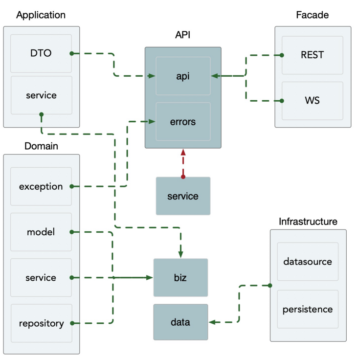

# [用Kratos写项目](https://segmentfault.com/a/1190000040818600)

## A. Kratos快速入门

官方文档中写的比较好，建议大概浏览一遍，点击[此处](https://link.segmentfault.com/?enc=kTYP2SrXHai7QQioPfenog%3D%3D.EXWb4ATlmNZx0AsT%2By6%2FKVsUXjf%2Fgs6BWvr1XQCG%2F3g%3D)查看文档，重点“[快速开始.目录结构](https://link.segmentfault.com/?enc=BLLYUYlO7nKxJejf%2Bqqm3w%3D%3D.Y%2F5nmnHeluNPEvkd7ZUuDAguq8BhTG7EPidWYoHWv%2F36edV9C5PugDth2igw99AF)”、“[快速开始.创建项目](https://link.segmentfault.com/?enc=xgweNRbViH4u3g6BrUcJrw%3D%3D.0WF2JKYxuDKXgtvthN79gRpqndFp7KnFq8K9TpkAtORuzX8aCLnlfAXeUOOij55yPxX1sbj810Ehi8a9WrkRuA%3D%3D)”、“[框架组件](https://link.segmentfault.com/?enc=r8YHuDz2GtMoOujidyzyJA%3D%3D.26oPVh94xxkL7dYR%2F3WurPyB7Ql1IDRONqoFXvAW%2FgDFXec%2BN2%2BDK%2Bi93sl%2FxCfM)”里的内容

### 1. 安装

命令： `go get -u github.com/go-kratos/kratos/cmd/kratos/v2@latest`

### 2. 目录结构与DDD的对应关系

> 这个非常重要，可以从DDD层面上去理解框架的设计和整理我们写代码的思路



## B. 开始写项目吧！

### 1. 初始化项目

#### 创建项目

命令： `kratos new 你的项目`

#### 项目编译和运行

##### 命令行运行方式

```bash
cd 你的项目
make all
kratos run
```

##### Golang运行方式（推荐，支持断点调试）

###### PB文件有更新时需在编译前运行命令如下

命令： `make all`

###### GoBuild配置

|      配置名       |                            设定值                            |
| :---------------: | :----------------------------------------------------------: |
|      RunKind      |                          `Package`                           |
|    PackagePath    |                 `你的项目名/cmd/你的项目名`                  |
| WorkingDirectory  |                    `“你的项目”的绝对路径`                    |
| Go Tool arguments | `-o “你的项目”的绝对路径/bin/server -ldflags "-X main.Version=程序版本-X main.Name=服务名"` |
| Program arguments |                `--conf 你的配置文件绝对路径`                 |

> main.Version和main.Name 在Kratos程序内部中会使用

### 2. 定义API Protocolbuffers

#### 新建PB文件

```bash
cd 你的项目
kratos proto add api/问题域/版本/领域对象.proto
```

##### 名称解析

|   名称   |                             含义                             |
| :------: | :----------------------------------------------------------: |
|  问题域  | 指的是你要处理的这个服务下某一个子问题抽象的名称（建议子问题不要太细） |
|   版本   |                 API的版本，通常为v1、v2、v3                  |
| 领域对象 | 意为你在这个子问题下给出的解法的抽象，一般可以是功能名或者子问题域的核心对象名，根据实际情况而定 |

###### 举个例子：

问题域为`“元数据处理”`，抽象名为`metadata`
版本定为`v1`
处理子问题为`“提供环境数据管理”`，抽象名为`environment`
最终效果为 `api/metadata/v1/environment.proto`

#### 定义PB文件

##### 初始化PB文件示例

生成的PB文件会有基本的curd的，示例如下

```yaml
syntax = "proto3";

package api.metadata.v1;

option go_package = "test/api/metadata/v1;v1";
option java_multiple_files = true;
option java_package = "api.metadata.v1";

service Environment {
        rpc CreateEnvironment (CreateEnvironmentRequest) returns (CreateEnvironmentReply);
        rpc UpdateEnvironment (UpdateEnvironmentRequest) returns (UpdateEnvironmentReply);
        rpc DeleteEnvironment (DeleteEnvironmentRequest) returns (DeleteEnvironmentReply);
        rpc GetEnvironment (GetEnvironmentRequest) returns (GetEnvironmentReply);
        rpc ListEnvironment (ListEnvironmentRequest) returns (ListEnvironmentReply);
}

message CreateEnvironmentRequest {}
message CreateEnvironmentReply {}

message UpdateEnvironmentRequest {}
message UpdateEnvironmentReply {}

message DeleteEnvironmentRequest {}
message DeleteEnvironmentReply {}

message GetEnvironmentRequest {}
message GetEnvironmentReply {}

message ListEnvironmentRequest {}
message ListEnvironmentReply {}
```

##### 添加HTTP支持

初始化文件中仅支持rpc调用，要添加HTTP可以在 service 里具体某个方法中添加以下option

```yaml
option (google.api.http) = {
    $HTTPMethod: "$URL"
};
```

举个例子
Get方法为

```yaml
option (google.api.http) = {
    get: "/api/v1/environment"
};
```

Post方法为

```yaml
option (google.api.http) = {
    post: "/api/v1/environment"
    body: "*" # post 方法必须要的body
};
```

Put方法

```yaml
option (google.api.http) = {
    put: "/api/v1/environment/{id}"
    body: "*"
};
```

Delete方法

```yaml
option (google.api.http) = {
    delete: "/api/v1/environment/{id}"
};
```

##### 关于message的定义

在message可以定义你的请求参数体和返回体，更多的设置语法可以看[这里](https://link.segmentfault.com/?enc=Wrtxii3fp8ArV8rYra%2FJug%3D%3D.vSwAEkNvXVF7KNZvKkqVcUxG8NjZlp%2BmDA82WVBsoP60OaryD%2B4YScoM%2B8G9VumES9cNJOU7nqeJRo91TPdTrw%3D%3D)， 简单示例如下

```yaml
message UpdateEnvironmentRequest {
  int32 id = 1 [(validate.rules).int32 = {gt:0}];
  string name = 2 [(validate.rules).string.min_len = 1];
  string cnName = 3;
  int32  product_id = 4;
  string region_name = 5;
}

message UpdateEnvironmentReply {
  int32 code = 1;
  string message = 2;
}
```

###### 关于参数验证

在使用 validate 之前首先需要安装 `[proto-gen-validate](https://github.com/envoyproxy/protoc-gen-validate)`
命令：`go get -d github.com/envoyproxy/protoc-gen-validate`
需要在pb文件头部导入 `validate.proto文件`,既 `import "validate/validate.proto"`;

具体验证语法，可查看[此处](https://link.segmentfault.com/?enc=eR223%2F4aCUXZz6kp6Gsw2g%3D%3D.2oVhaEiCdiYoEEiwDasgqFRMy5Ltb8f4hE2mZjWOUfR0Ro9%2FdSjc7bMTes1DqGqaLgOtmaA%2BWfOzameaBe3rWQ%3D%3D)，或查看[kratos官网的参数校验文档](https://link.segmentfault.com/?enc=HbqeCY2zFe9hxQTh3KIEfQ%3D%3D.KixbhWfkbeCgPrEHNpzEUF9D%2FcyHS3U0qkzd1fuHSdjLQFnc4hlBIkVo1O49Od9BhRSeaxSKnnTBAKvTnyKnjQ%3D%3D)

##### 生成API代码&文档

在你的项目的根目录下运行命令
命令：`make api`
运行完后会发现原先定义的文档里新增了`Go文件`以及`SwaggerJson文件`，对应的是代码以及文档文件

### 3. 编写Service

#### 根据pb生成Service代码

运行命令，即可生成代码
命令：`kratos proto server PB文件 -t internal/service`
生成代码后，即可在`internal/service`中编写你的逻辑
service一般仅编写 DTO 和 DO转换逻辑代码，不会涉及到业务逻辑代码

#### 注册Service

Kratos新增一个Service注册，会比较繁琐需注意流程

##### internal/service 注册服务

编写完Service之后，需要在`internal/service/service.go`中注册`服务New方法`
这里kratos运用wire作为依赖注入
示例如下

```go
package service

import (
    "github.com/google/wire"
)

// ProviderSet is service providers.
var ProviderSet = wire.NewSet(
      NewEnvironmentService,
)
```

##### server/http、 server/grpc 注册服务

更改 server/http 的 NewHTTPServer方法 加入你的服务类对象，grpc同理
示例如下

```go
func NewHTTPServer(c *conf.Server, environment *metadataSrv.EnvironmentService, logger log.Logger) *http.Server {
  
    ...
    ...
    // 必须加入以下代码完成注册
    metdataV1.RegisterEnvironmentHTTPServer(srv, environment)
}
```

### 4. 编写Biz

#### 定义DO

根据你自身处理的子问题领域抽象，设计字段
注意DO定义不代表PO，DO主要围绕如何实现业务逻辑去思考，也就更多是操作、实体与实体、实体与值对象的关系梳理，对于数据的存储并不在这里考虑
示例

```go
type Environment struct {
    ID        int32
    Name      string
    CnName    string
    Signature string
    Product   *Product
    Region    *Region
    CreatedAt int64
    UpdatedAt int64
}
```

#### 定义Repository接口

Repository主要负责持久化数据存储、读取等问题，因DO在这样的设计上，对应到底层的PO可能是1对N的关系，为了让这些对上层解耦，抽象出Repository层来管理持久化数据的生命周期

抽象成接口是为了与管理持久化数据的实现解耦，因为持久化数据的存储引擎有可以是mysql、mongodb，而加了这层之后上层就无须关心了

接口在biz定义的思考在于下层变化不应该影响上层，所以该定义由上层决定，下层实现，有利于屏蔽该影响。

当然就可以理解成“上层仅需知道自己要什么，但不需要知道怎么来”
示例

```go
type EnvironmentRepo interface {
    CreateEnvironment(ctx context.Context, product *Environment) error
    UpdateEnvironment(ctx context.Context, id int32, product *Environment) error
    DeleteEnvironment(ctx context.Context, id int32) error
    GetEnvironment(ctx context.Context, id int32) (*Environment, error)
    ListEnvironment(ctx context.Context, page, pageSize int32, names []string, productNames []string) ([]*Environment, int32, error)
}
```

#### 编写业务逻辑

这里采用了贫血模型，对于面向过程的GO语言实现来说极其友好
声明UseCase来实现逻辑，示例

```go
type EnvironmentUseCase struct {
    repo EnvironmentRepo
    log  *log.Helper
}
```

在此UseCase绑定方法实现业务逻辑代码即可，逻辑实现注重组装业务流程，数据处理，完成业务目标

#### 注册UseCase

编写完一个UseCase后，需要在biz/biz.go中加入该UseCase的New方法，完成注册
示例

```go
package biz

import (
    "github.com/google/wire"
)

// ProviderSet is biz providers.
var ProviderSet = wire.NewSet(
    NewEnvironmentUseCase,
}
```

## 5. 编写Data

### 定义PO

这里需要注意你自身选择的ORM，当前我使用的是EntORM，出至Facebook，采用定义生成静态代码的形式提供ORM功能，功能不黑盒，容易调试，暂时对比GORM的反射实现的黑盒运行，更喜欢Ent的透明，这里选择因人而异，最好贴近团队选择。

#### Ent定义生成代码

##### 安装Ent

命令：`go get entgo.io/ent/cmd/ent`

##### 生成Schema文件

在data目录下执行以下命令
命令：`go run entgo.io/ent/cmd/ent init PO名`

##### 更改Schema文件定义字段

###### 增加字段

在 FIelds 方法中 加入字段即可, 示例如下

```go
func (Environment) Fields() []ent.Field {
    return []ent.Field{
        field.String("name").NotEmpty(),
        field.String("cn_name").Default(""),
        field.String("signature").NotEmpty().Unique(),
        field.Int64("created_at").DefaultFunc(func() int64 { return time.Now().Unix() }).Immutable(),
        field.Int64("updated_at").DefaultFunc(func() int64 { return time.Now().Unix() }).UpdateDefault(func() int64 { return time.Now().Unix() }),
    }
}
```

###### 增加实体关系

在 Edges 方法中加入定义即可，这里涉及多对多，1对1，1对多的关系定义，可以查看[这里](https://link.segmentfault.com/?enc=ngsFVAAbrQ7%2FCa14hejBTQ%3D%3D.3if6aY1qPzSMlKcjrer9DhiAalK0s06OP6SzfrcfChNH%2FJhJJVjfa005IPaxAHyFwaOVQSnlwnCrwtlbA8XC9w%3D%3D)，示例如下

```go
func (Environment) Edges() []ent.Edge {
    return []ent.Edge{
        edge.To("product", Product.Type).Unique(),
        edge.To("region", Region.Type).Unique(),
    }
}
// 这里演示的是 一个environment只跟一个 product有关系， 一个environment只跟一个region有关系， 
```

##### 生成静态代码

在data目录中运行命令
命令：`ent generate ./ent/schema`

#### Data类中管理ORMClient

更改data/data.go文件，根据自身所使用的缓存库、数据库库，更改Data结构体字段以及在NewData方法增加它们的初始化逻辑
比如示例如下，我使用Ent、localCache

```go
// Data .
type Data struct {
    // TODO wrapped database client
    db    *ent.Client
    cache *cache.Cache
}

// NewData .
func NewData(c *conf.Data, logger log.Logger) (*Data, func(), error) {
    logHelper := log.NewHelper(logger)

    client, err := ent.Open(
        conf.Database.Driver,
        conf.Database.Source,
    )

    // Run the auto migration tool.
    if err := client.Schema.Create(context.Background()); err != nil {
        logHelper.Errorf("failed creating schema resources: %v", err)
        return nil, nil, err
    }

    var d = &Data{
        db:    client,
        cache: cache.New(c.Cache.Expiration.AsDuration(), c.Cache.CleanupInterval.AsDuration()),
    }
    return d, func() {
        logHelper.Info("message", "closing the data resources")
        if err := d.db.Close(); err != nil {
            logHelper.Error(err)
        }
    }, nil
}
```

#### 依据biz定义的Repo实现逻辑

定义实现类，示例如下

```go
type environmentRepo struct {
    data *Data
    log  *log.Helper
}
```

实现Repository逻辑
接下来只需要实现BIZ定义的Repository接口即可

#### 注册Repository

编写完一个Repo后，需要在data/data.go中加入该Repository的New方法，完成注册
示例

```go
var ProviderSet = wire.NewSet(
    NewData,
    NewEnvironmentRepo,
)
// NewData不能变，是Repo基础依赖库
```

## 6. 更新配置

### 修改配置

kratos统一采用了pb管理conf，所以仅需在`internal/conf/conf.proto`修改配置字段即可

### 更新配置代码

在你的项目根目录下运行以下命令，更新配置代码
命令：`make config`

## 7. 服务依赖重新生成

重新生成依赖注入文件

```bash
cd 你的项目绝对路径/cmd/server/
go run github.com/google/wire/cmd/wire
```

## 8. Reference

[https://go-kratos.dev](https://link.segmentfault.com/?enc=c%2FXdubLWIj8Racw%2FfGZs%2BA%3D%3D.izhDnE6lX%2BMyz%2FB0RuCXzosk2GzUoVLNXAOXGt1HJdk%3D)
[https://github.com/envoyproxy...](https://link.segmentfault.com/?enc=PiYWru7Zw6EYVAjeVX2vbA%3D%3D.cMql7PXsCtxrGBzvofxZMaTssnGPT%2Bkmd5A0TsEuLTK4AUJjgzK9d7UuJp4e%2BKTD3XhL0e%2BtiLm5E1q6V7cvVw%3D%3D)
[https://developers.google.com...](https://link.segmentfault.com/?enc=4ofNP%2FCiWYp8PSk%2F%2FaNXBw%3D%3D.%2FSm3sMfawYT49%2BUuwfzshaNGh9Rue3uIFqsQDhvZYPTo5DMeFGeSFRn%2BhOLaQOFcNHAKRuUsu8kbfkVer%2BakMw%3D%3D)
[https://developers.google.com...](https://link.segmentfault.com/?enc=mYtW6UcSbeFPESva0N3qSA%3D%3D.JaxboodtCvgL%2BbmR3xIxMaz486dKDGBz%2BT1yfIOLZtyjZXfPvFkfX9IExso08gP1GP1v%2F9gUq%2FtXR2NtXSuzMw%3D%3D)
[https://colobu.com/2017/03/16...](https://link.segmentfault.com/?enc=yJwHy5e3I9imaK1qk4ozPA%3D%3D.JvU9kuITK%2FIsjJRUMkNwfgKolYVe09mxYzoNJXMwfL9ADfjKgEem8RAET0HLlSTA%2FP38IAHcEVNEU1b4z6UyQg%3D%3D)
[https://entgo.io/zh/docs/gett...](https://link.segmentfault.com/?enc=Tu%2BUVOx1yfwKPuBpm3rd1Q%3D%3D.zmBPE0o1%2FGqZ99hhU%2BzLkokfptG9l9ckzqn%2Bh%2BkSXICu%2FTWFM3e1KyuwEIRlirzM)