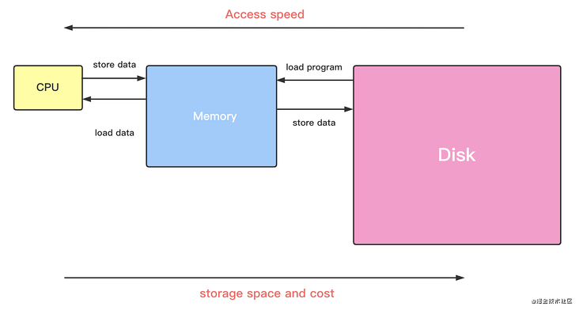
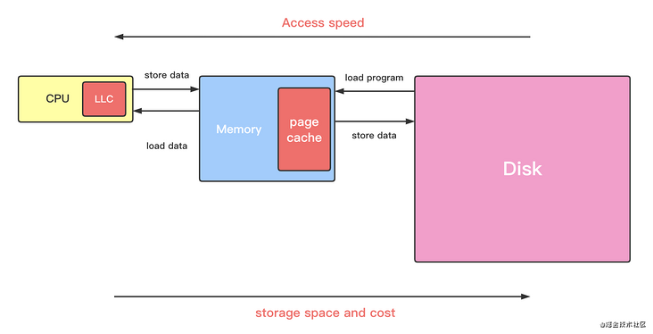
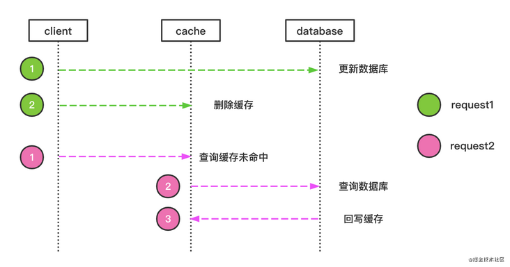
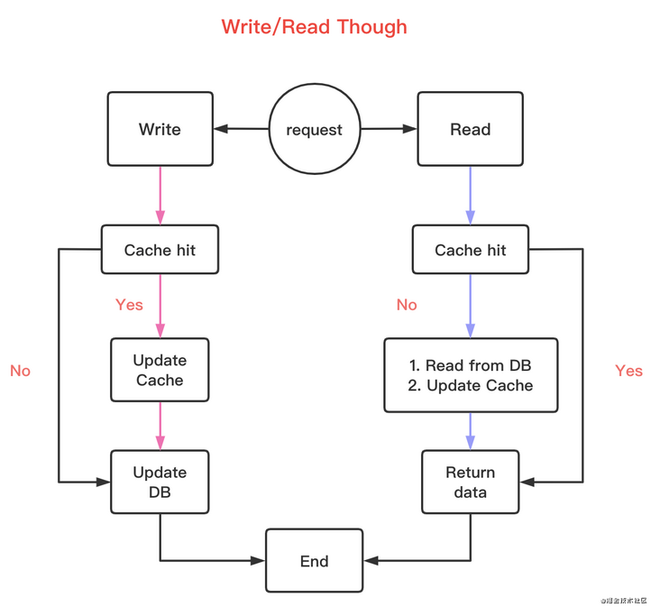
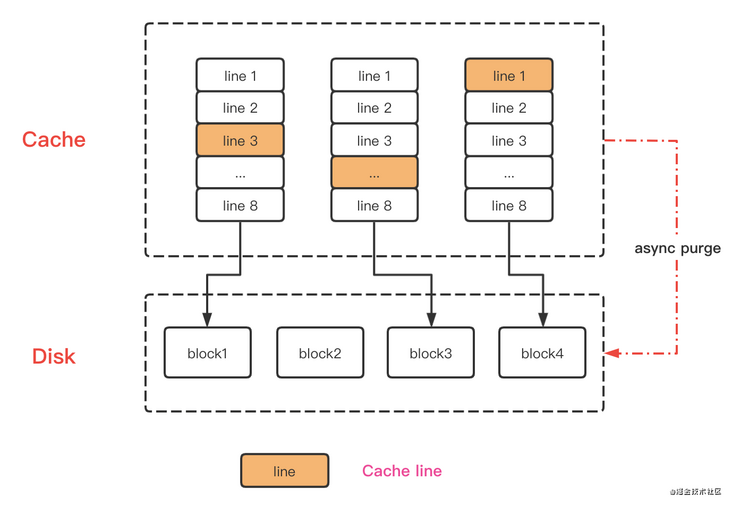
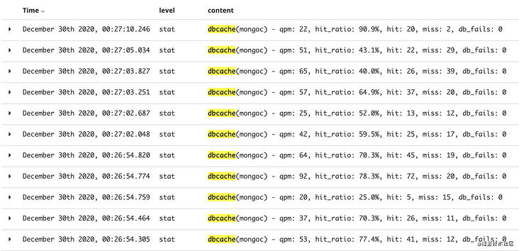
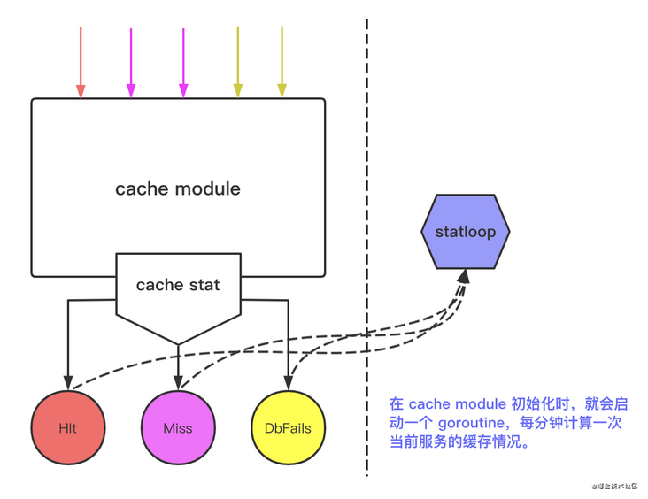

# [缓存原理与微服务缓存自动管理](https://segmentfault.com/a/1190000038734813)

> 抛开业务谈技术都是在耍流氓。—— Kevin Wan

## 为什么需要缓存？

先从一个老生常谈的问题开始谈起：我们的程序是如何运行起来的？

1. 程序存储在 `disk` 中
2. 程序是运行在 `RAM` 之中，也就是我们所说的 `main memory`
3. 程序的计算逻辑在 `CPU` 中执行

来看一个最简单的例子：`a = a + 1`

1. `load x:`
2. `x0 = x0 + 1`
3. `load x0 -> RAM`



上面提到了3种存储介质。我们都知道，三类的读写速度和成本成反比，所以我们在克服速度问题上需要引入一个 **中间层**。这个中间层，需要高速存取的速度，但是成本可接受。于是乎，`Cache` 被引入



而在计算机系统中，有两种默认缓存：

- CPU 里面的末级缓存，即 `LLC`。缓存内存中的数据
- 内存中的高速页缓存，即 `page cache`。缓存磁盘中的数据

## 缓存读写策略

引入 `Cache` 之后，我们继续来看看操作缓存会发生什么。因为存在存取速度的差异「而且差异很大」，从而在操作数据时，延迟或程序失败等都会导致缓存和实际存储层数据不一致。

我们就以标准的 `Cache+DB` 来看看经典读写策略和应用场景。

### Cache Aside

先来考虑一种最简单的业务场景，比如用户表：`userId:用户id, phone:用户电话token，avtoar:用户头像url`，缓存中我们用 `phone` 作为key存储用户头像。当用户修改头像url该如何做？

1. 更新`DB`数据，再更新`Cache` 数据
2. 更新 `DB` 数据，再删除 `Cache` 数据

首先 **变更数据库** 和 **变更缓存** 是两个独立的操作，而我们并没有对操作做任何的并发控制。那么当两个线程并发更新它们的时候，就会因为写入顺序的不同造成数据不一致。

所以更好的方案是 `2`：

- 更新数据时不更新缓存，而是直接删除缓存
- 后续的请求发现缓存缺失，回去查询 `DB` ，并将结果 `load cache`



这个策略就是我们使用缓存最常见的策略：`Cache Aside`。这个策略数据以数据库中的数据为准，缓存中的数据是按需加载的，分为读策略和写策略。

但是可见的问题也就出现了：频繁的读写操作会导致 `Cache` 反复地替换，缓存命中率降低。当然如果在业务中对命中率有监控报警时，可以考虑以下方案：

1. 更新数据时同时更新缓存，但是在更新缓存前加一个 **分布式锁**。这样同一时间只有一个线程操作缓存，解决了并发问题。同时在后续读请求中时读到最新的缓存，解决了不一致的问题。
2. 更新数据时同时更新缓存，但是给缓存一个较短的 `TTL`。

当然除了这个策略，在计算机体系还有其他几种经典的缓存策略，它们也有各自适用的使用场景。

### Write Through

先查询写入数据key是否击中缓存，如果在 -> 更新缓存，同时缓存组件同步数据至DB；不存在，则触发 `Write Miss`。

而一般 `Write Miss` 有两种方式：

- `Write Allocate`：写时直接分配 `Cache line`
- `No-write allocate`：写时不写入缓存，直接写入DB，return

在 `Write Through` 中，一般采取 `No-write allocate` 。因为其实无论哪种，最终数据都会持久化到DB中，省去一步缓存的写入，提升写性能。而缓存由 `Read Through `写入缓存。



这个策略的核心原则：**用户只与缓存打交道，由缓存组件和DB通信，写入或者读取数据**。在一些本地进程缓存组件可以考虑这种策略。

### Write Back

相信你也看出上述方案的缺陷：写数据时缓存和数据库同步，但是我们知道这两块存储介质的速度差几个数量级，对写入性能是有很大影响。那我们是否异步更新数据库？

`Write back` 就是在写数据时只更新该 `Cache Line` 对应的数据，并把该行标记为 `Dirty`。在读数据时或是在缓存满时换出「缓存替换策略」时，将 `Dirty` 写入存储。

需要注意的是：在 `Write Miss` 情况下，采取的是 `Write Allocate`，即写入存储同时写入缓存，这样我们在之后的写请求只需要更新缓存。



> `async purge` 此类概念其实存在计算机体系中。`Mysql` 中刷脏页，本质都是尽可能防止随机写，统一写磁盘时机。

## Redis

`Redis`是一个独立的系统软件，和我们写的业务程序是两个软件。当我们部署了`Redis` 实例后，它只会被动地等待客户端发送请求，然后再进行处理。所以，如果应用程序想要使用 `Redis` 缓存，我们就要在程序中增加相应的缓存操作代码。所以我们也把 `Redis` 称为 **旁路缓存**，也就是说：读取缓存、读取数据库和更新缓存的操作都需要在应用程序中来完成。

而作为缓存的 `Redis`，同样需要面临常见的问题：

- 缓存的容量终究有限
- 上游并发请求冲击
- 缓存与后端存储数据一致性

### 替换策略

一般来说，缓存对于选定的被淘汰数据，会根据其是干净数据还是脏数据，选择直接删除还是写回数据库。但是，在 Redis 中，被淘汰数据无论干净与否都会被删除，所以，这是我们在使用 Redis 缓存时要特别注意的：当数据修改成为脏数据时，需要在数据库中也把数据修改过来。

所以不管替换策略是什么，脏数据有可能在换入换出中丢失。那我们在产生脏数据就应该删除缓存，而不是更新缓存，一切数据应该以数据库为准。这也很好理解，缓存写入应该交给读请求来完成；写请求尽可能保证数据一致性。

至于替换策略有哪些，网上已经有很多文章归纳之间的优劣，这里就不再赘述。

### ShardCalls

并发场景下，可能会有多个线程（协程）同时请求同一份资源，如果每个请求都要走一遍资源的请求过程，除了比较低效之外，还会对资源服务造成并发的压力。

`go-zero` 中的 `ShardCalls` 可以使得同时多个请求只需要发起一次拿结果的调用，其他请求"坐享其成"，这种设计有效减少了资源服务的并发压力，可以有效防止缓存击穿。

对于防止暴增的接口请求对下游服务造成瞬时高负载，可以在你的函数包裹：

```go
fn = func() (interface{}, error) {
  // 业务查询
}
data, err = g.Do(apiKey, fn)
// 就获得到data，之后的方法或者逻辑就可以使用这个data
```

其实原理也很简单：

```go
func (g *sharedGroup) Do(key string, fn func() (interface{}, error)) (interface{}, error) {
  // done: false，才会去执行下面的业务逻辑；为 true，直接返回之前获取的data
  c, done := g.createCall(key)
  if done {
    return c.val, c.err
  }
  
  // 执行调用者传入的业务逻辑
  g.makeCall(c, key, fn)
  return c.val, c.err
}

func (g *sharedGroup) createCall(key string) (c *call, done bool) {
  // 只让一个请求进来进行操作
  g.lock.Lock()
  // 如果携带标示一系列请求的key在 calls 这个map中已经存在，
  // 则解锁并同时等待之前请求获取数据，返回
  if c, ok := g.calls[key]; ok {
    g.lock.Unlock()
    c.wg.Wait()
    return c, true
  }
  
  // 说明本次请求是首次请求
  c = new(call)
  c.wg.Add(1)
  // 标注请求，因为持有锁，不用担心并发问题
  g.calls[key] = c
  g.lock.Unlock()

  return c, false
}
```

这种 `map+lock` 存储并限制请求操作，和[groupcache](https://link.segmentfault.com/?enc=iSxKjOFuVqSxS5QcAhlvIQ%3D%3D.N4Ss1X0lryf7F42BigOAQ9p75H%2F5vW0aBF66VyoZZFF3k%2BOm0HmsBA9GR0nRkAXl%2FfzoTQpaYEYXOyrRbaTQNg%3D%3D)中的 `singleflight` 类似，都是防止缓存击穿的利器

> 源码地址：[sharedcalls.go](https://link.segmentfault.com/?enc=pGZML17U5dPIYH46K6c90g%3D%3D.s8hJ2Ruq%2FP3jhvLW4dmtfsTxfHOfiNJrKH1gYds9EnGuXqrlHD%2FHVOf3RR2jXnuDIoTyiWb2lCxEmiXew2K21HtBaY0uJ9WqyTxFb6KI5Qg%3D)

### 缓存和存储更新顺序

这是开发中常见纠结问题：**到底是先删除缓存还是先更新存储？**

> 情况一：先删除缓存，再更新存储；
>
> - `A` 删除缓存，更新存储时网络延迟
> - `B` 读请求，发现缓存缺失，读存储 -> 此时读到旧数据

这样会产生两个问题：

- `B` 读取旧值
- `B` 同时读请求会把旧值写入缓存，导致后续读请求读到旧值

既然是缓存可能是旧值，那就不管删除。有一个并不优雅的解决方案：**在写请求更新完存储值以后，`sleep()` 一小段时间，再进行一次缓存删除操作**。

`sleep` 是为了确保读请求结束，写请求可以删除读请求造成的缓存脏数据，当然也要考虑到 redis 主从同步的耗时。不过还是要根据实际业务而定。

这个方案会在第一次删除缓存值后，延迟一段时间再次进行删除，被称为：**延迟双删**。

> 情况二：先更新数据库值，再删除缓存值：
>
> - `A` 删除存储值，但是删除缓存网络延迟
> - `B` 读请求时，缓存击中，就直接返回旧值

这种情况对业务的影响较小，而绝大多数缓存组件都是采取此种更新顺序，满足最终一致性要求。

> 情况三：新用户注册，直接写入数据库，同时缓存中肯定没有。如果程序此时读从库，由于主从延迟，导致读取不到用户数据。

这种情况就需要针对 `Insert` 这种操作：插入新数据入数据库同时写缓存。使得后续读请求可以直接读缓存，同时因为是刚插入的新数据，在一段时间修改的可能性不大。

**以上方案在复杂的情况或多或少都有潜在问题，需要贴合业务做具体的修改**。

## 如何设计好用的缓存操作层？

上面说了这么多，回到我们开发角度，如果我们需要考虑这么多问题，显然太麻烦了。所以如何把这些缓存策略和替换策略封装起来，简化开发过程？

明确几点：

- 将业务逻辑和缓存操作分离，留给开发这一个写入逻辑的点
- 缓存操作需要考虑流量冲击，缓存策略等问题。。。

我们从读和写两个角度去聊聊 `go-zero `是如何封装。

### QueryRow

```go
// res: query result
// cacheKey: redis key
err := m.QueryRow(&res, cacheKey, func(conn sqlx.SqlConn, v interface{}) error {
  querySQL := `select * from your_table where campus_id = ? and student_id = ?`
  return conn.QueryRow(v, querySQL, campusId, studentId)
})
```

我们将开发查询业务逻辑用 `func(conn sqlx.SqlConn, v interface{})` 封装。用户无需考虑缓存写入，只需要传入需要写入的 `cacheKey`。同时把查询结果 `res` 返回。

那缓存操作是如何被封装在内部呢？来看看函数内部：

```go
func (c cacheNode) QueryRow(v interface{}, key string, query func(conn sqlx.SqlConn, v interface{}) error) error {
 cacheVal := func(v interface{}) error {
  return c.SetCache(key, v)
 }
 // 1. cache hit -> return
  // 2. cache miss -> err
 if err := c.doGetCache(key, v); err != nil {
    // 2.1 err defalut val {*}
  if err == errPlaceholder {
   return c.errNotFound
  } else if err != c.errNotFound {
   return err
  }
  // 2.2 cache miss -> query db
    // 2.2.1 query db return err {NotFound} -> return err defalut val「see 2.1」
  if err = query(c.db, v); err == c.errNotFound {
   if err = c.setCacheWithNotFound(key); err != nil {
    logx.Error(err)
   }

   return c.errNotFound
  } else if err != nil {
   c.stat.IncrementDbFails()
   return err
  }
  // 2.3 query db success -> set val to cache
  if err = cacheVal(v); err != nil {
   logx.Error(err)
   return err
  }
 }
 // 1.1 cache hit -> IncrementHit
 c.stat.IncrementHit()

 return nil
}
```


从流程上恰好对应缓存策略中的：`Read Through`。

> 源码地址：[cachedsql.go](https://link.segmentfault.com/?enc=IqBFF%2F8IPRYcBhf8XUUXog%3D%3D.dv6t8rz8oUr0ZbbNKPry80Tql9YJilgnr4YF4aez5ayko1HUTGwmf0iyFUDgB7AnuK%2FVzUWx95OCDCIt%2FXTrLfpmRObLtB%2B7pO9xFRnxJVjBgynQYBSBhafXJXxNhwE9)

### Exec

而写请求，使用的就是之前缓存策略中的 `Cache Aside` -> 先写数据库，再删除缓存。

```go
_, err := m.Exec(func(conn sqlx.SqlConn) (result sql.Result, err error) {
  execSQL := fmt.Sprintf("update your_table set %s where 1=1", m.table, AuthRows)
  return conn.Exec(execSQL, data.RangeId, data.AuthContentId)
}, keys...)

func (cc CachedConn) Exec(exec ExecFn, keys ...string) (sql.Result, error) {
 res, err := exec(cc.db)
 if err != nil {
  return nil, err
 }

 if err := cc.DelCache(keys...); err != nil {
  return nil, err
 }

 return res, nil
}
```

和 `QueryRow` 一样，调用者只需要负责业务逻辑，缓存写入和删除对调用透明。

> 源码地址：[cachedsql.go](https://link.segmentfault.com/?enc=zniAY4rm66VOdIvp5yeMpQ%3D%3D.U3AcZV02DJpHIU0L6JtbIdhtPli0qkVENKLRGxQpbGxJYJWjknyIIMjqxOVl20v7AE3HaSDj6o3h6PcBLJDPmaoEKE7Q4j1AGLQUCXMwvMyrzgFEfAosiMLFeQvAJ39t)

## 线上的缓存

开篇第一句话：脱离业务将技术都是耍流氓。以上都是在对缓存模式分析，但是实际业务中缓存是否起到应有的加速作用？最直观就是缓存击中率，而如何观测到服务的缓存击中？这就涉及到监控。

下图是我们线上环境的某个服务的缓存记录情况：



还记得上面 `QueryRow` 中：查询缓存击中，会调用 `c.stat.IncrementHit()`。其中的 `stat` 就是作为监控指标，不断在计算击中率和失败率。



> 源码地址：[cachestat.go](https://link.segmentfault.com/?enc=nabDwtWfh%2F5bfm7q8S5FJw%3D%3D.kcQi1%2Fai3feVVXKRltXk%2BewAA4kr2Y3O1xZHJHys7YX7X2L8zS3bE7RFAd%2BT2ycdl20XGnCb2V65mIXhNGMIcD99B69c2s95WD5if8ZXGRiuoIEzBeSSH%2FrHcwtKfFp3)

在其他的业务场景中：比如首页信息浏览业务中，大量请求不可避免。所以缓存首页的信息在用户体验上尤其重要。但是又不像之前提到的一些单一的key，这里可能涉及大量消息，这个时候就需要其他缓存类型加入：

1. 拆分缓存：可以分 `消息id` -> 由 `消息id` 查询消息，并缓存插入`消息list`中。
2. 消息过期：设置消息过期时间，做到不占用过长时间缓存。

这里也就是涉及缓存的最佳实践：

- 不允许不过期的缓存「尤为重要」
- 分布式缓存，易伸缩
- 自动生成，自带统计

## 总结

本文从缓存的引入，常见缓存读写策略，如何保证数据的最终一致性，如何封装一个好用的缓存操作层，也展示了线上缓存的情况以及监控。所有上面谈到的这些缓存细节都可以参考 `go-zero` 源码实现，见 `go-zero` 源码的 `core/stores`。