# [缓存设计的好，服务基本不会倒](https://segmentfault.com/a/1190000039176587)

> 本文由『Go开源说』第四期 go-zero 直播内容修改整理而成，视频内容较长，拆分成上下篇，本文内容有所删减和重构。

大家好，很高兴来到“GO开源说” 跟大家分享开源项目背后的一些故事、设计思想以及使用方法，今天分享的项目是 go-zero，一个集成了各种工程实践的 web 和 rpc 框架。我是Kevin，go-zero 作者，我的 github id 是 [kevwan](https://link.segmentfault.com/?enc=wsFbB32Yuet%2F8Ux9fOU1%2Bg%3D%3D.4LT5lJeH4bKhT9jlbFwNCp3Nw1s%2FScJkVQKh%2BOv0HpM%3D)。

## go-zero 概览

go-zero 虽然是20年8月7号才开源，但是已经经过线上大规模检验了，也是我近20年工程经验的积累，开源后得到社区的积极反馈，在5个多月的时间里，获得了6k stars。多次登顶github Go语言日榜、周榜、月榜榜首，并获得了gitee最有价值项目（GVP），开源中国年度最佳人气项目。同时微信社区极为活跃，3000+人的社区群，go-zero爱好者们一起交流go-zero使用心得和讨论使用过程中的问题。

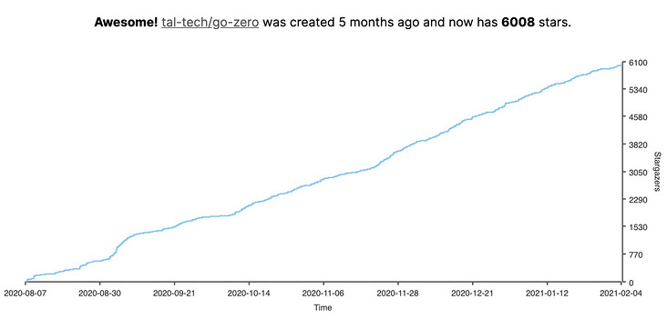

## go-zero 如何自动管理缓存？

### 缓存设计原理

我们对缓存是只删除，不做更新，一旦DB里数据出现修改，我们就会直接删除对应的缓存，而不是去更新。

我们看看删除缓存的顺序怎样才是正确的。

- 先删除缓存，再更新DB

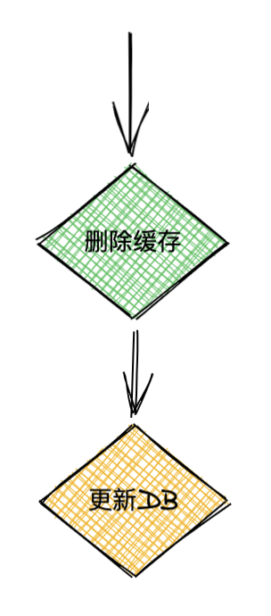

我们看两个并发请求的情况，A请求需要更新数据，先删除了缓存，然后B请求来读取数据，此时缓存没有数据，就会从DB加载数据并写回缓存，然后A更新了DB，那么此时缓存内的数据就会一直是脏数据，知道缓存过期或者有新的更新数据的请求。如图

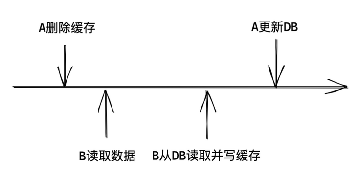

- 先更新DB，再删除缓存

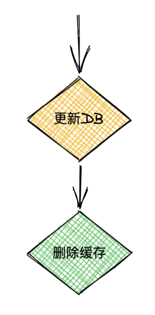

A请求先更新DB，然后B请求来读取数据，此时返回的是老数据，此时可以认为是A请求还没更新完，最终一致性，可以接受，然后A删除了缓存，后续请求都会拿到最新数据，如图

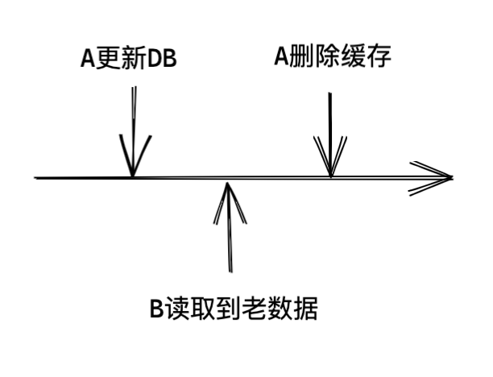

让我们再来看一下正常的请求流程：

1. 第一个请求更新DB，并删除了缓存
2. 第二个请求读取缓存，没有数据，就从DB读取数据，并回写到缓存里
3. 后续读请求都可以直接从缓存读取

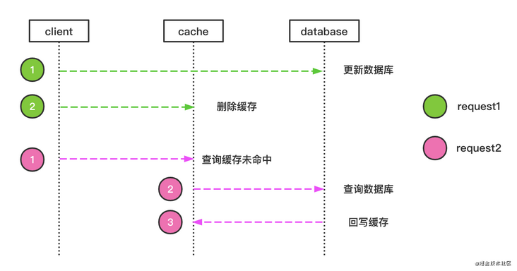

我们再看一下DB查询有哪些情况，假设行记录里有ABCDEFG七列数据：

1. 只查询部分列数据的请求，比如请求其中的ABC，CDE或者EFG等，如图

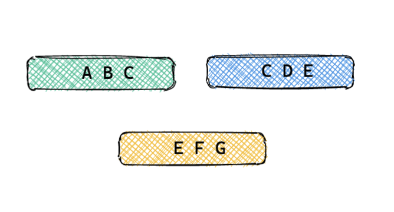

1. 查询单条完整行记录，如图

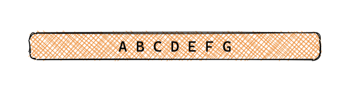

1. 查询多条行记录的部分或全部列，如图

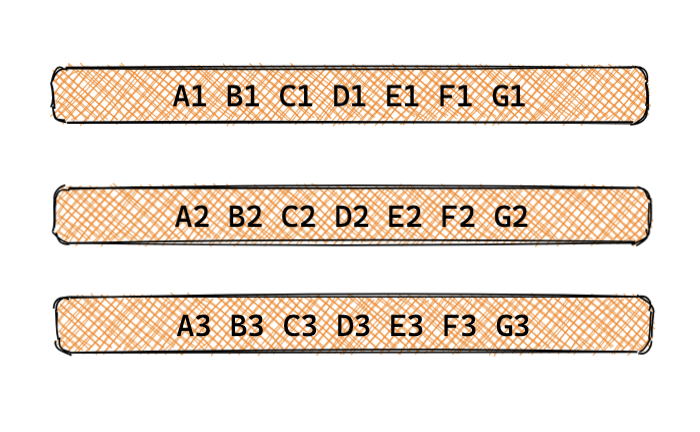

对于上面三种情况，首先，我们不用部分查询，因为部分查询没法缓存，一旦缓存了，数据有更新，没法定位到有哪些数据需要删除；其次，对于多行的查询，根据实际场景和需要，我们会在业务层建立对应的从查询条件到主键的映射；而对于单行完整记录的查询，go-zero 内置了完整的缓存管理方式。所以核心原则是：**go-zero 缓存的一定是完整的行记录**。

下面我们来详细介绍 go-zero 内置的三种场景的缓存处理方式：

1. 基于主键的缓存

   ```sql
   PRIMARY KEY (`id`)
   ```

   这种相对来讲是最容易处理的缓存，只需要在 `redis` 里用 `primary key` 作为 `key` 来缓存行记录即可。

2. 基于唯一索引的缓存

   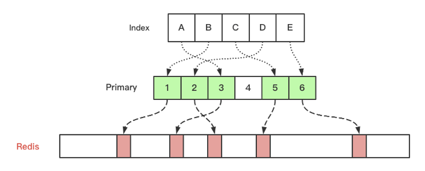

   在做基于索引的缓存设计的时候我借鉴了 `database` 索引的设计方法，在 `database` 设计里，如果通过索引去查数据时，引擎会先在 `索引->主键` 的 `tree` 里面查找到主键，然后再通过主键去查询行记录，就是引入了一个间接层去解决索引到行记录的对应问题。在 go-zero 的缓存设计里也是同样的原理。

   基于索引的缓存又分为单列唯一索引和多列唯一索引：

   - 单列唯一索引如下：

     ```sql
     UNIQUE KEY `product_idx` (`product`)
     ```

   - 多列唯一索引如下：

     ```sql
     UNIQUE KEY `vendor_product_idx` (`vendor`, `product`)
     ```

   但是对于 go-zero 来说，单列和多列只是生成缓存 `key` 的方式不同而已，背后的控制逻辑是一样的。然后 go-zero 内置的缓存管理就比较好的控制了数据一致性问题，同时也内置防止了缓存的击穿、穿透、雪崩问题（这些在 gopherchina 大会上分享的时候仔细讲过，见后续 gopherchina 分享视频）。

   另外，go-zero 内置了缓存访问量、访问命中率统计，如下所示：

   ```yaml
   dbcache(sqlc) - qpm: 5057, hit_ratio: 99.7%, hit: 5044, miss: 13, db_fails: 0
   ```

   可以看到比较详细的统计信息，便于我们来分析缓存的使用情况，对于缓存命中率极低或者请求量极小的情况，我们就可以去掉缓存了，这样也可以降低成本。

### 缓存代码解读

#### 1. 基于主键的缓存逻辑

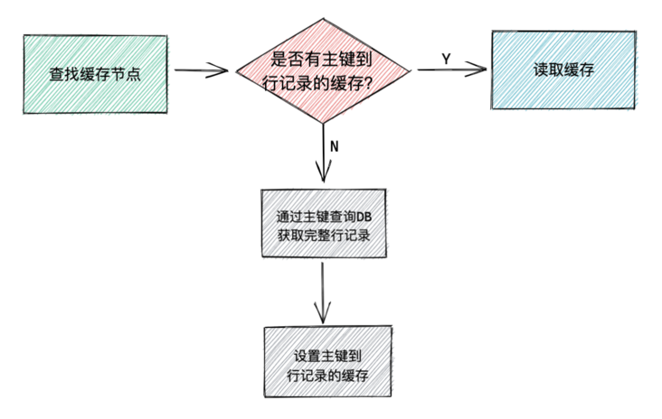

具体实现代码如下：

```go
func (cc CachedConn) QueryRow(v interface{}, key string, query QueryFn) error {
  return cc.cache.Take(v, key, func(v interface{}) error {
    return query(cc.db, v)
  })
}
```

这里的 `Take` 方法是先从缓存里去通过 `key` 拿数据，如果拿到就直接返回，如果拿不到，那么就通过 `query` 方法去 `DB` 读取完整行记录并写回缓存，然后再返回数据。整个逻辑还是比较简单易懂的。

我们详细看看 `Take` 的实现：

```go
func (c cacheNode) Take(v interface{}, key string, query func(v interface{}) error) error {
  return c.doTake(v, key, query, func(v interface{}) error {
    return c.SetCache(key, v)
  })
}
```

`Take` 的逻辑如下：

- 用 `key` 从缓存里查找数据
- 如果找到，则返回数据
- 如果找不到，用 `query` 方法去读取数据
- 读到后调用 `c.SetCache(key, v)` 设置缓存

其中的 `doTake` 代码和解释如下：

```go
// v - 需要读取的数据对象
// key - 缓存key
// query - 用来从DB读取完整数据的方法
// cacheVal - 用来写缓存的方法
func (c cacheNode) doTake(v interface{}, key string, query func(v interface{}) error,
  cacheVal func(v interface{}) error) error {
  // 用barrier来防止缓存击穿，确保一个进程内只有一个请求去加载key对应的数据
  val, fresh, err := c.barrier.DoEx(key, func() (interface{}, error) {
    // 从cache里读取数据
    if err := c.doGetCache(key, v); err != nil {
      // 如果是预先放进来的placeholder（用来防止缓存穿透）的，那么就返回预设的errNotFound
      // 如果是未知错误，那么就直接返回，因为我们不能放弃缓存出错而直接把所有请求去请求DB，
      // 这样在高并发的场景下会把DB打挂掉的
      if err == errPlaceholder {
        return nil, c.errNotFound
      } else if err != c.errNotFound {
        // why we just return the error instead of query from db,
        // because we don't allow the disaster pass to the DBs.
        // fail fast, in case we bring down the dbs.
        return nil, err
      }

      // 请求DB
      // 如果返回的error是errNotFound，那么我们就需要在缓存里设置placeholder，防止缓存穿透
      if err = query(v); err == c.errNotFound {
        if err = c.setCacheWithNotFound(key); err != nil {
          logx.Error(err)
        }

        return nil, c.errNotFound
      } else if err != nil {
        // 统计DB失败
        c.stat.IncrementDbFails()
        return nil, err
      }

      // 把数据写入缓存
      if err = cacheVal(v); err != nil {
        logx.Error(err)
      }
    }
    
    // 返回json序列化的数据
    return jsonx.Marshal(v)
  })
  if err != nil {
    return err
  }
  if fresh {
    return nil
  }

  // got the result from previous ongoing query
  c.stat.IncrementTotal()
  c.stat.IncrementHit()

  // 把数据写入到传入的v对象里
  return jsonx.Unmarshal(val.([]byte), v)
}
```

#### 2. 基于唯一索引的缓存逻辑

因为这块比较复杂，所以我用不同颜色标识出来了响应的代码块和逻辑，`block 2` 其实跟基于主键的缓存是一样的，这里主要讲 `block 1` 的逻辑。

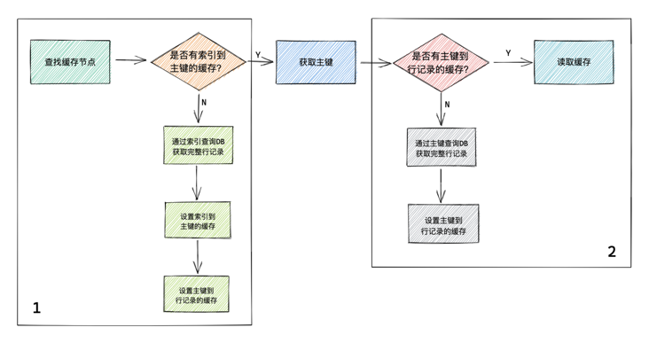

代码块的 `block 1` 部分分为两种情况：

1. 通过索引能够从缓存里找到主键

   此时就直接用主键走 `block 2` 的逻辑了，后续同上面基于主键的缓存逻辑

2. 通过索引无法从缓存里找到主键

   - 通过索引从DB里查询完整行记录，如有 `error`，返回
   - 查到完整行记录后，会把主键到完整行记录的缓存和索引到主键的缓存同时写到 `redis` 里
   - 返回所需的行记录数据

   ```go
   // v - 需要读取的数据对象
   // key - 通过索引生成的缓存key
   // keyer - 用主键生成基于主键缓存的key的方法
   // indexQuery - 用索引从DB读取完整数据的方法，需要返回主键
   // primaryQuery - 用主键从DB获取完整数据的方法
   func (cc CachedConn) QueryRowIndex(v interface{}, key string, keyer func(primary interface{}) string,
     indexQuery IndexQueryFn, primaryQuery PrimaryQueryFn) error {
     var primaryKey interface{}
     var found bool
   
     // 先通过索引查询缓存，看是否有索引到主键的缓存
     if err := cc.cache.TakeWithExpire(&primaryKey, key, func(val interface{}, expire time.Duration) (err error) {
       // 如果没有索引到主键的缓存，那么就通过索引查询完整数据
       primaryKey, err = indexQuery(cc.db, v)
       if err != nil {
         return
       }
   
       // 通过索引查询到了完整数据，设置found，后面直接使用，不需要再从缓存读取数据了
       found = true
       // 将主键到完整数据的映射保存到缓存里，TakeWithExpire方法已经将索引到主键的映射保存到缓存了
       return cc.cache.SetCacheWithExpire(keyer(primaryKey), v, expire+cacheSafeGapBetweenIndexAndPrimary)
     }); err != nil {
       return err
     }
   
     // 已经通过索引找到了数据，直接返回即可
     if found {
       return nil
     }
   
     // 通过主键从缓存读取数据，如果缓存没有，通过primaryQuery方法从DB读取并回写缓存再返回数据
     return cc.cache.Take(v, keyer(primaryKey), func(v interface{}) error {
       return primaryQuery(cc.db, v, primaryKey)
     })
   }
   ```

   我们来看一个实际的例子

   ```go
   func (m *defaultUserModel) FindOneByUser(user string) (*User, error) {
     var resp User
     // 生成基于索引的key
     indexKey := fmt.Sprintf("%s%v", cacheUserPrefix, user)
     
     err := m.QueryRowIndex(&resp, indexKey,
       // 基于主键生成完整数据缓存的key
       func(primary interface{}) string {
         return fmt.Sprintf("user#%v", primary)
       },
       // 基于索引的DB查询方法
       func(conn sqlx.SqlConn, v interface{}) (i interface{}, e error) {
         query := fmt.Sprintf("select %s from %s where user = ? limit 1", userRows, m.table)
         if err := conn.QueryRow(&resp, query, user); err != nil {
           return nil, err
         }
         return resp.Id, nil
       },
       // 基于主键的DB查询方法
       func(conn sqlx.SqlConn, v, primary interface{}) error {
         query := fmt.Sprintf("select %s from %s where id = ?", userRows, m.table)
         return conn.QueryRow(&resp, query, primary)
       })
     
     // 错误处理，需要判断是否返回的是sqlc.ErrNotFound，如果是，我们用本package定义的ErrNotFound返回
     // 避免使用者感知到有没有使用缓存，同时也是对底层依赖的隔离
     switch err {
       case nil:
         return &resp, nil
       case sqlc.ErrNotFound:
         return nil, ErrNotFound
       default:
         return nil, err
     }
   }
   ```

所有上面这些缓存的自动管理代码都是可以通过 goctl 自动生成的，我们团队内部 `CRUD` 和缓存基本都是通过 goctl 自动生成的，可以节省大量开发时间，并且缓存代码本身也是非常容易出错的，即使有很好的代码经验，也很难每次完全写对，所以我们推荐尽可能使用自动的缓存代码生成工具去避免错误。

## Need more?

如果你想要更好的了解 go-zero 项目，欢迎前往官方网站上学习具体的示例。

### 视频回放地址

https://www.bilibili.com/video/BV1Jy4y127Xu