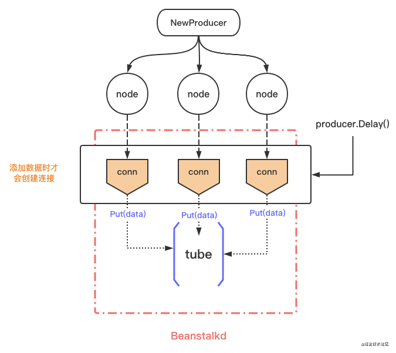

# [还在用crontab? 分布式定时任务了解一下](https://segmentfault.com/a/1190000039361384)

## 前言

日常任务开放中，我们会有很多异步、批量、定时、延迟任务要处理，go-zero中有 `go-queue`，推荐使用 `go-queue` 去处理，`go-queue` 本身也是基于 `go-zero` 开发的，其本身是有两种模式：

- `dq`：依赖于` beanstalkd` ，适合延时、定时任务执行；
- `kq`：依赖于 `kafka` ，适用于异步、批量任务执行；

本篇就先从 `dq` 开始，慢慢探究 `go-queue` 背后执行的逻辑。

## dq 简介

`dq `封装底层 `beanstalkd` 操作，分布式存储，延迟、定时设置。重启服务可以重新执行，但是消息不会丢失，因为消息的处理都交由 `beanstalkd` 完成。

可以看出使用非常简单，同时 `dq` 中使用了 `redis setnx` 保证了每个消息只被消费一次。但是在生产者端没有使用 `redis` 做消息存储，这个和前面描述的一致。

对 `dq` 的整体架构做了简单介绍，下面就开始正式的探索

## 生产者 example

```go
func main() {
    producer := dq.NewProducer([]dq.Beanstalk{
        {
            Endpoint: "localhost:11300",
            Tube:     "tube",
        },
        {
            Endpoint: "localhost:11301",
            Tube:     "tube",
        },
    })
    for i := 1000; i < 1005; i++ {
    // Delay：延迟执行
        _, err := producer.Delay([]byte(strconv.Itoa(i)), time.Second*5)
    // At：在某一个时刻执行
        //_, err := producer.At([]byte(strconv.Itoa(i)), time.Now().Add(time.Second*5))
        if err != nil {
            fmt.Println(err)
        }
    }
}
```

从使用上，简单分为两步：

1. `NewProducer(opts)`：将本地队列的端口配置和主题配置传入生产者；
2. `producer.Delay()`：使用刚创建好的 *生产者*，调用它的 `Delay()` 。将需要异步发送的消息传入，`Delay` 还需要传入延迟执行的时间。

需要说明的是：创建的 `producer` 是一个接口，`Delay()` 只是接口其中的一个方法。后续会其他的方法和内部设计。那我们就继续往下探索吧～～～

## 深入生产者执行流程

下面从 `example` 的代码进去，看整个函数的调用链。

### 初始化

```go
dq.NewProducer([]dq.Beanstalk{{opt1}, {opt2}, ...})    // 初始化生产者
    |- NewProducerNode(endpoint, tube)                                // endpoint,tube 来自传入的配置数组
```

紧接着就到 `producerNode.go` ，这个部分就会牵涉到 `beanstalk` 的初始化：

```go
NewProducerNode(endpoint, tube)
    |- conn: newConnection(endpoint, tube)
        |- return &connection{}    
```

这就涉及到 `beanstalk`：`connection.conn -> *beanstalk.Conn`。

但是在 `newConnection()` 中并没有对 `beanstalk.Conn` 进行初始化，这属于 **延迟初始化**

### Delay

首先是生产者端调用 `producer.Delay(data, timesecond)` ，就把消息插入到内部队列，`timesecond` 就是延迟执行的时间。我们来看看 `Delay()` 到底做了什么？

```go
p.Delay(data, timesecond)
    |- p.wrap(data, time)            // 将 data 和 time 包装到一块
        |- p.insert(nodeFn)
            |- node.Delay()             // for rangre p.node 每一个node都执行一遍 `Delay()`
```

而 `p.insert` 就是将上一步封装好的 data 传递给 `p{cluster}` 的每一个node去执行 `node.Delay`。

在前面的 [初始化 ](https://segmentfault.com/a/1190000039361384#初始化)说过，最开始是没有对 `conn` 进行初始化，那现在要插入数据，总不能不初始化这个 `conn` 。

```go
node.Delay()                                    // 配置中的每个node都执行 `Delay()`
    |- node.conn.get()                    // 获取node中的conn【conn==nil，就初始化一个conn】
    |- _, err := conn.Put(data, deplay, opts...)
        |- node.conn.reset()             // 出现err情况下，如OOM/Timeout等情况 -> 关闭conn，防止泄漏
```

所以最后 `Delay` 实际上是执行 `tube.Put(data, delay)`：

```go
tube.Put(data, delay)
    |- tube.Conn.cmd("put", ...)        // 生产者发布job
```

这里就涉及到 `beanstalk` 的 `Put` 操作：首先看看生产者 `Put` 指令参数说明：

```go
put <pri> <delay> <ttr> <bytes> <data>
```

- `<pri>` ：优先级，值越小优先级越高，默认为1024；
- `<delay>` ：延迟 `ready` 秒数，在这段时间 job 为 `delayed` 状态；
- `<ttr>` ：`time to run` ，允许 worker 执行的最大秒数，如果 worker 在这段时间不能 delete，release，bury job，那么当 job 超时，服务器将自动 release 此job；
- `<bytes>` ：`job body`的长度，不包含`\r\n`；
- `<data>`： job body data；

OK。那插入 `job` 成功，响应什么呢？

```go
INSERTED <id>\r\n
```

返回的 `id` 是插入 `job` 的任务标识。到此 `Put` 分析完毕，跟着代码走一遍：

```go
tube.Put(data, priority, daley, ttr)
    |- tube.Conn.cmd("put", ...)
    |- tube.Conn.readResp("INSERTED id")
|- return id, err            // 将id返回
```

这样我们在 `example` 中直接可以看到的 *生产者* 执行的操作就介绍完了。上图，图更好说话：



### producer interface

那么除了 `example` 中使用的 `Delay()` ，还有其余几个方法：

```go
Producer interface {
  At(body []byte, at time.Time) (string, error)
  Close() error
  Delay(body []byte, delay time.Duration) (string, error)
  Revoke(ids string) error
}
```

- `At`：指定某个时间执行【实质也是执行 `Delay()`】
- `Close`：关闭全部node的连接
- `Delay`：延迟执行。传入延迟的时间。
- `Revoke`：实质上是当出现最小写入节点<2时，触发添加失败，将添加成功的job删除掉。

当然，事实上 `dq` 使用上，开发者只需要使用 `At/Delay` 就行了。也就是你只要知道你的任务是定时触发还是延迟触发即可。剩下的，`dq` 内部的封装都已经帮你做好了。