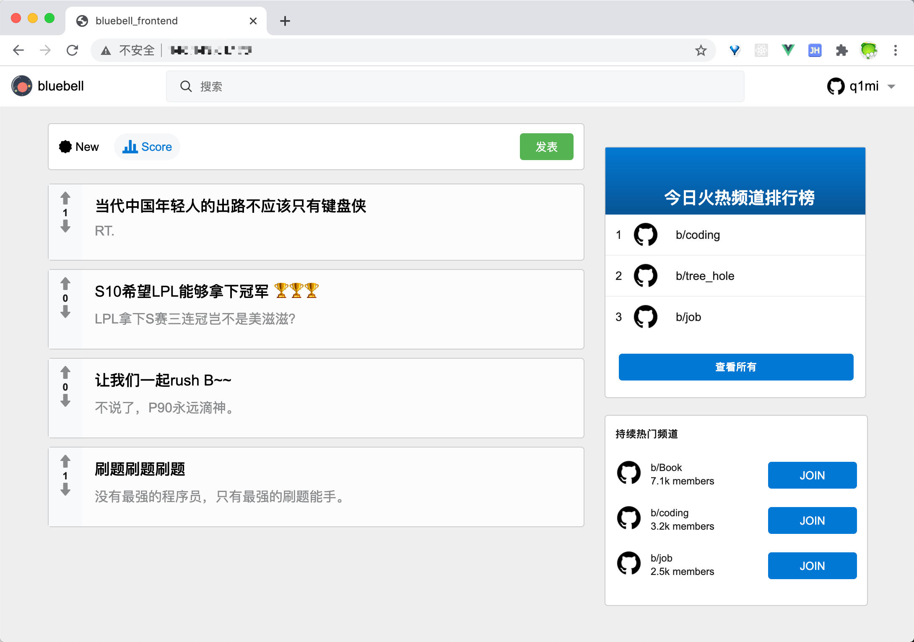
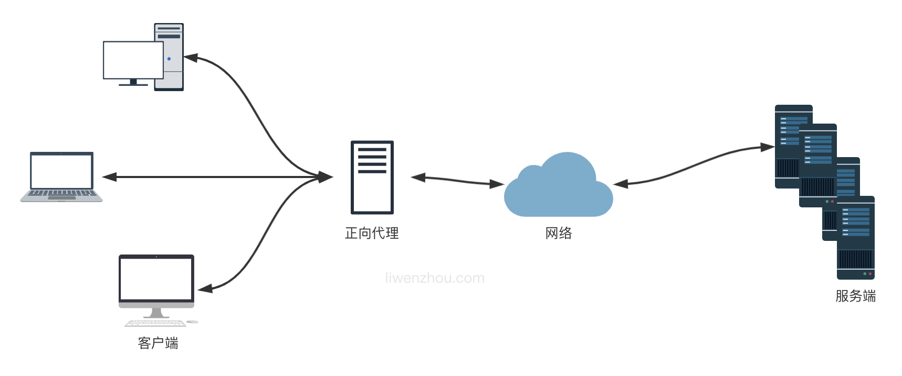
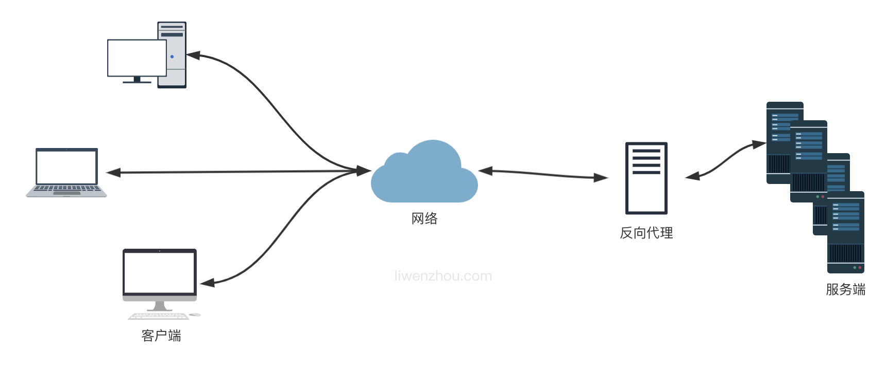
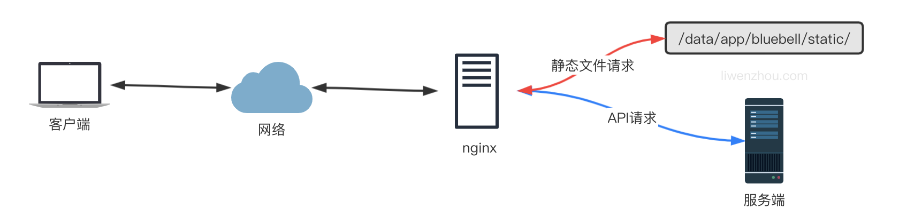
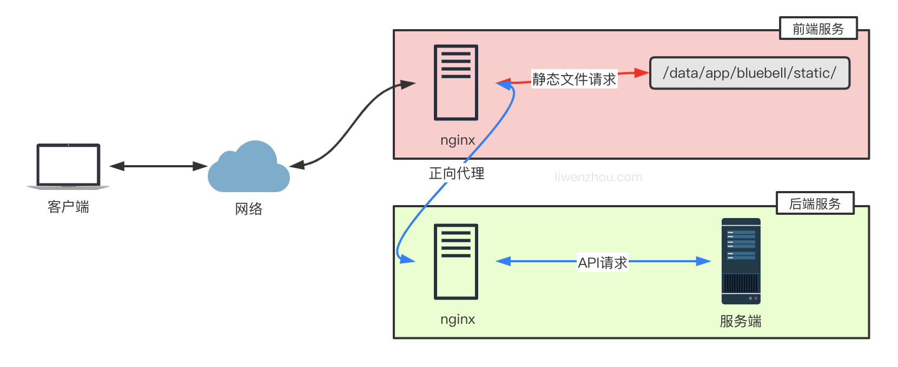
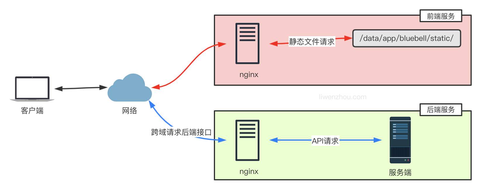

# [部署Go语言项目的 N 种方法](https://www.liwenzhou.com/posts/Go/deploy_go_app/)

本文以部署 Go Web 程序为例，介绍了在 CentOS7 服务器上部署 Go 语言程序的若干方法。

# 部署Go语言项目

本文以部署 Go Web 程序为例，介绍了在 CentOS7 服务器上部署 Go 语言程序的若干方法。

## 独立部署

Go 语言支持跨平台交叉编译，也就是说我们可以在 Windows 或 Mac 平台下编写代码，并且将代码编译成能够在 Linux amd64 服务器上运行的程序。

对于简单的项目，通常我们只需要将编译后的二进制文件拷贝到服务器上，然后设置为后台守护进程运行即可。

### 编译

编译可以通过以下命令或编写 makefile 来操作。

```bash
CGO_ENABLED=0 GOOS=linux GOARCH=amd64 go build -o ./bin/bluebell
```

下面假设我们将本地编译好的 bluebell 二进制文件、配置文件和静态文件等上传到服务器的`/data/app/bluebell`目录下。

补充一点，如果嫌弃编译后的二进制文件太大，可以在编译的时候加上`-ldflags "-s -w"`参数去掉符号表和调试信息，一般能减小20%的大小。

```bash
CGO_ENABLED=0 GOOS=linux GOARCH=amd64 go build -ldflags "-s -w" -o ./bin/bluebell
```

如果还是嫌大的话可以继续使用 upx 工具对二进制可执行文件进行压缩。

我们编译好 bluebell 项目后，相关必要文件的目录结构如下：

```bash
├── bin
│   └── bluebell
├── conf
│   └── config.yaml
├── static
│   ├── css
│   │   └── app.0afe9dae.css
│   ├── favicon.ico
│   ├── img
│   │   ├── avatar.7b0a9835.png
│   │   ├── iconfont.cdbe38a0.svg
│   │   ├── logo.da56125f.png
│   │   └── search.8e85063d.png
│   └── js
│       ├── app.9f3efa6d.js
│       ├── app.9f3efa6d.js.map
│       ├── chunk-vendors.57f9e9d6.js
│       └── chunk-vendors.57f9e9d6.js.map
└── templates
    └── index.html
```

### nohup

nohup 用于在系统后台**不挂断**地运行命令，不挂断指的是退出执行命令的终端也不会影响程序的运行。

我们可以使用 nohup 命令来运行应用程序，使其作为后台守护进程运行。由于在主流的 Linux 发行版中都会默认安装 nohup 命令工具，我们可以直接输入以下命令来启动我们的项目：

```bash
sudo nohup ./bin/bluebell conf/config.yaml > nohup_bluebell.log 2>&1 &
```

其中：

- `./bluebell conf/config.yaml`是我们应用程序的启动命令
- `nohup ... &`表示在后台不挂断的执行上述应用程序的启动命令
- `> nohup_bluebell.log`表示将命令的标准输出重定向到 nohup_bluebell.log 文件
- `2>&1`表示将标准错误输出也重定向到标准输出中，结合上一条就是把执行命令的输出都定向到 nohup_bluebell.log 文件

上面的命令执行后会返回进程 id

```bash
[1] 6338
```

当然我们也可以通过以下命令查看 bluebell 相关活动进程：

```bash
ps -ef | grep bluebell
```

输出：

```bash
root      6338  4048  0 08:43 pts/0    00:00:00 ./bin/bluebell conf/config.yaml
root      6376  4048  0 08:43 pts/0    00:00:00 grep --color=auto bluebell
```

此时就可以打开浏览器输入`http://服务器公网ip:端口`查看应用程序的展示效果了。



### supervisor

Supervisor 是业界流行的一个通用的进程管理程序，它能将一个普通的命令行进程变为后台守护进程，并监控该进程的运行状态，当该进程异常退出时能将其自动重启。

首先使用 yum 来安装 supervisor：

如果你还没有安装过 EPEL，可以通过运行下面的命令来完成安装，如果已安装则跳过此步骤：

```bash
sudo yum install epel-release
```

安装 supervisor

```bash
sudo yum install supervisor
```

Supervisor 的配置文件为：`/etc/supervisord.conf` ，Supervisor 所管理的应用的配置文件放在 `/etc/supervisord.d/` 目录中，这个目录可以在 supervisord.conf 中的`include`配置。

```bash
[include]
files = /etc/supervisord.d/*.conf
```

启动supervisor服务：

```bash
sudo supervisord -c /etc/supervisord.conf
```

我们在`/etc/supervisord.d`目录下创建一个名为`bluebell.conf`的配置文件，具体内容如下。

```bash
[program:bluebell]  ;程序名称
user=root  ;执行程序的用户
command=/data/app/bluebell/bin/bluebell /data/app/bluebell/conf/config.yaml  ;执行的命令
directory=/data/app/bluebell/ ;命令执行的目录
stopsignal=TERM  ;重启时发送的信号
autostart=true  
autorestart=true  ;是否自动重启
stdout_logfile=/var/log/bluebell-stdout.log  ;标准输出日志位置
stderr_logfile=/var/log/bluebell-stderr.log  ;标准错误日志位置
```

创建好配置文件之后，重启supervisor服务

```bash
sudo supervisorctl update # 更新配置文件并重启相关的程序
```

查看bluebell的运行状态：

```bash
sudo supervisorctl status bluebell
```

输出：

```bash
bluebell                         RUNNING   pid 10918, uptime 0:05:46
```

最后补充一下常用的supervisr管理命令：

```bash
supervisorctl status       # 查看所有任务状态
supervisorctl shutdown     # 关闭所有任务
supervisorctl start 程序名  # 启动任务
supervisorctl stop 程序名   # 关闭任务
supervisorctl reload       # 重启supervisor
```

接下来就是打开浏览器查看网站是否正常了。

## 搭配nginx部署

在需要静态文件分离、需要配置多个域名及证书、需要自建负载均衡层等稍复杂的场景下，我们一般需要搭配第三方的web服务器（Nginx、Apache）来部署我们的程序。

### 正向代理与反向代理

正向代理可以简单理解为客户端的代理，你访问墙外的网站用的那个属于正向代理。



反向代理可以简单理解为服务器的代理，通常说的 Nginx 和 Apache 就属于反向代理。



Nginx 是一个免费的、开源的、高性能的 HTTP 和反向代理服务，主要负责负载一些访问量比较大的站点。Nginx 可以作为一个独立的 Web 服务，也可以用来给 Apache 或是其他的 Web 服务做反向代理。相比于 Apache，Nginx 可以处理更多的并发连接，而且每个连接的内存占用的非常小。

### 使用yum安装nginx

EPEL 仓库中有 Nginx 的安装包。如果你还没有安装过 EPEL，可以通过运行下面的命令来完成安装：

```bash
sudo yum install epel-release
```

安装nginx

```bash
sudo yum install nginx
```

安装完成后，执行下面的命令设置Nginx开机启动：

```bash
sudo systemctl enable nginx
```

启动Nginx

```bash
sudo systemctl start nginx
```

查看Nginx运行状态：

```bash
sudo systemctl status nginx
```

### Nginx配置文件

通过上面的方法安装的 nginx，所有相关的配置文件都在 `/etc/nginx/` 目录中。Nginx 的主配置文件是 `/etc/nginx/nginx.conf`。

默认还有一个`nginx.conf.default`的配置文件示例，可以作为参考。你可以为多个服务创建不同的配置文件（建议为每个服务（域名）创建一个单独的配置文件），每一个独立的 Nginx 服务配置文件都必须以 `.conf`结尾，并存储在 `/etc/nginx/conf.d` 目录中。

### Nginx常用命令

补充几个 Nginx 常用命令。

```bash
nginx -s stop    # 停止 Nginx 服务
nginx -s reload  # 重新加载配置文件
nginx -s quit    # 平滑停止 Nginx 服务
nginx -t         # 测试配置文件是否正确
```

### Nginx反向代理部署

我们推荐使用 nginx 作为反向代理来部署我们的程序，按下面的内容修改 nginx 的配置文件。

```bash
worker_processes  1;

events {
    worker_connections  1024;
}

http {
    include       mime.types;
    default_type  application/octet-stream;

    sendfile        on;
    keepalive_timeout  65;

    server {
        listen       80;
        server_name  localhost;

        access_log   /var/log/bluebell-access.log;
        error_log    /var/log/bluebell-error.log;

        location / {
            proxy_pass                 http://127.0.0.1:8084;
            proxy_redirect             off;
            proxy_set_header           Host             $host;
            proxy_set_header           X-Real-IP        $remote_addr;
            proxy_set_header           X-Forwarded-For  $proxy_add_x_forwarded_for;
        }
    }
}
```

执行下面的命令检查配置文件语法：

```bash
nginx -t
```

执行下面的命令重新加载配置文件：

```bash
nginx -s reload
```

接下来就是打开浏览器查看网站是否正常了。

当然我们还可以使用 nginx 的 upstream 配置来添加多个服务器地址实现负载均衡。

```bash
worker_processes  1;

events {
    worker_connections  1024;
}

http {
    include       mime.types;
    default_type  application/octet-stream;

    sendfile        on;
    keepalive_timeout  65;

    upstream backend {
      server 127.0.0.1:8084;
      # 这里需要填真实可用的地址，默认轮询
      #server backend1.example.com;
      #server backend2.example.com;
    }

    server {
        listen       80;
        server_name  localhost;

        access_log   /var/log/bluebell-access.log;
        error_log    /var/log/bluebell-error.log;

        location / {
            proxy_pass                 http://backend/;
            proxy_redirect             off;
            proxy_set_header           Host             $host;
            proxy_set_header           X-Real-IP        $remote_addr;
            proxy_set_header           X-Forwarded-For  $proxy_add_x_forwarded_for;
        }
    }
}
```

### Nginx分离静态文件请求

上面的配置是简单的使用 nginx 作为反向代理处理所有的请求并转发给我们的 Go 程序处理，其实我们还可以有选择的将静态文件部分的请求直接使用 nginx 处理，而将 API 接口类的动态处理请求转发给后端的 Go 程序来处理。



下面继续修改我们的 nginx 的配置文件来实现上述功能。

```bash
worker_processes  1;

events {
    worker_connections  1024;
}

http {
    include       mime.types;
    default_type  application/octet-stream;

    sendfile        on;
    keepalive_timeout  65;

    server {
        listen       80;
        server_name  bluebell;

        access_log   /var/log/bluebell-access.log;
        error_log    /var/log/bluebell-error.log;

		# 静态文件请求
        location ~ .*\.(gif|jpg|jpeg|png|js|css|eot|ttf|woff|svg|otf)$ {
            access_log off;
            expires    1d;
            root       /data/app/bluebell;
        }

        # index.html页面请求
        # 因为是单页面应用这里使用 try_files 处理一下，避免刷新页面时出现404的问题
        location / {
            root /data/app/bluebell/templates;
            index index.html;
            try_files $uri $uri/ /index.html;
        }

		# API请求
        location /api {
            proxy_pass                 http://127.0.0.1:8084;
            proxy_redirect             off;
            proxy_set_header           Host             $host;
            proxy_set_header           X-Real-IP        $remote_addr;
            proxy_set_header           X-Forwarded-For  $proxy_add_x_forwarded_for;
        }
    }
}
```

### 前后端分开部署

前后端的代码没必要都部署到相同的服务器上，也可以分开部署到不同的服务器上，下图是前端服务将 API 请求转发至后端服务的方案。



上面的部署方案中，所有浏览器的请求都是直接访问前端服务，而如果是浏览器直接访问后端API服务的部署模式下，如下图。

此时前端和后端通常不在同一个域下，我们还需要在后端代码中添加跨域支持。



这里使用[github.com/gin-contrib/cors](https://github.com/gin-contrib/cors)库来支持跨域请求。

最简单的允许跨域的配置是使用`cors.Default()`，它默认允许所有跨域请求。

```go
func main() {
	router := gin.Default()
	// same as
	// config := cors.DefaultConfig()
	// config.AllowAllOrigins = true
	// router.Use(cors.New(config))
	router.Use(cors.Default())
	router.Run()
}
```

此外，还可以使用`cors.Config`自定义具体的跨域请求相关配置项：

```go
package main

import (
	"time"

	"github.com/gin-contrib/cors"
	"github.com/gin-gonic/gin"
)

func main() {
	router := gin.Default()
	// CORS for https://foo.com and https://github.com origins, allowing:
	// - PUT and PATCH methods
	// - Origin header
	// - Credentials share
	// - Preflight requests cached for 12 hours
	router.Use(cors.New(cors.Config{
		AllowOrigins:     []string{"https://foo.com"},
		AllowMethods:     []string{"PUT", "PATCH"},
		AllowHeaders:     []string{"Origin"},
		ExposeHeaders:    []string{"Content-Length"},
		AllowCredentials: true,
		AllowOriginFunc: func(origin string) bool {
			return origin == "https://github.com"
		},
		MaxAge: 12 * time.Hour,
	}))
	router.Run()
}
```

## 容器部署

容器部署方案可参照我之前的博客：[使用Docker和Docker Compose部署Go Web应用](https://www.liwenzhou.com/posts/Go/how_to_deploy_go_app_using_docker/)，这里就不再赘述了。

## 关于 bluebell

上文提及的 bluebell 项目是我个人录制的 Go Web开发进阶项目实战课程中的项目，目前该课程已经录制完成，共计80课时。想要了解该课程的同学欢迎猛戳以下链接：

- [网易云课堂课程链接](https://study.163.com/course/courseMain.htm?courseId=1210171207&share=2&shareId=480000002229610)
- [51CTO课程链接](https://edu.51cto.com/sd/68c23)

或者可以关注我的个人微信公众号：`李文周`，回复`bluebell`获取相关课程链接。