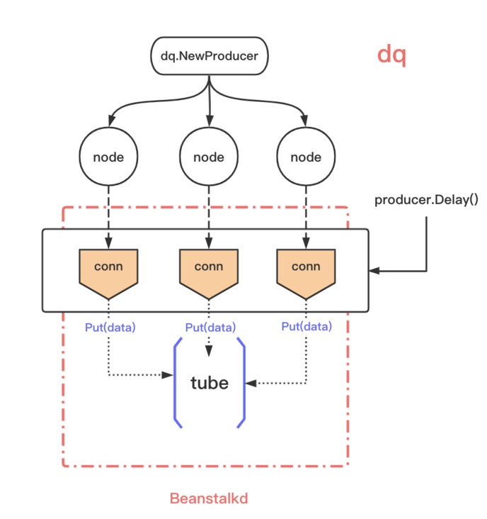
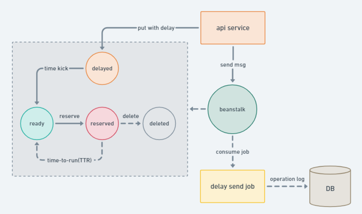
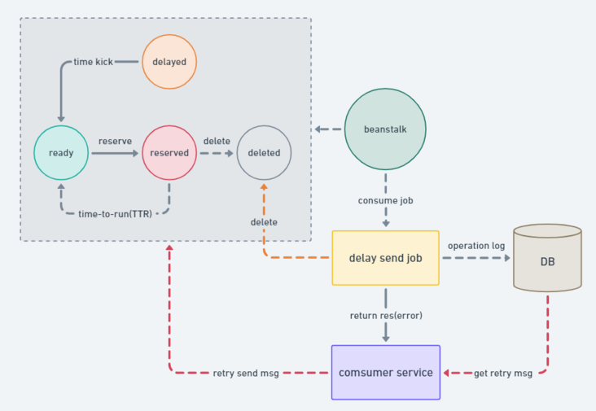

# [高可用延迟队列设计与实现](https://segmentfault.com/a/1190000040714810)

延迟队列：一种带有 *延迟功能* 的消息队列

1. 延时 → 未来一个不确定的时间
2. mq → 消费行为具有顺序性

这样解释，整个设计就清楚了。**你的目的是 延时，承载容器是 mq。**

## 背景

列举一下我日常业务中可能存在的场景：

1. 建立延时日程，需要提醒老师上课
2. 延时推送 → 推送老师需要的公告以及作业

为了解决以上问题，最简单直接的办法就是定时去扫表：

> 服务启动时，开启一个异步协程 → 定时扫描 msg table，到了事件触发事件，调用对应的 handler

几个缺点：

1. 每一个需要定时/延时任务的服务，都需要一个 msg table 做额外存储 → 存储与业务耦合
2. 定时扫描 → 时间不好控制，可能会错过触发时间
3. 对 msg table instance 是一个负担。反复有一个服务不断对数据库产生持续不断的压力

最大问题其实是什么？

**调度模型基本统一，不要做重复的业务逻辑**

我们可以考虑将逻辑从具体的业务逻辑里面抽出来，变成一个公共的部分。

而这个调度模型，就是 **延时队列** 。

其实说白了：

***延时队列模型，就是将未来执行的事件提前存储好，然后不断扫描这个存储，触发执行时间则执行对应的任务逻辑。\***

那么开源界是否已有现成的方案呢？答案是肯定的。Beanstalk ([https://github.com/beanstalkd/beanstalkd](https://link.segmentfault.com/?enc=%2BN2Ty6y8W9FrWX2v8va%2BcA%3D%3D.CZ2aO%2B%2F3yjca1j3hMu4qiCOZmI0IrWTtVaiomLR1OM%2BloceY98uCycO5RzQsWEF9)) 它基本上已经满足以上需求

## 设计目的

1. 消费行为 at least
2. 高可用
3. 实时性
4. 支持消息删除

依次说说上述这些目的的设计方向：

### 消费行为

这个概念取自 mq 。mq 中提供了消费投递的几个方向：

- `at most once` → 至多一次，消息可能会丢，但不会重复
- `at least once` → 至少一次，消息肯定不会丢失，但可能重复
- `exactly once` → 有且只有一次，消息不丢失不重复，且只消费一次。

`exactly once` 尽可能是 producer + consumer 两端都保证。当 producer 没办法保证是，那 consumer 需要在消费前做一个去重，达到消费过一次不会重复消费，这个在延迟队列内部直接保证。

最简单：**使用 redis 的 setNX 达到 job id 的唯一消费**

### 高可用

支持多实例部署。挂掉一个实例后，还有后备实例继续提供服务。

这个对外提供的 API 使用 cluster 模型，内部将多个 node 封装起来，多个 node 之间冗余存储。

### **为什么不使用 kafka？**

考虑过类似基于 kafka/rocketmq 等消息队列作为存储的方案，最后从存储设计模型放弃了这类选择。

举个例子，假设以 Kafka 这种消息队列存储来实现延时功能，每个队列的时间都需要创建一个单独的 topic(如: Q1-1s, Q1-2s..)。这种设计在延时时间比较固定的场景下问题不太大，但如果是延时时间变化比较大会导致 topic 数目过多，会把磁盘从顺序读写会变成随机读写从导致性能衰减，同时也会带来其他类似重启或者恢复时间过长的问题。

1. topic 过多 → 存储压力
2. topic 存储的是现实时间，在调度时对不同时间 (topic) 的读取，顺序读 → 随机读
3. 同理，写入的时候顺序写 → 随机写

## 架构设计

## API 设计

producer

1. `producer.At(msg []byte, at time.Time)`
2. `producer.Delay(body []byte, delay time.Duration)`
3. `producer.Revoke(ids string)`

consumer

1. `consumer.Consume(consume handler)`

使用延时队列后，服务整体结构如下，以及队列中 job 的状态变迁：

1. service → `producer.At(msg []byte, at time.Time)` → 插入延时job到 tube 中
2. 定时触发 → job 状态更新为 ready
3. consumer 获取到 ready job → 取出 job，开始消费；并更改状态为 reserved
4. 执行传入 consumer 中的 handler 逻辑处理函数

## 生产实践

主要介绍一下在日常开发，我们使用到延时队列的哪些具体功能。

### 生产端

1. 开发中生产延时任务，**只需确定任务执行时间**
   1. 传入 At() `producer.At(msg []byte, at time.Time)`
   2. 内部会自行计算时间差值，插入 tube
2. **如果出现任务时间的修改，以及任务内容的修改**
   1. 在生产时可能需要额外建立一个 logic_id → job_id 的关系表
   2. 查询到 job_id → `producer.Revoke(ids string)` ，对其删除，然后重新插入

### 消费端

首先，框架层面保证了消费行为的 `exactly once` ，但是上层业务逻辑消费失败或者是出现网络问题，亦或者是各种各样的问题，导致消费失败，兜底交给业务开发做。这样做的原因：

1. 框架以及基础组件只保证 job 状态的流转正确性
2. 框架消费端只保证消费行为的统一
3. 延时任务在不同业务中行为不统一
   1. 强调任务的必达性，则消费失败时需要不断重试直到任务成功
   2. 强调任务的准时性，则消费失败时，对业务不敏感则可以选择丢弃

这里描述一下框架消费端是怎么保证消费行为的统一：

分为 cluster 和 node。**cluster**：

> [https://github.com/tal-tech/go-queue/blob/master/dq/consumer.go#L45](https://link.segmentfault.com/?enc=p%2B1ft1joxxczn9KJSy4eIA%3D%3D.EBgltznmCUkgqAWeoQwU7wjhm%2F30F7oVuQu1V7FNvCVx3%2FLYWrjon8NUDSFsHfP2I9wKglnkOJkhWGQTf%2BsjDP2pUdFN78y6C1q3nuNhVCE%3D)

1. cluster 内部将 consume handler 做了一层再封装
2. **对 consume body 做hash，并使用此 hash 作为 redis 去重的key**
3. 如果存在，则不做处理，丢弃

**node**：

> [https://github.com/tal-tech/go-queue/blob/master/dq/consumernode.go#L36](https://link.segmentfault.com/?enc=749dgNCVdWmh%2B81NGKg%2F6Q%3D%3D.lK%2Fizl1j7NrGK4LvRf9ZKzOBHsiMO5i%2FHTBbISgQJ1BVopA8HkadF1hLSJjq31YgqIkehdauwarVStv9UJTI1HkQJPRwNiJK3VHPO%2FCnxHg%3D)

1. 消费 node 获取到 ready job；先执行 Reserve(TTR)，预订此job，将执行该job进行逻辑处理
2. 在 node 中 delete(job)；然后再进行消费
   1. **如果失败，则上抛给业务层，做相应的兜底重试**

所以对于消费端，开发者需要自己实现消费的幂等性。

## 项目地址

`go-queue` 是基于 `go-zero` 实现的，`go-zero` 在 github 上 `Used by` 有300+，开源一年获得11k+ stars.

- go-zero: [https://github.com/zeromicro/go-zero](https://link.segmentfault.com/?enc=%2BygsECHCbdmmSVtwRVHgEA%3D%3D.uDENDycpRuXwQMrzYt4r5uLV1Z10HAzqvHaNeDgCrFFR8fY6bn%2BptvBjwlZpNivL)
- go-stash: [https://github.com/tal-tech/go-queue](https://link.segmentfault.com/?enc=ox41XAmx78rWRsY80W8ZlQ%3D%3D.osY0530PbPzEHno7UJZK0CV2xeeRcMhEwpF1e1NISFo9KOHu3ECmYaV7OGcbimxv)

欢迎使用并 **star** 支持我们！