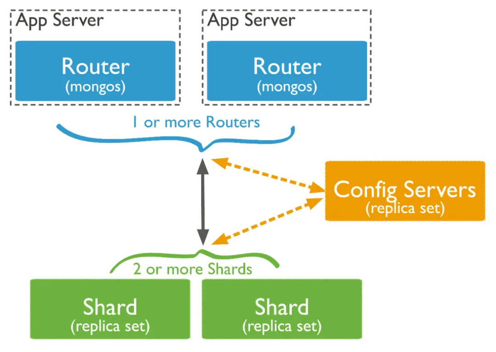
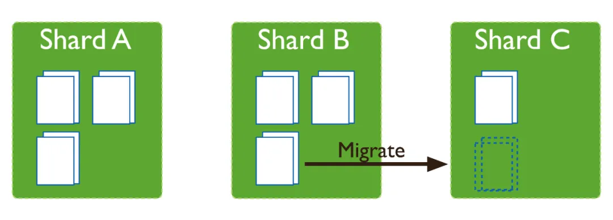

# [MongoDB 在评论中台的实践](https://my.oschina.net/vivotech/blog/4965800)

本文主要讲述 vivo 评论中台在数据库设计上的技术探索和实践。

# 一、业务背景

随着公司业务发展和用户规模的增多，很多项目都在打造自己的评论功能，而评论的业务形态基本类似。当时各项目都是各自设计实现，存在较多重复的工作量；并且不同业务之间数据存在孤岛，很难产生联系。因此我们决定打造一款公司级的评论业务中台，为各业务方提供评论业务的快速接入能力。在经过对各大主流 APP 评论业务的竞品分析，我们发现大部分评论的业务形态都具备评论、回复、二次回复、点赞等功能。

具体如下图所示：


涉及到的核心业务概念有：

- **【主题 topic】**评论的主题，商城的商品、应用商店的 APP、社区的帖子
- **【评论 comment】**用户针对于主题发表的内容
- **【回复 reply】**用户针对于某条评论发表的内容，包括一级回复和二级回复


# 二、数据库存储的选择

团队在数据库选型设计时，对比了多种主流的数据库，最终在 MySQL  和 MongoDB  两种存储之进行抉择。


由于评论业务的特殊性，它需要如下能力：

- **【字段扩展】**业务方不同评论模型存储的字段有一定差异，需要支持动态的自动扩展。
- **【海量数据】**作为公司中台服务，数据量随着业务方的增多成倍增长，需要具备快速便捷的水平扩展和迁移能力。
- **【高可用】**作为中台产品，需要提供快速和稳定的读写能力，能够读写分离和自动恢复。

而评论业务不涉及用户资产，对事务的要求性不高。因此我们选用了 **MongoDB 集群** 作为最底层的数据存储方式。

# 三、深入了解 MongoDB


## 3.1 集群架构

由于单台机器存在磁盘/IO/CPU等各方面的瓶颈，因此以 MongoDB 提供集群方式的部署架构，如图所示:



主要由以下三个部分组成：

- **mongos：**路由服务器，负责管理应用端的具体链接。应用端请求到mongos服务后，mongos把具体的读写请求转发到对应的shard节点上执行。一个集群可以有1~N个mongos节点。
- **config：**配置服务器，用于分存储分片集合的元数据和配置信息，必须为 复制集([关于复制集概念戳我](https://www.oschina.net/action/GoToLink?url=https%3A%2F%2Fdocs.mongodb.com%2Fmanual%2Freplication%2F)) 方式部署。mongos通过config配置服务器合的元数据信息。
- **shard：**用于存储集合的分片数据的mongod服务，同样必须以 复制集 方式部署。


## 3.2 片键

MongoDB 数据是存在collection(对应 MySQL表)中。集群模式下，collection按照 **片键**（shard key）拆分成多个区间，每个区间组成一个chunk，按照规则分布在不同的shard中。并形成元数据注册到config服务中管理。


分片键只能在分片集合创建时指定，指定后不能修改。分片键主要有两大类型：

- **hash分片：**通过hash算法进行散列，数据分布的更加平均和分散。支持单列和多列hash。
- **范围分片：**按照指定片键的值分布，连续的key往往分布在连续的区间，更加适用范围查询场景。单数据散列性由分片键本身保证。


## 3.3 评论中台的实践


### 3.3.1 集群的扩展

作为中台服务，对于不同的接入业务方，通过表隔离来区分数据。以comment评论表举例，每个接入业务方都单独创建一张表，业务方A表为 comment_clientA ，业务方B表为 comment_clientB，均在接入时创建表和相应索引信息。但只是这样设计存在几个问题：

- 单个集群，不能满足部分业务数据物理隔离的需要。
- 集群调优(如split迁移时间)很难业务特性差异化设置。
- 水平扩容带来的单个业务方数据过于分散问题。

因此我们扩展了 MongoDB的集群架构：


1. 扩展后的评论MongoDB集群 增加了 【逻辑集群】和【物理集群】的概念。一个业务方属于一个逻辑集群，一个物理集群包含多个逻辑集群。
2. 增加了路由层设计，由应用负责扩展Spring的MongoTemplate和连接池管理，实现了业务到MongoDB集群之间的切换选择服务。
3. 不同的MongoDB分片集群，实现了物理隔离和差异调优的可能。


### 3.3.2 片键的选择

MongoDB集群中，一个集合的数据部署是分散在多个shard分片和chunk中的，而我们希望一个评论列表的查询最好只访问到一个shard分片，因此确定了 范围分片 的方式。

起初设置只使用单个key作为分片键，以comment评论表举例，主要字段有{"_id":唯一id,"topicId":主题id,"text":文本内容,"createDate":时间} ,考虑到一个主题id的评论尽可能连续分布，我们设置的分片键为  **topicId**。随着性能测试的介入，我们发现了有两个非常致命的问题：

- jumbo chunk问题
- 唯一键问题

**jumbo chunk：**

官方文档中，MongoDB中的chunk大小被限制在了1M-1024M。分片键的值是chunk划分的唯一依据，在数据量持续写入超过chunk size设定值时，MongoDB 集群就会自动的进行分裂或迁移。而对于同一个片键的写入是属于一个chunk，无法被分裂，就会造成 jumbo chunk 问题。

> 举例，若我们设置1024M为一个chunk的大小，单个document 5KB计算，那么单个chunk能够存储21W左右document。考虑热点的主题评论(如微信评论)，评论数可能达到40W+，因此单个chunk很容易超过1024M。超过最大size的chunk依然能够提供读写服务，只是不会再进行分裂和迁移，长久以往会造成集群之间数据的不平衡.

**唯一键问题：**

MongoDB 集群的唯一键设置增加了限制，必须是包含分片键的；如果_id不是分片键，_id索引只能保证单个shard上的唯一性。

- You cannot specify a unique constraint on a hashed index
- For a to-be-sharded collection, you cannot shard the collection if the collection has other unique indexes
- For an already-sharded collection, you cannot create unique indexes on other fields

因此我们删除了数据和集合，调整  topicId 和 _id 为联合分片键 重新创建了集合。这样即打破了chunk size的限制，也解决了唯一性问题。


## 3.4 迁移和扩容

随着数据的写入，当单个chunk中数据大小超过指定大小时(或chunk中的文件数量超过指定值)。MongoDB集群会在插入或更新时，自动触发chunk的拆分。


拆分会导致集合中的数据块分布不均匀，在这种情况下，MongoDB balancer组件会触发集群之间的数据块迁移。balancer组件是一个管理数据迁移的后台进程，如果各个shard分片之间的chunk数差异超过阈值，balancer会进行自动的数据迁移。



balancer是可以在线对数据迁移的，但是迁移的过程中对于集群的负载会有较大影响。一般建议可以通过如下设置，在业务低峰时进行（[更多见官网](https://www.oschina.net/action/GoToLink?url=https%3A%2F%2Fdocs.mongodb.com%2Fmanual%2Ftutorial%2Fmanage-sharded-cluster-balancer%2F)）

```java
db.settings.update(
{ _id: "balancer" },
{ $set: { activeWindow : { start : "<start-time>", stop : "<stop-time>" } } },
{ upsert: true }
)
```

MongoDB的扩容也非常简单，只需要准备好新的shard复制集后，在 Mongos节点中执行：

```java
sh.addShard("<replica_set>/<hostname><:port>")
```

扩容期间因为chunk的迁移，同样会导致集群可用性降低，因此只能在业务低峰进行

# 四、写在最后

MongoDB集群在评论中台项目中已上线运行了一年多，过程中完成了约10个业务方接入，承载了1亿+评论回复数据的存储，表现较为稳定。BSON非结构化的数据，也支撑了我们多个版本业务的快速升级。而热门数据内存化存储引擎，较大的提高了数据读取的效率。

但对于MongoDB来说，集群化部署是一个不可逆的过程，集群化后也带来了索引，分片策略等较多的限制。因此一般业务在使用MongoDB时，副本集方式就能支撑TB级别的存储和查询，并非一定需要使用集群化方式。

以上内容基于MongoDB 4.0.9版本特性，和最新版本的MongoDB细节上略有差异。

参考资料：[https://docs.mongodb.com/manual/introduction/](https://www.oschina.net/action/GoToLink?url=https%3A%2F%2Fdocs.mongodb.com%2Fmanual%2Fintroduction%2F)