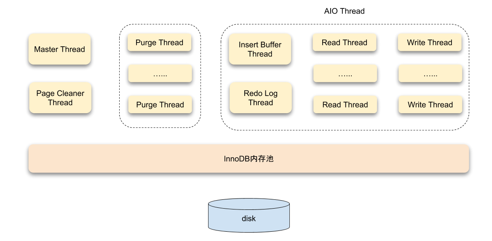
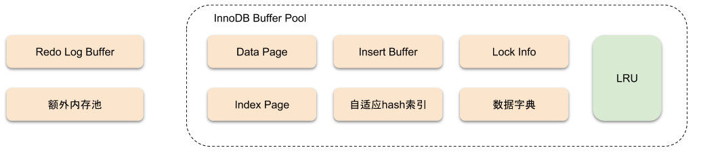
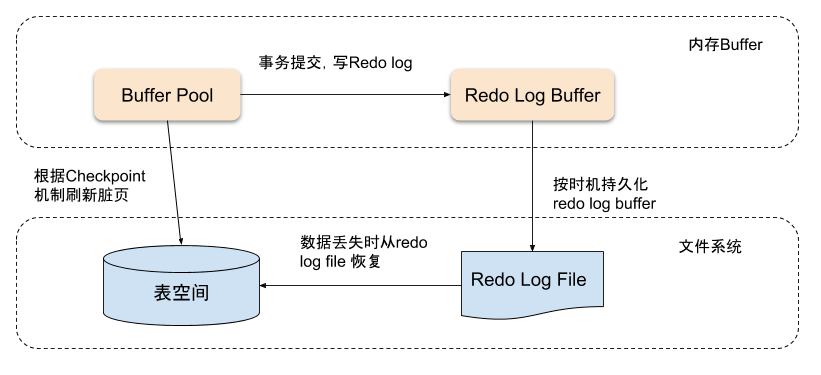
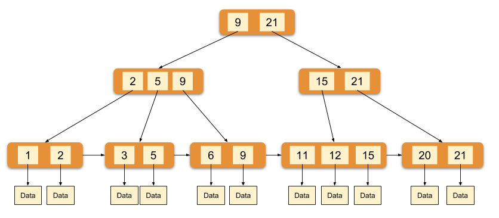

# MySQL InnoDB 存储引擎探秘

在MySQL中InnoDB属于存储引擎层，并以插件的形式集成在数据库中。从MySQL5.5.8开始，InnoDB成为其默认的存储引擎。InnoDB存储引擎支持事务、其设计目标主要是面向OLTP的应用，主要特点有：支持事务、行锁设计支持高并发、外键支持、自动崩溃恢复、聚簇索引的方式组织表结构等。

体系架构
====

InnoDB存储引擎是由内存池、后台线程、磁盘存储三大部分组成。

线程
==

InnoDB 使用的是多线程模型, 其后台有多个不同的线程负责处理不同的任务

### Master Thread

Master Thread是最核心的一个后台线程，主要负责将缓冲池中的数据异步刷新到磁盘，保证数据的一致性。包括脏页刷新、合并插入缓冲、UNDO页的回收等。

### IO Thread

在 InnoDB 存储引擎中大量使用了异步IO(Async IO)来处理写IO请求, IO Thread的工作主要是负责这些 IO 请求的回调。

### Purge Thread

事务提交后，其所使用的undo log可能不再需要，因此需要Purge Thread来回收已经分配并使用的UNDO页。InnoDB支持多个Purge Thread, 这样做可以加快UNDO页的回收，提高CPU的使用率以及提升存储引擎的性能。

### Page Cleaner Thread

Page Cleaner Thread的作用是取代Master Thread中脏页刷新的操作，其目的是减轻原Master Thread的工作及对于用户查询线程的阻塞，进一步提高InnoDB存储引擎的性能。

内存
==

InnoDB 存储引擎内存的结构

### 缓冲池

InnoDB存储引擎是基于磁盘存储的，并将其中的记录按照页的方式进行管理。但是由于CPU速度和磁盘速度之间的鸿沟，基于磁盘的数据库系统通常使用缓冲池记录来提高数据库的的整体性能。

缓冲池其实就是通过内存的速度来弥补磁盘速度较慢对数据库性能的影响。在数据库进行读取操作时，首先将磁盘中的页放入缓冲池中，下次再读取相同页时，首先从缓冲池中获取该页数据，起到高速缓存的作用。

数据的修改操作，则首先修改在缓冲池中的页数据，然后使用一种称为Checkpoint的机制刷新到磁盘上。

缓冲池的大小直接影响数据库的整体性能，对于InnoDB存储引擎而言,缓冲池配置通过参数 innodb\_buffer\_pool_size 来设置。使用 `SHOW VARIABLES LIKE 'innodb_buffer_pool_size'` 命令可查看缓冲池配置：

    mysql> SHOW VARIABLES LIKE 'innodb_buffer_pool_size' \G
    *************************** 1. row ***************************
    Variable_name: innodb_buffer_pool_size
            Value: 134217728
    1 row in set (0.01 sec)

缓冲池中缓存的数据页类型有: 索引页、undo页、插入缓冲、自适应哈希索引、InnoDB锁信息、数据字典信息等，索引页和数据页占缓冲池很大的一部分。

### 重做日志缓冲

缓冲池中的页数据比磁盘要新时，需要将新数据刷新到磁盘中。InnoDB采用Write Ahead Log策略来刷新数据，即当事务提交时，先写入重做日志缓冲，重做日志缓冲会按一定频率刷新到重置日志文件中，然后脏页会根据checkpoint机制刷新到磁盘。

重做日志缓冲不需要设置很大，通常情况下8M能满足大部分的应用场景。重做日志支持一下三种情况触发刷新：

*   Master Thread每一秒将重做日志缓冲刷新到重做日志文件
*   每次事务提交时将重做日志缓冲刷新到重做日志文件
*   当重做日志缓冲池剩余空间小于1/2时，重做日志缓冲刷新到重做日志文件

### 额外内存池

在InnoDB存储引擎中，对内存的管理是通过一种称为内存堆的方式进行的。在对一些数据结构本身的内存进行分配时，需要从额外的内存池中进行申请，当该区域的内存不够时，会从缓冲池中进行申请。

锁
=

InnoDB支持的锁有：

*   共享锁和排它锁
*   意向锁
*   记录锁
*   间隙锁
*   自增锁

### 共享锁和排他锁

InnoDB引擎实现了两种标准的行级锁，共享锁(shared (S) locks) 和排他锁 (exclusive (X) locks)。共享锁允许一个占有锁的事务去读取一行数据，排它锁则允许事务对某一行记录进行写操作。

如果一个事务持有了一个共享锁，其他事务仍然可以获取这行记录的共享锁，但不能获取到这行记录的排它锁。当一个事务获取到了某一行的排它锁，则其他事务将无法再获取这行记录的共享锁和排它锁。

### 意向锁

在InnoDB中，意向锁是一种表级锁，分为共享锁和排他锁：

*   意向共享锁：将要去获取某一行的共享锁
*   意向排它锁：将要去获取某一行的排它锁

事务在获取共享/排它锁之前必须先获取意向共享/排它锁，意向锁不会阻塞其他任何对表的操作，他只是告诉其他事务他将要去获取某一行的共享锁或者排他锁。

### 记录锁

记录是是作用在索引上的一种锁，他锁住的是某一条记录的索引而非记录本身，如果当前表没有索引那么InnoDB将会为其创建一个隐藏的聚集索引，而Record Locks将会锁住这个隐藏的聚集索引。

### 间隙锁

间隙锁和记录锁一样也是作用在索引上，不同的是记录锁只作用于一条索引记录而间隙锁可以锁住一个范围内的索引。间隙锁在InnoDB的唯一作用就是防止其他事务的插入操作，以此防止幻读的发生。

### 自增锁

自增锁是一种特殊的表级锁，他只作用在包含自增列的插入操作时。当一个事务正在插入一条数据时，其他的任何事务都必须等待整个事务完成插入操作，在取获取锁来执行插入操作。

事务
==

### ACID

事务是数据库作为OLTP最为重要的特性，说起事务不得不提起ACID四个基本特性：

*   原子性(Atomicity) ：事务最小工作单元，要么全成功，要么全失败
*   一致性(Consistency)： 事务开始和结束后，数据库的完整性不会被破坏
*   隔离性(Isolation) ：不同事务之间互不影响，四种隔离级别为RU（读未提交）、RC（读已提交）、RR（可重复读）、SERIALIZABLE （串行化）
*   持久性(Durability) ：事务提交后，对数据的修改是永久性的，即使系统故障也不会丢失

InnoDB的原子性、持久性和一致性主要是通过Redo Log、Undo Log和Force Log at Commit机制机制来完成的。Redo Log用于在崩溃时恢复数据，Undo Log用于对事务的影响进行撤销，也可以用于多版本控制。而Force Log at Commit机制保证事务提交后Redo Log日志都已经持久化。隔离性则是由锁和MVCC来保证的。

### 隔离级别

在MySQL中，事务有4种隔离级别，分别是：

*   Read Uncommitted 未提交读
*   Read Committed 已提交读
*   Repeatable Read 可重复读
*   Serializable 可串行化

在理解四种隔离级别之前，我们需要先了解另外三个名词：

* 脏读

    a事务会读取到b事务还未提交的数据，但是b事务由于某种原因进行回滚操作，这样，a事务读取的数据是不可用的，进而会造成一些异常结果。

* 不可重复读

    a事务周期内对某一数据多次查询，同时这些数据在b事务中进行了update或delete操作。那么a事务每次查询出来的结果可能都不一样。

* 幻读

    幻读的结果其实和不可重复读是一样的表现，差异就在于不可重复读主要是针对其他事务进行了编辑(update)和删除(delete)操作。而幻读主要是针对插入(insert)操作。也就是在一个事务生命周期内，会查询到另外一个事务新插入的数据。

#### Read uncommitted 未提交读

未提交读，这种情况下，一个事务a可以看到另一个事务b未提交的数据，如果此时事务b发生回滚，那么事务a拿到的就是脏数据，这也就是脏读的含义。

此隔离级别在MySQL InnoDB一般不推荐使用。

#### Read Committed 已提交读

已提交读，一个事务从开始直到提交之前，所做的任何修改对其他事务都是不可见的。解决了脏读问题，但是存在幻读现象。

#### Repeatable Read 可重复读

可重复读，该级别保证在同一事务中多次读取同样记录的结果是一致的，在InnoDB存储引擎中同时解决了幻读和不可重复读问题。

InnoDB引擎通过使用`Next-Key Lock`解决了幻读的问题。`Next-Key Lock`是行锁和间隙锁的组合，当InnoDB扫描索引记录的时候，会首先对索引记录加上行锁（Record Lock），再对索引记录两边的间隙加上间隙锁（Gap Lock）。加上间隙锁之后，其他事务就不能在这个间隙修改或者插入记录。

#### Serializable 可串行化

Serializable 是最高的隔离级别，它通过强制事务串行执行，避免了幻读的问题，但是 Serializable 会在读取的每一行数据上都加锁，所以可能导致大量的超时和锁争用的问题,因此并发度急剧下降，在MySQL InnoDB同样不被建议使用。

### 开启事务

* BEGIN、BEGIN WORK、START TRANSACTION

    执行BEGIN命令不会真正在引擎层开启新事务，仅仅是为当前线程设定标记，表示为显式开启的事务。

* START TRANSACTION READ ONLY

    开启只读事务，当MySQL Server接收到任何数据更改的SQL时，都会直接拒绝修改并返回错误，此错我不会进入引擎层。

* START TRANSACTION READ WRITE

    允许super用户在当前线程只读状态为true的情况下启动读写事务。

* START TRANSACTION WITH CONSISTENT SNAPSHOT

    开启事务会进入引擎层，并开启一个`readview`。只有在RR隔离级别下，这种操作才有效，否则会报错。

### Undo log

在数据进行修改时会记录相应的undo日志，如果事务失败或者回滚，可以借助记录的undo日志进行回滚。Undo log是逻辑日志，记录更改前的数据镜像。在修改时如果同时需要读取当前数据的时候，它可以根据版本信息分析出该行记录以前版本的数据。另外Undo log也会产生重做日志，因为Undo log也要进行持久化保护。

### 事务提交

1.  使用全局事务ID产生器生成事务NO，将当前连接的事务指针(`trx_t`)添加到全局提交事务链表(`trx_serial_list`)中
2.  标记undo，如果这个事务只使用了一个UndoPage且使用量小于3/4个Page，则把这个Page标记为`TRX_UNDO_CACHED`，如果不满足且是`insert undo`则标记为`TRX_UNDO_TO_FREE`，否则undo为update undo则标记为`TRX_UNDO_TO_PURGE`。标记为`TRX_UNDO_CACHED`的undo会被引擎回收。
3.  把`update undo`放入所在`undo segment`的`history list`，并递增`rseg_history_len`(全局)。同时更新Page上的`TRX_UNDO_TRX_NO`, 如果删除了数据，则重置`delete_mark`
4.  把`undate undo`从`update_undo_list`中删除，如果被标记为`TRX_UNDO_CACHED`，则加入到`update_undo_cached`队列中
5.  `mtr_commit`(日志undo/redo写入公共缓冲区)，至此，在文件层次事务提交。这个时候即使crash，重启后依然能保证事务是被提交的。接下来要做的是内存数据状态的更新(`trx_commit_in_memory`)
6.  只读事务只需要把`readview`从全局`readview`链表中移除，然后重置`trx_t`结构体里面的信息即可。读写事务首先需要是设置事务状态为`TRX_STATE_COMMITTED_IN_MEMORY`，释放所有行锁并且将`trx_t`从`rw_trx_list`中移除，`readview`从全局`readview`链表中移除。如果有`insert undo`则在这里移除，如果有`update undo`则唤醒Purge线程进行垃圾清理，最后重置`trx_t`里的信息，便于下一个事务使用

### 回滚

*   如果是只读事务，则直接返回
*   判断当前是回滚整个事务还是部分事务，如果是部分事务，则记录下需要保留多少个Undo log，多余的全进行回滚
*   从`update undo`和`insert undo`中找出最后一条undo，从这条undo开始回滚
*   如果是`update undo`则将标记为删除的记录清理标记，更新过的数据回滚到最老的版本。如果是`insert undo`则直接删除聚集索引和二级索引
*   如果所有undo都已经被回滚或者回滚到了指定的undo则停止，把Undo log删除

索引
==

InnoDB引擎使用B+树作为索引结构，主键索引的叶子节点data域保存了完整的字段数据，非主键索引的叶子节点保存了指向主键的值数据。

上图是 InnoDB 主索引（同时也是数据文件）的示意图，可以看到叶节点包含了完整的数据记录，这种索引叫做聚集索引。因为 InnoDB 的数据文件本身要按主键聚集，所以 InnoDB 要求表必须有主键，如果没有显式指定，则 MySQL 系统会自动选择一个可以唯一标识数据记录的列作为主键，如果不存在这种列，则 MySQL 自动为 InnoDB 表生成一个隐含字段作为主键，这个字段长度为6个字节，类型为长整形。

InnoDB 的辅助索引 data 域存储相应记录主键的值而不是地址。换句话说，InnoDB 的所有辅助索引都引用主键作为 data 域。聚集索引这种实现方式使得按主键的搜索十分高效，但是辅助索引搜索需要检索两遍索引：首先检索辅助索引获得主键，然后用主键到主索引中检索获得记录。

结尾
==

对于MySQL InnoDB的诸多特性，本文只介绍了很小的一部分，感兴趣的同学可阅读 《MySQL技术内幕：InnoDB存储引擎》了解更多相关知识。

本文结束

> 原文链接：[MySQL InnoDB 存储引擎探秘](/posts/mysql-innodb-preliminary/)  
> 关注作者：[Dreamans](https://github.com/dreamans) 关注微信公众号: Learn2Code