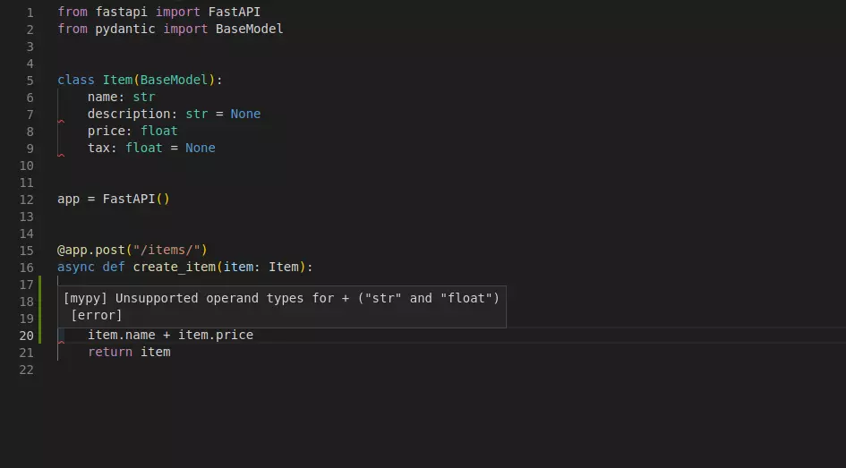

# FastAPI教程翻译

# (前言)：安装和运行

## 一、前言

 本教程将会一步一步教你使用fastapi的所有特性。

> - 每章节是建立在之前的章节上，但是每章节又是独立的一章节。面对指定的API需求，你可以直接去特定的任意章节。
> - 它也可以作为将来的参考。
> - 这样你可以回来，确切地了解您的需求。

## 二、运行代码

> 所有的代码块都能被复制和直接使用(实际上，它们是通过测试的Python 文件)

为了运行任何示例，将代码复制到`main.py`文件，然后用开启`uvicorn`服务：

```css
uvicorn main:app --reload
```

强烈建议你编写或复制代码，编辑并本地运行。

> 在编辑器中使用它确实可以为您显示FastAPI的好处，可以只需编写很少的代码，所有类型检查自动完成等。

## 三、安装FastAPI

 当然，第一步就是安装FastAPI啦，安装fastapi只需要一句语句：

```undefined
pip install fastapi
```

同样，fastapi启动依赖于uvicorn，所以别忘了安装uvicorn哦

```undefined
pip install uvicorn
```

# (一)：了解FastAPI结构

## 一、编写一个简单的FastAPI程序

最简单的FastAPI文件可能如下：

```python
from fastapi import FastAPI

app = FastAPI()

@app.get("/")
async def root():
    return {"message": "Hello World"}
```

将上面代码块复制到 `main.py`.

启动服务：

```css
uvicorn main:app --reload
```

**注意：**

`uvicorn main:app` 命令指:

- `main`: `main.py` 文件(也可理解为Python模块).
- `app`: `main.py` 中`app = FastAPI()`语句创建的app对象.
- `--reload`: 在代码改变后重启服务器，只能在开发的时候使用

你将会看到如下的输出：

```csharp
INFO: Started reloader process [17961]
INFO: Started server process [17962]
INFO: Waiting for application startup.
INFO: Uvicorn running on http://127.0.0.1:8000 (Press CTRL+C to quit) </pre>
```

最后一句表明你的app服务在本地的URL地址。

## 二、检查

打开你的浏览器，输入 [http://127.0.0.1:8000](https://links.jianshu.com/go?to=http%3A%2F%2F127.0.0.1%3A8000%2F).

你将会看见JSON响应：

```json
{"hello": "world"}
```

## 三、API交互文档

现在转到 [http://127.0.0.1:8000/docs](https://links.jianshu.com/go?to=http%3A%2F%2F127.0.0.1%3A8000%2Fdocs).

你将会看到自动生成的API交互文档(由 [Swagger UI](https://links.jianshu.com/go?to=https%3A%2F%2Fgithub.com%2Fswagger-api%2Fswagger-ui)提供):


## 四、可选的API文档

现在，转到 [http://127.0.0.1:8000/redoc](https://links.jianshu.com/go?to=http%3A%2F%2F127.0.0.1%3A8000%2Fredoc).

你将会看到自动生成的可选的API文档(由(provided by [ReDoc](https://links.jianshu.com/go?to=https%3A%2F%2Fgithub.com%2FRebilly%2FReDoc)提供):


ReDoc

## 五、OpenAPI

**FastAPI**使用用于定义API的OpenAPI标准为您的所有API生成“模式”。

#### 1. "模式"

模式”是事物的定义或描述。 不是实现它的代码，只是抽象描述。

#### 2. API "模式"

在这种情况下，OpenAPI是规定如何定义API模式的规范。

此OpenAPI架构将包括您的API路径，以及路径中包含的可能参数等。

#### 3. 数据 "模式"

术语“模式”也可能表示某些数据的形状，例如JSON内容。

在这种情况下，这将意味着JSON属性及其具有的数据类型，等等。

#### 4. OpenAPI 和 JSON 模式

- **OpenAPI** ：为你的API定义API模式. 并且这个模式包含了API传输数据的定义和API接收数据的定义。
- **JSON 模式**, the standard for JSON data schemas.

#### 5. 检查

如果你对原生的OpenAPI是什么样子感兴趣，它只是一个自动生成的JSON，其中包含所有API的描述。

你可以直接转到: [http://127.0.0.1:8000/openapi.json](https://links.jianshu.com/go?to=http%3A%2F%2F127.0.0.1%3A8000%2Fopenapi.json).

它将会展示可能是这样开头的JSON：

```bash
{
    "openapi": "3.0.2",
    "info": {
        "title": "Fast API",
        "version": "0.1.0"
    },
    "paths": {
        "/items/": {
            "get": {
                "responses": {
                    "200": {
                        "description": "Successful Response",
                        "content": {
                            "application/json": {

...
```

#### 6. 做什么的？

此OpenAPI架构是为所包括的2个交互式文档系统提供支持的。

并且有数十种替代方案，全部基于OpenAPI。 您可以轻松地将这些替代方案中的任何一种添加到使用** FastAPI **构建的应用程序中。

您还可以使用它为与您的API通信的客户端自动生成代码。 例如，前端，移动或物联网应用程序。

## 六、概括

### Step 1: import `FastAPI`

```python
from fastapi import FastAPI 
app = FastAPI()

@app.get("/")
async def root():
    return {"message": "Hello World"}
```

`FastAPI` 是为您的API提供所有功能的一个Python类。

> **技术细节**
>
> - FastAPI是直接从Starlette继承的类。
>
> 您也可以将所有Starlette功能与FastAPI一起使用.

### Step 2: 创建一个 `FastAPI` 实例

```python
app = FastAPI() 

@app.get("/")
async def root():
    return {"message": "Hello World"}
```

上面代码中`app` 变量就是`FastAPI`的一个实例.

这将是创建所有API的主要交互点。

该app与uvicorn在命令中引用的同一个app：

```css
uvicorn main:app --reload
```

如果你创建的app像这样：

```python
my_awesome_api = FastAPI() 

@my_awesome_api.get("/")
async def root():
    return {"message": "Hello World"}
```

将上段代码保存到 `main.py`, 然后你可以这样启动 `uvicorn` :

```css
uvicorn main:my_awesome_api --reload
```

### Step 3: 创建一个path 操作

#### Path

这里的“路径”是指URL的最后一部分，从第一个`/`开始。

因此，在一个URL中：

```cpp
https://example.com/items/foo
```

路径可能是:

```undefined
/items/foo
```

> “路径”通常也称为“端点”或“路由”。

构建API时，“路径”是分离“关注点”和“资源”的主要方法。

#### Operation

"Operation" 这里指 HTTP 方法：

比如:

- `POST`
- `GET`
- `PUT`
- `DELETE`

...还有更少见的一些方法:

- `OPTIONS`
- `HEAD`
- `PATCH`
- `TRACE`

在HTTP协议中，你可以使用任意方法访问一个路径

------

构建API时，通常使用这些特定的HTTP方法来执行特定的操作。

通常你会用到:

- `POST`: 创建数据.
- `GET`: 读取数据.
- `PUT`: 更新数据.
- `DELETE`: 删除数据.

因此，在OpenAPI中，每个HTTP方法都称为`方法`。

在以后的内容中，我们也把它称为方法。

#### 定义URL路由

```dart
from fastapi import FastAPI

app = FastAPI()
@app.get("/")
async def root():
    return {"message": "Hello World"}
```

`@app.get("/")`指明 **FastAPI** 下面的函数负责处理收到的请求：

- 路径 `/`
- 使用`get` 方法

Python中 `@something` 语法被称为`装饰器`.

将这个装饰器放在函数的上方，就像一个漂亮的装饰帽(我猜想这也是这个属于名称的来源).

一个"装饰器"使用下方的函数，并对其进行处理.

在我们的例子中，这个装饰器告诉**FastAPI**，下方视图函数将会响应**路径**`/`中的**方法**`get`.

这就是**路由操作装饰器**.

你也可以其他方法的装饰器:

- `@app.post()`
- `@app.put()`
- `@app.delete()`

还有一些比较少见的方法的装饰器:

- `@app.options()`
- `@app.head()`
- `@app.patch()`
- `@app.trace()`

#### 建议

你可以使用任意的HTTP方法.

**FastAPI**不强制任何特定函数。

此处提供的信息，仅供参考，并非必需。

例如，当使用 GraphQL , 你通常会只执行`post`方法

### Step 4: 定义**路径操作函数**

这是我们的 "**路径操作函数**":

- **路径**:  `/`.
- **操作**:  `get`.
- **函数**: `@app.get("/")`下方的函数.

```python
from fastapi import FastAPI

app = FastAPI()
@app.get("/")
async def root():
    return {"message": "Hello World"}
```

这是Python函数。

这个函数将会被 **FastAPI** 调用只要有 `GET`请求到URL "`/`".

在这个例子中，使用的是 `async` 函数。

你也可以定义普通的函数而不是`async def`:

```python
from fastapi import FastAPI

app = FastAPI()
@app.get("/")
def root():
    return {"message": "Hello World"}
```

#### 注释

如果你不了解其中的区别，可以查看*"In a hurry?"* 章节关于 [`async` and `await` in the docs](https://links.jianshu.com/go?to=https%3A%2F%2Ffastapi.tiangolo.com%2Fasync%2F%23in-a-hurry).

### Step 5: 返回内容


```python
from fastapi import FastAPI

app = FastAPI()

@app.get("/")
async def root():
 return {"message": "Hello World"}
```

#### 可返回的类型

> 你可以返回一个`dict`, `list`，单独的值，比如`str`, `int`等
>
> 你也可以返回 **Pydantic模型**，在稍后的章节中会看到更多。

在**FastAPI**中，许多其他的对象和模型都会被自动转换为JSON(包括ORM等)。

试着使用最适合您的方法，很有可能他们已经支持了。

## 七、总结

- Import `FastAPI`.
- 创建一个  `app` 实例.
- 编写一个 **路径操作装饰器** (比如`@app.get("/")`).
- 编写一个**路径操作函数** (比如上方的 `def root(): ...` ).
- 运行开发服务器(比如`uvicorn main:app --reload`).

# (二)：Path参数

## 一、声明路径参数

您可以使用Python格式字符串使用的相同语法声明路径“参数”或“变量”：

```dart
from fastapi import FastAPI

app = FastAPI()
@app.get("/items/{item_id}")
async def read_item(item_id):
    return {"item_id": item_id}
```

路径参数 `item_id` 的值会作为参数 `item_id` 传递到你的视图函数.

因此，如果你运行上述示例，然后跳转到 [http://127.0.0.1:8000/items/foo](https://links.jianshu.com/go?to=http%3A%2F%2F127.0.0.1%3A8000%2Fitems%2Ffoo), 你将会看见这样的回应:

```json
{"item_id":"foo"}
```

## 二、路径参数的类型

您可以使用 **标准的Python类型注释** 在函数中声明路径参数的类型：

```python
from fastapi import FastAPI

app = FastAPI()
@app.get("/items/{item_id}")
async def read_item(item_id: int):
    return {"item_id": item_id}
```

在上述示例中，`item_id` 被声明为 `int` 类型.

### 说明

这将为您的函数提供编辑器支持，包括错误检查，完整性检查等。

## 三、数据转换

当你在你的浏览转到[http://127.0.0.1:8000/items/3](https://links.jianshu.com/go?to=http%3A%2F%2F127.0.0.1%3A8000%2Fitems%2F3), 你将会看到如下的响应：

```json
{"item_id":3}
```

#### 说明

指明你的函数接收并返回的参数是`3`，是Python中的`int`类型，而不是字符串 `"3"`.

因此，只要有了类型检查,  **FastAPI**为您自动提供请求“解析”。

## 四、数据校验

将你的浏览器跳转到 [http://127.0.0.1:8000/items/foo](https://links.jianshu.com/go?to=http%3A%2F%2F127.0.0.1%3A8000%2Fitems%2Ffoo), 你将会看见一个友好的HTTP错误页：

```json
{
    "detail": [
        {
            "loc": [
                "path",
                "item_id"
            ],
            "msg": "value is not a valid integer",
            "type": "type_error.integer"
        }
    ]
}
```

错误的原因在于路径参数 `item_id` 的值 `"foo"`不是 `int`.

同样，当你提供一个  `float` 类型的值的时候也会报错 [http://127.0.0.1:8000/items/4.2](https://links.jianshu.com/go?to=http%3A%2F%2F127.0.0.1%3A8000%2Fitems%2F4.2)

#### 说明

因此，使用Python类型声明，**FastAPI** 还可提供数据验证。

请注意，该错误也清楚地指出了验证未通过的点。

在开发和调试与您的API交互的代码时，这非常有用。

## 五、文档

在浏览器打开 [http://127.0.0.1:8000/docs](https://links.jianshu.com/go?to=http%3A%2F%2F127.0.0.1%3A8000%2Fdocs), 你将会看见如下的API交互文档:


#### 说明

再次使用相同的Python类型声明，**FastAPI** 为您提供自动的交互式文档（集成Swagger UI）。

请注意，path参数声明为整数。

## 六、基于标准的好处：可选文档

因为都是从标准  [OpenAPI](https://links.jianshu.com/go?to=https%3A%2F%2Fgithub.com%2FOAI%2FOpenAPI-Specification%2Fblob%2Fmaster%2Fversions%2F3.0.2.md) 产生的模型，这里有许多可选的兼容工具.

基于这个原因， **FastAPI** 本身提供了一个可选的 API 文档(使用 ReDoc):


同样，有许多兼容的工具。 包括多种语言的代码生成工具。

## 七、Pydantic

所有的数据验证都是由 [Pydantic](https://links.jianshu.com/go?to=https%3A%2F%2Fpydantic-docs.helpmanual.io%2F)实现的.

你可以用同样的类型声明比如 `str`, `float`, `bool` 或者其他更复杂的类型.

本教程的下一章将探讨其中的一些内容。

## 八、指定路径顺序

创建路径操作时，您会发现路径固定的情况。

像/ users / me一样，假设它是获取有关当前用户的数据。

然后，您还可以使用路径/ users / {user_id}来通过某些用户ID获取有关特定用户的数据。

由于路径操作是按顺序评估的，因此您需要确保/ users / me的路径在/ users / {user_id}的路径之前声明。

```ruby
from fastapi import FastAPI

app = FastAPI()
@app.get("/users/me")
async def read_user_me():
    return {"user_id": "the current user"}

@app.get("/users/{user_id}")
async def read_user(user_id: str):
    return {"user_id": user_id}
```

否则，`/ users / {user_id}`的路径也将匹配`/ users / me`，“认为”它正在接收参数“ user_id”，其值为“ me”。

## 九、预定义Path参数

如果您的 **path操作** 接收到 **path参数**，但是您希望预定义可能的有效 **path参数**值，则可以使用标准的Python `Enum`.

### 1. 创建一个 `Enum` 类

Import `Enum` 然后创建一个子类继承自 `str` 和 `Enum`.

通过继承 `str` , API 文档将可能知道接收的值必须是 `string` 类型才会被正确渲染。

并创建具有固定值的类属性，这些固定值将是可用的有效值：

```python
from enum import Enum 
from fastapi import FastAPI

class ModelName(str, Enum):
    alexnet = "alexnet"
    resnet = "resnet"
    lenet = "lenet" 

app = FastAPI()
@app.get("/model/{model_name}")
async def get_model(model_name: ModelName):
    if model_name == ModelName.alexnet:
        return {"model_name": model_name, "message": "Deep Learning FTW!"}
    if model_name.value == "lenet":
        return {"model_name": model_name, "message": "LeCNN all the images"}
    return {"model_name": model_name, "message": "Have some residuals"}
```

> `注意:`  [Enumerations (or enums) are available in Python](https://links.jianshu.com/go?to=https%3A%2F%2Fdocs.python.org%2F3%2Flibrary%2Fenum.html) 仅在Python3.4+提供支持.

> **说明**：“ AlexNet”，“ ResNet”和“ LeNet”只是机器学习模型的名称。

### 2. 声明 **Path 参数**

然后使用您创建的枚举类（`ModelName`）创建带有类型注释的* path参数*：

```python
from enum import Enum

from fastapi import FastAPI

class ModelName(str, Enum):
    alexnet = "alexnet"
    resnet = "resnet"
    lenet = "lenet"

app = FastAPI()
@app.get("/model/{model_name}")
async def get_model(model_name: ModelName):
    if model_name == ModelName.alexnet:
        return {"model_name": model_name, "message": "Deep Learning FTW!"}
    if model_name.value == "lenet":
        return {"model_name": model_name, "message": "LeCNN all the images"}
    return {"model_name": model_name, "message": "Have some residuals"}
```

### 3. 检查文档

由于指定了 **path参数** 的可用值，因此交互式文档可以很好地显示它们：


### 4. 使用 Python 枚举

**path 参数** 的值是*enumeration 成员*之一.

#### a. 比较 : 枚举成员

您可以将其与创建的枚举 `ModelName` 中的 *枚举成员* 进行比较：

```python
from enum import Enum
from fastapi import FastAPI

class ModelName(str, Enum):
    alexnet = "alexnet"
    resnet = "resnet"
    lenet = "lenet"

app = FastAPI()
@app.get("/model/{model_name}")
async def get_model(model_name: ModelName):
    if model_name == ModelName.alexnet:
        return {"model_name": model_name, "message": "Deep Learning FTW!"}
    if model_name.value == "lenet":
        return {"model_name": model_name, "message": "LeCNN all the images"}
    return {"model_name": model_name, "message": "Have some residuals"}
```

#### b. 获取: 枚举成员的值

你可以使用 `model_name.value` 获得枚举值(在本例中是 `str`)， 一般情况下， `your_enum_member.value`：

```python
from enum import Enum
from fastapi import FastAPI

class ModelName(str, Enum):
    alexnet = "alexnet"
    resnet = "resnet"
    lenet = "lenet"

app = FastAPI()
@app.get("/model/{model_name}")
async def get_model(model_name: ModelName):
    if model_name == ModelName.alexnet:
        return {"model_name": model_name, "message": "Deep Learning FTW!"}
    if model_name.value == "lenet":
        return {"model_name": model_name, "message": "LeCNN all the images"}
    return {"model_name": model_name, "message": "Have some residuals"}
```

> 也可以使用  `ModelName.lenet.value` 得到 `lenet` 的值

#### c. 返回: *枚举成员*

你也可以从你的 *路径操作* 返回 *枚举成员*， 甚至嵌套在 JSON 中(比如一个`dict`).

在将它们返回给客户端之前，它们将被转换为相应的值：

```python
from enum import Enum
from fastapi import FastAPI

class ModelName(str, Enum):
    alexnet = "alexnet"
    resnet = "resnet"
    lenet = "lenet"

app = FastAPI()
@app.get("/model/{model_name}")
async def get_model(model_name: ModelName):
    if model_name == ModelName.alexnet:
        return {"model_name": model_name, "message": "Deep Learning FTW!"}
    if model_name.value == "lenet":
        return {"model_name": model_name, "message": "LeCNN all the images"}
    return {"model_name": model_name, "message": "Have some residuals"} 
```

## 十、包含Path的路径参数

假设现在你有一个路径操作：`/files/{file_path}`，这就需要 `file_path` 本身包含一个 *路径*， 比如  `home/johndoe/myfile.txt`.

因此，文件路径可能是:  `/files/home/johndoe/myfile.txt`.

### 1. OpenAPI 支持

OpenAPI 本身并不支持定义包含path的路径参数，因此这可能导致难以定义和测试。

不过, 使用 Starlette的内置工具仍然可以在 **FastAPI** 中实现该功能。

并且支持交互文档，只是文档中并不会添加任何说明，告诉你这个参数可能应该Path。

### 2. Path 转换器

使用直接来自Starlette的选项，您可以使用以下声明带 *path* 的 * path参数*：

```undefined
/files/{file_path:path}
```

在上面例子中，参数的名字是 `file_path`，`:path`说明参数`file_path`对应的类型是 *path* 类型.

因此，你也可以这样使用它：

```python
from fastapi import FastAPI

app = FastAPI()
@app.get("/files/{file_path:path}")
async def read_user_me(file_path: str):
    return {"file_path": file_path}
```

### 3. 建议

你可能会将参数以 `/` 开头，比如 `/home/johndoe/myfile.txt`

在这个例子中，URL将会是 `/files//home/johndoe/myfile.txt`, 在 `files` 和 `home`之间会有双斜线`//`.

## 十一、总结

使用** FastAPI **，通过使用简短，直观和标准的Python类型声明，您可以获得：

- 编辑器支持: 错误检查, 自动补全, 等
- 数据解析
- 数据验证
- API批注和自动文档

并且你只需要声明一次即可

与其他框架相比，这可能是** FastAPI **的主要可见优势（除了原始性能）。

# (三)：Query参数

## 一、Query参数

当你声明不属于路径参数的其他函数参数时，它们将自动解释为“Query”参数，也就是查询参数。

```dart
from fastapi import FastAPI

app = FastAPI()

fake_items_db = [{"item_name": "Foo"}, {"item_name": "Bar"}, {"item_name": "Baz"}]

@app.get("/items/")
async def read_item(skip: int = 0, limit: int = 10):
    return fake_items_db[skip : skip + limit]
```

query就是一系列的在URL?之后的key-value键值对，每对键值对用 `&` 分割开来。

例如，在这个URL：

```bash
http://127.0.0.1:8000/items/?skip=0&limit=10
```

...查询参数是:

- `skip`: 值为 `0`
- `limit`: 值为 `10`

由于它们都是URL的一部分，所以 "本质上" 它们都是字符串。

但是当你需要使用Python类型来声明query参数的时候(如上面的例子，需要用`int`)，他们就会被转换为响应的类型并且依据这个类型来验证传入参数。

适用于Path参数的所有过程也适用于Query参数

- 编辑器支持
- 数据解析
- 数据验证
- 自动文档

## 二、设置默认Query参数

query参数类不是path中固定的一部分，所以他们是可选的，并且可以有默认值。

在上面的例子中, 可以看到query参数拥有默认值 `skip=0` 和 `limit=10`.

那么，如果访问到这个URL：

```cpp
http://127.0.0.1:8000/items/
```

将执行以下相同操作：

```bash
http://127.0.0.1:8000/items/?skip=0&limit=10
```

但是，如果你跳转到下面的地址：

```cpp
http://127.0.0.1:8000/items/?skip=20
```

视图函数中Query参数的值如下：

- `skip=20`: URL中设定的值
- `limit=10`: 默认的值

## 三、设置可选Query参数

同样，你也可以声明可选的Query参数，只需要将他们的默认值设置为None即可。

```python
from fastapi import FastAPI
app = FastAPI()
@app.get("/items/{item_id}")
async def read_item(item_id: str, q: str = None):
    if q:
        return {"item_id": item_id, "q": q}
    return {"item_id": item_id}
```

在这个例子中，是凸函数参数q是可选的查询参数，默认值是None.

> 注意： **FastAPI** 足够灵活去区分 `item_id` 是路径参数，并且 `q` 是一个查询参数。

## 四、Query参数类型转换

你也可以将查询参数声明为  `bool` 类型，那么传入的参数会被转换：

```csharp
from fastapi import FastAPI

app = FastAPI()
@app.get("/items/{item_id}")
async def read_item(item_id: str, q: str = None, short: bool = False):
    item = {"item_id": item_id}
    if q:
        item.update({"q": q})
    if not short:
        item.update(
            {"description": "This is an amazing item that has a long description"}
        )
    return item
```

在这个例子中，如果你访问：

```cpp
http://127.0.0.1:8000/items/foo?short=1
```

或访问：

```cpp
http://127.0.0.1:8000/items/foo?short=True
```

或访问：

```bash
http://127.0.0.1:8000/items/foo?short=true
```

或访问：

```cpp
http://127.0.0.1:8000/items/foo?short=on
```

或访问：

```cpp
http://127.0.0.1:8000/items/foo?short=yes
```

或者其他类型的变量，视图函数将会把query参数 `short` 转换为 `True` 或者 `False`.

## 五、同时使用 Path参数 和 Query参数的

你也可以同时声明多个Path参数和Query参数，***FastAPI** 会分别区分参数。

> 你并不需要声明它们的时候按照指定的顺序，因为这些参数可以被参数名检测到

```csharp
from fastapi import FastAPI

app = FastAPI()
@app.get("/users/{user_id}/items/{item_id}")
async def read_user_item(user_id: int, item_id: str, q: str = None, short: bool = False ):
    item = {"item_id": item_id, "owner_id": user_id}
    if q:
        item.update({"q": q})
    if not short:
        item.update(
            {"description": "This is an amazing item that has a long description"}
        )
    return item
```

## 六、必需的查询参数

当你需要定义一个查询参数，而且这个参数必须传入，那么你就不能为这个参数定义任意的默认值：

```csharp
from fastapi import FastAPI

app = FastAPI()
@app.get("/items/{item_id}")
async def read_user_item(item_id: str, needy: str):
    item = {"item_id": item_id, "needy": needy}
    return item
```

这里的查询参数needy是str类型的必需查询参数。

打开你的浏览器，访问URL：

```cpp
http://127.0.0.1:8000/items/foo-item
```

...在没有加入必须的查询参数 `needy`，你将会看见如下报错：

```json
{
    "detail": [
        {
            "loc": [
                "query",
                "needy"
            ],
            "msg": "field required",
            "type": "value_error.missing"
        }
    ]
}
```

报错显示 `needy` 是必需的查询参数，需要在URL中设定.

现在访问如下路径：

```cpp
http://127.0.0.1:8000/items/foo-item?needy=sooooneedy
```

...浏览器不报错，显示如下:

```json
{
    "item_id": "foo-item",
    "needy": "sooooneedy"
}
```

当然，您可以根据需要定义一些参数，一些具有默认值，而某些则完全可选：

```csharp
from fastapi import FastAPI

app = FastAPI()
@app.get("/items/{item_id}")
async def read_user_item(item_id: str, needy: str, skip: int = 0, limit: int = None):
    item = {"item_id": item_id, "needy": needy, "skip": skip, "limit": limit}
    return item
```

在上面的例子中，这里有3个查询参数：

- `needy`, 必需传入的，且类型为`str`.
- `skip`, 类型为 `int` 且默认值为 `0`.
- `limit`, 可选传入参数 `int`.

#### 建议

你也可以使用 *Path 参数* 中的 `Enum` 方法 [the same way as with *path parameters*](https://links.jianshu.com/go?to=https%3A%2F%2Ffastapi.tiangolo.com%2Ftutorial%2Fpath-params%2F%23predefined-values).

## 七、可选的类型声明

### 1. 警告

这可能是高级用法的示例。

如果你正在使用  `mypy` ，它可能出现如下的类型声明：

```bash
limit: int = None
```

将会报错如下：

```bash
Incompatible types in assignment (expression has type "None", variable has type "int")
```

在这个例子中，你可以使用 `Optional` 告诉 `mypy`，这个值可能是 `None`，比如：

```python
from typing import Optional
limit: Optional[int] = None
```

在 *路径操作* 中使用：

```python
from typing import Optional

from fastapi import FastAPI

app = FastAPI()
@app.get("/items/{item_id}")
async def read_user_item(item_id: str, limit: Optional[int] = None):
    item = {"item_id": item_id, "limit": limit}
    return item
```

> `注意：` 该用法在 `Path参数`  中不可使用！

# (四)：Request Body(请求体)

## 一、什么是请求体？

当您需要将数据从客户端（例如浏览器）发送到API时，可以将其作为 **“请求体”** 发送。

**请求体**是客户端发送到您的API的数据。 **响应体**是您的API发送给客户端的数据。

API几乎总是必须发送一个**响应体**，但是客户端并不需要一直发送**请求体**。

定义**请求体**，需要使用 **[Pydantic](https://links.jianshu.com/go?to=https%3A%2F%2Fpydantic-docs.helpmanual.io%2F) 模型**。

> - 不能通过`GET`请求发送请求体
> - 发送请求体数据，必须使用以下几种方法之一：
>   - `POST` (最常见),
>   - `PUT`
>   - `DELETE`
>   - `PATCH`.

## 二、导入`Pydantic's`的 `BaseModel`

### 定义模型

- 1. 你需要从`pydantic`中导入`BaseModel`

```jsx
import BaseModel from pydantic
```

## 三、创建数据模型

- 然后，声明你的数据模型为一个类，且该类继承 `BaseModel`.

> 所有的属性都用标准Python类

```python
from pydantic import BaseModel

class Item(BaseModel):
    name: str 
    description: str = None
    price: float tax: float = None 
```

> 和Query参数一样：数据类型的属性如果不是必须的话，可以拥有一个默认值。否则，该属性就是必须的。
>
> - 可以使用`None`让这个属性变为可选的。

例如，上面的模型`Item`声明了一个`JSON`对象（或Python`dict`），例如:

```json
{
    "name": "Foo",
    "description": "An optional description",
    "price": 45.2,
    "tax": 3.5
}
```

...`description`和`tax`属性是可选的(因为有默认值`None`)，所以下面这个`JSON`对象也是有效的：

```json
{
    "name": "Foo",
    "price": 45.2
}
```

## 四、将模型定义为参数

将上面定义的模型添加到你的路径操作中，就和定义Path和Query参数一样的方式：

```python
from fastapi import FastAPI
from pydantic import BaseModel

class Item(BaseModel):
    name: str
    description: str = None
    price: float
    tax: float = None

app = FastAPI()
@app.post("/items/")
async def create_item(item: Item):
    return item
```

...声明参数的类型为你创建的模型 `Item`.

## 五、使用 `Request Body` 的好处

通过那样定义Python 类型为`pydantic`的`model`，**FastAPI** 将会:

- 将读取请求的正文读取为JSON类型。
- 转换相应的类型（如果需要）。
- 验证数据。

> 如果数据无效，它将返回一个清晰的错误，指出错误数据的确切位置和来源.

- 在参数`item`中为您提供接收的数据。

> 当您在函数中将其声明为`Item`类型时，您还将获得`Item`所有属性及其类型的所有编辑器支持（自动补全等）。
>  *为您的模型生成 [JSON Schema](https://links.jianshu.com/go?to=http%3A%2F%2Fjson-schema.org%2F) 定义，如果对您的项目有意义，您还可以在其他任何喜欢的地方使用它们。

- 这些`Schemas`将是生成的`OpenAPI Schema`的一部分，并由自动文档UI使用

## 六、自动文档

模型的 `JSON Schema` 将成为OpenAPI生成模式的一部分，并将显示在交互式API文档中：


并且还将在需要它们的每个路径操作的API文档中使用：


## 七、编辑器支持

在你的编辑器中，编写的函数中，你将会获得类型提示和补全：

> `注意：`如果你接收的是一个`dict`，而不是一个`Pydantic model`将不会获得提示和补全。


您也会获得类型操作错误检查：



> 这并非偶然，整个框架都是围绕该设计构建的。
>
> 并且在进行任何完善之前，都要在设计阶段进行全面测试，以确保它可以与所有编辑器一起使用。

`Pydantic`本身甚至进行了一些更改以支持此操作。

> 之前的屏幕截图是使用[Visual Studio Code](https://links.jianshu.com/go?to=https%3A%2F%2Fcode.visualstudio.com%2F) 拍摄的。

但是您可以通过[PyCharm](https://links.jianshu.com/go?to=https%3A%2F%2Fwww.jetbrains.com%2Fpycharm%2F) 和大多数其他Python编辑器获得相同的编辑器支持：


## 八、使用这个模型

在函数内部，您可以直接访问模型对象的所有属性：

```python
from fastapi import FastAPI
from pydantic import BaseModel

class Item(BaseModel):
    name: str
    description: str = None
    price: float
    tax: float = None

app = FastAPI()

@app.post("/items/")
async def create_item(item: Item):
    item_dict = item.dict()
    if item.tax:
 		price_with_tax = item.price + item.tax
    item_dict.update({"price_with_tax": price_with_tax})
    return item_dict
```

## 九、Request body + path 参数

你可以同时定义`Path参数`和`请求体参数`.

> **FastAPI** 将:
>
> - 识别出与路径参数相匹配的功能参数应从路径中获取
> - 声明为Pydantic模型的功能参数应从请求主体中获取。

```python
from fastapi import FastAPI
from pydantic import BaseModel

class Item(BaseModel):
    name: str
    description: str = None
    price: float
    tax: float = None

app = FastAPI()

@app.put("/items/{item_id}") 
async def create_item(item_id: int, item: Item):
    return {"item_id": item_id, **item.dict()}
```

## 十、Request body + path + query 参数

你可以同时定义`Path参数`、`Query参数` 和 `请求体参数`.

** FastAPI **将识别它们中的每一个并从正确的位置获取数据。

```python
from fastapi import FastAPI
from pydantic import BaseModel

class Item(BaseModel):
    name: str
    description: str = None
    price: float
    tax: float = None

app = FastAPI()
@app.put("/items/{item_id}")
async def create_item(
    item_id: int,
    item: Item,
    q: str = None
):
    result = {"item_id": item_id, **item.dict()}
    if q:
        result.update({"q": q})
    return result
```

##### FastAPI识别过程：

- 如果在 **path**中也声明了该参数，它将用作**path**参数。
- 如果参数是 **单一类型**（例如int，float，str，str，bool等），它将被解释为 **query**参数。
   *如果参数声明为**Pydantic模型**的类型，则它将被解释为 **请求体**。

# (五)：Query参数 & 字符串验证

## 一、Query参数

**FastAPI** 允许您声明其他信息并验证参数。

以下面的例子为例：

```python
from fastapi import FastAPI

app = FastAPI()
@app.get("/items/")
async def read_items(q: str = None):
    results = {"items": [{"item_id": "Foo"}, {"item_id": "Bar"}]}
    if q:
        results.update({"q": q})
    return results
```

query 参数 `q` 是 `str` 类型, 并且默认为 `None`, 说明它是可选的。

## 二、为`Query`参数附加验证

我们将设置：即使 `q` 是可选的，只要提供了`q`，它的**长度就不能超过50个字符**。

### 1. Import `Query`

为了实现这个参数验证，首先需要从 `fastapi` 导入 `Query`

```python
from fastapi import FastAPI, Query 
app = FastAPI()

@app.get("/items/")
async def read_items(q: str = Query(None, max_length=50)):
    results = {"items": [{"item_id": "Foo"}, {"item_id": "Bar"}]}
    if q:
        results.update({"q": q})
    return results
```

## 三、使用 `Query` 设置`max_length`验证

现在使用 `Query`方法设置参数的默认值，另外设置 `max_length` 为 50:

```python
from fastapi import FastAPI, Query

app = FastAPI()

@app.get("/items/")
async def read_items(q: str = Query(None, max_length=50)):
    results = {"items": [{"item_id": "Foo"}, {"item_id": "Bar"}]}
    if q:
        results.update({"q": q})
    return results
```

因为我们必须用 `Query(None)` 替换默认值`None'，所以`Query`的第一个参数是定义默认值。

```rust
q: str = Query(None)
```

...也可直接用下面方法使得参数变为可选:

```rust
q: str = None
```

但是`Query`方法明确地将其声明为查询参数。

然后，我们可以将更多参数传递给Query。 在这种情况下，适用于字符串的 `max_length`参数：

```rust
q: str = Query(None, max_length=50)
```

这将验证数据，当数据无效时显示清楚的错误，并在OpenAPI Schema路径操作中记录参数。

## 四、添加其他验证

你也可以添加 `min_length`参数，设置最短长度:

```rust
q: str = Query(None, min_length=n, max_length=m)
```

**举例：**

```python
from fastapi import FastAPI, Query

app = FastAPI()
@app.get("/items/")
async def read_items(q: str = Query(None, min_length=3, max_length=50)):
    results = {"items": [{"item_id": "Foo"}, {"item_id": "Bar"}]}
    if q:
        results.update({"q": q})
    return results
```

## 五、添加正则表达式验证

您可以定义参数应匹配的正则表达式：

```rust
 q: str = Query(None, regex="regular expression") ):
```

**举例：**

```python
from fastapi import FastAPI, Query

app = FastAPI()
@app.get("/items/")
async def read_items(q: str = Query(None, min_length=3, max_length=50, regex="^fixedquery$") ):
    results = {"items": [{"item_id": "Foo"}, {"item_id": "Bar"}]}
    if q:
        results.update({"q": q})
    return results
```

这个特定的正则表达式检查接收到的参数值：

- `^`:  以...开头，之前没有字符。
- `fixedquery`: 匹配 `fixedquery` 字符串.
- `$`: 以...结尾，`fixedquery`后不匹配任何字符.

如果您对所有这些 **“正则表达式” ** 想法感到迷惑，请不要担心。 对于许多人来说，这是一个很难的话题。 您仍然可以做很多事情而无需正则表达式。

但是只要您需要正则的时候，就去学习它们，就知道您已经可以直接在** FastAPI **中使用它们了。

## 六、设置默认值

同样的方法，你可以不使用`None`作为`Query`第一个参数，也可以设置其他的值。

假如，你现在想设置一个查询参数为 `q` , 其中 `min_length` 为 `3`, 并且设置默认值为 `"fixedquery"`:

```python
from fastapi import FastAPI, Query

app = FastAPI()

@app.get("/items/")
async def read_items(q: str = Query("fixedquery", min_length=3)):
    results = {"items": [{"item_id": "Foo"}, {"item_id": "Bar"}]}
    if q:
        results.update({"q": q})
    return results
```

> `注意`：设置查询参数的默认值，同样使得该参数是可选的。

## 七、设置查询参数变为必需

当我们不需要声明更多的验证或元数据时，可以通过不声明默认值就可以使`q`查询参数成为必需，例如：

```rust
q: str
```

而不是:

```rust
q: str = None
```

现在我们用 `Query`来声明:

```rust
q: str = Query(None, min_length=3)
```

当你想使用 `Query`声明该查询参数必需的时候, 你可以使用 `...` 作为第一个参数:

```python
from fastapi import FastAPI, Query

app = FastAPI()
@app.get("/items/")
async def read_items(q: str = Query(..., min_length=3)):
    results = {"items": [{"item_id": "Foo"}, {"item_id": "Bar"}]}
    if q:
        results.update({"q": q})
    return results
```

> `注意：`如果您之前没看过`...`：它是一个特殊的单一值，它是[Python的一部分，被称为“省略号”](https://links.jianshu.com/go?to=https%3A%2F%2Fdocs.python.org%2F3%2Flibrary%2Fconstants%E7%9A%84.html%23Ellipsis)。
>
> 这将使 **FastAPI**知道此参数是必需的。

## 八、设置Query 参数 列表 / 多个值

当你明确用 `Query`定义查询参数的时候，你也可以声明该参数获取一个列表，或者说获取多个值。

例如，声明查询参数 `q` 可以在URL中出现多次，你可以这样写：

```rust
q: List[str] = Query(None)
```

```python
from typing import List
from fastapi import FastAPI, Query

app = FastAPI()
@app.get("/items/")
async def read_items(q: List[str] = Query(None)):
    query_items = {"q": q}
    return query_items
```

那么，URL将会如下：

```cpp
http://localhost:8000/items/?q=foo&q=bar
```

您会在 *path操作函数* 中的 *函数参数* q中的Python列表中收到多个q查询参数的*值（foo和bar）。

因此，对该URL的响应为:

```json
{
  "q": [
    "foo",
    "bar"
  ]
}
```

> `注意：` 要声明类型为`list`的查询参数，如上例所示，您需要显式使用`Query`，否则它将被解释为`请求正文`。

交互式API文档将相应更新，以允许多个值：


### 1. Query 参数 列表/多个值 设置默认值

如果没有提供值，您还可以定义一个默认值列表：

```python
from typing import List

from fastapi import FastAPI, Query

app = FastAPI()

@app.get("/items/")
async def read_items(q: List[str] = Query(["foo", "bar"])):
    query_items = {"q": q}
    return query_items
```

接着访问:

```cpp
http://localhost:8000/items/
```

`q` 的默认值为 `["foo", "bar"]` 并且你的响应为:

```json
{
  "q": [
    "foo",
    "bar"
  ]
}
```

#### 2. 使用 `list`

你可以直接使用 `list` 而不是 `List[str]`:

```python
from fastapi import FastAPI, Query

app = FastAPI()

@app.get("/items/")
async def read_items(q: list = Query(None)):
    query_items = {"q": q}
    return query_items
```

> **注意：**  留意这个例子，FastAPI将不会检查列表中的内容。
>
> 例如, `List[int]` 将会检查 `List` 里面元素是否都为整数. 但是 `list` 本身并不会检查。

## 九、声明更多元数据

您可以添加有关该参数的更多信息。

该信息将包含在生成的OpenAPI中，并由文档用户界面和外部工具使用。

**注意：**

> 请记住，不同的工具可能具有不同级别的OpenAPI支持。

尽管在大多数情况下，缺少的功能已经计划进行开发，但其中一些可能不会显示所有已声明的额外信息。

你可以添加 `title`:

```python
from fastapi import FastAPI, Query

app = FastAPI()

@app.get("/items/")
async def read_items(q: str = Query(None, title="Query string", min_length=3)):
    results = {"items": [{"item_id": "Foo"}, {"item_id": "Bar"}]}
    if q:
        results.update({"q": q})
    return results
```

添加一个描述 `description`:

```python
from fastapi import FastAPI, Query

app = FastAPI()

@app.get("/items/")
async def read_items(
    q: str = Query(
        None,
        title="Query string",
        description="Query string for the items to search in the database that have a good match",
        min_length=3,
    )
):
    results = {"items": [{"item_id": "Foo"}, {"item_id": "Bar"}]}
    if q:
        results.update({"q": q})
    return results
```

## 十、别名参数

如果你想设置参数为 `item-query`

比如:

```cpp
http://127.0.0.1:8000/items/?item-query=foobaritems
```

但是 `item-query` 并不是有效的Python变量名。与之形式最像的参数名为 `item_query`.但是你却想参数直接为 `item-query`...

此时你可以定义一个 `alias` 参数，并且 alias将会被用来查找到这个参数的值

```python
from fastapi import FastAPI, Query

app = FastAPI()

@app.get("/items/")
async def read_items(q: str = Query(None, alias="item-query")):
    results = {"items": [{"item_id": "Foo"}, {"item_id": "Bar"}]}
    if q:
        results.update({"q": q})
    return results
```

## 十一、弃用参数

现在假如，你再也不需要某个参数了。

但是您必须将其保留一段时间，因为有许多客户在使用它，但是您希望文档将其清楚地显示为已弃用。

你只需要传递参数 `deprecated=True` 给 `Query`即可:

```python
from fastapi import FastAPI, Query

app = FastAPI()

@app.get("/items/")
async def read_items(
    q: str = Query(
        None,
        alias="item-query",
        title="Query string",
        description="Query string for the items to search in the database that have a good match",
        min_length=3,
        max_length=50,
        regex="^fixedquery$",
        deprecated=True,    )
):
    results = {"items": [{"item_id": "Foo"}, {"item_id": "Bar"}]}
    if q:
        results.update({"q": q})
    return results
```

文档将会如下：


## 十二、总结

你可以声明一些额外的验证和元数据给你的  `Query`参数.

常用的验证和元数据：

- `alias`
- `title`
- `description`
- `deprecated`

对字符串的特定验证：

- `min_length`
- `max_length`
- `regex`

这一章，你明白了如果为`str`设置验证，下一章，我们将带你查看如果给其他类型设置验证，比如数字。

# (六)：Path参数 & 数值验证

与使用 `Query` 声明查询参数的更多验证和元数据的方法相同，也可以通过`Path`声明路径参数的相同类型的验证和元数据。

## 一、Import Path

首先，从`fastapi`中导入 `Path` :

```jsx
from fastapi import FastAPI, Path, Query 
```

## 二、声明元数据

你可以声明 `Query` 中所有参数.

例如，要为路径参数`item_id`声明一个`title`元数据值，您可以输入：

```csharp
item_id: int = Path(..., title="The ID of the item to get"),    q: str = Query(None, alias="item-query")
```

> **注意：**
>
> - `Path` 参数是必须的，因为它是路径的一部分，因此你需要用`...`声明标志这是必需参数
> - 尽管如此，即使你声明为`None`或者设置一个默认值，它并不会有什么改变，仍然需要传入路径参数。

## 三、根据需要为参数排序

假如，你现在想声明一个查询参数`q`, 该参数为必需参数，类型为`str`

> 但是，你并不需要声明`q`的其他任意属性，这时候你没有必要使用`Query`

然后，你需要声明一个路径参数`item_id`

> 对于Python而言，如果你将一个带有默认值的参数放在一个没有默认值的参数前面。
>  但是你可以重新为他们排序，将那些没有默认值的参数放在默认值参数前面

但是对于**FastAPI** 而言，这并没有多大的影响，因为**FastAPI**通过名字，类型和默认声明去检测参数 (`Query`, `Path`, etc)，并不关心参数的顺序。

因此，你可以这样定义你的函数：

```python
from fastapi import FastAPI, Path

app = FastAPI()
@app.get("/items/{item_id}")
async def read_items( q: str, item_id: int = Path(..., title="The ID of the item to get") ):
    results = {"item_id": item_id}
    if q:
        results.update({"q": q})
    return results
```

## 四、参数排序技巧

如果要声明q查询参数而不使用Query或任何默认值，并且使用Path声明路径参数item_id并使用不同的顺序，则Python对此有一些特殊的语法。

> 传递`*`作为函数的第一个参数。
>
> Python不会对那个`*`做任何事情，但是它将知道`*`之后所有参数都应称为关键字参数（键-值对），也称为`kwargs` 。 即使它们没有默认值。

```python
from fastapi import FastAPI, Path

app = FastAPI()

@app.get("/items/{item_id}")
async def read_items( *, item_id: int = Path(..., title="The ID of the item to get"), q: str ):
    results = {"item_id": item_id}
    if q:
        results.update({"q": q})
    return results
```

## 五、数字验证：大于或等于

使用Query和Path以及后面将介绍的其他方法，您可以声明字符串约束，但也可以声明数字约束。

在这里，当ge = 1时，item_id必须是整数“ `g`大于或等于`e`等于1”。

```python
from fastapi import FastAPI, Path

app = FastAPI()
@app.get("/items/{item_id}")
async def read_items( *, item_id: int = Path(..., title="The ID of the item to get", ge=1), q: str ):
    results = {"item_id": item_id}
    if q:
        results.update({"q": q})
    return results
```

## 六、数字验证器：大于等于或小于或等于

同样适用于:

- `gt`: 大于
- `le`: 小于等于

```python
from fastapi import FastAPI, Path

app = FastAPI()
@app.get("/items/{item_id}")
async def read_items(
    *,
    item_id: int = Path(..., title="The ID of the item to get", gt=0, le=1000),    q: str,
):
    results = {"item_id": item_id}
    if q:
        results.update({"q": q})
    return results
```

## 七、数字验证器：浮点数、大于或小于

数字验证器同样适用于`float`数值：

在这里，只能声明`gt`，不能声明`ge`。

与此类似，例如，您可以要求值必须大于“ 0”，即使该值小于“ 1”也是如此。

因此，`0,5`就是个有效值，但是`0.0`或`0`就不是.

同样的道理对于`lt`.

```python
from fastapi import FastAPI, Path, Query

app = FastAPI()
@app.get("/items/{item_id}")
async def read_items(
    *,
    item_id: int = Path(..., title="The ID of the item to get", ge=0, le=1000),
    q: str,
    size: float = Query(..., gt=0, lt=10.5) ):
    results = {"item_id": item_id}
    if q:
        results.update({"q": q})
    return results
```

## 八、总结

使用 `Query`, `Path` (目前为止) 你可以声明[元数据和字符串验证(t前面的章节)](https://links.jianshu.com/go?to=https%3A%2F%2Ffastapi.tiangolo.com%2Ftutorial%2Fquery-params-str-validations).

你也可以声明数字验证器:

- `gt`: 大于
- `ge`: 大于等于
- `lt`: 小于
- `le`: 小于等于

#### 说明

`Query`, `Path` 和其他类型，稍后你将会看见是一个公共类`Param`的子类。

它们都共享您已经看到的附加验证和元数据的所有相同参数。

#### 技术细节

当您从**FastAPI**中导入`Query`，`Path`和其他对象时，它们实际上是函数。

当被调用时，返回同名类的实例。

因此，您将导入`Query`这个功能。 当您调用它时，它返回一个也称为`Query`的类的实例。

这些函数在那里（而不是直接使用类），以便您的编辑器不会标记有关其类型的错误。

这样，您可以使用常规的编辑器和编码工具，而不必添加自定义配置来忽略这些错误。

# (七)：Body - 多种参数

现在我们已经了解了如何使用路径`Path`和查询`Query`，让我们来看一下请求主体`Body`声明的更高级用法。

## 一、混合使用`Path`, `Query` 和 请求体参数

首先，当然，您可以自由地混合使用`Path`，`Query`和请求主体参数声明，`FastAPI`将知道该怎么做。

### 1. 编写一个api

**可以通过将默认值设置为`None`来声明主体参数为可选：**

```python
from fastapi import FastAPI, Path
from pydantic import BaseModel

app = FastAPI()

class Item(BaseModel):
    name: str
    description: str = None
    price: float
    tax: float = None

@app.put("/items/{item_id}")
async def update_item(
    *,
    item_id: int = Path(..., title="The ID of the item to get", ge=0, le=1000),
    q: str = None,
    item: Item = None,
):
    results = {"item_id": item_id}
    if q:
        results.update({"q": q})
    if item:
        results.update({"item": item})
    return results
```

**上述请求体参数的正确格式如下：**

```json
{
    "name": "Foo",
    "description": "The pretender",
    "price": 42.0,
    "tax": 3.2
}
```

### 2. postman测试

#### 2.1 case1: 传入参数格式1：


#### 2.2 case2: 传入参数格式2：

- 参数如下

```json
{"item": {
    "name": "Foo",
    "description": "The pretender",
    "price": 42.0,
    "tax": 3.2
}}
```

通过Postman测试如下：


> 发现报错422，请求语法错误，请求的参数不对，说明这种请求参数格式不对。

**注意:** 在这种情况下，将从请求体中提取的`item`是可选的。 由于它具有`None`默认值。

## 二、多个模型的请求体参数

### 1. 定义多个 `Body` 参数,

例如： `item` 和 `user`均为`Pydantic`模型

```python
from fastapi import FastAPI
from pydantic import BaseModel

app = FastAPI()
class Item(BaseModel):
    name: str
    description: str = None
    price: float
    tax: float = None

class User(BaseModel):
    username: str
    full_name: str = None

@app.put("/items/{item_id}")
async def update_item(*, item_id: int, item: Item, user: User):
    results = {"item_id": item_id, "item": item, "user": user}
    return results
```

**在这种情况下，它将使用参数名称作为正文中的`key`，`Pydantic`的类作为`key`的内容**

上述请求体参数的正确格式如下：

```python
{
    "item": {
        "name": "Foo",
        "description": "The pretender",
        "price": 42.0,
        "tax": 3.2
    },
    "user": {
        "username": "dave",
        "full_name": "Dave Grohl"
    }
}
```

### 2. postman测试

#### 2.1 case1: 传入参数格式1


#### 2.2 case2：传入参数格式2


**注意:** 即使`item`已经和以前一样的被定义，它仍然期望被放在请求体中，使用`item`关键字标记.

> - FastAPI将根据请求执行自动转换，以便参数项接收其特定内容，并且与用户相同。
> - 它将执行复合数据的验证，并将像OpenAPI模式和自动文档一样对其进行记录。

## 三、使用`Body`定义单值的请求体参数

### 1. `Body`方法

`Query`和`Path`方法定义了额外的数据为查询和路径参数，FastAPI也为请求体定义了`Body`方法。

例如，扩展之前的模型，之前的模型还需要额外增加一个参数：除去`item`和`user`这两个字段之外，还需要`importance`在请求体中

> 如果你直接定义它，因为他是一个单值，FastAPI会默认将其定义为`query`参数。

但是你可以使用`Body`参数，让FastAPI将其视为请求体的key：

```python
from fastapi import Body, FastAPI
from pydantic import BaseModel

app = FastAPI()
class Item(BaseModel):
    name: str
    description: str = None
    price: float
    tax: float = None


class User(BaseModel):
    username: str
    full_name: str = None

@app.put("/items/{item_id}")
async def update_item(
    *, item_id: int, item: Item, user: User, importance: int = Body(...)
):
    results = {"item_id": item_id, "item": item, "user": user, "importance": importance}
    return results
```

在这个例子中，FastAPI的预期的请求体如下：

```json
{
    "item": {
        "name": "Foo",
        "description": "The pretender",
        "price": 42.0,
        "tax": 3.2
    },
    "user": {
        "username": "dave",
        "full_name": "Dave Grohl"
    },
    "importance": 5
}
```

### 2. postman测试


> - 同样的，它会转化数据类型，数据验证以及文档等等。

## 四、多个`body`和`query`参数

当然，除了请求体参数外，您还可以在需要时声明其他查询参数。

默认，单个参数会被解析为查询参数，你不必用添加`Query`方法，你只需要

```rust
q: str = None
```

就如：

```python
from fastapi import Body, FastAPI
from pydantic import BaseModel

app = FastAPI()

class Item(BaseModel):
    name: str
    description: str = None
    price: float
    tax: float = None

class User(BaseModel):
    username: str
    full_name: str = None

@app.put("/items/{item_id}")
async def update_item(
    *,
    item_id: int,
    item: Item,
    user: User,
    importance: int = Body(..., gt=0),
    q: str = None
):
    results = {"item_id": item_id, "item": item, "user": user, "importance": importance}
    if q:
        results.update({"q": q})
    return results
```

> **说明：** 请求体`Body`方法也有如`Query`、`Path`的数据验证和元数据参数的参数，稍后你将看见。

## 五、嵌入单个请求体参数

假设您只有`Pydantic`模型`Item`中的单个`body`参数。

默认情况下，FastAPI将直接希望得到`body`参数。

但是，如果您想得到一个带有key的JSON，并且在key对应的包含模型内容，就像声明额外的主体参数时那样，则可以使用嵌入的特殊Body参数：

```php
item: Item = Body(..., embed=True)
```

如下：

```python
from fastapi import Body, FastAPI
from pydantic import BaseModel

app = FastAPI()

class Item(BaseModel):
    name: str
    description: str = None
    price: float
    tax: float = None

@app.put("/items/{item_id}")
async def update_item(*, item_id: int, item: Item = Body(..., embed=True)):
    results = {"item_id": item_id, "item": item}
    return results
```

在这个例子中，FastAPI预期的请求体数据格式如下：

```json
{
    "item": {
        "name": "Foo",
        "description": "The pretender",
        "price": 42.0,
        "tax": 3.2
    }
}
```

而不是(参考文章的第一部分，如果不使用`embed`方法，则默认的传递方式如下):

```json
{
    "name": "Foo",
    "description": "The pretender",
    "price": 42.0,
    "tax": 3.2
}
```

> **说明：**单个`Body`参数的时候，可以使用`embed`参数。

## 六、总结

- 即使请求只能有一个请求体，也可以将多个`body`参数添加到路径操作函数中。
- 但是FastAPI会处理它，为您的函数提供正确的数据，并在路径操作中验证并记录正确的模式。
- 您还可以声明将单数作为主体的一部分接收。
- 而且，即使仅声明了一个参数，您也可以指示FastAPI将主体嵌入键中。

# (八)：Body - Schema(模型)

你同样可以使用`Path`，`Query`和`Body`声明额外的验证和元数据在路由操作函数中，你可以使用`Pydantic`中的`Schema`方法声明验证和元数据

## 一、Import Schema

### 1. 导入`Schema`

```jsx
from pydantic import BaseModel, Schema 
```

> **注意：**`Schema`从`pydantic`中直接导入，而不是从`fastapi`中导入。

## 二、声明模型类型

你可以将`Schema`与模型属性一起使用：

```python
from fastapi import Body, FastAPI
from pydantic import BaseModel, Schema

app = FastAPI()

class Item(BaseModel):
    name: str
    description: str = Schema(None, title="The description of the item", max_length=300)
    price: float = Schema(..., gt=0, description="The price must be greater than zero")   
    tax: float = None

@app.put("/items/{item_id}")
async def update_item(
        *, 
        item_id: int,
        item: Item = Body(..., embed=True)
):
    results = {"item_id": item_id, "item": item}
    return results
```

`Schema`与 `Query`，`Path`和`Body`的工作方式相同，具有相同的参数，等等。

#### 技术细节

> 实际上，`Query`，`Path`以及接下来将要看到的其他对象是常见的`Param`的子类，而`Param`本身就是`Pydantic`的`Schema`的子类。
>
> 但是 `Body` 却直接是 `Schema` 的子类. 以及接下来将要看到的其他对象是`Body`的子类.
>
> 但是记住，当你从`fastapi`导入Query`,`Path`，他们其实是同一种类下面的函数方法。[点击查看](https://links.jianshu.com/go?to=https%3A%2F%2Ffastapi.tiangolo.com%2Ftutorial%2Fpath-params-numeric-validations%2F%23recap).

#### 注意：

> 类型，默认值和`Schema`的 每个模型的属性 与 路由操作函数的参数 具有相同的结构，使用`Schema`而不是`Path`，`Query`和`Body`。

## 三、额外模型

在 `Schema`中, `Path`, `Query`, `Body` 已经接下来将要看到的其他对象, 你可以声明其他额外的参数。

这些参数将按原样添加到输出JSON Schema。

如果您了解JSON 模型，并且希望添加除此处讨论的内容以外的其他信息，则可以将其作为额外的关键字参数传递。

#### 警告⚠️

> 注意到额外的参数并不会添加验证，只是一种注释。

例如，您可以使用该功能将[JSON模式示例](https://links.jianshu.com/go?to=http%3A%2F%2Fjson-schema.org%2Flatest%2Fjson-schema-validation.html%23rfc.section.8.5)字段传递给 body请求 JSON模式 ：

```python
from fastapi import Body, FastAPI
from pydantic import BaseModel

app = FastAPI()
class Item(BaseModel):
    name: str
    description: str = None
    price: float
    tax: float = None

@app.put("/items/{item_id}")
async def update_item(
    *,
    item_id: int,
    item: Item = Body(
        ...,
        example={ "name": "Foo", "description": "A very nice Item", "price": 35.4, "tax": 3.2, },    )
):
    results = {"item_id": item_id, "item": item}
    return results
```

将会在路径 `/docs` 看到如下:


## 四、概括

- 你可以使用`Pydantic`的`Schema`为你的模型类去声明额外的验证和元数据
- 你可以使用额外的关键字参数来传递其他`JSON Schema`元数据。

# (九)：Body - Nested Models(嵌套模型)

使用**FastAPI**，您可以定义，验证，生成文档和使用任意深度嵌套的模型（这要归功于`Pydantic`）。

## 一、`List` 字段

您可以将属性定义为子类型。 例如，Python的`list`：

```python
from fastapi import FastAPI
from pydantic import BaseModel

app = FastAPI()
class Item(BaseModel):
    name: str
    description: str = None
    price: float
    tax: float = None
    tags: list = [] 
```

上面的设定`tags`是`list`项目类型，尽管它并没有声明每个项目的类型。

## 二、具有子类型的`List`字段

但是Python有一种特定的方法来声明带有子类型的列表：

### 1. 导入`typing`的 `List`

首先，导入Python中`typing`类的`List`：

```dart
from typing import List 
```

### 2. 声明`List`的子类

声明类型有子类，比如`list`，`dict`，`tuple`：

- 从`typing` 导入
- 将子类型用花括号包起来: `[` 和 `]`

```dart
from typing import List

my_list: List[str]
```

这就是类型声明的所有标准Python语法。

对具有子类型的模型属性使用相同的标准语法。

因此，在我们的例子中，我们可以设置`tags`具体为字符串的列表

```python
from typing import List
from fastapi import FastAPI
from pydantic import BaseModel

app = FastAPI()

class Item(BaseModel):
    name: str
    description: str = None
    price: float
    tax: float = None
 tags: List[str] = [] 

@app.put("/items/{item_id}")
async def update_item(*, item_id: int, item: Item):
    results = {"item_id": item_id, "item": item}
    return results
```

## 三、设置类型

但是当我们思考一下，如果`tags`里的字符串必须唯一，不能重复。

并且Python有专门的数据类型对于这种唯一的项目，就是`set`。

我们可以导入 `Set` 并且声明 `tags` 是 `set` 的类，子类是 `str`:

```python
from typing import Set 
from fastapi import FastAPI
from pydantic import BaseModel

app = FastAPI()

class Item(BaseModel):
    name: str
    description: str = None
    price: float
    tax: float = None
    tags: Set[str] = set() 

@app.put("/items/{item_id}")
async def update_item(*, item_id: int, item: Item):
    results = {"item_id": item_id, "item": item}
    return results
```

这样，即使您收到带有重复数据的请求，该请求也会被转换为一组唯一的项目。

而且，每当您输出该数据时，即使源重复，它们也将作为一组唯一项输出。

并且它也会被相应地注释/生成文档。

## 四、嵌套的模型

每个`Pydantic`模型的每一个属性都有一个类型。

而且，这个类型可以自身是另一个`Pydantic`模型。

因此，您可以使用特定的属性名称，类型和验证来声明深度嵌套的`JSON`对象。并且，可以任意嵌套。

### 1. 定义一个子模型

例如，我们可以定义`Image`类型：

```python
from typing import Set
from fastapi import FastAPI
from pydantic import BaseModel

app = FastAPI()
class Image(BaseModel):
    url: str name: str 
```

### 2. 使用子模型作为类型

然后我们可以将其用作属性的类型：

```python
from typing import Set
from fastapi import FastAPI
from pydantic import BaseModel

app = FastAPI()
class Image(BaseModel):
    url: str
    name: str

class Item(BaseModel):
    name: str
    description: str = None
    price: float
    tax: float = None
    tags: Set[str] = []
    image: Image = None 

@app.put("/items/{item_id}")
async def update_item(*, item_id: int, item: Item):
    results = {"item_id": item_id, "item": item}
    return results
```

这意味着**FastAPI**将期望类似于以下内容的请求体：

```json
{
    "name": "Foo",
    "description": "The pretender",
    "price": 42.0,
    "tax": 3.2,
    "tags": ["rock", "metal", "bar"],
    "image": {
        "url": "http://example.com/baz.jpg",
        "name": "The Foo live"
    }
}
```

同样地，在**FastAPI**声明，您将获得：

- 编辑器支持(补全)，即使是嵌套模型
- 数据转换
- 数据验证
- 自动文档

## 五、特殊类型和验证

除了正常的单数类型，如`str`，`int`，`float`等外，您还可以使用从`str`继承的更复杂的单数类型。

要查看所有选项，请查看[Pydantic's exotic types](https://links.jianshu.com/go?to=https%3A%2F%2Fpydantic-docs.helpmanual.io%2F%23exotic-types)。 您将在下一章中看到一些示例。

例如，在`Image`模型中，我们需要一个`url`字段，我们可以将它声明为`Pydantic`中的`UrlStr`，而不是简单的`str`：

```python
from typing import Set
from fastapi import FastAPI
from pydantic import BaseModel, UrlStr 
app = FastAPI()

class Image(BaseModel):
    url: UrlStr
    name: str

class Item(BaseModel):
    name: str
    description: str = None
    price: float
    tax: float = None
    tags: Set[str] = []
    image: Image = None

@app.put("/items/{item_id}")
async def update_item(*, item_id: int, item: Item):
    results = {"item_id": item_id, "item": item}
    return results
```

该字符串将被检查为有效的`URL`，并在 `JSON Schema / OpenAPI`中进行记录。

## 六、带有子模型列表的属性

您还可以将`Pydantic`模型用作`list`，`set`等的子类型：

```python
from typing import List, Set
from fastapi import FastAPI
from pydantic import BaseModel, UrlStr

app = FastAPI()

class Image(BaseModel):
    url: UrlStr
    name: str

class Item(BaseModel):
    name: str
    description: str = None
    price: float
    tax: float = None
    tags: Set[str] = []
    images: List[Image] = None 

@app.put("/items/{item_id}")
async def update_item(*, item_id: int, item: Item):
    results = {"item_id": item_id, "item": item}
    return results
```

这将期望（转换，验证，记录等）`JSON`请求体，例如：

```json
{
    "name": "Foo",
    "description": "The pretender",
    "price": 42.0,
    "tax": 3.2,
    "tags": [
        "rock",
        "metal",
        "bar"
    ],
    "images": [
        {
            "url": "http://example.com/baz.jpg",
            "name": "The Foo live"
        },
        {
            "url": "http://example.com/dave.jpg",
            "name": "The Baz"
        }
    ]
}
```

## 七、深层嵌套模型

您可以定义任意深度嵌套的模型：

```python
from typing import List, Set
from fastapi import FastAPI
from pydantic import BaseModel, UrlStr

app = FastAPI()

class Image(BaseModel):
    url: UrlStr
    name: str

class Item(BaseModel):
    name: str
    description: str = None
    price: float
    tax: float = None
    tags: Set[str] = []
    images: List[Image] = None 

class Offer(BaseModel):
    name: str
    description: str = None
    price: float
    items: List[Item] 

@app.post("/offers/")
async def create_offer(*, offer: Offer):
    return offer
```

## 八、全部列表的请求体

如果期望的`JSON`主体的顶级值为`JSON`数组（Python列表），则可以在函数的参数中声明类型，与`Pydantic`模型相同：

```css
images: List[Image]
```

如下:

```python
from typing import List

from fastapi import FastAPI
from pydantic import BaseModel, UrlStr

app = FastAPI()

class Image(BaseModel):
    url: UrlStr
    name: str

@app.post("/images/multiple/")
async def create_multiple_images(*, images: List[Image]):
    return images
```

## 九、编辑器支持

无论在哪里你都可以得到编辑器支持。

即使在列表里的项:


如果您直接使用`dict`而不是`Pydantic`模型，那么您将无法获得这种编辑器支持。

但是您也不必担心它们，传入的`dict`会自动转换，您的输出也会自动转换为`JSON`。

## 十、任意 `dict`的主体

您还可以使用某些类型的键和其他类型的值将主体声明为`dict`。

无需事先知道有效的字段/属性名称是什么（就像`Pydantic`模型一样）。

如果你不知道你将要接受到什么样的`key`，用`dict`很有用。

其他有用的情况是当您想使用其他类型的键时，例如 `int`。

下面来看看这个例子：

在这种情况下，您可以接受任何dict，只要它具有带有`float`值的`int`键即可：

```python
from typing import Dict
from fastapi import FastAPI

app = FastAPI()

@app.post("/index-weights/")
async def create_index_weights(weights: Dict[int, float]):
    return weights
```

> 记住：`JSON`只支持`str`作为键。但是`Pydantic`会自动转换数据

> 这意味着，即使您的API客户端只能将字符串作为键发送，只要这些字符串包含纯整数，Pydantic就会对其进行转换并验证它们。

# (十)：Extra data types(额外数据类型)

直到现在，你已经使用了常见的下面的这几种数据类型：

- `int`
- `float`
- `str`
- `bool`
   但是你也可以使用更复杂的数据类型。

## 一、其他数据类型

下面是一些你可以使用的额外的数据类型：

### 1. `UUID`:

> - 一个标准的“通用唯一标识符”，在许多数据库和系统中通常作为ID使用。
> - 在请求和响应中将以`str`表示。

### 2.  `datetime.datetime`:

> - Python的日期时间类型: `datetime.datetime`.
> - 在请求和响应中，将以ISO 8601格式的`str`表示, 比如: `2008-09-15T15:53:00+05:00`.

### 3. `datetime.date`:

> - python的日期类型: `datetime.date`.
> - 在请求和响应中，将以ISO 8601格式的`str`表示, 比如: `2008-09-15`.

### 4. `datetime.time`:

> - Python的时间类型： `datetime.time`.
> - 在请求和响应中，将以ISO 8601格式的`str`表示, 比如: `14:23:55.003`.

### 5.  `datetime.timedelta`:

> - Python的时间增量类型： `datetime.timedelta`.
> - 在请求和响应中，将以`float`表示总秒数.
> - Pydantic还允许将其表示为“ ISO 8601时间差异编码”, [点击查看更多](https://links.jianshu.com/go?to=https%3A%2F%2Fpydantic-docs.helpmanual.io%2F%23json-serialisation).

### 6. `frozenset`:

> - 在请求和响应中, 格式与 
>
>   ```
>   set
>   ```
>
>   相同:
>
>   - 在请求中，将读取列表，消除重复，并将其转换为“集合”.
>   - 在响应中，`set`将会被转化为`list`.
>   - 生成的schema中将制定`set`中的值是唯一的 (using JSON Schema's `uniqueItems`).

### 7. `bytes`:

> - Python标准类型： `bytes`.
> - 在请求和响应中将被视为`str`。
> - 生成的Schema将指定它是带有`binary`“格式”的`str`

### 8. `Decimal`:

> - Python标准类型： `Decimal`.
> - 在请求和响应中，将以`float`格式.

## 二、举例

下面是一些使用上面的数据类型的一些路径操作函数的例子：

```python
from datetime import datetime, time, timedelta 
from uuid import UUID 
from fastapi import Body, FastAPI

app = FastAPI()

@app.put("/items/{item_id}")
async def read_items(
    item_id: UUID,
    start_datetime: datetime = Body(None),
    end_datetime: datetime = Body(None),
    repeat_at: time = Body(None),
    process_after: timedelta = Body(None)
):
   pass
```

> **注意：**函数内部的参数具有其自然数据类型

例如，您可以执行常规的日期操作，例如：

```python
from datetime import datetime, time, timedelta
from uuid import UUID

from fastapi import Body, FastAPI

app = FastAPI()

@app.put("/items/{item_id}")
async def read_items(
    item_id: UUID,
    start_datetime: datetime = Body(None),
    end_datetime: datetime = Body(None),
    repeat_at: time = Body(None),
    process_after: timedelta = Body(None),
):
    start_process = start_datetime + process_after
    duration = end_datetime - start_process

    return {
        "item_id": item_id,
        "start_datetime": start_datetime,
        "end_datetime": end_datetime,
        "repeat_at": repeat_at,
        "process_after": process_after,
        "start_process": start_process,
        "duration": duration,
    }
```

# (十一)：Cookie Parameters(Cookie参数)

你也可以使用Cookie参数，就和你定义`Query`和`Path`参数一样的方式。、

## 一、导入`Cookie`: Import `Cookie`

首先导入 `Cookie`:

```jsx
from fastapi import Cookie, FastAPI 
```

## 二、声明 `Cookie` 参数

然后声明cookie参数

第一个值是默认值，您可以传递所有其他验证或注释参数：

```python
from fastapi import Cookie, FastAPI

app = FastAPI()
@app.get("/items/")
async def read_items(*, 
    ads_id: str = Cookie(None)
):
    return {"ads_id": ads_id}
```

**技术细节：**

> `Cookie`是`Path`和`Query`的姐妹类，它也同样继承自相同的`Param`类.

**注释：**
 申明`cookies`，你需要使用`Cookie`方法，否则参数会被解释为查询参数

# (十二)：Header Parameters(Header参数)

你也可以定义`Header`参数，就和你定义 `Query`, `Path` 和 `Cookie` 参数一样.

## 一、导入`Header`: Import `Header`

首先导入 `Header`:

```jsx
from fastapi import FastAPI, Header 
```

## 二、声明 `Header` 参数

- 声明`Header`参数

第一个值是默认值，您可以传递所有其他验证或注释参数：

```python
from fastapi import FastAPI, Header

app = FastAPI()
@app.get("/items/")
async def read_items(*, user_agent: str = Header(None)):
    return {"User-Agent": user_agent}
```

**技术细节**

> `Header`是`Path`、`Query`和`Cookie`的姐妹类，它也同样继承自相同的`Param`类.

**注释：**
 申明`cookies`，你需要使用`Cookie`方法，否则参数会被解释为查询参数

## 二、自动转换

`Header`除了提供`Path`，`Query`和`Cookie`之外还具有一些额外的功能。

大多数标准标头都由“连字符”字符（也称为“减号”）（“`-`”）分隔。

但是像`user-agent`这样的变量在Python中是无效的。

**功能1：将`_`转换为`-`**

> 因此，默认情况下，标题将参数名称字符从下划线（_）转换为连字符（-）以提取并记录标题。

**功能2：不区分HTTP字段的大小写**

> 另外，`HTTP`标头不区分大小写，因此，您可以使用标准Python样式（也称为“ snake_case”）声明它们。

因此，您可以像通常在Python代码中那样使用`user_agent`，而无需将首字母大写为`User_Agent`或类似名称。

**注意⚠️**

> 如果由于某种原因需要禁用下划线到连字符的自动转换，请将`Header`的参数`convert_underscores`设置为`False`

```python
from fastapi import FastAPI, Header

app = FastAPI()
@app.get("/items/")
async def read_items(*, 
    strange_header: str = Header(None, convert_underscores=False)
):
    return {"strange_header": strange_header}
```

**警告⚠️**

> 将`convert_underscores`设置为`False`之前，请记住一些`HTTP`代理和服务器禁止使用带下划线的标头。

## 三、重复的请求头(Duplicate headers)

可能会收到重复的`Header`。 也就是说，同一`Header`具有多个值。

**您可以使用类型声明中的列表来定义这些情况。**

**您将从重复标头中以Python列表的形式接收所有值。**

例如，要声明一个可以多次出现的`X-Token`头，可以编写以下代码：

```python
from typing import List
from fastapi import FastAPI, Header

app = FastAPI()

@app.get("/items/")
async def read_items( x_token: List[str] = Header(None) ):
    return {"X-Token values": x_token}
```

你可以通过传递`HTTP` 请求头如下：

```undefined
X-Token: foo
X-Token: bar
```

得到的响应如下：

```json
{
    "X-Token values": [
        "bar",
        "foo"
    ]
}
```

# (十三)： Response Model(响应模型)

您可以在任何路径操作中使用参数 `response_model` 声明用于响应的模型：

- `@app.get()`
- `@app.post()`
- `@app.put()`
- `@app.delete()`
- etc.

## 一、`response_model`

### 1. 举例

```python
from typing import List
from fastapi import FastAPI
from pydantic import BaseModel

app = FastAPI()

class Item(BaseModel):
    name: str
    description: str = None
    price: float
    tax: float = None
    tags: List[str] = []

@app.post("/items/", response_model=Item)
async def create_item(item: Item):
    return item
```

**注意**

- `response_model`是“ decorator”方法（`get`，`post`等）的参数。 不像所有参数和主体一样，具有路径操作功能。
- 它接收的类型与您为`Pydantic`模型属性声明的类型相同，因此它可以是`Pydantic`模型，但也可以是例如 一个`Pydantic`模型的清单，例如`List [Item]`。

### 2. `response_model`功能

FastAPI 将使用 `response_model` 实现以下功能:

- 将输出数据转换为其类型声明。
- 验证数据。
- 在OpenAPI路径操作中为响应添加一个JSON模式。
- 将由自动文档系统使用。

**最重要的功能**：

> **将输出数据限制为模型的数据.**

**技术细节**
 **响应模型在此参数中声明，而不是作为函数返回类型注释声明**

> 因为路径函数实际上可能不会返回该响应模型，而是返回`dict`，数据库对象或其他模型，然后使用`response_model`，执行字段限制和序列化。

## 二、返回相同的输入数据

这里我们定义了一个`UserIn`模型，它会包含一个纯文本的密码：

```python
from fastapi import FastAPI
from pydantic import BaseModel
from pydantic.types import EmailStr

app = FastAPI()

class UserIn(BaseModel):
    username: str
 password: str    email: EmailStr
    full_name: str = None

# 不要在生产环境中使用这个！
@app.post("/user/", response_model=UserIn)
async def create_user(*, user: UserIn):
    return user
```

我们正在使用此模型声明输入，并使用同一模型声明输出：

```python
from fastapi import FastAPI
from pydantic import BaseModel
from pydantic.types import EmailStr

app = FastAPI()

class UserIn(BaseModel):
    username: str
    password: str
    email: EmailStr
    full_name: str = None

# Don't do this in production!
@app.post("/user/", response_model=UserIn)
async def create_user(*, user: UserIn):
    return user
```

现在，每当浏览器使用密码创建用户时，API都会在响应中返回相同的密码。

在这种情况下，这可能不是问题，因为用户自己正在发送密码。

但是，如果我们对另一个路径操作使用相同的模型，则可能会将用户的密码发送给每个客户端。

### 危险

切勿在响应中发送用户的普通密码。

## 三、添加一个输出模型

我们可以改用纯文本密码创建输入模型，而没有明文密码则创建输出模型：

```python
from pydantic import BaseModel
from pydantic.types import EmailStr


class UserIn(BaseModel):
    username: str
    password: str
    email: EmailStr
    full_name: str = None
```

在这里，即使我们的路径操作函数正在返回包含密码的相同输入用户：

```python
from fastapi import FastAPI
from pydantic import BaseModel
from pydantic.types import EmailStr

app = FastAPI()

class UserIn(BaseModel):
    username: str
    password: str
    email: EmailStr
    full_name: str = None

class UserOut(BaseModel):
    username: str
    email: EmailStr
    full_name: str = None

@app.post("/user/", response_model=UserOut)
async def create_user(*, user: UserIn):
 return user 
```

...我们将`response_model`声明为我们的模型'UserOut'，其中不包含密码：

```python
from fastapi import FastAPI
from pydantic import BaseModel
from pydantic.types import EmailStr

app = FastAPI()

class UserIn(BaseModel):
    username: str
    password: str
    email: EmailStr
    full_name: str = None

class UserOut(BaseModel):
    username: str
    email: EmailStr
    full_name: str = None

@app.post("/user/", response_model=UserOut)
async def create_user(*, user: UserIn):
    return user
```

因此，**FastAPI** 将负责过滤掉未在输出模型中声明的所有数据（使用Pydantic）。

## 四、查看文档

当您看到自动文档时，可以检查输入模型和输出模型是否都具有自己的JSON模式：


两种模型都将用于交互式API文档：


## 五、设置响应模型中的参数

### 1. 响应模型中设置默认值

比如：

```python
from typing import List
from fastapi import FastAPI
from pydantic import BaseModel

app = FastAPI()

class Item(BaseModel):
    name: str
    description: str = None
    price: float
    tax: float = 10.5
    tags: List[str] = [] 

items = {
    "foo": {"name": "Foo", "price": 50.2},
    "bar": {"name": "Bar", "description": "The bartenders", "price": 62, "tax": 20.2},
    "baz": {"name": "Baz", "description": None, "price": 50.2, "tax": 10.5, "tags": []},
}

@app.get("/items/{item_id}", response_model=Item, response_model_skip_defaults=True)
async def read_item(item_id: str):
    return items[item_id]
```

- `description: str = None` 有默认值 `None`.
- `tax: float = 10.5` 有默认值 `10.5`.
- `tags: List[str] = []` 有默认值: `[]`.

但是，如果实际上没有存储它们，则可能要从结果中忽略它们。

例如，如果您的模型在NoSQL数据库中具有很多可选属性，但是您不想发送很长的JSON响应（包含默认值）。

### 2. 使用 `response_model_skip_defaults` 参数

您可以设置  **path操作装饰器** 参数 `response_model_skip_defaults = True`：

```python
from typing import List
from fastapi import FastAPI
from pydantic import BaseModel

app = FastAPI()

class Item(BaseModel):
    name: str
    description: str = None
    price: float
    tax: float = 10.5
    tags: List[str] = []

items = {
    "foo": {"name": "Foo", "price": 50.2},
    "bar": {"name": "Bar", "description": "The bartenders", "price": 62, "tax": 20.2},
    "baz": {"name": "Baz", "description": None, "price": 50.2, "tax": 10.5, "tags": []},
}

@app.get("/items/{item_id}", response_model=Item, response_model_skip_defaults=True) 
async def read_item(item_id: str):
    return items[item_id]
```

这些默认值将不会包含在响应中。

因此，如果您向ID为`foo`的项目发送请求到该路径操作，则响应（不包括默认值）将为：

```json
{
    "name": "Foo",
    "price": 50.2
}
```

**说明**
 FastAPI使用具有[其skip_defaults参数](https://links.jianshu.com/go?to=https%3A%2F%2Fpydantic-docs.helpmanual.io%2F%23copying)的Pydantic模型的`.dict（）`来实现此目的。

#### a. 具有默认值的字段的值的数据

但是如果您的数据具有默认值的模型字段值，例如ID为bar的项目：

```json
{
    "name": "Bar",
    "description": "The bartenders",
    "price": 62,
    "tax": 20.2 }
```

它们将包含在响应中。

#### b. 数据具有与默认值相同的值

如果数据具有与默认值相同的值，例如ID为`baz`的项：

```json
{
    "name": "Baz",
    "description": None,
    "price": 50.2,
    "tax": 10.5,
    "tags": [] 
}
```

> FastAPI足够聪明（实际上，Pydantic足够聪明）可以认识到，即使`description`，`tax`和`tags`与默认值具有相同的值，它们也是显式设置的（而不是取自默认值） 。

因此，它们将包含在JSON响应中。

**注意**

> **默认值可以是任何值，不仅可以是None。**
>  例如可以是一个 list (`[]`), 一个 `float` 值为`10.5`, 等等.

### 3. `response_model_include` 和 `response_model_exclude`

您还可以使用**path操作装饰器** 参数`response_model_include`和`response_model_exclude`。

他们使用带有属性名称的`str`集`str`来**包括**（省略其余部分）或**排除**（包括其余部分）。

如果您只有一个`Pydantic`模型，并且想要从输出中删除一些数据，则可以将其用作快速捷径。

**注意**

但是仍然建议使用上述想法，使用多个类而不是这些参数。

这是因为即使您使用`response_model_include`或`response_model_exclude`来省略某些属性，**在应用程序的OpenAPI（和文档）中生成的JSON模式仍将是完整模型的JSON模式**。

```python
from fastapi import FastAPI
from pydantic import BaseModel

app = FastAPI()

class Item(BaseModel):
    name: str
    description: str = None
    price: float
    tax: float = 10.5

items = {
    "foo": {"name": "Foo", "price": 50.2},
    "bar": {"name": "Bar", "description": "The Bar fighters", "price": 62, "tax": 20.2},
    "baz": {
        "name": "Baz",
        "description": "There goes my baz",
        "price": 50.2,
        "tax": 10.5,
    },
}

@app.get("/items/{item_id}/name", response_model=Item, response_model_include={"name", "description"}, )
async def read_item_name(item_id: str):
    return items[item_id]

@app.get("/items/{item_id}/public", response_model=Item, response_model_exclude={"tax"})
 async def read_item_public_data(item_id: str):
    return items[item_id]
```

**注意：**

> 语法{“ name”，“ description”}`用这两个值创建一个set。
>
> 相当于 `set(["name", "description"])`.

#### 4. 使用 `list`代替`set`

如果您忘记使用`set`而是使用`list`或`tuple`，则FastAPI仍会将其转换为`set`，并且可以正常工作：

```python
from fastapi import FastAPI
from pydantic import BaseModel

app = FastAPI()

class Item(BaseModel):
    name: str
    description: str = None
    price: float
    tax: float = 10.5

items = {
    "foo": {"name": "Foo", "price": 50.2},
    "bar": {"name": "Bar", "description": "The Bar fighters", "price": 62, "tax": 20.2},
    "baz": {
        "name": "Baz",
        "description": "There goes my baz",
        "price": 50.2,
        "tax": 10.5,
    },
}

@app.get(
    "/items/{item_id}/name",
    response_model=Item,
    response_model_include=["name", "description"], )
async def read_item_name(item_id: str):
    return items[item_id]

@app.get("/items/{item_id}/public", response_model=Item, response_model_exclude=["tax"])
async def read_item_public_data(item_id: str):
    return items[item_id]
```

## 六、概括

使用路径操作修饰符的参数`response_model`定义响应模型，尤其是确保私有数据被过滤掉。
 使用`response_model_skip_defaults`仅返回显式设置的值。

# (十四)： Extra Model(多个模型)

继续前面的示例，通常会有多个相关模型。

用户模型尤其如此，因为：

- **input model** 需要包含密码字段
- **output model** 不能包含密码字段
- **database model**可能包含一个被hash的密码值

**危险⚠️**

> 永远不要存储用户的明文密码，要使用一个安全的hash值去验证密码。
>
> 如果您不知道，您将了解什么是“密码哈希” [点击security chapters](https://links.jianshu.com/go?to=https%3A%2F%2Ffastapi.tiangolo.com%2Ftutorial%2Fsecurity%2Fsimple-oauth2%2F%23password-hashing).

## 一、多个模型

下面写出了密码的使用地方和几个模型：

```python
from fastapi import FastAPI
from pydantic import BaseModel
from pydantic.types import EmailStr

app = FastAPI()

class UserIn(BaseModel):
    username: str
    password: str
    email: EmailStr
    full_name: str = None

class UserOut(BaseModel):
    username: str
    email: EmailStr
    full_name: str = None

class UserInDB(BaseModel):
    username: str
    hashed_password: str
    email: EmailStr
    full_name: str = None

def fake_password_hasher(raw_password: str):
    return "supersecret" + raw_password

def fake_save_user(user_in: UserIn):
    hashed_password = fake_password_hasher(user_in.password)
    user_in_db = UserInDB(**user_in.dict(), hashed_password=hashed_password)    
    print("User saved! ..not really")
    return user_in_db

@app.post("/user/", response_model=UserOut)
async def create_user(*, user_in: UserIn):
    user_saved = fake_save_user(user_in)
    return user_saved
```

### 1. 关于 `**user_in.dict()`

#### 1.1. Pydantic的 `.dict()`方法

`user_in` 是一个 `UserIn` 类的Pydantic模型的实例.

> Pydantic 模型有 `.dict()` 方法，该方法会将模型中的数据转化为 `dict`.

我们创建一个 Pydantic 对象 `user_in`，比如：

```bash
user_in = UserIn(username="john", password="secret", email="john.doe@example.com")
```

然后调用`.dict()`方法：

```undefined
user_dict = user_in.dict()
```

我们现在有了一个dict，数据在变量user_dict中（这是dict而不是Pydantic模型对象）。

查看一下`user_dict`：

```python
print(user_dict)
# 输出
{
    'username': 'john',
    'password': 'secret',
    'email': 'john.doe@example.com',
    'full_name': None,
}
```

#### 1.2. `dict`解包

如果我们采用`user_dict`之类的`dict`并将其传递给带有`** user_dict`的函数（或类），Python将对其“解包”。 它将直接传递user_dict的键和值作为键值参数。

因此, 使用上面的 `user_dict` ：

```undefined
UserInDB(**user_dict)
```

上面的`**user_dict`相当于如下的传参方式：

```python
UserInDB(
    username="john",
    password="secret",
    email="john.doe@example.com",
    full_name=None,
)
```

更确切地说，直接使用``user_dict''及其将来可能包含的任何内容：

```bash
UserInDB(
    username = user_dict["username"],
    password = user_dict["password"],
    email = user_dict["email"],
    full_name = user_dict["full_name"],
)
```

#### 1.3. 来自另一个内容的Pydantic模型

上面的例子中， 我们从 `user_in.dict()`得到了 `user_dict` ，如下:

```undefined
user_dict = user_in.dict()
UserInDB(**user_dict)
```

等价于：

```css
UserInDB(**user_in.dict())
```

> 因为 `user_in.dict()` 是一个 `dict`, 然后我们Python的 **"解包\**语法"** 将参数传递到`UserInDB`

因此我们得到了一个Pydantic模型，但是数据是从另一个Pydantic模型.

#### 1.4. 解包`dict` 和添加额外的`keyword`参数

添加额外关键字参数， `hashed_password=hashed_password`, 如下:

```undefined
UserInDB(**user_in.dict(), hashed_password=hashed_password)
```

...等价于:

```bash
UserInDB(
    username = user_dict["username"],
    password = user_dict["password"],
    email = user_dict["email"],
    full_name = user_dict["full_name"],
    hashed_password = hashed_password,
)
```

> **警告⚠️：**
>  支持的附加功能仅仅是演示数据的可能流，但是它们当然并不能提供任何真正的安全性。

## 二、减少重复代码

减少重复代码是 **FastAPI** 的核心思想之一。

> 随着代码重复的增加，错误，安全性问题，代码不同步问题（当您在一个地方进行更新而不是在另一个地方进行更新）等问题的机会也将增加。

这些模型都共享大量数据，并复制属性名称和类型。

我们可以做的更好.

我们可以定义`UserBase`模型，为我们其他的模型提供一个基类。然后我们其他的类可以继承这个`UserBase`模型，继承它的所有的属性。

这样我们只需要在每个子类中定义出其他的不同的属性即可：

```python
from fastapi import FastAPI
from pydantic import BaseModel
from pydantic.types import EmailStr

app = FastAPI()

class UserBase(BaseModel):
    username: str
    email: EmailStr
    full_name: str = None

class UserIn(UserBase):
    password: str 

class UserOut(UserBase):
    pass 

class UserInDB(UserBase):
    hashed_password: str 

def fake_password_hasher(raw_password: str):
    return "supersecret" + raw_password

def fake_save_user(user_in: UserIn):
    hashed_password = fake_password_hasher(user_in.password)
    user_in_db = UserInDB(**user_in.dict(), hashed_password=hashed_password)
    print("User saved! ..not really")
    return user_in_db

@app.post("/user/", response_model=UserOut)
async def create_user(*, user_in: UserIn):
    user_saved = fake_save_user(user_in)
    return user_saved
```

## 三、`Union` 和 `anyOf`

您可以将响应声明为两种类型的`Union`，这意味着响应将是两种类型中的任何一种。

它会在 OpenAPI 中使用 `anyOf` 进行定义。

> 为此，请使用标准的Python类型提示[`typing.Union`](https://links.jianshu.com/go?to=https%3A%2F%2Fdocs.python.org%2F3%2Flibrary%2Ftyping.html%23typing.Union):

```python
from typing import Union 
from fastapi import FastAPI
from pydantic import BaseModel

app = FastAPI()

class BaseItem(BaseModel):
    description: str
    type: str

class CarItem(BaseItem):
 type = "car" 

class PlaneItem(BaseItem):
 type = "plane" size: int 

items = {
    "item1": {"description": "All my friends drive a low rider", "type": "car"},
    "item2": {
        "description": "Music is my aeroplane, it's my aeroplane",
        "type": "plane",
        "size": 5,
    },
}

@app.get("/items/{item_id}", response_model=Union[PlaneItem, CarItem])
async def read_item(item_id: str):
    return items[item_id]
```

## 三、模型组成的List

同样的方式，你可以定义响应类型是模型组成的列表。

> 同样，你也需要Python的 `typing.List`

```python
from typing import List 
from fastapi import FastAPI
from pydantic import BaseModel

app = FastAPI()

class Item(BaseModel):
    name: str
    description: str

items = [
    {"name": "Foo", "description": "There comes my hero"},
    {"name": "Red", "description": "It's my aeroplane"},
]

@app.get("/items/", response_model=List[Item]) 
async def read_items():
    return items
```

## 四、用任意`dict`响应

您还可以使用简单的任意`dict`声明响应，仅声明键和值的类型，而无需使用Pydantic模型。

> 如果您事先不知道有效的字段/属性名称（Pydantic模型需要此名称），这将很有用。

> 这里你需要使用 `typing.Dict`:

```python
from typing import Dict 
from fastapi import FastAPI

app = FastAPI()

@app.get("/keyword-weights/", response_model=Dict[str, float]) 
async def read_keyword_weights():
    return {"foo": 2.3, "bar": 3.4}
```

# (十五)：Response Status Code(响应类型码)

## 一、`status_code`

你可以使用指定响应模型的相同方法，也可以在任何路径操作中使用参数`status_code`声明用于响应的`HTTP`状态代码：

- `@app.get()`
- `@app.post()`
- `@app.put()`
- `@app.delete()`
- 等等.

```python
from fastapi import FastAPI
app = FastAPI()

@app.post("/items/", status_code=201) 
async def create_item(name: str):
    return {"name": name}
```

**注意**

> `status_code` 是**装饰器'** 方法的参数（`get`，`post`等）。 不像所有参数和主体一样，具有路径操作功能。
>
> `status_code` 参数接收带有HTTP状态代码的数字。

它会：

- 在响应中返回该状态码。
- 在OpenAPI架构中（以此类推，在用户界面中）将其记录为：


## 二、关于 `HTTP status codes`

### 1. 复习：HTTP状态码

**注意：**

如果您已经知道HTTP状态代码是什么，请跳到下一部分。

> 在HTTP中，您将发送3位数的数字状态代码作为响应的一部分。
>
> 这些状态代码有一个识别它们的名称，但是重要的是数字。

**简而言之：**

- `1**` 及以上为“信息”。 您很少直接使用它们。

- ```
  2**
  ```

   及以上是“成功”回复。 这些是您最常使用的。

  - `200` 是默认状态码，表示一切正常。
  - 另一个例子是`201`，“ Created”。 通常在数据库中创建新记录后使用。

- `3**`及以上用于“重定向”。

- ```
  4**
  ```

   及以上适用于“客户错误”响应。 这些是您可能最常使用的第二种类型。

  - 例如“`404`”，表示“未找到”响应。
  - 对于来自客户端的一般错误，您可以只使用`400`。

- `5**` 及更高版本用于服务器错误。 您几乎永远不会直接使用它们。 如果您的应用程序代码或服务器中的某些部分出现问题，它将自动返回这些状态代码之一。

**建议**

> 想学习更多有关于HTTP状态码的信息，点击[MDN documentation about HTTP status codes](https://links.jianshu.com/go?to=https%3A%2F%2Fdeveloper.mozilla.org%2Fen-US%2Fdocs%2FWeb%2FHTTP%2FStatus).

## 三、记住状态码的捷径

再一次查看之前的例子:

```python
from fastapi import FastAPI

app = FastAPI()

@app.post("/items/", status_code=201) 
async def create_item(name: str):
    return {"name": name}
```

`201` 的状态码含义： "Created".

但是你并不需要去记住每个状态码代码什么含义。

您可以使用`starlette.status`中的便捷变量。

```python
from fastapi import FastAPI
from starlette.status import HTTP_201_CREATED 
app = FastAPI()

@app.post("/items/", status_code=HTTP_201_CREATED) 
async def create_item(name: str):
    return {"name": name}
```

它们只是一种方便，它们具有相同的编号，但是这样您就可以使用编辑器的自动完成功能来找到它们：


## 四、更改默认值

稍后，在教程/用户指南的更高级部分中，您将看到如何[返回与默认状态不同的状态代码](https://links.jianshu.com/go?to=https%3A%2F%2Ffastapi.tiangolo.com%2Ftutorial%2Fresponse-change-status-code%2F)。

# (十六)：Form Data(表格数据)

## 一、`Form`字段

当您需要接收表单字段而不是JSON时，可以使用`Form`。

**提示**

> 想要使用forms，首先请安装 [`python-multipart`](https://links.jianshu.com/go?to=https%3A%2F%2Fandrew-d.github.io%2Fpython-multipart%2F).
>
> ```go
> `pip install python-multipart`.
> ```

## 二、导入`Forn`: Import `Form`

首先，从 `fastapi`中导入`Form`:

```jsx
from fastapi import FastAPI, Form 
```

## 三、定义`Form`参数

创建`Form`参数，和之前创建 `Body` 和 `Query`参数的方法一样:

```python
from fastapi import FastAPI, Form

app = FastAPI()

@app.post("/login/")
async def login(*,
    username: str = Form(...),
    password: str = Form(...)
):
    return {"username": username}
```

例如，以一种可以使用`OAuth2`规范的方式（称为“密码流”），要求发送“用户名”和“密码”作为表单字段。

> 规范要求这些字段必须准确命名为"用户名''和"密码''，并作为表单字段而不是`JSON发送。

使用Form可以声明与Body相同的元数据和验证（以及Query，Path，Cookie）。

**说明**

> - `Form`是一个类，直接继承自`Body`
> - 要声明表单主体，您需要明确地使用`Form`，因为没有它，参数将被解释为查询参数或主体（JSON）参数。

## 四、`Form` 字段编码

HTML表单（` `）将数据发送到服务器的方式通常对该数据使用“特殊”编码，这与JSON不同。

**FastAPI** 将确保从正确的位置而不是JSON读取数据。

**技术细节**

- 表单中的数据通常使用“媒体类型” `application/x-www-form-urlencoded`编码。
- 但是当表单包含文件时，它将被编码为`multipart/form-data`。 您将在下一章中了解有关处理文件的信息。

如果您想了解有关这些编码和表单字段的更多信息，请转至 [the MDN web docs for `POST`](https://links.jianshu.com/go?to=https%3A%2F%2Fdeveloper.mozilla.org%2Fen-US%2Fdocs%2FWeb%2FHTTP%2FMethods%2FPOST).

**警告⚠️**

> 您可以在路径操作中声明多个`Form`参数，但是不能声明希望以`JSON`形式接收的`Body`字段，因为请求将使用`application/x-www-form-`而不是`application/json的urlencoded`。
>
> 这不是**FastAPI**的限制，而是HTTP协议的一部分。

# (十七)： Request Files(请求文件)

客户端也可以上传文件到Fastapi，只需要指定`File`格式即可。

> **解释**
>  同`Form`一样，想要接收上传的文件，需要先安装 [`python-multipart`](https://links.jianshu.com/go?to=https%3A%2F%2Fandrew-d.github.io%2Fpython-multipart%2F).
>
> 安装命令: `pip install python-multipart`.

**原因**
 这是因为上传的文件会被解析为 "form data".

## 一、导入 `File`

从`fastapi`中导入 `File` 和 `UploadFile`:


```jsx
from fastapi import FastAPI, File, UploadFile 
```

## 二、定义 `File` 参数

创建文件参数：

```py
from fastapi import FastAPI, File, UploadFile

app = FastAPI()

@app.post("/files/")
async def create_file(
    file: bytes = File(...)
):
    return {"file_size": len(file)}
```

**解释**

`File` 是直接继承自`Form`类的子类.

申明`File`请求体，你必须使用`File`，因为如果不使用该类，将会被解释为查询参数或者是请求体参数。

文件类型会被上传为 "form"数据类型.

如果你申明路由视图函数参数类型为`bytes`，**FastAPI**将会把文件转化为`bytes`类型。

`File`类型的内容是将内容保存在内存中的，比较适合小型文件。

下面是使用`UploadFile`几种情况、

## 三、`File` 参数使用 `UploadFile`类型

将File参数定义为`UploadFile`类型：

```python
from fastapi import FastAPI, File, UploadFile

app = FastAPI()

@app.post("/files/")
async def create_file(
file: bytes = File(...)
):
    return {"file_size": len(file)}

@app.post("/uploadfile/")
async def create_upload_file(
file: UploadFile = File(...)
):
    return {"filename": file.filename}
```

文件使用`UploadFile`类型比`bytes`的几种好处：

- ```
  UploadFile
  ```

  文件使用脱机文件:

  - 文件存储在内存中有一个最大限制，如果超过了这个界限，会保存在硬盘中

- 这意味着`UploadFile`将会对大文件，比如图片、视频、大二进制文件等，不会很快消耗掉所有内存

- 可以从上传的文件中得到元数据】

- `UploadFile` 有 [file-like    ](https://links.jianshu.com/go?to=https%3A%2F%2Fdocs.python.org%2F3%2Fglossary.html%23term-file-like-object) `async` 交互.

- 它公开了一个实际的Python [`SpooledTemporaryFile`]（[https://docs.python.org/3/library/tempfile.html#tempfile.SpooledTemporaryFile](https://links.jianshu.com/go?to=https%3A%2F%2Fdocs.python.org%2F3%2Flibrary%2Ftempfile.html%23tempfile.SpooledTemporaryFile)）对象，您可以将其直接传递给需要类似文件对象的其他库。

### 3.1. `UploadFile`

#### 3.1.1 `UploadFile` 的属性:

- `filename`: 具有上载原始文件名的`str` (例. `myimage.jpg`).
- `content_type`:  `content type` 的字符串 (MIME type / media type) (例. `image/jpeg`).
- `file`: [`SpooledTemporaryFile`](https://links.jianshu.com/go?to=https%3A%2F%2Fdocs.python.org%2F3%2Flibrary%2Ftempfile.html%23tempfile.SpooledTemporaryFile) (a [file-like](https://links.jianshu.com/go?to=https%3A%2F%2Fdocs.python.org%2F3%2Fglossary.html%23term-file-like-object) object). 这是实际的Python文件，您可以将其直接传递给需要“类文件”对象的其他函数或库。

#### 3.1.2 `UploadFile` 的 `async` 方法：

> 其实都是下面调用相应的文件方法（使用内部的'SpooledTemporaryFile`）。

- `write(data)`: 写 `data` (`str` or `bytes`) 到文件.
- `read(size)`: 读 `size` (`int`) bytes/characters 文件.
- `seek(offset)`: 文件指针定位到文件中的字节`offset` (`int`)位置
  - 例., `await myfile.seek(0)` 文件将会定位到文件开始.
  - 如果您一次运行`await myfile.read()`然后需要再次读取内容，则此功能特别有用。
- `close()`: 关闭文件句柄

正如所有的方法都是`async`，您需要使用`await`调用上面的方法。

例如，
 例如，在`async`路径操作函数中，您可以通过以下方式获取内容：

```csharp
contents = await myfile.read()
```

如果您在常规的def路径操作功能中，则可以直接访问UploadFile.file，例如：

```undefined
contents = myfile.file.read()
```

**`async` 技术细节**

> 当您使用async方法时，**FastAPI**在线程池中运行文件方法并等待它们。

**`Starlette`技术细节**

> **FastAPI**的UploadFile继承自**Starlette**的`UploadFile`，但是增加了一些必要的部分以使其与pydantic **和FastAPI的其他部分兼容。

## 四、"Form Data"?

HTML表单（` `）将数据发送到服务器的方式通常对该数据使用“特殊”编码，这与JSON不同。

**FastAPI**将确保从正确的位置而不是JSON读取数据。

**技术细节**

> - 如果表单中的数据不包含文件，则通常使用“媒体类型” `application / x-www-form-urlencoded`编码。
> - 但是当表单包含文件时，它将被编码为`multipart / form-data`。 如果使用`File`，** FastAPI **将知道它必须从主体的正确部位获取文件。

如果您想了解更多有关这些编码和表单字段的信息，请转到[MDN web docs for `POST`](https://links.jianshu.com/go?to=https%3A%2F%2Fdeveloper.mozilla.org%2Fen-US%2Fdocs%2FWeb%2FHTTP%2FMethods%2FPOST).

警告⚠️

您可以在路径操作中声明多个File和Form参数，但是您也不能声明希望以JSON形式接收的Body字段，因为请求的主体将使用`multipart/form-data`，而不是`application/json`。

这并不是**FastAPI**的限制，而是HTTP协议的一部分。

## 五、多个文件上传

如果需要一次性上传多个文件，需要定义为`bytes`或`UploadFile`的`List`形式

```python
from typing import List
from fastapi import FastAPI, File, UploadFile
from starlette.responses import HTMLResponse

app = FastAPI()

@app.post("/files/")
async def create_files(
    files: List[bytes] = File(...)
):
    return {"file_sizes": [len(file) for file in files]}

@app.post("/uploadfiles/")
async def create_upload_files(
    files: List[UploadFile] = File(...)
):
    return {"filenames": [file.filename for file in files]}

@app.get("/")
async def main():
    content = """
<body>
<form action="/files/" enctype="multipart/form-data" method="post">
<input name="files" type="file" multiple>
<input type="submit">
</form>
<form action="/uploadfiles/" enctype="multipart/form-data" method="post">
<input name="files" type="file" multiple>
<input type="submit">
</form>
</body>
 """
    return HTMLResponse(content=content)
```

你将会得到`bytes`或`UploadFile`的列表。

**注意**

请注意，自2019年4月14日起，Swagger UI不支持在同一表单字段中上传多个文件。 有关更多信息，请检查[＃4276](https://links.jianshu.com/go?to=https%3A%2F%2Fgithub.com%2Fswagger-api%2Fswagger-ui%2Fissues%2F4276) 和[＃3641](https://links.jianshu.com/go?to=https%3A%2F%2Fgithub.com%2Fswagger-api%2Fswagger-ui%2Fissues%2F3641)。

尽管如此，**FastAPI**已经使用标准OpenAPI与之兼容。

因此，只要Swagger UI支持多文件上传或任何其他支持OpenAPI的工具，它们都将与**FastAPI**兼容。

# (十八)：Request Forms and Files(表单和文件请求)

你可以定义使用`File`和`Form`同时定义文件和表单。

> **注意:** 必须在安装`python-multipart`下。

## 一、导入 `File` 和 `Form`


```jsx
from fastapi import FastAPI, File, Form, UploadFile 
```

## 二、定义 `File` 和 `Form` 参数

```python
from fastapi import FastAPI, File, Form, UploadFile

app = FastAPI()
@app.post("/files/")
async def create_file(
 file: bytes = File(...), fileb: UploadFile = File(...), token: str = Form(...) ):
    return {
        "file_size": len(file),
        "token": token,
        "fileb_content_type": fileb.content_type,
    }
```

文件和表单的字段将会被上传为form 数据，你会接收到文件和表单字段。

并且你可以定义一些文件为`bytes`，一些文件为`UploadFile`。

# (十九)：Handling Errors(处理错误)

在许多情况下，您需要将错误通知给使用API的客户端。

该客户端可以是带有前端的浏览器，其他人的代码，IoT设备等。

你需要告诉客户端:

- 没有足够的权限进行该操作。
- 无权访问该资源。
- 尝试访问的项目不存在。
   等等

这种情况下，你通常需要返回一个400-499之间的 **HTTP状态码**。

400-499的状态码说明客户端出现了错误。

## 一、使用 `HTTPException`

要将带有错误的HTTP响应返回给客户端，请使用`HTTPException`。

### 1.1. Import `HTTPException`

```python
from fastapi import FastAPI, HTTPException 
app = FastAPI()

items = {"foo": "The Foo Wrestlers"}

@app.get("/items/{item_id}")
async def read_item(item_id: str):
    if item_id not in items:
        raise HTTPException(status_code=404, detail="Item not found")
    return {"item": items[item_id]}
```

### 1.2. 抛出 `HTTPException` 错误

`HTTPException` 一个普通的Python异常，其中包含与API相关的其他数据。

因为它是Python的异常，你不是`return`，而是`raise`它。

> 这也意味着，如果您在要在path操作函数内部调用的实用程序函数内部，并且从该实用程序函数内部引发HTTPException，它将不会在path操作中运行其余代码 函数，它将立即终止该请求并将HTTP错误从HTTPException发送到客户端。

下面这个例子，客户端请求一个不存在的ID的内容，将会抛出一个`404`异常：

```python
from fastapi import FastAPI, HTTPException

app = FastAPI()

items = {"foo": "The Foo Wrestlers"}

@app.get("/items/{item_id}")
async def read_item(item_id: str):
    if item_id not in items:
        raise HTTPException(status_code=404, detail="Item not found")    
return {"item": items[item_id]}
```

### 1.3. 产生的响应

客户端请求 `http://example.com/items/foo` (an `item_id` `"foo"`), 客户端将接受到一个200的状态码，然后返回的JSON如下：

```json
{
  "item": "The Foo Wrestlers"
}
```

但是，如果客户端请求 `http://example.com/items/bar` (a non-existent `item_id` `"bar"`),  它将会返回一个404的状态码，返回的JSON数据如下:

```json
{
  "detail": "Item not found"
}
```

**提示**

当抛出  `HTTPException` 异常时,  你可以传递任何能转换为JSON的值，作为异常的详细描述，不仅仅是`str，可以传递一个字典、列表等。

## 二、添加自定义的`headers`

在某些情况下，能够将自定义标头添加到HTTP错误很有用。 例如，对于某些类型的安全性。

也许你不会直接在代码中使用。

但是，如果需要高级方案，可以添加自定义标头：

```python
from fastapi import FastAPI, HTTPException

app = FastAPI()

items = {"foo": "The Foo Wrestlers"}

@app.get("/items-header/{item_id}")
async def read_item_header(item_id: str):
    if item_id not in items:
        raise HTTPException(
            status_code=404,
            detail="Item not found",
            headers={"X-Error": "There goes my error"}, )
    return {"item": items[item_id]}
```

## 三、使用自定义的异常`handlers`

You can add custom exception handlers with [the same exception utilities from Starlette](https://links.jianshu.com/go?to=https%3A%2F%2Fwww.starlette.io%2Fexceptions%2F).

假如，你需要抛出自定义的异常`UnicornException`

您想使用FastAPI全局处理此异常。

你可以添加一个自定义异常`handler`通过 `@app.exception_handler()`:

```python
from fastapi import FastAPI
from starlette.requests import Request
from starlette.responses import JSONResponse

class UnicornException(Exception):
   def __init__(self, name: str): 
       self.name = name 

app = FastAPI()

@app.exception_handler(UnicornException) 
async def unicorn_exception_handler(request: Request, exc: UnicornException):
    return JSONResponse( status_code=418, content={"message": f"Oops! {exc.name} did something. There goes a rainbow..."},    )

@app.get("/unicorns/{name}")
async def read_unicorn(name: str):
    if name == "yolo": 
        raise UnicornException(name=name)
    return {"unicorn_name": name}
```

现在，如果你请求 `/unicorns/yolo`,  将会抛出异常 `UnicornException`.

但是它将会被 `unicorn_exception_handler`处理.

因此，你将收到一个明显的提示，状态码是418，并且JSON的内容如下：

```json
{"message": "Oops! yolo did something. There goes a rainbow..."}
```

## 四、覆盖默认的异常处理程序

**FastAPI** 有一些默认的异常处理程序。

当您引发HTTPException且请求中包含无效数据时，这些处理程序将负责或返回默认的JSON响应。

您可以使用自己的异常处理程序覆盖它们。

### 4.1. 覆盖请求验证的异常

当请求包含无效数据时，** FastAPI **内部会引发`RequestValidationError`。

并且它也包含了默认的异常处理。

想要覆盖它，需要导入 `RequestValidationError` 并且使用 `@app.exception_handler(RequestValidationError)` 去装饰这个异常处理器.

异常处理程序将收到一响应和异常。

```python
from fastapi import FastAPI, HTTPException
from fastapi.exceptions import RequestValidationError 
from starlette.exceptions import HTTPException as StarletteHTTPException
from starlette.responses import PlainTextResponse

app = FastAPI()

@app.exception_handler(StarletteHTTPException)
async def http_exception_handler(request, exc):
    return PlainTextResponse(str(exc.detail), status_code=exc.status_code)

@app.exception_handler(RequestValidationError)
async def validation_exception_handler(request, exc):
    return PlainTextResponse(str(exc), status_code=400) 

@app.get("/items/{item_id}")
async def read_item(item_id: int):
    if item_id == 3:
        raise HTTPException(status_code=418, detail="Nope! I don't like 3.")
    return {"item_id": item_id}
```

现在，访问 `/items/foo`：

```json
{
    "detail": [
        {
            "loc": [
                "path",
                "item_id"
            ],
            "msg": "value is not a valid integer",
            "type": "type_error.integer"
        }
    ]
}
```

你将得到文本显示如下：

```bash
1 validation error
path -> item_id
  value is not a valid integer (type=type_error.integer)
```

#### 4.1.1 `RequestValidationError` vs `ValidationError`

这些技术细节如果现在对您不重要，则可以跳过。

RequestValidationError是Pydantic的[ValidationError`]（[https://pydantic-docs.helpmanual.io/#error-handling](https://links.jianshu.com/go?to=https%3A%2F%2Fpydantic-docs.helpmanual.io%2F%23error-handling)）的子类。

** FastAPI **的用法是，如果您在`response_model`中使用Pydantic模型，并且您的数据有错误，您将在日志中看到该错误。

但是客户端/用户将看不到它。 相反，客户端将收到带有HTTP状态代码“ 500”的“内部服务器错误”。

之所以应该这样，是因为如果您的*响应*或代码中任何地方（而不是客户端的*请求*）中都有Pydantic`ValidationError`，则实际上是代码中的错误。

而且，在修复该错误时，您的客户/用户不应访问有关该错误的内部信息，因为这可能会暴露一个安全漏洞。

### 4.2. 覆盖 `HTTPException` 异常处理程序

同样你也可以覆盖`HTTPException`异常：

```python
from fastapi import FastAPI, HTTPException
from fastapi.exceptions import RequestValidationError
from starlette.exceptions import HTTPException as StarletteHTTPException 
from starlette.responses import PlainTextResponse

app = FastAPI()

@app.exception_handler(StarletteHTTPException) 
async def http_exception_handler(request, exc):
    return PlainTextResponse(str(exc.detail), status_code=exc.status_code) 

@app.exception_handler(RequestValidationError)
async def validation_exception_handler(request, exc):
    return PlainTextResponse(str(exc), status_code=400)

@app.get("/items/{item_id}")
async def read_item(item_id: int):
    if item_id == 3:
        raise HTTPException(status_code=418, detail="Nope! I don't like 3.")
    return {"item_id": item_id}
```

#### 4.2.1 FastAPI's `HTTPException` vs Starlette's `HTTPException`

**FastAPI** 有自己的 `HTTPException`.

FastAPI **的HTTPException错误类继承自Starlette的HTTPException错误类。

唯一的区别是** FastAPI **的HTTPException允许您添加要包含在响应中的标头。

OAuth 2.0和某些安全实用程序在内部需要/使用此功能。

因此，您可以像平常在代码中一样继续提高** FastAPI **的HTTPException。

但是当您注册异常处理程序时，应该为Starlette的HTTPException注册它。

这样，如果Starlette内部代码的任何部分，或者Starlette扩展或插件引发了HTTPException，则您的处理程序将能够捕获该异常。

在此示例中，为了能够将两个HTTPException都包含在同一代码中，Starlette的异常被重命名为StarletteHTTPException：

```jsx
from starlette.exceptions import HTTPException as StarletteHTTPException
```

### 4.3. 重用** FastAPI **的异常处理程序

您也可能只想以某种方式使用该异常，然后使用** FastAPI **中相同的默认异常处理程序。

您可以从fastapi.exception_handlers中导入并重新使用默认的异常处理程序：

```python
from fastapi import FastAPI, HTTPException
from fastapi.exception_handlers import ( http_exception_handler, request_validation_exception_handler, ) 
from fastapi.exceptions import RequestValidationError
from starlette.exceptions import HTTPException as StarletteHTTPException

app = FastAPI()

@app.exception_handler(StarletteHTTPException)
async def custom_http_exception_handler(request, exc):
    print(f"OMG! An HTTP error!: {exc}")
 return await http_exception_handler(request, exc) 

@app.exception_handler(RequestValidationError)
async def validation_exception_handler(request, exc):
    print(f"OMG! The client sent invalid data!: {exc}")
 return await request_validation_exception_handler(request, exc) 

@app.get("/items/{item_id}")
async def read_item(item_id: int):
    if item_id == 3:
        raise HTTPException(status_code=418, detail="Nope! I don't like 3.")
    return {"item_id": item_id}
```

在此示例中，您只是使用非常明确的通知打印错误。

但是您知道了，可以使用异常，然后重新使用默认的异常处理程序。

# (二十)：Path Operation Configuration(路径操作配置)

您可以将几个参数传递给路径操作装饰器以对其进行配置。

### 警告

注意这些参数直接传递到 **路径装饰器**，而不是传递到 **路径操作函数**。

## 一、响应状态码

您可以自定义HTTP状态码使用在路径函数的响应中。

您可以直接传递`int`类型的状态码，比如 `404`。

但是，如果您不记得每个数字代码的用途，则可以使用`starlette`中的快捷方式常量：

```python
from typing import Set
from fastapi import FastAPI
from pydantic import BaseModel
from starlette.status import HTTP_201_CREATED 
app = FastAPI()

class Item(BaseModel):
    name: str
    description: str = None
    price: float
    tax: float = None
    tags: Set[str] = []

@app.post("/items/", response_model=Item, status_code=HTTP_201_CREATED)
async def create_item(*, item: Item):
    return item
```

这些状态码在响应中使用，并且会被添加到`OpenAPI schema`中。

## 二、标记(Tags)

你可以给路径操作函数添加标记，通过`tags`参数，参数类型可以是`list`或者`str`(一般是一个`str`):

```python
from typing import Set
from fastapi import FastAPI
from pydantic import BaseModel

app = FastAPI()

class Item(BaseModel):
    name: str
    description: str = None
    price: float
    tax: float = None
    tags: Set[str] = []

@app.post("/items/", response_model=Item, tags=["items"])
async def create_item(*, item: Item):
    return item

@app.get("/items/", tags=["items"])
async def read_items():
    return [{"name": "Foo", "price": 42}]

@app.get("/users/", tags=["users"])
async def read_users():
    return [{"username": "johndoe"}]
```

这些标记将会被添加到`OpenAPI schema`中，在自动文旦的交互页面中可查看:


## 三、总结(summary)和描述(description)

你可以添加 `summary` 或 `description`:

```python
from typing import Set
from fastapi import FastAPI
from pydantic import BaseModel

app = FastAPI()

class Item(BaseModel):
    name: str
    description: str = None
    price: float
    tax: float = None
    tags: Set[str] = []

@app.post(
    "/items/",
    response_model=Item,
 summary="Create an item", description="Create an item with all the information, name, description, price, tax and a set of unique tags", )
async def create_item(*, item: Item):
    return item
```

## 四、来自文档字符串的描述

如果描述很长或者包含多行文字，你可以申明路径操作描述在函数中，并且 **FastAPI** 也会从这里读取。

你可以在书写Markdown语法的文档描述串，它也可以被正确显示。

```python
from typing import Set
from fastapi import FastAPI
from pydantic import BaseModel

app = FastAPI()

class Item(BaseModel):
    name: str
    description: str = None
    price: float
    tax: float = None
    tags: Set[str] = []

@app.post("/items/", response_model=Item, summary="Create an item")
async def create_item(*, item: Item):
 """ Create an item with all the information: 
  - **name**: each item must have a name
 - **description**: a long description
 - **price**: required - **tax**: if the item doesn't have tax, you can omit this
 - **tags**: a set of unique tag strings for this item
 """
    return item
```

在交互文档中，显示如下：


## 五、响应描

你可以使用参数 `response_description`来描述响应:

```python
from typing import Set
from fastapi import FastAPI
from pydantic import BaseModel

app = FastAPI()

class Item(BaseModel):
    name: str
    description: str = None
    price: float
    tax: float = None
    tags: Set[str] = []

@app.post(
    "/items/",
    response_model=Item,
    summary="Create an item",
    response_description="The created item", )
async def create_item(*, item: Item):
    """
 Create an item with all the information:

 - **name**: each item must have a name
 - **description**: a long description
 - **price**: required
 - **tax**: if the item doesn't have tax, you can omit this
 - **tags**: a set of unique tag strings for this item
 """
    return item
```

**说明**
 请注意，`response_description`特别是指响应，`description`一般是指路径操作。

OpenAPI指定每个路径操作都需要响应描述。

因此，如果您不提供任何一种，** FastAPI **将自动生成“成功响应”之一。


## 六、弃用路径操作

如果你想要弃用一个路径操作，但是又不想删除它，可以给路径操作函数传递一个参数 `deprecated`:

```python
from fastapi import FastAPI

app = FastAPI()

@app.get("/items/", tags=["items"])
async def read_items():
    return [{"name": "Foo", "price": 42}]

@app.get("/users/", tags=["users"])
async def read_users():
    return [{"username": "johndoe"}]

@app.get("/elements/", tags=["items"], deprecated=True)
async def read_elements():
    return [{"item_id": "Foo"}]
```

在交互式文档中，它将明确标记为不推荐使用：


检查不赞成和不赞成使用的路径操作的样子：


# (二十一)：Path Operation Advanced Configuration(路径操作高级配置)

## 一、 OpenAPI中`operationId`

**警告:**

如果您不是OpenAPI中的“专家”，则可能不需要它。

您可以使用参数`operation_id`设置要在路径操作中使用的OpenAPI operationId。

**您必须确保每个操作的唯一性。**

```python
from fastapi import FastAPI
app = FastAPI()

@app.get("/items/", operation_id="some_specific_id_you_define")
async def read_items():
    return [{"item_id": "Foo"}]
```

使用路径操作函数名称作为operationId，如果要使用API的函数名作为operationId，则可以遍历所有API并使用其APIRoute.name覆盖每个路径操作的operation_id。

您应该在添加所有路径操作之后执行此操作。

```python
from fastapi import FastAPI
from fastapi.routing import APIRoute

app = FastAPI()


@app.get("/items/")
async def read_items():
    return [{"item_id": "Foo"}]


def use_route_names_as_operation_ids(app: FastAPI) -> None:
    """
    Simplify operation IDs so that generated API clients have simpler function
    names.

    Should be called only after all routes have been added.
    """
    for route in app.routes:
        if isinstance(route, APIRoute):
            route.operation_id = route.name  # in this case, 'read_items'


use_route_names_as_operation_ids(app)
```

**建议：**
 如果您手动调用`app.openapi()`，则应在此之前更新operationIds。

**警告：**
 如果这样做，则必须确保每个路径操作函数都具有唯一的名称。(即使操作函数在不同的模块中.)

## 二、从OpenAPI中排除

要从生成的OpenAPI架构（以及自动文档系统）中排除路径操作，请使用参数`include_in_schema`并将其设置为 **False**:

```python
from fastapi import FastAPI

app = FastAPI()
@app.get("/items/", include_in_schema=False)
async def read_items():
    return [{"item_id": "Foo"}]
```

## 三、文档字符串的高级描述

您可以限制OpenAPI的路径操作函数的文档字符串中使用的行。

添加`\f`（转义的“换页符”字符）会导致FastAPI此时截断用于OpenAPI的输出。

它不会显示在文档中，但是其他工具（例如Sphinx）将可以使用其余的工具。

```python
from typing import Set
from fastapi import FastAPI
from pydantic import BaseModel

app = FastAPI()

class Item(BaseModel):
    name: str
    description: str = None
    price: float
    tax: float = None
    tags: Set[str] = []

@app.post("/items/", response_model=Item, summary="Create an item")
async def create_item(*, item: Item):
    """
    Create an item with all the information:

    - **name**: each item must have a name
    - **description**: a long description
    - **price**: required
    - **tax**: if the item doesn't have tax, you can omit this
    - **tags**: a set of unique tag strings for this item
    \f
    :param item: User input.
    """
    return item
```

# (二十二)：Additional Status Codes(额外的状态码)

默认情况下，FastAPI的响应会使用的，将内容

默认情况下，**FastAPI**将使用 `Starlette` 的 `JSONResponse` 返回响应，将您从path操作返回的内容放在 `JSONResponse` 中。

它将使用默认状态码或您在**path操作**中设置的状态码。

## 一、额外的状态码

如果您要返回除主代码之外的其他状态代码，可以通过直接返回诸如`JSONResponse`之类的`Response`并直接设置其他状态代码来实现。

例如，假设您要执行**path操作**，该操作可以更新项目，并在成功时返回200“ OK”的HTTP状态代码。

但是您也希望它接受新项目。 并且当这些项目以前不存在时，它将创建它们，并返回HTTP状态代码201“已创建”。

为此，请导入`JSONResponse`，然后直接返回您的内容，并设置所需的`status_code`：

```python
from fastapi import Body, FastAPI
from starlette.responses import JSONResponse
from starlette.status import HTTP_201_CREATED

app = FastAPI()

items = {"foo": {"name": "Fighters", "size": 6}, "bar": {"name": "Tenders", "size": 3}}

@app.put("/items/{item_id}")
async def upsert_item(
    item_id: str,
    name: str = Body(None),
    size: int = Body(None)
):
    if item_id in items:
        item = items[item_id]
        item["name"] = name
        item["size"] = size
        return item
    else:
        item = {"name": name, "size": size}
        items[item_id] = item
 return JSONResponse(status_code=HTTP_201_CREATED, content=item) 
```

**警告⚠️**

如上例所示，当您直接返回`Response`时，它将直接返回。

不会与模型等序列化。

确保它具有所需的数据，并且 **值是有效的JSON**（如果使用的是`JSONResponse`）。

## 二、OpenAPI and API 文档

如果您直接返回其他状态代码和响应，则它们将不会包含在OpenAPI架构（API文档）中，因为FastAPI无法事先知道要返回的内容。

但是您可以使用以下代码在代码中进行记录：[附加响应](https://links.jianshu.com/go?to=https%3A%2F%2Ffastapi.tiangolo.com%2Ftutorial%2Fadditional-responses%2F)。

# (二十三)：JSON compatible encoder(JSON兼容编码器)

在某些情况下，您可能需要将数据类型（例如`Pydantic`模型）转换为与`JSON`兼容的数据（例如`dict`，`list`等）。

例如，如果您需要将其存储在数据库中。

为此，**FastAPI**提供了 `jsonable_encoder()` 函数。

## 一、使用 `jsonable_encoder`

假设您有一个数据库`fake_db`，该数据库仅接收JSON兼容数据。

例如，它不接收`datetime`对象，因为它们与JSON不兼容。

因此，必须将一个`datetime`对象转换为一个包含[ISO格式]（[https://en.wikipedia.org/wiki/ISO_8601](https://links.jianshu.com/go?to=https%3A%2F%2Fen.wikipedia.org%2Fwiki%2FISO_8601)）数据的str对象。

同样，该数据库将不会接收Pydantic模型（带有属性的对象），而只会接收dict。

您可以为此使用 `jsonable_encoder`。

它接收一个对象，如 `Pydantic` 模型，并返回JSON兼容版本：

```python
from datetime import datetime
from fastapi import FastAPI
from fastapi.encoders import jsonable_encoder
from pydantic import BaseModel

fake_db = {}

class Item(BaseModel):
    title: str
    timestamp: datetime
    description: str = None

app = FastAPI()

@app.put("/items/{id}")
def update_item(id: str, item: Item):
 json_compatible_item_data = jsonable_encoder(item)
 fake_db[id] = json_compatible_item_data
```

在上面的例子中，它将转换`Pydantic`模型为`dict`，并且将`datetime`转换为`str`。

调用它的结果是可以用Python标准编码的东西[`json.dumps()`](https://links.jianshu.com/go?to=https%3A%2F%2Fdocs.python.org%2F3%2Flibrary%2Fjson.html%23json.dumps).

它不会返回包含JSON格式数据（字符串形式）的大型`str`。 它返回一个Python标准数据结构(例如`dict`)，其值和子值都与`JSON`兼容。

**注意:**
 **FastAPI**实际上在内部使用`jsonable_encoder`来转换数据。 但这在许多其他情况下很有用。

