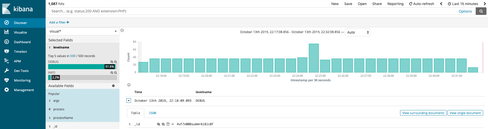

# [Python 中更优雅的日志记录方案 loguru](https://cuiqingcai.com/7776.html)

在 Python 中，一般情况下我们可能直接用自带的 logging 模块来记录日志，包括我之前的时候也是一样。在使用时我们需要配置一些 Handler、Formatter 来进行一些处理，比如把日志输出到不同的位置，或者设置一个不同的输出格式，或者设置日志分块和备份。但其实个人感觉 logging 用起来其实并不是那么好用，其实主要还是配置较为繁琐。

## 常见使用

首先看看 logging 常见的解决方案吧，我一般会配置输出到文件、控制台和 Elasticsearch。输出到控制台就仅仅是方便直接查看的；输出到文件是方便直接存储，保留所有历史记录的备份；输出到 Elasticsearch，直接将 Elasticsearch 作为存储和分析的中心，使用 Kibana 可以非常方便地分析和查看运行情况。

所以在这里我基本会对 logging 做如下的封装写法：

```python
import logging
import sys
from os import makedirs
from os.path import dirname, exists
 
from cmreslogging.handlers import CMRESHandler
 
loggers = {}
 
LOG_ENABLED = True  # 是否开启日志
LOG_TO_CONSOLE = True  # 是否输出到控制台
LOG_TO_FILE = True  # 是否输出到文件
LOG_TO_ES = True  # 是否输出到 Elasticsearch
 
LOG_PATH = './runtime.log'  # 日志文件路径
LOG_LEVEL = 'DEBUG'  # 日志级别
LOG_FORMAT = '%(levelname)s - %(asctime)s - process: %(process)d - %(filename)s - %(name)s - %(lineno)d - %(module)s - %(message)s'  # 每条日志输出格式
ELASTIC_SEARCH_HOST = 'eshost'  # Elasticsearch Host
ELASTIC_SEARCH_PORT = 9200  # Elasticsearch Port
ELASTIC_SEARCH_INDEX = 'runtime'  # Elasticsearch Index Name
APP_ENVIRONMENT = 'dev'  # 运行环境，如测试环境还是生产环境
 
def get_logger(name=None):
    """
    get logger by name
    :param name: name of logger
    :return: logger
    """
    global loggers
 
    if not name: name = __name__
 
    if loggers.get(name):
        return loggers.get(name)
 
    logger = logging.getLogger(name)
    logger.setLevel(LOG_LEVEL)
 
    # 输出到控制台
    if LOG_ENABLED and LOG_TO_CONSOLE:
        stream_handler = logging.StreamHandler(sys.stdout)
        stream_handler.setLevel(level=LOG_LEVEL)
        formatter = logging.Formatter(LOG_FORMAT)
        stream_handler.setFormatter(formatter)
        logger.addHandler(stream_handler)
 
    # 输出到文件
    if LOG_ENABLED and LOG_TO_FILE:
        # 如果路径不存在，创建日志文件文件夹
        log_dir = dirname(log_path)
        if not exists(log_dir): makedirs(log_dir)
        # 添加 FileHandler
        file_handler = logging.FileHandler(log_path, encoding='utf-8')
        file_handler.setLevel(level=LOG_LEVEL)
        formatter = logging.Formatter(LOG_FORMAT)
        file_handler.setFormatter(formatter)
        logger.addHandler(file_handler)
 
    # 输出到 Elasticsearch
    if LOG_ENABLED and LOG_TO_ES:
        # 添加 CMRESHandler
        es_handler = CMRESHandler(hosts=[{'host': ELASTIC_SEARCH_HOST, 'port': ELASTIC_SEARCH_PORT}],
                                  # 可以配置对应的认证权限
                                  auth_type=CMRESHandler.AuthType.NO_AUTH,  
                                  es_index_name=ELASTIC_SEARCH_INDEX,
                                  # 一个月分一个 Index
                                  index_name_frequency=CMRESHandler.IndexNameFrequency.MONTHLY,
                                  # 额外增加环境标识
                                  es_additional_fields={'environment': APP_ENVIRONMENT}  
                                  )
        es_handler.setLevel(level=LOG_LEVEL)
        formatter = logging.Formatter(LOG_FORMAT)
        es_handler.setFormatter(formatter)
        logger.addHandler(es_handler)
 
    # 保存到全局 loggers
    loggers[name] = logger
    return logger
```

定义完了怎么使用呢？只需要使用定义的方法获取一个 logger，然后 log 对应的内容即可：

```
logger = get_logger()
logger.debug('this is a message')
```

 运行结果如下： 

```
DEBUG - 2019-10-11 22:27:35,923 - process: 99490 - logger.py - __main__ - 81 - logger - this is a message
```

我们看看这个定义的基本实现吧。首先这里一些常量是用来定义 logging 模块的一些基本属性的，比如 `LOG_ENABLED` 代表是否开启日志功能，`LOG_TO_ES` 代表是否将日志输出到 Elasticsearch，另外还有很多其他的日志基本配置，如 `LOG_FORMAT` 配置了日志每个条目输出的基本格式，另外还有一些连接的必要信息。这些变量可以和运行时的命令行或环境变量对接起来，可以方便地实现一些开关和配置的更换。

然后定义了这么一个 get_logger 方法，接收一个参数 name。首先该方法拿到 name 之后，会到全局的 loggers 变量里面查找，loggers 变量是一个全局字典，如果有已经声明过的 logger，直接将其获取返回即可，不用再将其二次初始化。如果 loggers 里面没有找到 name 对应的 logger，那就进行创建即可。创建 logger 之后，可以为其添加各种对应的 Handler，如输出到控制台就用 StreamHandler，输出到文件就用 FileHandler 或 RotatingFileHandler，输出到 Elasticsearch 就用 CMRESHandler，分别配置好对应的信息即可。

最后呢，将新建的 logger 保存到全局的 loggers 里面并返回即可，这样如果有同名的 logger 便可以直接查找 loggers 直接返回了。

在这里依赖了额外的输出到 Elasticsearch 的包，叫做 CMRESHandler，它可以支持将日志输出到 Elasticsearch 里面，如果要使用的话可以安装一下：

```
pip install CMRESHandler
```

其 GitHub 地址是：https://github.com/cmanaha/python-elasticsearch-logger，具体的使用方式可以看看它的官方说明，如配置认证信息，配置 Index 分隔信息等等。

好，上面就是我之前常用的 logging 配置，通过如上的配置，我就可以实现将 logging 输出到三个位置，并可以实现对应的效果。比如输出到 Elasticsearch 之后，我就可以非常方便地使用 Kibana 来查看当前运行情况，ERROR Log 的比例等等，如图所示：

 