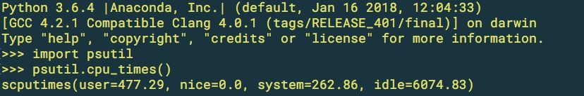
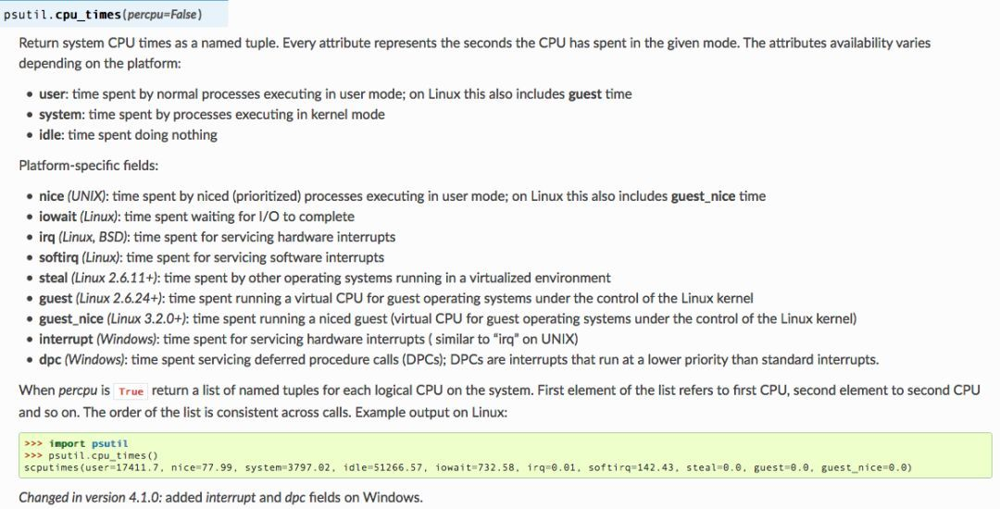
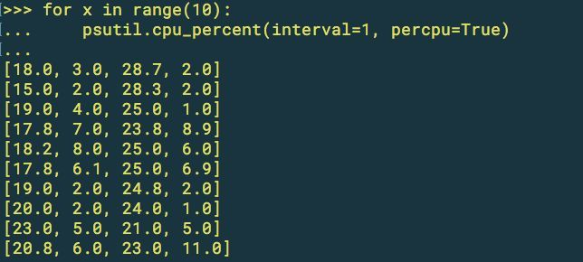
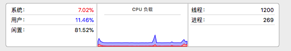
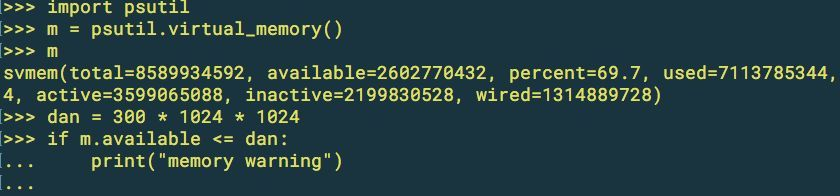
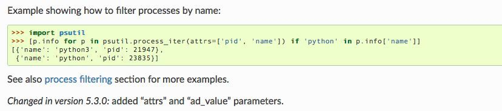
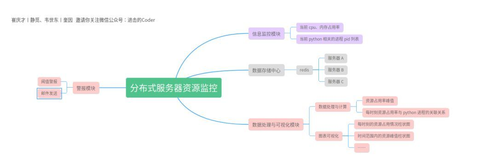

# Python 系统资源信息获取工具

> 如果你需要通过 Python 代码来监控服务器资源信息，比如内容占用情况、cpu 资源消耗以及资源不足发送警报等，那么这篇文章很适合你。

## 工具介绍

psutil（process and system utilities）是一个跨平台的库，github、官方文档

我们可以用它来查看系统运行进程以及资源利用率。它主要用于系统监控、过程资源分析和限制以及运行过程的管理。psutil 的主要功能结构如下图所示


它有三大功能模块，分别是 System related function、Processes 和 Windows Service。

psutil 实现了UNIX命令行工具提供的许多功能，比如 top、free、netstat、kill 等，并且还兼容各大操作系统：


 psutil 可以说是系统管理老大哥或者运维小伙不可或缺的必备模块。

## **psutil 的安装**

我们可以一边翻阅 psutil 的官方文档，一边编写代码，这样就能够更快的学习。

在 Python 环境下安装，直接使用 pip 命令即可：

```javascript
pip install psutil
```

但是，如果你只希望当前用户可用，而不是整个系统所有用户都能使用，你就需要调整你的命令：

```javascript
pip install -user psutil
```

除此之外，它还提供了如 wget、curl 等多种安装方式，具体可参阅文档的 install 部分，但是通常来说 `pip install psutil` 命令已经满足我们的需求了。

## 系统相关操作

它为我们提供了一些系统常用的操作内容 可参阅文档。其中包括了 CPU、内存、磁盘、网络、传感器和进程等方面。

### **CPU 监控**

可以通过 cpu_times 模块对 cpu 资源进行查看，比如：

```javascript
>>> import psutil
>>> psutil.cpu_times()
scputimes(user=477.29, nice=0.0, system=262.86, idle=6074.83)
```



cpu_times 中的参数有哪些含义呢？文档中也给出了具体的释义



翻译一下，我们可以看到它给使用者提供了比较细致的信息监控：

```
将系统CPU时间作为命名元组返回。每个属性表示CPU在给定模式下花费的秒数。属性可用性因平台而异：

user：正常进程在用户模式下执行所花费的时间; 在Linux上，这还包括访客时间
system：在内核模式下执行的进程所花费的时间
闲置：无所事事的时间
特定于平台的字段：

nice （UNIX）：在用户模式下执行的niced（优先级）进程所花费的时间; 在Linux上，这还包括guest_nice时间
iowait （Linux）：等待I / O完成所花费的时间
irq （Linux，BSD）：服务硬件中断所花费的时间
softirq （Linux）：服务软件中断所花费的时间
steal （Linux 2.6.11+）：在虚拟化环境中运行的其他操作系统所花费的时间
guest （Linux 2.6.24+）：在Linux内核的控制下为客户操作系统运行虚拟CPU所花费的时间
guest_nice （Linux 3.2.0+）：运行niced guest虚拟机所花费的时间（Linux内核控制下的来宾操作系统的虚拟CPU）
interrupt （Windows）：服务硬件中断所花费的时间（类似于UNIX上的“irq”）
dpc （Windows）：服务延迟过程调用（DPC）所花费的时间;DPC是以比标准中断低的优先级运行的中断。
```

往下看还可以看到其他的 cpu 监控模块，比如我们最需要的 cpu 资源消耗百分比，cpu_percent(interval=None, percpu=False) 可以返回一个浮点数，表示当前系统范围的CPU利用率百分比。当interval为> 0.0比较间隔之前和之后经过的系统CPU时间（阻塞）。当interval是0.0或None比较自上次调用或模块导入后经过的系统CPU时间，立即返回。这意味着第一次调用它将返回一个无意义的0.0 值，你应该忽略它。在这种情况下，建议0.1在调用之间至少调用此函数的准确性。当percpu是True返回表示利用率的浮点数列表，以每个CPU的百分比表示。列表的第一个元素是指第一个CPU，第二个元素是第二个CPU，依此类推。列表的顺序在调用之间是一致的。

而通过 cpu_count() 可以查看 cpu 核心数量，它可以返回系统中 cpu 的数量（与 os.cpu_count 的返回相同）


我电脑的 cpu 是 i3 ,但是得到的 cpu 是 4（应该得到的是2） ，为什么呢？

cpu_count() 返回的是 cpu 逻辑数量，物理数量得加上参数cpu_count(logical = True ) 运行得到的 cpu 数量为 2，也就是我们常说的双核四线程。

### **小 demo**

如果我们希望得到类似于 top 命令的使用率排行，那我们应该如何做呢？鉴于前面学习的 cpu_percent 我们来尝试一下：

```javascript
psutil.cpu_percent(interval=3, percpu=True)
```

其中的 interval 代表比较间隔之前和之后经过的系统CPU时间，也就是比较 3 秒间隔中 cpu 的占用率


如果要实现排行，那么就需要很多的记录，意味着我们可以尝试通过 for 循环来实现（此处将时间间隔设为 1 即可）：



当然，这仅仅只是将信息输出了 10 次，如果要进行排行，那么还需要其他的处理。



上图是我电脑的资源信息截图，结合截图来看，我们通过代码获取的系统资源信息还是比较可信的

关于 cpu 信息获取的其他知识，请翻阅 psutil 官方文档的 cpu 部分，接下来要学习内存的信息获取了。

## **内存信息获取**

virtual_memory（）将有关系统内存使用情况的统计信息作为命名元组返回，包括以字节表示的以下字段。主要指标：

```javascript
总计：总物理内存。
可用：可以在没有系统进入交换的情况下立即提供给进程的内存。这是通过根据平台对不同的内存值求和来计算的，并且它应该用于以跨平台方式监视实际内存使用情况。
其他指标：

used：使用的内存，根据平台的不同计算，仅供参考。总计 - 免费不一定匹配使用。
free：内存不被使用（归零），随时可用; 请注意，这并不反映可用的实际内存（ 请改用）。总计 - 使用不一定与免费匹配 。
active （UNIX）：当前正在使用或最近使用的内存，因此它在RAM中。
inactive （UNIX）：标记为未使用的内存。
buffers （Linux，BSD）：缓存文件系统元数据之类的东西。
cached （Linux，BSD）：缓存各种事物。
shared （Linux，BSD）：可由多个进程同时访问的内存。
slab （Linux）：内核数据结构缓存。
wired （BSD，macOS）：标记为始终保留在RAM中的内存。它永远不会移动到磁盘。
```

当然，我们并不会关注太细致的内存信息，只需要获取内容总量、当前可用量或者当前已用量等信息即可。

### **内存不足警报的小 demo**

现在有这么一个需求，当监控到内存不足 300M 的时候通过代码发出警告信息，我们可以将需求简化为：内存不足、发出提示



当然，上面的代码并不能够真正的给我们发出警告，因为它只是向你表达它能够做到的事。如果需要做到监控，还需要编写更多的代码、设计更好的处理逻辑。

### **内存信息获取的其他模块介绍**

swap_memory() 将系统交换内存统计信息作为命名元组返回：

```javascript
total：总交换内存（以字节为单位）
used：以字节为单位使用的swap内存
free：以字节为单位的自由交换内存
percent：计算的百分比使用率(total - available) / total * 100
sin：系统从磁盘交换的字节数（累计）
sout：系统从磁盘换出的字节数（累计）
```

不过正常状态下，我们用得并不多，因为它并不是返回系统所有的内存资源信息，而是交换内存的统计信息。

## **进程信息**

进程信息文档定位，进程信息也是我们比较关注的方面，psutil.pids() 可以返回当前运行的PID列表，例如：

```javascript
>>> psutil.pids()
[1, 2, 3, 5, 7, 8, 9, 10, 11, 12, 13, 14, 15, 17, 18, 19, ..., 32498]
```

文档中有一个比较有意思的介绍



我们可以按名称过滤进程信息，为什么说他有意思呢？

比如我们可以通过记录 Python 的进程信息、内存资源信息、cpu 资源信息，来分析我们所写的 Python 代码在服务器上的资源占用情况。我们尝试筛选出 Python 相关的 pid：

```javascript
>>> [p.info for p in psutil.process_iter(attrs=['pid', 'name']) if 'python' in p.info['name']]

[{'name': 'python3.6', 'pid': 1447}]
>>> 
```

pid 1447 的这个进程，正好是我在控制台中演示代码时，启动的 Python 进程。

## 总结

好了，关于 psutil 的简单介绍就到这里，感觉好像没有学到什么高大上的知识？感觉轻轻略过了一遍，并没有留下什么深刻映像？

因为作者也是这么认为的，但是这并不妨碍我们脑中的骚思路

可能下一回，我们就会通过 psutil 实现一个服务器资源监控和比对的工具，比如这样的：



有可能很完善，但是也有可能不需要那么多功能。