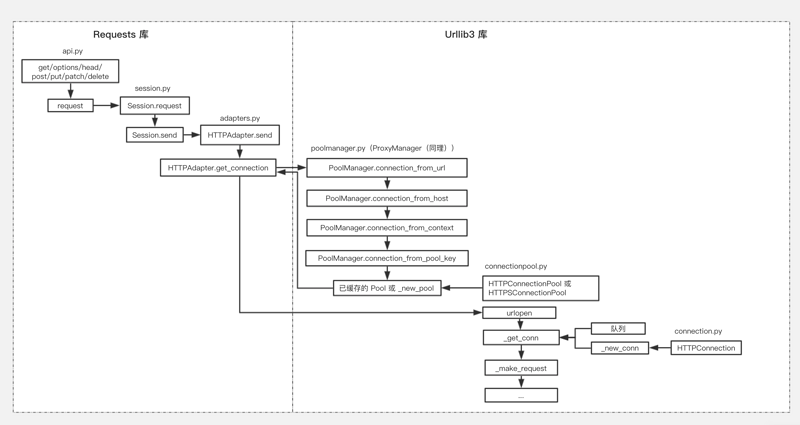
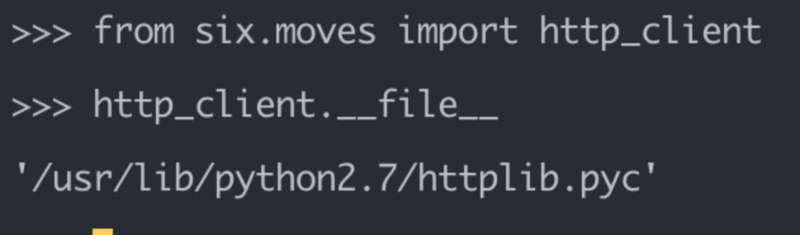
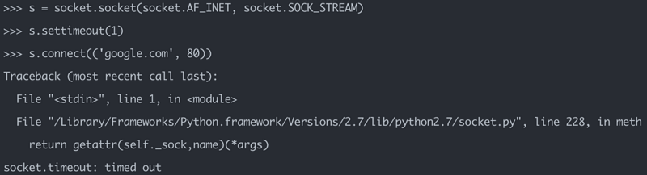

# [Python：requests 超时机制实现](https://segmentfault.com/a/1190000021659437)

[ python](https://segmentfault.com/t/python)[flask](https://segmentfault.com/t/flask)[requests](https://segmentfault.com/t/requests)

 阅读约 23 分钟

### 前言

在工作环境中，访问 Http 是再常见不过了，相应的库也非常多，而 Requests 是当中比较好用的一个。

除了常见的 **GET、 POST、Delete、PUT** 之外，**timeout** 的参数也是非常好用，它可以防止请求堵塞太长时间，如：

```
>>> requests.get('http://google.com', timeout=1)

Traceback (most recent call last):
  File "<stdin>", line 1, in <module>
  File "/Library/Frameworks/Python.framework/Versions/2.7/lib/python2.7/site-packages/requests/api.py", line 75, in get
    return request('get', url, params=params, **kwargs)
  File "/Library/Frameworks/Python.framework/Versions/2.7/lib/python2.7/site-packages/requests/api.py", line 60, in request
    return session.request(method=method, url=url, **kwargs)
  File "/Library/Frameworks/Python.framework/Versions/2.7/lib/python2.7/site-packages/requests/sessions.py", line 533, in request
    resp = self.send(prep, **send_kwargs)
  File "/Library/Frameworks/Python.framework/Versions/2.7/lib/python2.7/site-packages/requests/sessions.py", line 646, in send
    r = adapter.send(request, **kwargs)
  File "/Library/Frameworks/Python.framework/Versions/2.7/lib/python2.7/site-packages/requests/adapters.py", line 504, in send
    raise ConnectTimeout(e, request=request)
requests.exceptions.ConnectTimeout: HTTPConnectionPool(host='google.com', port=80): Max retries exceeded with url: / (Caused by ConnectTimeoutError(<urllib3.connection.HTTPConnection object at 0x10b467790>, 'Connection to google.com timed out. (connect timeout=1)'))
```

既然这个参数这么好用，难免想知道实现的原理，于是就有这次探索！

### requests 调用关系图（简略）

就拿我们最常用的 **GET** 来分析吧，我们需要先搞清楚调用的链路（比较长，画了个简图辅助下）：


从上面的调用图可以看到两个关键点：

1. 底层是依赖 urllib3；

2. 结合下面的源码，可以看到我们平时调用的 **GET、 POST、Delete、PUT** 等等都并没有实际的内容，都只是 session.send 的封装，而最根本的还是 **HTTPAdapter.send**：

   ```
   # requests/api.py
   
   def get(url, params=None, **kwargs):
       kwargs.setdefault('allow_redirects', True)
     return request('get', url, params=params, **kwargs)
   
   def request(method, url, **kwargs):
     with sessions.Session() as session:
       return session.request(method=method, url=url, **kwargs)
   
   # requests/sessions.py
   class Session(SessionRedirectMixin):
     def send(self, request, **kwargs):
       ...
       # Get the appropriate adapter to use
           adapter = self.get_adapter(url=request.url)
           
           # Send the request
           r = adapter.send(request, **kwargs)
           ...
   ```

在 **HTTPAdapter** 里面维护着一个 **PoolManager** 和 **ProxyManager** 对象，**ProxyManager** 是继承 **PoolManager** 的

所以它有着 **PoolManager** 的所有特性，除此之外，还专门处理 proxy 的情况，而在这里我们只简单看 **PoolManager**。

**PoolManager** 顾名思义就是管理 Pool 的，主要是 **HTTPConnectionPool** 和 **HTTPSConnectionPool** 两大类。

用户调用函数发起请求时，**PoolManager** 将请求参数信息拆分和构建 **pool_key**，**pool_key** 的组成主要是以下几个元素：

```
# requests/poolmanager.py

key_fields = (
   "key_scheme",  # str
   "key_host",  # str
   "key_port",  # int
   "key_timeout",  # int or float or Timeout
   "key_retries",  # int or Retry
   "key_strict",  # bool
   "key_block",  # bool
   "key_source_address",  # str
   "key_key_file",  # str
   "key_key_password",  # str
   "key_cert_file",  # str
   "key_cert_reqs",  # str
   "key_ca_certs",  # str
   "key_ssl_version",  # str
   "key_ca_cert_dir",  # str
   "key_ssl_context",  # instance of ssl.SSLContext or urllib3.util.ssl_.SSLContext
   "key_maxsize",  # int
   "key_headers",  # dict
   "key__proxy",  # parsed proxy url
   "key__proxy_headers",  # dict
   "key_socket_options",  # list of (level (int), optname (int), value (int or str)) tup  les
   "key__socks_options",  # dict
   "key_assert_hostname",  # bool or string
   "key_assert_fingerprint",  # str
   "key_server_hostname",  # str
)
```

我们可以理解成，即使在不同的请求中，如果上述的元素却刚好命中，那么就能命中 Pool 的缓存，省去构建的成本；

每个 Pool 管理着对应的 **HTTPConnection** 对象，这里的 **HTTPConnection** 对象并不是具体的 http/tcp 链接，而是类似一个链接管理器的地位，它们来负责实质的数据请求、处理、关闭等。

先看 **HTTPConnectionPool** 源码（只显示关键的 _get_conn、_new_conn 和 _make_request 函数）：

```
# urllib3/connectionpool.py

class HTTPConnectionPool(ConnectionPool, RequestMethods):

  ConnectionCls = HTTPConnection
  
    def _get_conn(self, timeout=None):
        conn = None
        try:
            conn = self.pool.get(block=self.block, timeout=timeout)

        except AttributeError:  # self.pool is None
            raise ClosedPoolError(self, "Pool is closed.")

        except queue.Empty:
            if self.block:
                raise EmptyPoolError(
                    self,
                  "Pool reached maximum size and no more connections are allowed.",
                )
          pass  # Oh well, we'll create a new connection then

        # If this is a persistent connection, check if it got disconnected
        if conn and is_connection_dropped(conn):
            log.debug("Resetting dropped connection: %s", self.host)
            conn.close()
            if getattr(conn, "auto_open", 1) == 0:
                conn = None

        return conn or self._new_conn()
        
    def _new_conn(self):
        """
        Return a fresh :class:`HTTPConnection`.
        """
        self.num_connections += 1
        log.debug(
            "Starting new HTTP connection (%d): %s:%s",
            self.num_connections,
            self.host,
            self.port or "80",
        )

        conn = self.ConnectionCls(
            host=self.host,
            port=self.port,
            timeout=self.timeout.connect_timeout,
            strict=self.strict,
            **self.conn_kw
        )
        return conn

  def _make_request(
       self, conn, method, url, timeout=_Default, chunked=False, **httplib_request_kw
      ):
     
          self.num_requests += 1

          timeout_obj = self._get_timeout(timeout)
          timeout_obj.start_connect()
          conn.timeout = timeout_obj.connect_timeout

          ...
          
          if chunked:
              conn.request_chunked(method, url, **httplib_request_kw)
          else:
              conn.request(method, url, **httplib_request_kw)

          # Reset the timeout for the recv() on the socket
          read_timeout = timeout_obj.read_timeout
          
          # App Engine doesn't have a sock attr
          if getattr(conn, "sock", None):
              if read_timeout == 0:
                  raise ReadTimeoutError(
                      self, url, "Read timed out. (read timeout=%s)" % read_timeout
                  )
              if read_timeout is Timeout.DEFAULT_TIMEOUT:
                  conn.sock.settimeout(socket.getdefaulttimeout())
              else:  # None or a value
                  conn.sock.settimeout(read_timeout)

          # Receive the response from the server
          try:
              try:
                  # Python 2.7, use buffering of HTTP responses
                  httplib_response = conn.getresponse(buffering=True)
              except TypeError:
                  # Python 3
                      # Python 3 (including for exceptions like SystemExit).
                      # Otherwise it looks like a bug in the code.
                      six.raise_from(e, None)
          except (SocketTimeout, BaseSSLError, SocketError) as e:
              self._raise_timeout(err=e, url=url, timeout_value=read_timeout)
              raise
      ...
      
          return httplib_response
          
     ...(省略其他)
```

从之前的调用图和上述的源码可以看出，Pool 会调用 **urlopen**，其中通过 **_get_conn** 来获取一个 **HTTPConnection**，这个函数会优先从 Pool 自身的队列里面获取，如果有则直接返回；如果没有，则需要通过 **_new_conn** 重新创建一个（在处理结束后会 put 进队列）

获得一个 **HTTPConnection** 之后，由 **_make_request** 让它嗨起来，这主要做三件事：

1. 封装时间对象，并设置 **HTTPConnection** 的超时；
2. 通过 **HTTPConnection** 的 **request_chunked** 或者 **request** 将请求塞入 ，等待处理；
3. 通过 **HTTPConnection** 的 **getresponse** 处理 2 的请求并返回结果；

到了这里，我们终于看到了心心念念的超时了！ 太不容易了！

### 如何实现的 Timeout

我们直接来看看这个 **conn.sock.settimeout** 吧，在看之前发现一个小插曲，虽然在 connection.py 里面能找到在**HTTPConnection**，但这个是不全的，因为它是继承另一个同名的：

```
from .packages.six.moves.http_client import HTTPConnection as _HTTPConnection
```

谷歌里下才知道 six 的这个文件是为了兼容 python 2 和 3 的，但是当前目录只有一个 **six.py**，如何更简单找到对应的文件呢？

后来灵机一动，通过 pyconsole 才找到实际的源码位置：

原来如此！于是就能直接去 httplib.py 查看了：

```
# httplib.py

class HTTPConnection:
  def __init__(self, host, port=None, strict=None,
                timeout=socket._GLOBAL_DEFAULT_TIMEOUT, source_address=None):
    
    self.timeout = timeout
    self.source_address = source_address
    self.sock = None
    ...
    
    (self.host, self.port) = self._get_hostport(host, port)
    
    self._create_connection = socket.create_connection

    def connect(self):
          """Connect to the host and port specified in __init__."""
        self.sock = self._create_connection((self.host,self.port),
                                           self.timeout, self.source_address)

  def send(self, data):
          """Send `data' to the server."""
          if self.sock is None:
              if self.auto_open:
                  self.connect()
              else:
                  raise NotConnected()

          if self.debuglevel > 0:
              print "send:", repr(data)
          blocksize = 8192
          if hasattr(data,'read') and not isinstance(data, array):
              if self.debuglevel > 0: print "sendIng a read()able"
              datablock = data.read(blocksize)
              while datablock:
                  self.sock.sendall(datablock)
                  datablock = data.read(blocksize)
          else:
              self.sock.sendall(data)
              
    ....(省略其他)
```

在上文我们需要特别关注一个函数：**socket.create_connection**，这是啥？说到 **socket** 我们一般是直接这样干:

```
import socket
s = socket.socket(socket.AF_INET, socket.SOCK_STREAM)
s.connect((HOST, PORT))
.... 
```

这个方法虽然可以，但是在面对 ipv4 和 ipv6 时候不够灵活，所以 socket 提供了另一个比较方便的：

```
socket.create_connection(address[, timeout[, source_address]])

Connect to a TCP service listening on the Internet address (a 2-tuple (host, port)), and return the socket object. This is a higher-level function than socket.connect(): if host is a non-numeric hostname, it will try to resolve it for both AF_INET and AF_INET6, and then try to connect to all possible addresses in turn until a connection succeeds. This makes it easy to write clients that are compatible to both IPv4 and IPv6.

Passing the optional timeout parameter will set the timeout on the socket instance before attempting to connect. If no timeout is supplied, the global default timeout setting returned by getdefaulttimeout() is used.
```

这样一来我们基本就明白情况了， **conn.sock** 是 **socket.create_connection** 创建的 socket 对象，所以 **settimeout** 也自然是 socket 的属性了~

那么这个属性是如何发挥作用呢？是在 **connect 、recv** 的时候发挥功效的：


### 总结

本来想着挺简单的一件事应该很快就能梳理完，但是没想到越梳理坑越大，层层调用真是太过复杂了，以至于都要专门画张调用图来记录(虽然其实也没画得很完整)。

不过可以埋个伏笔，有精力分析整个库的使用时可以再补充，毕竟 Requests 真的挺优秀的，接口和架构设计感觉都很清晰，在缓存的处理也有考虑，真的可以花时间研究下。

同时意外地发现这样绘图的效果比较清晰和易于阐述，也能锻炼到的自己思维的整理和抽象能力，大家也可以尝试下。