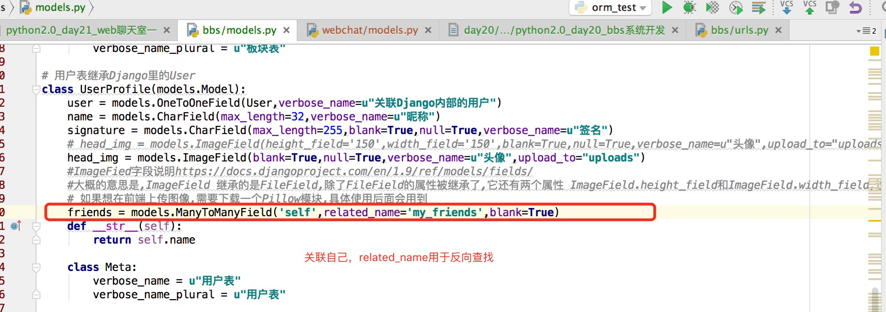
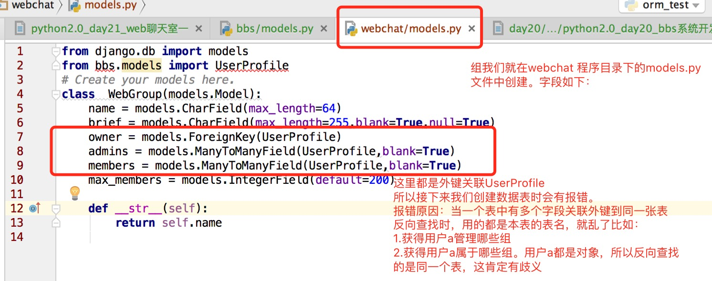

# python2.0_day21_web聊天室一

bbs系统项目中我们用到的ajax不多,但是在聊天室里用到的全是ajax,所以本项目的主要内容就是：

前端使用ajax传输json格式的数据是本节的重点以及 前端函数的的使用.  

http协议的特点是：短链接 ,服务器无法主动向客户端发送消息.都是客户端请求服务器返回消息.  

那么问题来了,WEB聊天账户如何从后台获取消息，还要求实时的。

有三种方法：

1. 从上述内容可知,无法实现后端把消息主动推送到前端.所以前端就要写一个定时任务.为了实现实时的获取消息,轮询的时间间隔越小越好.  

2. 当时间间隔很小时,就会造成,当页面打开后,客户端在不停的向服务器发送请求,这样会造成服务器的请求压力和带宽占用，这时候在轮询的方式上我们重新加工了下,把轮询的时间调整为你指定的间隔,并且保证前端可以实时接收信息。

   如何实现呢：后端使用消息队列接收信息,当消息队列queue.get()活得不到消息时,阻塞状态,阻塞时间超时则返回前端空信息,当获得到消息就立马返回.前端实现当获得到消息时(无论是获得空还是真实消息),都立马之行下一次.  

3. 除了上面两种靠http协议中服务器被动返回消息的模式外,H5中新添加了websocket技术,实现了前端和后台建立socket通道的功能,这样服务端就可以主动推送消息给客户端了.但是应用这种新技术的前提是前端浏览器要支持和后台服务框架要支持。

​    但是Django框架不支持,并且浏览器有好多不支持.但是此中技术在以后肯定会普及.为什么呢?因为有人做过对比,使用长轮询和websocket传送一样的消息内容几千次,长轮询使用的流量7~8M而websocket 几十K,这效率是万的倍率.所以以后肯定会普及。


但是现在我们先用长轮询来实现web聊天的即时通讯。

下面我们就做一个长轮询的聊天室。

  我们想把web聊天室和bbs系统结合.就不需要在创建一个独立的项目,在bbs这个项目下创建一个app

```
 python3.5 manage.py startapp webchat
```

  然后在settings.py加上这个app  
  我们知道在Django框架中同一个项目中的不同app是共用同一个数据库实例的,不同的app里创建的表的前缀不一样.如bbs里的表就如下图：


  这里我们想web聊天室的用户部分就用这个了.下面就开始设计这个web聊天室需要用到的表和表中字段.  
  设计表结构当然要从功能入手：

1. 每一个用户有一个好友列表.  (多对多关系)  
2. 有一个组列表.         (多对多关系)  

  所以，我们只要在bbs的用户表中添加一个朋友字段,多对多关系关联到自己.实现好友列表的功能.  
  然后创建一个组表,然后多对多建立和用户表进行关联。

  于是关于webchat程序的modles.py更改如下：


 

和

 


鉴于上图中显示的问题，我们应该给这种在一张表中多个字段外键关联同一张表的外键关联属性上加上`related_name='名称属性'`  ，于是组的models.py内容改成如下：


  如果你不改成如上图的样子，那么你在执行 `python3.5 manage.py makemigrations` 会报错。
  接下来我们使用命令创建数据库：


然后我们再在admin中加上这个组表，那么哪一个admin加呢？当然是webchat目录下的admin里了，用户表还是之前的bbs目录那个。而组表是webchat下的这个：


  我们看看后台访问效果：


web聊天室的需要的表就是那么简单。接下来我们就开始做前端页面的内容了。  
首先大框架不需要在选了。就直接用bbs的页面.  
其次就是页面里的正文我们要设计下，用到div的布局知识。
我们上节课总结了,使用Django框架写一个功能的顺序如下：
请求源->urls.py->views.py->html或者json数据 -> html 

请求源应该在标题栏上如图：


所以我们应该先在base.html中加上这个标签。我们知道bbs系统里的标签是动态获得的，而此标签在标签表中不存在，我们可以加一个也可以写成固定的。

因为这个标签和bbs的标签不是一个业务上的，所以就直接写成固定的就可以了。于是base.html中添加如下：


接下来我们来写上图中跳转的urls.py，首先把webchat相关的在总的urls.py文件中做一个include如下图：


然后创建webchat/urls.py文件如下：


接下来就是views.py文件：


这里我们返回的是字符串"OK"，所以先做下测试：


这时还有一个问题,就是如何让这个"WEB聊天"按钮高亮显示。
思路:其他的标签高亮是用模版语言实现的，判断标签ID是否等于后台传过来的id一致.而现在我们这个标签是固定的，所以我们这里想让此标签高亮,就只能用js判断
然后我们在写一个templates/webchat/dashboard.html页面，如下：


我们再看下视图


接下来我们来描述下web聊天的页面应该张成什么样子，然后根据我们设计的样子,把页面排版下：


这里我们直接看dashboard.html代码

```html


 <div class="chat-container">
    <div class="left-contact-panel"> contacts </div>
    <div class="right-chat-panel">
        <div class="chat-box-title"> title </div>
        <div class="chat-box-window"> window </div>
        <div class="chat-box-emoj"> emoj </div>
        <div class="chat-box-msg-box">
            <textarea name="" id="msg" ></textarea>
            <button class="btn btn-success">发送消息</button>
        </div>

    </div>
    <div class="clear-both"></div>
</div> 

 <script> $(document).ready(function(){
        $("#navbar a\[href='{{ request.path }}'\]").parent().addClass('active');
    }) </script>  
```

custom.css 的代码如下:

```css
/*for webchat*/ .chat-container{
width: 100%;
height: 100%;
border: 1px dashed darkgray;
}
.left-contact-panel{
width: 200px;
height: 604px;
border:2px solid darkblue; float: left;
}

.right-chat-panel{
width: 750px;
height: 100%;
border:2px solid darkblue; float: left;
}

.chat-box-title{
height: 50px;
border: 1px solid darkgray;
}

.chat-box-window{
height: 400px;
border: 1px solid brown;
}

.chat-box-emoj{
height: 30px;
border: 1px solid bisque;
}

.chat-box-msg-box{
height: 120px;
border: 1px solid brown;
}
```

最终实现访问结果如下:


框架结构就这个样子了.接下来就是使用ajax实现将后台数据填充到这个框架中。

首先我们先把左边的用户列表和分组列表实现.首先我们先从bootstrap中找tab页是如何实现的。

这一点就直接访问bootscss.com网站点击script插件里的标签页,查找。如图：


参照bootcss.com网站上的用法,很容易就实现了.接下来就是把好友列表和群组列表展示出来.  
有两种方法可以获取,一种是跳转到页面的时候通过后台通过模版返回,但是这种方式不好，不好在如果你添加了新用户，不能即时更新。 
另外一种方式使用ajax方式获取。这里我们通过模版返回，因为简单些。但是通过这种方式的前提是用户已经登录了，需要在request.user获取到用户信息

所以我们要在views.py文件里使用验证装饰器。


我们接下来要做什么？是不是要在视图中把用户列表查出来。把分组列表页查出来？

答：不是。首先我们在模版语言中用户已经登录了，能获得用户对象了，在前端模版语言就直接可以反向查找好友列表和用户组列表了。

于是视图函数不需要更改。而前端tab页内容更改如下：


访问页面查看下效果如图：


首先我们的这个列表已经展示了，但是效果不怎么好看。我们也不用自己写了，去bootstrap中找找看，我们应该在以后的开发中多多看看bootstrap中的样式。


我们把这段代码应用到我们的好友列表和群组列表。还有消息个数提醒真好。


查看效果如图：


接下来我们要实现的就是鼠标点哪个人或者组，关于这个人的聊天内容和title就出现在右边的窗口中。

怎么实现点击后改变右边的窗台布局中的内容呢？

这是前端的内容：

还有一个问题，当对方不在线，你给对方留言，对方怎么能收到这个消息，是不是需要在后端服务器中保存？当然需要，如果你发了两个"hello"，哪个先哪个后,要求后端在保存的时候加上时间戳。 
那么问题来了，用什么保存呢？答案：用消息队列进行保存。我们学过的Queue有rebitmq和python自带的Queue，如果是生产环境建议使用 rabitMQ 我们测试开发用queue。
首先服务器上要为每一个用户创建一个queue。
几本的环境我们清楚了，那么现在我们就定义下前端发送消息的格式。

首先是一个json格式：

```python
{ 'from':1, 'to':3, 'msg':'hello'
    '时间戳':'2016', # 时间戳不能在前端加，因为服务器可以加，并且服务器不相信客户端时间
}
```

如果发给一个人，上面的格式就行了，但是这里有一个问题，如果给群组发消息怎么纪录。有人会说给群建一个queue。

这个是不行的，因为如果是给群建queue，一个人收到了，其他人就不能接收到。那该怎么解决呢？当然是给每一个人的queue发送一个消息。

前端发送的时候就要在发送的格式中加一个type，用来表示是给个人还是给群组发消息。如果给个人，后台处理简单些。如果给群组，后台就会首先找到这个群组里的所有人，并且循环这些人的queue把这个消息分别塞进去。
所以前端发送消息的Json格式如下：

```python
{ 'from':1, 'to':3, 'msg':'hello'
    '时间戳':'2016', # 时间戳不能在前端加，因为服务器可以加，并且服务器不相信客户端时间 'type':'single' #group
}
```

我们前端要准备的数据元素清楚了，下面就是怎么把这些元素找出来。

无论从整个系统的开发，还是从某一个功能的开发。起源都是从数据开始的。

所以对于开发工作的流，程我们更新下：

具体数据格式（数据库字段，ajax数据格式）-> 请求源 -> urls.py -> views.py -> *.html 或者ajax  

接着我们在前端html中找到需要传输的元素数据,以及前端页面的js。

我们拿用户列表举例，要实现,点击列表中的某一个人时,右边窗口的title显示选中这个人的姓名。

而我们要传给后台的json数据中国年from可以通过request.user获得,to可以通过friend.id获得 msg就是输入框里的内容.那么type是暂时无法取到的。

所以我们可以在"好友列表"以及group列表中加一个属性，如图：


关于这个函数，是有一个知识点需要说明的。
我们点击标签时，需要把标签里的contact-id的属性传到右边的title里的。所以函数之行时其实是要把本标签作为参数传进去的。变成如图：


但是有的同学说，不需要传入，只需要在写OpenChatWindow(){}函数时直接调用$(this)就可以获得。如下图，首先说明这种理解是错误的。


  我们访问前端验证下：


  我们看到了$(this)这个用法其实还要注意的.正确的做法应该是js函数中还是要给参数的,标签调用的时候this是把自己给传进去了,函数中的参数名还不能是this不然又是内部变量window了

```javascript
function OpenChatWindow(ele){
	console.log($(ele))
}
```

  调用的时候标签可以使用this作为参数,如:

```html
<li contact-type='single' contact-id='{{friend.id}}' onclick="OpenChatWindow(this)" class="list-group-item">
	<span class="badge">14</span> {{friend.name}}
</li>
```

我们先实现点击选中和右边title显示的功能，js改成如下


我们看看访问结果：


接着我们来实现，在输入框中输入内容后，点击"发送消息"按钮或者按回车键，输入框里的内容显示到上面的窗口，如图：


如何实现呢？我们先实现下回车键。思路：给这个页面的所有回车键绑定一个事件。回车键数字13
具体页面代码如下：主要是js那段

```html


 <div class="chat-container">
    <div class="left-contact-panel">
        <!-- Nav tabs -->
        <ul class="nav nav-tabs" role="tablist">
          <li role="presentation" class="active"><a href="#contact-tab" role="tab" data-toggle="tab">好友列表</a></li>
          <li role="presentation"><a href="#group-tab" role="tab" data-toggle="tab">分组列表</a></li>
        </ul>

    <!-- Tab panes -->
    <div class="tab-content">
      <div role="tabpanel" class="tab-pane active" id="contact-tab">
          <ul class="list-group">
          
              <li contact-type='single' contact-id='{{friend.id}}' onclick="OpenChatWindow(this)" class="list-group-item">
                  <span class="badge">14</span>
                  <span class="contact-name">{{friend.name}}</span>
              </li>
          
          </ul>
      </div>
      <div role="tabpanel" class="tab-pane" id="group-tab">
        <ul class="list-group">  <li contact-type='group' contact-id="{{group.id}}" onclick="OpenChatWindow(this)" class="list-group-item">
                    <span class="badge">14</span> {{ group.name }} </li>  </ul>
      </div>
    </div>
</div>
<div class="right-chat-panel">
    <div class="chat-box-title"> title </div>
    <div class="chat-box-window"> window </div>
    <div class="chat-box-emoj"> emoj </div>
    <div class="chat-box-msg-box">
        <textarea name="" id="msg" ></textarea>
        <button class="btn btn-success">发送消息</button>
    </div>

</div>
<div class="clear-both"></div>

</div> 


<script>
	$(document).ready(function(){
        $("#navbar a[href='{{ request.path }}']").parent().addClass('active'); //send msg
        $("body").delegate("textarea","keydown",function(e){
        	//send msg button clicked
            if (e.which == 13 ){
            	var msg_text=$("textarea").val();
            	if ($.trim(msg_text).length >0){
                    console.log(msg_text);
                    //SendMsg(msg_text);
                }
                //no wait the send_msg's call confirm msg
                AddSentMsgIntoBox(msg_text);
                $("textarea").val('');
        	}

    	});
	});
    function AddSentMsgIntoBox(msg_tex){
        var new_msg_ele = "<div class='msg-item'>" +
                            "<span>"+ "{{ request.user.userprofile.name }}"+"</span>" +
                            "<span>"+ new Date().toLocaleTimeString()+"</span>" +
                            "<div class='msg-text>'" + msg_tex + "</div>" +
                            "</div>"
        $(".chat-box-window").append(new_msg_ele)
    }
    function OpenChatWindow(ele){
        console.log($(ele));
        $(ele).addClass("active");
        $(ele).siblings().removeClass("active");
        var contact_id = $(ele).attr("contact-id");
        var contact_name = $(ele).find(".contact-name").text();
        var contact_type = $(ele).attr("contact-type");
        // 然后把右边的title内容改掉
        var chat_box_title_content = "正在跟 " + contact_name + " 聊天";
        $(".chat-box-title").html(chat_box_title_content)
    } 
</script> 

```

  然后我们访问测试查看结果，如下：


上图显示虽然消息已经移动到window窗口，但是这个样式实在不行，按照webqq的样子，应该有滚动条才对。并且滚动条要自动移动到最下面。
我们先实现有滚动条。
给chat-box-window加一个css样式

```css
.chat-box-window{
    height: 400px;
    border: 1px solid brown;
    overflow: auto; /*给div做内容多了就自动添加滚动条*/
}
```

这样多出来的内容就会有滚动条,但是还不能自动滑动到底部.那么如何实现自动滚动呢?要在js里做。

我们这里就添加到AddSentMsgIntoBox函数中，把AddSentMsgIntoBox函数中添加如下部分：


另外scrollTop是个属性

这里看上面的内容理解成，动画效果设置 某一个标签的 scrollTop属性，两种方式的不同之处是怎么获取窗体的高度。

我们看上图中的说明。大概意思是获取窗体高度的两种方法，一种是js方式获取，另一种是jquery方式获取。

有多年前端经验的人员提示，尽量不要混合使用js和jquery，所以建议使用方式二。

我们可能对docment对象 和 具体对标签元素不太清楚，不知道有啥区别。没关系。我们在前端页面上打印看看结果：


完成代码后我们来做下测试，结果如图


接下来，我们就要把消息提交到后台了，提交的格式就是上面我们设计好的数据格式，记得要食json格式。
还有我们这个提交动作，应该是在消息输入框点击回车键后往后台发送的。如图：


  我们写这个函数，把数据组合成之前设计好的格式如：

```python
 { 'from':1, 'to':3, 'msg':'hello'
        '时间戳':'2016', #时间戳不能在前端加,因为服务器可以加,并且服务器不相信客户端时间 'type':'single' #group
}
```

我们看，'from'这个很好获得，to和type不怎么好获得吧？为什么不好获得？首先to应该是你要发消息的对象，这个你可能说用"好友列表"中找"active"类的标签。如果能找到那么type也就能找到了。但是有一个问题，还有一个"群组列表"，假设一个场景你在"好友列表"选择了好友"大神"，这时又切换到"群组列表"，再点一下，这时候就会有两个"active" 。

鉴于上述的内容，就要考虑在点击好友或者某一个组时，这两个列表最多只有一个"active"类，至少现在的代码还没有实现。这是一种解决方法，还有一种解决方法，就是我们无论在点击"好友列表"中的"好友"还是点击"群组列表"中的某一个"组"，右边聊天的title都会显示这个群组或者好友的名称。那么我们干脆在onclick时重写title标签的时候把id和type都传过去，然后在发送消息时，直接从这个title中取就行了。 具体思路如图：


那么我们就要更改之前点击时触发的OpenChatWindow函数,以及更改哪个title的div标签让它默认就存在两个标签contact-type=""和contact-id=""  
于是前端代码更改如下:


数据获取的源准备好了,接下来我们开始写发送数据到后台的函数SendMsg了


根据上图中所说明的，我们来学习下如何在js中添加一段官方https://docs.djangoproject.com/en/1.8/ref/csrf/ 给的代码，就可以一劳永逸的使用ajax方式提交post请求了.从官网上直接拷贝,不需要改什么东西。

一般情况下，下图中的代码会写到base.html中，这里我们就不写在base.html中了，以后在写新项目时，首先把下面的代码写到base.html的js代码段中。
从官网上直接拷贝，不需要改什么东西。


内容就是上图这些，在提醒下，这段最好写在base.html里面。
然后我们继续SendMsg函数的编辑。如图：

0041图


这种方式传到后端处理，肯定是不对的。我们在后台的视图函数中最终是要得到字典的形式。 
我们先试试这种原始的方式。
首先我们写URL：
```python
urlpatterns = [
    # url(r'^$/', views.acc_login,name='login' ), 这种写法错误,r'^$/'要改成r'^$' url(r'^$', views.dashboard,name='chat_dashboard' ),
    url(r'^$msg_send/$', views.send_msg,name='send_msg' ),
]
```

这里又一个点需要注意:url一般都是以名词出现. 而视图是动词. 别名可以和视图一样。

然后在写后台视图函数views.py,先把接收到的post打印出来,看看能不能从接收到的post内容提取我们要的字典。

```python
 @login_required
 def send_msg(request):
 	print(request.POST)
    return HttpResponse("---msg recevied---")
```

我们先按照0041图的前端代码,提交信息.看下后台打印截图


上图0041的前端代码传到后台的数据，不能直接在后台中获取字典。那么我们想把前端传过去的时候，用json格式，后台获取直接反json不就行了。 

于是前端代码改成：


首先声明这种方式后台视图函数还是无法轻松的获得 字典格式的数据。
我们先看下后台打印request.POST的结果如下：


我们看到上图中后台获得的request.Dict对象，并且我们要取的数据放在key，我们更不能取到字典了。
那么怎么办？是不是把它变成value就能取到了，前端序列化后在给一个key就行了。
于是最终前端如果想传给后台序列化的字典 代码就改成如下：


后台的views.py文件里的代码改成如下：

```python
@login_required
        def send_msg(request):
            print(request.POST)
            msg_data = request.POST.get('data')
            if msg_data:
                msg_data = json.loads(msg_data)
                print(msg_data)
            return HttpResponse("---msg recevied---")
```

我们在前端发一个消息,看看后台输出内容:


数据我们传过去了,紧接着我们就可以来写后台如何根据业务来处理取到的数据了.  
首先从字典中取发给谁的 取key为'to'的值.记住上图中我们看到的是字符串'3',这里要弄成数字.  
然后我们用queue存消息.假如有多个用户和大神聊天.每一个人发过来的消息,都会产生一个新进程.那么问题来了,这些进程都会判断大神的queue存不存在.  
所以我们应该让这些子进程判断的是同一个queue,所以要创建一个全局的字典.存放这个queue,每一个子进程都是判断这个全局字典的queue,这样问题就解决了.  
所以最终后台处理发送消息的视图send_msg函数如下:


接下来我们发送消息测试下:


我们看后台为用户id为2的用户创建了queue  
这里我们说明消息发送到后台的功能实现了。

接下来是如何获取消息.获取消息肯定要写一个js通过ajax获取。并且还要一个劲的获取.这就说到我们之前讲的后台如何把消息传递给前端的三种方式。

1. 轮询
2. 长轮询
3. 新的H5中的websocket 

其中方式3是Django不支持的。而1就是写一个获取函数，然后计划任务开启。这个实现简单但是浪费资源，并且及时性不好。

那么我们主要就是学习2长轮询，并且如何通过长轮询实现即时获取消息的。

这里我们把整个长轮询函数书写的过程纪录下来，这样方便我们整理思路： 

1. 首先我们先写出一个从后台取消息的函数，函数内部使用ajax获取消息。

```javascript
function GetNewMsgs(){
    $.getJSON("",function(callback){
        console.log(callback);
    });
}
```

2. 在webchat/urls.py文件里添加url条目

```python
urlpatterns = [
    # url(r'^$/', views.acc_login,name='login' ), 这种写法错误,r'^$/'要改成r'^$' url(r'^$', views.dashboard,name='chat_dashboard' ),
    url(r'^msg_send/$',views.send_msg,name='send_msg' ),
    url(r'^new_msgs/$',views.get\_new\_msgs,name='get\_new\_msgs' ), #新添加的纪录
]
```
3. 边界webchat/views.py文件添加视图函数如下：


4. 紧接着就是处理前端，前面我们已经写了回调函数，这里要调用这个函数，才能触发请求，所以我们先写一个定时任务。如图：


5. 测试下结果。

先用一个账户给 "小雨"发消息


然后我们换一个浏览器登录小雨这个账户，因为一个浏览器的对于一个url的session和cokie是一样的,没有办法在一个浏览器登录不同账户到同一个系统。换火狐浏览器登录"小雨账户"，看结果如下：

按照我上面的写的前端发送消息的js,不会有错,而老师的有问题,结果如下图,这不是老师不会,而是他故意留的坑。结果如下图：


原因是:老师写发送消息的视图函数中,这里没有用int,即没有把去过来的字符串转换成int类型，
而在接收消息时,获取到的是int类型,导致获取时循环的queue不是发送的那一个。具体代码差别如下


在看下后台打印的队列如下:


错误看到了,要注意的就是前端json传到后台后，数据会变成字符串。
运行我们的代码,我们看下小雨的接收有什么结果,如图：


我们看,接收消息的功能也能实现了。先不说接受后怎么样处理消息.先来解决下接收消息不够实时的问题。
现在用的是轮询，时间间隔3秒。接下来我们就要实现之前说的长轮询。

首先我们先说明下,长轮询不能在用计划任务了。从字面上理解以为它和轮询应该用的是一样的知识。

### 长轮询的实现思路 

后台如果有新消息,就把新消息立刻返回。如果没有就用q_obj.get(100)，挂起一段时间，100秒时间一旦到了,就立马返回给前端空列表。
前端接收到空列表后，再次调用此函数。

这里的后端实现很好理解。前端实现不好理解。

首先，使用 `$.getJSON()`方式获取消息.其中 `$.getJSON` 里的回调函数本身就可以实现挂起，后台不返回，这函数就不算执行完成。
但怎么实现后台返回空时,前端就在此发送请求呢。

我的第一个想法是,还是计划任务. 但是仔细想想,还是使用计划任务,你触发请求的次数和时间还是受你计划任务设置的时间间隔的限制。

那怎么办呢？我们想套用递归函数的方式。在前端get\_new\_msg函数里的 .getJSON 里的回调函数一旦有返回，那就在此调用get_new_msg函数。
这不就可以了.这里就不存在递归return的问题了,因为不需要返回。callback回调函数处理就行了，没啥返回值。
具体代码实现如下:  
      
这些都是alex大神的精华，网上可找不到。

视图函数修改成如下：


前端代码修改成如下:


至此，长轮询去消息的最快最好的方法就实现了。

测试结果如下：


这样就实现了，这种方式没几个人做过，网上的方式都不能实现即时。

ps： js中递归是没有层数限制，在python中的递归是有层数限制的999层。