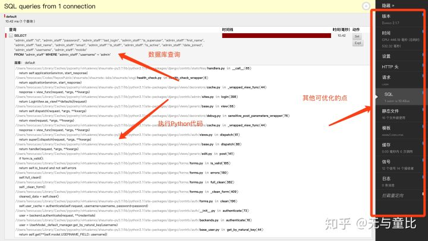

# 提升你的 Python 项目代码健壮性和性能

# 一、用 Type Annotation 提升你的 Python 代码健壮性

## 0x00 前言

本文是**《提升你的 Python 项目代码健壮性和性能》**系列的第一篇文章。

本系列仅仅从笔者的项目经历来讲解一些提升代码健壮性的姿势和小技巧。

本文目录如下:

```text
▼ 0x00 前言 : section
▼ 0x01 Gradual Typing : section
		静态类型 VS 动态类型 : section
		Gradual Typing = 静态类型 + 动态类型 : section
▼ 0x02 Python Typing 实战 - MyPY : section
		MyPy : section
		快速入门 : section
▼ 0x03 常见问题 : section
		如何忽略 mypy 警告 : section
		循环导入 : section
	0x04 Typing Anotation 项目最佳实践 : section
▼ 0xEE 参考 : section
		PEP : section
		扩展文章 : section
```

当我刚知道 Python 要添加类型的时候，我的内心是拒绝的。

但是，**尝试了俩个疗程之后，腰也不疼了，腿也不疼了，走起路来都有劲了**，嗯，真香。

为啥需要 Type Annotation?

因为软件开发需要协作，**动态类型给人极大的灵活性**，写的时候很爽，但如果解放了双手，撸起袖子一通写，自己写起来爽了，自己重构的时候或者其他人来看代码的时候，头发就会加速掉落。

加了 Typing 能解决这个问题嘛？不能，但适当的使用可以极大的提升代码的健壮性。

在如下的场景中，Typing 可以发挥作用

1. 在程序运行前进行类型检查
2. 提供 typing 信息，当然，这带来的另一个巨大的优点就是让 IDE 可以分析出函数的参数类型以及返回值

> **这样大大减少了代码量上来之后的类型检查不足带来的返工问题。**

## **0x01 Gradual Typing**

在你刚入门一门编程语言的时候，我们常常说，Java 是强类型（静态类型）语言，Python 是弱类型（动态类型）语言

从这两位诞生开始，静态类型和动态类型就一直进行旷日持久的圣战。

然而，而现在的发展趋势是：

- 静态类型的语言觉得自己太过静态，以至于写起来很啰嗦。于是引入了很多类型推断。 Java / Go
- 动态类型的语言觉得自己太过动态，以至于协作的过程中总是出现低级错误。于是引入了 Gradual Typing , Typescript / Flow / Python Type Annotation

什么是 Gradual Typing?

Gradual typing 允许开发者仅在程序的部分地区使用 Annotate/Type. 即，既不是黑猫（静态）, 也不是白猫（动态），从而诞生了熊猫（动静结合）。

话说回来，要知道为什么这么搞，首先要知道动态类型和静态类型会给程序开发带来什么优势和劣势。

### 静态类型 VS 动态类型

静态类型的语言，比如在写 Java 的时候，如果你把一个 int 赋值给了 string 的变量，IDE 会通过**类型检查器**立即报错并告诉你，你这个值赋值错啦。这个就是 Java 程序的检查阶段。
动态类型的语言，比如在写 Python 的时候，如果不用一些额外的手段，这种低级的错误，并不会在检查时爆出来，只会在运行时爆出来。如果线上还是出这个问题，就蛋疼了。

为了进行友好的讨论，本人将精分成 Javaer 和 Pythonist, 通过两人对话的方式，来讨论类型。

- Javaer: 我先喝杯咖啡
- Pythonist: 生命苦短，我用 Python。
- Javaer: P 哥，请（为什么叫 P 哥？Python 1989 年出生，Java 1995 年）
- Pythonist: J 弟，请
- Javaer: 静态类型可以较低成本的提早捕获 BUG, 比如：

1. 你在写 Python 的时候，如果不用一些额外的手段，这种低级的错误，并不会在检查时爆出来，只会在运行时爆出来。
2. 如果线上还是出这个问题，就蛋疼了。我这个类型检查可以在**使用 IDE 的时候给我分析出方法参数的类型和返回值**。所谓『上医治未病，中医治已病，下医治大病』, 防范于未然，善之善者也。

- Python: 等等，你小子还广征博引了还，首先，提早捕获 Bug, 我这里也有呀，比如我这里可以通过 flake8 来检查出有些没有定义的变量，**仅仅是类型没有检查而已**。其次，IDE 给我的补全又不是完全无法补全。弱一点罢了。你说的类型检查的问题：

1. 可以通过**提升程序员的素质**来解决这个问题，或者让他们长点脑子，别特么在这种低级错误上犯错误。
2. 写测试来**提升测试代码的代码覆盖率**（这个我会在本系列的第二篇文章里深入讲解）来解决这个问题
3. 看看写的代码检查时出现问题，我完全可以**把代码拖到 IPython 里面跑一遍**。这可不仅仅能解决类型不正确带来的问题，还能快速解决代码的逻辑问题

- Java: 关于你说的第三点，我完全可以提升测试代码的覆盖率。哎？似乎我这个开发测试成本也上来了。看来**类型检查也不能解决这个问题**
- Javaer: 来 P 哥

1. 静态类型确实以**较低的成本**解决了这种类型的问题，不是么？
2. 并且，如果我其中一小块功能进行了修改，我总不能每次都跑 IPython 吧？我也不能因为想检查一下类型这种小操作就写测试代码覆盖一下？

- Python: 你每次修改，都要加类型，加类型，改类型，直到类型检查器完全接受。不麻烦嘛？早就听人家说, **你是面向重构编程**, 现在还是**面向类型检查器编程**？
- Javaer: 来，P哥

1. 每次改代码的时候，又不是改一大推，你是小部分改的，能有多少项目是海量海量改？高内聚，低耦合，模块化开发。
2. 好的代码是重构出来的，修改你的类型来让类型检查器通过。你的代码会被更好的组织起来。
3. 我大 Java 就是面向重构的语言！我有 Jetbrain 的 IDE, 重构代码我怕谁

- Python: 来，你说的有道理

1. **每次改代码的时候，又不是改一大推，你是小部分改的**。这话你说的没错，我也能用啊，因为代码总是一小部分一小部分改的，所以，改完了跑一下 IPython 就结了。
2. 好的代码是重构出来的，修改你的类型来让类型检查器通过。你的代码会被更好的组织起来。这话你说的也没错，可**我重构的时候没有写测试就重构**，是不是有点莽撞？写了测试了，我还要花时间在类型检查器上，不啰嗦么？
3. 我也有 Jetbrain 的 IDE, 重构代码我又不是不能重构。

- Python: 再来，

1. 需求变更上来了，结果往往会出现，你本来是想专注于业务逻辑的更改的，但最后变成了大型**为了让类型检查器通过类型检查而艰苦奋斗的现场**, 我这个场景直接传 int/str/ 字典 / 传对象就很方便，你非要让我写四个函数来 override 方法。
2. 虽然说，好代码确实可以通过重构出来，但动态语言表达能力强呀，你 Java HashMap 啰啰嗦嗦 put 写了半天，我 Python 一个 Dict 一把梭，**看起来，清晰，自然改起来方便。**

再比如说，

LeetCode 上面有一道题目，叫做最长连续 1

Input 是 [1,1,0,1,1,1] Output 是 3

我们尝试用 Python 来看下

```text
def find_max_consecutive_ones(num):
	return max(map(lambda x: len(x), ''.join([str(num) for num in nums]).split('0')))
```

我们尝试用 Java 来看下

```text
public class Solution {
	public int findMaxConsecutiveOnes(int[] nums) {
		int result = 0;
		int tmp = 0;
		for (int i = 0; i < nums.length; i++) {
			if (nums[i] == 0)
				tmp = 0;
			else {
				tmp += 1;
				result = Math.max(tmp, result);
			}
		}
		return result;
	}
}
```

- Javaer: 啊咧？**P 哥你确实有点短啊！**
- Pythonist: 你敢说我短？你看看 java 的创始人的头发！

- Javaer: 我不是那个意思，**浓缩就是精华嘛**，但我**表达能力弱又怎么样**，我 Javaer 可以直接封装好这个功能当成工具类用，从外部使用上用起来差不多好吧，从项目角度表达力并不是决定性因素，静态类型检查可以提早在编译阶段做字节码优化。你的 GIL...
- Pythonist: **好了，咱就不要提 GIL 了**
- Pythonist: 动态类型不需要花时间写 type annotation, 写起来速度杠杠的。
- Javaer: 静态语言一时爽，动态类型火葬场好伐？举个例子，太动态的东西，就是不好做类型推断，比如贵圈的著名的 sqlalchemy 做的那么动态，query.get() 结合 flask 来用，YouModel.query.get() 出来的 YouModel 你还要点进去查看一下具体属性，你要用 title 还是 name, 拼错了，怎么办？都不报错的。
- Javaer: **静态类型迫使你思考程序的时候更加严谨认真**，这将会提升你的代码质量。
- Pythonist: 这点我是不服的，你花费了大量的时间在类型检查上，**写的认不认真不完全取决于你编程的水平和态度好伐？**假如你的观点成立，语言只是武器，峨眉师太拿一把倚天剑，不还是被张三丰空手取来？
- Javaer: 但你不能否认，**峨眉师太拿着倚天剑确实可以秒杀很多人。**

> 旁白君：有道是，梅须逊雪三分白，雪却输梅一段香。

- Guido van Rossum: 好了，我来打个岔，我在 dropbox 带领团队实现了 python 的 typing，python 3.7 内置哦。
- Pythonist: 我自己打脸一下，动态类型花点时间写 type annotation 代码健壮性杠杠的。
- Javaer: 你走开... 你怎么不去解决 GIL 的问题。

### Gradual Typing = 静态类型 + 动态类型

Gradual Typing 就是在动态语言的基础上，增加了可选的类型声明 (Type Annotation)

这对于我这种人是福音，

对于我个人而言，我是希望 Python 是有类型的

1. 作为某段程序的开发者和维护者，我可以提升我重构的速度。
2. 作为某段程序的调用方，可以快速的知道我调用后得到的东西究竟是什么。

但我又不希望这个声明不是强制性的

1. 我在构思程序的时候，想专注于接口的设计。在落实编码并且把代码写的足够的 dry 之后，在被调用的一些地方加上类型声明，这样可以提升我写代码的速度。

## **0x02 Python Typing 实战 - MyPY**

### MyPy

mypy 是一个可选的静态分析器，官网介绍上说，mypy 将使你的程序更加易懂，调试和维护。

这个程序

- 对于 PHP 有 Hack , 对 JavaScript 有 Flow 和 TypeScript, 对于 Python 有 MyPy
- 对于 Python, 则有 MyPy , MyPy 彼时还不是很成熟 (2016 年 10 之前）。

Dropbox 的团队开发，Guido van Rossum 领导开发

### 快速入门

本小节部分摘录 Type hints cheat sheet

建议读者收藏原网址 [https://mypy.readthedocs.io/en/latest/cheat_sheet_py3.html](https://link.zhihu.com/?target=https%3A//mypy.readthedocs.io/en/latest/cheat_sheet_py3.html)

```text
# 内置类型
x: int = 1
x: float = 1.0
x: bool = True
x: str = "test"
x: bytes = b"test"

child: bool
if age < 18:
    child = True
else:
    child = False

# 普通函数
def stringify(num: int) -> str:
    return str(num)

# 生成器
def f(n: int) -> Iterable[int]:
    i = 0
    while i < n:
        yield i
        i += 1
```

直接看起来似乎，加不加 typing 对现在的代码改善并不是很明显嘛。

我们可以给复杂类型起别名：

```text
比如：
def f() -> Union[List[Dict[Tuple[int, str], Set[int]]], Tuple[str, List[str]]]:
def b() -> Union[List[Dict[Tuple[int, str], Set[int]]], Tuple[str, List[str]]]:

AliasType = Union[List[Dict[Tuple[int, str], Set[int]]], Tuple[str, List[str]]]
def f() -> AliasType:
    ...
def b() -> AliasType:
    ...
```

看起来还行，但还是没有感觉到很明显的代码质量改善。

好，再看一例，使用 ClassVar 禁止属性无法在实例上设置

```text
from typing import ClassVar

class A:
    x: ClassVar[int] = 0  # Class variable only

A.x += 1  # OK

a = A()
a.x = 1  # Error: Cannot assign to class variable "x" via instance
print(a.x)  # OK -- can be read through an instance
```

举个例子，flask-sqlalchemy, 可以通过 YouModel.query.get(id) 来拿到 YouModel 的实例，但 IDE 不能推断出这个实例是什么。

```text
# 方法一，Cast
you_model_ins: YouModel = YouModel.query.get(id)
# 方法二，包装一下 get 方法

class YouModel(base):
	def get(id) -> "YouModel": # 注意这里的字符串
		pass
you_model_ins = YouModel.get(id)
```

细心的读者可能看到这里的 YouModel 的返回值类型居然使用了 YouModel 的字符串，如果是 Java 的话，是可以直接写 YouModel 的。

```text
# 加上类型延迟求值
from __future__ import annotations

class YouModel(base):
	def get(id) -> YouModel:
		pass
you_model_ins = YouModel.get(id)
```

还有其他的用法，请参考 MyPY 的官方文档

## **0x03 常见问题**

### 如何忽略 mypy 警告

有的地方的代码不进行检查的话会方便很多。

与 flake8 类似，在注释后面写上标志就可以忽略了。

```text
youcode  # type: igonre
```

### 循环导入

我现在有两个文件，一个是 user.py 另一个是 order.py

在 user 里面有个方法需要返回 order 里面的 Order 列表，order 里面有个 order.owner 需要返回 User 实例。

如果不用类型声明的话，在 user 需要 order 的时候 import 进来即可规避循环导入。

在使用类型声明之后，建议在 user 里面这么写

```text
if TYPE_CHECKING:
    from project.models.order import Order # noqa
```

## **0x04 Typing Anotation 项目最佳实践**

通过本文了解了基本的 Typing Anotation 的用法，其实效果还不够，本着对爱学习的读者老爷的负责的态度。

所谓『纸上得来终觉浅，绝知此事要宫刑』, 哦不『躬行』

推荐一个超级牛的大项目来让大家了解一下 typing annotation 的最佳实践。

**[https://github.com/zulip/zulip/](https://link.zhihu.com/?target=https%3A//github.com/zulip/zulip/)**  一个强大的群组聊天软件,来自Dropbox 

当然，从这个项目里面不仅仅能学到 typing annotation, 还能学到大项目下，牛 X 的公司的做法

1. 如何组织和划分模块
2. 如何帮助开发者快速启用开发环境。
3. 如何做测试，如何做 CI
4. 如何优化自己的 Workflow

有机会的话，我会挑其中的一小部分讲解一下。

## **0xEE 参考**

### PEP

- PEP 3107
- PEP 483

### 扩展文章

- [关于 gradual typing](https://link.zhihu.com/?target=http%3A//wphomes.soic.indiana.edu/jsiek/what-is-gradual-typing/)
- [https://mypy.readthedocs.io/en/latest/cheat_sheet_py3.html](https://link.zhihu.com/?target=https%3A//mypy.readthedocs.io/en/latest/cheat_sheet_py3.html)
- [https://blog.zulip.org/2016/10/13/static-types-in-python-oh-mypy/](https://link.zhihu.com/?target=https%3A//blog.zulip.org/2016/10/13/static-types-in-python-oh-mypy/)
- https://www.zhihu.com/question/21017354/answer/589574939

# 二、如何通过测试提升 Python 代码的健壮性

本系列仅仅从笔者的项目经历来讲解一些提升代码健壮性的姿势和小技巧。

- 用 Type Annotation 提升你的 Python 代码健壮性 https://zhuanlan.zhihu.com/p/56863684

## **0x00 前言**

本文的更多的是写给 Python 后端的程序员。

来简单分享一下我对写测试的理解。

在上一篇文章中，我提到了代码覆盖率，即测试的一种指标。

本期就聊聊测试这件小事情。

本文目录如下：

```text
▼ 如何通过测试提升 Python 代码的健壮性 : section
    0x00 前言 : section
  ▼ 0x01 测试的分类 : section
      后端主要关注哪些测试 : section
  ▼ 0x02 为什么要写测试 : section
      让新手更快的了解代码 : section
      让发布代码的时候更加有底气 : section
      让程序更容易重构 : section
      加快团队的开发速度 : section
  ▼ 0x03 为什么不要写测试 : section
      测试不能解决的问题 : section
      不适当的测试为什么是负担 : section
      并不是所有地方都容易测试的 : section
  ▼ 0x04 写 Python 测试的一些注意事项 : section
      项目的环境隔离 : section
      测试的基本环境 : section
      单测 / 功测 / 端对端 : section
      如何处理外部服务 : section
      其他 Pytest 小技巧 : section
    0xEE 参考 : section
```

## **0x01 测试的分类**

测试有很多种，

按照测试设计的方法可以分为：

1. 黑盒
2. 白盒

按照测试目的：

1. 功能测试

```text
单元测试
	功能测试
	集成测试
	场景测试
	A/B 测试

2. 非功能测试

	压力测试
	安全性测试
	可访问性测试
```

其他

```text
回归测试
易用性测试
还有不少，懒得去整理了.....
```

代码覆盖率顾名思义，就是测试用例覆盖运行代码的比重。

### 后端主要关注哪些测试

- 单元测试
- 功能测试
- 端对端测试
- 性能测试

## **0x02 为什么要写测试**

来讲讲测试的优点。

为什么要写测试来覆盖代码。

1. **适当的测试可以让发布代码的时候更加有底气。**
2. **适当的测试可以让新手更快的了解代码。**
3. **适当的测试可以让程序更容易重构。**
4. **适当的测试可以加快团队的开发速度。**

既不是不写，也不是狂写一气。看到这里你可能有些疑惑？写测试还加快速度？Are you kidding?

一个一个来解释吧。

举个简化版本的例子，『用户下单』到『用户收货』。

1. 用户『查询产品』
2. 用户『使用优惠券』下单
3. 用户『在线支付』。当然，用户也可以让不付款，让订单失效。或者直接取消订单。
4. 商家『确认发货』。
5. 物流公司更新运单『发货中』。
6. 用户『确认收货』。当然，用户也可以发起退款。

### 让新手更快的了解代码

测试用例里的数据，往往是能跑通某段代码的最佳测试数据集合。

假如，有个程序员写了 『下单-在线支付-确认收货』的集成测试。作为刚接手这段代码的人。可以在最短的时间内，通过阅读测试代码从而理解整个流程。

有 fixture, 新手可以在很短的时间内知道 setup 能让项目跑起来的基本数据

当然，如果过多的写了测试，也会导致阅读起来比较困难。

### 让发布代码的时候更加有底气

写测试，是为了验证代码运行正确。

一个流程，通常包含若干个子流程，子流程是对的，整个流程才是对的。

如果不写测试对一些关键的流程进行全面的覆盖，则会导致

1. 修改或者新增了一个子流程，需要重新跑个流程进行人肉测试。
2. 如果人肉测试太费事，则一般程序员就会跳过这个步骤导致线上出问题。

### 让程序更容易重构

当你知道写测试代码有这么多优点的之后，你的第一反应是，这我都知道，但是，写测试还能加快开发速度？

> 当然，你要知道，一个需要去维护的有价值的产品，往往需要不断的修改流程。

一开始，PM 告诉你只需要下单买个东西，后来，要加上满减券，再后来要加上各种类型的券，然后你要对接第三方服务，接下来你要对付各种不按照你设定的流程出牌的用户....

写测试，则是通过不断的补充一些测试，实现整个流程的测试自动化。形成一套测试该项目的测试代码。流程长的令人发指，你指望全靠人肉来测试？

1. 当我修改或者新增子流程的时候，在已经构建出来的测试代码上，可以花少量的代码直接保证修改或者新增的子流程输入和输出被测试到位。
2. 多人合作的时候，如果 A 原先维护了一套子流程，而 B 来改了一波 A 写的子流程。在有适当的测试的情况下，基本上改出问题来，都会跑不过测试的。

当然，前提是

1. A 用心写了测试，而不是写了仅仅能让 A 的代码跑的过去的测试。
2. 是测试如果写过多的话，也会造成团队精力的分散。这下面谈到测试的缺点的时候就会知道。

### 加快团队的开发速度

虽然说，我写的是加快团队的开发速度，但实际上，也适用于个人。

> **除非，你是写渲染页面的.... 所见即所得。无需任何测试**

## **0x03 为什么不要写测试**

依照软件界著名的『没有银弹』理论，说完了测试的优越性，也要来说说测试的局限性，主要有三点：

1. **测试不能解决什么问题？**
2. **不适当的测试，往往是负担。**
3. **并不是所有地方都容易测试的。**

### 测试不能解决的问题

> 测试能确保代码的运行质量，但无法确保代码编写质量，也无法保证产品设计逻辑上的问题。

也就是说

1. **代码写的烂，测试代码只能确保编写代码是可以正常运行的。并不能改善代码质量。最多给烂代码的重构提供比较好的运行保证。**
2. **产品设计逻辑上的问题，测试代码也只能保证这个设计逻辑落地。**

> 当你觉得测试代码写起来比较难受的时候，你应该考虑重构一下你的程序了。

### 不适当的测试为什么是负担

人总要习惯的是：

1. 东西，学，是学不完的。未知的东西永远存在。新的事物总是在出现，老的事物也不断在演进。
2. 时间有限，精力有限

> **放到测试上来说，测试，也是测不完的。**

写了一个 IF ELSE , 你需要测两组，多写了一个 IF ELSE, 你就要测四组。如果是一个比较复杂的流程的话，基本上全面测试就很难写完了。

**我的想法是:**

1. **挑选关键的地方进行测试**
2. **减少用户不必要的数据获取**

### 并不是所有地方都容易测试的

并不是所有地方都容易测试的。

1. 特别依赖其他服务商的业务。比如，支付宝 / 微信的预支付。微信小程序的登陆。
2. 跨端的业务。

这类业务如果做的比较深入，需要 Mock 掉很多逻辑。

## **0x04 写 Python 测试的一些注意事项**

### 项目的环境隔离

从整体项目角度，代码的运行环境应该区分 Local/Test/Stage/Prod 四种环境。

- 本地环境：开发者电脑上的环境
- 测试环境：开发者电脑上 / 持续集成上的环境，之前比较喜欢用 GitlabCI, 后来 团队上了 jenkins, 用起来也还行。
- 预发布环境：预发布环境，对后端来说，通常情况下就是前端可以通过调用 API 的环境。
- 生产环境：生产环境。

之所以要做这种区分，是因为不同的环境侧重点不同。

- Local 环境 针对开发者设置的，这个环境的代码变更比较频繁。Web 应用 / Worker / Beat / Deamon 在本地环境中，一般报错比较多，一般我会在禁掉日志。
- Test 环境 用于执行 make lint && make test，用于检查 lint 相关代码并运行测试。
- Stage 环境
- Prod 环境 和 Stage 环境就比较接近了。但也不完全一致。比如生产环境的组织或商家的一些开发资料。

### 测试的基本环境

一般起一个 Docker-Compose 文件，来快速初始化测试环境。

比如 WebApp / Celery Worker / Celery Beats / Redis / RabbitMQ / MySQL 可以 make start 直接起这些服务。

### 单测 / 功测 / 端对端

之前说，后端需要注意下面的测试

- **单元测试**
- **功能测试**
- **端对端测试**
- 性能测试

> 性能测试一般可以通过监控来提前对系统在哪些地方有瓶颈。看场景，一般观察监控会更加容易预测系统的瓶颈，这个更多偏向于调优，放到后面来说吧。

框架假设我们使用 Flask , 再假设有这么一个 BBS（我知道你想吐槽为什么又拿博客 /BBS 举例子，懒得交代过多的业务场景背景知识了，逃...）

1. **组织 Organization 发布了一个 Thread**
2. **用户 User 在这个 Thread 进行了 Reply 『未注册的用户能看见』**
3. **管理员 Admin 发现了 User 似乎发布了不该发布的信息。删 Reply。『未注册的用户看不见 / 所有者是能看见的』**
4. **最后 User 进行申诉，Admin 发现其实发布的东西挺 OK 的，给予通过。『未注册的用户能看见』**

```text
tests # 测试文件目录
├── __init__.py
├── conftest.py # 这里存放可能被子目录引用到的集合
├── e2e # 『端对端测试』
│   ├── __init__.py
│   ├── test_viewer.py
│   ├── test_user.py
│   ├── test_admin.py
│   └── test_organization.py
├── functional # 『功能测试』
│   ├── __init__.py
│   ├── test_do_simple_reply.py
│   ├── test_do_complex_reply.py
│   └── test_helper.py
├── unit # 『单元测试』
|   ├── __init__.py
|   ├── test_auth.py
|   └── test_calc_some_thing.py
├── test_auth_helper.py # 存放基本的用于切换身份的代码
├── test_const.py
└── test_factory_helper.py # 可以用来批量初始化数据
```

这个流程并不算复杂，但足以写测试了。

1. **在 test_factory_helper 完成数据的基本初始化。**
2. **在端对端测试中简单测试浏览。包含未注册用户 viewer 的访问，user/admin/org 的带有效 / 无效 / 过期登陆凭据访问**
3. **在 unit 中测试一些和业务联系不紧密的逻辑。比如，计算时间**
4. **在 functional 进行比较独立的测试。有的时候也会把几个功能拉起来做测试。相对独立的测试，就是新建一个 User 的 Thread, 删除 Reply, 拉起来测试就是 1/2/3/4 一个测试就完了。**

前者比较简单，后者相对而言更加靠近集成测试。各有利弊。我一般在关键流程上多做几个拉起来测试的代码。

但拉起来测试要解决的问题就多了一个，即，用户登陆认证。你调用某个 Service 的时候，是以匿名用户 / 用户身份 / Admin / Org 调用的。

即在调用不同的 Service 解决问题的时候，你可能需要快速的切换身份。切换完身份再速
度切换回来。于是，test auth helper 出来了。helper 里面有个 switch as 函数，每次需
要切换身份的时候，把 g 变量里面的登陆快照 g.user g.admin [http://g.org](https://link.zhihu.com/?target=http%3A//g.org) push 到 LocalStack 栈里 (from werkzeug.local import LocalStack), 调用完 Service 再 Pop 出来。

拉起来测试的效果是这样子的。

```python3
def test_complex_process(org, user, admin):
	with switch_as_org(org) as org:		# 1. 组织 Organization 发布了一个 Thread
		thread = publish_thread_by_org()
		with switch_as_user(user) as user: # 2. 用户 User 在这个 Thread 进行了 Reply
			reply = reply_thread(thread)
			assert reply
			with switch_as_anonymous() as anonymous_user:
				_thread = see_thread(thread)
				assert reply in _thread.replies # 『未注册的用户能看见』
			with switch_as_admin() as admin: # 3. 管理员 Admin 发现了 User 似乎发布了不该发布的信息。删 Reply。
				delete_reply(reply)
				assert reply.deleled
			with switch_as_anonymous() as anonymous_user:『未注册的用户看不见』
				_thread = see_thread(thread)
				assert reply not in _thread.replies
			# 在这里，我的身份还是 user
			_thread = see_thread(thread)
			assert reply in _thread.replies # 『Ower 用户能看见』
		# 4. 最后 User 进行申诉，Admin 发现其实发布的东西挺 OK 的，给予通过。『未注册的用户能看见』
```

作为开发者，你只需要让这个测试跑通就基本开发完毕了。在这个过程中，你也可以更好的梳理你的代码。

### 如何处理外部服务

在拉起来做测试的时候，假如我们多了一个流程，用户可以通过微信支付赞赏 reply, 这就不得不依赖于外部的服务。

而拉起来做测试的时候，就会遇到一个非常尴尬的问题，因为我上面的接口都粒度都比较大，是赞赏这个流程里面的非常小的流程，必须要走微信的 http 请求。

解决方式也很简单。 mock 掉请求微信的函数。手动调用一下支付回调函数，即可。

当然，对于 http 请求，也可以使用 **responses** 这个神器来快速 mock 神器 requests 的 response

大致的用法如下

```python3
def mock_success_pay():
    def request_callback(request):
        headers = {}
        dispatch_callback(data=data)
        return 200, headers, resp_body

    responses.add_callback(
        responses.POST,
        PAY_URL,
        callback=request_callback,
        content_type="application/json",
    )

@responses.activate
def test_pay(user):
    mock_success_pay()
		switch_as_user(user) as u:
			order = pay_order(u)
		assert order.status == "PAID"
```

### 其他 Pytest 小技巧

有的时候 ipdb 比 pdb 用起来不止好了一点点。如何在 pytest 里用上呢？

```text
pytest -v --pdb --pdbcls=IPython.terminal.debugger:Pdb
```

## **0xEE 参考**

- https://www.zhihu.com/question/21017354/answer/589574939
- https://www.zhihu.com/question/312395573/answer/604772703
- Photo by[LUM3N](https://link.zhihu.com/?target=https%3A//unsplash.com/photos/8UuayiuqMV0%3Futm_source%3Dunsplash%26utm_medium%3Dreferral%26utm_content%3DcreditCopyText)on[Unsplash](https://link.zhihu.com/?target=https%3A//unsplash.com/t/business-work%3Futm_source%3Dunsplash%26utm_medium%3Dreferral%26utm_content%3DcreditCopyText)

# 三、如何保证 Django 项目的数据一致性

## **0x00 前言**

本文我们来谈谈 Django 项目并发可能带来的问题以及如何保持 Django项目的数据一致性。

本文目录如下：

```text
   0x00 前言 : section
▼ 0x01 背景知识 : section
		并发会带来数据不一致 : section
▼ 0x02 Django 项目如何解决项目 : section
		悲观的方式 : section
		乐观的方式 : section
		没有银弹 : section
	0x03 解决超卖问题 : section
▼ 0x04 番外篇 数据库隔离级别 : section
		READ-UNCOMMITTED : section
		READ-COMMITTED : section
		REPEATABLE-READ : section
		SERIALIZABLE : section
	0xEE 参考链接 : section
```

本文讨论的场景如下：

**一个简单的秒杀系统，商品还剩 200 件。有一些用户来访问并下单。**

这个项目的接口的简单写法就是：

```text
@db_transaction
def user_order_by_product(user,product):
    if product.quantity > 0:
        product.quantity = product.quantity - 1
        make_order(user,product)
        product.save()
```

显然，这个写法确实简洁。

但问题就来了。

> **商品会超卖**, 除非你的应用没什么人访问。

为什么呢？

## 0x01 背景知识

### 并发会带来数据不一致

看图


知道问题出在哪儿了吧？

- **理解了？**
- **你确定理解了？**
- **你确定你真的理解了？**

其实是我给读者挖了一个坑，**我画的这张图其实是有预设的，比如 NOTE2 处确保了 B 用户读到的是 2。**

如果数据库隔离级别是 read uncommitted, NOTE2 处读到的也有可能是 1 ,

本文仅仅针对于 read committed 隔离级别下的 **MYSQL** **/ PostgreSQL**。

在上图中。

一般人写程序

1. **往往不是**用 Django 的 F 表达式，来实现 update balance = balance - 20 的操作。 **update balance = balance - 20 where id = 1**
2. **而是计算** 出新的 balance 然后 user.balance = 80, 接着 user.save()

> **这就会放大了问题**

在低并发量的情况下，这个用户手动不断的下单，下单到 200 的时候，后端准时的报卖完了。

假如我现在是 20 个用户同时在下单，很可能机会出现上图的情况。

> **出了问题要解决问题 看到问题就要想法子**

- **鲁迅说过，一见短袖子，立刻想到白臂膊，立刻想到全 X 体，立刻想到....**
- **我也说过，提到并发，就想到锁，就想到乐观锁，就想到悲观锁。**

## **0x02 Django 项目如何解决项目**

有乐观的方式和悲观的方式，即所谓的乐观锁和悲观锁. 是不是有高下之分呢? 不一定.

> 这就好比乐观和悲观本身也并不见的有高下之分. 如同有的人乐观, 并不见得一定就是乐观, 搞不好是傻乐呵, 有的人的悲观, 只是底色比较悲凉, 但内心还是积极向上的.

本小节内容依照自己的理解厚颜无耻的援引了这篇文章的代码

[https://medium.com/@hakibenita/how-to-manage-concurrency-in-django-models-b240fed4ee2](https://link.zhihu.com/?target=https%3A//medium.com/%40hakibenita/how-to-manage-concurrency-in-django-models-b240fed4ee2)

### **悲观的方式**

悲观的方式就是锁住某个资源，不让其他人使用（排他），直到完成工作后释放。

为什么使用数据库的锁（准确来说是关系型数据库的锁）

1. 数据库非常擅长处理锁来完成数据一致性。
2. 数据库级别的锁可以保护其他进程修改数据。

```python
@classmethod
def deposit(cls, id, amount):
   with transaction.atomic():
       account = (
           cls.objects
           .select_for_update()
           .get(id=id)
       )

       account.balance += amount
       account.save()
    return account

@classmethod
def withdraw(cls, id, amount):
   with transaction.atomic():
       account = (
           cls.objects
           .select_for_update()
           .get(id=id)
       )

       if account.balance < amount:
           raise errors.InsufficentFunds()
       account.balance -= amount
       account.save()

   return account
```

使用 select_for_update 锁住这个 object 直到事务结束

在使用悲观锁的情况下，存钱和取钱流程如下


### 乐观的方式

乐观的方式就是新建一个 version column, 每次修改余额的时候，版本增 1

同样我厚颜无耻的援引了 hakibenita 的代码

```python
def deposit(self, id, amount):
   updated = Account.objects.filter(
       id=self.id,
       version=self.version,
   ).update(
       balance=balance + amount,
       version=self.version + 1,
   )
   return updated > 0

def withdraw(self, id, amount):
   if self.balance < amount:
       raise errors.InsufficentFunds()

   updated = Account.objects.filter(
       id=self.id,
       version=self.version,
   ).update(
       balance=balance - amount,
       version=self.version + 1,
   )

   return updated > 0
```

django 默认会返回修改成功的行数，于是，是不是存取成功，就看 updated 是否大于 0 了

### 没有银弹

计算机世界里面，多快好省的场景就不存在。一切看场景。

同样在并发量大的情况下

1. 如果对某几行修改比较频繁，版本更新频繁，可能乐观锁的 retry 就比较浪费了。
2. 如果是对整张表的更新比较频繁，而不是频繁修改某几行。乐观锁，就比较合适了。

- 乐观方式在应用层，无法阻拦数据库的操作。不会存在死锁的问题。
- 悲观方式是数据库实现，他阻止数据库写操作。

## **0x03 如何解决超卖问题**

1. 把数量和已卖放到 redis 里面呢？
2. 交给 deamon 呢？
3. 用 celery 然后排个队异步任务呢？

搞个再复杂一点点的，

1. 在 Redis 里面直接生成 200 个订单号
2. 然后用户来一个取走一个订单号码
3. 通过 Celery 削峰 排队走异步任务
4. 最后通过数据表的 uniq 约束来防止下单超过 200 个。

嗯，就是这么简单。

## **0x04 番外篇 数据库隔离级别**

提到了数据库隔离级别, 就利用上面的例子顺手讲解一下数据库隔离级别吧.

### READ-UNCOMMITTED


### READ-COMMITTED


### REPEATABLE-READ


### SERIALIZABLE

这个就不放图了. 没啥好讲的. 性能太低.... 我是基本上没怎么使用过的

性能上 RU > RC > RR > S

一般人用 RC 和 RR 会多一些, 比如我的项目里就使用了 RC , 但什么时候我可能会考虑用 RR 呢? 比如, 我想在一个Session里面选两次 最近两个月的用户数据, 但是并不希望 出现新的用户.

## **0x05 番外篇 Django ORM**

**评论区** 

[灵魂对撞机](https://www.zhihu.com/people/f4ca959f981c310af429ca25b3b4721d)

 提出了防止超卖的另一种解决方案

先做订单记录，在直接sql改数量，前提库存大于0，失败一个就事务回滚，抢购失败.

即如下：

```python
def do_order(product):
   with transaction.atomic():
       order = make_order(product)
       # 他的思路 是 RawSQL
       # updated = sqlexecute(f"update from product set quantity = quantity - 1 where id = {product.id} and quantity > 0 ")
       # 在这个基础上，其实可以写出 django orm 对应的语句
       updated = Product.objects.filter(
           id=id,
           quantity_gt=0
       ).update(
           quantity=quantity - 1,
       )
       if updated == 0:
           transaction.rollback()
```

面向业务设计的表，和面向数据分析的表应该是两种设计思路。orm 是实体和记录的映射，比较适合面向业务设计的表。


[灵魂对撞机](https://www.zhihu.com/people/f4ca959f981c310af429ca25b3b4721d)

 也提到


**在我的认知里**

1. **Django 本身是支持 RawSQL 查询的**
2. 当你想要的 object 和 row 是一一对应关系的时候，ORM 写起来特别舒服

```text
- django orm 写过滤条件是很舒服的。（抛开性能来说）
- 针对 Object 的修改也很方便，比如商品数量减少。比如自增 update。
```

这也是 orm 的不足之处，显式多表连续 join 的话过滤条件就很麻烦。

如果需要**关联查询**这也应该看情况

1. **如果一般的多表连续 join 如果能使用 nested queries 的话，用 Django 写起来也是特别的舒服。（如果你不是使用 mysql 这种对 nested query 几乎无优化的数据库）**

```
VoteActivity.objects.filter(category=obj.category, username_contains("王"), usercity__type="一线城市") # 伪代码
```

**2. 或许是应该走ETL或者是把数据丢到ES或者针对查询优化的表会更加合适?**

当然, 这也就看具体的情况了.

## **0xEE 参考链接**

1. [https://www.cnblogs.com/huanongying/p/7021555.html](https://link.zhihu.com/?target=https%3A//www.cnblogs.com/huanongying/p/7021555.html)
2. [Django and MySQL](https://link.zhihu.com/?target=https%3A//ewencp.org/blog/django-and-mysql-isolation-levels/index.html)
3. [https://medium.com/@hakibenita/how-to-manage-concurrency-in-django-models-b240fed4ee2](https://link.zhihu.com/?target=https%3A//medium.com/%40hakibenita/how-to-manage-concurrency-in-django-models-b240fed4ee2)

# 四、这几招，让你快速提升 Python 项目的性能

> **当你觉得某个地方运行比较慢了，此时此刻的你，有哪些小技巧可以快速的帮**
> **你定位性能问题。**

目录如下

```text
▼ 这几招，让你快速提升 Python 项目的性能 : section
    0x00 前言 : section
  ▼ 0x01 Python 优化的五件武器 : section
      第一件武器 timeit : section
      第二件武器 profile 与 cprofile : section
      第三件武器 line profiler : section
      第四件武器 memory profiler : section
      第五件武器 pympler : section
      其他神器 : section
  ▼ 0x02 优化 Web 项目 : section
      提前优化 : section
      做好监控 : section
  ▼ 0x03 性能优化建议 : section
      建议 1. 务必了解 Python 里面的负优化常识 : section
      建议 2. 能用内置的模块就不要手动实现 : section
      建议 3. 能用优质的第三方库就不要手动实现 : section
    0xDD 结论 : section
    0xEE 参考链接 : section
```

## **0x00 前言**

本文主要目的在于介绍一些 Python 项目常规的性能优化的姿势与技巧。

优化的最简单的途径就是，**没用户 + 调用次数少**

嗯？但这种优化方式...... 实在是没什么好说的。

- **优化口诀 1: 先做对，布监控，再做好。**
- **优化口诀 2: 过早优化是万恶之源。**
- **优化口诀 3: 去优化那些需要优化的地方。**

即

- Step 1. Get it right.
- Step 2. Test it's right.
- Step 3. Monitor.
- Step 4. Profile if slow.
- Step 5. Try Optimize.
- Step 6. Repeat from 2.

有的人站出来说，**我写程序就是要一步到位，把能优化的点一次性搞定。**

请不要听他的，因为优化是无止境的。唯快不破

**能一次写出优雅清晰而且性能高的代码的人，一般很少见到。毕竟需要考虑的点太多了。**

基于上面的认知，**代码的可维护性是第一位的。**

- 写代码的首先应该是代码很清晰，非常容易维护。
- 然后在没有过分降低可维护性的情况下，作出性能的优化。

## **0x01 Python 优化的五件武器**

钟声响起归家的讯号，刚回到家。

公司群响起加班的讯号，用户反应服务响应总是超时。

你打开电脑，隐隐约约觉得是某个函数的问题。这个函数的功能比较多，调试了很久才调试通。

浏览代码。大致定位了这个问题可能会在下面的几个函数中。

```text
def red_packet_calculation_algorithm():
	pass

def user_stats_calculation_algorithm():
	pass

def dashboard_calculation_algorithm():
	pass
```

**如何确定是哪个函数需要优化呢？**

很简单，到 IPython 里面执行一下就就知道了。感觉慢的就是目标函数。

**总觉得执行一下这个操作有点不稳定。如果有个工具，可以直接执行很多次，然后作出统计就好了。**

这就是 Python 代码优化第一件武器 timeit

### 第一件武器 timeit

通常某段代码有问题，最直接的方法就是跑一下这段代码。

在 IPython 里执行

```text
# ipython
%time your-algorithm
```

timeit 将代码执行多次，取均值

一般这个时候，你就可以初步定位问题所在了。

> **比如，发现 user_stats_calculation_algorithm 在 一个 for 循环里面走了数据库查询。**

也有一些函数并不是那么容易定位。

即，通过这个 timeit 知道了某个函数执行比较慢，但那个函数 里面还有很多函数，通过肉眼观察，还是没有办法来解决呀。

这个时候你想了，如果能看到哪些语句执行的次数多一些，耗时长一些，就好了。

这就是 Python 代码优化第二件武器 profile 。

### 第二件武器 profile 与 cprofile

在 ipython 中运行


这么一看，耗时操作一览无遗。

语句级别的 Profile 有了，但其实，很多时候也并不能解决你的问题。

**如果能有这么个东西，即，能在代码旁边注释一下，执行次数和耗时就好了。**

这就是 Python 代码优化第三件武器 line profile。

### 第三件武器 line profiler

能在代码旁边注释，执行次数和耗时。如下

```text
Pystone(1.1) time for 50000 passes = 2.48
This machine benchmarks at 20161.3 pystones/second
Wrote profile results to pystone.py.lprof
Timer unit: 1e-06 s

File: pystone.py
Function: Proc2 at line 149
Total time: 0.606656 s

Line #      Hits         Time  Per Hit   % Time  Line Contents
==============================================================
   149                                           @profile
   150                                           def Proc2(IntParIO):
   151     50000        82003      1.6     13.5      IntLoc = IntParIO + 10
   152     50000        63162      1.3     10.4      while 1:
   153     50000        69065      1.4     11.4          if Char1Glob == 'A':
   154     50000        66354      1.3     10.9              IntLoc = IntLoc - 1
   155     50000        67263      1.3     11.1              IntParIO = IntLoc - IntGlob
   156     50000        65494      1.3     10.8              EnumLoc = Ident1
   157     50000        68001      1.4     11.2          if EnumLoc == Ident1:
   158     50000        63739      1.3     10.5              break
   159     50000        61575      1.2     10.1      return IntParIO
```

这个可谓是 Python 世界里时间性能优化的顶级工具了。

### 第四件武器 memory profiler

**说完了时间上的优化，再说说空间上的优化。**

如何检查内存呢？

这需要 Python 代码优化第四件武器 memory profiler。

这个工具用于查看 Python 程序的内存占用情况

但，知道了执行某些代码之后，内存是多少又能如何呢？

不见得能定位出来是什么东西

内存中这么多 objects 我上哪看去？

**假设内存泄漏了，我再怎么 profile, 内存都是一直泄漏的呀。**

总要想办法定位出是哪些类型的有问题。

### 第五件武器 pympler

这需要 Python 代码优化第五件武器 pympler。这是我从雨痕的《 Python学习笔记 》里看到的

**这个工具特别适合给当前所有的 objects 的内存占用情况做简单统计。**

之前的一次线上代码出内存泄漏，检查了自己的代码确定没有问题之后，将目光放在了第三
方库上。

但第三方库也有不少，检查半天依旧没有什么进展。

```text
from pympler import tracker

# 在多处打点，并且将结果打到日志里。
memory_tracker = tracker.SummaryTracker()
```

每次打印出来的结果大致是这样子的。

```text
types |   # objects |   total size
================== | =========== | ============
              dict |           1 |     280    B
              list |           1 |     176    B
  _sre.SRE_Pattern |           1 |      88    B
             tuple |           1 |      80    B
               str |           0 |       7    B
```

刚开始都还挺正常，**运行了一段时间之后，日志中的部分涉及到 flask-sqlalchemy**
**的 objects 和 total size 保持了坚挺的增长。**

最后发现 flask-sqlalchemy 如果 设置了 SQLALCHEMY_RECORD_QUERIES 为 True 的话，

每次查询都会往 current_app.sqlalchemy_queries 里增加 DebugQueryTuple, 很快就内存泄漏了。

```text
queries = _app_ctx_stack.top.sqlalchemy_queries
queries.append(_DebugQueryTuple((
		statement, parameters, context._query_start_time, _timer(),
		_calling_context(self.app_package)
)))
```

### 其他神器

可视化调用

当然, 也有一些比较方便的工具是用来查看函数的调用信息的

效果大概是这样子


当然, 也有其他的工具

[https://stackoverflow.com/questions/582336/how-can-you-profile-a-python-script](https://link.zhihu.com/?target=https%3A//stackoverflow.com/questions/582336/how-can-you-profile-a-python-script)

## **0x02 优化 Web 项目**

### 提前优化

在使用 Django 项目的时候，我必须要安装的第三方库就是 djangodebugtools

这个工具用起来有多舒服呢？

可以直接 Profile SQL 语句



甚至可以直接 explain sql 以及 查看缓存情况


### 做好监控

如何监控，监控什么指标？这属于日志的范畴了。

日志的道术器分别是什么，这将在下一篇文章来具体介绍一下如何打日志。

## **0x03 性能优化建议**

笔者列了一些大方向上的优化建议，具体是要靠积累。

### 建议 1. 务必了解 Python 里面的负优化常识

1. 不要在 for loop 里面不断的链接 string, 用列表 +JOIN 的方式会更加合适。

### 建议 2. 能用内置的模块就不要手动实现

1. 比如，当你想做一些字符串上的变动的时候，不防先查看一下 string / textwrap / re / difflib 里是不是满足你的要求了
2. 比如你操作一组比较类似的数据类型，可以考虑看下 enum / collection / itertools / array
   / heapq 里面是不是已经满足你的要求了。

笔者在 https://zhuanlan.zhihu.com/p/32504320 中曾经遇到过统计的问题。

当时遇到的问题场景是

有 400 组 UUID 集合，每个列表数量在 1000000 左右，列表和列表之间重复部分并不是很大。我想拿到去重之后的所有 UUID，应该怎么处理

```text
# 版本一，运行遥遥无期
list_of_uuid_set = [ set1 , set2 ... set400 ]
all_uuid_set = reduce(lambda x: x | y, list_of_uuid_set)

# 版本二，运行遥遥无期

def merge(list1,list2):
    list1.append(list2)
    return list1

list_of_uuid_list = [ list1 , list2 ... list400 ]
all_uuid_set = set(reduce(merge, list_of_uuid_list))

# 版本三，5s

list_of_uuid_list = [ list1 , list2 ... list400 ]
all_uuid_set = set(list(itertools.chain(*list_of_uuid_list)))
```

合适的数据结构和合适的算法，确实能让代码变得清晰，高效，优雅。

### 建议 3. 能用优质的第三方库就不要手动实现

除了一些内置的模块，

- 一些优秀的软件所依赖的第三方包也是非常值得留意的。
- 一般能上 C 库的，用于解析的依赖包性能不错，比如 LXML/Numpy 这类包

## **0xDD 结论**

> **本文讲的是，当你觉得某个地方运行比较慢了，此时此刻的你，有哪些小技巧可以快速的帮**
> **你定位性能问题。**

其实还有很多悬而未决的问题：

1. 定位了问题，如何解决问题？
2. 如何觉察到某个地方运行比较慢呢？

对于第一点，还是得多看多搜多练。用《亮剑》中的李云龙的话说：

> **真正的神枪手是战场上用子弹喂出来的。打得多了，感觉就有了，眼到手就到，抬枪就有，弹弹咬肉，这就叫神枪手。**

对于第二点，就是下一篇文章需要解决的问题了。

1. 通过日志来判断。
2. 通过打点和结合 APMServer 来判断。

## **0xEE 参考链接**

- https://zhuanlan.zhihu.com/p/32504320
- [https://pynash.org/2013/03/06/timing-and-profiling/](https://link.zhihu.com/?target=https%3A//pynash.org/2013/03/06/timing-and-profiling/)
- [https://wiki.python.org/moin/PythonSpeed/PerformanceTips

# 五、为你的项目快速搭建 ELKFA 日志系统

本文 讲的是日志系统ELKFA的搭建

```text
    0x00 前言 : section
  ▼ 0x01 任务 1: 分析 Nginx 日志 : section
      第一步：配置 Nginx : section
      第二步：拉取 Nginx 日志 : section
      第三步：开启 ELFKA : section
      第四步：日志探秘 : section
      第五步：扩展思考，日志解决方案 : section
  ▼ 0x02 任务 2: 监控 Flask App 的 APM : section
      第一步：开启 ELFKA : section
      第二步：开启 flask app : section
      第三步：APM 探秘 : section
      第四步：扩展思考 : section
  ▼ 0x03 结论 : section
    0xEE 参考链接 : section
```

## **0x00 前言**

什么是 ELKFA?

这五个字母分别代表着五个开源软件

- **E - ElasticSearch**
- **L - Logstash**
- **K - Kibana**
- **F - FileBeat**
- **A - APM-Server**

利用这五个软件的组合，我们可以在比较短的时间打造两个系统：

1. 日志系统，分析 Nginx 日志，Gunicorn 日志，Flask 日志，Django 日志
2. APM 系统，解决两个问题
   2.1 Metric 分析：Flask 是否正常运行，接口请求信息定期发送到 APMServer 这边，方便我观察服务是否正常，接口和业务逻辑的执行的时间是否在预期范围内。
   2.2 Trouble Shooting: 如果程序报了异常，我想把需要报的异常堆栈信息打出。方便我快速的 Trouble Shooting

## **0x01 任务 1: 分析 Nginx 日志**

Nginx 众所周知，Nginx 日志是个宝库，所以本文选取了 Nginx 作为日志分析的案例。

对于 Nginx 日志，可以采用 FileBeat 上传到 Logstash, 由 Logstash 对文件进行解析，并存储到 ElasticSearch

然后从 Kibana 进行分析。

### 第一步：配置 Nginx

首先，让 Nginx 的配置输出的日志符合某种模式，方便软件进行解析。

```text
log_format  main  '$remote_addr - $remote_user [$time_local] "$request" '
							'$status $body_bytes_sent "$http_referer" '
							'"$http_user_agent" "$http_x_forwarded_for"';

access_log /var/log/nginx/access.log main;
```

然后重启 nginx

### 第二步：拉取 Nginx 日志

一天后，从 Nginx 服务器上拉一下 access.log 放到

elastic-labs/logs/prod/nginx 下

### 第三步：开启 ELFKA

```text
git clone git@github.com:twocucao/elastic-labs.git
cd elastic-labs
docker-compose up
```

> 啥? 不会搭Docker? 见文末
> 啥? 不知道ElasticSearch 怎么用? 见文末

如果运行正常，终端应该是这样的


打开 kibana 进行观察

http://localhost:5601/


### 第四步：日志探秘

默认情况下，每一天的 Nginx 日志会在 ES 里创建一个 Index, 所以，你需要用 Index Pattern 来进行统计


来看看我们可以得到哪些内容


1. 用户 IP 以及通过 GeoIP 得到的大致地理位置。
2. OS 的类型 (Win/Mac/Linux/IOS/Android)
3. 客户端的类型，浏览器 / 小程序 / 客户端
4. 访问的接口，类型，频率
5. 访问服务的频率
6. 还有很多其他可以深挖的地方，比如通过用户访问的次序推断用户的使用姿势和思考方式等等

对于第六点，有些人可能有些疑惑，这也能？

> **当然咯，假设用户在搜索引擎里面，先搜索了『美女』, 然后搜索了『雪白』, 然后又搜索了『白-洁』, 那基本上这个人搜索的三个词就具备一定的关联性，想搜索的这个雪白就不是『雪白』的意思**
> **而是你懂的。**

### 第五步：扩展思考，日志解决方案

上面四个步骤是为了解决分析 Nginx 日志的问题

一条日志从打印出来，到能在 Kibana 进行分析，需要经过如下的步骤：

1. 按照某种日志格式写到文件里，然后被 FileBeat 接收，FB 判断为『 Nginx 模块的日志之后』上传到 Logstash
2. Logstash 按照一个端口一个类型的方式接受该类型的日志。通过 filters 和插件进行匹配和修改，比如 grok 的 pattern 来匹配每一条日志（类似于正则匹配）, 抽出需要独立成字段的部分。比如通过 geoip 进行地址匹配，比如对字段进行 convert
3. 输出匹配结果到 ElasticSearch
4. Kibana 通过更加边界的工具来查询 ElasticSearch

如果你想要自定义日志获得更加完美的解决方案，那就需要对这几个流程进行进行细化。

比如你想通过 Flask 的日志来达到更好的用户操作定位。这就需要读者自行依照自己的理解来 hack 了

## **0x02 任务 2: 监控 Flask App 的 APM**

### 第一步：开启 ELFKA

同任务一的启动方式

### 第二步：开启 flask app

```text
pip3 install poetry # 比 pip / pipenv 更好的依赖管理和构建工具
poetry install -vvv
poetry shell
flask run
```

写一个简单的管理和依赖工具

```text
from flask import Flask
from elasticapm.contrib.flask import ElasticAPM

app = Flask(__name__)

app.config["ELASTIC_APM"] = {
    "SERVICE_NAME": "dev-flask",
    'SECRET_TOKEN': '',
}
apm = ElasticAPM(app)

@app.route("/")
def hello():
    return "Hello, World!"

@app.route("/home")
def home():
    return "home!"

@app.route("/<int:num>")
def hello_num(num):
    import random
    if random.randint(1, 100) > 95:
        raise Exception(f"num") # 有接近 1/5 的概率会故意抛出异常
    return f"Hello, {num}!"
```

随手写一个脚本 20 分钟内持续不断的访问接口

```text
SECONDS=0
while [[ SECONDS -lt 1200 ]] ; do
	for (( i = 0; i < 20; i++ )); do
		curl "http://localhost:5000/$i"
		curl "http://localhost:5000/$i"
		curl "http://localhost:5000/$i"
		curl "http://localhost:5000/$i"
		curl "http://localhost:5000/$i"
		curl "http://localhost:5000/$i"
		curl "http://localhost:5000/$i" &
		curl "http://localhost:5000/$i" &
		curl "http://localhost:5000/$i" &
		curl "http://localhost:5000/$i" &
		curl "http://localhost:5000/$i" &
		curl "http://localhost:5000/$i" &
		curl "http://localhost:5000/$i" &
		curl "http://localhost:5000/$i" &
	done
done
```

### 第三步：APM 探秘

20分钟过去了，我们可以获知到什么呢？

1. Metric 分析：Flask 是否正常运行，接口请求信息定期发送到 APMServer 这边，方便我观察服务是否正常，接口和业务逻辑的执行的时间是否在预期范围内。
2. Trouble Shooting: 如果程序报了异常，我想把需要报的异常堆栈信息打出。方便我快速的 Trouble Shooting

先设置时间为最近30分钟


在这里可以看到接口的访问情况


先看 Metric 分析


这里可以看到接口的稳定性, 服务器的基本负载, 以及Error的出现频次.

再看 Error


**看到这里简直泪目 这就是 ELK 版本的 Sentry 啊**

> **Time Saving && 防脱发利器**

### 第四步：扩展思考

从 App 被监控到能在 Kibana 进行分析，需要经过如下的步骤：

1. 在原有的 Flask App 里面进行添加 elastc-apm 的 agent (apm-client)
2. agent 会定期将收集完毕的性能信息以及异常信息，发到 apm-server
3. 输出结果到 ElasticSearch
4. Kibana 通过更加边界的工具来查询 ElasticSearch

如果你想要自定义日志获得更加完美的解决方案，那就需要对这前两个流程进行进行细化。

比如公司用 Graphql 的接口，那么，在这种情况下，自带的 contrib 下的 flask 包的路由基本就是废掉的，你需要再 Hack 一下。

## **0x03 结论**

### 本来这篇文章打算写日志的最佳实践的, 结果在查找资料的时候发现了一篇更好的文章

- https://zhuanlan.zhihu.com/p/27363484

看完之后打消了这个念头, 转而写如何使用ELK的系统落实这种日志分析系统

代码见 [twocucao/elastic-labs](https://link.zhihu.com/?target=https%3A//github.com/twocucao/elastic-labs)

> **欢迎点赞/关注/star 文明三连**

## **0xEE 参考链接**

- https://zhuanlan.zhihu.com/p/27363484
- Photo by[Tan Kaninthanond](https://link.zhihu.com/?target=https%3A//unsplash.com/photos/rr8DvtQL9X8%3Futm_source%3Dunsplash%26utm_medium%3Dreferral%26utm_content%3DcreditCopyText)on[Unsplash](https://link.zhihu.com/?target=https%3A//unsplash.com/%3Futm_source%3Dunsplash%26utm_medium%3Dreferral%26utm_content%3DcreditCopyText)
- **关于 elasticsearch 可以参考我以前的文章** [Django全栈教程系列番外篇 - ElasticSearch CheatSheet](https://zhuanlan.zhihu.com/p/35143409)
- 关于 **docker 的搭建** 可以参考我以前的文章 [Django全栈教程系列之一 - YaDjangoBlog 开发环境配置](https://zhuanlan.zhihu.com/p/33920401)

# 六、写出整洁的 Python 代码 上篇

紧接着的三篇时围绕另一个主题

> 如何写出整洁的代码

『整洁』三篇是基于**『代码整洁之道』和『架构整洁之道』**的一些切身的理解和体会。

本文目录如下

```text
▼ 如何写出整洁代码 上篇 : section
  ▼ 0x00 前言 : section
      软件系统的腐败之路 : section
  ▼ 0x01 讨论 : section
      为什么会出现腐败的系统 : section
      衡量系统的两个指标 : section
      代码是写出来的吗？ : section
      好代码的标准 : section
  ▼ 0x02 变量命名之道 : section
      使用业务领域命名 : section
      代码命名 : section
  ▼ 0x03 函数整洁之道 : section
      短小精悍 : section
      调用层次清晰 : section
      控制参数 : section
      如何写函数 : section
    0x04 注释整洁之道 : section
  ▼ 0x05 格式整洁之道 : section
      排版整齐 : section
      上下文相关 : section
    0xEE 参考连接 : section
```

## **0x00 前言**

### 软件系统的腐败之路

随着项目代码行数的增加，不可避免的遇到软件架构腐败的问题。

具体表现为：**随着每一次产品版本的发布，对现有流程进行优化和修改就格外的费事和吃力。工程师的生产力就开始直线下降。**

所谓

> **眼看他起朱楼，眼看他宴宾客，眼看他楼塌了。 清 孔尚任《桃花扇》**

## **0x01 讨论**

### 为什么会出现腐败的系统

原因可能是多方面的, 比如常见的场景：

```text
步骤 1. 领域建模的人对业务里概念的理解不到位，流程不深入了解。
步骤 2. 工程师在实现的时候，按照自己的理解，没有梳理整个流程。就开始动手实现。并且全程人肉测试。
步骤 3. 需求变动，流程更改。
```

**第一步容易埋下坑点：**

1. 对『该领域』理解的不到位，导致『流程』就不清晰，也导致原型设计等同于 Axure 画的『表单』。
2. 『关键概念』没有解释，『关键字段』没有解释，也没有『流程图』，也没有关于业务主体『状态图』，前后端面向表单开发。(Form Oriented Programming)

接着，领域理解不到位就会带来另一个问题。

1. 对于需要『建模的实施者』一般是后端工程师，将花费比较多的时间来梳理流程。
2. 前后端代码结构不清晰。比如，前端页面的路由命名不清晰，Page 组件命名不清晰，请求 API 接口不清晰。比如，后端路由命名不清晰，view func 不清晰，serializer 不清晰，table 命名不清晰。

经验老道的程序员会通过一些手段，比如让这些命名不清晰的东西统一一下，然后等概念清晰了。再改回来。

**第二步容易埋下坑点：**

1. 全程口头对需求，『没有文档』落下来，产品之间和开发之间**『缺乏共通的文档理解指南』**。

当更改已有流程或者是出问题的时候，除了一脸懵逼就还剩下甩锅了。

**第三步容易继续在坑里埋坑：**

**资本市场里，树欲静而风不止，想重构而时不我待。**

1. 领域建模的产品经理会继续叠加新的功能，至于是否已经牵扯到了已有功能，最多和工程师口头说明一下，是不会考虑落实到具体文档里面的。
2. 工程师需要不断的去满足需求，而疯狂叠加代码。不但要搬砖，而且要快速的把方螺丝强行拧到圆螺母里面。

**最后，**

> **屠龙少年变成了恶龙，而产品和工程师们经过不懈努力，终于堆出了『代码屎山』-- 腐败系统**

### 衡量系统的两个指标

腐败系统有一句成语可以概括，叫做**金玉其外，败絮其中。**

什么是外，什么是中？

- **所谓外，就是软件的行为价值 -- 软件系统的行为是否正常运行，是否满足需求**
- **所谓内，就是软件的架构价值 -- 软件系统的架构是否清晰，是否灵活，是否可维护**

看起来有点抽象，打个比方就清晰多了。

所谓软件系统，可以比作是人。

- 所谓外，就是人的能力 -- 即革命的本事。
- 所谓内，就是人的健康 -- 即革命的本钱。

身体是革命的本钱，所以，要经常锻炼身体。同理可知系统也是如此。

业务方和管理层仅在意软件系统的外在。

优秀的软件工程师，做的就是平衡这两者。必要的时候，需要和业务方以及管理层进行沟通。

### 代码是写出来的吗？

不一定。

假如你是做业务逻辑的。

首先，好代码可能是聊出来的。

比如需求确认这一块，多问多画流程图少动手。就可以减少后期很多麻烦事情。
如果在没有理解透需求的情况下动了手，就会做得越多，错的越多。我相信很多工程师都有
这种感觉。

当然，这是基本上不怎么可控的外部条件。所以，不在本文的讨论范围之内。

其次，好代码可能是边读边写出来的。

回顾一下一天的工作，你会发现，不管是，你写文章，或者是做一些其他的东西。

1. **读代码，大部分都是跳转代码，文件内跳转，文件外跳转，分屏浏览。**
2. **在这个过程中不断整理和梳理原有的概念。最后落实到代码上。**
3. **代码的直接修改。占到你很少的时间。**

最后，好代码是改出来的。

### 好代码的标准

我们只讨论如何保持代码的清晰整洁

> 什么是好的代码？

引用 C++ 创始人的说法，我喜欢优雅而高效的代码，

1. **代码逻辑应该直截了当，叫缺陷难以隐藏；**
2. **尽量减少依赖关系，使之便于维护；**
3. **依据某种分层战略完善错误处理代码；**
4. **性能调至最优，省的引诱别人做没规矩的优化。**
5. **整洁的代码只做好一件事情。**

其实还有一些保证代码整洁的手段：

> 比如本系列的文章讲解

## 0x02 变量命名之道

> **名不正，则言不顺；言不顺，则事不成。事不成，则礼乐不兴；**

写代码就是这样。

### 使用业务领域命名

对于具体业务而言，**起不好名字有一半的锅都是产品经理的锅，因为这是概念认知不清晰的表现。**不要小看这一点，产品经理对项目的理解不到位会在编写代码的过程中被放大。

遇到这种情况，务必要把产品经理拉过来认认真真的扯扯犊子。

### 代码命名

对于实际代码而言，

- 涉及到具体业务名称，起不好名字就是程序员的锅，因为这是跟着产品经理犯傻，继续坚持概念认知不清晰的表现。
- 涉及到非业务的名称，务必要统一，比如 Button 就是 Button, 如果团队统一叫做 Btn 那就统一叫做 Btn.

> 务必不要用单字母命名，取名字要准确，如无必要，也尽量规避掉缩写。

```text
# 差
d = Column # 消逝的时间

# 好
elapsedTimeInDays
daysSinceCreation
daysSinceModification
fileAgeInDays
```

- 一个单词一个意思，假设你需要往 group 里面添加 member, 那么出现 add/insert/append 三个词的意义就应该完全不一致。

> 不要做无意义的区分

```text
fetchAccountList 就不如 fetchAccounts
fetchAccountRecord / fetchAccountInfo / fetchAccountData 就不如 fetchAccount
```

> 变量是名词，路由是名词，方法是动宾结构。

**即便是名字起的不好，也应该很统一。**

## **0x03 函数整洁之道**

### 短小精悍

每个函数都要做到短小精悍

1. 短小
2. 只做一件事（无副作用）
3. 一个函数一个抽象层级

### 调用层次清晰

不同抽象层级

```text
def 日常 ():
	用 XX 点外卖 ()
	去厨房拿筷子 ()
	等小哥送来外卖 ()

	睡觉 ()
	打豆豆 ()
```

为什么是不同抽象层级呢？ 点外卖不一定是日常。可能自己偶尔也会做饭。

并且，从业务角度来说，吃饭，睡觉，打豆豆比较符合业务人员的认知。

同一抽象层级

```text
def 点外卖吃饭 ():
	用 XX 点外卖 ()
	去厨房拿筷子 ()
	等小哥送来外卖 ()

def 吃饭 ()
	if 今天比较懒：
		点外卖吃饭 ()

def 日常 ():
	吃饭 ()
	睡觉 ()
	打豆豆 ()
```

这样写出来的函数，比较符合自顶向下的阅读方式。

### 控制参数

参数尽量不要超过三个。

因为超过三个之后，就很难用几个单词把这个方法的意义给概括出来。

如果超过三个，这就需要谨慎的考虑将其中的一部分参数是封装为结构体或者是类。

### 如何写函数

1. 不要为了炫技而炫技。
2. 先写对函数。
3. 然后打磨函数，即修改名称，消除重复，适当重构

## **0x04 注释整洁之道**

1. 注释不能美化糟糕的代码。
2. 适当解释意图。有的时候 hardcode 却是最好的解决方案。
3. 能用变量名 / 方法名 / 函数名表达清楚的，就不要讲废话。

## **0x05 格式整洁之道**

### 排版整齐

代码一定要排版整齐

- 缩进
- 每行最大字符串数？
- 字符串选择单引号还是双引号？
- 团队协作 diff 同一段代码的时候还是 diff 出来不同的效果。

反正是我记不住 pep8 里面要求的那些标准的。当然，flake8 为你提供了比较好的 lint 标准。

在这里推荐两个工具：

1. flake8
2. black [https://github.com/ambv/black](https://link.zhihu.com/?target=https%3A//github.com/ambv/black)

至于 black, 是类似于 javascript 圈里面的 prettier 的存在。

在每次 commit 的时候，执行 flake8 和 black, 让你的代码整整齐齐。

### 上下文相关

1. 如果我使用了一个方法，如果不是从其他文件里使用，一般会在我编写的代码块的上方不远处。
2. 如果我使用了一个变量，应该只在起到作用的作用域里。
3. 如果我针对一个概念编写方法，那么在这个文件里，相关概念的代码应该是放在一起的。

## **0xEE 参考连接**

- 《代码整洁之道》
- 《架构整洁之道》

# 七、如何写出整洁的 Python 代码 中篇

本文做一下扩展

```text
▼ 如何写出整洁的 Python 代码 中 : section
    0x00 前言 : section
    0x01 避免过深的缩进 : section
    0x02 使用异常 : section
    0x03 类与 OOP : section
  ▼ 0x04 SOLID 设计原则 : section
      单一职责 : section
      开闭原则 : section
      里氏替换原则 : section
      接口隔离原则 : section
      依赖反转原则 : section
    0x05 边界和第三方库的挑选 : section
    0xDD 结论 : section
    0xEE 参考 : section
```

## 0x00 前言

上篇地址在这里

[无与童比：如何写出整洁代码 上篇zhuanlan.zhihu.com](https://zhuanlan.zhihu.com/p/59510165)

本篇还是代码上的一些小技巧和一些原则来让代码更加整齐。

## 0x01 避免过深的缩进

场景，你在做一个 B2B2C 的商城系统。商家的活动需要在某些比较严格的条件下才能参与（假设有五个字段吧）。

如果不动手捋一捋判断的路径，上来就动手写代码，则很容易写出如下的代码。

```python3
if cond1:
	dosomething()
	if cond2:
		dosomething()
		if cond3 and cond4:
			dosomething()
			else:
				dosomething()
			if condx:
			dosomething()
else:
	if cond2:
		dosomething()
		if cond3 and cond4:
			dosomething()
			if condx:
			dosomething()
```

想想你这个时候才判断了 5 个字段... 如果想都不想就开始写这种代码的话，就做好修改的时候崩溃吧。

当你写出 if 超过两层缩进的时候，代码的复杂度就值得注意了。

这个时候，应该火速的拿出纸和笔出来，快速的捋一捋所有的变量和情况，

『以减少缩进为目标』

能提前判断掉的就提前判断掉

```text
# 能提前判断掉的就提前判断掉
if cond2:
	raise AlreadPaid():
if cond3:
	raise ActivityExhaused():
if cond4:
	raise ActivityCancel():
```

代码的缩进越浅，代表着代码越容易维护，**用学长的话说，老手才知道『九浅一深』的奥妙......**

## 0x02 使用异常

使用异常而不是状态码，这点重点点名一下 Go 语言的状态码....

遇到异常返回状态码写业务的话，很容易抓狂。如果你在深层抛出一个错误，使用状态码的话，必须一层一层的返回状态码。

1. 遇到问题，抛出异常，raise ApiException 。就可以在上层捕获错误进行处理。这样的
   话，就没有必要每次都在函数签名上返回状态码了。
2. 让代码更佳清晰的是 try except finally 机制。try 块定义了一个范围，try 中的结果可以看执行中有没有遇到一些奇奇怪怪的情况，然后把 try 块里面的东西取消掉。甚至抛出一个错误，丢到 catch 里面执行。这种接近于事务的做法是状态码机制没法比的。

拿第一小节的代码来说，可以在最深层抛出异常，然后在最外面统一处理异常，有些异常可能只是报 apiexception, 有的异常可能还要针对情况打日志，或者有的情况是你在写代码的时候没有考虑到的情况，都可以进行各种灵活的处理。

这样的话，代码就非常的清晰了。

## 0x03 类与 OOP

注意！

1. OOP 语言让封装 / 继承 / 多态更佳方便快捷安全。
2. 封装 / 多态 / 继承 并不是 OOP 对象的专利，实际上利用指针 C 也可以写出来具备封装 / 继承 / 多态的程序。只是相对危险一些罢了。

比如，你有这么个场景，计算购物车里面东西的价格：

1. 面向过程思考方式，用户我选了一些商品，然后把商品放到购物车里，然后我算一下物品价格。
2. OOP 思考方式，用户我需要一个购物车，帮我把这些物品放到购物车里面，购物车告诉我价格。这个时候，你封装一个购物车类会比较合适。

你这个时候就问了，这不就是一个 calcPrice(cart) 和 cart.calcPrice 的区别么？

区别在哪？

1. 『真实世界建模』购物车的是一个对真实世界的建模。
2. 『职责转移』。计算价格这件事情就是『购物车』这个 Object 的事情了。
3. 封装性：我不需要维护一个物品集合。都交给购物车来做这件事情。

什么情况下需要类，用 OOP 的方式思考是合理的，明显的，清晰的，就可以了。

当然，采用了 OOP, 可以更快的结合继承 / 多态来完成『依赖反转』。

这个名词听起来不明觉厉，但其实很简单。

```text
# base.py
class Human:
	def perform(self):
		pass

# foo/man.py
class Man(Human):
	def perform(self):
		print("大哥，真不会唱歌")

# bar/woman.py
class Woman(Human):
	def perform(self):
		print("大哥，真不会跳舞")
```

如果老大哥让你跳舞，就必须要把你的代码给 import 到老大哥的源代码里面。

```text
# bar/bigbother.py
from foo.man import man_instance
from bar.woman import woman_instance

man_instance.perform()
woman_instance.perform()
```

这样会带来一个问题，产生了源代码上面的依赖。这样带来结果是老大哥依赖于几个具体 man 和 woman, 这是不合理的，应该是铁打的老大哥，流水的 man 和 woman

```text
# 源码不依赖 bigbother.py

def order_perform(h):
	h.perform()

humans = scan_humans()

for human in humans:
	order_perform(human)
```

利用多态，则将这个问题完美的解决了。当然，考虑到动态语言，本身就可以很『多态』.... 你甚至都不需要继承了...

策略层与实现完美分离。甚至可以分开进行独立部署。

结论：

1. 对真实世界的建模
2. 代码清晰为主，如果能用简单函数解决的事情，就不要封装成类。
3. 以多态为手段对源代码中的依赖关系进行控制的能力。借此，可以构建
   出插件式架构，让高层策略性组件和底层实现性组件分离。底层实现可以编译成插件，实
   现独立于高层组件的开发和部署。

## 0x04 SOLID 设计原则

- **SRP 单一职责 原则**
- **OCP 开闭原则**
- **LSP 里式替换原则**
- **ISP 接口隔离原则**
- **DIP 依赖反转原则**

原则是原则，是追求，是启迪思路的思想，但也要随机应变。

1. 假如你不了解业务，强行用依赖反转原则写了抽象层，后面 PM 过来说，我有这么一个思路。那么，你的代码写起来就很痛苦了。
2. 假如你不了解场景，在使用单一职责的时候，往往就会业务区分不明确。

在现实场景中，往往是先保持足够的清晰简单的代码，随着代码的演进，用上面的原则再次思
考一下可不可以做的更好。

### 单一职责

比如说，单一职责原则听起来很简单，一个函数只完成一个功能（事情）。

但现实情况是这种往往只是一个追求，站在不同的角度有不同的看法：

比如说，

1. 你说，你今天想学习。这是一件事情。
2. 你说，你今天上午想学习数学。这是一件事情。
3. 你说，你今天上午想学习高数第三章，接着做完笔记，回头抽卡默背一遍公式。这是三
   件事情，并且也可以是一件事情。

你的拆分粒度决定了一件事情的指代范围。

### 开闭原则

开闭原则强调的事情是计算机系统应该在不需要修改的前提下被扩展。将系统划分为一系列组件，并且将这些组件的依赖关系按照层次结构进行组织，使得高阶组件不会因为低阶组件被修改而受到影响

### 里氏替换原则

在不改变软件行为的基础上，衍生类可以替换掉基类

### 接口隔离原则

任何层次的软件设计如果依赖了它并不需要的东西的时候，就会带来意料之外的麻烦。

### 依赖反转原则

什么叫做依赖反转？

依赖反转就是设计软件的时候设计稳定的抽象层。针对抽象的东西编程。

## 0x05 边界和第三方库的挑选

在软件包膨胀的今天，应该如何挑选第三方库呢？

我给出几个挑选的原则。

1. 靠谱依赖原则：如果 flask 是靠谱的，那么，flask 依赖的 click 包，werkzeuk 包一定是靠谱的。
2. 浓缩精华原则：如果一个库依赖少，代码清晰简单，那么可以采用。
3. 活跃维护原则：如果维护很活跃，证明前景相对较好。
4. 多人维护原则：如果是多人维护，则不会因一个人的喜好和个人状态而断了维护。别问我怎么知道的，都是泪

挑选有这个原则，那么，使用有什么原则么？

就一条，尽量减少依赖库对你现有代码的侵入性。

比如，你用了 cryptography 之后，应该封装一个接口用来调用 cryptography 防止以后这个项目挂了，这样你可以只修改该接口，和 pycrypto 对接。

这和里氏替换的思路也是比较类似的

## 0xDD 结论

> 所谓『不能谋万世者不能谋一时，不能谋全局者不能谋一隅』

在软件开发中，其实最重要的过程是梳理流程，流程梳理的足够清楚，代码就足够简单。

不管是避免深缩进，还是使用异常，还是 Solid 原则。都是建立在全局观足够高，对当前的流程非常熟悉的基础上的。

当然，考虑到需求变更的不确定性，代码还是足够简单清晰为上策。

## 0xEE 参考

- 《架构整洁之道》
- 《代码整洁之道》

# 八、如何写出整洁的 Python 代码 下篇

本章是《整洁下篇》，本文的诞生，要感谢我前公司的技术主管豪蔚老师和产品主管刚哥，在上海工作这几年，总是和能优秀的人工作，确实是我幸运的地方。

目录如下

```text
▼ 如何写出整洁的 Python 代码 下篇 : section
    0x00 前言 : section
    0x01 处理需求的姿势 : section
  ▼ 0x02 敏捷开发 : section
      看板和晨会 : section
      敏捷的时间安排：周一到周五 : section
      人员安排 : section
  ▼ 0x03 代码全局观 : section
      起个好名字 : section
      本质复杂度和偶然复杂度 : section
    0xEE 后记 : section
```

## 0x00 前言

这篇文章憋了很久，思考了许久，《整洁下篇》干脆就聊聊编程中，不是写代码的部分；

如果说，写代码是硬技能，那么本期就是来聊软技能的。更确切的说，是复盘几年的工作经验中，我发现的一些有趣的，影响效率的事情以及我的解决方案。

> 凡用兵之法，全国为上，破国次之；全军为上，破军次之；全旅为上，破旅次之；全卒为上，破卒次之；全伍为上，破伍次之。是故百战百胜，非善之善者也；不战而屈人之兵，善之善者也。 --- 《孙子兵法·谋攻篇》

什么叫做有效率，不战而屈人之兵，善之善者也。

> **最整洁的代码，是少写代码，甚至不写代码。**

如何做到？

几年的工作经验下来，我发现我**处理的往往不是技术问题，而是大量的非技术性问题以及伴随着非技术问题带来的成倍的技术问题**。

1. **因需求的变化的返工。**
2. **因追求完美而为了不必要优化的地方而优化。**
3. **因沟通不到位导致的加班加点。**
4. **因缺乏单元测试导致的重构没有底气，甚至懒得重构。**
5. **因缺乏话语权导致的被动开发。**
6. **因考虑不周到而导致的硬着头皮加班。**
7. **因命名不够规范，代码可维护性低下，导致后面定位问题的时间指数性上升。**

应然如此？实然如此！

## 0x01 处理需求的姿势

以前呢，我自以为编程水平还算不错，撸起代码来像是一道春天的闪电。但时间长了，发现技术行，但总体产出不高效。为什么呢？

比如有如下的问题：

- 问题一：战术上很勤奋，一个需求过来，我的第一反应是把这个功能『通过系统』做出来。
- 问题二：没有深入和产品运营沟通，于是后期被动的应对需求的变动
- 问题三：没有三思而行，做项目没有计划性，想到哪里做到哪里。
- 问题一的结果：这导致了很多时候，把这个功能『通过系统』做出来了，但是其实是个伪需求。或者，是个没必要做到系统里面的需求。
- 问题二的结果：导致了一些过度设计或者过于粗糙的设计。最后忙于返工，以及各种数据迁移和逻辑修改
- 问题三的结果：没有做好足够的规划，『码在当下』, 没有前瞻性。

> 速度再快，也要返工，唯一不变的就是变化本身。

我想了很久，才意识到，很多时候，产品在传递需求的时候是存在很多的信息损失的。

背后的原因，可能来源于产品的态度和能力上，可能是产品的上一级需求传递过来的问题，也可能是团队对待产品以及自己的错误的态度上。

经验告诉我，作为对项目负责的程序员千万不要跟着产品经理的思路走。

如果是新功能，一定要就要展开一番对话。

1. 问清楚为什么要做这个需求 / 变动，藏在后面的思路是什么。对于用户、对于产品有什么价值。
2. 和产品经理互杠，用户的具体使用场景是什么。
3. 看看是不是一定要放在系统里面解决。如果放在系统里面解决，那么应该怎么做。让产品方给出一个粗糙的方案。
4. 化简这个方案后再次和产品互杠。
5. 确定方案后分解安排任务。
6. 任务上线之后如何确定这个功能是有效果的。

还记得上面的话么？不战而屈人之兵。

要做的需求，如果产品经理不能简单清晰的描述，做出来一定是一坨。

作为合格的工程师，则是必须要将不清晰、不合理的、拍脑袋的需求拒掉。所谓上梁不正下梁歪，出题人的思路是混乱的，解答者的思路肯定不会清晰到哪里去。

当然，这也存在一些例外的情况，如果你到了一个工作地方，没什么话语权，认真推进事情发展也没什么暖用的地方的话，好好反思一下自己为什么在这种地方干活，然后认真修炼自己。

早些年，我还以为有时间不够的情况，后来也逐渐明白，没有开发不了的任务，**程序写到后面都是妥协，无非就多快好省的妥协**

- 多 - 功能的数量和完成度
- 快 - 完工时间
- 好 - 软件最终质量，满意程度
- 省 - 成本，花多少个人力和精力

鱼和熊掌不能得兼

- **如果产品说『反正下周要上线』, 你砍不了『快』，就砍『好』和『省』。**
- **如果产品说『我要加需求』, 你砍不了『多』, 那就砍『快』和『省』**

如何去做这些妥协，则是工程师的内力。

还有，如果工程师本身不得势，也没有啥话语权，也就没办法推进你的产品了。

**砍需求不是坏事情，树苗不也还是要经常剪去多余的枝桠来防止过度吸收养分。**

## 0x02 敏捷开发

国内的敏捷开发一般也称为『怎么方便怎么来的作坊式开发』

### 看板和晨会

一般会采用以下的做法来敏捷一些

1. 使用看板来管理任务。看板上的卡片无非就是放在『需求确认』,『正在开发』,『正在测试』,『已发布』里面。
2. 晨会，轮流发言讲解进度。

任务的安排往往要细分到方便追踪。

举例来说，如果是简单版本的『支付商城』的功能，则会有

1. 支付模块
2. 商品模块
3. 订单模块
4. 物流模块

但是，商品模块和订单模块要和前后端交互，假设后端叫做小后，前端叫做小前，H5 端和 Admin 端的统一模块不是同一时间段完成的。

如果放在一起的话，则会难以追踪。**会出现这个卡片属于『正在开发』或者『正在测试』的薛定谔状态。**

于是这么细化会更加合理一些

1. 支付模块
2. 商品模块 - Admin
3. 商品模块 - H5
4. 订单模块 - Admin
5. 订单模块 - H5

如果是大一点的系统，则需要划分的更细致。务必不要出现薛定谔的状态卡片。

一般如果看板划分的详细的话，晨会就很轻松了。

### 敏捷的时间安排：周一到周五

- 周一：**一周的开始，就应该发布新版本，选择这个时间段是因为团队都在一起，出问题可以及时修复。**
- 周二 / 周三：复盘以下迭代过程中出现的一些问题。同时进行本周任务的开发。
- 周四：产品负责人与技术负责人等相关人员规划下周的任务，并且过一遍需求评审。
- 周五：在预发布环境完成本周功能的测试。留待下周进行正式版本的发布。

### 人员安排

《人月神话》这本书里面有一个观点，

> **需要写作沟通的人员数量影响着开发成本，人数越多，沟通和交流次数越多，更正沟通不当所引起的不良结果也就越多。**

对此，我的解决方案是：

1. 减少人数。做业务的人选择全栈，从前端到后端负责。这样即便是前后端分离之后，也不会有扯皮的情况。
2. 做基础架构的选择专才。
3. 精英制度。点子最好都由几个立场上需要对产品负责的人来想。如果异想天开的人和做
   事的人不是同一个人，则往往就很麻烦。当然，也需要给予推进产品的人一定的鼓励。

## 0x03 代码全局观

我遇到过的代码问题大致分为两类

1. 给你的变量，函数，模块，类等等起个好名字的问题。
2. 理解本质复杂度（Essential Complexity）和偶然复杂度（Accident Complexity）的问题。

### 起个好名字

对于工程师来说，第一点非常非常重要。

因为，这需要你非常理解业务逻辑并且在某个上下文中用准确的变量名来命名。代码是写给
人看的，顺带着能在机器上运行。并且，尽量跟着业务来命名 （参考 DDD)，这点也就不再赘述了。

当然，其实这也是整洁前两篇讲的东西，也就不再赘述了。

### 本质复杂度和偶然复杂度

第二点，这是师从我的技术主管豪蔚老师之后获取的最大经验。

- **本质复杂度，就是不管你怎么搞，A 点到 B 点，没有捷径可走的，该踩的坑一个都逃不了。**
- **偶然复杂度，就是 A 点到 B 点，明明走几步就到了，但偏偏走了不少弯路。**

写程序之前，**务必要做到尽可能的规避掉偶然复杂度**。

> **Less Is More**

## 0xEE 后记

本文简单说了一些我知道的可以规避掉成吨的技术问题的一些非技术性技巧，本文还是不够全面，比如就没有介绍自动化的工具，没有介绍 CI, 没有用实例介绍怎么应对产品经理的不合理要求，这些就留待以后吧

本想着，《整洁下》的这篇可以多写点编程技巧上的东西的。但想了半天，还是选择了从软技能方面入手。**与其说是为了写好代码，倒不如说是为了好写代码。**

所谓**汝果欲学诗，工夫在诗外。**写代码之外的活，其实很重要。