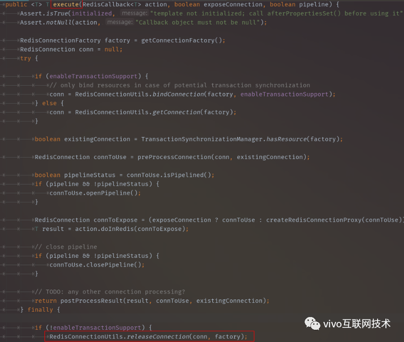

# [Redis 缓存性能实践及总结](https://my.oschina.net/vivotech/blog/4669473)

# 一、前言

在互联网应用中，缓存成为高并发架构的关键组件。这篇博客主要介绍缓存使用的典型场景、实操案例分析、Redis使用规范及常规 Redis 监控。


# 二、常见缓存对比

常见的缓存方案，有本地缓存，包括HashMap/ConcurrentHashMap、Ehcache、Memcache、Guava Cache等，缓存中间件包括Redis、Tair等。


# 三、Redis使用场景

**1. 计数**

Redis实现快速计数及缓存功能。

例如：视频或直播在线观看人数，用户每播放一次，就会自增1。

**2. Session集中管理**

Session可以存储在应用服务是JVM中，但这一种方案会有一致性的问题，还有高并发下，会引发JVM内存溢出。Redis将用户的Session集中管理，这种情况下只要保证Redis的高可用和扩展性，每次用户更新或查询登录都直接从Redis中信息获取。

**3.限速**

例如：业务要求用户一分钟内，只能获取5次验证码。

**4.排行榜**

关系型数据库在排行榜方面查询速度普遍偏慢，所以可以借助redis的SortedSet进行热点数据的排序。

比如在项目中，如果需要统计主播的吸金排行榜，可以以主播的id作为member, 当天打赏的活动礼物对应的热度值作为 score, 通过zrangebyscore就可以获取主播活动日榜。

**5.分布式锁**

在实际的多进程并发场景下，使用分布式锁来限制程序的并发执行。多用于防止高并发场景下，缓存被击穿的可能。

分布式锁的实际就是"占坑"，当另一个进程来执行setnx时，发现标识位已经为1，只好放弃或者等待。


# 四、案例解析


## 1、【案例】过期设置- set命令会去掉过期时间

Redis所有的数据结构，都可以设置过期时间。如果一个字符串已经设置了过期时间，然后重新设置它，会导致过期时间消失。所以在项目中需要合理评估Redis容量，避免因为频繁set导致没有过期策略，间接导致内存被占满。

如下是 Redis 源码截图：


 


## 2、【案例】关于 Jedis 2.9.0 及以下版本过期设置 BUG

发现Jedis在进行expiredAt命令调用时有bug，最终调用的是pexpire命令，这个bug会导致key过期时间很长，导致Redis内存溢出等问题。建议升级到Jedis 2.9.1及以上版本。

BinaryJedisCluster.java源码如下：

```sql
@Override
  public Long pexpireAt(final byte[] key, final long millisecondsTimestamp) {
    return new JedisClusterCommand<Long>(connectionHandler, maxAttempts) {
      @Override
      public Long execute(Jedis connection) {
        return connection.pexpire(key, millisecondsTimestamp); //此处pexpire应该是pexpireAt
      }
    }.runBinary(key);
  }
```

对比pexpire和pexpireAt：


比如我们当前使用的时间是2018-06-14 17:00:00，它的unix时间戳为1528966800000毫秒，当我们使用PEXPIREAT命令时，由于是过去的时间，相应的key会立即过期。

而我们误用了PEXPIRE命令时，key不会立即过期，而是等到1528966800000毫秒后才过期，key过期时间会相当长，约几W天后，从而可能导致Redis内存溢出、服务器崩溃等问题。


## 3、【案例】缓存被击穿

缓存的key有过期策略，如果恰好在这个时间点对这个Key有大量的并发请求，这些请求发现缓存过期一般都会从后端DB回源数据并回设到缓存，这个时候大并发的请求可能会瞬间把后端DB压挂。

业界常用优化方案有**两种**：

**第一种：**使用分布式锁，保证高并发下，仅有一个线程能回源后端DB。

**第二种：**保证高并发的请求到的Redis key始终是有效的，使用非用户请求回源后端，改成主动回源。一般可以使用异步任务进行缓存的主动刷新。


## 4、【案例】Redis-standalone架构禁止使用非0库

Redis执行命令select 0和select 1切换，造成性能损耗。

RedisTemplate在执行execute方法的时候会先获取链接。


执行到RedisConnectionUtils.java，会有一段获取链接的方法。


JedisConnectionFactory.java 会调用JedisConnection构造器，注意这边的dbIndex就是数据库编号，如：1


继续跟进JedisConnection代码，当选择库大于1时，会有select db操作。如果一直使用0库是不需要额外执行切库命令的。知道了第一个切库select 1的地方，那么select 0是哪来的呢？


其实客户端使用Redis也会是要释放链接的，只不过RedisTemplate已经帮我们自动释放了，让我们再回到一开始RedisTemplate执行execute(...)方法的地方。



下面还是RedisConnectionUtils.java，执行链接关闭的代码。


按代码注释的意思，如果选择库编号不为0，spring-data-redis框架每次都会执行重置select 0！


 

笔者在vivo商城业务中，商品详情页接口经过上面的调优，性能提高了3倍多。

进一步验证数据库切换至少影响性能3倍左右（视具体业务而定）。

Rediscluster集群数据库，默认0库，无法选择其他数据库，也就避免了这个问题。


## 5、【案例】当心时间复杂度o(n)Redis命令

Redis是单线程的，所以线程安全的。

Redis使用非阻塞IO，并且大部分命令的时间复杂度O(1)。

使用高耗时的命令是非常危险的，会占用唯一的一个线程的大量处理时间，导致所有的请求都被拖慢。

例如：获取所有set集合中的元素 smembers myset，返回指定Hash中所有的member，时间复杂度O(N)。

缓存的Value集合变大，当高并接口请求时，会从Redis读取相关数据，每个请求读取的时间变长，不断的叠加，导致出现热点KEY情况，Redis某个分片处于阻塞，CPU使用率达到100%。


## 6、【案例】缓存热key

在Redis中，访问频率高的key称为热点key，当某一热点key的请求到Server主机时，由于请求量特别大，导致主机资源不足，甚至宕机，影响正常的服务。

热key问题的产生，有如下**两种原因：**

1. 用户消费的数据远大于生产的数据，比如热卖商品或秒杀商品、热点新闻、热点评论等，这些典型的读多写少的场景会产生热点问题。
2. 请求分片集中，超过单Server的性能极限，比如 固定名称key，哈希落入一台Server，访问量极大的情况，超过Server极限时，就会导致热点Key问题的产生。

那么在实际业务中，**如何识别到热点key呢？**

1. 凭借业务经验，进行预估哪些是热key；
2. 客户端统计收集，本地统计或者上报；
3. 如果服务端有代理层，可以在代理层进行收集上报；

当我们识别到热key，**如何解决热key问题**？

1. Redis集群扩容：增加分片副本，均衡读流量；
2. 进一步对热key进行散列，比如将一个key备份为key1,key2……keyN，同样的数据N个备份，N个备份分布到不同分片，访问时可随机访问N个备份中的一个，进一步分担读流量。
3. 使用二级缓存，即本地缓存。

当发现热key后，将热key对应数据首先加载到应用服务器本地缓存中，减少对Redis的读请求。


# 五、Redis 规范


## 1、禁止使用非database 0

说明：

> Redis-standalone架构，禁止使用Redis中的其他database。

原由：

> - 为以后业务迁移 Redis Cluster 保持兼容性.
> - 多个 database 用 select 切换时，更消耗CPU资源。
> - 更易自动化运维管理，如 scan/dbsize 命令只用于当database。
> - 部分 Redis Clients 因线程安全问题，不支持单实例多 database。


## 2、Key设计规范

按业务功能命名key前缀，防止key冲突覆盖，推荐 用冒号分隔，例如，业务名:表名:id:，如 live:rank:user:weekly:1:202003。

Key的长度小于30个字符，Key名字本身是String对象，Redis硬编码限制最大长度512MB。

在Redis缓存场景，推荐Key都设置TTL值，保证不使用的Key能被及时清理或淘汰。

Key设计时禁止包含特殊字符，如空格、换行、单双引号以及其他转义字符。


## 3、Value设计规范

单个Value大小必须控制10KB以内，单实例键个数过大，可能导致过期键的回收不及时。

set、hash、list等复杂数据类型，要尽量降低数据结构中的元素个数，建议个数不要超过1000。


## 4、关注命令时间复杂度

推荐使用O(1)命令，如get scard等。

O(N)命令关注N的数量，如下命令需要对N值在业务层面做控制。

> - hgetall
> - lrange
> - smembers
> - zrange

例如：smember命令时间复杂度为O(n)，当n持续增加时，会导致 Redis CPU 持续飙高，阻塞其他命令的执行；


## 5、Pipeline使用

说明：

> Pipeline是Redis批量提交的一种方式,也就是把多个命令操作建立一次连接发给Redis去执行,会比循环的单次提交性能更优。
>
> Redis客户端执行一条命令分4个过程：发送命令 -> 命令排队 ->命令执行 -> 返回结果。


常用的mget、mset命令，有效节约RTT（命令执行往返时间），但hgetall并没有mhgetall，是不支持批量操作的。此时，需要使用Pipeline命令


例如：直播中台项目中，需要同时查询主播日、周、月排行榜，使用PIPELINE一次提交多个命令，同时返回三个榜单数据。

 


## 6、线上禁用命令

- **禁止使用Monitor**

禁止生产环境使用monitor命令，monitor命令在高并发条件下，会存在内存暴增和影响Redis性能的隐患

- **禁止使用Keys**

keys操作是遍历所有的key，如果key非常多的情况下导致慢查询，会阻塞其他命令。所以禁止使用keys及keys pattern命令。

建议线上使用scan命令代替keys命令。

- **禁止使用Flushall、Flushdb**

删除Redis中所有数据库中的所有记录，并且该命令是原子性的，不会终止执行，一旦执行，将不会执行失败。

- **禁止使用Save**

阻塞当前redis服务器，直到持久化操作完成为止，对于内存较大的实例会造成长时间的阻塞。

- **BGREWRITEAOF**

手动AOF，手动持久化对于内存较大的实例会造成长时间的阻塞。

- **Config**

Config是客户端配置方式，不利于Redis运维。建议在Redis配置文件中设置。


# 六、Redis 监控


## 1、慢查询

**方法一：**slowlog获取慢查询日志

> 127.0.0.1:{port}> slowlog get 5
>
>  
>
> 1) 1) (integer) 47
>
>   2) (integer) 1533810300
>
>   3) (integer) 175833
>
>   4) 1) "DEL"
>
>    2) "spring:session:expirations:1533810300000"
>
>  
>
> 2) 1) (integer) 46
>
>   2) (integer) 1533810300
>
>   3) (integer) 117400
>
>   4) 1) "SMEMBERS"

**方法二：**更全面的慢查询可以通过CacheCloud工具监控。

> 路径："应用列表"-点击相关应用名-点击"慢查询"Tab页。
>
> 点击"慢查询"，重点关注慢查询个数及相关命令。


## 2、监控Redis实例绑定的CPU核心使用率

由于Redis是单线程，重点监控Redis实例绑定的CPU核心使用率。

一般CPU资源使用率为10%左右，如果使用率高于20%时，考虑是否使用了RDB持久化。


## 3、Redis分片负载均衡

当前redis-cluster架构模式，3个master和3个Slave组成的集群，关注 Redis-cluster每个分片requests流量均衡情况；

通过命令获取：redis-cli -p{port} -h{host} --stat

一般情况，超过12W需要告警。


## 4、关注大key BigKey

通过Redis提供的工具，redis-cli定时扫描相应Redis大Key，进行优化。

具体命令如下：redis-cli -h 127.0.0.1 -p {port} --bigkeys或 redis-memory-for-key -s {IP} -p {port} XXX_KEY

一般超过10K为大key，需要重点关注，建议从业务层面优化。


## 5、监控Redis占用内存大小

Info memory 命令查看，避免在高并发场景下，由于分配的MaxMemory被耗尽，带来的性能问题。

重点关注 used_memory_human 配置项对应的value值，增量过高时，需要重点评估。


# 七、总结

结合具体业务特性，合理评估Redis所需内存容量、选择数据类型、设置单key大小，才能更好地服务于业务，为业务提供高性能的保障。