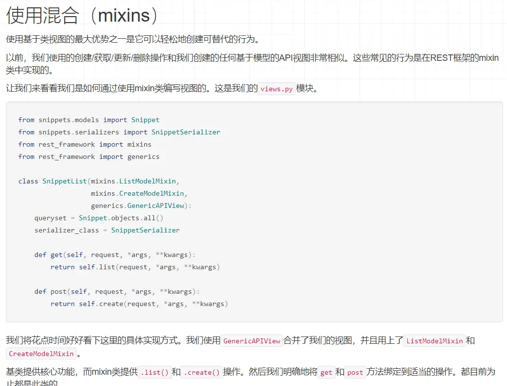
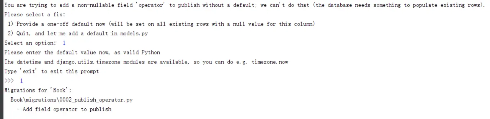
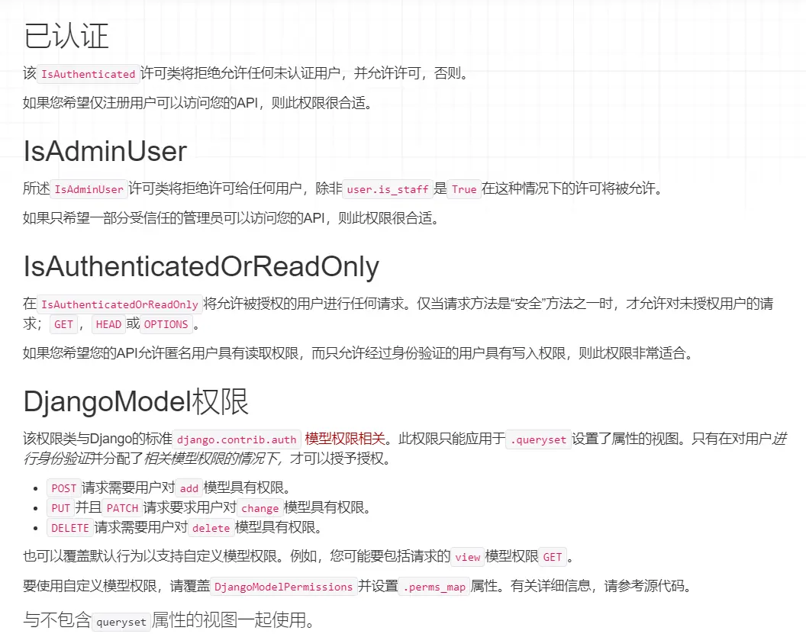
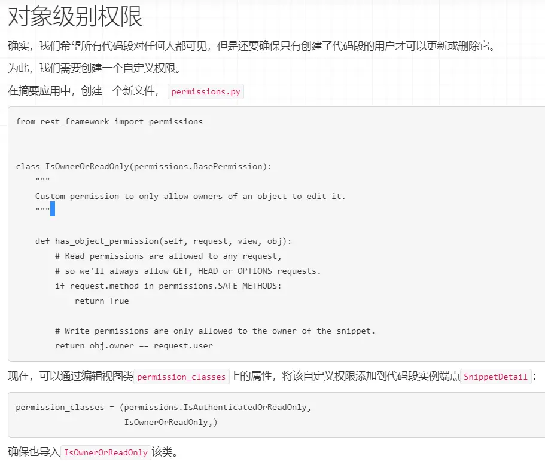

# Restframework从入门到精通

# (一)：Restframework之入门

> restful系列博客是在学习51cto的课程和在观看完官方文章之后的学习总结，自己重新做了一个案例来说明

> 个人博客：[www.ly-blog.top/](https://www.ly-blog.top/)

## Django Restframework是什么

`Django Restframework`是`Django`中可以 帮助我们快速的开发符合`RESTful`规范的接口的框架 ，`RESTful`是如今开发基本都会采用的规范

### Restful规范

- GET（SELECT）：查询; 从服务器取出资源（一项或多项）。
- POST（CREATE）：新增; 在服务器新建一个资源。
- PUT（UPDATE）：覆盖,全部更新 ; 在服务器更新资源（客户端提供改变后的完整资源）。
- PATCH（UPDATE）：更新;  在服务器更新资源（客户端提供改变的属性）。
- DELETE（DELETE）：删除; 从服务器删除资源。
- HEAD：获取资源的元数据。
- OPTIONS：获取信息，关于资源的哪些属性是客户端可以改变的。

### Restframework作用

- 路由

  - 可以通过`as_view`传参数,根据请求方式的不同执行响应的方法
  - 可以在url中设置一个结尾类似于.json的数据形式

- 视图

  - 帮助开发者提供了一些类,并在类提供了很多的方法供我们使用

- 版本控制

  - 在url中设置version参数,用户请求传入参数时,在`request.version`中获取版本,根据版本的不同做不同的处理

- 认证

  - 写一个类并注册到认证类,在类的authticate方法中编写认证逻辑
    - 认证成功(user,auth)
    - rase AuthticateFaild(..)
    - None 继续

- 权限

  - 写一个类并注册的权限类,在类的`has_permission`方法中写权限逻辑

- 频率限制

  - 写一个类并注册的权限类,在类的

    ```
    allow_requset/wait
    ```

     方法中写权限逻辑

    - 匿名
    - 用户
    - 返回为`True`或者`False`，`False`就要执行`wait`方法

- 解析器

  - 根据ContentType请求头,选择不同的解析器对请求体中的数据进行解析.
    - `Content-Type : url-formedo`
    - `Content-Type :application/json`

- 分页

  - 对从数据库中取到的数据进行分页处理. SQL---> limit offset
    - 根据页码:[www.luffycity.com/api/v1/stud…](http://www.luffycity.com/api/v1/student/?page=1&size=10)
    - 根据索引:[www.luffycity.com/api/v1/stud…](http://www.luffycity.com/api/v1/student/?offset=60(游标位置)&limit=10)
    - 根据加密:

- 序列化

  - 对`queryset`序列化以及对请求数据格式校验

- 渲染器

  - 根据url中传入的后缀,决定在数据如何渲染到页面上

**.......简单的总结就是，`Django Restframework`可以帮助你前后端分离开发，后台人员通过`Restframework`来开发`API`接口，前端人员写前端的页面（不论是PC还是移动端），到时候整合直接使用后端人员的接口就可以完成整个项目的开发**

接下来我从把`model`的数据转换为json格式来引入`Restframework`的概念

## model数据转换为json形式

在开始演示之前，要先配置好Django的基本配置：编写好model、setting配置、从model插入数据、view视图配置等操作，这里我一一演示一遍

### 演示前配置

先创建一个空文件夹，然后创建项目，如我下图所示


然后使用`pycharm`打开项目，配置好数据库、插入`Book`(我拿来演示的app)到`INSTALLED_APPS`，以下是我的配置

#### setting.py

```
INSTALLED_APPS = [
    'django.contrib.admin',
    'django.contrib.auth',
    'django.contrib.contenttypes',
    'django.contrib.sessions',
    'django.contrib.messages',
    'django.contrib.staticfiles',
    'Book',
    'rest_framework',
]

REST_FRAMEWORK = {
    'DEFAULT_PERMISSION_CLASSES': [
        'rest_framework.permissions.IsAdminUser',
    ],
    'PAGE_SIZE': 10
}
......

DATABASES = {
    'default': {
        'ENGINE': 'django.db.backends.mysql',
        'NAME': 'restful_demo',
        'USER': 'root',
        'PASSWORD': '',
        'HOST': '127.0.0.1',
        'PORT': '3306',
    }
}
```

#### 根目录`__init__`文件

在我的`restful_test(项目根目录)`文件夹里面的的`__init__.py`文件，因为是python3版本， 所以要配置一下mysql

```
import pymysql
pymysql.install_as_MySQLdb()
```

#### 创建model模型字段

在我创建的Book文件夹里面的model.py添加我要演示的字段

```
class Publish(models.Model):
    name=models.CharField(max_length=20,verbose_name="出版社名称",unique=True)
    address=models.CharField(max_length=128,verbose_name="地址")

    def __str__(self):
        return self.name

    class Meta:
        verbose_name="出版社"
        verbose_name_plural=verbose_name
```

然后对生成迁移文件和写入数据库

```
python manage.py makemigrations`->`python manage.py migrate
```

#### 创建管理员为model添加数据

`python manage.py createsuperuser`创建好管理员的用户名和密码

然后在`admin.py`里面注册Book

```
from django.contrib import admin
from .models import Publish
# Register your models here.
admin.site.register(Publish)
```

这里我添加好了三条数据


以上你要用`Django shell`添加也行

到这里演示前的准备都已经配置好了，接下来的都是配置`view`视图方法

### 方法一：使用字典的方式转换为json

```
from django.shortcuts import render
from django.http import HttpResponse
from django.views.generic.base import View
from .models import Publish
import json
# Create your views here.

class Publish_list(View):
    def get(self,request):
        queryset=Publish.objects.all()
        data=[]
        for i in queryset:
            p_tmp={
                "name":i.name,
                "address":i.address
            }
            data.append(p_tmp)
        return HttpResponse(json.dumps(data),content_type="application/json")

    def post(self,request):
        pass
```

然后配置一下路由

```
urlpatterns = [
    url(r'^admin/', admin.site.urls),
    url(r'^publish/',Publish_list.as_view())
]
```

访问 http://127.0.0.1:8000/publish/


可以看到model的数据已经转换为json格式了

### 方法二：使用Django自带的model_to_dict方法

方法二其实是对方法一进行优化，Django默认自带了一个model_to_dict方法，可以帮助我们把model转换为一个字典

```
from django.shortcuts import render
from django.http import HttpResponse
from django.views.generic.base import View
from .models import Publish
from django.forms.models import model_to_dict
import json
# Create your views here.

class Publish_list(View):
    def get(self,request):
        queryset=Publish.objects.all()
        data=[]
        for i in queryset:
            data.append(model_to_dict(i))
        return HttpResponse(json.dumps(data),content_type="application/json")

    def post(self):
        pass
```


方法二得出的结果还是一毛一样的

### 方法三：使用Django自带的序列化转换成json

```python
from django.shortcuts import render
from django.http import HttpResponse
from django.views.generic.base import View
from .models import Publish
from django.core import serializers
# Create your views here.

class Publish_list(View):
    def get(self,request):
        queryset=Publish.objects.all()
        data=serializers.serialize("json",queryset)

        return HttpResponse(data,content_type="application/json")
    def post(self):
        pass
```


### 总结

这个跟方法一和方法二的结果多了一个`model`和`pk`字段，但是方法三比其他两个方法更为简洁，更少的代码也更容易理解

如果单单只要提供信息的话使用方法三是完全足够的，从`model`读取信息转换为`json`格式方法三完全可以胜任。开发不仅仅只是把`model`转换为`API`，还要把`API`转换成`model`里面的数据

## Restframework的使用

### 初识：自定义序列化的类

`Restframework`的用法是跟`Django`的`form`表单的用法很相似

要先在创建一个`serializers`文件，这个文件里面存储序列化的字段

**serializers .py**

```python
from rest_framework import serializers

class Publishserializer(serializers.Serializer):
    id=serializers.IntegerField(read_only=True)
    name= serializers.CharField(max_length=32)
    address=serializers.CharField(max_length=128)
```

以上字段已经完成了字段的序列化，在前面说的跟form表单验证的方法一样，也有个验证的方法，如果直接把字段序列化进去就会造成不安全的问题，如翻译文档所示：


所以我们要重写一个`create`和`update`方法

**serializers .py**

```
from rest_framework import serializers
from .models import Publish


class Publishserializer(serializers.Serializer):
    id=serializers.IntegerField(read_only=True)
    name= serializers.CharField(max_length=32)
    address=serializers.CharField(max_length=128)

    def create(self, validated_data):
        #这里不用管validated_data是什么，只需要按照官网的方法所示，返回**validated_data就可以保证序列化的字段经过验证
        return Publish.objects.create(**validated_data)

    def update(self, instance, validated_data):
        instance.name=validated_data.get("name",instance.name)
        instance.address=validated_data.get("address",instance.address)
        instance.save()
        return instance
```

然后我们使用`Django shell`测试一下


其中的`is_vaild`方法都跟`form`表单使用方法一样，然后再刷新网页看看数据


如图所示，就增加了我刚刚写的数据

### 使用：在view里面添加序列化方法

**views.py**

```
from django.shortcuts import render
from django.http import HttpResponse
from django.views.generic.base import View
from .models import Publish
from django.core import serializers
from .serializers import Publishserializer
import json
# Create your views here.

class Publish_list(View):
    def get(self,request):
        queryset=Publish.objects.all()
        serializer=Publishserializer(queryset,many=True)    #many=True就是多个对象，要去遍历出来
        return HttpResponse(json.dumps(serializer.data),content_type="application/json")


    def post(self):
        pass
```

### 优化：继承model的字段

跟`form`一样，`form`可以继承`model`的字段，`serializers` 当然也可以，已经在`model`里面创建的字段，当然没有必要重新写一遍了，所以现在要改写一下`serializers .py`的代码

```
from rest_framework import serializers
from .models import Publish


class Publishserializer(serializers.ModelSerializer):
    class Meta:
        model=Publish
        fields=(
            "id",
            "name",
            "address"
        )

    def create(self, validated_data):
        #这里不用管validated_data是什么，只需要按照官网的方法所示，返回**validated_data就可以保证序列化的字段经过验证
        return Publish.objects.create(**validated_data)

    def update(self, instance, validated_data):
        instance.name=validated_data.get("name",instance.name)
        instance.address=validated_data.get("address",instance.address)
        instance.save()
        return instance
```

其余配置不变，输入配置好的路由地址 http://127.0.0.1:8000/publish/ ，依然可以访问到同样的数据


# (二)：Restframework之类视图的编写

## Restframework请求和响应

`Restframework`扩展了`Django`默认的 `Request` 对象，提供了更加的灵活解析，除此之外`Restframework`还引入了一个 `Response响应对象`和`状态码`，如翻译文档截图所示：


状态码呢，平常我们得到的结果404什么的我们都知道是找不到界面的意思了，但是`Restframework`在返回状态码的基础上还给我们返回一个说明

## Restframework编写 API视图

### 函数式编写API视图

`Restframework`的视图分为函数视图和类视图，这里我就直接用类视图来演示了，因为我开发`view视图`函数的时候都是用继承`from django.views.generic.base import View`来开发的，关于通过使用 `@api_view 装饰器`来对`API视图`进行开发官网有较明确的说明


### 类的方法来编写API视图


官网有详细说明的案例，这里我就直接编写视图代码了

**views.py**

```
from .models import Publish
from rest_framework.views import APIView
from .serializers import Publishserializer
from rest_framework.response import Response
from rest_framework import status
from django.http import Http404


class Publish_list(APIView):
    """
        列出所有的出版社或者创建一个新的出版社
    """
    def get(self, request, format=None):
        publish = Publish.objects.all()
        serializer = Publishserializer(publish, many=True)
        return Response(serializer.data)

    def post(self, request, format=None):
        serializer = Publishserializer(data=request.data)
        if serializer.is_valid():
            serializer.save()
            return Response(serializer.data, status=status.HTTP_201_CREATED)
        return Response(serializer.errors, status=status.HTTP_400_BAD_REQUEST)


class PublisherDetail(APIView):
    """
    具体的出版社的查看、修改和删除视图
    """
    def get_object(self, pk):
        try:
            return Publish.objects.get(pk=pk)
        except Publish.DoesNotExist:
            raise Http404

    def get(self, request, pk, format=None):
        publish = self.get_object(pk)
        serializer = Publishserializer(publish)
        return Response(serializer.data)

    def put(self, request, pk, format=None):
        publish = self.get_object(pk)
        serializer = Publishserializer(publish, data=request.data)
        if serializer.is_valid():
            serializer.save()
            return Response(serializer.data)
        return Response(serializer.errors, status=status.HTTP_400_BAD_REQUEST)

    def delete(self, request, pk, format=None):
        publish = self.get_object(pk)
        publish.delete()
        return Response(status=status.HTTP_204_NO_CONTENT)
```

然后去编写路由

**urls.py**

```
from django.conf.urls import url
from django.contrib import admin
from Book.views import Publish_list,PublisherDetail

urlpatterns = [
    url(r'^admin/', admin.site.urls),
    url(r'^publish/$',Publish_list.as_view()),
    url(r'^publish/(?P<pk>[0-9]+)/$',PublisherDetail.as_view())
]
```

配置完成，直接去访问地址


## 对类方法编写API视图进行优化

### mixins类说明

对上面我演示的案例来说，单单只有一个类方法来编写，就要使用到`get_object`、`put`、`delete`、`post`等方法，如果有很多个API方法，就要使用到很多个重复的方法，所以`Restframework`整合了这些方法成为一个类，把重复的方法都整合起来，我们只需要修改表就可以了，这样就可以大大的**减少代码量**了



来，让我们康康`mixins`的源码


根据源码所示，`model`的表名要赋值给`queryset`，序列化后的字段要赋值给`serializer_class`，不然就会报错

`mixins`类里面封装了很多的方法，我们需要用到什么方法的时候就继承里面的哪个方法即可

### 使用mixins重写view方法

**views.py**

```
from .models import Publish
from .serializers import Publishserializer
from rest_framework import mixins
from rest_framework import generics


class Publish_list(mixins.ListModelMixin, mixins.CreateModelMixin, generics.GenericAPIView):
    """
        列出所有的出版社或者创建一个新的出版社
        """
    queryset = Publish.objects.all()
    serializer_class = Publishserializer

    def get(self, request, *args, **kwargs):
        return self.list(request, *args, **kwargs)

    def post(self, request, *args, **kwargs):
        return self.create(request, *args, **kwargs)


class PublisherDetail(mixins.RetrieveModelMixin,
                      mixins.UpdateModelMixin,
                      mixins.DestroyModelMixin,
                      generics.GenericAPIView):
    """
    具体的出版社的查看、修改和删除视图
    """
    queryset = Publish.objects.all()
    serializer_class = Publishserializer

    def get(self, request, *args, **kwargs):
        return self.retrieve(request, *args, **kwargs)

    def put(self, request, *args, **kwargs):
        return self.update(request, *args, **kwargs)

    def delete(self, request, *args, **kwargs):
        return self.destroy(request, *args, **kwargs)
```

拿修改后的代码跟原来的一比，代码的逻辑少了很多，`queryset`和`serializer_class`是`mixins`里面定义好的字段，所以我们把值赋值给这两个字段即可

再访问 http://127.0.0.1:8000/publish/ 试试


依然没有任何问题

## mixins之再优化

在上述的mixins方法中已经帮我们整合了大部分的方法，已经减少了我们原本的大部分代码，但是还是有优化的地方

我们每次要调用很多个mixins方法的时候，一次要继承三四个类，看起来十分不美观


你想到的Restframework早就想到了，而且还帮你做出了优化

我拿截图的这两个代码来说明，我们一次要继承四个类，所以我们可以直接去继承一个整合类来代替四个类

```
class Publish_list(generics.ListCreateAPIView):
    """
        列出所有的出版社或者创建一个新的出版社
    """
    queryset = Publish.objects.all()
    serializer_class = Publishserializer

class PublisherDetail(generics.RetrieveUpdateDestroyAPIView):
    """
    具体的出版社的查看、修改和删除视图
    """
    queryset = Publish.objects.all()
    serializer_class = Publishserializer
复制代码
```

这个整合的代码的名称很简便易懂，让我们康康源码


哦吼，里面的代码不就是我们刚刚写的吗，直接帮我们把要重复的代码又整合一遍，把原本要十几行代码整合到了两行，我们直接写字段就好了

# (三)：Restframework之权限设置

## 第一步：增加显示操作人

查看`API`的这个界面默认是要登陆的，因为我上面我使用了`admin`账号去登陆，所以i才可以显示这个页面

但是默认的是所有账号登陆进去都可以对`API`进行增删改查，这个完全不符合逻辑。正常的逻辑是谁创建的才能谁去改，没有身份验证进去的只能读取操作。

如图，是我去数据库把我的`session`信息删掉之后再查看API的结果


依照官网的文档演示步骤，要先在`model`创建一个外键字段

```
......
class Publish(models.Model):
    name=models.CharField(max_length=20,verbose_name="出版社名称",unique=True)
    address=models.CharField(max_length=128,verbose_name="地址")
    operator = models.ForeignKey('auth.User', on_delete=models.CASCADE)

......
```

因为添加了一个字段，所以要进行数据库的迁移：`makemigrations` -> `migrate`

这里因为添加了一个字段，而之前的字段没有这个字段的默认值，所以会出现错误，要把默认值赋值为1即可



使用如上操作之后在数据库就已经生成了新的`operator`字段了，所以接下来要对序列化的文件也添加这个字段

```
class Publishserializer(serializers.ModelSerializer):
    class Meta:
        model=Publish
        fields=(
            "id",
            "name",
            "address",
            "operator"
        )
        ......
```

再登陆`admin`账号查看`API`得到的结果应该如下：


这个得到的`operator`的结果都为`1`是当然没问题的，`ID`为`1`就是代表`admin`账号，但是我们要显示的是这个`ID`的用户名

所以我们要在序列化文件里面添加一个字段

```
class Publishserializer(serializers.ModelSerializer):
    operator=serializers.ReadOnlyField(source="operator.username")
    class Meta:
        model=Publish
        fields=(
            "id",
            "name",
            "address",
            "operator"
        )
```

## 第二步：权限设置

关于权限设置在官网都有详细的说明


依照文档的说法，我们要在视图文件里面添加一个字段，使得未登录的用户只具有读取权限，登录的用户才具有读写权限：

```
from rest_framework import permissions
....
class Publish_list(generics.ListCreateAPIView):
    queryset = Publish.objects.all()
    serializer_class = Publishserializer
    permission_classes = (permissions.IsAuthenticatedOrReadOnly,)

class PublisherDetail(generics.RetrieveUpdateDestroyAPIView):
    queryset = Publish.objects.all()
    serializer_class = Publishserializer
    permission_classes = (permissions.IsAuthenticatedOrReadOnly,)
```

去演示一下，会发现未登录用户只有读取权限，登陆的用户才有写权限

这个`permissions`字段有好几种，在文档的API的权限设置详细文档里面有说明



在这里因为我要设置的是谁录入的`API`谁才具有读写权限，所以这里我要用的是[对象级别权限](http://www.sinodocs.cn/tutorial/4-authentication-and-permissions.html#object-level-permissions)

如图所示：



依照文档的说法，我们要新建一个`permissions.py`文件

**permissions.py**

```
from rest_framework import permissions


class IsOwnerOrReadOnly(permissions.BasePermission):
    """
    自定义权限只允许对象的权限来去编辑他
    """

    def has_object_permission(self, request, view, obj):
        # 读取权限允许任何请求
        # 所以我们总是允许Get，HEAD和OPTIONS请求
        if request.method in permissions.SAFE_METHODS:
            return True

        # 只有该出版社的所有者才允许去读写
        return obj.operator == request.user
```

然后再去视图函数里面继承`permissions`的这个类

之后我们再去创建一个管理员账号`admin2`看看能不能修改`admin`的API

## 第三步：新建保存operator值的方法

还有最后的一个问题，假如我们新建一个用户，就拿刚刚创建的`admin2`来说，我创建一个新的`API`数据，但是我的`operator`的`ID`是没有的。

我之前创建的`admin`账号是我模型迁移之前设置了默认的值`1`，但是我新创建的`admin2`没有`operator`的值，所以我们还要创建一个类方法去编写

我通俗的将不太好懂，这个原理如下：

使用`post`去创建一个新的`API`的时候是通过序列化去添加的，而我的序列化代码如下


序列化没有自己的`save`方法，默认存储方法是在`ModelSerializer`里面的，也就是在`Model`里面保存，但是我新建的用户`admin2`添加一个字段，他的`operator_id`都不知道去哪里找，如果使用`admin2`去添加`API`数据的话，会出现如下情况：


对于这种情况，文档的说明如下：


即是让我们在视图文件创建一个`.perform_create`方法

**views.py**

```
class Publish_list(generics.ListCreateAPIView):
    queryset = Publish.objects.all()
    serializer_class = Publishserializer
    permission_classes = (permissions.IsAuthenticatedOrReadOnly,IsOwnerOrReadOnly)

    def perform_create(self, serializer):
        serializer.save(operator=self.request.user)
```

好了现在再去试一下使用admin2去post请求


完美，搞定

## 留坑

项目开发可能更多用到的是token验证，所以这里留个坑，到时候我做个项目案例回来填

# (四)：Restframework之超链接API

## 演示前配置

拿外键的例子来说，`Book`的外键是`Publish`，点击`Book`的超链接`API`就可以访问到外键的`Publish`

为了方便演示，我这里我就创建一个新的表`Book`，添加一个`model`字段

**models.py**

```
class Book(models.Model):
    title=models.CharField(max_length=20,verbose_name="图书名称",unique=True)
    publish=models.ForeignKey("Publish",on_delete=True)

    def __str__(self):
        return self.title

    class Meta:
        verbose_name="书籍"
        verbose_name_plural=verbose_name
```

修改完`model`字段要`makemigrations`->`migrate`

然后添加一个新的序列化文件

**serializer.py**

```
from .models import Publish,Book
......
class Bookserializer(serializers.ModelSerializer):
    #通过publish这个外键去找到publish这个表的name
    publish=serializers.StringRelatedField(source="publish.name")
    class Meta:
        model = Book
        fields = (
            "id",
            "title",
            "publish"
        )
```

接下来要编写视图views文件

**views.py**

```
from .models import Publish,Book
from .serializers import Publishserializer,Bookserializer
.......
class Book_list(generics.ListCreateAPIView):
    queryset = Book.objects.all()
    serializer_class = Bookserializer
    permission_classes = (permissions.IsAuthenticatedOrReadOnly,)


class Book_Detail(generics.RetrieveUpdateDestroyAPIView):
    queryset = Book.objects.all()
    serializer_class = Bookserializer
    permission_classes = (permissions.IsAuthenticatedOrReadOnly, )
```

最后要编写路由方

**urls.py**

```
urlpatterns = [
    url(r'^admin/', admin.site.urls),
    #Publish的API
    url(r'^publish/$',Publish_list.as_view()),
    url(r'^publish/(?P<pk>[0-9]+)/$',PublisherDetail.as_view()),
    #Book的API
    url(r'^Book/$', Book_list.as_view()),
    url(r'^Book/(?P<pk>[0-9]+)/$', Book_Detail.as_view()),
]
```

运行项目可以看到项目运行成功，且post请求等都可以运行


这篇博客讲的就是要把publish外键字段的弄一个超链接，点击可以查看这个出版社的所有字段

即点击这上那个字段都可以跳转到出版社的API情况


## 配置超链接

配置超链接十分的简单，只需要序列化字段的类修改为`HyperlinkedModelSerializer`和删掉刚刚配置的`publish=serializers.StringRelatedField(source="publish.name")`

**serializers.py**

```
class Bookserializer(serializers.HyperlinkedModelSerializer):
    class Meta:
        model = Book
        fields = (
            "id",
            "title",
            "publish"
        
```

**urls.py**

```
urlpatterns = [
    url(r'^admin/', admin.site.urls),
    url(r'^$',api_root),
    #Publish的API
    url(r'^publish/$',Publish_list.as_view(),name='publish-list'),
    url(r'^publish/(?P<pk>[0-9]+)/$',PublisherDetail.as_view(),name='publish-detail'),
    #Book的API
    url(r'^Book/$', Book_list.as_view(),name='Book-list'),
    url(r'^Book/(?P<pk>[0-9]+)/$', Book_Detail.as_view(),name='Book-detail'),
]
```

配置完运行项目，可以看到已经配置好了超链接


## 显示所有可用的API

我们需要一个路由，打开可以显示所有可用的API

文档有这个方法的详细说明


依照文档的意思就是要在视图文件里面添加这个字段

**views.py**

```
from rest_framework.decorators import api_view
from rest_framework.response import Response
from rest_framework.reverse import reverse
......
@api_view(['GET'])
def api_root(request, format=None):
    return Response({
        'publish': reverse('publish-list', request=request, format=format),
        'Book': reverse('Book-list', request=request, format=format)
    })
```

然后我们配置一下路由

**urls.py**

```
    #api_root的路由
    url(r'^$',api_root),
```

运行项目，可见运行成功


# (五)：Restframework之视图集

> 视图集这个其实用不用意义不大，文档中做了一个亲切的比喻，就像编写视图函数的时候是使用函数的形式去编写还是通过类视图的形式去编写一样，主要还是为了减少代码

## 视图集

视图集的主要作用就是减少代码，就像我刚刚的代码，很多重复的，如图所示：


要写多少个字段就要重复多少个`queryset`、`serializer_class`和`permissions_classes`字段

视图集的主要作用就是对重复的代码做一个整合


依照文档所说，只需要定义一个`ViewSets`就可以有`Book_list`和`Book_Detail`两个字段的功能

**views.py**

```
# class Book_list(generics.ListCreateAPIView):
#     queryset = Book.objects.all()
#     serializer_class = Bookserializer
#     permission_classes = (permissions.IsAuthenticatedOrReadOnly,)
#
#
# class Book_Detail(generics.RetrieveUpdateDestroyAPIView):
#     queryset = Book.objects.all()
#     serializer_class = Bookserializer
#     permission_classes = (permissions.IsAuthenticatedOrReadOnly, )

#上面注释的代码都可以直接删了~~~

class BookViewSet(viewsets.ModelViewSet):
    queryset = Book.objects.all()
    serializer_class = Bookserializer
    permission_classes = (permissions.IsAuthenticatedOrReadOnly,)
```

然后需要在`urls.py`里面修改成视图集的字段，要改动的地方有点多，所以我直接丢出代码了

```
from django.conf.urls import url
from django.contrib import admin
from Book.views import *

book_list = BookViewSet.as_view({
    'get': 'list',
    'post': 'create'
})
book_detail = BookViewSet.as_view({
    'get': 'retrieve',
    'put': 'update',
    'patch': 'partial_update',
    'delete': 'destroy'
})

urlpatterns = [
    url(r'^admin/', admin.site.urls),
    url(r'^$',api_root),
    #Publish的API
    url(r'^publish/$',Publish_list.as_view(),name='publish-list'),
    url(r'^publish/(?P<pk>[0-9]+)/$',PublisherDetail.as_view(),name='publish-detail'),
    #Book的API
    # url(r'^Book/$', Book_list.as_view(),name='Book-list'),
    # url(r'^Book/(?P<pk>[0-9]+)/$', Book_Detail.as_view(),name='Book-detail'),

    # 使用BookViewSet(视图集)的API
    url(r'^Book/$', book_list,name='Book-list'),
    url(r'^Book/(?P<pk>[0-9]+)/$', book_detail,name='Book-detail'),
]
```

但是看看这个`urls.py`代码，在`views`里面减少了我们要的代码量，却在`urls`里面增加了我们的代码量~~~所以接下来要引入路由器的概念

## 路由器

使用视图集一般我们都会配套使用路由器


依照官网的说法，我们要实例化一个`DefaultRouter`类

**urls.py**

```
from django.conf.urls import url,include
from django.contrib import admin
from Book.views import *
from rest_framework.routers import DefaultRouter

router = DefaultRouter()
router.register(r'Book',BookViewSet)

urlpatterns = [
    url(r'^admin/', admin.site.urls),
    url(r'^',include(router.urls)),
    #这里的API先注释，因为api_root里面的publish没有使用视图集注册
    # url(r'^API/$',api_root),
    #Publish的API
    url(r'^publish/$',Publish_list.as_view(),name='publish-list'),
    url(r'^publish/(?P<pk>[0-9]+)/$',PublisherDetail.as_view(),name='publish-detail'),
    #Book的API
    # url(r'^Book/$', Book_list.as_view(),name='Book-list'),
    # url(r'^Book/(?P<pk>[0-9]+)/$', Book_Detail.as_view(),name='Book-detail'),

    # 使用BookViewSet(视图集)的API
    # url(r'^Book/$', book_list,name='Book-list'),
    # url(r'^Book/(?P<pk>[0-9]+)/$', book_detail,name='Book-detail'),
]
```

运行试试


也是可以运行的

然后再把剩下的那个`publish`也去使用视图集的方式注册一下

**views.py**

```
class BookViewSet(viewsets.ModelViewSet):
    queryset = Book.objects.all()
    serializer_class = Bookserializer
    permission_classes = (permissions.IsAuthenticatedOrReadOnly,)

class PublishViewSet(viewsets.ModelViewSet):
    queryset = Publish.objects.all()
    serializer_class = Publishserializer
    permission_classes = (permissions.IsAuthenticatedOrReadOnly,)


@api_view(['GET'])
def api_root(request, format=None):
    return Response({
        'publish': reverse('publish-list', request=request, format=format),
        'Book': reverse('Book-list', request=request, format=format)
    })
```

**urls.py**

```
from django.conf.urls import url,include
from django.contrib import admin
from Book.views import *
from rest_framework.routers import DefaultRouter

router = DefaultRouter()
router.register(r'Book',BookViewSet)
router.register(r'Publish',PublishViewSet)

urlpatterns = [
    url(r'^admin/', admin.site.urls),
    url(r'^',include(router.urls)),
]
```

然后再运行一下


都是完全可以运行的，用最少的代码去运行了同样的功能

但是你要是问我选哪种，我肯定不会用视图集，因为遇到没有读过文档的人，碰到这段代码绝对是看不懂的，而且出了Bug还不好找

最终还是要根据自己的情况去选择使用视图还是视图集

# (六)：Restframework之编写API文档

## 概要文档

`Restframework`有一个显示概要文档的功能，根据文档显示


根据文档的说明，我就直接修改路由了

**urls.py**

```
from django.conf.urls import url,include
from django.contrib import admin
from Book.views import *
from rest_framework.routers import DefaultRouter
from rest_framework.schemas import get_schema_view


router = DefaultRouter()
router.register(r'Book',BookViewSet)
router.register(r'Publish',PublishViewSet)
schema_view = get_schema_view(title='Pastebin API')

urlpatterns = [
    url(r'^admin/', admin.site.urls),
    url(r'^',include(router.urls)),
    url('^schema/$', schema_view),
]
```

根据文档的说明，直接执行是可以的，但是我这里还是出了一些问题，比如：


这个问题谷歌搜索后的最佳答案是这样的


emmm......虽然说知道了这个是什么原因也没啥用，我们直接升级一下`Django`和`Restframework`的版本就好了，新一点的版本没有这个bug

比如`Django2.0`和`Restframework3.7.7`及以上的版本不会出现这个问题

我更新了下版本，按照原来的配置，是可以运行的，如图概要文档已经生成


## API文档

`Restframework`自带一个`API`总和的说明文档，我们只需导入一个包和配置路由就可以直接使用

**urls.py**

```
......
from rest_framework.documentation import include_docs_urls
......
urlpatterns = [
    url(r'^docs/',include_docs_urls(title="图书管理系统")),
......
```

然后我们直接访问 http://127.0.0.1:8000/docs/ 就可以看到我们的文档已经做好了


