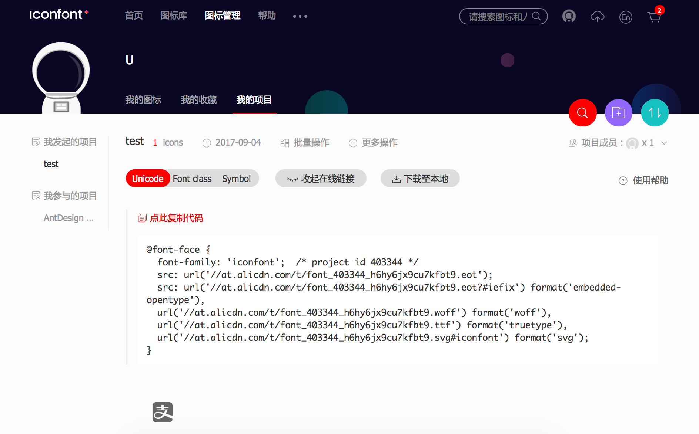
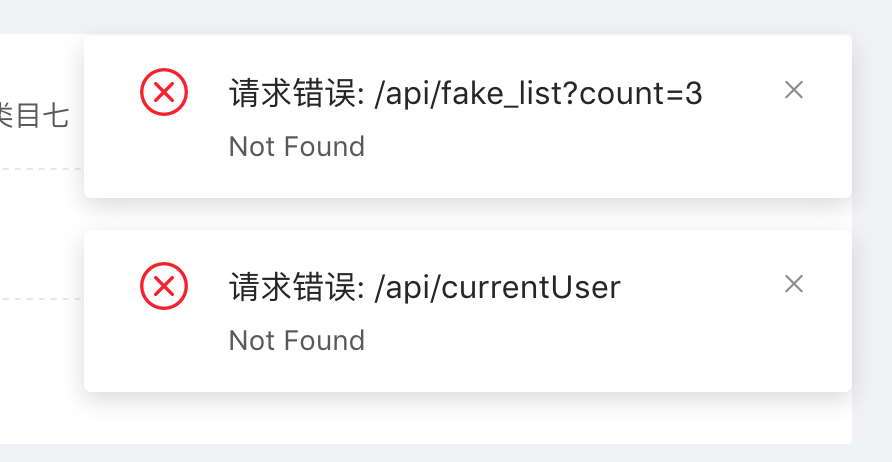

# Ant Design Pro 官方文档

## 开始使用

### 写在前面 [#](https://pro.loacg.com/docs/getting-started#写在前面)

Ant Design Pro 是一个企业级中后台前端/设计解决方案，我们秉承 [Ant Design](http://ant.design/) 的设计价值观，致力于在设计规范和基础组件的基础上，继续向上构建，提炼出典型模板/业务组件/配套设计资源，进一步提升企业级中后台产品设计研发过程中的『用户』和『设计者』的体验。随着『设计者』的不断反馈，我们将持续迭代，逐步沉淀和总结出更多设计模式和相应的代码实现，阐述中后台产品模板/组件/业务场景的最佳实践，也十分期待你的参与和共建。

> **本项目默认你有一定的 Vue 基础和 Antd 使用经验,如果你对这些还不熟悉，我们建议你先查阅相关文档** [Vue](https://cn.vuejs.org/)、[Ant Design Vue](https://vue.ant.design/)

我们基于上述目标和提供了以下的典型模板，并据此构建了一套基于 [Ant Design Vue](https://vue.ant.design/) 的中后台管理控制台的脚手架，她几乎完全和 react 相同布局，它可以帮助你快速搭建企业级中后台产品原型。

```
- Dashboard
  - 分析页
  - 监控页
  - 工作台
- 表单页
  - 基础表单页
  - 分步表单页
  - 高级表单页
- 列表页
  - 查询表格
  - 标准列表
  - 卡片列表
  - 搜索列表（项目/应用/文章）
- 详情页
  - 基础详情页
  - 高级详情页
- 结果
  - 成功页
  - 失败页
- 异常
  - 403 无权限
  - 404 找不到
  - 500 服务器出错
- 个人页
  - 个人中心
  - 个人设置
- 帐户
  - 登录
  - 注册
  - 注册成功
```

### 前序准备

你的本地环境需要安装 [node](http://nodejs.org/) 和 [git](https://git-scm.com/)。我们的技术栈基于 [ES2015+](http://es6.ruanyifeng.com/)、[Vue.Js](https://vuejs.org/)、[Vuex](https://vuex.vuejs.org/)、[Vue-Router](https://router.vuejs.org/)、[g2](https://antv.alipay.com/zh-cn/g2/3.x/index.html) 和 [antd-vue](https://vue.ant.design/docs/vue/introduce-cn/)，提前了解和学习这些知识会非常有帮助。

### 安装 

从 GitHub 仓库中直接安装最新的脚手架代码。

```bash
$ git clone --depth=1 https://github.com/sendya/ant-design-pro-vue.git my-project
$ cd my-project
```

### 目录结构 

我们已经为你生成了一个完整的开发框架，提供了涵盖中后台开发的各类功能和坑位，下面是整个项目的目录结构。

```bash
├── public
│   └── logo.png             # LOGO
|   └── index.html           # Vue 入口模板
├── src
│   ├── api                  # Api ajax 等
│   ├── assets               # 本地静态资源
│   ├── config               # 项目基础配置，包含路由，全局设置
│   ├── components           # 业务通用组件
│   ├── core                 # 项目引导, 全局配置初始化，依赖包引入等
│   ├── router               # Vue-Router
│   ├── store                # Vuex
│   ├── utils                # 工具库
│   ├── locales              # 国际化资源
│   ├── views                # 业务页面入口和常用模板
│   ├── App.vue              # Vue 模板入口
│   └── main.js              # Vue 入口 JS
│   └── permission.js        # 路由守卫(路由权限控制)
├── tests                    # 测试工具
├── README.md
└── package.json
```

### 本地开发

安装依赖。

```bash
$ yarn install
```

> 如果网络状况不佳，可以使用 [cnpm](https://cnpmjs.org/) 进行加速，并使用 `cnpm` 代替 `yarn`
> 或者设置 yarn 的 npm 加载源，如 `yarn config set registry https://registry.npm.taobao.org`

```bash
$ yarn run serve
```

启动完成后会自动打开浏览器访问 [http://localhost:8000](http://localhost:8080/)，你看到页面就代表成功了。

 接下来你可以修改代码进行业务开发了，我们内建了典型业务模板、常用业务组件、全局路由等等各种实用的功能辅助开发，你可以继续阅读和探索左侧的其他文档。 

## 路由和菜单

路由和菜单是组织起一个应用的关键骨架，pro 中的路由为了方便管理，使用了**中心化**的方式，在 [`router.config.js`](https://github.com/sendya/ant-design-pro-vue/blob/master/src/config/router.config.js) 统一配置和管理（另外，我们也提供了完全动态从后端加载的解决方案，可至本文末尾查看）。

### 基本结构

在这一部分，脚手架通过结合一些配置文件、基本算法及工具函数，搭建好了路由和菜单的基本框架，主要涉及以下几个模块/功能：

- `路由管理` 通过约定的语法根据在 [`router.config.js`](https://github.com/sendya/ant-design-pro-vue/blob/master/src/config/router.config.js) 中配置路由。
- `菜单生成` 根据路由配置来生成菜单。菜单项名称，嵌套路径与路由高度耦合。
- `面包屑` 组件 [PageHeader](http://pro.loacg.com/components/page-header) 中内置的面包屑也可由脚手架提供的配置信息自动生成。

下面简单介绍下各个模块的基本思路，如果你对实现过程不感兴趣，只想了解应该怎么实现相关需求，可以直接查看[需求实例](https://pro.loacg.com/docs/router-and-nav#需求实例)。

#### 路由

目前脚手架中所有的路由都通过 [`router.config.js`](https://github.com/sendya/ant-design-pro-vue/blob/master/src/config/router.config.js) 来统一管理，在 `vue-router` 的配置中我们增加了一些参数，如 `hideChildrenInMenu`,`meta.title`,`meta.icon`,`meta.permission`，来辅助生成菜单。其中：

- `hideChildrenInMenu` 用于隐藏不需要在菜单中展示的子路由。用法可以查看 `个人设置` 的配置。
- `hidden` 可以在菜单中不展示这个路由，包括子路由。效果可以查看 `other` 下的路由配置。
- `meta.title` 和 `meta.icon`分别代表生成菜单项的文本和图标。
- `meta.permission` 用来配置这个路由的权限，如果配置了将会验证当前用户的权限，并决定是否展示 *（默认情况下）。
- `meta.hiddenHeaderContent` 可以强制当前页面不显示 [PageHeader](https://github.com/sendya/ant-design-pro-vue/tree/master/src/components/PageHeader/PageHeader.vue#L6) 组件中的页面带的 面包屑和页面标题栏

#### 菜单

菜单根据 [`router.config.js`](https://github.com/sendya/ant-design-pro-vue/blob/master/src/config/router.config.js) 生成，具体逻辑在 `src/store/modules/permission.js` 中的 `actions.GenerateRoutes` 方法实现。

> 如果你需要从服务器请求菜单，你可以参考 [权限管理&动态菜单](https://pro.loacg.com/docs/authority-management)

### 需求实例

上面对这部分的实现概要进行了介绍，接下来通过实际的案例来说明具体该怎么做。

#### 菜单跳转到外部地址

你可以直接将完整 url 填入 path 中，框架会自动处理。

```js
{
    path: 'https://pro.loacg.com/docs/getting-started',
    name: 'docs',
    meta: {
        title: '文档', 
        target: '_blank' // 打开到新窗口
   }
}
```

加好后，会默认生成相关的路由及导航。

#### 新增布局

在脚手架中我们通过嵌套路由来实现布局模板。[`router.config.js`](https://github.com/sendya/ant-design-pro-vue/blob/master/src/config/router.config.js) 是一个数组，其中第一级数据就是我们的布局，如果你需要新增布局可以再直接增加一个新的一级数据。

```js
{
    path: '/new-router',
    name: 'newRouter',
    redirect: '/new-router/ahaha',
    component: RouteView,
    meta: { title: '仪表盘', keepAlive: true, permission: [ 'dashboard' ] },
    children: [
    {
        path: '/new-router/ahaha',
        name: 'ahaha',
        component: () => import('@/views/dashboard/Analysis'),
        meta: { title: '分析页', keepAlive: false, permission: [ 'ahaha' ] }
    }
}
```

路由配置项 e.g.

```js
{
  redirect: noredirect,
  name: 'router-name',
  hidden: true,
  meta: {
    title: 'title',
    icon: 'a-icon',
    keepAlive: true,
    hiddenHeaderContent: true,
  }
}
```

### API

`{ Route }` 对象

| 参数               | 说明                                              | 类型    | 默认值 |
| :----------------- | :------------------------------------------------ | :------ | :----- |
| hidden             | 控制路由和子路由是否显示在 sidebar                | boolean | false  |
| redirect           | 重定向地址, 访问这个路由时,自定进行重定向         | string  | -      |
| name               | 路由名称, 必须设置,且不能重名                     | string  | -      |
| meta               | 路由元信息（路由附带扩展信息）                    | object  | {}     |
| hideChildrenInMenu | 强制菜单显示为Item而不是SubItem(配合 meta.hidden) | boolean | -      |

`{ Meta }` 路由元信息对象

| 参数                | 说明                                                         | 类型         | 默认值 |
| :------------------ | :----------------------------------------------------------- | :----------- | :----- |
| title               | 路由标题, 用于显示面包屑, 页面标题 *推荐设置                 | string       | -      |
| icon                | 路由在 menu 上显示的图标                                     | [string,svg] | -      |
| keepAlive           | 缓存该路由 (开启 multi-tab 是默认值为 true)                  | boolean      | false  |
| hiddenHeaderContent | *特殊 隐藏 [PageHeader](https://github.com/sendya/ant-design-pro-vue/blob/master/src/components/layout/PageHeader.vue#L14) 组件中的页面带的 面包屑和页面标题栏 | boolean      | false  |
| permission          | 与项目提供的权限拦截匹配的权限，如果不匹配，则会被禁止访问该路由页面 | array        | []     |

> 路由自定义 `Icon` 请引入自定义 `svg` Icon 文件，然后传递给路由的 `meta.icon` 参数即可

> 请注意 `component: () => import('..')` 方式引入路由的页面组件为 懒加载模式。具体可以看 [Vue 官方文档](https://router.vuejs.org/zh/guide/advanced/lazy-loading.html)
> 增加新的路由应该增加在 ‘/‘ (index) 路由的 `children` 内
> 无需控制权限的路由或者需要在未登录情况访问的路由，可以定义在 `/src/config/router.config.js` 下的 `constantRouterMap` 属性中
> `permission` 可以进行自定义修改，只需要对这个模块进行自定义修改即可 [src/store/modules/permission.js#L10](https://github.com/sendya/ant-design-pro-vue/blob/master/src/store/modules/permission.js#L10)

### 附录

> 如果你需要从服务器请求菜单，你可以参考 [权限管理&动态菜单](https://pro.loacg.com/docs/authority-management)

## 布局

 页面整体布局是一个产品最外层的框架结构，往往会包含导航、页脚、侧边栏、通知栏以及内容等。在页面之中，也有很多区块的布局结构。在真实项目中，页面布局通常统领整个应用的界面，有非常重要的作用。 

### Ant Design Pro 的布局

在 Ant Design Pro 中，我们抽离了使用过程中的通用布局，都放在 `/layouts` 目录中，分别为：

- BasicLayout：基础页面布局，包含了头部导航，侧边栏和通知栏：


- UserLayout：抽离出用于登陆注册页面的通用布局

 

- PageView：基础布局，包含了面包屑，和中间内容区 (`slot`)
- RouterView：空布局，专门为了二级菜单内容区自定义
- BlankLayout：空白的布局

### 如何使用 Ant Design Pro 布局

通常布局是和路由系统紧密结合的，Ant Design Pro 的路由使用了 `Vue-Router` 的路由方案，为了统一方便的管理路由和页面的关系，我们将配置信息统一抽离到 `config/router.config.js` 下，通过如下配置定义每个页面的布局：

```js
// eslint-disable-next-line
import { UserLayout, BasicLayout, RouteView, BlankLayout, PageView } from '@/components/layouts'

export default [
  {
    path: '/',
    name: 'index',
    component: BasicLayout,
    meta: { title: '首页' },
    redirect: '/dashboard/workplace',
    children: [
      // dashboard
      {
        path: '/dashboard',
        name: 'dashboard',
        redirect: '/dashboard/workplace',
        component: RouteView,
        meta: { title: '仪表盘', icon: 'dash', permission: ['admin'] },
        children: [
          {
              path: '',
              name: '',
              component: () => import('@/views/...'),
              meta: { title: '', permission: [ '...' ] }
          },
          {
              path: '',
              name: '',
              hidden: true,
              component: () => import('@/views/...'),
              meta: { title: '', keepAlive: true, permission: [ '...' ] }
          }
        ]
      },
      // forms
      {
        path: '/form',
        redirect: '/form/base-form',
        component: PageView,
        meta: { title: '表单页', icon: 'form', permission: [ 'form' ] },
        children: [
          {
            path: '/form/base-form',
            name: 'BaseForm',
            component: () => import('@/views/form/BasicForm'),
            meta: { title: '基础表单', permission: [ 'form' ] }
          }
        ]
      }
    ]
  }
]
```

映射路由和页面布局（组件）的关系如代码所示，完整映射转换实现可以参看 [router.config.js](https://github.com/sendya/ant-design-pro-vue/blob/master/src/config/router.config.js)。

更多 Vue-Router 的路由配置方式可以参考：[Vue-Router 配置式路由](https://router.vuejs.org/)。

#### Pro 扩展配置

我们在 `router.config.js` 扩展了一些关于 pro 全局菜单的配置。

```
{
    hidden: true,
    hideChildrenInMenu: true,
    meta: {
        icon: 'dashboard',
        title: '菜单标题',
        keepAlive: true,
        permission: ['admin']
    }
}
```

> 更多可配置属性，请参考 [路由和菜单](https://pro.loacg.com/docs/router-and-nav)

### Ant Design 布局组件

除了 Pro 里的内建布局以外，在一些页面中需要进行布局，可以使用 Ant Design 目前提供的两套布局组件工具：[Layout](https://vue.ant.design/components/layout-cn/) 和 [Grid](https://vue.ant.design/components/grid-cn/)。

#### Grid 组件

栅格布局是网页中最常用的布局，其特点就是按照一定比例划分页面，能够随着屏幕的变化依旧保持比例，从而具有弹性布局的特点。

而 Ant Design 的栅格组件提供的功能更为强大，能够设置间距、具有支持响应式的比例设置，以及支持 `flex` 模式，基本上涵盖了大部分的布局场景，详情参看：[Grid](https://vue.ant.design/components/grid-cn/)。

#### Layout 组件

如果你需要辅助页面框架级别的布局设计，那么 [Layout](https://vue.ant.design/components/layout-cn/) 则是你最佳的选择，它抽象了大部分框架布局结构，使得只需要填空就可以开发规范专业的页面整体布局，详情参看：[Layout](https://vue.ant.design/components/layout-cn/)。

#### 根据不同场景区分抽离布局组件

在大部分场景下，我们需要基于上面两个组件封装一些适用于当下具体业务的组件，包含了通用的导航、侧边栏、顶部通知、页面标题等元素。例如 Ant Design Pro 的 [BasicLayout](https://github.com/sendya/ant-design-pro-vue/blob/master/src/components/layouts/BasicLayout.vue)。

通常，我们会把抽象出来的布局组件，放到跟 `components` 和 `layouts` 文件夹中方便管理。需要注意的是，这些布局组件和我们平时使用的其它组件并没有什么不同，只不过功能性上是为了处理布局问题。

## 新增页面

这里的『页面』指配置了路由，能够通过链接直接访问的模块，要新建一个页面，通常只需要在脚手架的基础上进行简单的配置。

### 一、新增 vue 文件

在 `src/views` 下新建页面的`vue`文件，如果相关页面有多个，可以新建一个文件夹来放置相关文件。

  

样式文件默认使用 [Less](https://less.bootcss.com/)，如果需要，你可以在`vue`文件的`style`标签头部引入 [antd 样式变量文件](https://github.com/vueComponent/ant-design-vue/blob/master/components/style/themes/default.less)：


```css
@import '~ant-design-vue/lib/style/themes/default.less';
```

这样可以很方便地获取 antd 样式变量并在你的文件里使用，有利于保持页面的一致性，也方便实现定制主题。

### 二、将文件加入菜单和路由

加入菜单和路由的方式请参照 [路由和菜单 - 添加路由/菜单](https://pro.loacg.com/docs/router-and-nav) 中的介绍完成。加好后，访问 `http://localhost:8080/new` 就可以看到新增的页面了。


### 三、新增 model

布局及路由都配置好之后，回到之前新建的 `newPage.vue`，可以开始写业务代码了！如果需要用到 [vuex](https://vuex.vuejs.org/zh/) 中的数据流，还需要在 `src/store/model` 中建立相应的 model。

## 新增业务组件

对于一些可能被多处引用的功能模块，建议提炼成业务组件统一管理。这些组件一般有以下特征：

- 只负责一块相对独立，稳定的功能；
- 没有单独的路由配置；
- 可能是纯静态的，也可能包含自己的 state，但不涉及 vuex 的数据流，仅受父组件（通常是一个页面）传递的参数控制。

------

下面以一个简单的静态组件为例进行介绍。假设你的应用中经常需要展现图片，这些图片宽度固定，有一个灰色的背景和一定的内边距，有文字介绍，就像下图这样：


你可以用一个组件来实现这一功能，它有默认的样式，同时可以接收父组件传递的参数进行展示。

### 新建文件

在 `src/components` 下新建一个以组件名命名的文件夹，注意首字母大写，命名尽量体现组件的功能，这里就叫 `ImageWrapper`。在此文件夹下新增 js 文件及样式文件（如果需要），命名为 `index.js` 和 `index.less`。

> 在使用组件时，默认会在 `index.js` 中寻找 export 的对象，如果你的组件比较复杂，可以分为多个文件，最后在 `index.js` 中统一 export，就像这样：
>
> ```js
> // MainComponent.js
> export default ({ ... }) => (...)
> 
> // SubComponent1.js
> export default ({ ... }) => (...)
> 
> // SubComponent2.js
> export default ({ ... }) => (...)
> 
> // index.js
> import MainComponent from './MainComponent'
> import SubComponent1 from './SubComponent1'
> import SubComponent2 from './SubComponent2'
> 
> MainComponent.SubComponent1 = SubComponent1
> MainComponent.SubComponent2 = SubComponent2
> export default MainComponent
> ```

你的代码大概是这个样子：

```vue
<template>
    <div class="image-wrapper">
        
        <!-- 如果使用该组织的使用者没用 slot，则默认 div.desc 来输出传递的 desc 属性 -->
        <slot name="desc">
            <div class="desc" v-if="desc">{{ desc }}</div>
        </slot>
    </div>
</template>

<script>
export default {
    name: 'ImageWrapper',
    props: {
        src: {
            type: String,
            required: true
        },
        desc: {
            type: String,
            default: null
        }
    },
    data () {
        return {
        }
    }
}
</script>

<style lang="less" scoped>
@import '@/components/index.less';

.image-wrapper {
  padding: 0 20px 8px;
  background: #f2f4f5;
  width: 400px;
  margin: 0 auto;
  text-align: center;

  .img {
      vertical-align: middle;
      max-width: calc(100% - 32px);
      margin: 2.4em 1em;
      box-shadow: 0 8px 20px rgba(143, 168, 191, 0.35);
  }

  .desc {
      font-size: 1em;
      color: #000;
  }
}
</style>
```

到这儿组件就建好了。

### 使用

在要使用这个组件的地方，按照组件定义的 API 传入参数，直接使用就好，不过别忘了先引入：

```vue
<template>
    <!-- 普通使用方式 -->
    <image-wrapper :src="imageSrc" :desc="context"></image-wrapper>

    <!-- 使用 slot 的 desc 方式 -->
    <image-wrapper :src="imageSrc">
        <span slot="desc">{{ context }}</span>
    </image-wrapper>
</template>

<script>
import ImageWrapper from '@/components/ImageWrapper';  // @ 表示相对于源文件根目录

export default {
    // 引入组件
    components: {
        ImageWrapper
    },
    data () {
        return {
            context: '示意图',
            imageSrc: 'https://os.alipayobjects.com/rmsportal/mgesTPFxodmIwpi.png'
        }
    }
}
</script>
```

## 样式

这篇文档主要针对如何在项目中使用和规划样式文件进行介绍，如果想获取基础的 CSS 知识或查阅属性，可以参考 [MDN文档](https://developer.mozilla.org/zh-CN/docs/Web/CSS/Reference)。

------

### Less

Ant Design Pro 默认使用 less 作为样式语言，建议在使用前或者遇到疑问时学习一下 [less](http://lesscss.org/) 的相关特性。

在样式开发过程中，有两个问题比较突出：

- 全局污染 —— CSS 文件中的选择器是全局生效的，不同文件中的同名选择器，根据 build 后生成文件中的先后顺序，后面的样式会将前面的覆盖；
- 选择器复杂 —— 为了避免上面的问题，我们在编写样式的时候不得不小心翼翼，类名里会带上限制范围的标识，变得越来越长，多人开发时还很容易导致命名风格混乱，一个元素上使用的选择器个数也可能越来越多。

为了解决上述问题，我们的脚手架推荐样式尽量保证使用 `scoped` 局部样式方案，先来看下在这种模式下怎么写样式。

```vue
<template>
    <div class="title">
        {{ title }}
    </div>
</template>

<script>
export default {
    data () {
        return {
            title: '啦啦啦'
        }
    },
    methods: {

    }
}
</script>

<style lang="less" scoped>
import "@/components/index.less";

.title {
    color: @heading-color;
    font-weight: 600;
    margin-bottom: 16px;
}
</style>
```

在上面的样式文件中，`.title` 只会在本文件生效，你可以在其他任意文件中使用同名选择器，也不会对这里造成影响。不过有的时候，我们就是想要一个全局生效的样式呢？可以将样式提取到一个公共文件，比如 Pro 提取的 `components/global.less` 然后在 `main.js` 将样式引入

```less
// global.less 
// 在这个文件内定义的样式会全局污染
.title {
  color: @heading-color;
  font-weight: 600;
  margin-bottom: 16px;
}

.text {
  font-size: 16px;
}

.footer {
  color: #ccc;
}
.sider {
  background: #ebebeb;
}
```

Vue 中对样式的 `scoped` 处理基本原理很简单，就是对每个类名所在的 dom 元素按照一定规则进行转换，增加 `data-v-xx` 属性，并让编译后的样式表类名与 `data-x` 选择器合作来保证它的唯一性。如果在浏览器里查看这个示例的 dom 结构，你会发现实际渲染出来是这样的：

```html
<div class="title" data-v-c05f9fc4>title</div>
```

类名被自动添加了一个 hash 值的选择器，这保证了它的唯一性。

除了上面的基础知识，还有一些关键点需要注意：

- 由于不用担心类名重复，你的 class 可以在基本语意化的前提下尽量简单一点儿。

- https://juejin.im/post/5ac5fd7f5188257cc20d854e)

### 样式文件类别

在一个项目中，样式文件根据功能不同，可以划分为不同的类别。

#### src/global.less

全局样式文件，在这里你可以进行一些通用设置，比如脚手架中自带的：

```css
html, body {
  height: 100%;
}

body {
  text-rendering: optimizeLegibility;
  -webkit-font-smoothing: antialiased;
  -moz-osx-font-smoothing: grayscale;
}
```

> 因为 antd 中会自带一些全局设置，如字号，颜色，行高等，所以在这里，你只需要关注自己的个性化需求即可，不用进行大量的 reset。

#### src/utils/utils.less

这里可以放置一些工具函数供调用，比如清除浮动 `.clearfix`。

#### 模块样式

针对某个模块/页面生效的文件。

##### 通用模块级

例如 `src/layouts/BasicLayout.less`，里面包含一些基本布局的样式，被 `src/layouts/BasicLayout.vue` 引用，项目中使用这种布局的页面就不需要再关心整体布局的设置。如果你的项目中需要使用其他布局，也建议将布局相关的 js 和 less 放在这里 `src/layouts`。

##### 页面级

具体页面相关的样式，例如 `src/views/dashborad/Monitor.less`，里面的内容仅和本页面的内容相关。一般情况下，如果不是页面内容特别复杂，有了前面全局样式、通用模块样式的配合，这里要写的应该不多。

##### 模块样式 

针对某个模块/页面生效的文件。

##### 组件级

这个也很简单，就是组件相关的样式了，有一些在页面中重复使用的片段或相对独立的功能，你可以提炼成组件，相关的样式也应该提炼出来放在组件中，而不是混淆在页面里。

> 以上样式类别都是针对独立的样式文件，有时样式配置特别简单，也没有重复使用，你也可以用内联样式 `style="{ fontSize: fontSizeVar }"` 来设置。

### 覆盖组件样式

由于业务的个性化需求，我们经常会遇到需要覆盖组件样式的情况，这里举个简单的例子。

```vue
<template>
    <div class="test-wrapper">
        <a-select>
            <a-select-option value="1">Option 1</a-select-option>
            <a-select-option value="2">Option 2</a-select-option>
            <a-select-option value="3">Option 3</a-select-option>
        </a-select>
    </div>
</template>

<script>
export default {

}
</script>
<style lang="less" scoped>
// 使用 css 时可以用 >>> 进行样式穿透
.test-wrapper >>> .ant-select {
    font-size: 16px;
}

// 使用 scss, less 时，可以用 /deep/ 进行样式穿透
.test-wrapper /deep/ .ant-select {
    font-size: 16px;
}
</style>
```

方法很简单，有两点需要注意：

- 引入的 antd 组件类名没有被 CSS 编译器转化，所以被覆盖的类名 `.ant-select` 必须依靠 Vue 提供的穿透方案来穿透组件的样式。
- 因为上一条的关系，覆盖是全局性的。为了防止对其他 Select 组件造成影响，所以需要包裹额外的 class 限制样式的生效范围。

## 和服务端进行交互

Ant Design Pro 是一套基于 Vue 技术栈的单页面应用，我们提供的是前端代码和 `mock` 模拟数据的开发模式，
通过 API 的形式和任何技术栈的服务端应用一起工作。下面将简单介绍和服务端交互的基本写法。

### 前端请求流程

在 Ant Design Pro 中，一个完整的前端 UI 交互到服务端处理流程是这样的：

1. UI 组件交互操作；
2. 调用统一管理的 api service 请求函数；
3. 使用封装的 request.js 发送请求；
4. 获取服务端返回；
5. 更新 data。

从上面的流程可以看出，为了方便管理维护，统一的请求处理都放在 `@/src/api` 文件夹中，并且一般按照 model 纬度进行拆分文件，如：

```
api/
  user.js
  permission.js
  goods.js
  ...
```

其中，`@/src/utils/request.js` 是基于 [axios](https://github.com/axios/axios) 的封装，便于统一处理 POST，GET 等请求参数，请求头，以及错误提示信息等。具体可以参看 [request.js](https://github.com/sendya/ant-design-pro-vue/blob/master/src/utils/request.js)。 它封装了全局 request 拦截器、response 拦截器、统一的错误处理、baseURL 设置等。

例如在 api 中的一个请求用户信息的例子：

```js
// api/user.js
import { axios } fromm '@/utils/request'

const api = {
    info: '/user',
    list: '/users'
}

// 根据用户 id 获取用户信息
export function getUser (id) {
    return axios({
        url: `${api.user}/${id}`,
        method: 'get'
    })
}

// 增加用户
export function addUser (parameter) {
    return axios({
        url: api.user,
        method: 'post',
        data: parameter
    })
}

// 更新用户 // or (id, parameter)
export function updateUser (parameter) {
    return axios({
        url: `${api.user}/${parameter.id}`, // or `${api.user}/${id}`
        method: 'put',
        data: parameter
    })
}

// 删除用户
export function deleteUser (id) {
    return axios({
        url: `${api.user}/${id}`,
        method: 'delete',
        data: parameter
    })
}

// 获取用户列表 parameter: { pageSize: 10, pageNo: 1 }
export function getUsers (parameter) {
    return axios({
        url: api.list,
        method: 'get',
        params: parameter
    })
}
<template>
    <div>
        <a-button @click="queryUser"></a-button>

        <a-table :dataSource="list">
        </a-table>
    </div>
</template>

<script>
import { getUser, getUsers } from '@/api/user'

export default {
    data () {
        return {
            id: 0,
            queryParam: {
                pageSize: 10,
                pageNo: 1,
                username: ''
            },
            info: {},
            list: []
        }
    },
    methods: {
        queryUser () {
            const { $message } = this
            getUser(this.id).then(res => {
                this.info = res.data
            }).catch(err => {
                $message.error(`load user err: ${err.message}`)
            })
        },
        queryUsers () {
            getUsers(this.queryParam).then(res => {
                this.list = res
            })
        }
    }
}
</script>
```

### Mock

- 有关项目默认使用的 `mockjs` 默认情况下在 `production` 是不生效的，所以直接不经过任何修改就编译出来，是无法看到效果的。
- Mock 在 `main.js` 中经行引入，你可以查看该文件的源代码，并找到 `import './mock'` 这样的代码。（去除它 可完整的将项目中的 mock 拦截去除）
- 如果想与 preview 一样，在生产环境也能使用 mock，则需要修改 `src/mock/index.js` 中的环境判断，这一些内容则需要自己理解并修改了。

## 引入外部模块

除了 `ant-design-vue` 组件以及脚手架内置的业务组件，有时我们还需要引入其他外部模块，这里以引入富文本组件 [vue-quill-editor](https://www.npmjs.com/package/vue-quill-editor) 为例进行介绍，如果该组件已更新引入方式，可直接自行前往组件首页查看如何引入，并以官方为准。

------

### 引入依赖

在终端输入下面的命令完成安装：

```bash
$ yarn add vue-quill-editor
or
$ npm install vue-quill-editor --save
```

> 加上 `--save` 参数会自动添加依赖到 package.json 中去。

### 使用

#### 全局引入

```js
import Vue from 'vue'
import VueQuillEditor from 'vue-quill-editor'

// require styles
import 'quill/dist/quill.core.css'
import 'quill/dist/quill.snow.css'
import 'quill/dist/quill.bubble.css'

Vue.use(VueQuillEditor, /* { default global options } */)
```

#### 局部按需引入

```vue
<template>
    <div>
        <quill-editor ref="myTextEditor"
                      v-model="content"
                      :config="editorOption"
                      @blur="onEditorBlur($event)"
                      @focus="onEditorFocus($event)"
                      @ready="onEditorReady($event)">
        </quill-editor>
    </div>
</template>

<script>
import 'quill/dist/quill.core.css'
import 'quill/dist/quill.snow.css'
import 'quill/dist/quill.bubble.css'
import { quillEditor } from 'vue-quill-editor'

export default {
  components: {
    quillEditor
  },
  data () {
      return {
          content: '<h2>I am Example</h2>',
          editorOption: {
           // something config
          }
      }
  },
  // 如果需要手动控制数据同步，父组件需要显式地处理changed事件
  methods: {
    onEditorBlur(editor) {
      console.log('editor blur!', editor)
    },
    onEditorFocus(editor) {
      console.log('editor focus!', editor)
    },
    onEditorReady(editor) {
      console.log('editor ready!', editor)
    },
    onEditorChange({ editor, html, text }) {
      // console.log('editor change!', editor, html, text)
      this.content = html
    }
  },
  // 如果你需要得到当前的editor对象来做一些事情，你可以像下面这样定义一个方法属性来获取当前的editor对象，实际上这里的$refs对应的是当前组件内所有关联了ref属性的组件元素对象
  computed: {
    editor() {
      return this.$refs.myTextEditor.quillEditor
    }
  },
  mounted() {
    // you can use current editor object to do something(editor methods)
    console.log('this is my editor', this.editor)
    // this.editor to do something...
  }
}
</script>
```

这样就成功引入了一个富文本组件。有几点值得注意：

- import 时需要注意组件暴露的数据结构；
- 有一些组件需要额外引入样式。

## 构建和发布

### 构建

当项目开发完毕，只需要运行一行命令就可以打包你的应用：

```bash
$ yarn build
or
$ npm run build
```

由于 Ant Design Pro 使用的工具 [Vue-cli3](https://cli.vuejs.org/) 已经将复杂的流程封装完毕，构建打包文件只需要一个命令 `yarn build` 或 `npm run build`，构建打包成功之后，会在根目录生成 `dist` 文件夹，里面就是构建打包好的文件，通常是 `*.js`、`*.css`、`index.html` 等静态文件，也包括了项目根的 `public/` 下的所有文件。

如果需要自定义构建，比如指定 `dist` 目录等，可以通过 `/vue.config.js` 进行配置，详情参看：[Vue-cli3 配置](https://cli.vuejs.org/guide/)。

#### 前端路由与服务端的结合

Ant Design Pro 使用的 `Vue-Router` 支持两种路由方式：`browserHistory` 和 `hashHistory` 可以参考文档 [Vue-Router URL 模式](https://router.vuejs.org/zh/guide/essentials/history-mode.html)。
可以在 `src/router/index.js` 中进行配置选择用哪个方式：

```javascript
import Vue from 'vue'
import Router from 'vue-router'
import { constantRouterMap } from '@/config/router.config'

Vue.use(Router)

export default new Router({
  mode: 'history', // 默认是 history 可以改为 hash
  base: process.env.BASE_URL,
  scrollBehavior: () => ({ y: 0 }),
  routes: constantRouterMap
})
```

`hashHistory` 使用如 `https://cdn.com/#/users/123` 这样的 URL，取井号后面的字符作为路径。`browserHistory` 则直接使用 `https://cdn.com/users/123` 这样的 URL。使用 `hashHistory` 时浏览器访问到的始终都是根目录下 `index.html`。使用 `browserHistory` 则需要服务器做好处理 URL 的准备，处理应用启动最初的 `/` 这样的请求应该没问题，但当用户来回跳转并在 `/users/123` 刷新时，服务器就会收到来自 `/users/123` 的请求，这时你需要配置服务器能处理这个 URL 返回正确的 `index.html`。如果你能控制服务端，我们推荐使用 `browserHistory`。

#### 使用 nginx

nginx 作为最流行的 web 容器之一，配置和使用相当简单，只要简单的配置就能拥有高性能和高可用。推荐使用 nginx 托管。示例配置如下：

```nginx
server {
    listen 80;
    # gzip config
    gzip on;
    gzip_min_length 1k;
    gzip_comp_level 9;
    gzip_types text/plain application/javascript application/x-javascript text/css application/xml text/javascript application/x-httpd-php image/jpeg image/gif image/png;
    gzip_vary on;
    gzip_disable "MSIE [1-6]\.";

    root /usr/share/nginx/html;

    location / {
        # 用于配合 browserHistory 使用
        try_files $uri $uri/ /index.html;

        # 如果有资源，建议使用 https + http2，配合按需加载可以获得更好的体验 
        # rewrite ^/(.*)$ https://preview.pro.loacg.com/$1 permanent;

    }
    location /api {
        proxy_pass https://preview.pro.loacg.com;
        proxy_set_header   X-Forwarded-Proto $scheme;
        proxy_set_header   Host              $http_host;
        proxy_set_header   X-Real-IP         $remote_addr;
    }
}
server {
  # 如果有资源，建议使用 https + http2，配合按需加载可以获得更好的体验 
  listen 443 ssl http2 default_server;

  # 证书的公私钥
  ssl_certificate /path/to/public.crt;
  ssl_certificate_key /path/to/private.key;

  location / {
        # 用于配合 browserHistory 使用
        try_files $uri $uri/ /index.html;

  }
  location /api {
      proxy_pass https://preview.pro.loacg.com;
      proxy_set_header   X-Forwarded-Proto $scheme;
      proxy_set_header   Host              $http_host;
      proxy_set_header   X-Real-IP         $remote_addr;
  }
}
```

#### 使用 spring boot

Spring Boot 是使用最多的 java 框架，只需要简单的几步就可以与 Ant Design Pro 进行整合。
首先运行 build
`$ yarn build` or `$ npm run build`
然后将编译之后的文件复制到 spring boot 项目的 `/src/main/resources/static` 目录下。
重新启动项目，访问 `http://localhost:8080/` 就可以看到效果。
为了方便做整合，最好使用 `hash` 路由。如果你想使用 `browserHistory` ，你需要创建一个 `controller` ，并添加如下代码：

```java
@RequestMapping("/api/**")
public ApiResult api(HttpServletRequest request, HttpServletResponse response){
    return apiProxy.proxy(request, reponse);
}

@RequestMapping(value="/**", method=HTTPMethod.GET)
public String index(){
    return "index"
}
```

> 注意 pro 并没有提供 java 的 api 接口实现，如果只是为了预览 demo，可以使用反向代理到 `https://preview.pro.loacg.com`。

#### 使用 express

[express](http://expressjs.com/) 的例子

```
app.use(express.static(path.join(__dirname, 'build')));

app.get('/*', function (req, res) {
  res.sendFile(path.join(__dirname, 'build', 'index.html'));
});
```

#### 使用 egg

[egg](https://eggjs.org/) 的例子

```
// controller
exports.index = function* () {
  yield this.render('App.jsx', {
    context: {
      user: this.session.user,
    },
  });
};

// router
app.get('home', '/*', 'home.index');
```

关于路由更多可以参看 [Vue-Router 文档](https://router.vuejs.org/zh/) 。

## 业务图标

通常情况下，你可以通过 Ant Design Vue 提供的 `` 图标组件来使用 [Ant Design 官方图标](http://vue.ant.design/components/icon-cn/)。基本使用方式如下：

```vue
<template>
    <a-icon type="heart" style="{ fontSize: '16px', color: 'hotpink' }" />
</template>
```

如果你没有在 Ant Design Vue 官方图标中找到需要的图标，可以到 [iconfont.cn](http://iconfont.cn/) 上采集并生成自己的业务图标库，再进行使用。

------

### 一、生成图标库代码

首先，搜索并找到你需要的图标，将它采集到你的购物车里，在购物车里，你可以将选中的图标添加到项目中（没有的话，新建一个），后续生成的资源/代码都是以项目为维度的。

> 如果你已经有了设计稿，只是需要生成相关代码，可以上传你的图标后，再进行上面的操作。


来到刚才选中的项目页，点击『生成代码』的链接，会在下方生成不同引入方式的代码，下面会分别介绍。



### 二、引入

有三种引入方式供你选择：SVG Symbol、Unicode 及 Font class。我们推荐在现代浏览器下使用 SVG Symbol 方式引入。

#### SVG Symbol

SVG 符号引入是现代浏览器未来主流的图标引入方式。其方法是预先加载符号，在合适的地方引入并渲染为矢量图形。有如下特点：

- 支持多色图标，不再受到单色图标的限制
- 通过一些技巧，支持像字体那样，通过 `font-size`、`color` 来调整样式
- 支持IE 9+ 及现代浏览器

一般使用步骤如下：

1. 切换到 Symbol 页签，复制项目生成的地址代码：

   ```
   //at.alicdn.com/t/font_405362_lyhvoky9rc7ynwmi.js
   ```

2. 加入图标样式代码，如果没有特殊的要求，你可以直接复用 Ant Design 图标的样式

   ```css
   .icon {
    width: 1em;
    height: 1em;
    fill: currentColor;
    vertical-align: -.125em;
   }
   ```

3. 挑选相应图标并获取类名，应用于页面

   ```html
   <svg class="icon" aria-hidden="true">
      <use xlink:href="#icon-ali-pay"></use>
   </svg>
   ```

你也可以通过使用 Ant Design Vue 图标组件提供的 `Icon.createFromIconfontCN({...})` 方法来更加方便地使用图标，使用方式如下：

```vue
<template>
    <my-icon type="icon-example" />
</template>

<script>
const MyIcon = Icon.createFromIconfontCN({
  scriptUrl: '//at.alicdn.com/t/font_8d5l8fzk5b87iudi.js', // 在 iconfont.cn 上生成
})

export default {
    components: {
        MyIcon
    },
    data () {
        return {

        }
    }
}
</script>
```

#### Unicode

这是最原始的方式，需要三步来完成引入：

1. 拷贝项目生成的字体库代码，你可以新建一个样式文件来放置图标相关的样式。

   ```css
    @font-face {
      font-family: 'iconfont';
      src: url('//at.alicdn.com/t/font_405362_lyhvoky9rc7ynwmi.eot');
      src: url('//at.alicdn.com/t/font_405362_lyhvoky9rc7ynwmi.eot?#iefix') format('embedded-opentype'),
      url('//at.alicdn.com/t/font_405362_lyhvoky9rc7ynwmi.woff') format('woff'),
      url('//at.alicdn.com/t/font_405362_lyhvoky9rc7ynwmi.ttf') format('truetype'),
      url('//at.alicdn.com/t/font_405362_lyhvoky9rc7ynwmi.svg#iconfont') format('svg');
    }
   ```

2. 加入图标样式代码，如果没有特殊的要求，你可以直接复用 Ant Design 图标的样式。

   ```css
    .iconfont {
      display: inline-block;
      font-style: normal;
      vertical-align: baseline;
      text-align: center;
      text-transform: none;
      line-height: 1;
      text-rendering: optimizeLegibility;
      -webkit-font-smoothing: antialiased;
      -moz-osx-font-smoothing: grayscale;
      &:before {
        display: block;
        font-family: "iconfont" !important;  /* 注意与 font-face 中的匹配 */
      }
    }
   ```

3. 在项目中鼠标移动到要用的图标上，点击『复制代码』，就得到了图标对应的字体编码，现在可以直接引入了：

   ```html
    <i class="iconfont">&#xe66b;</i>
   ```

#### Font Class

这种方式只是在上一种方式的基础上，给每个图标对应设置了一个语义化的类名，方便使用及后期维护。

1. 切换到 Font class 页签，在页面头部引入下面生成的 css 代码：

   ```html
   //at.alicdn.com/t/font_405362_lyhvoky9rc7ynwmi.css
   ```

   > 如果不喜欢标签引入的方式，也可以直接拷贝上面链接中的代码到你的样式文件中。如果不喜欢网站默认生成的类名，自己重写这部分代码即可，比如：

   ```diff
    - .icon-ali-pay:before { content: "\e66b"; }              // 修改前
    + .monitor-icon-alipay:before { content: "\e66b"; }       // 修改后
   ```

2. 这时你可以选择拷贝图标对应代码（就是类名，如果类名被重写过，这里记得用修改后的），直接使用：

   ```html
   <i class="iconfont icon-ali-pay"></i>
   ```

   不过我们更推荐将它封装一下：

   ```js
   export default {
      name: 'BizIcon',
      props: {
          type: {
              type: String,
              required: true
          }
      },
      render () {
          return (<i class={`iconfont icon-${type}`} />)
      }
   }
   ```

   现在可以更加方便地使用：

   ```vue
    <template>
        <biz-icon type="ali-pay" />
    </template>
   ```

Unicode 和 Font Class 本质上就是字体，你可以通过一些字体的样式属性去控制这种图标的展现，同时浏览器兼容性很好，但不支持多色图标。

#### 自定义 SVG 图标

可参考 Ant Design Vue 官方文档：https://vue.ant.design/components/icon-cn/#API

```vue
<script>
import MessageSvg from 'path/to/message.svg?inline'; // path to your '*.svg' file.

new Vue({
  el: '#app',
  template: '<a-icon :component="MessageSvg" />',
  data() {
    return {
      MessageSvg
    }
  }
})
</script>
```

> 相关内容可以参考：
>
> - [iconfont.cn 代码使用帮助](http://iconfont.cn/help/detail?spm=a313x.7781069.1998910419.d8d11a391&helptype=code)
> - [Web 设计新趋势: 使用 SVG 代替 Web Icon Font](https://io-meter.com/2014/07/20/replace-icon-fonts-with-svg/)

## 国际化

### 开始使用

pro 通过 [vue-i18n](https://kazupon.github.io/vue-i18n/) 插件来实现全球化的功能。 在 `src/lang/index.js` 中引入相应的插件，以及对应的语言js，例如 en-US.js 和 zh-CN.js，例如：

```js
import Vue from 'vue'
import VueI18n from 'vue-i18n'
import en_us from './locale/en-US'
import zh_cn from './locale/zh-CN'

Vue.use(VueI18n)

const i18n = new VueI18n({
  locale: 'zh-CN', // 语言标识
  fallbackLocale: defaultLanguage,
  messages:{
    'zh-CN': zh_cn,
    'en-US': en_us
  }
})
export default i18n
......
```

就可以在代码中使用全球化的功能了。详细配置参见 [lang分支](https://github.com/sendya/ant-design-pro-vue/commits/feature/lang)。

### 格式化字符串

如果我们在 `en-US.js` 和 `zh-CN.js` 中分别作了如下配置：

```js
// zh-CN.js

export default {
  lang: '中文',
}

// en-US.js

export default {
  lang: 'English',
}
```

我们就可以在组件中这样使用

```js
<template>
    <div>
        {{ $t('lang') }} 
    </div>
</template>
```

### 设置区域

在 `src/lang/index.js` 暴露了名为 `loadLanguageAsync` 的函数，通过这函数可以方便的切换区域。

```js
import { loadLanguageAsync } from '@/lang' //’@‘为别名，可能有差异，以实际配置为准 
...
// 此处代码copy自lang分支，
 SetLang({ commit }, lang) {
      return new Promise(resolve => {
        commit('SET_LANG', lang)  // 因为lang分支，采用vuex和localstorege存储当前语言标识，若没有用到，此处可不写
        loadLanguageAsync(lang)
        resolve()
      })
    }
...
```

更多用法可以参考 [lang分支](https://github.com/sendya/ant-design-pro-vue/commits/feature/lang), [vue-i18n](https://kazupon.github.io/vue-i18n/)

## 更换主题

我们基于 Ant Design 视觉风格和 React Ant Design Pro 的成功，搭建了这套风格经过设计师的精心调配，适合大多数中后台项目。如果对视觉风格有额外的要求，推荐使用以下的方式进行定制。

### 主题定制

我们基于 Ant Design React 进行开发，完全支持官方提供的 less 变量定制功能. 你可以在脚手架目录中找到 `vue.config.js` 代码类似这样:

```js
css: {
  loaderOptions: {
    less: {
      modifyVars: {
        'primary-color': '#F5222D',
        'link-color': '#F5222D',
        'border-radius-base': '4px'
      },
      javascriptEnabled: true
    }
  }
}
```

当修改完毕后，重启环境，即可生效 ( `yarn run serve` 或 `npm run serve` )

更多方式可以参考官方文档：[定制主题](https://vue.ant.design/docs/vue/customize-theme-cn/)。

### 样式覆盖

Ant Design 的通用样式变量可能无法满足所有定制需求，你需要全局覆盖默认的组件样式。我们可以参照 [样式](https://pro.loacg.com/docs/style) 章节来覆盖样式。

#### 全局覆盖组件

比如新建全局覆盖样式表 `src/global.less` 并修改所有标签的字体大小。

```less
.ant-tag {
  font-size: 12px;
}
```

并将样式表引入到 `src/core/use.js` 或者 `src/core/lazy.lib.js` 即可

#### 单独覆盖指定组件

```less
// sample.less
.customTag {
  font-size: 18px;
}
<template>
  <a-tag class="customTag">定制标签</a-tag>
</template>

<style lang="less" scoped>
@import './sample.less';

</style>
```

### 在线切换主题

pro 中提供了一个可以在线切换主题和布局的 设置抽屉，使用这个抽屉可以很方便的查看更换主题的效果，无需重启脚手架。
为了方便预览，设置中的配置项会被保存在 `LocalStorage`，你可以自行定义储存位置。

> 更换浏览器，或者强制刷新浏览器缓存，可能被清空。

> 在线修改颜色使用的是 less 在线编译，在线编译 less 需要时间，并且会造成卡顿 需要注意。
> 该功能仅用于预览，若需用于生产环境，请自行优化

## 错误处理 [#](https://pro.loacg.com/docs/error-handle#错误处理)

在用户使用过程中，可能遇到各种异常情况，比如页面404，申请结果失败，请求的返回异常等等，这篇文档会按照报错形式的不同，分别介绍下相应的处理建议。

### 页面级报错

#### 应用场景

- 路由直接引导到报错页面，比如你输入的网址没有匹配到任何页面，可以由路由引导到预设的 404 页面。
- 代码控制跳转到报错页面，比如根据请求返回的数据，将没有权限的用户引导到 403 页面。

#### 实现

针对页面级的报错，我们提供了两个业务组件供你选择，可以很方便地实现一个报错页面：

- ##### [Exception 异常页](https://preview.pro.loacg.com/exception/404)

```vue
<template>
    <exception-page type="404" />
<template>

<script>
import ExceptionPage from '@/views/exception/ExceptionPage'

export default {
  components: {
    ExceptionPage
  }
}
</script>
```

默认支持 404，403，500 三种错误，也可自定义文案等内容。

- ##### [Result 结果页](https://preview.pro.loacg.com/result/fail)

```vue
<template>
    <result 
        :is-success="false"
        title="提交失败"
        description="请核对并修改以下信息后，再重新提交。"
    >
        <template slot="action">
            <a-buttion size="large" type="primary">返回修改</a-buttion>
            <a-buttion size="large" type="default">取消</a-buttion>
        </template>
    </result>
</template>

<script>
import { Result } from '@/components'

export default {
  components: {
    Result
  }
}
</script>
```

这个组件一般用在提交结果展示，文案操作等均可自定义。

#### 应用场景

- 表单项校验报错。
- 操作反馈。
- 网络请求错误。

#### 实现

关于表单项报错，请参考 [antd vue Form](https://vue.ant.design/components/form-cn/) 中的实现。对于操作反馈和网络请求错误提示，有一些组件可能会用到：

- [Alert](https://vue.ant.design/components/alert-cn/)
- [message](https://vue.ant.design/components/message-cn/)
- [notification](https://vue.ant.design/components/notification-cn/)

在单页应用中，最常见的需求就是处理网络错误信息，我们可以利用 message 和 notification 来吐出响应的接口/网络/业务数据错误。



`Ant Design Pro` 封装了一个强大的 [request.js](https://github.com/sendya/ant-design-pro-vue/blob/master/src/utils/request.js) 统一处理请求，提供了默认的错误处理以及提示。

```js
const err = (error) => {
  if (error.response) {
    const data = error.response.data
    const token = Vue.ls.get(ACCESS_TOKEN)
    if (error.response.status === 403) {
      notification.error({ message: 'Forbidden', description: data.message })
    }
    if (error.response.status === 401) {
      notification.error({ message: 'Unauthorized', description: 'Authorization verification failed' })
      if (token) {
        store.dispatch('Logout').then(() => {
          setTimeout(() => {
            window.location.reload()
          }, 1500)
        })
      }
    }
  }
  return Promise.reject(error)
}
```

为了方便展示 404 等页面，我们在 `request.js` 中封装了根据状态跳转到相应页面的逻辑,建议在线上环境中删除这个逻辑，代码如下：

```js
if (error.response.status === 401) {
    notification.error({ message: 'Unauthorized', description: 'Authorization verification failed' })
    if (token) {
        store.dispatch('Logout').then(() => {
            setTimeout(() => {
                window.location.reload()
            }, 1500)
        })
    }
}
```

完整代码可参考：https://github.com/sendya/ant-design-pro-vue/blob/master/src/utils/request.js

## 权限管理

权限控制是中后台系统中常见的需求之一，你可以利用我们提供的 **路由权限** 和 **指令权限**，实现一些基本的权限控制功能，脚手架中也包含了几个简单示例以提供参考。

### 路由权限

Pro 中路由权限的**默认实现方式**是通过获取当前用户的权限去比对路由表，生成当前用户具有的权限可访问的路由表，通过 `router.addRoutes` 动态挂载到 `router` 上。

整体流程可以看这张图:


步骤如下:

1. 判断是否有 `AccessToken` 如果没有则跳转到登录页面
2. 获取用户信息和拥有权限`store.dispatch('GetInfo')`
3. 用户信息获取成功后, 调用 `store.dispatch('GenerateRoutes', userInfo)` 根据获取到的用户信息构建出一个已经过滤好权限的路由结构(`src/store/modules/permission.js`)
4. 将构建的路由结构信息利用 `Vue-Router` 提供的动态增加路由方法 `router.addRoutes` 加入到路由表中
5. 加入路由表后将页面跳转到用户原始要访问的页面,如果没有 `redirect` 则进入默认页面 (`/dashboard/workplace`)

> Pro 默认实现的路由权限的控制代码都在 [@/permission.js](https://github.com/sendya/ant-design-pro-vue/blob/master/src/permission.js) 中，如果想修改逻辑，直接在适当的判断逻辑中 `next()` 释放钩子即可。

### 指令权限

Pro 封装了一个非常方便实现按钮级别权限的自定义指令。 [v-action](https://github.com/sendya/ant-design-pro-vue/blob/master/src/permission.js#L83)

使用

```vue
<!-- eg: 当前页面为 dashboard -->

<template>
    <!-- 校验是否有 dashboard 权限下的 add 操作权限 -->
    <a-button v-action:add >添加用户</a-button>

    <!-- 校验是否有 dashboard 权限下的 del 操作权限 -->
    <a-button v-action:del>删除用户</a-button>

    <!-- 校验是否有 dashboard 权限下的 edit 操作权限 -->
    <a v-action:edit @click="edit(record)">修改</a>
</template>
```

> 需要注意的是，指令权限默认从 store 中获取当前已经登陆的用户的角色和权限信息进行比对，所以也要对指令权限的获取和校验 Action 权限部分进行自定义。

在某些情况下，不适合使用 `v-action`，例如 Tab 组件，只能通过手动设置 v-if 来实现。

这时候，Pro 为其提供了原始 v-if 级别的权限判断。

```vue
<template>
    <a-tabs>
        <a-tab-pane v-if="$auth('dashboard.add')" tab="Tab 1">
            some context..
        </a-tab-pane>
        <a-tab-pane v-if="$auth('dashboard.del')" tab="Tab 2">
            some context..
        </a-tab-pane>
        <a-tab-pane v-if="$auth('dashboard.edit')" tab="Tab 3">
            some context..
        </a-tab-pane>
    </a-tabs>
</template>
```

实现思路：

在 Vue 初始化时，[@/utils/helper/permission.js](https://github.com/sendya/ant-design-pro-vue/blob/master/src/utils/helper/permission.js) 作为插件注册到 Vue 原型链上，在 Vue 实例中就可以用 this.$auth() 方法进行权限判断。 当然这里也要对权限的获取和校验 Action 权限部分进行自定义。

### 动态路由

但其实很多公司的业务逻辑可能并不是上面描述的简单实现方案，比如正常业务逻辑下 每个页面的信息都是动态从后端配置的，并不是像 Pro 默认的路由表那样写死在预设的。你可以在后台通过一个 tree 或者其它展现形式给每一个页面动态配置权限，之后将这份路由表存储到后端。
权限/菜单 eg:


角色 eg:


> 由 角色关联 到多个 权限(菜单) 。 **角色 1 对多权限**，**用户 1 对多角色** 或 **用户 1 对 1 角色**；

当用户登录后得到 roles，前端根据 roles 去向后端请求可访问的路由表，从而动态生成可访问页面，之后就是 router.addRoutes 动态挂载到 router 上，你会发现原来是相同的，万变不离其宗。

eg:

```js
// 后端返回的 JSON 动态路由结构
const servicePermissionMap = {
"message": "",
"result": [
 {
   "title": "首页",
   "key": "",
   "name": "index",
   "component": "BasicLayout",
   "redirect": "/dashboard/workplace",
   "children": [
     {
       "title": "仪表盘",
       "key": "dashboard",
       "component": "RouteView",
       "icon": "dashboard",
       "children": [
         {
           "title": "分析页",
           "key": "analysis",
           "icon": ""
         },
         {
           "title": "监控页",
           "key": "monitor",
           "icon": ""
         },
         {
           "title": "工作台",
           "key": "workplace",
           "icon": ""
         }
       ]
     },
     {
       "title": "系统管理",
       "key": "system",
       "component": "PageView",
       "icon": "setting",
       "children": [
         {
           "title": "用户管理",
           "key": "userList"
         },
         {
           "title": "角色管理",
           "key": "roleList"
         },
         {
           "title": "权限管理",
           "key": "tableList"
         }
       ]
     }
   ]
 }
],
"status": 200,
"timestamp": 1534844188679
}
import { axios } from '@/utils/request'
// eslint-disable-next-line
import { UserLayout, BasicLayout, RouteView, BlankLayout, PageView } from '@/layouts'


// 前端路由表
const constantRouterComponents = {
  // 基础页面 layout 必须引入
  BasicLayout: BasicLayout,
  BlankLayout: BlankLayout,
  RouteView: RouteView,
  PageView: PageView,

  // 你需要动态引入的页面组件
  analysis: () => import('@/views/dashboard/Analysis'),
  workplace: () => import('@/views/dashboard/Workplace'),
  monitor: () => import('@/views/dashboard/Monitor')
  // ...more
}

// 前端未找到页面路由（固定不用改）
const notFoundRouter = {
  path: '*', redirect: '/404', hidden: true
}

/**
 * 获取后端路由信息的 axios API
 * @returns {Promise}
 */
export const getRouterByUser = () => {
  return axios({
    url: '/user/dynamic-menu',
    method: 'get'
    /* headers: {
      'Access-Token': 'xxx'
    }
    */
  })
}

/**
 * 获取路由菜单信息
 *
 * 1. 调用 getRouterByUser() 访问后端接口获得路由结构数组
 *    @see https://github.com/sendya/ant-design-pro-vue/blob/feature/dynamic-menu/public/dynamic-menu.json
 * 2. 调用
 * @returns {Promise<any>}
 */
export const generatorDynamicRouter = () => {
  return new Promise((resolve, reject) => {
    // ajax
    getRouterByUser().then(res => {
      const result = res.result
      const routers = generator(result)
      routers.push(notFoundRouter)
      resolve(routers)
    }).catch(err => {
      reject(err)
    })
  })
}

/**
 * 格式化 后端 结构信息并递归生成层级路由表
 *
 * @param routerMap
 * @param parent
 * @returns {*}
 */
export const generator = (routerMap, parent) => {
  return routerMap.map(item => {
    const currentRouter = {
      // 路由地址 动态拼接生成如 /dashboard/workplace
      path: `${parent && parent.path || ''}/${item.key}`,
      // 路由名称，建议唯一
      name: item.name || item.key || '',
      // 该路由对应页面的 组件
      component: constantRouterComponents[item.component || item.key],
      // meta: 页面标题, 菜单图标, 页面权限(供指令权限用，可去掉)
      meta: { title: item.title, icon: item.icon || undefined, permission: item.key && [ item.key ] || null }
    }
    // 为了防止出现后端返回结果不规范，处理有可能出现拼接出两个 反斜杠
    currentRouter.path = currentRouter.path.replace('//', '/')
    // 重定向
    item.redirect && (currentRouter.redirect = item.redirect)
    // 是否有子菜单，并递归处理
    if (item.children && item.children.length > 0) {
      // Recursion
      currentRouter.children = generator(item.children, currentRouter)
    }
    return currentRouter
  })
}
```

> 以上代码有实例可参考： https://github.com/sendya/ant-design-pro-vue/tree/feature/dynamic-menu

> 另外还提供一套完整的动态路由构建方案, 下方提供的链接可参考并理解其作用(2.0.3版本中提供)
>
> https://github.com/sendya/ant-design-pro-vue/blob/master/src/router/generator-routers.js
> https://github.com/sendya/ant-design-pro-vue/blob/master/src/store/modules/async-router.js

> 需要注意的是，上面的代码只是一个例子，实际上可能更加复杂。需要开发者自身有一定的编码能力来实现动态路由功能。

## 去除权限控制

当你要开发一个小系统，或一个完全不需要权限控制的，开放后台任意访问的管理面板。

### 去除路由守卫

移除代码 `src/main.js` 第 15 行 `import './permission' // permission control`

### 让菜单生成不经过动态路由

修改 `src/router/index.js`

```js
import Vue from 'vue'
import Router from 'vue-router'
import { constantRouterMap, asyncRouterMap } from '@/config/router.config'

Vue.use(Router)

export default new Router({
  mode: 'history',
  base: process.env.BASE_URL,
  scrollBehavior: () => ({ y: 0 }),
  routes: constantRouterMap.concat(asyncRouterMap)
})
```

增加 `src/layouts/BasicLayout.vue` 第 73 行起

```js
import { asyncRouterMap } from '@/config/router.config.js'
```

修改 `src/layouts/BasicLayout.vue` 第 114 行起

```js
created () {
  this.menus = asyncRouterMap.find((item) => item.path === '/').children
  // this.menus = this.mainMenu.find((item) => item.path === '/').children
  this.collapsed = !this.sidebarOpened
},
```

更多细节参考 Issue: https://github.com/sendya/ant-design-pro-vue/issues/76

> 本文中提到的代码行,有可能在后期的更新迭代中变化, 如果找不到时,请根据内容说明,找到正确位置, 也可以创建 issue 咨询更新后的代码行位置.

## 常见问题

### 如何使用图片等静态资源？

可以直接使用绝对路径（需要图床支持），若需直接使用本地文件，可按以下方式引入。

```vue
<template>
    
    
</template>
```

### 如何代理到后端服务器？

Ant Design Pro 使用了 vue-cli3，采用 webpack [devServer](https://webpack.docschina.org/configuration/dev-server/) 来支持代理，请阅读 vue-cli 和 webpack 官方文档。
eg:

```js
  devServer: {
    proxy: {
      '/api': {
        target: 'https://example.com/api',
        ws: false,
        changeOrigin: true,
        pathRewrite: {
          '^/api': ''
        }
      }
    }
  },
```

### 编译好的 dist 怎么运行？

必须在 web 容器环境才能正常使用 html5 history 模式（Pro 默认），具体操作可以参考 https://github.com/sendya/ant-design-pro-vue/issues/41#issuecomment-451359254

### 如何添加 scss 支持？

本项目默认使用 `less`，当然 你也可以更换为 `scss`，执行如下命令即可

```bash
$ yarn add -D node-sass sass-loader
or
$ npm i node-sass sass-loader --save
```

### 项目启动起来后 `sock-js` 跨域？

请确认你是否在非 8000 端口下运行。如果 8000 被占用，应当手动修改 devServer 配置下的端口号