​                   

# [AntV G2的理解总结](https://segmentfault.com/a/1190000013413771)

G2本身是一门图形语法，G2和传统的图表系统（HighCharts，ACharts等）不同，G2是一个基于统计分析的语义化数据可视化系统。它真正做到了让数据驱动图形，让你在使用它时候不用关心绘图细节，只需要知道你想通过它怎么展示你关心的数据。echarts更多的是配置options来显示图片，出发点不同。（g2也同样支持配置项声明）

## G2构成

一个可视化框架需要四部分：

*   数据处理模块，对数据进行加工的模块，包括一些数据处理方法。例如：合并、分组、排序、过滤、计算统计信息等
*   图形映射模块，将数据映射到图形视觉通道的过程。例如：将数据映射成颜色、位置、大小等
*   图形展示模块，决定使用何种图形来展示数据，点、线、面等图形标记
*   辅助信息模块，用于说明视觉通道跟数据的映射关系，例如：坐标轴、图例、辅助文本等


1.  在数据处理模块上，dataSet主要通过state状态管理多个dataview视图，实现多图联动，或者关联视图。dataView则是对应的是每一个数据源，通过connector来接入不同类型的数据，通过tranform进行数据的转换或者过滤。最后输出我们理想的数据，dataSet是与g2分离的，需要用到的时候可以加载
2.  在图形映射模块上，度量 Scale，是数据空间到图形空间的转换桥梁，负责原始数据到 [0, 1] 区间数值的相互转换工作，从原始数据到 [0, 1] 区间的转换我们称之为归一化操作。我们可以通过chart.source或者chart.scale('field', defs)来实现列定义，我们可以在这对数据进行起别名，更换显示类型（time，cat类型等）
3.  辅助信息，就是标记数据，方便理解数据
4.  图形展示 chart图表是一个大画布，可以有多个view视图，geom则是数据映射的图形标识，就是指的点，线，面，通过对其操作，从而展示图形，

这是大体步骤： 

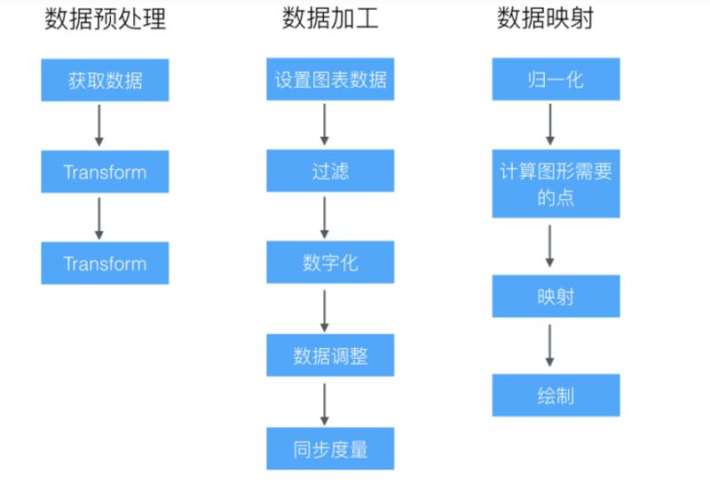

```js
//代码实现
const data = [
        { genre: 'Sports', sold: 275 },
        { genre: 'Strategy', sold: 115 },
        { genre: 'Action', sold: 120 },
        { genre: 'Shooter', sold: 350 },
        { genre: 'Other', sold: 150 }
  ]; 
  // G2 对数据源格式的要求，仅仅是 JSON 数组，数组的每个元素是一个标准 JSON 对象。
  // Step 1: 创建 Chart 对象
  const chart = new G2.Chart({
    container: 'c1', // 指定图表容器 ID
    width : 600, // 指定图表宽度
    height : 300 // 指定图表高度
  });
  // Step 2: 载入数据源
  chart.source(data);
  // Step 3：创建图形语法，绘制柱状图，由 genre 和 sold 两个属性决定图形位置，genre 映射至 x 轴，sold 映射至 y 轴
  chart.interval().position('genre*sold').color('genre')
  // Step 4: 渲染图表
```


## dataSet

负责数据处理，使得数据驱动视图, 可以包含多个dataView，每个view对应一套数据

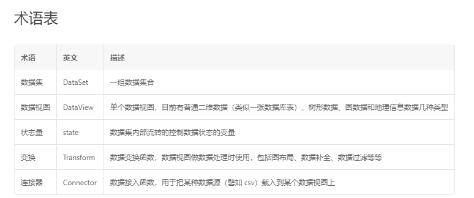

通过connector接入数据（把各种数据类型转成一定的形式），再通过transform进行过滤聚合等操作

```js
// 以下是通过state过滤数据
// step1 创建 dataset 指定状态量
const ds = new DataSet({
  state: {
    year: '2010'
  }
});
// step2 创建 DataView
const dv = ds.createView().source(data);
dv.transform({
  type: 'filter',
  callback(row) {
    return row.year === ds.state.year;
  }
});
// step3 引用 DataView
chart.source(dv);
// step4 更新状态量
ds.setState('year', '2012');
```

```js
// transform例子
const data = [
  { country: "USA", gold: 10, silver: 20 },
  { country: "Canada", gold: 7, silver: 26 }
];
const dv = ds.createView()
  .source(data)
  .transform({
    type: 'fold',
    fields: [ 'gold', 'silver' ], // 展开字段集
    key: 'key',                   // key字段
    value: 'value',               // value字段
    retains: [ 'country' ]        // 保留字段集，默认为除 fields 以外的所有字段
  });
/*
 dv.rows 变为
[
  { key: gold, value: 10, country: "USA" },
  { key: silver, value: 20, country: "USA" },
  { key: gold, value: 7, country: "Canada" },
  { key: silver, value: 26, country: "Canada" }
]
 */
```

```js
// connector例子
const testCSV = `Expt,Run,Speed
 1,1,850
 1,2,740
 1,3,900
 1,4,1070`;

const dv = new DataSet.View().source(testCSV, {
  type: 'csv'
});

console.log(dv.rows);
/*
 * dv.rows:
 * [
 *   {Expt: " 1", Run: "1", Speed: "850"}
 *   {Expt: " 1", Run: "2", Speed: "740"}
 *   {Expt: " 1", Run: "3", Speed: "900"}
 *   {Expt: " 1", Run: "4", Speed: "1070"}
 * ]
 */
```


## 度量scale

就是从数据到图形的转化，使得数据在展示的时候可以自定义
所谓的列定义，即是对度量 scale 的操作

> 列定义上的操作可以理解为直接修改数据源中的数据属性，因此它会影响坐标轴、tooltip 提示信息、图例、辅助元素 guide 以及几何标记的标签文本 label 的数据内容显示。
```js
//以下是关于数据映射scale的demo
const data = [
  { month: 0, value: 1 },
  { month: 1, value: 2 },
  { month: 2, value: 3 }
];
chart.scale('month', {
  type: 'cat', // 声明 type 字段为分类类型
  values: [ '一月', '二月', '三月' ], // 重新显示的值
  alias: '月份' // 设置属性的别名
});
// 这时候映射的month就变成了 月份：一月
// 这时坐标轴，tooltip等关于month的数据显示都改变了
```


## view

> 视图，由 Chart 生成和管理，拥有自己独立的数据源、坐标系和图层，用于异构数据的可视化以及图表组合，一个 Chart 由一个或者多个视图 View 组成。

因此 view 上的 api 同 chart 基本相同。
view绘制的图形是在chart上的，Tooltip（提示信息）和 Legend（图例）仅在 Chart 上支持，所以view共用一套tooltip和legentd, 可以进行图形的叠加展示，如果需要不同图形完全隔离开的联动展示，可以再new一个chart，然后通过state联动起来

## geom

g2对图形进行了抽象，我们通过对点，线，面操作使得可以我们可以画出各种图形

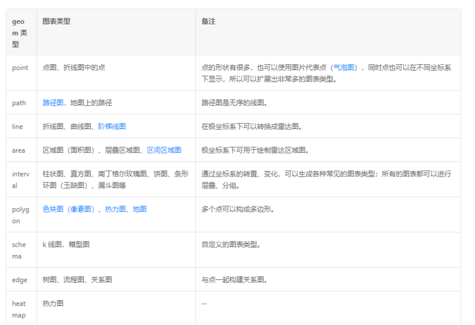

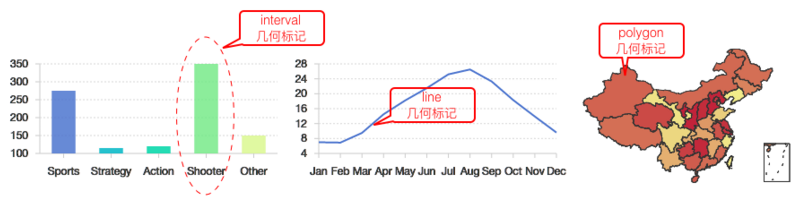

也可以自定义shape来实现图形

```js
// line画出折线图，position分别从x轴和Y轴取数据，通过city的不同画出不同的折线
chart.line().position('month*temperature').color('city');  
//size表示的是点的大小，shape为点的类型
chart.point().position('month*temperature').color('city').size(4).shape('circle').style({
    stroke: '#fff',
    lineWidth: 1
  });
```

几何标记geom对象方法主要有两种：

1. 图形属性（attr）方法：用户设置数据到视觉通道的映射，详细信息查看 图形属性
   - position
   - color
   - size
   - shape
   - opacity
2. 属性方法之外的方法
   - label（dims, [callback], cfg）集合标记上  显示文本
   - tooltip（dims）映射到tooltip的字段
   - style（cfg）配置图形的样式 详情
   - select（cfg）图形选中操作
   - active（boolean）图形激活交互开关
   - animate（cfg）图形的动画

## shape

而shape正是自定义形状，通过在Shape 上注册图形，实现自定义 Shape 的功能。
通过对点，线，面的描绘实现自定义图形

```js
const Shape = G2.Shape;
const shapeObj = Shape.registerShape('geomType', 'shapeName', { 
  getPoints(pointInfo) {
    // 获取每种 shape 绘制的关键点
  },
  draw(cfg, container) {
    // 自定义最终绘制的逻辑
  }
});
```

## coord坐标系

chart.coord('coordTpye'[, cfg]);主要就是更改坐标系，笛卡尔坐标系（直角坐标系）和 极坐标系，例如通过改成极坐标系来画饼图

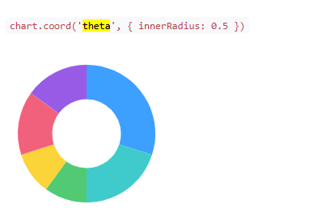

## 辅助信息

### axis坐标轴

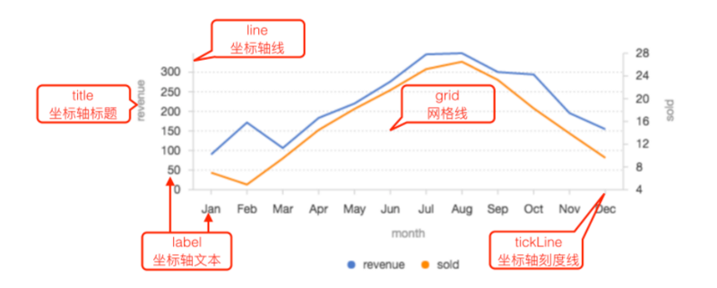

在这里，你可以进行一些针对坐标轴的操作，例如x轴显示的点的个数，坐标轴点的间距

```js
chart.axis('xField', {
  line: {
    lineWidth: 2, // 设置线的宽度
    stroke: 'red', // 设置线的颜色
    lineDash: [ 3, 3 ] // 设置虚线样式
  }
});
```

实现多Y轴的绘制非常简单，用户完全不需要做任何配置。只要做到各个 geom 的 X 轴属性相同，Y 轴属性不同，G2 就会为您自动生成。

### legend图例

```js
chart.legend({ 
  position: 'bottom', // 设置图例的显示位置
  itemGap: 20 // 图例项之间的间距
});

chart.legend('cut', false); // 不显示 cut 字段对应的图例

chart.legend('price', {
  title: null // 不展示图例 title
});

chart.legend(false); //所有的图例都不显示
```

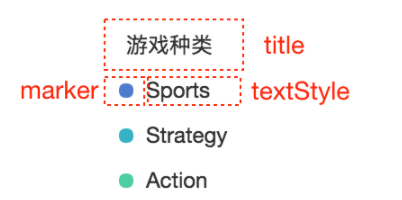

当然，也可以使用html渲染图例，只需要useHtml:true就可以了

### tooltip提示信息

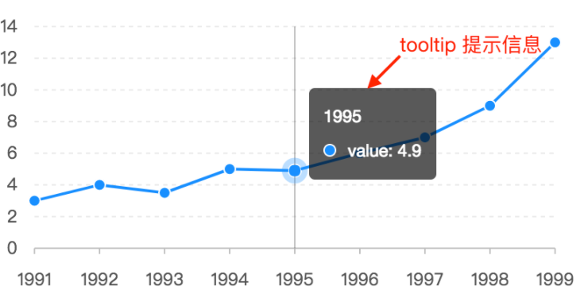

分为两种配置

*   在chart上配置
```js
chart.tooltip(true, cfg); // 开启 tooltip，并设置 tooltip 配置信息
chart.tooltip(cfg); // 省略 true, 直接设置 tooltip 配置信息
chart.tooltip(false); // 关闭 tooltip
```

*   在geom对象上配置，粒度更小
```js
chart.<geom>.tooltip('field1*field2...*fieldN');
```


支持各种自定义操作，对于复杂的场景，可以监听 chart 对象上的 tooltip:change 事件，或者通过回调进行自定义操作

### guide辅助元素

chart.guide()

可以画辅助线或者辅助图案，支持line线，image图片,html,text等内容，通过chart.guide().line({...})来使用。

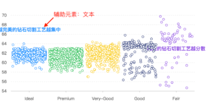

### label图形文本

label在geom上调用

```js
chart.point().position(x*y).label('x', {})
```

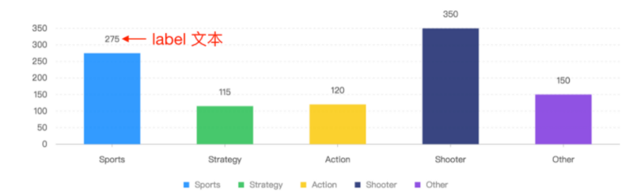

## slider

**需要额外引入**

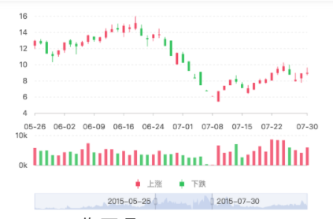

> Slider 组件是完全基于数据的交互组件，同 chart 并无任何关联，无论是你的滑动条想要操纵多少个 chart 或者 view 都没有关系。其滑动时与图表的联动行为，需要同 DataSet 中的状态量相结合，通过定义每个 Slider 对象的 onChange 回调函数，在其中动态更新 DataSet 的状态量来实现数据过滤
```js
 // !!! 创建 slider 对象
const slider = new Slider({
  container: 'slider', 
  start: '2004-01-01',
  end: '2007-09-24',
  data, // !!! 注意是原始数据，不要传入 dv
  xAxis: 'date',
  yAxis: 'aqi',
  onChange: ({ startText, endText }) => {
    // !!! 更新状态量
    ds.setState('start', startText);
    ds.setState('end', endText);
  }
});
slider.render(); 
```

## facet分面

> 分面，将一份数据按照某个维度分隔成若干子集，然后创建一个图表的矩阵，将每一个数据子集绘制到图形矩阵的窗格中。

总结起来，分面其实提供了两个功能：

1. 按照指定的维度划分数据集；

2. 对图表进行排版。

主要就是降低维度，把数据拆分开，帮助分析

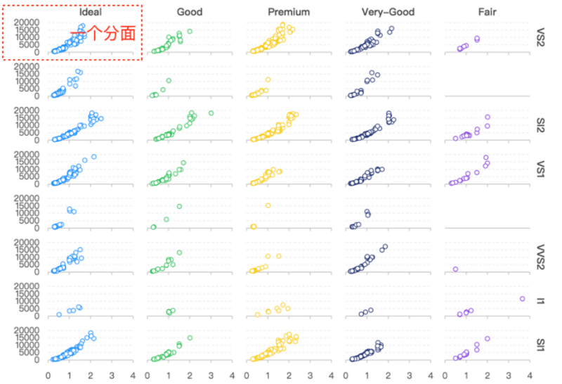

```js
chart.facet('list', {
  fileds: [ 'cut', 'carat' ],
  padding: 20 // 各个分面之间的间距，也可以是数组 [top, right, bottom, left]
});
```

## animate

可以自定义animate动画

```js
const { Animate } = G2;
/**
 * @param  {String} animationType      动画场景类型 appear enter leave update
 * @param  {String} 动画名称，用户自定义即可
 * @param  {Function} 动画执行函数
 **/
Animate.registerAnimation(animationType, animationName, animationFun);
```

## 其他封装

antv g2也提供了高层封装，BizCharts和Viser

BizCharts 地址：[https://alibaba.github.io/Biz...](https://alibaba.github.io/BizCharts/) 

Viser 地址：[https://viserjs.github.io/](https://viserjs.github.io/)

> Viser 并不是针对 React 做的适配，它是对 G2 3.0 通用的抽象。通过基于 Viser 封装，现在已经支持对 React、 Angular 和 Vue 三个常用框架的深度整合，对应的是 viser-react、viser-ng 和 viser-vue。

viser在react的使用，类似于新版的react-router，一切皆是组件

```js
export default class App extends React.Component {
  render() {
    return (
      <Chart forceFit height={400} data={data} scale={scale}>
        <Tooltip />
        <Axis />
        <Line position="year*value" />
        <Point position="year*value" shape="circle"/>
      </Chart>
    );
  }
}
```

在vue中也类似

```js
<template>
  <div>
    <v-chart :forceFit="true" :height="height" :data="data" :scale="scale">
      <v-tooltip />
      <v-axis />
      <v-line position="year*value" />
      <v-point position="year*value" shape="circle" />
    </v-chart>
  </div>
</template>

<script>
const data = [
  { year: '1991', value: 3 },
  { year: '1992', value: 4 },
  { year: '1993', value: 3.5 },
  { year: '1994', value: 5 },
  { year: '1995', value: 4.9 },
  { year: '1996', value: 6 },
  { year: '1997', value: 7 },
  { year: '1998', value: 9 },
  { year: '1999', value: 13 },
];

const scale = [{
  dataKey: 'value',
  min: 0,
},{
  dataKey: 'year',
  min: 0,
  max: 1,
}];

export default {
  data() {
    return {
      data,
      scale,
      height: 400,
    };
  }
};
</script>
```

另外，g2同样支持配置项声明的方式编写，通过编写options来

如果有错误的地方，欢迎指出，感谢收看

参考文献：
- [https://antv.alipay.com/zh-cn...](https://antv.alipay.com/zh-cn/vis/blog/g2-archi-introduce.html)
- [https://antv.alipay.com/zh-cn...](https://antv.alipay.com/zh-cn/g2/3.x/api/index.html)
- [https://segmentfault.com/a/11...](https://segmentfault.com/a/1190000009411358)