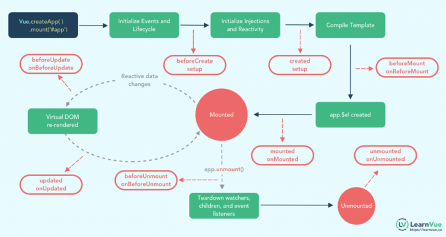

# [Vue 3 生命周期完整指南](https://my.oschina.net/u/4222124/blog/5004876)

最近开源了一个 Vue 组件，还不够完善，欢迎大家来一起完善它，也希望大家能给个 star 支持一下，谢谢各位了。

**github 地址：[https://github.com/qq44924588...](https://www.oschina.net/action/GoToLink?url=https%3A%2F%2Fgithub.com%2Fqq449245884%2Fvue-okr-tree)**

Vue2 和 Vue3 中的生命周期钩子的工作方式非常相似，我们仍然可以访问相同的钩子，也希望将它们能用于相同的场景。

如果项目使用 **选项 API**，就不必更改任何代码了，因为 Vue3 兼容以前的版本。

当然，我们用 Vue3 就是要用它的 **组合 API**，**组合 API**中访问这些钩子的方式略有不同，**组合API**在较大的Vue项目中特别有用。

本文主要内容：

1. 
   Vue生命周期钩子有哪些
2. 在**选项API**中使用 Vue 生命周期钩子
3. 在**组合API**中使用Vue 3生命周期钩子
4. 将 Vue2 的生命周期钩子代码更新到 Vue3
5. 看看Vue 2和Vue 3中的每个生命周期钩子
   1. 创建
   2. 挂载
   3. 更新
   4. 卸载
   5. 激活
6. Vue 3中的新调试钩子


### Vue生命周期钩子有哪些

首先，来看一下 选项API 和 组合 API中 Vue 3生命周期钩子的图表。在深入细节之前，这能加深我们的理解。



本质上，每个主要Vue生命周期事件被分成两个钩子，分别在事件之前和之后调用。Vue应用程序中有4个主要事件(8个主要钩子)。

- 创建 — 在组件创建时执行
- 挂载 — DOM 被挂载时执行
- 更新 — 当响应数据被修改时执行
- 销毁 — 在元素被销毁之前立即运行

### 在**选项API**中使用 Vue 生命周期钩子

使用 选项API，生命周期钩子是被暴露 Vue实例上的选项。我们不需要导入任何东西，只需要调用这个方法并为这个生命周期钩子编写代码。

例如，假设我们想访问`mounted()`和`updated()`生命周期钩子，可以这么写：

```js
// 选项 API
<script>     
   export default {         
      mounted() {             
         console.log('mounted!')         
      },         
      updated() {             
         console.log('updated!')         
      }     
   }
</script> 
```

### 在**组合API**中使用Vue 3生命周期钩子

在组合API中，我们需要将生命周期钩子导入到项目中，才能使用，这有助于保持项目的轻量性。

```
// 组合 API
import { onMounted } from 'vue'
```

除了`beforecate`和`created`(它们被`setup`方法本身所取代)，我们可以在`setup`方法中访问的API生命周期钩子有9个选项:

- `onBeforeMount` – 在挂载开始之前被调用：相关的 `render` 函数首次被调用。
- `onMounted` – 组件挂载时调用
- `onBeforeUpdate` – 数据更新时调用，发生在虚拟 DOM 打补丁之前。这里适合在更新之前访问现有的 DOM，比如手动移除已添加的事件监听器。
- `onUpdated` – 由于数据更改导致的虚拟 DOM 重新渲染和打补丁，在这之后会调用该钩子。
- onBeforeUnmount – 在卸载组件实例之前调用。在这个阶段，实例仍然是完全正常的。
- `onUnmounted` – 卸载组件实例后调用。调用此钩子时，组件实例的所有指令都被解除绑定，所有事件侦听器都被移除，所有子组件实例被卸载。
- `onActivated` – 被 `keep-alive` 缓存的组件激活时调用。
- `onDeactivated` – 被 `keep-alive` 缓存的组件停用时调用。
- `onErrorCaptured` – 当捕获一个来自子孙组件的错误时被调用。此钩子会收到三个参数：错误对象、发生错误的组件实例以及一个包含错误来源信息的字符串。此钩子可以返回 `false` 以阻止该错误继续向上传播。

使用事例：

```js
// 组合 API
<script>
import { onMounted } from 'vue'

export default {
   setup () {
     onMounted(() => {
       console.log('mounted in the composition api!')
     })
   }
}
</script>
```

### 将 Vue2 的生命周期钩子代码更新到 Vue3

这个从Vue2 到Vue3的生命周期映射是直接从[Vue 3 Composition API](https://www.oschina.net/action/GoToLink?url=https%3A%2F%2Fv3.vuejs.org%2Fguide%2Fcomposition-api-introduction.html%23watcheffect)文档中获得的:

- `beforeCreate` -> 使用 `setup()`
- `created` -> 使用 `setup()`
- `beforeMount` -> `onBeforeMount`
- `mounted` -> `onMounted`
- `beforeUpdate` -> `onBeforeUpdate`
- `updated` -> `onUpdated`
- `beforeDestroy` -> `onBeforeUnmount`
- `destroyed` -> `onUnmounted`
- `errorCaptured` -> `onErrorCaptured`

### 深入了解每个生命周期钩子

我们现在了解了两件重要的事情：

- 我们可以使用的不同的生命周期钩子
- 如何在选项API和组合API中使用它们

我们深入一下每个生命周期钩子，看看它们是如何被使用的，我们可以在每个钩子中编写特定代码，来测试在Options API和Composition API中的各自的区别。

#### beforeCreate() – 选项 API

由于**创建**的挂钩是用于初始化所有响应数据和事件的事物，因此`beforeCreate`无法访问组件的任何响应数据和事件。

以下面的代码块为例：

```js
// 选项 API
export default {
   data() { 
     return { 
       val: 'hello'    
     }
   },
   beforeCreate() {     
     console.log('Value of val is: ' + this.val)   
   }
}
```

`val`的输出值是 `undefined`，因为尚未初始化数据，我们也不能在这调用组件方法。

如果你想查看可用内容的完整列表，建议只运行`console.log(this)`来查看已初始化的内容。当使用选项API时，这做法在其他钩子中也很有用。

#### created() – 选项 API

如果我们要在组件创建时访问组件的数据和事件，可以把上面的 `beforeCreate` 用 `created`代替。

```js
// 选项API
export default {
   data() { 
     return { 
       val: 'hello'    
     }
   },
   created() {     
     console.log('Value of val is: ' + this.val)   
   }
}
```

其输出为`Value of val is: hello`，因为我们已经初始化了数据。

在处理读/写反应数据时，使用`created` 的方法很有用。 例如，要进行API调用然后存储该值，则可以在此处进行此操作。

最好在这里执行此操作，而不是在`mounted` 中执行此操作，因为它发生在Vue的同步初始化过程中，并且我们需要执行所有数据读取/写入操作。

#### 那么组合API的创建钩子呢？

对于使用 组合API 的 Vue3 生命周期钩子，使用`setup()`方法替换`beforecate`和`created`。这意味着，在这些方法中放入的任何代码现在都只在`setup`方法中。

```js
// 组合AP
import { ref } from 'vue'

export default {
   setup() {    
     const val = ref('hello') 
     console.log('Value of val is: ' + val.value)       
     return {         
       val
     }
   }
}
```


#### beforeMount() and onBeforeMount()

在组件DOM实际渲染安装之前调用。在这一步中，根元素还不存在。在选项API中，可以使用this.$els来访问。在组合API中，为了做到这一点，必须在根元素上使用`ref`。

```js
// 选项 API
export default {
   beforeMount() {
     console.log(this.$el)
   }
 }
```

组合API中使用 ref:

```vue
// 组合 API
<template>
   <div ref='root'>
     Hello World
   </div>
</template> 
<script>
import { ref, onBeforeMount } from 'vue'
export default {
   setup() {
      const root = ref(null) 
      onBeforeMount(() => {   
         console.log(root.value) 
      }) 
      return { 
         root
      }
    },
    beforeMount() {
      console.log(this.$el)
    }
 }
</script>
```

因为`app.$el`还没有创建，所以输出将是`undefined`。

#### mounted() and onMounted()

在组件的第一次渲染后调用，该元素现在可用，允许直接DOM访问

同样，在 选项API中，我们可以使用`this.$el`来访问我们的DOM，在组合API中，我们需要使用`refs`来访问Vue生命周期钩子中的DOM。

```js
import { ref, onMounted } from 'vue'
 

 export default {
   setup() {    /* 组合 API */
 
     const root = ref(null)
 
     onMounted(() => {
       console.log(root.value)
     })
 

     return {
       root
     }
   },
   mounted() { /* 选项 API */
     console.log(this.$el)
   }
 } 
```


#### beforeUpdate() and onBeforeUpdate()

数据更新时调用，发生在虚拟 DOM 打补丁之前。这里适合在更新之前访问现有的 DOM，比如手动移除已添加的事件监听器。

`beforeUpdate`对于跟踪对组件的编辑次数，甚至跟踪创建“撤消”功能的操作很有用。


#### updated() and onUpdated()

DOM更新后，`updated`的方法即会调用。

```vue
<template>
    <div>
      <p>{{val}} | edited {{ count }} times</p>
      <button @click='val = Math.random(0, 100)'>Click to Change</button>
    </div>
 </template> 
```

选项 API 方式：

```js
 export default {
   data() {
      return {
        val: 0
      }
   },
   beforeUpdate() {
      console.log("beforeUpdate() val: " + this.val)
   },
   updated() {
      console.log("updated() val: " + this.val
   }
 } 
```

组合API的方式：

```js
import { ref, onBeforeUpdate, onUpdated } from 'vue'
 
 export default {
   setup () {
     const count = ref(0)
     const val = ref(0)
 
     onBeforeUpdate(() => {
       count.value++;
       console.log("beforeUpdate");
     })
 
     onUpdated(() => {
       console.log("updated() val: " + val.value)
     })
 
     return {
       count, val
     }
   }
 }
```

这些方法很有用，但是对于更多场景，我们需要使用的`watch`方法检测这些数据更改。 `watch` 之所以好用，是因为它给出了更改后的数据的旧值和新值。

另一种选择是使用计算属性来基于元素更改状态。


#### beforeUnmount() 和 onBeforeUnmounted()

在卸载组件实例之前调用。在这个阶段，实例仍然是完全正常的。

在 选项 API中，删除事件侦听器的示例如下所示。

```js
// 选项 API
export default {
   mounted() {
     console.log('mount')
     window.addEventListener('resize', this.someMethod);
   },
   beforeUnmount() {
     console.log('unmount')
     window.removeEventListener('resize', this.someMethod);
   },
   methods: {
      someMethod() {
         // do smth
      }
   }
} 
// 组合API
import { onMounted, onBeforeUnmount } from 'vue' 

 export default {
   setup () {
 
     const someMethod = () => {
       // do smth
     }
 
     onMounted(() => {
       console.log('mount')
       window.addEventListener('resize', someMethod);
     })
 
     onBeforeUnmount(() => {
       console.log('unmount')
       window.removeEventListener('resize', someMethod);
     })
 
   }
 }
```

实际操作的一种方法是在Vite，vue-cli或任何支持热重载的开发环境中，更新代码时，某些组件将自行卸载并安装。


#### unmounted() 和 onUnmounted()

卸载组件实例后调用。调用此钩子时，组件实例的所有指令都被解除绑定，所有事件侦听器都被移除，所有子组件实例被卸载。

```js
import { onUnmounted } from 'vue'

export default {
  setup () { /* 组合 API */

    onUnmounted(() => {
      console.log('unmounted')
    })

  },
  unmounted() { /* 选项 API */
    console.log('unmounted')
  }
}
```


#### activated() and onActivated()

被` keep-alive` 缓存的组件激活时调用。

例如，如果我们使用`keep-alive`组件来管理不同的选项卡视图，每次在选项卡之间切换时，当前选项卡将运行这个 `activated` 钩子。

假设我们使用keep-alive包装器进行以下动态组件。

```vue
<template>
   <div>
     <span @click='tabName = "Tab1"'>Tab 1 </span>
     <span @click='tabName = "Tab2"'>Tab 2</span>
     <keep-alive>
       <component :is='tabName' class='tab-area'/>
     </keep-alive>
   </div>
</template>

<script>
import Tab1 from './Tab1.vue'
import Tab2 from './Tab2.vue'

import { ref } from 'vue'

export default {
  components: {
    Tab1,
    Tab2
  },
  setup () { /* 组合 API */
    const tabName = ref('Tab1')

    return {
      tabName
    }
  }
}
</script>
```

在**Tab1.vue**组件内部，我们可以像这样访问`activated`钩子。

```vue
<template>
 <div>
 <h2>Tab 1</h2>
 <input type='text' placeholder='this content will persist!'/>
 </div>
</template>

<script>
import { onActivated } from 'vue'

export default {
 setup() {
    onActivated(() => {
       console.log('Tab 1 Activated')
    })
 }
} 
</script>
```


#### deactivated() 和 onDeactivated()

被 `keep-alive` 缓存的组件停用时调用。

这个钩子在一些用例中很有用，比如当一个特定视图失去焦点时保存用户数据和触发动画。

```js
import { onActivated, onDeactivated } from 'vue'

export default {
  setup() {
    onActivated(() => {
       console.log('Tab 1 Activated')
    })

    onDeactivated(() => {
       console.log('Tab 1 Deactivated')
    })
  }
}
```

现在，当我们在选项卡之间切换时，每个动态组件的状态都将被缓存和保存。