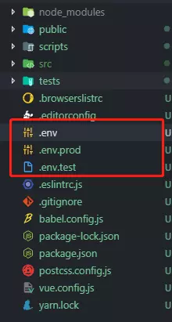
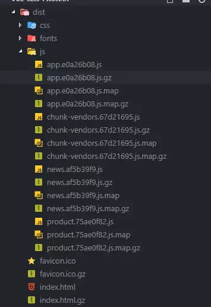
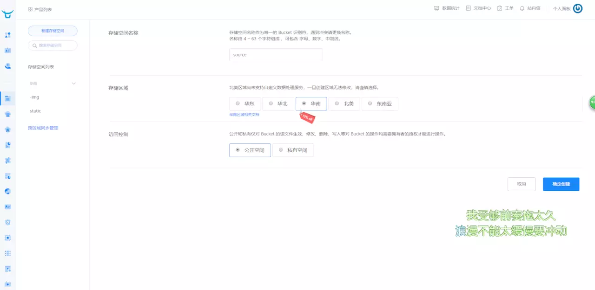
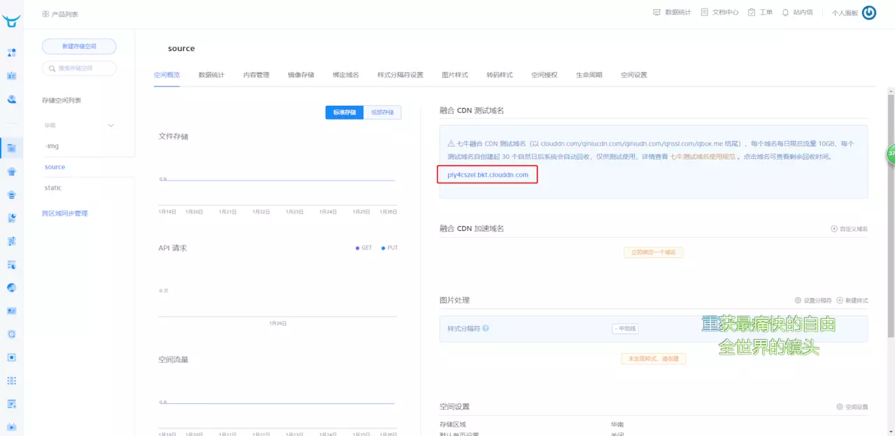
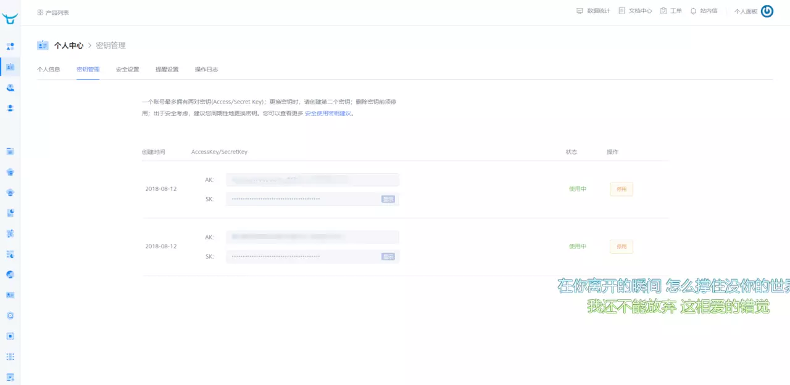

# Vue-cli3 项目从搭建优化到docker部署

> 项目地址 [vue-cli3-project](https://link.juejin.im/?target=https%3A%2F%2Fgithub.com%2Flentoo%2Fvue-cli3-project) 欢迎 star

> 原文地址 [www.ccode.live/lentoo/list…](https://link.juejin.im/?target=https%3A%2F%2Fwww.ccode.live%2Flentoo%2Flist%2F9%3Ffrom%3Dart)

## 1. 创建一个vue项目

> 相信大部分人都已经知道怎么创建项目的，可以跳过这一节，看下一节。

### 1.1 安装@vue/cli

```
# 全局安装 vue-cli脚手架
npm install -g @vue/cli
```

等待安装完成后开始下一步

### 1.2 初始化项目

```
vue create vue-cli3-project
```

1. 选择一个预设


可以选择默认预设，默认预设包含了 `babel` , `eslint` 我们选择更多功能 `Manually select features` 

回车后来到选择插件

2. 插件选择

这边选择了（Babel、Router、Vuex、Css预处理器、Linter / Formatter 格式检查、Unit测试框架）


3. 路由模式选择

是否使用 `history`模式的路由 （Yes）


4. 选择一个css预处理器 (Sass/SCSS)


5. 选择一个eslint配置

这边选择 `ESLint + Standard config`，个人比较喜欢这个代码规范


6. 选择什么时候进行 `eslint` 校验

选择（Lint on save）保存是检查

如果你正在使用的vscode编辑器的话，可以配置eslint插件进行代码自动格式化


7. 选择测试框架 （Mocha + Chai）


8. 选择将这些配置文件写入到什么地方 (In dedicated config files)


9. 是否保存这份预设配置？（y）

选是的话，下次创建一个vue项目，可以直接使用这个预设文件，而无需再进行配置。


等待依赖完成

## 2. 全局组件自动注册

在`components`目录下创建一个`global`目录，里面放置一些需要全局注册的组件。

`index.js`作用只要是引入`main.vue`，导出组件对象


在 `components` 中创建一个 `index.js` ，用来扫描全局对象并自动注册。

```javascript
// components/index.js
import Vue from 'vue'

// 自动加载 global 目录下的 .js 结尾的文件
const componentsContext = require.context('./global', true, /\.js$/)

componentsContext.keys().forEach(component => {
  const componentConfig = componentsContext(component)
  /**
  * 兼容 import export 和 require module.export 两种规范
  */
  const ctrl = componentConfig.default || componentConfig
  Vue.component(ctrl.name, ctrl)
})
```

最后在入口文件`main.js`中导入这个`index.js`中就可以了

## 3.路由自动引入

在 `Vue`项目中使用路由，相信想熟的人已经很熟悉怎么使用了，要新增一个页面的话，需要到路由配置中配置该页面的信息。

如果页面越来越多的话，那么如何让我们的路由更简洁呢？

### 3.1 拆分路由

根据不同的业务模块进行拆分路由


在每个子模块中导出一个路由配置数组


在根 `index.js`中导入所有子模块


### 3.2 自动扫描子模块路由并导入

当我们的业务越来越庞大，每次新增业务模块的时候，我们都要在路由下面新增一个子路由模块，然后在`index.js`中导入。

那么如何简化这种操作呢？

通过上面的自动扫描全局组件注册，我们也可以实现自动扫描子模块路由并导入


## 4. 通过node来生成组件

作为前端开发者，放着 `node`这么好用的东西如果不能运用起来，岂不是很浪费？

虽然我们通过上面已经实现了组件的自动注册，不过每次新建组件的时候，都要创建一个目录，然后新增一个 `.vue` 文件，然后写 `template` 、`script` 、`style` 这些东西，然后新建一个 `index.js` 、导出vue组件、虽然有插件能实现自动补全，但还是很麻烦有木有。

那么我们能不能通过`node`来帮助我们干这些事情呢？只要告诉`node`帮我生成的组件名称就行了。其它的事情让`node`来干

### 4.1 通过node来生成组件

- 安装一下`chalk`，这个插件能让我们的控制台输出语句有各种颜色区分

```
npm install chalk --save-dev
```

在根目录中创建一个 `scripts` 文件夹，

新增一个`generateComponent.js`文件，放置生成组件的代码、

新增一个`template.js`文件，放置组件模板的代码

- template.js

```javascript
// template.js
module.exports = {
  vueTemplate: compoenntName => {
    return `<template>
  <div class="${compoenntName}">
    ${compoenntName}组件
  </div>
</template>
<script>
export default {
  name: '${compoenntName}'
}
</script>
<style lang="scss" scoped>
.${compoenntName} {

}
</style>
`
  },
  entryTemplate: `import Main from './main.vue'
export default Main`
}
```

- generateComponent.js`

```javascript
// generateComponent.js`
const chalk = require('chalk')
const path = require('path')
const fs = require('fs')
const resolve = (...file) => path.resolve(__dirname, ...file)
const log = message => console.log(chalk.green(`${message}`))
const successLog = message => console.log(chalk.blue(`${message}`))
const errorLog = error => console.log(chalk.red(`${error}`))
const { vueTemplate, entryTemplate } = require('./template')

const generateFile = (path, data) => {
  if (fs.existsSync(path)) {
    errorLog(`${path}文件已存在`)
    return
  }
  return new Promise((resolve, reject) => {
    fs.writeFile(path, data, 'utf8', err => {
      if (err) {
        errorLog(err.message)
        reject(err)
      } else {
        resolve(true)
      }
    })
  })
}
log('请输入要生成的组件名称、如需生成全局组件，请加 global/ 前缀')
let componentName = ''
process.stdin.on('data', async chunk => {
  const inputName = String(chunk).trim().toString()
  /**
   * 组件目录路径
   */
  const componentDirectory = resolve('../src/components', inputName)

  /**
   * vue组件路径
   */
  const componentVueName = resolve(componentDirectory, 'main.vue')
  /**
   * 入口文件路径
   */
  const entryComponentName = resolve(componentDirectory, 'index.js')
  
  const hasComponentDirectory = fs.existsSync(componentDirectory)
  if (hasComponentDirectory) {
    errorLog(`${inputName}组件目录已存在，请重新输入`)
    return
  } else {
    log(`正在生成 component 目录 ${componentDirectory}`)
    await dotExistDirectoryCreate(componentDirectory)
    // fs.mkdirSync(componentDirectory);
  }
  try {
    if (inputName.includes('/')) {
      const inputArr = inputName.split('/')
      componentName = inputArr[inputArr.length - 1]
    } else {
      componentName = inputName
    }
    log(`正在生成 vue 文件 ${componentVueName}`)
    await generateFile(componentVueName, vueTemplate(componentName))
    log(`正在生成 entry 文件 ${entryComponentName}`)
    await generateFile(entryComponentName, entryTemplate)
    successLog('生成成功')
  } catch (e) {
    errorLog(e.message)
  }

  process.stdin.emit('end')
})
process.stdin.on('end', () => {
  log('exit')
  process.exit()
})
function dotExistDirectoryCreate (directory) {
  return new Promise((resolve) => {
    mkdirs(directory, function () {
      resolve(true)
    })
  })
}

// 递归创建目录
function mkdirs (directory, callback) {
  var exists = fs.existsSync(directory)
  if (exists) {
    callback()
  } else {
    mkdirs(path.dirname(directory), function () {
      fs.mkdirSync(directory)
      callback()
    })
  }
}
```

- 配置package.json

```
"new:comp": "node ./scripts/generateComponent"
```

- 执行

如果使用 `npm` 的话 就是 `npm run new:comp`

如果使用 `yarn` 的话 就是 `yarn new:comp`


### 4.2 通过node来生成页面组件

通过上面的逻辑代码我们可以通过`node`来生成组件了，那么也可以举一反三来生成页面组件。只需稍微修改一下生成组件代码的逻辑。 在`scripts`目录下新建一个`generateView.js`文件

```javascript
// generateView.js
const chalk = require('chalk')
const path = require('path')
const fs = require('fs')
const resolve = (...file) => path.resolve(__dirname, ...file)
const log = message => console.log(chalk.green(`${message}`))
const successLog = message => console.log(chalk.blue(`${message}`))
const errorLog = error => console.log(chalk.red(`${error}`))
const { vueTemplate } = require('./template')

const generateFile = (path, data) => {
  if (fs.existsSync(path)) {
    errorLog(`${path}文件已存在`)
    return
  }
  return new Promise((resolve, reject) => {
    fs.writeFile(path, data, 'utf8', err => {
      if (err) {
        errorLog(err.message)
        reject(err)
      } else {
        resolve(true)
      }
    })
  })
}
log('请输入要生成的页面组件名称、会生成在 views/目录下')
let componentName = ''
process.stdin.on('data', async chunk => {
  const inputName = String(chunk).trim().toString()
  /**
   * Vue页面组件路径
   */
  let componentVueName = resolve('../src/views', inputName)
  // 如果不是以 .vue 结尾的话，自动加上
  if (!componentVueName.endsWith('.vue')) {
    componentVueName += '.vue'
  }
  /**
   * vue组件目录路径
   */
  const componentDirectory = path.dirname(componentVueName)

  const hasComponentExists = fs.existsSync(componentVueName)
  if (hasComponentExists) {
    errorLog(`${inputName}页面组件已存在，请重新输入`)
    return
  } else {
    log(`正在生成 component 目录 ${componentDirectory}`)
    await dotExistDirectoryCreate(componentDirectory)
  }
  try {
    if (inputName.includes('/')) {
      const inputArr = inputName.split('/')
      componentName = inputArr[inputArr.length - 1]
    } else {
      componentName = inputName
    }
    log(`正在生成 vue 文件 ${componentVueName}`)
    await generateFile(componentVueName, vueTemplate(componentName))
    successLog('生成成功')
  } catch (e) {
    errorLog(e.message)
  }

  process.stdin.emit('end')
})
process.stdin.on('end', () => {
  log('exit')
  process.exit()
})
function dotExistDirectoryCreate (directory) {
  return new Promise((resolve) => {
    mkdirs(directory, function () {
      resolve(true)
    })
  })
}

// 递归创建目录
function mkdirs (directory, callback) {
  var exists = fs.existsSync(directory)
  if (exists) {
    callback()
  } else {
    mkdirs(path.dirname(directory), function () {
      fs.mkdirSync(directory)
      callback()
    })
  }
}
```

- 配置package.json 新增一个`scripts`脚本

```
"new:view": "node ./scripts/generateView"
```

- 执行

如果使用 `npm` 的话 就是 `npm run new:view`

如果使用 `yarn` 的话 就是 `yarn new:view`


## 5. axios封装

- 安装 axios

```javascript
npm install axios --save
// or
yarn add axios
```

### 5.1 配置不同的环境

在根目录新建三个环境变量文件



分别输入不同的地址， 比如 `dev` 就写 `dev` 的api地址、 `test` 就写 `test` 的api地址

```javascript
# // .env
NODE_ENV = "development"
BASE_URL = "https://easy-mock.com/mock/5c4c50b9888ef15de01bec2c/api"
```

接着在根目录中新建一个 `vue.config.js`

```javascript
// vue.config.js
module.exports = {
  chainWebpack: config => {
    // 这里是对环境的配置，不同环境对应不同的BASE_URL，以便axios的请求地址不同
    config.plugin('define').tap(args => {
      args[0]['process.env'].BASE_URL = JSON.stringify(process.env.BASE_URL)
      return args
    })
  }
}
```

然后在`src`目录下新建一个 `api`文件夹，创建一个 `index.js`用来配置 `axios`的配置信息

```javascript
// src/api/index.js
import axios from 'axios'
import router from '../router'
import { Message } from 'element-ui'
const service = axios.create({
  // 设置超时时间
  timeout: 60000,
  baseURL: process.env.BASE_URL
})
// post请求的时候，我们需要加上一个请求头，所以可以在这里进行一个默认的设置
// 即设置post的请求头为application/x-www-form-urlencoded;charset=UTF-8
service.defaults.headers.post['Content-Type'] = 'application/x-www-form-urlencoded;charset=UTF-8''
export default service
```

### 5.2 请求响应封装

```javascript
import axios from 'axios'
import router from '../router'
import { Message } from 'element-ui'
const service = axios.create({
  // 设置超时时间
  timeout: 60000,
  baseURL: process.env.BASE_URL
})

/**
 * 请求前拦截
 * 用于处理需要在请求前的操作
 */
service.interceptors.request.use(config => {
  const token = localStorage.getItem('token')
  if (token) {
    config.headers['Authorization'] = token
  }
  return config
}, (error) => {
  return Promise.reject(error)
})
/**
 * 请求响应拦截
 * 用于处理需要在请求返回后的操作
 */
service.interceptors.response.use(response => {
  const responseCode = response.status
  // 如果返回的状态码为200，说明接口请求成功，可以正常拿到数据
  // 否则的话抛出错误
  if (responseCode === 200) {
    return Promise.resolve(response)
  } else {
    return Promise.reject(response)
  }
}, error => {
  // 服务器返回不是 2 开头的情况，会进入这个回调
  // 可以根据后端返回的状态码进行不同的操作
  const responseCode = error.response.status
  switch (responseCode) {
    // 401：未登录
    case 401:
      // 跳转登录页
      router.replace({
        path: '/login',
        query: {
          redirect: router.currentRoute.fullPath
        }
      })
      break
    // 403: token过期
    case 403:
      // 弹出错误信息
      Message({
        type: 'error',
        message: '登录信息过期，请重新登录'
      })
      // 清除token
      localStorage.removeItem('token')
      // 跳转登录页面，并将要浏览的页面fullPath传过去，登录成功后跳转需要访问的页面
      setTimeout(() => {
        router.replace({
          path: '/login',
          query: {
            redirect: router.currentRoute.fullPath
          }
        })
      }, 1000)
      break
    // 404请求不存在
    case 404:
      Message({
        message: '网络请求不存在',
        type: 'error'
      })
      break
    // 其他错误，直接抛出错误提示
    default:
      Message({
        message: error.response.data.message,
        type: 'error'
      })
  }
  return Promise.reject(error)
})

export default service
```

`Message` 方法是 `element-ui` 提供的一个消息提示组件、大家可以根据自己的消息提示组件进行替换

### 5.3 断网处理

在响应拦截中添加处理逻辑

```javascript
service.interceptors.response.use(response => {
  const responseCode = response.status
  // 如果返回的状态码为200，说明接口请求成功，可以正常拿到数据
  // 否则的话抛出错误
  if (responseCode === 200) {
    return Promise.resolve(response.data)
  } else {
    return Promise.reject(response)
  }
}, error => {
  // 断网 或者 请求超时 状态
  if (!error.response) {
    // 请求超时状态
    if (error.message.includes('timeout')) {
      console.log('超时了')
      Message.error('请求超时，请检查网络是否连接正常')
    } else {
      // 可以展示断网组件
      console.log('断网了')
      Message.error('请求失败，请检查网络是否已连接')
    }
    return
  }
  // 省略其它代码 ······
  return Promise.reject(error)
})
```

### 5.4 封装图片上传

```javascript
// src/api/index.js
export const uploadFile = formData => {
  const res = service.request({
    method: 'post',
    url: '/upload',
    data: formData,
    headers: { 'Content-Type': 'multipart/form-data' }
  })
  return res
}
```

调用

```javascript
async uploadFile (e) {
  const file = document.getElementById('file').files[0]
  const formdata = new FormData()
  formdata.append('file', file)
  await uploadFile(formdata)
}
```

### 5.5 请求 显示 Loading 效果

```javascript
let loading = null
service.interceptors.request.use(config => {
  // 在请求先展示加载框
  loading = Loading.service({
    text: '正在加载中......'
  })
  // 省略其它代码 ······
  return config
}, (error) => {
  return Promise.reject(error)
})
service.interceptors.response.use(response => {
  // 请求响应后关闭加载框
  if (loading) {
    loading.close()
  }
 // 省略其它代码 ······
}, error => {
  // 请求响应后关闭加载框
  if (loading) {
    loading.close()
  }
  // 省略其它代码 ······    
  return Promise.reject(error)
})
```

## 6. 巧用 Mixins

### 6.1 封装 store 公用方法

假设有这样一个场景，我们通过 `vuex` 封装了获取新闻列表的 `function`

```javascript
import Vue from 'vue'
import Vuex from 'vuex'
import { getNewsList } from '../api/news'
Vue.use(Vuex)
const types = {
  NEWS_LIST: 'NEWS_LIST'
}
export default new Vuex.Store({
  state: {
    [types.NEWS_LIST]: []
  },
  mutations: {
    [types.NEWS_LIST]: (state, res) => {
      state[types.NEWS_LIST] = res
    }
  },
  actions: {
    [types.NEWS_LIST]: async ({ commit }, params) => {
      const res = await getNewsList(params)
      return commit(types.NEWS_LIST, res)
    }
  },
  getters: {
    getNewsResponse (state) {
      return state[types.NEWS_LIST]
    }
  }
})
```

然后在新闻列表页，我们通过 `mapAction`、`mapGetters`来调用`Action`和`getters` 我们需要写上这些代码

```javascript
import { mapActions, mapGetters } from 'vuex'

computed: {
    ...mapGetters(['getNewsResponse'])
},
methods: {
    ...mapActions(['NEWS_LIST'])
}
```

在假设，在另一个页面又需要重新调用获取新闻列表的接口，我们又要在写一遍上面的代码对吧？

复制粘贴就是干有木有？

如果接口突然加了一个参数，那岂不是每个要用到这个接口的代码都得加这个参数。

复制粘贴一时爽，需求一改你就爽

既然是重复的代码，我们肯定要复用，这时候`Vue`提供的`Mixin`就起了大作用了

- 封装 news-mixin.js 在 `src`下创建一个`mixins`目录，用来管理所有的mixins 新建一个`news-mixin.js`

```javascript
import { mapActions, mapGetters } from 'vuex'
export default {
  computed: {
    ...mapGetters(['getNewsResponse'])
  },
  methods: {
    ...mapActions(['NEWS_LIST'])
  }
}
```

然后在需要用到的组件中引入这个`mixin`，就能直接调用这个方法了。不管多少个页面，只要引入这个`mixin`，直接就能使用。

需求一改的话，也只需要修改这个`mixin`文件

```javascript
// news/index.vue
import Vue from 'vue'
import newsMixin from '@/mixins/news-mixin'
export default {
  name: 'news',
  mixins: [newsMixin],
  data () {
    return {}
  },
  async created () {
    await this.NEWS_LIST()
    console.log(this.getNewsResponse)
  }
}
```

### 6.2 扩展

除了封装 `vuex` 的公用方法，其实还有很多的东西也能做封装。例如：`分页对象`,`表格数据`,`公用方法`、等等就不一一举例了。可以看 [github](https://link.juejin.im/?target=https%3A%2F%2Fgithub.com%2Flentoo%2Fvue-cli3-project) 。

在多个地方经常使用，就可以考虑封装成`mixin`，不过请写好注释哦。不然就会有人在背后骂你了！！你懂的~~

## 7. 优化

### 7.1 gzip压缩

- 安装`compression-webpack-plugin`插件

```bash
npm install compression-webpack-plugin --save-dev
// or
yarn add compression-webpack-plugin --dev
```

- 在 vue.config.js 中添加配置

```js
// vue.config.js
const CompressionPlugin = require('compression-webpack-plugin')
module.exports = {
  chainWebpack: config => {
    // 这里是对环境的配置，不同环境对应不同的BASE_URL，以便axios的请求地址不同
    config.plugin('define').tap(args => {
      args[0]['process.env'].BASE_URL = JSON.stringify(process.env.BASE_URL)
      return args
    })
    if (process.env.NODE_ENV === 'production') {
      // #region 启用GZip压缩
      config
        .plugin('compression')
        .use(CompressionPlugin, {
          asset: '[path].gz[query]',
          algorithm: 'gzip',
          test: new RegExp('\\.(' + ['js', 'css'].join('|') + ')$'),
          threshold: 10240,
          minRatio: 0.8,
          cache: true
        })
        .tap(args => { })

      // #endregion
    }
  }
}
```
npm run build`后能看到生成 `.gz` 文件就OK了。如果你的服务器使用nginx的话，nginx也需要配置开启`GZIP`、下面会讲到如何在`nginx`中开启`GZIP



### 7.2 第三方库引用cdn

对于 `vue`、`vue-router`、`vuex`、`axios`和`element-ui`等等这些不经常改动的库、我们让`webpack`不对他们进行打包，通过`cdn`引入，可以减少代码的大小、也可以减少服务器的带宽，更能把这些文件缓存到客户端，客户端加载的会更快。

- 配置`vue.config.js`

```javascript
const CompressionPlugin = require('compression-webpack-plugin')
module.exports = {
  chainWebpack: config => {
      // 省略其它代码 ······
      // #region 忽略生成环境打包的文件

      var externals = {
        vue: 'Vue',
        axios: 'axios',
        'element-ui': 'ELEMENT',
        'vue-router': 'VueRouter',
        vuex: 'Vuex'
      }
      config.externals(externals)
    const cdn = {
        css: [
          // element-ui css
          '//unpkg.com/element-ui/lib/theme-chalk/index.css'
        ],
        js: [
          // vue
          '//cdn.staticfile.org/vue/2.5.22/vue.min.js',
          // vue-router
          '//cdn.staticfile.org/vue-router/3.0.2/vue-router.min.js',
          // vuex
          '//cdn.staticfile.org/vuex/3.1.0/vuex.min.js',
          // axios
          '//cdn.staticfile.org/axios/0.19.0-beta.1/axios.min.js',
          // element-ui js
          '//unpkg.com/element-ui/lib/index.js'
        ]
      }
      config.plugin('html')
        .tap(args => {
          args[0].cdn = cdn
          return args
        })
      // #endregion
    }
  }
}
```

- 修改`index.html`

```html
<!--public/index.html-->
<!DOCTYPE html>
<html lang="en">
  <head>
    <meta charset="utf-8">
    <meta http-equiv="X-UA-Compatible" content="IE=edge">
    <meta name="viewport" content="width=device-width,initial-scale=1.0">
    <link rel="icon" href="<%= BASE_URL %>favicon.ico">
    <% if (process.env.NODE_ENV === 'production') { %>

      <% for(var css of htmlWebpackPlugin.options.cdn.css) { %>
        <link href="<%=css%>" rel="preload" as="style">
        <link rel="stylesheet" href="<%=css%>" as="style">
      <% } %>
      <% for(var js of htmlWebpackPlugin.options.cdn.js) { %>
        <link href="<%=js%>" rel="preload" as="script">
        <script src="<%=js%>"></script>
      <% } %>
        
    <% } %>
    <title>vue-cli3-project</title>
  </head>
  <body>
    <noscript>
      <strong>We're sorry but vue-cli3-project doesn't work properly without JavaScript enabled. Please enable it to continue.</strong>
    </noscript>
    <div id="app"></div>
    <!-- built files will be auto injected -->
  </body>
</html>
```

### 7.3 全站cdn

我们已经把第三方库使用`cdn`替代了，那么我们`build`后生成的 `js`,`css`之类的文件能否也用`cdn`呢？

#### 申请自己的cdn域名

要想把自己的资源上传到`cdn`上，前提是得有自己的`cdn`域名，如果没有的话，可以到[七牛云官网](https://link.juejin.im/?target=https%3A%2F%2Fsso.qiniu.com%2F)上注册申请一个

1. 注册七牛云账号

2. 到七牛云对象存储模块中新建存储空间

3. 输入存储空间信息

   

4. 确定创建

5. 创建成功后会跳转到这个存储空间的控制台页面

   

6. 其中有个域名就是你的测试域名

7. 我们可以在内容管理那上传我们的`js`、`css`之类的文件、不过我们的文件那么多，一个一个上传明显不合理。要你你也不干。

这时候，这些批量又重复的操作应该由我们的`node`出马，让我们来通过 `node`来批量上传我们的资源文件

#### 将生成的js、css资源上传到七牛cdn

在七牛云官网的[文档中心](https://link.juejin.im/?target=https%3A%2F%2Fdeveloper.qiniu.com%2Fkodo)有介绍如何通过`node`上传文件、感兴趣的人可以自己去研究一下。

1. 查看`AccessKey`和`SecretKey`，在你的个人面板 -> 秘钥管理 ，这两个秘钥待会会用到



1. 安装需要的插件

```bash
npm install qiniu glob mime --save-dev
```

1. 在 `scripts`目录下创建一个 `upcdn.js` 文件

```javascript
// /scripts/upcdn.js
const qiniu = require('qiniu')
const glob = require('glob')
const mime = require('mime')
const path = require('path')

const isWindow = /^win/.test(process.platform)

let pre = path.resolve(__dirname, '../dist/') + (isWindow ? '\\' : '')

const files = glob.sync(
  `${path.join(
    __dirname,
    '../dist/**/*.?(js|css|map|png|jpg|svg|woff|woff2|ttf|eot)'
  )}`
)
pre = pre.replace(/\\/g, '/')

const options = {
  scope: 'source' // 空间对象名称 
}
var config = {
  qiniu: {
    accessKey: '',  // 个人中心 秘钥管理里的 AccessKey
    secretKey: '',  // 个人中心 秘钥管理里的 SecretKey
    bucket: options.scope,
    domain: 'http://ply4cszel.bkt.clouddn.com'
  }
}
var accessKey = config.qiniu.accessKey
var secretKey = config.qiniu.secretKey

var mac = new qiniu.auth.digest.Mac(accessKey, secretKey)
var putPolicy = new qiniu.rs.PutPolicy(options)
var uploadToken = putPolicy.uploadToken(mac)
var cf = new qiniu.conf.Config({
  zone: qiniu.zone.Zone_z2
})
var formUploader = new qiniu.form_up.FormUploader(cf)
async function uploadFileCDN (files) {
  files.map(async file => {
    const key = getFileKey(pre, file)
    try {
      await uploadFIle(key, file)
      console.log(`上传成功 key: ${key}`)
    } catch (err) {
      console.log('error', err)
    }
  })
}
async function uploadFIle (key, localFile) {
  const extname = path.extname(localFile)
  const mimeName = mime.getType(extname)
  const putExtra = new qiniu.form_up.PutExtra({ mimeType: mimeName })
  return new Promise((resolve, reject) => {
    formUploader.putFile(uploadToken, key, localFile, putExtra, function (
      respErr,
      respBody,
      respInfo
    ) {
      if (respErr) {
        reject(respErr)
      }
      resolve({ respBody, respInfo })
    })
  })
}
function getFileKey (pre, file) {
  if (file.indexOf(pre) > -1) {
    const key = file.split(pre)[1]
    return key.startsWith('/') ? key.substring(1) : key
  }
  return file
}

(async () => {
  console.time('上传文件到cdn')
  await uploadFileCDN(files)
  console.timeEnd('上传文件到cdn')
})()
```

#### 修改 publicPath

修改`vue.config.js`的配置信息，让其`publicPath`指向我们`cdn`的域名

```javascript
const IS_PROD = process.env.NODE_ENV === 'production'
const cdnDomian = 'http://ply4cszel.bkt.clouddn.com'
module.exports = {
  publicPath: IS_PROD ? cdnDomian : '/',
  // 省略其它代码 ·······
}
```

#### 修改package.json配置

修改package.json配置，使我们`build`完成后自动上传资源文件到`cdn服务器`

```
"build": "vue-cli-service build --mode prod && node ./scripts/upcdn.js",
```

#### 运行查看效果

```
npm run build
```


然后到你的 `cdn` 控制台的内容管理看看文件是否已经上传成功


## 8. docker部署

这边使用的是 `centOS7` 环境，不过使用的是不同的系统，可以参考一下其它系统的安装方法

### 8.1 安装docker

- 更新软件库

```
yum update -y
```

- 安装docker

```
yum install docker
```

- 启动docker服务

```
service docker start
```

- 安装docker-compose

```
// 安装epel源
yum install -y epel-release
// 安装docker-compose
yum install docker-compose
```

### 8.2 编写docker-compose.yaml

```yaml
version: '2.1'
services:
  nginx:
    restart: always
    image: nginx
    volumes:
      #~ /var/local/nginx/nginx.conf为本机目录, /etc/nginx为容器目录
      - /var/local/nginx/nginx.conf:/etc/nginx/nginx.conf
      #~ /var/local/app/dist 为本机 build 后的dist目录, /usr/src/app为容器目录,
      - /var/local/app/dist:/usr/src/app
    ports:
      - 80:80
    privileged: true
```

### 8.3 编写 nginx.conf 配置

```nginx
#user  nobody;

worker_processes  2;

#工作模式及连接数上线
events {
    worker_connections  1024;   #单个工作进程 处理进程的最大并发数
}

http {
    include       mime.types;
    default_type  application/octet-stream;
    #sendfile 指令指定 nginx 是否调用 sendfile 函数（zero copy 方式）来输出文件，对于普通应用，
    sendfile        on;
    #tcp_nopush     on;

    #keepalive_timeout  0;
    keepalive_timeout  65;

    # 开启GZIP
    gzip  on;

    # # 监听 80 端口，转发请求到 3000 端口
    server {
        #监听端口
        listen      80;
        #编码格式
        charset utf-8;

        # 前端静态文件资源
        location / {
	    root  /usr/src/app;
            index index.html index.htm;
            try_files $uri $uri/ @rewrites;
        }
        # 配置如果匹配不到资源，将url指向 index.html， 在 vue-router 的 history 模式下使用，就不会显示404
        location @rewrites {
            rewrite ^(.*)$ /index.html last;
        }
        error_page   500 502 503 504  /50x.html;
        location = /50x.html {
            root   html;
        }
    }
}
```

### 8.4 执行 docker-compose

```
docker-compose -d up
```


### 8.5 docker + jenkins 自动化部署

使用`docker` + `jenkins` 能实现代码提交到github后自动部署环境、这个要讲起来内容太多，有兴趣的可以看我这一篇文章

[从零搭建docker+jenkins+node.js自动化部署环境](https://juejin.im/post/5b8ddb70e51d45389153f288)

## 6. 扩展

- [使用pm2自动化部署node项目](https://juejin.im/post/5b823506e51d4538d517662f)
- [通过vue-cli3构建一个SSR应用程序](https://juejin.im/post/5b98e5875188255c8320f88a)

> 项目地址 [vue-cli3-project](https://link.juejin.im/?target=https%3A%2F%2Fgithub.com%2Flentoo%2Fvue-cli3-project) 欢迎 star

> 原文地址 [www.ccode.live/lentoo/list…](https://link.juejin.im/?target=https%3A%2F%2Fwww.ccode.live%2Flentoo%2Flist%2F9%3Ffrom%3Dart)