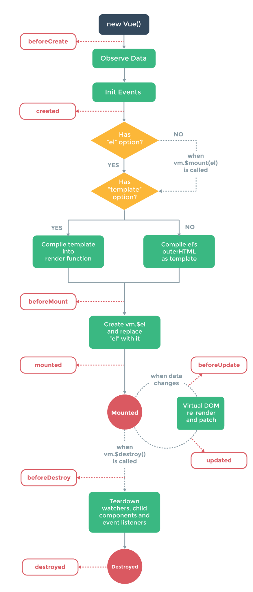

# Vuejs建议和最佳实践

### 还是个Vue新手？没怎么开始学？

如果你完全是个Vue新手，那么这篇文章很可能不会给你带来太多益处，因为你得有些Vue的基础才能理解文中所说的。如果你还没学会vue，建议你看看我们的这个课程[《Laravel&Vue深度整合实战第二版》](https://study.163.com/course/courseMain.htm?courseId=1003227034&share=2&shareId=1018568251)，可以让你从完全的vue零基础，成长为能满足日常开发大部分需要的vue高手，既有vue相关的初中高级知识，还有vue和laravel结合的方式，期间我们开发了多个实战效果案例。

话不多说，看看有哪些建议吧~

### （一）安装上VueDevtools

可以说，搞Vue开发，没有VueDevtools是不可行的。它是个火狐和chrome浏览器里的扩展，装了它，就可以给你的vue开发带来不尽的便利，不多说，用这个链接去装吧~[//github.com/vuejs/vue-devtools](https://github.com/vuejs/vue-devtools)

这个的使用，我们在课程[《Laravel&Vue深度整合实战第二版》](https://study.163.com/course/courseMain.htm?courseId=1003227034&share=2&shareId=1018568251)已经演示和说了。

### （二）安装上VuePerformanceDevtool（vue性能开发工具）

这个Chrome扩展可以让你检测vue组件的性能，也是一个非常有用的工具，可以通过这个链接安装：[//chrome.google.com/webstore/detail/vue-performance-devtool/koljilikekcjfeecjefimopfffhkjbne](https://chrome.google.com/webstore/detail/vue-performance-devtool/koljilikekcjfeecjefimopfffhkjbne)

安装好了，你得在代码里加上这么一句，才能启用它：

```
Vue.config.performance = true;
```

记得要将其加在new Vue实例之前，当然了，这样的话，你生产环境上也就开启这个工具了，这往往不是我们想要的，你可以基于环境监测来决定是否开启这个，可以用下面的代码实现：

```
Vue.config.performance = process.env.NODE_ENV !== 'production'
```

### （三）组件间通信

vue里面组件间的通信有好几种形式。你可以使用props从上到下地往组件里传递数据，这是一种单向的沟通：

```
<my-component :firstProp="someValue"></my-component>
```

如果你想着在子组件里通知父组件，告诉它某些事情发生了，或某个值发生了变化，可以用子组件发送事件的方式：

```
...
export default {
    methods: {
        onClick() {
            this.$emit('nameOfEvent', someValue);
        }
    }
}
```

然后你就可以在父级组件里，对这个事件的发生做相应监听和处理：

```
<my-component :firstProp="someValue" @nameOfEvent=”doSomething”></my-component>
```

这里的$emit(）发送事件的方法，只能用在parent/child，也即父级和子级组件之间的通信。

如果你想着实现更复杂的组件间通信，比如两个子级组件之间，不通过父级，如何实现通信呢？这个时候你就可以使用EventBus或者Vuex。EventBus在小中型的应用里，基本上就够用了，如果你并没有特别复杂的组件间状态管理的话。关于EventBus，可以看看之前我们给大家写的文章：[《使用Vue.js创建全局事件总线（Global Event Bus ）》](https://www.pilishen.com/posts/creating-a-global-event-bus-with-vuejs)

当然了，不论是props属性传递，还是父子组件事件监听，还是EventBus复杂通信处理，这些呢，在我们的课程[《Laravel&Vue深度整合实战第二版》](https://study.163.com/course/courseMain.htm?courseId=1003227034&share=2&shareId=1018568251)也都给大家讲解和演示了。

### （四）使用VueX来做复杂的状态管理

我们说过EventBus模式处理小中型项目够用了，因为它简单直接，但如果你确定要做一个大中型的项目，你的前端应用里有较多数据处理，有很多贯穿整个应用的状态需要共享或处理，那么这个时候，就一般要使用VueX了。

学习和使用VueX的建议：

- 去学一下VueX里的state, getters, mutations and actions这些分别是啥
- 研究一下Vuex modules，建议如果用VueX，就最好上来就用上VueX modules，如果你觉得VueX modules繁琐、不值得，那么可能你的应用也没复杂到非得用VueX的地步
- 学一下如何创建出好的结构，因为VueX默认并没有给你任何限制
- 学一下“strict”模式是如何运作的
- 可以多参考一下这个Vuex Cheatsheet ：[//github.com/vuejs-tips/vuex-cheatsheet](https://github.com/vuejs-tips/vuex-cheatsheet)

### （五）代码切割效果

现如今，性能是个热门话题，随着你应用越来越大、越来越复杂，我们得让其越快越好。尽可能地实现代码切割效果，这样可以极大减小你主要的bundle或app文件的体积，因而能提高你应用的初始化时间。

```
const Loader = () => import(/* webpackChunkName: "aChunkName" */'../path/to/component.vue');
```

可以像这样来动态引入你的组件，需要的时候再去加载，而不是一下子都加载上，关于代码切割的具体实现及原理，可以看我们[《Laravel&Vue深度整合实战第二版》](https://study.163.com/course/courseMain.htm?courseId=1003227034&share=2&shareId=1018568251)这个课程的扩展文章，也即[《在Laravel Mix里使用动态引入来实现Code Splitting效果》](https://www.pilishen.com/posts/using-dynamic-imports-with-laravel-mix)

### （六）组件注册的简单方式

传统上，我们喜欢这样来注册vue组件：

```
import MyAwesomeComponent from './my-awesome-component.vue';
...
components: {
    'my-awesome-component': MyAwesomeComponent
}
```

这没啥错，但你也可以更简洁一些：

```
...
components: {
    MyAwesomeComponent,
    MyAwesomeComponentTwo,
    MyAwesomeComponentThree
}
```

### （七）避免将所有组件都注册为全局组件

只有一些基本的组件，你在应用里到处用到，才应该被注册为全局组件，比如说一些`Buttons/Inputs`组件。

特定功能的组件，可以引入到其他的组件里，同时可以的话用上动态引入，这样可以让你的bundle文件小一些，性能更好一些，这块可以多参考前面的代码切割建议和文章。

### （八）验证props属性

当往一个组件里传参时，你最好是立马就进行一些验证，如果没有验证，没有声明一个props应该是个什么类型(String, Array, Object……)，那么尤其是你团队里其他调用你组件的人，他们就不知道该传个啥了，包括你自己，当数据类型发生变化或错误时，你也没有个很好的错误提示了。

这一点在我们[《Laravel&Vue深度整合实战第二版》](https://study.163.com/course/courseMain.htm?courseId=1003227034&share=2&shareId=1018568251)课程里，也给大家重点强调和演示了。

### （九）VueRouter

如果你是要做个单页应用（spa），纯前端逻辑的话，那么很可能你会需要用到客户端方面的路由，需要在不同组件之间跳来跳去，这个时候就可以用上VueRouter，它是vue官方的路由组件。

用起来很简单，官方文档在这里//router.vuejs.org/

### （十）url变了，但视图没有更新

当在一个SPA里时，你很可能会想着在视图里重复利用一些组件。假设你现在在一个博客文章页面上，然后你想从那个页面跳到另一篇文章上，你会期望相应的内容也改成新的文章的内容，但它却没有变化。

这往往是复用同一个组件的结果，vue还是用了之前的一个实例，这时候组件里`this.$route`是变了，但是相应的那些生命周期事件，比如created(), beforeMounted() 和 mounted()，它们就没有被重新触发。

这个问题，一般有两种解决办法：

要强制vue创建一个新的组件实例，可以在`<router-view>`设置一个unique key：

```
<router-view :key="$route.fullPath">
```

或者你也可以设置个watch函数，当route路由变了的时候，就触发相应逻辑：

```
watch: {
    "$route.params.somevalue": {
        handler(somevalue) {
            // do stuff
        },
        immediate: true
    }
}
```

### （十一）表单数据验证

当前端有表单时，我们可能会想着在前台页面直接加上验证，这样可以免去非得先往后端验证一下，当然这不是说你后端就不验证了，双重的验证仍是必要的，只是这样可以让前端体验更好更直接一些。

当然了，你没必要自己去处理前端验证的提示和逻辑，已经有这方面很好的组件了，可以试试 [Vuelidate](https://github.com/vuelidate/vuelidate) 或 [VeeValidate](https://baianat.github.io/vee-validate/)，两个都不错，都可以帮你节省不少时间

### （十二）好好理解一下vue的生命周期

要想真正发挥出vue的强大，就极其建议你好好理解vue的生命周期。

比方说，如果你想在beforeCreated()下去获取data里的一个值，那么就肯定获取不到；或者，你想在created()里去获取一个ref元素，那么你也获取不到，因为这个时候还没有加载DOM元素呢。

关于vue的生命周期，我们在[《Laravel&Vue深度整合实战第二版》](https://study.163.com/course/courseMain.htm?courseId=1003227034&share=2&shareId=1018568251)里也做了重点讲解，重点阐释和演示了日常开发中的几个最重要的周期函数，当然如果你想了解所有的周期，可以看看下面这个完整的图：



### （十三）避免直接修改DOM

使用Vue的一个首要原则就是，你不能直接去操作和修改DOM元素，这也是我们用一个像Vue这样的前端框架的目的，就不再像原生js或jquery里那样了。

当然了，你可以用$refs来进行相关操作，这是更简洁更符合vue的方式的做法，这样也更容易日后维护，因为这样你就不需要依赖有着某个特定class或id的元素了。

当然了，这一点，在我们[《Laravel&Vue深度整合实战第二版》](https://study.163.com/course/courseMain.htm?courseId=1003227034&share=2&shareId=1018568251)也有详细演示。

### （十四）进行数据交互

开发中，难免我们需要跟一些外部的服务沟通，来获取或发送数据，比如我们的后端API。

那么最简单的，你可以用浏览器自带的fetch()方法来获取数据，当然这个不一定所有浏览器都支持。

此外呢，建议使用`axios`组件来做各种数据访问和交互，它在vue和react社区里极其受欢迎，这一点，我们[《Laravel&Vue深度整合实战第二版》](https://study.163.com/course/courseMain.htm?courseId=1003227034&share=2&shareId=1018568251)也都详细演示了如何用axios向后台发送get、post、patch、delete等请求。

### （十五）列表遍历

vue里面可以用v-for很方便地进行列表遍历：

```
<div v-for="item in items" v-bind:key="item.id">
   <!-- content --> 
</div>
```

当你的v-for是用来循环输出一个简单的array时，其中的`:key`是可以不用指定的，但当你的v-for是用在一个组件上时，也即循环输出某个组件的内容和逻辑时，就必须得加上`:key`，这样的话，当你列出来的某一个组件逻辑发生变化时，vue才知道到底要去更新列表里的哪一个，所以这个`:key`就相当于是列表元素的一个辨识符。当然了，你也可以不管v-for的逻辑是否复杂，是否是用在子组件上，你默认都带上`:key`。

### （十六）计算属性和方法

当你想对vue实例里已有的data数据进行进一步处理时，就可以用计算属性，它的另一个好处是性能有保证，因为计算属性的结果是会被缓存的，只要它所依赖的数据不变，它 就不用来回去计算，不用每次都计算一下。

```
data:{
    names: ["Leonardo", "Donatello", "Rafael", "Michaelangelo"]
},
computed:{
	//返回名字以D开头的球星
    startsWithD(){
        return this.names.filter(name => name.startsWith("D"))
    }
}

<p v-for="(name, index) in startsWithD" :key="index"></p>
```

如果你有个很复杂的计算属性，那么最好的做法时，将其拆分成多个简单的计算属性，这样更容易测试、维护和阅读。

而一个方法，可以理解成是绑定到vue实例上的一个函数，它只有当你明确调用它的时候才执行，就跟一个普通的js或PHP里的方法一样。

```
methods:{
    startWithCharacter(char){
        return this.names.filter(name => name.startsWith(char))
    }
}
```

关于方法与计算属性的差别，什么时候该用计算属性，什么时候该用方法，这个我们在[《Laravel&Vue深度整合实战第二版》](https://study.163.com/course/courseMain.htm?courseId=1003227034&share=2&shareId=1018568251)里有更详细的阐释和使用。

### （十七）学习和使用mixins

当我们开发应用时，经常会遇到一些功能和逻辑，需要在不同的组件间多次使用，比如同样的方法逻辑，两个组件都要用到，但我们又不想也不应该完全复制两遍，这个时候就该用mixins了。

这意味着，如果我创建了一个组件，它有X个不同的方法、周期逻辑、本地的状态等，我想复用它们，我就可以创建个mixins，让其他的组件扩展这个mixins，就可以在这些新的组件里使用原本它们没有的方法了。

关于mixins的更多信息，可以看看官方文档：[//vuejs.org/v2/guide/mixins.html](https://vuejs.org/v2/guide/mixins.html)

### （十八）用上vue自带的修饰符

在不同的场景下，vue有一系列不同的修饰符可以用，建议大家可以大概看看，在一些场景下用起来还是比较方便的。

这里呢，并不对它们具体展开，因为都比较简单，大家可以直接看文档即可。

表单修饰符（[//cn.vuejs.org/v2/guide/forms.html#%E4%BF%AE%E9%A5%B0%E7%AC%A6](https://cn.vuejs.org/v2/guide/forms.html#修饰符)）

- .lazy
- .number
- .trim

事件修饰符（[//cn.vuejs.org/v2/guide/events.html#%E4%BA%8B%E4%BB%B6%E4%BF%AE%E9%A5%B0%E7%AC%A6](https://cn.vuejs.org/v2/guide/events.html#事件修饰符)）

原本我们经常需要用`event.preventDefault()`来阻止提交按钮或点击事件的默认动作，但是有了vue的事件修饰符，我们就可以在绑定事件时加上个`.stop`来阻止单击事件继续传递，用`.prevent`来阻止表单提交的默认刷新，非常方便，当然还有更多类似的。

- .stop
- .prevent
- .capture
- .self
- .once
- .passive

按键修饰符，可以很方便地监听一些按键事件，文档地址跟上面的事件修饰符是一个

- .enter
- .tab
- .delete (捕获“删除”和“退格”键)
- .esc
- .space
- .up
- .down
- .left
- .right

### （十九）好的系统布局和架构

Vue没有给你提供任何默认的系统布局或架构，除非比如说你用Nuxt之类的基于Vue的框架。

所以怎么组织你的应用结构，就取决于你自己了，取决于你的团队了，你们怎么样协商出一个好的、易于理解的应用结构，让所有的团队成员能更好地开展协作。

如果你是个私人的小项目，你可能不需要太在意这点，但如果你们是一个大中型的团队项目，那么这一点，将对你们极其重要，一个好的、有意义的系统结构，可以让你们的日常开发事半功倍、相互不牵扯。

这一点上，可以多借鉴后端应用和框架的通行做法，比如模块化，将原本单个的、相互牵扯的应用，开发成一个一个独立的模块，各个模块间相互不影响，只通过有限的途径进行沟通；也可以借鉴后端比较流行的微服务架构，将原本一个庞大的系统，拆分成多个微服务，它们完全独立、不相干，甚至不同的部分都可以用不同的语言、不同的框架。这些做法或趋势，也正在被逐步实践到前端框架和项目当中，在大型项目开始前，能将这个设计好，将会为你们的开发奠定良好长远的基础。

### （二十）做好必要的清理工作

当你在开发一个SPA应用时，如果你不留意去移除一些自定义的事件、实例、intervals等，就可能导致应用的内存占用越来越多，最终变得缓慢甚至无法响应。

可以是像类似这个样子：

```
created() {
  refreshUserLoginTokenInterval(); //开启一个interval来刷新token
},
beforeDestroy () {
  destroyUserLoginInterval(); //在组件销毁前，要记得移除这个interval
}
```

### （二十一）往一个元素上添加多个class

添加一个class是很简单的：

```
//当isError是true时，就加上red这个class
<div :class=”{'red': isError}”></div>
```

但是怎么样添加多个class呢？其实也很简单

```
// 相应属性为true时，就添加相应class
<div :class="{'red': isError, 'text-bold': isActive }”></div>
```

当然了，当添加多个class时，你也可以使用计算属性来实现。

### （二十二）结语

当然了，vue相关的建议和好的实践，真要写下去，可能永远写不完，这只是一些相对重要的、日常中经常遇到的一些建议。

如果你还没有开始学习vue，或者还是一个vue新手，或者看了很多资料，就是感觉不得vue的章法，那么极其建议你入手我们[《Laravel&Vue深度整合实战第二版》](https://study.163.com/course/courseMain.htm?courseId=1003227034&share=2&shareId=1018568251)这一课程，可以看到，这些最佳建议的大部分，我们课程里都已经重点讲解和演示了，不管你是零基础，还是稍微有点基础，用我们这个课程都可以让你最短时间里最好地掌握vue，让vue成为你日常开发中爱不释手的技术栈。