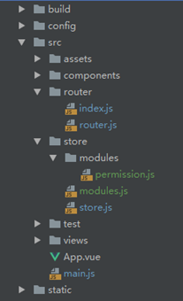

# Vue权限管理实现流程

## 一、整体思路

后端返回用户权限，前端根据用户权限处理得到左侧菜单；所有路由在前端定义好，根据后端返回的用户权限筛选出需要挂载的路由，然后使用 addRoutes 动态挂载路由。

## 二、实现要点

（1）路由定义，分为初始路由和动态路由，一般来说初始路由只有 login，其他路由都挂载在 home 路由之下需要动态挂载。
（2）用户登录，登录成功之后得到 token，保存在 sessionStorage，跳转到 home，此时会进入路由拦截根据 token 获取用户权限列表。
（3）全局路由拦截，根据当前用户有没有 token 和 权限列表进行相应的判断和跳转，当没有 token 时跳到 login，当有 token 而没有权限列表时去发请求获取权限等等逻辑。
（4）处理用户权限，在 store.js 定义一个模块 permission.js，专门用于处理用户权限相关的逻辑，用户权限列表、菜单列表都保存在此模块；
（5）用户权限列表、菜单列表的处理，前端的路由要和后端返回的权限有一个唯一标识（一般用路由名做标识符），根据此标识筛选出对应的路由。
（6）左侧菜单，要和用户信息、用户管理模块使用的菜单信息一致，统一使用保存在 store 中的变量。

## 三、具体实现流程

### 1、准备工作，路由定义

```
/* router/index.js */
/* 初始路由 */
let router = new Router({
    mode: 'history',
    routes: [
        {
            path: '/login',
            name: 'login',
            component: () => import('@/views/login.vue'),
        },
    ]
});
/* router/index.js */
/* 准备动态添加的路由 */
export const dynamicRoutes = [
    {
        path: '/',
        name: 'home',
        component: () => import('@/views/home.vue'),
        meta: {
            requiresAuth: true,
        },
        children: [
            // 用户信息
            {
                path: '/user-info',
                name: 'user-info',
                component: () => import('@/views/user-setting/user-info.vue'),
            },
            // 修改密码
            {
                path: '/user-password',
                name: 'user-password',
                component: () => import('@/views/user-setting/user-password.vue'),
            },
        ]
    },
    {
        path: '/403',
        component: () => import('@/views/error-page/403'),
    },
    {
        path: '*',
        component: () => import('@/views/error-page/404'),
    },
];
```

系统主要页面的路由，后续会将这些路由经过权限筛选，添加到 home 路由的 children 里面

```
/* router/router.js */
export default [
    // 部署管理
    {
        path: '/deploy-manage',
        name: 'deploy-manage',
        component: () => import('@/views/sys-admin/deploy-manage/deploy-manage.vue'),
        meta: {
            permitName: 'deploy-manage',
        }
    },
    // ...
];
```

### 2、用户登录

用户进入登录页，输入用户名、密码、验证码，点击登录，发送登录请求，登录成功之后，将 token 保存在 sessionStorage，然后跳转到首页 /home ，进入路由拦截的逻辑。

```
/* login.vue */
// 发送登录请求
vm.$http.login(params, data => {
    sessionStorage.token = data.token;
    // ...

    // 跳转到首页 home。这里会触发全局路由拦截 router.beforeEach
    vm.$router.push({ name: 'home' });
}, err => {
    console.log(err);
});
```

### 3、全局路由拦截

首先从打开本地服务 [http://localhost](http://localhost/):2001 开始，打开后会进入 login 页面，那么判断的依据是什么？
首先是 token。没有登录的用户是拿不到 token 的，而登录后的用户我们会将 token 存到 seesionStorage，因此，根据当前有没有 token 即可知道是否登录。

```
/* router/index.js */
/* 全局路由拦截 */
router.beforeEach((to, from, next) => {
    // 根据有没有token判断是否登录
    if (!sessionStorage.token) {
        // 1、当用户打开localhost，to.matched === []，匹配的是空路由，此时需要重定向到login
        // 2、重定向到login之后，to.matched === [name: "login", path: "/login"...] 就是上一步的login页面
        // to.matched.some(item => item.meta.requiresAuth) 这句的意思是 进入的路由页需要登录认证，取反就是不用登录，直接通过
        if (to.matched.length > 0 && !to.matched.some(item => item.meta.requiresAuth)) {
            next(); // 跳过，进入下一个导航钩子。比如：在 /login 路由页刷新页面会走到此逻辑
        } else {
            next({ path: '/login' });
        }
    } else {
        // 现在有token了
        if (!store.state.permission.permissionList) {
            // 如果没有 permissionList，发请求获取用户权限列表
            store.dispatch('permission/FETCH_PERMISSION').then(() => {
                next({ path: to.path, query: to.query });
            });
        } else {
            // 现在有 permissionList 了
            if (to.path !== '/login') {
                if (to.matched.length === 0) {
                    // 如果匹配到的路由形如 https://172.24.1.117/?id=xxx&name=xxx，表明是关联跳转时没有权限，跳转到403
                    next({ path: '/403' });
                } else if (queryChange) {
                    // 跳转之前将路由中查询字符串为空的过滤掉，如 xxx.com?page=&size= 这种
                    next({ name: to.name, params: to.params, query: to.query });
                } else if (sessionStorage.isSysLock === 'true' && to.path !== '/sys-lock') {
                    next({ path: '/sys-lock' });
                } else {
                    next();
                }
            } else {
                // 1.如果用户手动在地址栏输入 /login，重定向到之前的路由页
                // next(from.fullPath);

                // 2.如果用户手动在地址栏输入 /login，清除token并刷新页面，就会去到登录页
                store.commit('goToLogin');
            }
        }
    }
});
```

（1）当用户打开 localhost，此时还没有 token，匹配的是空路由，我们重定向到登录页 `next({ path: '/login' });`
（2）用户在登录页刷新页面，也会进入路由拦截，此时匹配的是 login 路由，而 login 路由是不需要登录验证的（requiresAuth 为空或者 false），所以直接跳过执行 `next();`
（3）用户在登录页输入了用户名和密码，登录成功，保存了 token，跳转到 /home 路由；
（4）此时进入路由拦截，已经有 token了，但是还没有用户权限 permissionList，然后发请求获取用户权限列表，得到权限后 `next({ path: to.path, query: to.query });` 继续往下走；
（5）再次进入路由拦截，此时有 token 和 permissionList 了，就可以根据实际业务进行跳转了。上面的代码是判断当前是不是 login 路由，如果用户登录后手动在地址栏输入 /login，则清除 token 跳转到登录页。其他的逻辑就跟具体业务相关了，就不细讲了。

### 4、处理用户权限

处理用户权限，在 store.js 定义一个模块 permission.js，专门用于处理用户权限相关的逻辑，用户权限列表、菜单列表都保存在此模块；
来看看 permission.js 主要做了什么：

```
/* permission.js */
/* 由于权限这块逻辑很多，所以在vuex添加了一个permission模块来处理权限相关的逻辑和变量 */
import httpRequest from '@/assets/js/service/http'; // http请求
import handleModule from '@/assets/js/common/handle-module'; // 处理路由、侧边栏的公共函数
import router, { dynamicRoutes } from '@/router/index'; // 默认路由配置，动态路由配置
import permissionRouter from '@/router/router'; // 需要权限的路由配置
// ...
export default {
    // ...
    actions: {
        async FETCH_PERMISSION({ commit, state }) {
            // 初始化路由表，注意这里必须写，router.beforeEach 路由拦截时，多次执行 FETCH_PERMISSION
            commit('setPermission', []);

            // 发请求获取后端返回的用户权限
            let data = await getUserByToken();
            let userPopedoms = data.userPopedoms || [];

            // 保存用户的权限模块（去除掉用户管理和登录），用户管理模块可以使用，权限列表
            let userPopeList = userPopedoms.filter(v => v.requestMapping !== 'user-manage' && v.requestMapping !== 'login');
            commit('setUserPopedoms', userPopeList);

            // 根据权限筛选出我们设置好的路由并加入到 path='/' 的children，就是home路由的children下
            let routes = handleModule.getRouter(userPopedoms, permissionRouter);
            let homeContainer = dynamicRoutes.find(v => v.path === '/');

            // 使用concat的目的是让 分配给用户的权限处于 children 的第0项
            homeContainer.children = routes.concat(homeContainer.children);
            // 设置首页重定向，重定向到用户权限的第0项
            homeContainer.redirect = homeContainer.children[0].name;

            // 根据权限生成左侧导航菜单
            let sidebarMenu = handleModule.getSidebarMenu(userPopeList);
            commit('setMenu', sidebarMenu);

            // 初始路由
            let initialRoutes = router.options.routes;
            // 动态添加路由。只有刷新页面才会清空动态添加的路由信息
            router.addRoutes(dynamicRoutes);
            // 完整的路由表
            commit('setPermission', [...initialRoutes, ...dynamicRoutes]);
        }
    },
};
```

（1）首先，`let data = await getUserByToken();` 发请求获取用户权限，得到 data，data.userPopedoms 格式大致如下：

```
[
  {
    "moduleGroupId": 1001,
    "moduleGroupName": "部署管理",
    "requestMapping": "deploy-manage",
  },
  {
    "moduleGroupId": 1100,
    "moduleGroupName": "系统管理",
    "requestMapping": "sys-manage",
    "moduleList": [
      {
        "moduleId": 1101,
        "moduleName": "系统日志",
        "requestMapping": "system-log",
        "moduleGroupId": 1100,
      },
      {
        "moduleId": 1102,
        "moduleName": "系统告警",
        "requestMapping": "sys-alert",
        "moduleGroupId": 1100,
      },
    ],
  }
]
```

（2）然后，根据我们写好的路由数组，进行对比，过滤得到我们要的路由。路由格式在上文“路由定义”的 router/router.js 已经提到。还要根据用户权限处理得到侧边栏菜单。

为此，我们需要两个处理函数，一个根据用户权限列表和路由数组过滤得到最终路由，另一个根据用户权限处理得到侧边栏菜单。所以另外专门创建了一个文件 handle-module.js 存放这两个函数。

```
/* handle-module.js */
const handleModule = {
    /**
     * 根据后台返回的权限，以及配置好的所有路由，过滤出真实路由
     * @param  {Array} permissionList 后台返回的用户权限列表
     * @param  {Array} allRouter  前端配置好的所有动态路由的集合
     * @return {Array} 过滤后的路由
     */
    getRouter(permissionList = [], allRouter = []) {
        // permissions 的格式为 ["deploy-manage", "system-log"]
        let permissions = permissionList.reduce((acc, cur) => {
            if (cur.moduleList && cur.moduleList.length > 0) cur = cur.moduleList;
            return acc.concat(cur);
        }, []).map(v => v.requestMapping);

        return allRouter.filter(item => permissions.includes(item.meta.permitName));
    },

    /**
     * 根据后台返回的权限，生成侧边栏
     * @param  {Array} permissionList  后台返回的用户权限列表
     * @return {Array} sidebarMenu  生成的侧边栏数组
     */
    getSidebarMenu(permissionList = []) {
        let sidebarMenu = [];
        permissionList.forEach(item => {
            let menuItem = {
                name: item.requestMapping,
                title: item.moduleGroupName,
            };
            menuItem.children = (item.moduleList || []).map(child => ({
                name: child.requestMapping,
                title: child.moduleName,
            }));
            sidebarMenu.push(menuItem);
        });

        return sidebarMenu;
    }
};
export default handleModule;
```

（3）上面得到过滤后的路由数组后，加入到 path 为 '/' 的 children 下面

```
/* router/index.js */
{
        path: '/',
        name: 'home',
        component: () => import('@/views/home.vue'),
        meta: {
            requiresAuth: true,
        },
        children: [
            /* 将上面得到的路由加入到这里 */
            // 用户信息
            {
                path: '/user-info',
                name: 'user-info',
                component: () => import('@/views/user-setting/user-info.vue'),
            },
        ]
}
```

（4）上面根据权限生成侧边栏菜单之后，保存在 store 待用。

（5）上面第三步将动态路由加入到 home 的 children 之后，就可以将 dynamicRoutes 加入到路由中了。`router.addRoutes(dynamicRoutes);`

（6）到了这里，路由就添加完了，也就是 FETCH_PERMISSION 操作完毕了，就可以在 action.then 里面调用 `next({ path: to.path, query: to.query });` 进去路由，也就是进入 home。我们上面已经将 home 路由重定向为菜单的第一个路由信息，所以会进入系统菜单的第一个页面。

刷新页面后，根据 router.beforeEach 的判断，有 token 但是没有 permissionList ，会重新触发 action 去发请求获取用户权限，之前的逻辑会重新走一遍，所以没有问题。

退出登录后，需要清除 token 并刷新页面。因为是通过 addRoutes 添加路由的，而 vue-router 没有删除路由的 api，所以清除路由、清除 store 中存储的各种信息，刷新页面是最保险的。

相关文件的目录截图：


## 四、总结

**缺点：**
全局路由守卫里，每次路由跳转都要做判断；
每次刷新页面，需要重新发请求获取用户权限；
退出登录时，需要刷新一次页面将动态添加的路由以及权限信息清空；

**优点：**
菜单与路由分离，菜单的修改、添加、删除由后端控制，利于后期维护；
使用 addRoutes 动态挂载路由，可控制用户不能在 url 输入相关地址进行跳转；

vue权限管理还有其他实现方式，大家可以根据实际业务考虑做调整，以上的实现方式是比较适合我们现有项目的需求的。以上，有问题欢迎提出交流，喜欢的话点个赞哦~