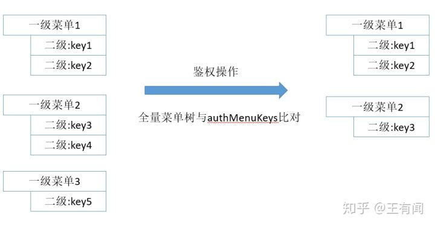
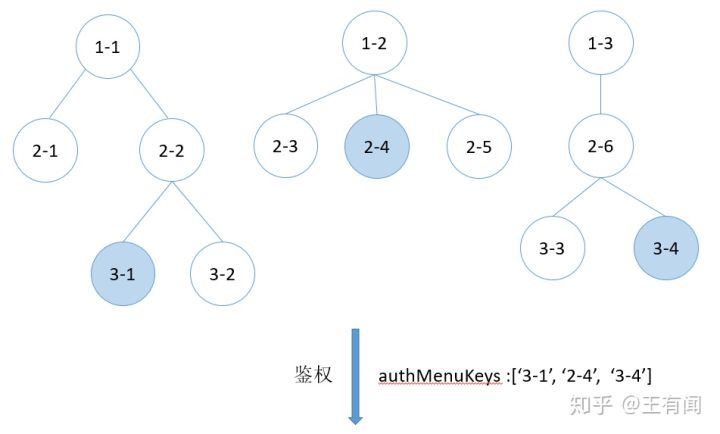
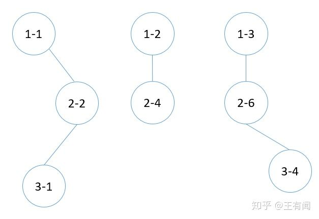

# Ant-design-pro菜单路由配置方式在Vue中的实践

笔者近期的项目开发都在使用Vue框架，在此整理下怎么样在Vue框架下实现ant-design-pro中菜单路由的配置方案。

## 背景：

一般中后台系统都需要根据当前登录用户的信息展示相应的模块，这就要求前端需要在拿到用户信息后对整个系统的菜单和路由做相应的鉴权处理。

## 现状：

之前接触过的菜单路由鉴权方案有以下两种：

1. 后端维护系统完整的菜单结构，用户登录后返回给前端鉴权后的菜单结构，前端只负责渲染。但是要修改icon，path的配置需要后端做处理。

2. 前端维护全量的菜单结构，在侧边栏组件中全量渲染，对于没有权限的菜单模块，点击重定向到一个403未授权页。

## 解决方案：

一般情况下，菜单会对应一个路由，但是某些路由没有相应的菜单展示，最典型的就是列表页和详情页(用户点击列表菜单进入列表页路由，在列表页中通过按钮触发进入详情页路由)。所以说对于鉴权需求要完成两个点：

1. 针对路由： 不管通过什么方式进入未授权的路由，进行重定向处理。
2. 针对菜单： 不展示没有权限的菜单模块。

## Vue中路由的鉴权处理：

在Vue框架中，路由的鉴权处理相对容易一些，vue-router本身提供全局的路由守卫，可以在用户进入每一个路由之前做鉴权操作：用户信息返回的权限列表和当前要进入的路由配置对象中设置的权限码做比较，不符合重定向，符合放行。

```js
// 用户信息接口
// 当前用户拥有demo页，analysis页和search页的权限。
Mock.mock('/user/current', 'get', () => {
  return {
    name: 'Jack Ma',
    authMenuKeys: ['demo', 'analysis', 'search']
  }
})

// 路由配置（后面会具体介绍路由的配置方法）
[
  {
    path: '/dashboard/analysis',
    component: () => import('../views/dashboard/analysis.vue'),
    meta: {
      key: 'analysis'
    }
  }
  ...
]

// 全局路由钩子函数
router.beforeEach(async (to, from, next) => {
  // ...
  const isLoginSuccess = await store.dispatch('initUserInfo') // 登录操作
  // 拿到登录成功后保存在vuex中的用户权限码，也就是用户信息接口中的authMenuKeys字段
  const authMenuKeys = store.state.app.authMenuKeys
  const toRouteKey = to.meta.key
  if (isLoginSuccess && toRouteKey && authMenuKeys.indexOf(toRouteKey) === -1) { // 定位到无权限页
    next({name: '403'})
  } else { // 放行
    next()
  }
})
```

## 菜单的鉴权处理：

用户信息接口中权限列表：

```text
authMenuKeys:['key1'，‘key2’,'key3']
```



菜单树鉴权操作示意图

系统菜单树配置可以抽象成一种森林的数据结构，我们再来考虑一种复杂的配置情况：



抽象出的菜单数据结构



鉴权之后的菜单结构

核心代码：

```js
/**
 * 根据菜单权限码生成最终的树形菜单结构
 * @param {Array} menu 用户定义的全量菜单树状结构
 * @param {Array} authMenuKeys 用户信息中拿到的菜单权限码
 * @return {Array} 鉴权后的树形菜单
 */
function getAuthMenuData(menu, authMenuKeys) { // eslint-disable-line
  return menu.filter((item) => {
    if (item.children && item.children.length > 0) {
      item.children = getAuthMenuData(item.children, authMenuKeys)
      return item.children.length > 0
    }
    return authMenuKeys.indexOf(item.key) > -1
  })
}
```

这样理论性的东西就梳理完成了，下面我们参考ant-design-pro具体看一下代码中菜单和路由的配置。

菜单配置(menu.js)：

```js
import { isUrl } from '../utils/index'

const initMenuData = [
  {
    name: '主页',
    key: 'home',
    icon: 'table',
    path: 'home'
  },
  {
    name: 'demo页',
    key: 'demo',
    icon: 'table',
    path: 'demo/list'
  },
  {
    name: 'dashboard',
    icon: 'table',
    path: 'dashboard',
    children: [
      {
        name: '分析页',
        key: 'analysis',
        path: 'analysis'
      }
    ]
  },
  {
    name: '查询页',
    icon: 'table',
    path: 'search',
    key: 'search',
    children: [
      {
        name: '搜索列表（文章）',
        path: 'articles'
      },
      {
        name: '搜索列表（项目）',
        path: 'projects'
      }
    ]
  }
]

function formatter(data, parentPath = '/', parentKey) {
  return data.map(item => {
    let { path, key } = item
    if (!isUrl(path)) {
      path = parentPath + item.path
    }
    const currentKey = key || parentKey
    let result = {
      ...item,
      path,
      key: currentKey
    }

    if (item.children) {
      result.children = formatter(item.children, `${parentPath}${item.path}/`, currentKey)
    }

    return result
  })
}

/**
 * 根据菜单权限码生成最终的树形菜单结构
 * @param {Array} menu 用户定义的全量菜单树状结构
 * @param {Array} authMenuKeys 用户信息中拿到的菜单权限码
 * @return {Array} 鉴权后的树形菜单
 */
function getAuthMenuData(menu, authMenuKeys) { // eslint-disable-line
  return menu.filter((item) => {
    if (item.children && item.children.length > 0) {
      item.children = getAuthMenuData(item.children, authMenuKeys)
      return item.children.length > 0
    }
    return authMenuKeys.indexOf(item.key) > -1
  })
}

/**
 * 获取鉴权后的菜单结构
 * @param {Array} authMenuKeys 用户信息中拿到的菜单权限码
 * @return {Array} 鉴权后的树形菜单
 */
export const getMenuData = (authMenuKeys = []) => {
  return getAuthMenuData(formatter(initMenuData), authMenuKeys)
}

/**
 * 获取全量菜单结构
 * @return {Array} 全量菜单
 */
export const getTotalMenu = () => {
  console.log(formatter(initMenuData))
  return formatter(initMenuData)
}
```

menu.js文件对外暴露两个方法：getTotalMenu方法抛出全量的菜单结构，getMenuData方法接收用户有权限的菜单码列表为入参，返回鉴权后的菜单结构。

这里有几个细节说明一下：

1. 菜单结构中的key属性配置

```js
{
    name: '查询页',
    icon: 'table',
    path: 'search',
    key: 'search',
    children: [
      {
        name: '搜索列表（文章）',
        path: 'articles'
      },
      {
        name: '搜索列表（项目）',
        path: 'projects'
      }
    ]
}
```

我们可以看到查询页直接在父级设置了key，而不是在当前树结构的末级节点，这样做是为了适配一种情况：后端的权限配置不关心查询页具体的分类，我只给你一个查询的权限码，但是前端为了方便用户，对查询的内容作了再次分类，比如上面作了查询文章和查询项目的分类，并且分别作为查询的子菜单节点。menu.js文件中的formatter函数会将父级的key配置传递到所有的子级：

```text
// formatter处理后的菜单配置
{
    name: '查询页',
    icon: 'table',
    path: '/search',
    key: 'search',
    children: [
      {
        name: '搜索列表（文章）',
        key: 'search',
        path: '/search/articles'
      },
      {
        name: '搜索列表（项目）',
        key: 'search',
        path: '/search/projects'
      }
    ]
}
```

2. 菜单的path属性在配置时只需要关注当前节点即可，formatter函数处理后生成完整路径：

```text
search => /search
  articles => /search/articles
  projects => /search/projects
```

路由配置(route.js)：

```js
import pathToRegexp from 'path-to-regexp'
import { getTotalMenu } from '../menu/menu'

// 提供给用户的平级配置形式
const initRoute = {
  "/": {
    component: () => import('../layout/BasicLayout.vue')
  },
  "/home": {
    component: () => import('../views/home/home.vue')
  },
  "/demo/list": {
    component: () => import('../views/demo/list.vue')
  },
  "/demo/detail": {
    component: () => import('../views/demo/detail.vue'),
    name: '详情页',
    meta: {
      key: 'demo'
    }
  },
  "/dashboard/analysis": {
    component: () => import('../views/dashboard/analysis.vue')
  },
  "/search": {
    component: () => import('../views/list/search.vue')
  },
  "/search/articles": {
    component: () => import('../views/list/articles.vue')
  },
  "/search/projects": {
    component: () => import('../views/list/projects.vue')
  },
  "/exception/403": {
    component: () => import('../views/Exception/403.vue'),
    name: '403'
  },
  "/exception/404": {
    component: () => import('../views/Exception/404.vue'),
    name: '404'
  },
  "/exception/500": {
    component: () => import('../views/Exception/500.vue'),
    name: '500'
  }
}

function getFinishRoute() {
  const routerData = {}
  Object.keys(initRoute).forEach((path) => {
    const pathRegexp = pathToRegexp(path)
    const menuKey = Object.keys(menuData).find(key => pathRegexp.test(`${key}`))
    let menuItem = {}
    if (menuKey) {
      menuItem = menuData[menuKey]
    }
    let router = initRoute[path]
    router.meta = router.meta || {}
    router.meta.key = router.meta.key || menuItem.key
    router.name = router.name || menuItem.name
    routerData[path] = router
  })
  return routerData
}

function getFlatMenuData(menus) {
  let keys = {}
  menus.forEach(item => {
    if (item.children) {
      keys[item.path] = { ...item }
      keys = { ...keys, ...getFlatMenuData(item.children) }
    } else {
      keys[item.path] = { ...item }
    }
  })
  return keys
}

function getMatchRoutesPath(path, routerPaths) {
  let routes = routerPaths.filter(
    routePath => routePath.indexOf(path) === 0 && routePath !== path
  )
  return routes
}

function routerHandle(paths) {
  let cRouter = []
  let emRouter = []

  for (let path of paths) {
    if (path === '/' || emRouter.indexOf(path) > -1) continue

    const currentRoute = routerConfig[path]
    currentRoute.path = path
    const matchPaths = getMatchRoutesPath(path, paths)

    if (matchPaths && matchPaths.length > 0) {
      emRouter = emRouter.concat(matchPaths)
      currentRoute.children = routerHandle(matchPaths)
    }
    cRouter.push(currentRoute)
  }
  return cRouter
}

const initMenuData = getTotalMenu()
const menuData = getFlatMenuData(initMenuData) // 菜单树形结构转换成平级
const routerConfig = getFinishRoute()
console.log(routerConfig)

/**
 * 根据菜单取得重定向地址.
 */
const redirectData = []
const getRedirect = item => {
  if (item && item.children) {
    if (item.children[0] && item.children[0].path) {
      redirectData.push({
        path: `${item.path}`,
        redirect: `${item.children[0].path}`
      })
      item.children.forEach(children => {
        getRedirect(children)
      })
    }
  }
}
initMenuData.forEach(getRedirect)

export default [{
  ...routerConfig['/'],
  path: '/',
  redirect: '/home',
  children: redirectData.concat(routerHandle(Object.keys(routerConfig)))
}, {
  path: '*',
  redirect: '/exception/404',
}]
```

Vue在初始化路由时要传入一个有层级结构的路由配置，但是这里参考ant-design-pro，提供给用户的还是一级的路由配置，理由如下：

对于同一个模块来说，菜单配置对象和路由配置对象要做一些关联，例如，我进入`/search/articles`这个路由的时候希望在路由对象中拿到这个菜单配置的相关属性字段，这就需要我们对同一个模块的菜单和路由配置对象做一次合并处理。如果路由配置对象也是菜单那样的层级结构，两者做合并处理会非常复杂。所以提供给用户的路由配置是一级的，路由配置对象(一级)通过path属性和菜单配置对象(多级)做合并处理，最终通过routerHandle方法生成初始化Vue路由需要的层级结构配置。

注意一个小的细节：在菜单中配置了key属性后会合并到相应的路由配置对象中，但是有些路由是没有菜单配置的(列表页=>详情页)，针对这种情况，我们需要在详情页路由配置对象中添加与列表页相同的key。

```js
"/demo/list": {
    component: () => import('../views/demo/list.vue')
},
"/demo/detail": {
    component: () => import('../views/demo/detail.vue'),
    name: '详情页',
    meta: {
      key: 'demo'
    }
}
```

代码中核心的部分就分析到这里，特别感谢ant-design-pro这个开源项目提供的配置方法，文章中涉及的案例完整代码见github，欢迎star：

 https://github.com/xiaoxiaoaobama/ezreal-pro

 https://github.com/xiaoxiaoaobama/ezreal-pro 