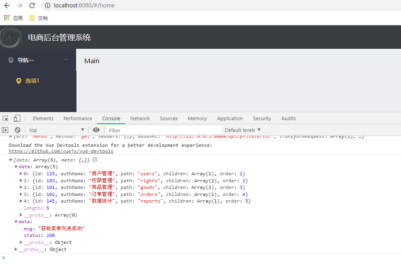
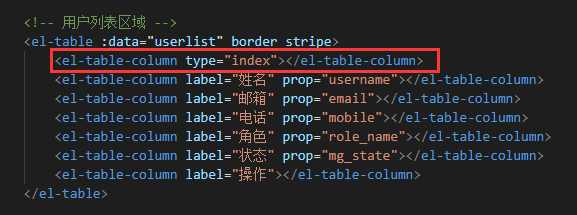
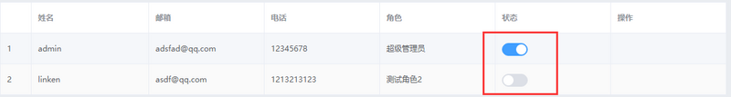

# [vue后台管理系统实践方案](https://segmentfault.com/a/1190000021941684)


这个是一个电商管理系统的前端项目的笔记，这个项目主要包括登录/退出功能、主页布局、用户管理模块、权限管理模块、分类管理模块、参数管理模块、商品管理模块、 订单管理模块等功能，我把里面部分的功能进行了整理，希望对大家有所帮助！

## 项目概述

### 基本业务概述

根据不同的应用场景，电商系统一般都提供了PC端、移动APP、移动Web、微信小程序等多种终端访问方式

### 管理系统功能

电商后台管理系统用于管理账号、商品分类、商品信息、订单、数据统计等业务功能

### 开发模式

电商后台管理系统整体采用前后端分离的开发模式，其中前后端项目基于Vue技术栈的SPA项目

## 技术选型

### 前端技术栈

- vue
- vue-router
- Element-UI
- Axios
- Echarts

### 后端技术栈

- Node.js
- Express
- Jwt
- Mysql
- Sequelize

## 项目部分效果

这个是实现的一个登录页面...

这个是实现的商品列表的内容...

这个实现的商品分类页面的内容...

这个是实现的物流进度...

这个是实现的分配权限页面...

这个是通过三层for循环实现的是三级权限...

这个是实现的步骤条和富文本编辑器...

这个是实现的修改地址和省市区县联动效果...


## 项目初始化

### 前端项目初始化

- 安装Vue脚手架
- 通过Vue脚手架创建项目
- 配置Vue路由
- 配置Element-UI组件库
- 配置axios库
- 初始化git远程仓库
- 将本地项目托管到github或码云中

### 后端环境安装

- 安装MySQL数据库
- 安装Node.js环境
- 配置项目相关信息
- 启动项目
- 使用Postman测试后台项目接口是否正常

## 实现登录

### 登录页面布局

通过Element-UI组件实现布局

- el-form
- el-form-item
- el-input
- el-button
- 字体图标

### 登录退出设置背景色

在里面写入全局样式表

```
/* 全局样式表 */
html,
body,
#app{
    height: 100%;
    margin: 0;
    padding: 0;
}
```

Login.vue页面

```
<template>
    <div class="login_container"></div>
</template>
<script>
    export default {}
</script>

<style lang="less" scoped>
    .login_container {
        background-color: #2b4b6b;
        height: 100%;
    }
</style>
```

在main.js里面导入global.css文件

```
import './assets/css/global.css'
```

### 绘制中间部分头像

Login.vue

```
<template>
    <div class="login_container">
        <div class="login_box">
            <div class="avatar_box">
                
            </div>
        </div>
    </div>
</template>
<script>
    export default {}
</script>

<style lang="less" scoped>
    .login_container {
        background-color: #2b4b6b;
        height: 100%;
    }
    .login_box{
        width: 450px;
        height: 300px;
        background-color: #fff;
        border-radius: 3px;
        position: absolute;
        left: 50%;
        top: 50%;
        transform: translate(-50%,-50%);     
    }
    .avatar_box{
        height: 130px;
        width: 130px;
        border: 1px solid #eee;
        border-radius: 50%;
        padding: 10px;
        box-shadow: 0 0 10px #ddd;
        position: absolute;
        left: 50%;
        transform: translate(-50%,-50%);
        background-color: #fff;
        img{
            width: 100%;
            height: 100%;
            border-radius: 50%;
            background-color: #eee;
        }
    }
</style>
```

### 绘制登录表单区域

Login.vue

```
 <!-- 登录表单区域 -->
            <el-form label-width="0px" class="login_form">
                <!-- 用户名 -->
                <el-form-item>
                    <el-input prefix-icon="el-icon-search"></el-input>
                </el-form-item>
                <!-- 密码 -->
                <el-form-item>
                    <el-input  prefix-icon="el-icon-search"></el-input>
                </el-form-item>
                <!-- 按钮区域 -->
                <el-form-item class="btns">
                    <el-button type="primary">登录</el-button>
                    <el-button type="info">重置</el-button>
                </el-form-item>
            </el-form>
              
              .login_form{
                position: absolute;
                bottom: 0;
                width: 100%;
                padding: 0 20px;
                box-sizing: border-box;
            }
            .btns{
                display: flex;
                justify-content: flex-end;
            }
```

element.js

```
import Vue from 'vue'
import { Button } from 'element-ui'
import { Form,FormItem} from 'element-ui'
import { Input } from 'element-ui'

Vue.use(Button)
Vue.use(Form)
Vue.use(FormItem)
Vue.use(Input)
```

### 效果


## 实现主页布局

### 整体布局

先上下划分，再左右划分

```
<el-container>
    <!--头部区域-->
    <el-header></el-header>
    <el-container>
        <!--侧边栏区域-->
        <el-aside></el-aside>
        <!--右侧主体区域-->
        <el-main></el-main>
    </el-container>
</el-container>
```

在plugins/element.js引入

```
import { Container,Header,Aside,Main } from 'element-ui'

Vue.use(Container)
Vue.use(Header)
Vue.use(Aside)
Vue.use(Main)
```

components/Home.vue

```
    <el-container class="home-container">
        <!-- 头部区域 -->
        <el-header>Header<el-button type="info" @click="logout">退出</el-button>
        </el-header>
        <!-- 页面主体区域 -->
        <el-container>
            <!-- 侧边栏 -->
            <el-aside width="200px">Aside</el-aside>
            <!-- 右侧内容主体 -->
            <el-main>Main</el-main>
        </el-container>
    </el-container>
```

### 美化主页的header区域

```
<el-header>
    <div>
        
        <span>电商后台管理系统</span>
    </div>
    <el-button type="info" @click="logout">退出</el-button>
</el-header>

 .home-container{
        height: 100%;
    }
    .el-header{
        background-color: #373d41;
        display: flex;
        justify-content: space-between;
        padding-left: 0;
        align-items: center;
        color: #fff;
        font-size: 20px;
        > div {
            display: flex;
            align-items: center;
            span{
                margin-left:15px;
            }
        }
    }
    .el-aside{
        background: #333744;
    }
    .el-main{
        background-color: #eaedf1
    }
```

效果如下：


### 左侧菜单布局

菜单分成二级，并且可以折叠

```
<el-menu>
    <el-submenu>
        <!--这个template是一级菜单的内容模板-->
        <i class="el-icon-menu"></i>
        <span>一级菜单</span>
        <!--在一级菜单中，可以嵌套二级菜单-->
        <el-menu-item>
            <i class="el-icon-menu"></i>
            <span slot="title">二级菜单</span>
        </el-menu-item>
    <el-submenu>
</el-menu>
```

在plugins/element.js里面导入

```
//这个导入的都是根据下边标签名
import {Menu,Submenu,MenuItem} from 'element-ui'

Vue.use(Menu)
Vue.use(Submenu)
Vue.use(MenuItem)
```

在components/Home.vue里面写入

```
<el-container>
            <!-- 侧边栏 -->
            <el-aside width="200px">
                <!-- 侧边栏菜单区域 -->
                <el-menu
                    background-color="#333744"  text-color="#fff"
                    active-text-color="#ffd04b">
                    <!-- 一级菜单 -->
                    <el-submenu index="1">
                        <!-- 一级菜单的模板区域 -->
                        <template slot="title">
                            <!-- 图标 -->
                            <i class="el-icon-location"></i>
                            <!-- 文本 -->
                             <span>导航一</span>
                        </template>
                        <!-- 二级菜单 -->
                        <el-menu-item index="1-4-1">
                            <template slot="title">
                            <!-- 图标 -->
                            <i class="el-icon-location"></i>
                            <!-- 文本 -->
                             <span>选项1</span>
                        </template></el-menu-item>
                    </el-submenu>
                </el-menu>
            </el-aside>
            <!-- 右侧内容主体 -->
            <el-main>Main</el-main>
        </el-container>
```

效果如下


### 通过axios拦截器添加token验证

通过axios请求拦截器添加token,包装拥有获取数据的权限

```
//axios请求拦截器
axios.interceptors.request.use(config => {
    //为请求头对象，添加Token验证的Authorization字段
    config.headers.Authorization = window.sessionStorage.getItem('token')
    return config
})
```


### 获取左侧菜单数据




### 通过双层for循环渲染左侧菜单

通过两层for循环把左侧的结构渲染出来


## 实现商品列表分页功能

```
    <!-- 分页区域 -->
        <el-pagination
            @size-change="handleSizeChange"
            @current-change="handleCurrentChange"
            :current-page="queryInfo.pagenum"
            :page-sizes="[5, 10, 15, 20]"
            :page-size="queryInfo.pagesize"
            layout="total, sizes, prev, pager, next, jumper"
            :total="total" background>
        </el-pagination>
```


实现的效果


## 绘制用户列表组件的基础布局

在需要用到的组件添加element.js

```
import { Breadcrumb,BreadcrumbItem,Card,Row,Col} from 'element-ui'

Vue.use(Breadcrumb)//面包屑，显示当前页面的路径，快速返回之前的任意页面
Vue.use(BreadcrumbItem)//面包屑，显示当前页面的路径，快速返回之前的任意页面
Vue.use(Card)//卡片形式
Vue.use(Row)//行
Vue.use(Col)//列
```

在css/global.css里面写入样式

```
.el-breadcrumb{
    margin-bottom: 15px;
    font-size: 12px;
}
/* 想要自己的样式覆盖它的样式就要在后边加一个!important */
.el-card{
      box-shadow: 0 1px 1px rgba(0, 0, 0, 0.15) !important;  
}
```

表示的效果如下


在Users.vue里面添加


### 获取用户列表数据


显示的效果


### 使用el-table组件渲染基本的用户列表

stripe属性可以创建带斑马纹的表格
table 组件是不具有竖直方向的边框的


再把需要用到的组件在plugins/element.js里面引入

实现的效果


然后在css/global.css里面写入样式

```
.el-table{
    margin-top: 15px;
    font-size: 12px;
}
```

实现的效果(盒子到顶部的距离和字体的大小)


### 为表格添加索引列

只需要加入type="index"就可以了



实现的效果


### 自定义状态列的显示效果

使用switch开关


实现的效果



### 通过作用域插槽渲染操作列

需要使用element-ui里面的组件

这个:enterable="false",表示鼠标是否可以、进入tooltip中，false是布尔值，所以要进行数据绑定


在plugins里element.js里面导入

```
import {Tooltip} from 'element-ui'

Vue.use(Tooltip)
```

最后实现的效果


## 总结

通过本次从零一行一行代码实现一个完整的常见的后台管理系统，其实绝大部分就是对`Element UI`的使用。说是简单、实则坑很多，期间遇到了不少的bug，大多都是因为细节不注意，也让我更加体会 好记性不如烂笔头 这句话，实践才是真理啊，多动手，多探索。