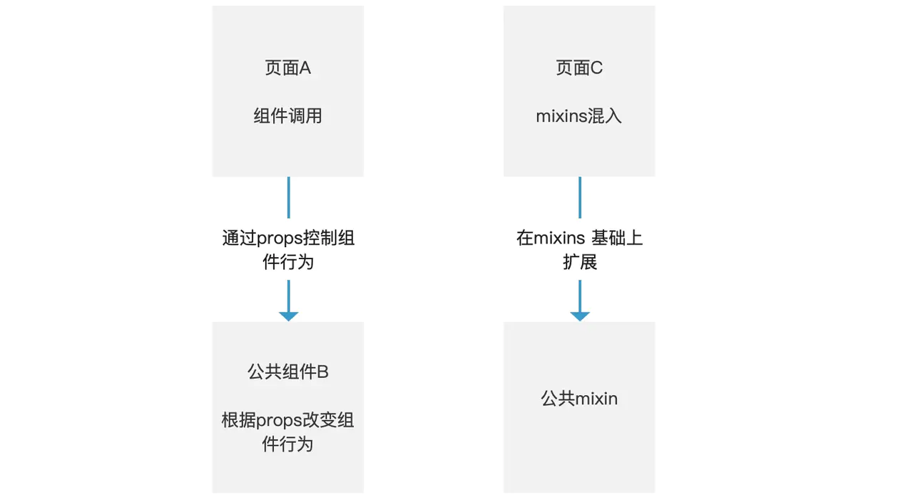
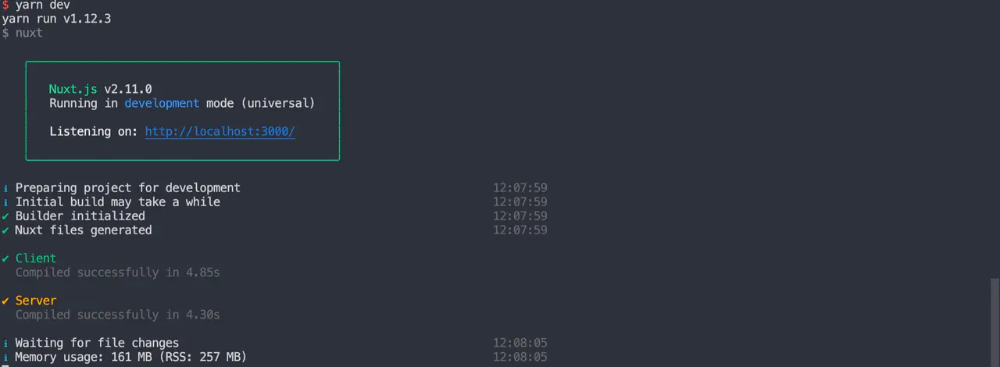

# 吃透 Vue 项目开发实践  16个方面深入前端工程化开发技巧

# 前言

之前使用过 Vue 开发后台、中台项目，也做过移动端 H5，弄过一点小的前端架构。每做一个项目都会收获了不一样的经验和理解。下面我把这些点点滴滴的经验总结下来，做一个系列的文章分享和阶段性的总结。

文中大多数代码将在[suo-design-pro](https://github.com/suoyuesmile/suo-design-pro) 中更新

> 常规操作，先点赞后观看哦！你的点赞是我创作的动力之一！

## **概览** 


## **问题** 

> 我将从 16 个方面来论述 vue 开发过程中的一些技巧和原理。当然由于篇幅有限，先论述前 8 个问题，下节将完成全系列内容。

本篇文章将围绕下列问题进行论述：

- **如何规范你的 git 提交，并自动生成并提交日志？**
- **如何配置和使用 Sass 和 PUG 提升你的编码效率？**
- **如何处理你的代码风格问题，以及如何使用 perttier 与 eslint 解决效率风格两难问题？**
- **如何管理页面的路由，如何编写异步路由？**
- **如何编写组件，引入组件库？**
- **如何管理你的资源，如何引入图标，样式？**
- **如何封装你的 axios，管理你的api？**
- **如何使用 mock 模拟你的数据，实现真正意义的前后端分离？**

# 实践

> 实践之前：我希望你有如下准备，或者知识储备。
>
> - 了解 `npm/yarn/git/sass/pug/vue/vuex/vue-router/axios/mock/ssr/jest` 的使用和原理。
> - 当然上面知识不了解也没关系哈哈哈，文章中会提到大致用法和作用。

## **如何规范 git 提交** 

> 代码提交记录是一个很好的代码修改日志。规范的代码提交记录，不管在平时代码开发维护过程中，还是在定位 bug 或者回退版本来说都是极为重要。

### 原理

两种做法：

- 自己手动规范 git 的提交原则或者团队统一制定。这个靠自觉，好习惯养成之后就没问题来
- 使用插件规范，比如下面这种

为了规范提交，我使用了如下插件：

- commitizen
- conventional-changelog
- cz-conventional-changelog
- conventional-changelog-cli

#### 解决方案

#### 安装系列插件依赖

```
yarn add -D commitizen conventional-changelog cz-conventional-changelog
```

> 安装依赖时，要注意是否是生产环境需要的。显然 `commitizen` 只在开发环境中使用。`-D` 只在 `dev` 环境使用

#### 配置依赖路径

在 `package.json` 中添加配置

```
{
    //...
    "config": {
        "commitizen": {
          "path": "./node_modules/cz-conventional-changelog"
        }
    }
}
```

在命令行中输入

```
git add -A
git-cz
```

出现了交互输入方式，规范你的 `commit` 输入格式 

#### 生成 CHANGELOG

```
npm i -g conventional-changelog-cli
```

增加一个npm 命令，快速生成日志

```
"genlog": "conventional-changelog -p angular -i .github/CHANGELOG.md -s"
```

使用`yarn`命令生成日志

```
yarn genlog
```

自动生成的log

```
# 0.1.0 (2019-12-27)

### Features

* **git:** 增加commitizen工具规范提交 ([58e3937](https://github.com/suoyuesmile/suo-design-pro/commit/58e39370aa838fd99312f73b37d092ffadc85990))
```

## **如何管理代码风格** 

> 较统一的代码风格利于阅读，也利于协作。

### 原理与解决方案

使用 eslint 约束基本风格和语法，使用 prettier 自动格式化你的代码。

### 实践

#### 安装 eslint 依赖

```
{
    "eslint": "^5.16.0",
    "eslint-config-standard": "^6.2.1",
    "eslint-friendly-formatter": "^2.0.7",
    "eslint-loader": "^2.1.2",
    "eslint-plugin-html": "^2.0.1",
    "eslint-plugin-promise": "^3.5.0",
    "eslint-plugin-standard": "^2.3.1",
    "eslint-plugin-vue": "^5.0.0"
}
```

使用两个插件，一个 `plugin:vue/essential`，一个是 `standard`。 `vue/essential` 为了在 vue 里面也可以生效。另一个是 `standard`。 [standard 标准文档](https://github.com/standard/standard/blob/master/docs/RULES-zhcn.md#javascript-standard-style)

> 使用 recommend 也可以，采用推荐 lint，更加轻量化

```
module.exports = {
  root: true,
  env: {
    node: true
  },
  extends: ['plugin:vue/essential', 'standard'],
  rules: {
    quotes: ['error', 'single'],
    indent: ['error', 2, { MemberExpression: 'off' }],
    'arrow-parens': 0,
    'no-loop-func': 2,
    'space-before-function-paren': ['error', 'never'],
    indent: ['error', 2, { SwitchCase: 1 }]
  },
  parserOptions: {
    parser: require.resolve('babel-eslint'),
    ecmaVersion: 2018,
    sourceType: 'module'
  }
}
```

#### 可以自定义 rules 的规则

> rules 的规则 { 规则名：[是否关闭/规则等级，配置的值，只对部分配置] } `indent: ['error', 2, { SwitchCase: 1 }]` 兼容 prettier，prettier 会将代码格式化成 eslint 报错的情况。 规则等级：0 关闭 1 警告 2 报错

### 使用 prettier

#### 配置 prettier 文件

```
{
  "printWidth": 150,
  "singleQuote": true,
  "trailingComma": "none",
  "semi": false,
  "tabWidth": 2,
  "useTabs": false,
  "bracketSpacing": true,
  "jsxBracketSameLine": false,
  "arrowParens": "always",
  "proseWrap": "preserve",
  "overrides": [
    {
        "files": ["*.json", ".eslintrc", ".tslintrc", ".prettierrc", ".tern-project"],
        "options": {
            "parser": "json",
            "tabWidth": 2
        }
    },
    {
        "files": "*.{css,sass,scss,less}",
        "options": {
            "parser": "css",
            "tabWidth": 2
        }
    },
    {
        "files": "*.ts",
        "options": {
            "parser": "typescript"
        }
    },
    {
        "files": "*.vue",
        "options": {
            "parser": "vue"
        }
    },
    {
        "files": "*.md",
        "options": {
            "parser": "markdown"
        }
    }
  ]
}
```

#### 开启 vscode 自动格式化

```
{
  // prettier
  "prettier.singleQuote": true,
  "prettier.semi": false,
  "prettier.tabWidth": 2,
  "[javascript]": {
    "editor.formatOnSave": true,
    "editor.defaultFormatter": "esbenp.prettier-vscode"
  }
}
```

## **如何提升编码效率** 

### 原理与解决方案

我主要从 3 个方面来做一些编码效率上的改进

- 升级你的 vue-cli 减少 webpack 配置的成本
- 使用 sass，利用里面函数、mixins、变量提升 css 文件的复用
- 使用 pug，减少 html 的代码编写量

#### 实践

> `vue-cli3+、vue-cli4+` 相比于 `vue-cli2+` 最大的改变就是将约定俗称的配置，全部公共化了，也就是做了一次二次封装。这样的好处在于，我们不必要在繁多的配置代码中寻找需要的配置。

简单新建一个配置入口就能操作我们大多数想要的功能。在 `root` 目录下新建一个 `vue.config.js` 文件，作为我们 `webpack` 的配置文件。

**初始化 vue 配置**

```
const autoprefixer = require('autoprefixer')

module.exports = {
  publicPath: process.env === 'production' ? '' : '/',
  outputDir: 'dist',
  assetsDir: 'static',
  filenameHashing: true,
  lintOnSave: true,
  runtimeCompiler: false,
  transpileDependencies: [/\/node_modules\/vue-echarts\//, /\/node_modules\/resize-detector\//],
  productionSourceMap: false
}
复制代码
```

简单的配置完成后，我们引入一个 `sass` 工具用于编写 `sass`文件

> 用法见 sass 参考资料！

### 使用 Sass

#### 安装与使用

```
yarn add -D sass sass-loader
复制代码
```

### 如何处理样式

在 `assets` 目录中建立一个 styles 文件专门来存放样式文件，新增入口`index.scss`文件，便于 JavaScript 引入，增加 utils.scss、reset.scss、varibles 文件。

> 这些样式工具都是为了提升我们 `scss` 开发效率，具有畅快的开发体验！

#### 使用 varibles 变量文件

为了提升我们代码的可读性，复用性。使用 `sass` 变量必不可少。

还有一点就是利于全局修改样式，如果需要更换皮肤这个功能，我们只需要更改全局的主题色，即可更换主题，那样更加方便。

```
// 主题色
$color-red: #ff3333;
$color-purple: #ff33a9;
$color-orange: #ff8833;
$color-blue: #3377ff;

// 文字色
$color-black: #000;
$color-dark: #333;
$color-deep: #555;
$color-pl: #999999;
$color-weak: #B3B3B3;
$color-white: #fff;

// 背景色
$bg-bar: #F9F9F9;
$bg-page: #F3F3F3;
$bg-page-light: #F9F9F9;
复制代码
```

使用变量之后，sass 文件不会直接生效，至少在 vue 文件 里面是访问不到的。 需要在 `vue.config.js` 里面增加如下配置。

```
module.exports = {
    // ...
    css: {
        sourceMap: true,
        loaderOptions: {
            sass: {
                prependData: `
        @import "@/assets/styles/variable.scss";
        `
            }
        }
    }
}
复制代码
```

#### 覆盖默认样式

常规操作, 引入 reset.scss 将默认样式覆盖掉

```
/* http://meyerweb.com/eric/tools/css/reset/
   v2.0 | 20110126
   License: none (public domain)
*/

html, body, div, span, applet, object, iframe,
h1, h2, h3, h4, h5, h6, p, blockquote, pre,
a, abbr, acronym, address, big, cite, code,
del, dfn, em, img, ins, kbd, q, s, samp,
small, strike, strong, sub, sup, tt, var,
b, u, i, center,
dl, dt, dd, ol, ul, li,
fieldset, form, label, legend,
table, caption, tbody, tfoot, thead, tr, th, td,
article, aside, canvas, details, embed,
figure, figcaption, footer, header, hgroup,
menu, nav, output, ruby, section, summary,
time, mark, audio, video {
	margin: 0;
	padding: 0;
	border: 0;
	font-size: 100%;
	font: inherit;
	vertical-align: baseline;
}
/* HTML5 display-role reset for older browsers */
article, aside, details, figcaption, figure,
footer, header, hgroup, menu, nav, section {
	display: block;
}
body {
	line-height: 1;
}
ol, ul {
	list-style: none;
}
blockquote, q {
	quotes: none;
}
blockquote:before, blockquote:after,
q:before, q:after {
	content: '';
	content: none;
}
table {
	border-collapse: collapse;
	border-spacing: 0;
}

html, body {
  width: 100%;
  height: 100%;
  overflow: auto;
  margin: 0;
  scroll-behavior: smooth;
  -webkit-overflow-scrolling: touch;
}
复制代码
```

#### 使用样式工具集

有时候我们发现，光是引入变量还不够，变量工具只能允许我们在 css 类文件中使用。假如我想着模版中直接使用样式，有没有更快的方案呢？

当然有的，我们可以自定义一个常用的样式工具集。设置一些背景颜色、字体颜色、盒子模型中的常规操作。

> 要是有设计规范更好哦，我也是常常向设计师提出要求，一定要制定出一套产品的设计规范。

```
// utils 工具
// 颜色
.bg-red {background-color: $color-red!important;}
.bg-purple {background-color: $color-purple!important;}
.bg-orange {background-color: $color-orange!important;}
.bg-blue {background-color: $color-blue!important;}
.color-red {color: $color-red!important;}
.color-purple {color: $color-purple!important;}
.color-orange {color: $color-orange!important;}
.color-blue {color: $color-blue!important;}
.text-black {color: #000;}
.text-dark {color: #333;}
.text-deep {color: #555;}
.text-weak {color: #B3B3B3;}
.text-white {color: #fff;}

// 字体
.f10 {font-size: 10px;}
.f12 {font-size: 12px;}
.f14 {font-size: 14px;}
.f15 {font-size: 15px;}
.f17 {font-size: 17px;}
.f20 {font-size: 20px;}
.f24 {font-size: 24px;}

// 文字对齐
.tl {text-align: left;}
.tc {text-align: center;}
.tr {text-align: right;}

// 浮动与清除浮动
.fl {float: left;}
.fr {float: right;}
.fix {*zoom: 1;}
.fix:after{display:table; content:''; clear:both;}

// 显示
.dn{display:none;}
.di{display:inline;}
.db{display:block;}
.dib{display:inline-block;}
.dt{display:table;}
div.dib{*display:inline; *zoom:1;}
.vm {vertical-align: middle;}
.vib {display:inline-block; vertical-align: middle;}

// 定位
.pr {position: relative;}
.pa {position: absolute;}
.pf {position: fixed;}

// 盒子模型
.ml4 {margin-left: 4px;}
.mr4 {margin-right: 4px;}
.mt4 {margin-top: 4px;}
.mb4 {margin-bottom: 4px;}
.ml8 {margin-left: 8px;}
.mr8 {margin-right: 8px;}
.mt8 {margin-top: 8px;}
.mb8 {margin-bottom: 8px;}
.ml12 {margin-left: 12px;}
.mr12 {margin-right: 12px;}
.mt12 {margin-top: 12px;}
.mb12 {margin-bottom: 12px;}
.ml16 {margin-left: 16px;}
.mr16 {margin-right: 16px;}
.mt16 {margin-top: 16px;}
.mb16 {margin-bottom: 16px;}
.ml20 {margin-left: 20px;}
.mr20 {margin-right: 20px;}
.mt20 {margin-top: 20px;}
.mb20 {margin-bottom: 20px;}
.ml24 {margin-left: 24px;}
.mr24 {margin-right: 24px;}
.mt24 {margin-top: 24px;}
.mb24 {margin-bottom: 24px;}

.ml10 {margin-left: 10px;}
.mr10 {margin-right: 10px;}
.mt10 {margin-top: 10px;}
.mb10 {margin-bottom: 10px;}
.ml15 {margin-left: 15px;}
.mr15 {margin-right: 15px;}
.mt15 {margin-top: 15px;}
.mb15 {margin-bottom: 15px;}

// 按钮禁用
.disabled{outline:0 none; cursor:default!important; opacity:.4; filter:alpha(opacity=40); -ms-pointer-events:none; pointer-events:none;}
复制代码
```

#### 增加样式入口文件

最后一步，新建一个入口文件，将样式工具类全部导入进来，供主程序引入。

```
// index.scss 文件
// @import './varibles.scss'
@import './reset.scss';
@import './utils.scss';
复制代码
```

> varibles.scss vue 配置中引入，这里无需引入

在 `main.js` 中直接引入 `index.scss`

```
import '@/assets/styles/index.scss'
复制代码
```

### vue 中写样式要注意哪些方面，有哪些技巧呢？

#### 避免全局污染

在页面中写 `css/scss` 加上 `scoped`，`scoped` 的功能就是使页面的样式是局部的，不让影响其他页面的样式。

#### bem 规范

我们大多数人时候会遇到问题，**样式嵌套太多了怎么命名**

> BEM是块（block）、元素（element）、修饰符（modifier）的简写，由 Yandex 团队提出的一种前端 CSS 命名方法论。

名字太长易读性太差

```
.cardbox {
    .cardbox-card {
        .cardbox-card-wrapper
            .cardbox-card-wrapper-header {
                .cardbox-card-wrapper-header-title {
                    // ...
                }
            }
            .cardbox-card-wrapper-body{
                .cardbox-card-item {
                    .cardbox-card-item-title {
                        // ...
                    }  
              }
          }
        }
    }
}
复制代码
```

#### bem 使用方式

```
block-name__element-name--color
```

- 区分块，子元素，修饰元素
- 块，页面中独立的单元
- 子元素，块里面的儿子 `card__item` 使用 `__` 连接
- 子元素长命名使用 - 连接
- 修饰（易变的）`card__item--warning` 使用 `--`

我们使用 bem 改造样式

```
.cardbox {
    &__header {
        &__title {
            //...
        }
    }
    &__body {
        &__item {
            &__title {
                //...
            }
        }
    }
}
复制代码
```

> bem 一般推荐子元素嵌套尽量在2-3层以内

但是我们发现样式子元素嵌套有点多，使用了两重子元素嵌套。

大致原理是**尝试分离父子元素的关系，把卡片本身当作一个块看待。**

下面来试着去减少嵌套：

```
.cardbox {
    &__header {
        &__title {
            //...
        }
    }
    &__body {
        .card {
            &__title {
                //...
            }
        }
    }
}
复制代码
```

现在编写样式效率提高也更加规范了，那么编写 HTML 也是有很多累赘的代码。

比如大多数标签都是前开后闭的。通过 pug 我们可以省略很多字符的敲打，下面我们谈谈如何使用 pug 编写模版。

> 当然喜欢哪种 HTML 编写风格见人见智啦，我自己更加倾向 pug，那种缩进和简洁的表达，有种在写 scss 的感觉。

### 如何使用 pug

#### 类似 sass，首先安装 pug 和 pug 的 loader

```
yarn add -D pug pug-html-loader pug-plain-loader
复制代码
```

#### 完成配置

```
module.exports = {
  // ...
  chainWebpack: (config) => {
    config.module
      .rule('pug')
      .test(/\.pug$/)
      .use('pug-html-loader')
      .loader('pug-html-loader')
      .end()
  }
}
```

#### 编写 pug 代码

使用 scss 工具与 pug 完美搭配，少写很多代码

```
// 登陆
<template lang="pug">
  .login
    h1.login__title.ml15 注册/登陆
    .login__form.mt15.ml15
      van-field.login__form__input(placeholder="输入手机号" v-model="phone")
      .login__form__protocol.mt15
        .login__form__protocol__tips.dib.text-weak 注册或登录即表示同意
        .login__form__protocol__name.dib.color-orange 《用户协议》
      app-button.mt15(size="large"
        theme="orange"
        :disabled="phone.length !== 11"
        @click="handleSubmit"
      ) 下一步
</template>
```

我们已经引入了样式，接下来我将谈谈其他资源的引入

## **如何管理你的资源** 

### 原理与解决方案

我暂时把资源分为下面几种

- 字体
- ICON
- 图片
- 样式  把他们各自新建一个目录，都放在 assets 目录下面分门别类，供其他地方调用。 使用 alias 更好重命名，使之更便捷的访问到。

增加 `vue.config.js` 配置 ,设置`assets`别名

```
const path = require('path')
function resolve(dir) {
  return path.join(__dirname, dir)
}
module.exports = {
  //...
  chainWebpack: (config) => {
    config.resolve.alias.set('@', resolve('src')).set('@assets', resolve('src/assets'))
  }
}
复制代码
```

### ICON

#### 引入 iconfont

1. [iconfont](https://www.iconfont.cn/manage/index) 阿里图标项目中下载，将整个项目图标包一起下载下来


1. 引入 iconfont 样式 需要下面四个文件

- `iconfont.eot`
- `iconfont.ttf`
- `iconfont.woff`
- `iconfont.woff2`

1. 项目中引入 iconfont 让 `icon` 组件化

```
<template>
  <i class="iconfont" v-on="$listeners" :class="name"></i>
</template>

<script>
export default {
  props: {
    name: String
  }
}
</script>

<style lang="scss" scoped>
.iconfont {
  font-size: 16px;
  color: $color-icon;
}
</style>
复制代码
```

#### 引入图片作为 ICON

让图片组件化，我们再来写一个 img 组件

```
<template lang="pug">
  img(
    :src="require(`@/assets/images/${name}.png`)"
    v-bind="$attrs"
    v-on="$listeners"
    :style="{'width': width ? width + 'px' : size + 'px', 'height': height ? height + 'px' : size + 'px' }")
</template>
<script>
export default {
  name: 'app-img',
  props: {
    name: {
      type: String,
      default: ''
    },
    size: {
      type: Number,
      default: 16
    },
    width: {
      type: Number,
      default: 0
    },
    height: {
      type: Number,
      default: 0
    }
  }
}
</script>
```

## **如何管理你的路由** 

### 原理与解决方案

使用 vue-router，使用`import()` 生成异步路由，只有在访问时候才会加载模块。

为什么使用 `import()` 会异步加载模块？

> MDN：在您希望按照一定的条件或者按需加载模块的时候，动态import() 是非常有用的。而静态型的 import 是初始化加载依赖项的最优选择，使用静态 import 更容易从代码静态分析工具和 tree shaking 中受益。

说白了就是起到一个**按需加载**的目的。现在大多数实现的按需加载，基本都是依赖 `import()` 这个方法。

#### 安装 vue-router

```
yarn add vue-router
复制代码
```

安装完 `router`，在编写 `router` 先创建页面

#### 新建一个空页面

src 目录下新增 views 目录存放页面文件。创建 index 目录和 home 页面

```
<template lang="pug">
  .home 首页
</template>

<script>
export default {

}
</script>
<style lang="scss" scoped>
</style>
复制代码
```

#### 编写路由

```
const routes = [
    {
        // 首页
        path: '/',
        name: 'index',
        redirect: '/home',
        component: App,
        children: [
            {
                // 首页
                path: 'home',
                name: 'home',
                // 路由懒加载
                component: () =>
                    import(
                        /* webpackChunkName: "index" */ '../views/index/home.vue'
                    )
            }
        ]
    }
]
Vue.use(VueRouter)

const router = new VueRouter({
    mode: 'history',
    routes: routes,
    base: process.env.BASE_URL,
    props: true
})

export default router
复制代码
```

#### 为了消除 # 显得路径更加好看简洁，我们采用 history 模式，但是 history 模式有个问题就是，异步路由没有缓存在页面中，第一次进入页面会找不到

在 vue.config.js 中增加配置，开发环境可以访问到，恢复正常

```
module.exports = {
  // ...
  devServer: {
    historyApiFallback: true
  }
}
复制代码
```

> 关于路由还有很多可以研究到地方，可以自行研究哦！

## **组件化开发** 

### 原理与解决方案

一般来说，我们根据组件的复用度，分给基础（公共）组件和业务组件。

为了节省时间，快速开发，这里基础组件大部分引用开源组件。当然不能直接就用哦。

一般要进行二次封装，也就是高阶组件开发。

1. 通过修改和覆盖当前组件的样式来达到修改样式的作用。
2. 通过拦截事件来更改js的逻辑。

下面我们先引入 `vant` 组件

### 实践

#### 引入 vant

```
yarn add vant
复制代码
```

### 对基础组件进行二次封装和改造

下面 7 步来写好一个公共组件

1. 新建一个 `components` 目录来存放基础组件
2. 基础组件命名为 `app-xxx` 或 `appXxx`，新建一个 `app-button` 目录，新建 `index.vue`
3. 根据设计稿设计和编写组件

> 编写组件之前首先要设计组件，根据组件的不变性和可变性原则编写。不变性是组件的核心，可变性根据参数对组件对相关部分进行调节，实现可选择的功能。

1. 实现组件

```
<template lang="pug">
  div.dib
    van-button.btn(
      @click="$emit('click')"
      :class="getClass" v-bind="$attrs"
      :style="{'width': size === 'large' ? '345px': '', 'backgroundColor': getBgColor, borderColor: getBgColor, color: getBgColor}")
      slot
</template>

<script>
import { Button } from 'vant'
import Vue from 'vue'
import { getColor } from '@/utils'
Vue.use(Button)

export default {
  name: 'app-button',
  props: {
    type: {
      type: String,
      default: 'primary'
    },
    theme: {
      type: String,
      default: 'blue'
    },
    size: {
      type: String,
      default: ''
    }
  },
  computed: {
    getClass() {
      if (!this.type) {
        return ''
      }
      return `app-btn--${this.type}`
    },
    getBgColor() {
      if (!this.theme) {
        return ''
      }
      return getColor(this.theme)
    }
  }
}
</script>

<style lang="scss" scoped>
.app-btn  {
  ::v-deep &--primary {
    padding: 8px 30px;
    height: 40px;
    border-radius: 4px;
    font-size: 15px;
    font-weight: 400;
    line-height: 19px;
    color: white!important;
  }
  ::v-deep &--minor {
    padding: 5px 10px;
    height: 26px;
    border-radius: 14px;
    font-size: 12px;
    font-weight: 400;
    line-height: 16px;
    background-color: #fff!important;
  }
  ::v-deep &--rect {
    padding: 5px px;
    height: 49px;
    font-size: 14px;
    color: white!important;
  }
}
</style>
复制代码
```

> ::v-deep  样式深覆盖，scoped 情况下覆盖组件样式，不改变其样式

1. 写好基础组件 README，为什么要写文档呢？如果多人开发同一个项目，基础组件会被其他人引用。方便其他人使用，所以要写文档。

> 一句话言：只要可能被其他人用的公共方法和组件，注释或文档是很重要的，对自己的代码负责哈。

其他用法参照 vant

1. 全局引用，基础组件许多页面都会用到，将其设置成全局组件，其他地方就不必再引用了哦。

新建一个文件 `global` 存放全局组件注册，在 `main.js` 引入

```
import Vue from 'vue'
import appButton from '@/components/app-button'
Vue.component('app-button', appButton)
复制代码
```

1. 写好 `demo`，即使暂时不写单元测试，也要写好一个 `demo`，使之能正常的运行

添加 demo 页面和路由

```
<template lang="pug">
  div(class="base")
    // 按钮组件
    app-button.mt4(theme="blue") 确认支付
    app-button(theme="orange") 确认支付
    app-button(theme="purple") 确认支付
    app-button.mt4(theme="red") 确认支付
    app-button(theme="grey") 确认支付
    app-button.mt4(theme="blue" size="large") 修改地址
    app-button.mt4(theme="orange" size="large") 修改地址
    app-button.mt4(theme="purple" size="large") 修改地址
    app-button.mt4(theme="red" size="large") 修改地址
    app-button.mt4(theme="grey" size="large") 修改地址
    app-button.mt4(theme="blue" type="minor") 确认收货
    app-button(theme="orange" type="minor") 确认收货
    app-button(theme="purple" type="minor") 确认收货
    app-button(theme="red" type="minor") 修改地址
    app-button(theme="grey" type="minor") 修改地址
    app-button.mt4(theme="blue" type="rect") 确认收货
    app-button(theme="orange" type="rect") 确认收货
    app-button(theme="purple" type="rect") 确认收货
    app-button(theme="red" type="rect") 修改地址
    app-button(theme="grey" type="rect") 修改地址
</template>
<script>
export default {
}
</script>
<style lang="scss">
</style>
复制代码
```

#### 实现效果


## **如何封装请求** 

### 原理与解决方案

基本上就是对 axios 的封装，封装主要有两个目的。

- 修改一些基础的配置：请求地址，超时，其他的杂七杂八的
- 统一操作：统一处理错误，统一处理请求参数和格式，响应参数和格式。统一处理 message，统一拦截挂载等等。

网上已经有很多类似的文章了， 我这里给出我常用的封装方案。

### 实践

#### 根据不同环境设置请求地址

```
// .env-default.js 文件
// 不同环境访问不同的路径
const api = {
  develop: 'http://xxxx:8080',
  mock: 'http://xxxx',
  feature: 'http://xxxx',
  test: 'http://xxxx',
  production: 'http://xxxx'
}

export const baseURL = api[process.env.NODE_ENV || 'dev']
复制代码
```

> 因为每个人开发环境，mock环境不一定相同，这个文件建议 gitignore忽略掉。模版可以写在 readme 文档中，启动项目时加入文件。

#### 新建一个 `utils` 工具

我们现在将 axios 封装成我们自己需要的配置，然后定义四个常用的请求方法供调用

```
// utils/http.js 文件
import axios from 'axios'
import { baseURL } from '../../.env-defalut.js'

// axios 配置
const defaultBaseUrl = 'http://localhost:8080/'
// 默认超时时间
axios.defaults.timeout = 15000
// 数据接口域名统一配置.env
axios.defaults.baseURL = baseURL || defaultBaseUrl 

// http request 拦截器
axios.interceptors.request.use(
  (config) => {
    config.headers = {
    }
    return config
  },
  (err) => {
    return Promise.reject(err)
  }
)

// http response 拦截器
axios.interceptors.response.use(
  (response) => {
    return response
  },
  (error) => {
    const data = error.response.data
    return Promise.reject(data || error)
  }
)

export default axios

/**
 * fetch 请求方法
 * @param {*} url
 * @param {*} params
 */
export function fetch(url, params = {}) {
  return new Promise((resolve, reject) => {
    axios
      .get(url, {
        params: params
      })
      .then((response) => {
        resolve(response.data)
      })
      .catch((err) => {
        reject(err)
      })
  })
}

/**
 * post 请求方法，发送数据格式 json
 * @param {*} url
 * @param {*} data
 */
export function post(
  url,
  data = {},
  config = {
    transformRequest: [
      function(fData, headers) {
        headers['Content-Type'] = 'application/json'
        return JSON.stringify(fData)
      }
    ]
  }
) {
  return new Promise((resolve, reject) => {
    axios.post(url, data, config).then(
      (response) => {
        resolve(response.data)
      },
      (err) => {
        reject(err)
      }
    )
  })
}

/**
 * patch 请求方法，发送数据格式 json
 * @param {*} url
 * @param {*} data
 */
export function patch(url, data = {}) {
  return new Promise((resolve, reject) => {
    axios
      .patch(url, data, {
        transformRequest: [
          function(fData, headers) {
            headers['Content-Type'] = 'application/json'
            return JSON.stringify(fData)
          }
        ]
      })
      .then(
        (response) => {
          resolve(response.data)
        },
        (err) => {
          reject(err)
        }
      )
  })
}

export function del(url, data) {
  return new Promise((resolve, reject) => {
    axios.delete(url, { data }).then(
      (response) => {
        resolve(response.data)
      },
      (err) => {
        reject(err)
      }
    )
  })
}
复制代码
```

## **如何管理 api** 

### 原理

首先要制定一个 api 的原则 我的原则一般是这些：

- 干净纯粹
- 尽量不要处理数据
- 独立单一不要互相依赖

好处在于：不在 api 里面处理数据，api里面的接口和接口文档上一样。避免别人引用我的api，还要去看代码，只需要看文档就好了。

> 例子：想象这样一种情况，别人引用了我的 api，突然发现响应数据不对。首先它排查到页面数据没更改。看了api文档，数据也没问题，最后发现我在写 api 的时候进行了处理，这个 api 呢又不能改动，改了影响我自己的模块。只能它在重新写一个api，这样显得很繁杂了，不够干净优雅。

```
import { fetch, post } from '@/utils/http'

// 用户登陆
export const login = data => post('/user/login', data)

// 获取用户信息
export const getUserInfo = (data) => fetch('/api/user/info', data)
复制代码
```

如果需要处理数据，要么使用一个中间工具处理，要么在页面里面处理。当然还是实际问题实际分析。

## **如何使用`mock`模拟数据** 

### 原理与解决方案

一般就是两种方案，一是模拟后端，使用远程在线 JSON 服务器。另外一种搭建本地 JSON 或者 使用现成的 Node 服务器拦截请求。

> 这两种方式各有千秋，没有优劣之分，适合就是最好的。

### 远程在线`mock`

我用过的远程在线`mock`

- apizza：好用，功能齐全，喜欢他的文件展开目录`api`，免费版只支持 2 个人共同编辑
- swagger：开源免费，`api`管理太凌乱，
- rap/rap2：开源免费，可以搭建本地`api`，需要自己搭建

使用远程`mock`的优点：

- 不需要在项目内部增加`mock`
- 功能更加全面完善
- 可以在接口文档基础上`mock`，与接口文档放在一起查看更加方便。

缺点：需要自己另外搭建服务器，只支持静态的`mock`，不能与单元测试结合使用

### 本地JSON mock

- 使用 `webpack` 内部 mock 配置

```
devServer: {
    // 接口未实现情况下，使用mock
    before: require('./mock')
}
复制代码
```

基本原理：主要是使用 node 读取文件，转换成 JSON 格式，使用`mock.js` 模拟数据，最后 webpack 拦截请求生成`json`响应数据

```
const Mock = require('mockjs')

module.exports = (app) => {
    function getJsonFile (filePath) {
        var json = fs.readFileSync(path.resolve(__dirname, filePath), 'utf-8')
        return JSON.parse(json)
    },
    const returnMock = (datafile, res, req) => {
        setTimeout(() => {
            var json
            if (/\.json$/.test(datafile)) {
                // json文件暴露的是mock的模板
                json = getJsonFile(datafile)
            } else if (/\.js$/.test(datafile)) {
                json = require(datafile)(req.query)
            }
            res.json(Mock.mock(json))
        }, 500)
    }
}
复制代码
```

- 使用 `json-server` 搭建 主要分为下面几步

1. `npm` 安装 `json-server`
2. 编写 `npm` 脚本命令，引入 `mock` 配置文件
3. 编写 `mock` 路由匹配规则

> 比较简单这里不详细描述了！

本地的缺点在于需要

- 前端需要根据`api`文档写`mock`数据格式
- 功能没有远程`mock`那么完善，支持`restful`需要去研究下
- 也是需要配置相关`mock`工具

优点在于

- 不用查看编辑`api`文档
- 在代码中就可以更改和查看`mock`数据
- 支持使用`JavaScipt`动态处`mock`，可以与单元测试结合使用

## **如何编写原生组件** 

### 组件编写原理

vue 编写组件有两种方式，一种是**单文件组件**，另外一种**函数组件**。根据组件引入和创建还可以分为**动态组件**和**异步组件**。

> 动态组件`keep-alive`使之缓存。异步组件原理和异步路由一样，使用`import()`实现异步加载也就是按需加载。

所谓 vue 单文件组件，就是我们最常见的这种形式：

```
<template lang="pug">
	.demo
  	h1 hello
</template>
<script>
  export default {
    name: 'demo',
    data() {
      return {}
    }
  }
</script>
<style lang="scss" scoped>
  .demo {
    h1 { color: #f00; }
  }
</style>
复制代码
```

这里的`template` 也可以使用 `render` 函数来编写

```
Vue.component('demo', {
  render: function (createElement) {
    return createElement(
      'h1',
	  'hello',
      // ...
    )
  }
})
复制代码
```

我们可以发现`render`函数写模版让我们更有编程的感觉。对模版也可以编程，在`vue` 里面我们可以很容易联想到，很多地方都有两种写法，一种是 `template` ， 一种是`js`。

比如：对于路由，我们既可以使用`:to=""`，又可以使用`$router.push`，这也许是 vue 用起来比较爽的原因。

**函数式组件是什么呢？**

`functional`，这意味它无状态 (没有[响应式数据](https://cn.vuejs.org/v2/api/#选项-数据))，也没有实例 (没有 `this` 上下文)

- 单文件形式 `2.5.0+`

```
<template functional>
</template>
复制代码
```

- Render 函数形式

```
Vue.component('my-component', {
  functional: true,
  render function (createElement, context) {
  	return createElement('div')
	}
}
复制代码
```

**为什么要使用函数组件呢？**

最重要的原因就是函数组件开销低，也就是对性能有好处，在不需要响应式和`this`的情况下，写成**函数式组件**算是一种优化方案。

组件写好了，需要将组件注册才能使用

### 组件注册的两种方式

组件注册分为两种，一种是**全局注册**，一种是**局部注册**

局部注册就是我们常用的 `Vue.component('s-button', { /* ... */ })`，比较简单不详细论述

全局注册上节已经提到，在`new Vue` 之前在 `mian.js` 注册，这里还提到一种**自动全局注册**的方法 `require.text`

```
import Vue from 'vue'
import upperFirst from 'lodash/upperFirst'
import camelCase from 'lodash/camelCase'

const requireComponent = require.context(
  './components',
  // 是否查询其子目录
  false,
  /Base[A-Z]\w+\.(vue|js)$/
)
requireComponent.keys().forEach(fileName => {
  // 获取组件配置
  const componentConfig = requireComponent(fileName)
  const componentName = upperFirst(
    camelCase(
      // 获取和目录深度无关的文件名
      fileName
        .split('/')
        .pop()
        .replace(/\.\w+$/, '')
    )
  )
  // 全局注册组件
  Vue.component(
    componentName,
    componentConfig.default || componentConfig
  )
})
复制代码
```

基本原理和全局注册一样，就是将 `components` 中的组件文件名，`appButton` 变成 `AppButton` 作为注册的组件名。把原来需要手动复制的，变成之间使用 `keys` 方法批量注册。

### 实践开发一个 button 组件

现在，我们以写一个简单的原生`button`组件为例，探讨一下组件开发的一些关键点。 写之前，我们需要抓住 4 个核心的要点：

- **用哪个标签作为组件主体，`button` 还是 `div` 标签**
- **如何根据属性控制 `button` 组件的颜色 `color`、形状 `type`、大小 `size`**
- **如何处理 `button` 组件的点击事件**
- **如何去扩展 `button` 组件的内容**

> 这些思考点在其他原生组件开发和高阶组件封装里面也需要考虑到

首先看第一个问题，大部分原生组件第一考虑的地方，就是主要标签用原生``标签还是用`` 去模拟。

> 为什么不考虑 ``呢，因为 `` 元素比 `` 元素更容易添加内部元素。你可以在元素内添加HTML内容（像``、`` 甚至 ``），以及 `::after` 和 `::before` 伪元素来实现复杂的效果，而 `` 只支持文本内容。

下面分析这两种写法的优劣

**使用原生`button`标签的优势：**

1. 更好的标签语义化
2. 原生标签自带的 `buff`，一些自带的键盘事件行为等

> 为什么说更好的语义化呢？有人可能会说，可以使用 `role` 来增强 `div` 的语义化。确实可以，但是可能存在问题——有些爬虫并不会根据 `role` 来确定这个标签的含义。

> 另外一点，对开发者来说，`` 比``阅读起来更好。

**使用 `div` 模拟的优势：**

1. 不需要关心`button`原生样式带来的一些干扰，少写一些覆盖原生 `css` 的代码，更干净纯粹。
2. 全部用 `div` ，不需要再去找原生标签、深入了解原生标签的一些兼容相关的诡异问题。
3. 可塑性更强，也就是拓展性和兼容性更好。这也是大多数组件都会选择使用 `div` 作为组件主体的原因。

> 貌似 div 除了语义不是很好以外，其他方面都还行，但是具体用哪一种其实都可以，只要代码写的健壮适配性强，基本都没啥大问题。

我们这里使用原生``作为主要标签，使用`s-xx`作为`class`前缀

> 为什么需要使用前缀，因为在有些时候，比如使用第三方组件，多个组件之间的 class 可能会产生冲突，前缀用来充当组件 css 的一个命名空间，不同组件之间不会干扰。

```
<template lang="pug">
   button.s-button(:class="xxx" :style="xxx" )
     slot
</template>
复制代码
```

然后，我们看第二个问题：

**如何根据属性来控制 `button` 的样式** 其实这个很简单，基本原理就是：

1. 使用 `props` 获取父组件传过来的属性。
2. 根据相关属性，生成不同的`class`，使用 `:class="{xxx: true, xxx: 's-button--' + size}"` 这种形式，在 `style` 里面对不同的`s-button--xxx` 做出不同的处理。

```
<template lang="pug">
  button.s-button(:class="" :style="" )
    slot
</template>
<script>
export default {
  name: 's-button'
  data: return {}
  props: {
    theme: {},
    size: {},
    type: {}
  }
}
</script>
  
复制代码
```

**如何使用事件以及如何扩展组件**

扩展组件的原理，主要就是使用 `props` 控制组件属性，模版中使用 `v-if/v-show` 增加组件功，比如增加内部 ICON，使用`:style``class`控制组件样式。

  

还要注意的是我们还要控制原生 `type` 类型，原生默认是`submit`，这里我们默认设置为`button`

```
<template lang="pug">
 button.s-button(:class="" :style="" :type="nativeType")
   slot
   s-icon(v-if="icon && $slots.icon" name="loading")
</template>
<script>
export default {
  name: 's-button'
  data: return {}
  props: {
    nativeType: {
      type: String,
      default: 'button'
    },
    theme: {},
    size: {},
    type: {}
  }
}
</script>
复制代码
```

控制事件，直接使用 `@click=""` + `emit`

```
<template lang="pug">
  button.s-button(@click="handleClick")
</template>
<script>
export default {
  methods: {
    handleClick (evt) {
      this.$emit('click', evt)
    }
  }
}
</script>
复制代码
```

#### 最后总结下：

> 一般就直接使用`template`单文件编写组件，需要增强 js编写能力可以使用`render()`
>
> 常规编写组件需要考虑：1. 使用什么标签 2. 如何控制各种属性的表现 3. 如何增强组件扩展性 4. 如何处理组件事件

> 对响应式`this`要求不高，使用函数`functional`组件优化性能。

> 基础组件通常全局注册，业务组件通常局部注册

> 使用`keys()`遍历文件来实现自动批量全局注册

> 使用`import()` 异步加载组件提升减少首次加载开销，使用`keep-alive + is`缓存组件减少二次加载开销

## **如何使用 vuex 以及它的应用** 

### 由来以及原理

我们知道组件中通信有以下几种方式：

#### 1. 父组件通过 `props` 传递给子组件，不详细论述

#### 2. 子组件通过 `emit` 事件传递数据给父组件,父组件通过 `on` 监听，也就是一个典型的**订阅-发布**模型

> `@` 为 `v-on:` 的简写

```
<template lang="pug">
<!--子组件-->
    div.component-1
<template>
export default {
  mounted() {
    this.$emit('eventName', params)
  }
}
</script>
复制代码
<!-- 父组件-->
<template lang="pug">
    Component-1(@eventName="handleEventName")
<template>
<script>
export default {
  methods: {
    handleEventName (params) {
      console.log(params)
    }
  }
}
</script>
```

#### 3. 集中式通信事件，主要用于简单的非父子组件通信

原理很简单其实就是在 `emit` 与 `on` 的基础上加了一个事件中转站 “bus”。我觉得更像是现实生活中的集线器。

普遍的实现原理大概是这样的 “bus” 为 `vue` 的一个实例，实例里面可以调用`emit`,`off`,`on` 这些方法。

```
var eventHub = new Vue()

// 发布
eventHub.$emit('add', params)
// 订阅/响应
eventHub.$on('add', params)
// 销毁
eventHub.$off('add', params)
```

但是稍微复杂点的情况，使用这种方式就太繁锁了。还是使用 vuex 比较好。

从某种意义而言，我觉得 vuex 不仅仅是它的一种进化版。

1. 使用`store`作为**状态管理**的仓库，并且引入了**状态**这个概念
2. 它的模型完全不一样了，`bus` 模型感觉像一个电话中转站

 而 vuex 的模型更像是集中式的代码仓库。

> 与 `git` 类似，它不能直接修改代码，需要参与者提交 `commit`，提交完的 `commit`修改仓库，仓库更新，参与者 `fetch` 代码更新自己的代码。不同的是代码仓库需要合并，而 `vuex` 是直接覆盖之前的状态。


### 管理 vuex

#### 原理

> “store”基本上就是一个容器，它包含着你的应用中大部分的状态 (`state`)。Vuex 和单纯的全局对象有以下两点不同

- **响应式**（改变属性后，触发组件中的状态改变，触发 `dom`）

- **不能直接改变状态**（唯一途径是提交 `mutation`)

   

**基本用法**：就是在 `state` 里面定义各种属性，页面或组件组件中，直接使用 `$store.state`或者`$store.getters`来使用。如果想要改变状态`state`呢，就`commit` 一个`mutation`

但是假如我想提交一连串动作呢？可以定义一个`action`，然后使用 `$store.dispatch` 执行这个 `action`

使用`action` 不仅能省略不少代码，而且关键是`action` 中可以使用异步相关函数，还可以直接返回一个`promise`

而为什么不直接到`mutation`中写异步呢？ 因为`mutation` 一定是个同步，它是唯一能改变 state 的，一旦提交了 `mutation`，`mutation` 必须给定一个明确结果。否则会阻塞状态的变化。

下面给出常用 vuex 的使用方式

#### 新建 Store

新建一个`store`并将其他各个功能化分文件管理

```
import Vue from 'vue'
import Vuex from 'vuex'
import state from './states'
import getters from './getters'
import mutations from './mutations'
import actions from './actions'
import user from './modules/user'
Vue.use(Vuex)
export default new Vuex.Store({
    //在非生产环境下，使用严格模式
    strict: process.env.NODE_ENV !== 'production', 
    state,
    getters,
    mutations,
    actions,
    modules: {
        user
    }
})
```

**操作状态两种方式**

1. 获取状态

```
console.log(store.state.count)
复制代码
```

1. 改变状态

```
store.commit('xxx')
复制代码
```

#### 管理状态 states

> 单一状态树, 这也意味着，每个应用将仅仅包含一个 store 实例。单一状态树让我们能够直接地定位任一特定的状态片段，在调试的过程中也能轻易地取得整个当前应用状态的快照。

```
// states 文件
export default {
    count: 0
}
复制代码
```

计算属性中返回，每当 `state` 中属性变化的时候, 其他组件都会重新求取计算属性，并且触发更新相关联的 DOM

```
const Counter = {
	template: '<div>{{count}}<div>',
	computed: {
		count() {
			return store.state.count
		}
	}
}
复制代码
```

#### 管理取值器 getters

> `getters` 相当于 `store` 的计算属性。不需要每次都要在计算属性中过滤一下，也是一种代码复用。 我们在`getters`文件中管理

```
export default {
    count: (state) => Math.floor(state.count)
}
复制代码
```

#### 管理 mutations

> 更改 Vuex 的 store 中的状态的唯一方法是提交 mutation。Vuex 中的 mutation 非常类似于事件：每个 mutation 都有一个字符串的 事件类型 (type) 和 一个 回调函数 (handler)。这个回调函数就是我们实际进行状态更改的地方

使用 types 大写用于调试，在`mutationTypes` 文件中`export const ROUTE_ADD = 'ROUTE_ADD'`

然后在`mutations` 文件中管理

```
import * as MutationTypes from './mutationTypes'
export default {
    [MutationTypes.ADDONE]: function(state) {
        state.count = state.count + 1
    },
    //...
}
复制代码
this.$store.commit(MutationTypes.ADDONE)
复制代码
```

#### 管理 actions

和 `mutations` 类似，`actions` 对应的是`dispatch`，不同的是`action`可以使用异步函数，有种更高一级的封装。

```
// 简化
actions: {
  increment ({ commit }) {
    setTimeout(() => {
        commit(MutationTypes.ADDONE)
    }, 1000)
  }
}
// 触发
store.dispatch('increment')
复制代码
```

> 上述用法都可以使用**载荷**的形式，引入也可以使用 `mapXxxx` 进行批量引入，这里不详细论述，有兴趣可以查看官网。

#### 分模块管理状态

状态太多太杂，分模块管理是一个良好的代码组织方式。

```
import count from './modules/count'
export default new Vuex.Store({
    modules: {
        count
    }
})
复制代码
```

每一个模块都可以有独立的相关属性

```js
import * as ActionTypes from './../actionTypes'
export default {
    state: {
        count: 0
    },
    mutations: {
        ADD_ONE: function(state) { 
            state.count = state.count + 1
        }
    },
    actions: {
        [ActionTypes.INIT_INTENT_ORDER]: function({ commit }) {
            commit('ADD_ONE')
        }
    },
    getters: {
        pageBackToLoan: (state) => Math.floor(state.count)
    }
}
```


### 应用场景

`vuex` 主要有几个应用场景，一个是用于**组件通信**和**状态共享**，一个是用于**数据缓存**，还有就是用于**减少请求**。这些场景归根节点都是对于**缓存**和**共享**来说的。

#### 组件通信

首先，状态统一管理在仓库，就实现了组件通信的可能性。

当一个组件通过 `commit` 提交 `mutation` 就改了 `state`，其他组件就可以通过`store.state`获取最新的`state`，这样一来就相当于**更新的值通过 `store` 传递给了其他组件**，不仅实现了一对一的通信，还实现了一对多的通信。

#### 状态共享

我们经常使用的一个场景就是**权限管理**。

写权限管理时候，首次进入页面就要将权限全部拿到，然后需要分发给各个页面使用，来控制各个路由、按钮的权限。

```
/**
 * 判断用户有没有权限访问页面
 */
function hasPermission(routeItem, menus) {
  return menus.some(menuItem => {
    return menuItem.name === routeItem.name
  })
}

/**
 * 递归过滤异步路由表，返回符合用户角色权限的路由表
 * @param {*} routes 路由表
 * @param {*} menus 菜单信息
 */
function filterRoutes(routes, menus) {
  return routes.filter(routeItem => {
    if (routeItem.hidden) {
      return true
    } else if (hasPermission(routeItem, menus)) {
      const menuItem = menus.find(item => item.name === routeItem.name)
      if (menuItem && menuItem.children && menuItem.children.length > 0) {
        routeItem.children = filterRoutes(routeItem.children, menuItem.children)
        if (!routeItem.children.length) return false
      }
      return true
    } else {
      return false
    }
  })
}
const permission = {
  state: {
    routers: constantRouterMap,
    addRouters: [],
    roles: [],
    user_name: '',
    avatar_url: '',
    onlyEditor: false,
    menus: null,
    personal: true,
    teamList: []
  },
  mutations: {}
}
export default permission
```

而且权限还可以被更改，更改后的权限直接分发到其他页面组件中。这个场景要是不使用 `vuex` ，代码将会比较复杂。

#### 数据缓存

`store` 是一个仓库，它从创建开始就一直存在，只有页面 `Vuex.store` 实例被销毁，state 才会被清空。具体表现就是刷新页面。

这个数据缓存适用于：页面加载后缓存数据，刷新页面请求数据的场景。在一般`Hybrid`中，一般不存在刷新页面这个按钮，所以使用 vuex 缓存数据可以应对大多数场景。

```
export default {
    state: {
        // 缓存修改手机号需要的信息
        changePhoneInfo: {
            nameUser: '',
            email: '',
            phone: ''
        },
    }
}
```

如果需要持久化缓存，结合浏览器或 APP 缓存更佳。

```
export default {
    // 登陆成功后，vuex 写入token，并写入app缓存，存储持久化
    [ActionTypes.LOGIN_SUCCESS]: function(store, token) {
        store.commit(MutationTypes.SET_TOKEN, token)
        setStorage('token', token)
        router.replace({ name: 'Home', params: { source: 'login' } })
    }
}
```

#### 减少请求(数据缓存的变种)

在写后台管理平台时候，经常会有 `list` 选型组件，里面数据从服务端拿的数据。如果我们把这个 `list` 数据存储起来，下次再次使用，直接从 `store` 里面拿，这样我们就不用再去请求数据了。相当于减少了一次请求。

## **如何使用过滤器，编写自己的过滤器** 

### 原理

假设我现在有个需求，需要将性别0、1、2，分别转换成男、女、不确定这三个汉字展示。页面中多处地方需要使用。

```
<template lang="pug">
  .user-info
    .gender
      label(for="性别") 性别
      span {{gender}}
</template>
```

完成这个需求，我们知道有 **4** 种方式：

1. 使用 computed 方法
2. 使用 methods 方法
3. 使用 utils 工具类
4. 使用 filters

**应该选择哪种方式呢？**

我从下面三个方面来论述这个问题

**1. 可实现性**

- 使用 `computed` 实现成功，我们知道`computed`不是一个函数是无法传参的，这里有个技巧，`return` 一个函数接受传过来的参数

```
  // ...
  computed: {
    convertIdToName() {
      return function(value) {
        const item = list.find(function(item) {
          return item.id === value
        })
        return item.name
      }
    }
  }
```


- 使用 `methods` 实现成功，这里直接可以传参数，一种常规的写法。

> 注意 `methods`、`computed`和 `data` 相互之前是不能同名的

```
  // ...
  methods: {
    convertIdToName(value) {
      const item = list.find(function(item) {
        return item.id === value
      })
      return item.name
    }
  }
```

- 使用 `utils` 和 `methods` 差不多基本上也可以实现
- 使用 `filter` 也是实现的，有个可以和`methods`、`computed`同名哦

```
  filters: {
    console.log(this.render)
    convertIdToName(value) {
      const item = list.find(function(item) {
        return item.id === value
      })
      return item.name
    }
  },
```

**总的来说他们全部都可以实现这个需求**

**2. 局限性**

- `computed` 、`methods` 和`data` 三者互不同名，他们没办法被其他组件使用，除非通过 `mixins`
- `filters` 与 `utils` 无法访问 `this` ，也就是于响应式绝缘。但是通过定义全局`filters`，可以其他地方使用，另外还可以直接加载第三方`filter`和`utils`

**3. 总结比较**

`filters` 与 `utils` 归属一对，他们既是脱离了 `this`，获得了自由，又是被`this` 弃之门外。相反 `methods` 与 `computed` 与 `this` 紧紧站在一起，但又是无法获得自由。

### 例子

#### 编写一个简单的千分位过滤器

```
export const thousandBitSeparator = (value) => {
  return value && (value
    .toString().indexOf('.') !== -1 ? value.toString().replace(/(\d)(?=(\d{3})+\.)/g, function($0, $1) {
      return $1 + ',';
    }) : value.toString().replace(/(\d)(?=(\d{3})+$)/g, function($0, $1) {
      return $1 + ',';
    }));
}
```

#### 使用 vue-filter 插件

两款插件

vue-filter：https://www.npmjs.com/package/vue-filter 使用 `use` 引入

vue2-filters：https://www.npmjs.com/package/vue-filters 使用`mixins` 引入

> 有需要的话，我一般就用第二个了，大多数都是自己写一下小过滤器

自定义过滤器之后，直接全局自动注册，其他地方都可以使用

#### 注册全局过滤器

遍历过滤属性值，一次性全部注册

```
for (const key in filters) {
    Vue.filter(key, filters[key])
}
```

## **如何使用 Jest 测试你的代码** 

### 原理

我们思考一下测试 js 代码需要哪些东西

1. 浏览器运行环境
2. 断言库

如果是测试 vue 代码呢？ 那得再加一个 vue 测试容器

### Jest + Vue

#### 安装依赖

```
{
    "@vue/cli-plugin-unit-jest": "^4.0.5",
    "@vue/test-utils": "1.0.0-beta.29",
    "jest": "^24.9.0",
    // ...
}
```

### 项目配置

```
// For a detailed explanation regarding each configuration property, visit:
// https://jestjs.io/docs/en/configuration.html

module.exports = {
  preset: '@vue/cli-plugin-unit-jest',
  automock: false,
 "/private/var/folders/10/bb2hb93j34999j9cqr587ts80000gn/T/jest_dx",
  clearMocks: true,
  // collectCoverageFrom: null,
  coverageDirectory: 'tests/coverage'
  //...
}
```

### 单元测试

#### 测试 utils 工具类

> 对我们之前写的一个性别名称转换工具进行测试

```
import { convertIdToName } from './convertIdToName'
describe('测试convertIdToName方法', () => {
  const list = [
    { id: 0, name: '男' },
    { id: 1, name: '女' },
    { id: 2, name: '未知' }
  ]
  it('测试正常输入', () => {
    const usage = list
    usage.forEach((item) => {
      expect(convertIdToName(item.id, list)).toBe(item.name)
    })
  })
  it('测试非正常输入', () => {
    const usage = ['a', null, undefined, NaN]
    usage.forEach((item) => {
      expect(convertIdToName(item, list)).toBe('')
    })
  })
})
```

这样一测试，发现原来我们之前写的工具有这么多漏洞

  

测试正常输入全部通过了，非正常输入失败了，根据测试用例改进我们的代码

```
export const convertIdToName = (value, list) => {
  if (value !== 0 && value !== 1 && value !== 2) return ''
  const item = list.find(function(item) {
    return item.id === value
  })
  return item.name
}
```

现在测试都通过了呢


#### 测试 components 单文件组件

> 对我们最简单的 `hello world` 进行测试

```
<template lang="pug">
  .hello
    h1 {{ msg }}
</template>
<script>
export default {
  props: {
    msg: String
  }
}
</script>

复制代码
import { shallowMount } from '@vue/test-utils'
import HelloWorld from '@/components/HelloWorld.vue'

describe('HelloWorld.vue', () => {
  it('renders props.msg when passed', () => {
    const msg = 'new message'
    const wrapper = shallowMount(HelloWorld, {
      propsData: { msg }
    })
    expect(wrapper.text()).toMatch(msg)
  })
})
复制代码
```

#### 测试 api 请求

异步测试有几种常见写法

- `async` 与 `await`
- `done()`

> 简单的异步测试，测试一个简单的登陆请求

```
export const login = (data) => post('/user/login', data)
```

测试代码

```
import { login } from '@/api/index'
describe('login api', () => {
  const response = {
    code: '1000',
    data: {}
  }
  const errorResponse = {
    code: '5000',
    data: {},
    message: '用户名或密码错误'
  }
  it('测试正常登陆', async () => {
    const params = {
      user: 'admin',
      password: '123456'
    }
    expect(await login(params)).toEqual(response)
  })
  it('测试异常登陆', async () => {
    const params = {
      user: 'admin',
      password: '123123'
    }
    expect(await login(params)).toEqual(errorResponse)
  })
})
```


### 功能模块测试

组件，`api`，工具这些零零碎碎都测试了，而且这些都是比较通用、和业务关系不大的代码，它们改动较少，测试到这里其实已经足够了，已经达到了 `20%` 的测试工作量了很大一部分代码的目的。

> 为什么我说只有 20% 的工作量呢？因为这些都是不怎么变化的逻辑，是一劳永逸的事情。长远来说占用的工作量确实很少。

但是有些情况业务还是必须得测，也就是必须要功能模块集成测试。

经常得回归的业务，那种迭代对原有的系统比较大，避免改动之后使旧的代码各种新的问题。这种经常回归测试，采用 `BDD` + 集成测试，比不停改 `bug` 要轻松的多。

### 快照测试

像版本一样，每次测试之后生成一个版本，比较与上一个版本的区别。 这是一种粒度及其小的测试，可以测试到每一个符号。

#### 比如我用它来测试一个配置文件的变动

这是我们一个配置文件

```
export const api = {
  develop: 'http://xxxx:8080',
  mock: 'http://xxxx',
  feature: 'http://xxxx',
  test: 'http://xxxx',
  production: 'http://xxxx'
}
export default api[process.env.NODE_ENV || 'dev']
```

使用快照测试

```
import { api } from './config'

describe('配置文件测试', () => {
  it('测试配置文件是否变动', () => {
    expect(api).toMatchSnapshot({
      develop: 'http://xxxx:8080',
      mock: 'http://xxxx',
      feature: 'http://xxxx',
      test: 'http://xxxx',
      production: 'http://xxxx'
    })
  })
})
```

使用快照第一次测试后，通过测试，代码被写入快照 

 

改动配置再次测试，未通过测试

  

这时如果要改变配置怎么办呢？ 只需同时改一下用例就好了。快照将再次写入快照生成版本2，这样配置改动也有根据了

### TDD 与 BDD

最近讨论比较多的算是**测试驱动开发**和**行为驱动开发**，其实总得来说是 4 种

1. 不写测试。好处是省时间，坏处当然就 `bug` 多，代码质量低。
2. 先写测试和测试用例，再写代码，也就是测试驱动开发。这样好处是代码比较健全，考虑的因素比较多。固定模块健壮性高，bug少。
3. 先写代码，再通过模拟用户的行为写测试。好处是思路清晰，如果测试用例够全面，基本上线基本没太大问题，回归测试也很好做。
4. 写代码之前写测试和用例，写完代码之后再写用户行为测试。这种代码质量就太高了，当然缺点就是费时间。

> 那么你是哪一种？ 反正我比较佛系哈，有的不写测试，也有的写满测试。

# Vue 生命周期

#### 什么是 Vue 生命周期？

Vue 生命周期大概就是：一个从 Vue 实例的创建到组件销毁的一个的过程。

具体情况下，我们分为几个核心的阶段，并且每个阶段都有一套钩子函数来执行我们需要的代码。

#### 生命周期阶段与钩子

我们整理分类一下这些生命周期钩子，为了记忆方便分为 4 大核心阶段：

> 方便读者记忆，这里尽量使用图示：


> 可以看到每一个阶段中的钩子命名都很好记忆，阶段开始前使用 `beforeXxx`，阶段后结束后使用`xxxed`

除这 `8` 个核心钩子，另外还有 `3` 个新增功能型钩子，目前总共是 `11` 个钩子 顺带提一下这 `3` 个钩子的功能

1. **组件缓存**，`activated` 与 `deactivated`，这两个钩子也是一对的，分别表示被 `keep-alive` 缓存的组件激活和停用时调用。
2. **组件错误捕获**，`errorCaptured`，对组件中出现对异常错误进行处理，使用较少。

### 图解生命周期

我们看看官方的图解，在 Vue 教程实例这节 [官方教程直接跳转](https://cn.vuejs.org/v2/guide/instance.html)

#### 官方图解


官方图解并没有详细解释这张图。我猜一方面原因是这个图里面涉及的细节都是在 vue 源码里面体现，要真正解释起来也没那么简单。另一方面是希望我们多在实践中去理解里面的意义。

#### Vue 源码基本流程

对于上面那张图的理解，我们需要对 Vue 源码进行梳理，才能真正的理解。大概根据现有的源码，我梳理了一下大致的流程：

 

我们可以清楚的看到，从 Vue 实例创建、组件挂载、渲染的一些过程中，有着明显的周期节点。

#### 简化文字图解

结合上面源码的流程和相关实践，简化每一个阶段做了哪些时期，每一个钩子里面是组件处于什么状态。


### 实践验证一下生命周期

#### 提出问题

下面我们提出一些问题：

1. **什么时期创建 el ？**
2. **什么时期挂载 data ？**
3. **什么时期可以访问 dom ？**
4. **什么情况下组件会更新？更新是同步更新还是异步更新？**
5. **什么情况下组件会被销毁？**
6. **销毁组件后，还可以访问哪些内容？**

#### 编写代码

1. 首先写一个小 demo，打印关键组件信息

```
<template>
  <div>
    <div class="message">
      {{message}}
    </div>
  </div>
</template>

<script>
export default {
  data() {
    return {
      message: '1'
    }
  },
  methods: {
    printComponentInfo(lifeName) {
      console.log(lifeName)
      console.log('el', this.$el)
      console.log('data', this.$data)
      console.log('watch', this.$watch)
    }
  }
}
</script>
```

1. 增加核心的 8 个生命周期钩子，分别调用打印方法

```
  // ...
  beforeCreate() {
    this.printComponentInfo('beforeCreate')
  },
  created() {
    this.printComponentInfo('created')
  },
  beforeMount() {
    this.printComponentInfo('beforeMount')
  },
  mounted() {
    this.printComponentInfo('mounted')
  },
  beforeUpdate() {
    this.printComponentInfo('beforeUpdate')
  },
  updated() {
    this.printComponentInfo('updated')
  },
  beforeDestroy() {
    this.printComponentInfo('beforeDestroy')
  },
  destroyed() {
    this.printComponentInfo('destroyed')
  },
  // ...
```

#### 创建阶段

 

`beforeCreate` 中`methods`中方法直接报错无法访问，直接访问 `el` 和 `data` 后

 

发现只能访问到 `watch`， `el` 和 `data` 均不能访问到

`created` 时期 `el` 无法访问到，但是可以访问到 `data` 了

#### 挂载阶段

 

`beforeMount` 中可以访问 `data` 但是仍然访问不到 `el`

`mounted` 中可以访问到 `el` 了

> 首次加载页面，更新阶段和销毁阶段到钩子都未触发

#### 更新阶段

我们增加一行代码

```
this.message = this.message + 1
```

如果增加在 `created` 阶段，发现 `update`钩子仍然未触发，但是 `el` 和 `data` 的值都变成了 `2`

如果增加在 `mounted` 阶段，发现 `update`钩子此时触发了


#### 销毁阶段

怎样触发销毁的钩子呢？ 大概有这几种方法

- 手动调用 `$destory`

- `v-if` 与 `v-for` 指令，（`v-show` 不行）

- 路由切换和关闭或刷新浏览器

   

-  我们在 `mounted` 钩子里面增加一行代码手动销毁当前组件，或者跳转路由

```
this.$destory('lifecycle')
```


发现`beforeDestory` 和 `destoryed` 都触发了，而且`el`、`data`都一样还是可以访问到

### 生命周期钩子常见使用的场景

#### beforeCreate 谨慎操作 this

```
beforeCreate` 无法访问到 `this` 中的 `data`、`method
// 错误实例
beforeCreate() {
    // 允许
    console.log('ok')
    // 不允许
    this.print() // 报错找不到
    this.message = 1 // 报错找不到

}
```

#### 请求应放在 created 钩子中

`created` 可以访问 this，但无法访问 dom，dom 未挂载

```
created() {
    // 允许并推荐
    this.$http.get(xxx).then(res => {
        this.data = res.data
    })
    // 不允许
    this.$el
    this.$ref.demo
    const a = document.getElementById('demo')
}
```

#### 操作 DOM 代码应放在 mounted 钩子中

```
mounted` 已经挂载 `dom`，可以访问 `this
mounted() {
    // 允许
    this.$el
    this.$ref.demo
    let a = document.getElementById('')
}
```

> 生命周期相关demo 代码见[github-lifecycle-demo](https://github.com/suoyuesmile/suo-design-pro/blob/master/src/views/demo/lifecycle.vue)

# 理解并合理使用 mixin

### 什么是 mixin（混入）

> 当组件使用混入对象时，所有混入对象的选项将被“混合”进入该组件本身的选项 大致原理就是将外来的组件、方法以某种方式进行合并。合并的规则有点像继承和扩展。

当组件和混入对象含有**同名选项**时，这些选项将以恰当的方式进行“合并”

我们看一下一个组件里面有哪些东西是可以合并的

```
// mixins/demo
export default {
    data() {
        return {}
    },
    mounted() {},
    methods: {},
    computed: {},
    components: {},
    directives: {}
}
复制代码
```

`data`、`methods`、`computed`、`directives`、`components` 生命周期钩子

没错这些都可以混入

```
import demoMixin form '@/mixins/demo'
export default {
    mixins: [demoMixin]
}
复制代码
```

这样看来，很多页面重复的代码我们都可以直接抽取出来

或者是封装成一个公共的 mixin

比如我们做 H5 页面，里面很多短信验证的逻辑固有逻辑，但是需要访问到 `this`。使用工具函数肯定不行。

这时候就可以考虑使用 mixin，封装成一个具有响应式的模块。供需要的地方进行引入。

### mixin 规则

首先是**优先级**的问题，当重名选项时选择哪一个为最后的结果

默认规则我这里分为 `3` 类

1. `data` 混入: 以当前组件值为最后的值
2. 生命周期钩子: 保留所有钩子，先执行 mixins 的，后执行当前组件的
3. `methods`、`computed`、`directives`、`components` 这种健值对形式，同名`key`，统统以当前组件为准

当然如果想改变规则，也可以通过配置来改变规则

```
Vue.config.optionMergeStrategies.myOption = function (toVal, fromVal) {
  // 返回合并后的值
}
复制代码
```

### mixin 的好处

我们知道 Vue 最能复用代码的就是**组件**。一般情况，我们通过 `props` 来控制组件的，将原有组件封装成 HOC 高阶组件。而控制 `props` 的生成不一样的功能的代码还是写在基础组件里。

```
<template lang="pug">
  div.dib
    van-button.btn(
      @click="$emit('click')"
      :class="getClass" v-bind="$attrs"
      :style="{'width': size === 'large' ? '345px': '', 'backgroundColor': getBgColor, borderColor: getBgColor, color: getBgColor}")
      slot
</template>

<script>
import { Button } from 'vant'
import Vue from 'vue'
import { getColor } from '@/utils'
Vue.use(Button)

export default {
  name: 'app-button',
  props: {
    type: {
      type: String,
      default: 'primary'
    },
    theme: {
      type: String,
      default: 'blue'
    },
    size: {
      type: String,
      default: ''
    }
  }
}
复制代码
```

以这个组件为例，**我们还是通过公共组件内部的逻辑，来改变组件的行为**。

但是，使用 mixin 提供了另一个思路。我们写好公共的 mixin，每一个需要使用 mixin 的地方。我们进行扩展合并，不同与公共 mixin 的选项我们在当前组件中进行自定义，也就是扩展。**我们新的逻辑是写在当前组件里面的，而非公共 mixins 里**。

画个图理解一下：



最后总结一下 mixin 的优点

- 复用代码，公共逻辑抽离
- 可以访问 `this`, 可以操作响应式代码
- mixins 相对与组件来说，更像扩展

#### 说了这么多那 mixins 有什么坏处呢？

**第一，千万不能滥用全局 mixins 因为会影响所有多子组件**

**第二，由于 mixins 的合并策略固有影响，可能在一些极端情况达不到你想要的效果**。

比如：我已经存在一个 `mixins`，我的页面里面也有一些方法，我要引入`mixins` 就要做很多改动，来保证我的代码按我的需要运行。

页面 `data` 有一个 `message` 值，`mixins` 里面同样有一个。

按照默认规则，`mixins` 里面的 `message` 会被页面里面 `message` 覆盖。但是这两个 `message` 可能代表的意义不一样，都需要存在。那么我就需要改掉其中的一个，如果业务太深的话，可能这个 `message` 没那么好改。

有时候需要考虑这些问题，导致使用 `mixins` 都会增加一些开发负担。当然也是这些问题可以使用规范来规避。

# 理解并使用 SSR

> SSR 是 Serve Side Render 的缩写，翻译过来就是我们常说的服务端渲染

#### 简单归纳 SSR 存在的原因

1. SPA 框架 SEO 的解决方案
2. 提升首屏加载速度

但是它还存在以下问题

- 有些生命周期钩子无法使用（之前提到的 `activated` 和 `deactivated` 等等）
- 额外很多的配置
- 服务器资源的需求

总得来说，SSR 是必要的但不是充分的，SPA 的 SEO 现在没有更好的方案，有这方面强烈需求的网站来说，SSR 确实很有必要

### SSR 原理


通过上面图我们可以得大致几点内容

- 通用业务代码只写一套。
- 通过暴露客户端和服务端两个入口，对 Vue 实例进行访问。
- 通过构建工具打成两个包，服务端包通过 node 服务器渲染给浏览器访问。客户端和原来一样通过访问资源获取。

### 实现SSR 有 3 种方式

#### 1. 根据官网教程搭建，一步一步搭建SSR， 这里有具体[教程](https://ssr.vuejs.org/zh/)，略微有点麻烦，但是能够体验搭建的过程，更加深入细节。使用于练习，和现有项目的改造

#### 2. 使用demo改造，开源 demo，方便省时，适用代码参考学习 [vue-ssr-demo](https://github.com/vuejs/vue-hackernews-2.0)

#### 3. 使用nuxt，预设了 SSR 和预渲染，适用于需要 SSR 的新项目。

> 分别尝试用这 3 种方式搭建 SSR

### 五步简单理解SSR（根据官网教程，具体完操作查看整教程和demo）

> 这里主要加深理解，vue-cli3+ 实现基本 SSR

#### 第一步：安装依赖

- vue-server-renderer （核心依赖，版本必须与 vue 版本一致）
- webpack-merge（用于webpack配置合并）
- webpack-node-externals （用于webpack配置更改）
- express (用于服务端渲染)

#### 第二步：建立入口，并改造改造

分为 `2` 个入口，将 `main.js` 定为通用入口， 并额外增加`entry-client.js` 和 `entry-serve.js` 两个

1.改造主要入口，创建工厂函数

```
// main.js
import Vue from 'vue'
import App from './App.vue'
import { createRouter } from "./router"
// app、router
export function createApp () {
  const router = createRouter()
  const app = new Vue({
    router,
    render: h => h(App)
  })
  return { app, router }
}
复制代码
```

2.客户端入口

```
// client.js
import { createApp } from './main'
// 客户端特定引导逻辑
const { app } = createApp()
app.$mount('#app')
复制代码
```

3.服务端入口

```
// serve.js
import { createApp } from "./main";
export default context => {
  // 因为有可能会是异步路由钩子函数或组件，所以我们将返回一个 Promise
  return new Promise((resolve, reject) => {
    const { app, router } = createApp();
    // 设置服务器端 router 的位置
    router.push(context.url);
    // 等到 router 将可能的异步组件和钩子函数解析完
    router.onReady(() => {
      const matchedComponents = router.getMatchedComponents();
      // 匹配不到的路由，执行 reject 函数
      if (!matchedComponents.length) {
        return reject({
          code: 404
        });
      }
      // Promise 应该 resolve 应用程序实例，以便它可以渲染
      resolve(app);
    }, reject);
  });
};
复制代码
```

#### 第三步：改造 vue.config 配置

```
const VueSSRServerPlugin = require("vue-server-renderer/server-plugin");
const VueSSRClientPlugin = require("vue-server-renderer/client-plugin");
const nodeExternals = require("webpack-node-externals");
const merge = require("webpack-merge");
const TARGET_NODE = process.env.WEBPACK_TARGET === "node";
const target = TARGET_NODE ? "server" : "client";
module.exports = {
  configureWebpack: () => ({
    entry: `./src/entry-${target}.js`,
    devtool: 'source-map',
    target: TARGET_NODE ? "node" : "web",
    node: TARGET_NODE ? undefined : false,
    output: {
      libraryTarget: TARGET_NODE ? "commonjs2" : undefined
    },
    externals: TARGET_NODE
      ? nodeExternals({
          whitelist: [/\.css$/]
        })
      : undefined,
    optimization: {
          splitChunks: undefined
    },
    plugins: [TARGET_NODE ? new VueSSRServerPlugin() : new VueSSRClientPlugin()]
  }),
  //...
};
复制代码
```

#### 第四步：对路由 router 改造

```
export function createRouter(){
  return new Router({
    mode: 'history',
    routes: [
    //...
    ]
  })
}
复制代码
```

#### 第五步：使用 express 运行服务端代码

这一步主要是让 node 服务端响应 HTML 给浏览器访问

```
const Vue = require('vue')
const server = require('express')()
const renderer = require('vue-server-renderer').createRenderer()
server.get('*', (req, res) => {
  const app = new Vue({
    data: {
      url: req.url
    },
    template: `<div>访问的 URL 是： {{ url }}</div>`
  })
  renderer.renderToString(app, (err, html) => {
    if (err) {
      res.status(500).end('Internal Server Error')
      return
    }
    res.end(`
      <!DOCTYPE html>
      <html lang="en">
        <head><title>Hello</title></head>
        <body>${html}</body>
      </html>
    `)
  })
})
server.listen(8080)
```

### nuxt 体验

简单几步体验下 nuxt

#### 安装后

 

简单看了一下源码，nuxt 把我们之前提到的重要的改造，全部封装到 `.nuxt` 文件夹里面了



 跑一下 dev 发现有两个端，一个 clinet 端，一个 server 端


最后查看一下效果，整个过程挺丝滑的。目录结构也比较符合我的风格，新项目需要 SSR 会考虑使用 nuxt

### 使用 webpack 插件预渲染

解决 SEO 问题是不是只有 SSR 呢？其实预渲染也能做到，首先

#### 区别使用 SSR 和预渲染

- 服务端渲染解决的问题，不仅只是把 HTML 页面给浏览器，更重要的是处理动态逻辑和 JS 代码后，将渲染后完整的 HTML 给浏览器，渲染的过程在服务端。
- 预渲染，是利用构建工具在 webpack 中生成静态的 HTML，直接给浏览器，渲染的过程在本地。


- 预渲染插件里面提到两种不能使用：大量路由、动态内容

#### 使用 prerender-spa-plugin 插件进行简单预渲染

1. 安装 `prerender-spa-plugin`

```
yarn prerender-spa-plugin
复制代码
```

1. 修改 webpack 配置，比较简单就能完成配置

```
const path = require('path')
const PrerenderSPAPlugin = require('prerender-spa-plugin')
const Renderer = PrerenderSPAPlugin.PuppeteerRenderer
module.exports = {
  plugins: [
    //...
    new PrerenderSPAPlugin({
      staticDir: path.join(__dirname, 'dist'),
      outputDir: path.join(__dirname, 'prerendered'),
      indexPath: path.join(__dirname, 'dist', 'index.html'),
      routes: [ '/', '/about', '/some/deep/nested/route' ],
      postProcess (renderedRoute) {
        renderedRoute.route = renderedRoute.originalPath
        renderedRoute.html = renderedRoute.html.split(/>[\s]+</gmi).join('><')
        if (renderedRoute.route.endsWith('.html')) {
          renderedRoute.outputPath = path.join(__dirname, 'dist', renderedRoute.route)
        }
        return renderedRoute
      },
      minify: {
        collapseBooleanAttributes: true,
        collapseWhitespace: true,
        decodeEntities: true,
        keepClosingSlash: true,
        sortAttributes: true
      },
      renderer: new Renderer({
        inject: {
          foo: 'bar'
        },
        maxConcurrentRoutes: 4
  ]
}
复制代码
```

# Vue 开发技巧总结

> 从 5 个大的角度来提升**开发效率**和**体验**，**代码美观**和**代码质量**，**用户体验**


### 5 大角度提升

#### 代码复用

- 组件化开发，代码效率 `* n`
- 使用 `mixins` 抽离公共逻辑，代码效率 `* n`
- 工具化函数、使用 `filter` 编码效率+
- `sass` 复用 `css`，编码体验、效率+

#### 代码质量

- 代码静态检查 `eslint + prettier`，代码风格+、基础语法错误-
- 数据类型控制 `typescript`，代码质量+
- 前端测试 `test`，代码质量+

#### 代码优化

- 合理使用 `vue`，渲染性能+
- 合理使用 `vuex` 减少请求，使用图片懒加载，加载性能+
- 合理使用函数组件，组件性能+
- 合理骨架屏、路由过渡，用户体验+

#### 开发效率

- 使用更新的脚手架 `vue-cli4`，`webpack` 配置效率+
- 使用配置好的脚手架模版 `vue-h5-template`，`vue` 配置效率+
- 使用更简洁的模版 `pug`，`HTML` 编写效率+
- 使用更强大的 `css` 编写 `sass`，`CSS` 编写效率+
- 使用模拟数据 `mock`，脱离后端开发效率+
- 开源组件封装 `HOC`，组件开发，页面编写效率+

#### 瓶颈解决

- 路由`history`使用，服务端配置相关，`URL`美观+
- 解决`SEO`与首屏加载、服务端渲染 `SSR` 基本解决

