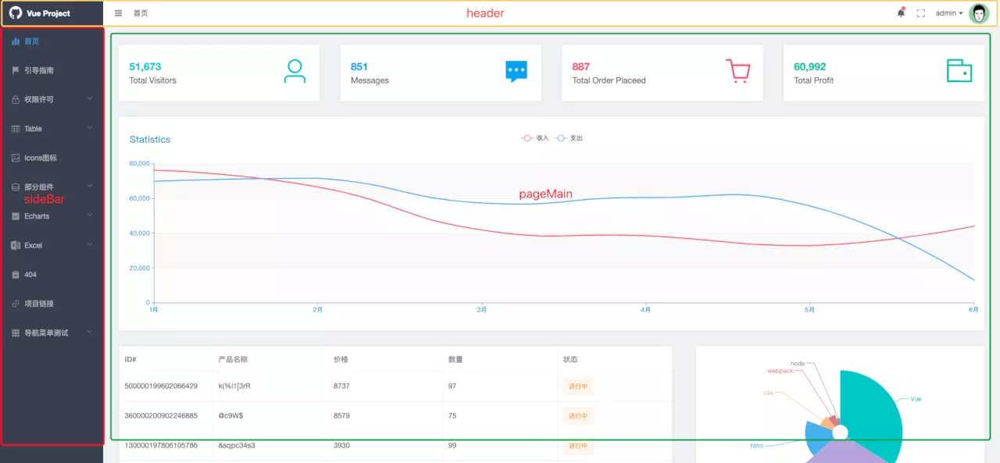
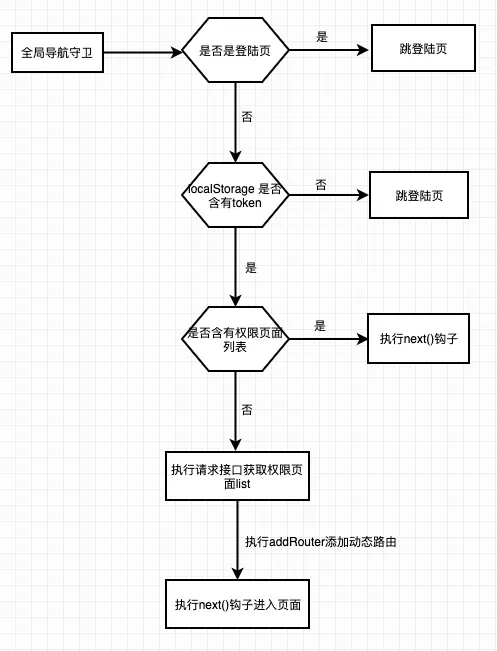
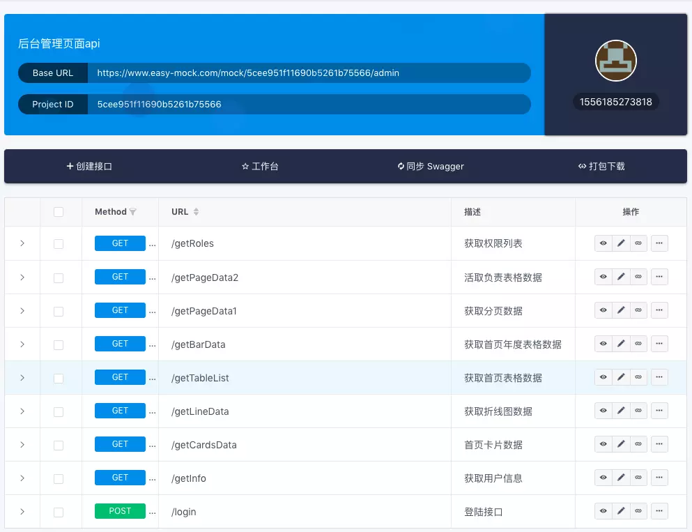
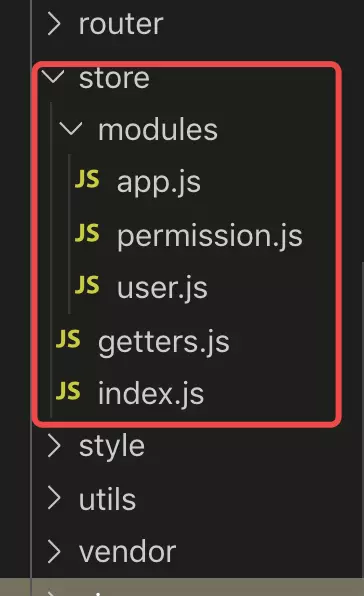

# 正确姿势开发vue后台管理系统

> 项目地址 [vue-admin-webapp](https://link.juejin.im/?target=https%3A%2F%2Fgithub.com%2Fgcddblue%2Fvue-admin-webapp) 欢迎star，fork

## 前言

相信许多人和我一样刚接触 vue 时看文档都很枯燥，看完 vue，还有 vueRouter 、vuex 、vue-cli、es6 (学不动了。。。 ) 对于看完教程之后又迟迟不能上手实际项目，只能写一些简单的小demo,这肯定和实际生产工作是有出入的，于是乎我就打算自己从零开始使用最新的技术栈搭建一个vue后台管理系统，依此加深对理论知识的学习，并增强自己的项目能力，所以希望本系列教程对你开发vue项目有所帮助。

## 1.项目基本简介

[vue-admin-webapp](https://link.juejin.im/?target=https%3A%2F%2Fgcddblue.github.io%2Fvue-admin-webapp) 是一个后台管理 spa 页面，它基于 [vue](https://link.juejin.im/?target=https%3A%2F%2Fgithub.com%2Fvuejs%2Fvue) 和 [element-ui](https://link.juejin.im/?target=https%3A%2F%2Fgithub.com%2FElemeFE%2Felement) 采用了最新的前端技术栈，实现了登录权限验证，动态路由生成，并使用 [easy-mock](https://link.juejin.im/?target=https%3A%2F%2Fgithub.com%2Feasy-mock%2Feasy-mock) 来模拟请求数据，实现了典型的业务模型案例，它可以帮你快速搭建后台管理系统模板，并根据实际的业务需求添加路由来实现企业级管理页面，相信本项目一定能帮助到你。

\- [在线预览-github](https://link.juejin.im/?target=https%3A%2F%2Fgcddblue.github.io%2Fvue-admin-webapp)

\- [在线预览-gitee](https://link.juejin.im/?target=https%3A%2F%2Fgcddblue.gitee.io%2Fvue-admin-webapp) （推荐国内用户）

**目前版本基于 webpack 4.0+ 和 vue-cli 3.x 版本构建，需要 Node.js 8.9或更高版本（推荐8.11.0+），相关知识可以自行进官网进行了解**

#### 功能

```
- 登录 / 注销
  - 登录仿GeeTest-极验安全策略
  
- 页面
  - 初次进入引导用户
  - sideBar收缩和展开
  - 全屏控制
  
- 侧边栏
  - 根据不同用户权限展示相应的动态左侧菜单
  
- 权限验证
  - 管理员页面
  - 权限设置
  
- 表格操作
  - 涉及平常业务遇到的相关表格操作（参考）
  
- Excel
 - Excel导出
 - Excel导入
 - 多级表头导出
 
- Echarts
 - 滑动显示更多数据
 - 动态切换charts
 - map地图使用
 
- Icons
 - element-icon
 - 阿里iconfont
```

#### 准备工作

在开始之前，请确保在本地安装 node 和 webpack 及 git。 本项目涉及的技术栈主要有 [ES6](https://link.juejin.im/?target=http%3A%2F%2Fes6.ruanyifeng.com%2F) 、[vue](https://link.juejin.im/?target=https%3A%2F%2Fcn.vuejs.org%2F) 、[vuex](https://link.juejin.im/?target=https%3A%2F%2Fvuex.vuejs.org%2Fzh%2F) 、[vue-router](https://link.juejin.im/?target=https%3A%2F%2Frouter.vuejs.org%2Fzh%2F) 、[vue-cli](https://link.juejin.im/?target=https%3A%2F%2Fcli.vuejs.org%2Fzh%2Fguide%2F) 、[axios](https://link.juejin.im/?target=http%3A%2F%2Fwww.axios-js.com%2F) 、[webpack](https://link.juejin.im/?target=https%3A%2F%2Fwww.webpackjs.com%2F) 、[element-ui](https://link.juejin.im/?target=https%3A%2F%2Felement.eleme.io%2F%23%2Fzh-CN) 、[easyMock](https://link.juejin.im/?target=https%3A%2F%2Fwww.easy-mock.com%2F) ,所以你最好提前熟悉了解这些知识，这将对你认识学习该项目有很大帮助

#### 目录结构

下面是整个项目的目录结构

```
├── public                     # 静态资源
│   ├── favicon.ico            # favicon图标
│   └── index.html             # html模板
├── src                        # 源代码
│   ├── api                    # 所有请求
│   ├── assets                 # 图片、字体等静态资源
│   ├── components             # 全局公用组件
│   ├── layout                 # 页面整体布局盒子
│   ├── mixins                 # 全局混入模块
│   ├── plugins                # 全局插件部分
│   ├── router                 # 路由
│   ├── store                  # 全局store管理
│   ├── style                  # 全局样式
│   ├── utils                  # 全局公用方法
│   ├── vendor                 # 公用vendor（excel导入导出）
│   ├── views                  # views所有页面
│   ├── App.vue                # 入口页面
│   ├── main.js                # 入口文件 加载组件 初始化等
├── .borwserslistrc            # 浏览器兼容相关
├── .env.xxx                   # 环境变量配置&emsp;
├── .eslintrc.js               # eslint 配置项
├── .gitignore.js              # git忽略文件设置
├── .babelrc.config.js         # babel-loader 配置
├── package.json               # package.json
├── postcss.config.js          # postcss 配置
└── vue.config.js              # vue-cli 配置
```

#### 安装

```
# 克隆项目
git clone git@github.com:gcddblue/vue-admin-webapp.git

# 进入项目目录
cd vue-admin-webapp

# 安装依赖
npm install

# 启动服务
npm run serve
```

启动完成后将打开浏览器访问 `http://localhost:8080`,接下来你就可以根据自己的实际需求，可以添加或修改路由，编写自己的业务代码。

## 2.页面架构




除去登录页外，整个页面架构由三个部分组成 `头部` `侧边栏` `右侧内容页` 在项目@/layout/index.js文件中对对这三个组件进行封装，通过点击左侧菜单切换右侧`router-view` 的路由更替，对应的项目文件如下


## 3.axios封装

在vue项目中，和后台进行请求交互这块，我们通常都会选择axios库，它是基于promise的http库，可运行在浏览器端和node.js中。在本项目中主要实现了请求和响应拦截，get，post请求封装。

#### 配置不同环境


通过在项目中创建不同环境的文件，我这里只创建了开发和生产环境的，当然，你也可以创建基于测试的`.env.test` 等文件，以`.env.production` 为例：

```
ENV = 'production'
# base api
VUE_APP_BASE_API = 'https://www.easy-mock.com/mock/5cee951f11690b5261b75566/admin'
```

只要以 `VUE_APP_` 开头的变量都会被 `webpack.DefinePlugin` 静态嵌入到客户端的包中。你可以在应用的代码中这样访问它们，例如我在@/api/index.js中初始化axios：

```
const $axios = axios.create({
  timeout: 30000,
  // 基础url，会在请求url中自动添加前置链接
  baseURL: process.env.VUE_APP_BASE_API
})
```

通过创建api文件夹将所有接口都集中在这个文件夹中，根据不同的业务创建不同js文件，来更好的划分接口的功能，其中index.js中代码如下：

```
import axios from 'axios'
import Qs from 'qs' // 处理post请求数据格式
import store from '@/store'
import router from '@/router'
import Vue from 'vue'
import { Loading, Message } from 'element-ui' // 引用element-ui的加载和消息提示组件

const $axios = axios.create({
  // 设置超时时间
  timeout: 30000,
  // 基础url，会在请求url中自动添加前置链接
  baseURL: process.env.VUE_APP_BASE_API
})
Vue.prototype.$http = axios // 这里并发请求以便在组件使用this.$http.all()，具体看dashborad页面

// 在全局请求和响应拦截器中添加请求状态
let loading = null

/**
 * 请求拦截器
 * 用于处理请求前添加loading、判断是否已保存token，并在每次请求头部添加token
 */
$axios.interceptors.request.use(
  config => {
    loading = Loading.service({ text: '拼命加载中' })
    const token = store.getters.token
    if (token) {
      config.headers.Authorization = token // 请求头部添加token
    }
    return config
  },
  error => {
    return Promise.reject(error)
  }
)
/**
 * 响应拦截器
 * 用于处理loading状态关闭、请求成功回调、响应错误处理
 */
$axios.interceptors.response.use(
  response => {
    if (loading) {
      loading.close()
    }
    const code = response.status
    // 请求成功返回response.data
    if ((code >= 200 && code < 300) || code === 304) {
      return Promise.resolve(response.data)
    } else {
      return Promise.reject(response)
    }
  },
  error => {
    if (loading) {
      loading.close()
    }
    console.log(error)
    if (error.response) {
      switch (error.response.status) {
        case 401:
          // 返回401 清除token信息并跳转到登陆页面
          store.commit('DEL_TOKEN')
          router.replace({
            path: '/login',
            query: {
              redirect: router.currentRoute.fullPath
            }
          })
          break
        case 404:
          Message.error('网络请求不存在')
          break
        default:
          Message.error(error.response.data.message)
      }
    } else {
      // 请求超时或者网络有问题
      if (error.message.includes('timeout')) {
        Message.error('请求超时！请检查网络是否正常')
      } else {
        Message.error('请求失败，请检查网络是否已连接')
      }
    }
    return Promise.reject(error)
  }
)

// get，post请求方法
export default {
  post(url, data) {
    return $axios({
      method: 'post',
      url,
      data: Qs.stringify(data),
      headers: {
        'Content-Type': 'application/x-www-form-urlencoded; charset=UTF-8'
      }
    })
  },
  get(url, params) {
    return $axios({
      method: 'get',
      url,
      params
    })
  }
}
```

如上，大家可以看我的注释说明，axios配置的封装是整个项目中很重要的模块，其实在不同的项目中，axios封装都大同小异，所以，只要掌握了一种技巧，下次开发新项目也就很容易完成封装这块。

## 4.权限验证及侧边栏

#### 路由

路由是组织一个vue项目的关键，在对项目原型分析后，接下来的第一步就是编写路由，本项目中，主要分为两种路由，`currencyRoutes` 和 `asyncRoutes`

`currencyRoutes`：代表通用路由，意思就是不需要权限判断，不同角色用户都显示的页面，如：登陆页、404等

`asyncRoutes`： 代表动态路由，需要通过判断权限动态分配的页面，有关的权限判断的方法接下来会介绍。

路由相关配置说明：

```
/**
 * 路由相关属性说明
 * hidden: 当设置hidden为true时，意思不在sideBars侧边栏中显示
 * mete{
 * title: xxx,  设置sideBars侧边栏名称
 * icon: xxx,  设置ideBars侧边栏图标
 * noCache: true  当设置为true时不缓存该路由页面
 * }
 */
```

#### 权限验证动态添加侧边栏

本项目通过路由联动更新侧边栏，所有侧边栏配置都是在前端完成的，通过访问接口，后端会返回一个权限相关的list数组，其中数组值为路由的name属性值，前端通过递归遍历`asyncRoutes`判断权限list中是否包含有对应的name路由，最终会返回包含该用户角色所有权限路由页面的addRoutes的数组对象。

具体实现是在路由index.js中设置一个全局前置导航守卫，具体判断流程如下：



```
// 导航守卫
router.beforeEach(async (to, from, next) => {
  document.title = getTitle(to.meta.title)
  if (to.path === '/login') {
    next()
  } else {
    if (store.getters.token) {
      const hasRoles = store.getters.roles.length > 0
      if (hasRoles) {
        next()
      } else {
        try {
          const { roles } = await store.dispatch('user/_getInfo')
          const addRoutes = await store.dispatch(
            'permission/getAsyncRoutes',
            roles
          )
          router.addRoutes(addRoutes)
          // hack method to ensure that addRoutes is complete
          // set the replace: true, so the navigation will not leave a history record
          next({ ...to, replace: true })
        } catch (error) {
          Message.error(error)
        }
      }
    } else {
      next({
        path: '/login',
        query: {
          redirect: to.fullPath
        }
      })
    }
  }
})
```

这里我在通过addRoutes添加路由时，遇到一个bug，当切换角色时，并不能删除之前添加动态路由，所以这边重新初始化`router.matcher`的属性方式实现：

```
const creatRouter = () => {
  return new Router({
    routes: currencyRoutes,
    scrollBehavior() {
      return { x: 0, y: 0 }
    }
  })
}
const router = creatRouter()

// 解决addRoute不能删除动态路由问题
export function resetRouter() {
  const reset = creatRouter()
  router.matcher = reset.matcher
}
```

当我每次退出登录的时候执行`resetRouter`方法来初始化router对象，实现删除之前动态添加的路由。

最后通过element-ui的el-menu组件来递归遍历路由对象加载侧边栏。

## 5.Mock数据

身为前端开发人员，相信大家都知道Mock数据吧，它的作用主要就是伪造假数据使团队可以并行开发，本项目使用了 [easy-mock](https://link.juejin.im/?target=https%3A%2F%2Fwww.easy-mock.com%2F) 来实现接口数据的请求，大家可以去官网看下简单教程，`easy-mock` 它的好处就是不用像传统mock数据那样需要在项目中创建mock文件夹并拦截ajax来实现假数据请求，它是真真实实的api请求，并允许任何跨域请求，下面是本项目所有接口



其中所有接口通过创建 `_res` 字段来判断请求是否含有Authorzation头部字段是否含有token来判断用户是否是登陆状态，如下 getCardsData接口的配置：

```
{
  code: 0,
  data: {
    vistors: '@integer(10000, 100000)',
    message: '@integer(100, 1000)',
    order: '@integer(0, 1000)',
    profit: '@integer(1000, 100000)'
  },
  _res: function({
    _req,
    Mock
  }) {
    if (!_req.header.authorization) {
      return {
        status: 401,
        data: {
          msg: '未授权'
        }
      }
    } else {
      return {
        status: 200
      }
    }
  }
}
```

mock数据在项目开发中能够起到推进项目进度的功效，大家可以预先和后端人员商量好，并先拿到假数据字段，然后mock自己的假数据，这样你就可以不用等后端人员开发接口而使项目卡住。一般在项目中，创建`.env.development` 和`.env.production` 文件，代表了开发和生产环境，在文件里可以定义不同环境接口的请求url

```
# base api
VUE_APP_BASE_API = 'https://www.easy-mock.com/mock/5cee951f11690b5261b75566/admin'
```

在封装axios这样初始化

```
const $axios = axios.create({
  // 设置超时时间
  timeout: 30000,
  // 基础url，会在请求url中自动添加前置链接
  baseURL: process.env.VUE_APP_BASE_API
})
```

这样就可以自动根据不同的环境切换请求地址，不用我们一个一个的修改每一个请求接口

## 6.登录

通过将登录函数封装在store中，当点击登陆时，调用`this.$store.dispatch('user/_login', this.ruleForm)` 这个action方法，当后台接口验证成功时，会返回 `token` 字段，前端会调用 `localStroage` 接口将这个 `token` 保存在本地，以后每次请求前通过拦截器将这个token保存在 `Authorization` 这个头部字段中，后台只要验证这个token就知道这个用户的信息了。还不只token的同学，可以 [疯狂点击token说明](https://link.juejin.im/?target=http%3A%2F%2Fwww.ruanyifeng.com%2Fblog%2F2018%2F07%2Fjson_web_token-tutorial.html) 里面对http为什么要添加toekn及token介绍的都很详细。

这里我还采用了仿 [geetest](https://link.juejin.im/?target=https%3A%2F%2Fwww.geetest.com%2F) 行为验证，通过滑动图片来验证真人操作，其中原理利用 h5 canves绘制功能，绘制底部图片和滑块图片，然后监听mouseMove事件，当滑动block抠出的图片和初始化图片的y坐标差小于10时触发验证成功函数。

## 7、优化及小技巧

#### 巧用Mixins

如果你的多个组件都用到一个或多个方法，我们可以不用每次都粘贴复制，这样岂不是很low，我们可以将这些方法封装在一个js文件中,当我的某个组件需要调用这个方法时

```
import aMixin from '@/mixins/a-mixin'
export default {
  name: 'page1',
  mixins: [newsMixin]  //调用mixins属性，将aMixin这个模块的数据及方法等都添加进这个组建吧
}
```

[mixins的使用使用规则](https://link.juejin.im/?target=https%3A%2F%2Fcn.vuejs.org%2Fv2%2Fguide%2Fmixins.html)

#### Object.freeze方法

这个方法有什么用呢，它主要是可以将一个对象冻结，防止对象被修改，那这个对vue项目有什么优化作用呢，大家都知道vue采用了**数据劫持**的方式遍历数据对象，把这些属性转为getter、settter方法来监听并通知数据的变化，所以当你遇到一个巨大的数组或者对象，并且确定数据不会修改，这时就可以使用 `Object.freeze()` 方法来组织vue对这个巨大数据的转化，，这可以让性能得到很大的提升，举个例子：

```
new Vue({
    data: {
        // vue不会对list里的object做getter、setter绑定
        list: Object.freeze([
            { value: 1 },
            { value: 2 }
        ])
    },
    mounted () {
        // 界面不会有响应
        this.list[0].value = 100;

        // 下面两种做法，界面都会响应
        this.list = [
            { value: 100 },
            { value: 200 }
        ];
        this.list = Object.freeze([
            { value: 100 },
            { value: 200 }
        ]);
    }
})
```

#### 自动化导入模块

当我们某个组件或js文件需要引入多个模块时，一般做法就是，import每个模块，这样显然是相当繁琐的，这时 `require.context` 函数将派上用场，那个这个函数到底怎么用呢，这里官法介绍是 **主要用来实现自动化导入模块,在前端工程中,如果遇到从一个文件夹引入很多模块的情况,可以使用这个api,它会遍历文件夹中的指定文件,然后自动导入,使得不需要每次显式的调用import导入模块**

`require.context` 函数接受三个参数：

1. directory {String} -读取文件的路径
2. useSubdirectories {Boolean} -是否遍历文件的子目录
3. gExp {RegExp} -匹配文件的正则

如

```
require.context('./test', false, /.test.js$/)
#上面的代码遍历当前目录下的test文件夹的所有.test.js结尾的文件,不遍历子目录
```

`require.context` 函数执行后返回一个函数，并且这个函数包含了三个属性：

1. resolve {Function} -接受一个参数request,request为test文件夹下面匹配文件的相对路径,返回这个匹配文件相对于整个工程的相对路径
2. keys {Function} -返回匹配成功模块的名字组成的数组
3. id {String} -执行环境的id,返回的是一个字符串

我们常会遍历keys返回的数组来对路径进行处理，这是相当方便的，最后 `require.context` 返回的函数接受keys放回数组中的路径成员作为参数，并返回这个路径文件的模块

下面是我使用 `require.context` 函数动态生成moudles对象



```
import Vue from 'vue'
import Vuex from 'vuex'
import getters from './getters'
const path = require('path')

Vue.use(Vuex)

const files = require.context('./modules', false, /\.js$/)
let modules = {}
files.keys().forEach(key => {
  let name = path.basename(key, '.js')
  modules[name] = files(key).default || files(key)
})
const store = new Vuex.Store({
  modules,
  getters
})
export default store
```

#### cdn引入

对于一些不常改动的模块库，例如： `vue` `vueRouter` `vuex` `echarts` `element-ui` 等， 我们让 `webpack` 不将他们进行打包，而是通过 `cdn` 引入，这样就可以减少代码大小，减少服务器带宽，并通过cdn将它们缓存起来，提高网站性能 。

具体实现就是修改 `vue.config.js` ,为对象模块添加 `externals` 完整配置如下：

```
const cdn = {
	css: [
		// element-ui css
   'https://unpkg.com/element-ui/lib/theme-chalk/index.css'
	],
	js: [
		// vue
    'https://unpkg.com/vue/2.5.22/vue.min.js',
    // element-ui
    'https://unpkg.com/element-ui/lib/index.js',
    // vue
    'https://unpkg.com/vuex/3.1.0/vuex.min.js'
	]
}
# 不打包vue、element-ui、vuex
module.exports = {
	externals: {
		vue: 'Vue',
  	'element-ui':'ELEMENT',
  	vuex: 'Vuex'
  },
  chainWebpack: config => {
  	config.plugin('html')
        .tap(args => {
          args[0].cdn = cdn
          return args
        })
  }
}
```

接下来修改 `index.html`

```
<!DOCTYPE html>
<html lang="en">
  <head>
    <meta charset="utf-8">
    <meta http-equiv="X-UA-Compatible" content="IE=edge">
    <meta name="viewport" content="width=device-width,initial-scale=1.0">
    <link rel="icon" href="<%= BASE_URL %>favicon.ico">
    <% if (process.env.NODE_ENV === 'production') { %>
    	<!-- 引入样式 -->
      <% for(var css of htmlWebpackPlugin.options.cdn.css) { %>
        <link rel="stylesheet" href="<%=css%>">
      <% } %>
      <!-- 引入js -->
      <% for(var js of htmlWebpackPlugin.options.cdn.js) { %>
        <script src="<%=js%>"></script>
      <% } %>      
    <% } %>
    <title>vue-admin-webapp</title>
  </head>
  <body>
    <noscript>
      <strong>We're sorry but vue-admin-webapp doesn't work properly without JavaScript enabled. Please enable it to continue.</strong>
    </noscript>
    <div id="app"></div>
    <!-- built files will be auto injected -->
  </body>
</html>
```

好了，大公告成

#### vue cli3多页面配置

可以关注我的另一篇文章 [正确姿势使用vue cli3配置多页项目](https://juejin.im/post/5d677c74f265da03b1205fbc)

#### vue cli3初始化项目

可以关注我的另一篇文章 [正确姿势使用vue cli3创建项目](https://juejin.im/post/5d615cdcf265da03a715de23)

## 总结

这个项目是我在上班之余断断续续开发的，没太写过技术贴，文笔和逻辑组织能力还是相当差的，大家见谅。起初在没开始做之前觉得应该相当的顺利的，没想到真正一步一步实现时，还是和自己最初设想是有出入的，期间遇到了不少的bug，大多都是因为细节不注意，也让我更加体会 **好记性不如烂笔头** 这句话，实践才是真理啊，多动手，多探索。最后我会考虑使用 [uni-app](https://link.juejin.im/?target=https%3A%2F%2Funiapp.dcloud.io%2F) 这个框架来开发多平台（小程序、android、ios、h5）移动版vue后台管理系统，期待吧...