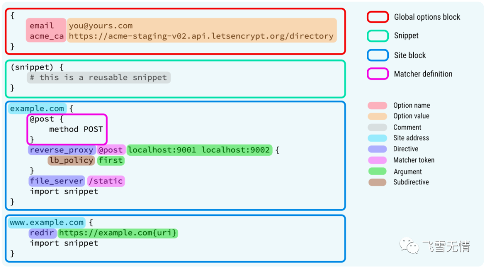

# Caddy实战

## Caddy是什么

相信大家都知道apache、nginx，那么caddy也一样，它是一个Web服务器，可以帮你托管你的Web服务，让其他人可以通过互联网访问。相比nginx来说，它配置更简单。

## 安装Caddy

得益于Go语言，caddy是一个独立的二进制包，所以它没有任何依赖，你可以直接从官网下载并安装它。

访问`https://caddyserver.com/download`，根据你自己的操作系统选择相应的二进制安装包

### Docker下使用

caddy也支持dokcer，所以可以在dokcer中直接使用它。

```bash
docker pull caddy
```

## 一、托管你的网站

假设你的网站存放在`~/mysite`目录下，在终端运行如下命令，即可在浏览器中访问你的网站。

```
➜ caddy file-server --root ~/mysite
```

如果想通过一个名字比如`localhost`，就需要通过`--domain`来指定。

```
 caddy file-server --root ~/mysite --domain localhost
```

### 在公网上访问你的网站

首先你需要有一台具备公网IP的服务器，把你的网站目录文件放在这台服务器上。

其次你要有自己的域名，比如我自己的网站www.flysnow.org,服务器的公网IP是`113.105.165.142`，那么你需要在DNS解析中配置www的A记录为`113.105.165.142`。

现在，在这台服务器上运行如下命令，即可让所有人都可以访问你的网站,而且是HTTPS的。

```
 caddy file-server --root ~/mysite --domain www.flysnow.org
```

## 二、Caddy命令行参数最全教程

### 命令行参数用法

Caddy是一个标准的unix-like命令，它的基本用法为:

```
caddy <command> [<args...>]
```

其中:

1. `command`是caddy的子命令，比如上一篇文章中的`file-server`。子命令是必须的，不能省略。
2. `args…`是子命令的参数，可以是0个，也可以是多个。

### run命令

`run`会运行一个前台caddy进程，直到你使用`ctrl+c`或者关闭终端退出。它的用法为：

```
usage:
  caddy run [--config <path> [--adapter <name>]] [--envfile <path>] [--environ] [--resume] [--watch] [--pidfile <fil>]

flags:
  -adapter string
        如果你使用的配置文件不是以Caddyfile开头的，那么要使用这个标记来指定，比如-adapter caddyfile。
  -config string
        启动Caddy使用的配置文件
  -envfile string
        从指定的文件加载环境变量，环境变量的格式为KEY=VALUE
  -environ
        打印环境变量
  -pidfile string
        这个大家都知道，用于存放PID的文件
  -pingback string
        启动成功的信息要回显到pingback指定的ip:port上，这里是通过tcp拨号发送回显信息的。
  -resume
        这个挺有意思，会使用最近一次自动保存的配置，这对于恢复一个caddy非常有用。这里需要注意的是，当使用这个标记的时候，通过config标记指定的配置就不再生效了。
  -watch
        这个其实就是在检测到你的配置文件发生变化的时候，自动重新加载配置,这个不要在生产环境使用，自己开发环境用用就得了。
```

现在来看几个例子，这样可以更好的理解`run`这个命令。

```bash
# 加载当前目录下名称为Caddyfile的配置文件启动caddy，并且监控到配置文件改变的时候，自动重新加载配置。
➜ caddy run -config Caddyfile -watch
# 增加一个pid文件
➜ caddy run -config Caddyfile -watch -pidfile /var/run/flysnow.pid
```

### start命令

`start`命令的使用`run`一样，不同的是`start`会启动一个在后台运行的caddy,这意味着它不会阻塞终端的使用，你可以去做其他甚至退出当前终端，但是一个caddy已经被启动了，你可以正常访问托管的网络服务。

### stop命令

`start`命令对应的就是`stop`命令，需要使用`stop`命令通知后台正在运行的caddy。如果你的`start`是使用默认的`localhost:2019`管理地址启动的，那么直接使用`stop`命令就可以优雅的停止caddy，如果不是默认的，那么需要使用`-address`来指定管理地址。

```bash
# 因为我的caddy的管理地址是localhost:2021，所以需要指定才可以停止caddy
caddy stop -address localhost:2021
```

> 这里有个小提示，caddy在启动后，不仅可以通过终端命令来管理它，还可以通过API，也就是说caddy提供了一组API服务，用于管理它自身，比如加载配置等。这组管理API默认的地址就是`localhost:2019`，所以当你的caddy启动起来后，在浏览器里输入这个地址，就可以看到相应的配置信息了。

### reload命令

通过`satrt`启动的caddy是不轻易停止的，因为这会导致网络服务不可用。但是你又想使你修改的配置文件生效，怎么办呢？caddy提供了`reload`命令可以帮我们做到。

```bash
➜  ~ caddy help reload
usage:
  caddy reload --config <path> [--adapter <name>] [--address <interface>]

flags:
  -adapter string
        Name of config adapter to apply
  -address string
        Address of the administration listener, if different from config
  -config string
        Configuration file (required)
  -force
        Force config reload, even if it is the same
```

### file-server命令

这个命令可以启动一个文件服务，比如托管一个静态网站等等。

```bash
➜  ~ caddy help file-server
//我特意省略了很多描述，不然文字太多了
usage:
  caddy file-server [--domain <example.com>] [--root <path>] [--listen <addr>] [--browse] [--access-log]

flags:
  -access-log
        启用访问日志
  -browse
        启用目录浏览
  -domain string
        指定一个域名
  -listen string
        监听的地址，http默认是:80,https默认是:443
  -root string
        要托管的文件服务的根目录
  -templates
        启用模板渲染
```

### reverse-proxy 命令

在caddy中，配置一个反向代理非常简单，使用`reverse-proxy`命令即可。

```bash
➜  ~ caddy help reverse-proxy
usage:
  caddy reverse-proxy [--from <addr>] [--to <addr>] [--change-host-header]

flags:
  -change-host-header
        变更主机头，从传入的值变为上游的值
  -from string
        用户访问的地址，默认是localhost
  -insecure
        禁用TLS
  -to string
        被代理的上游地址,用户看不到这个地址
```

比如你有个后端服务`127.0.0.1:9000`，想要代理到`localhost`，运行如下命令即可。

```bash
➜  ~ caddy reverse-proxy --to 127.0.0.1:9000
```

现在，使用`localhost`访问，其实就是访问的`127.0.0.1:9000`这个后端服务。

假如你想换个端口访问，比如`localhost:2016`，只需要运行如下命令即可。

```bash
➜  ~ caddy reverse-proxy --from :2016 --to 127.0.0.1:9000
```

### adapt 命令

caddy是有自己的配置文件的，它叫Caddyfile，这是一种可读性、书写性非常强的配置文件，类似Nginx 的Config，但是它并不是caddy的原生配置文件，caddy的原生配置文件是JSON的，但是非常复杂。

adapt这个命令就是给我们提供了Caddyfile转JSON原生配置的能力，让我们可以看到真实的配置是什么。它的用法如下：

```bash
➜  ~ caddy help adapt
usage:
  caddy adapt --config <path> [--adapter <name>] [--pretty] [--validate]
flags:
  -adapter string
        配置适配器的名字，默认是 caddyfile。其实就是告诉命令，要使用什么样的适配器，把相应的配置转为JSON原生配置
  -config string
        配置文件
  -pretty
        是否美化输出
  -validate
        可以帮助检验下输出，其实并没有真正的运行caddy
```

比如最简单的Caddyfile，只有一行`localhost`，使用`adapt`命令转为JSON原生配置的结果如下：

```bash
➜  ~ caddy adapt --config ~/Desktop/Caddyfile --pretty
{
    "apps": {
        "http": {
            "servers": {
                "srv0": {
                    "listen": [
                        ":443"
                    ],
                    "routes": [
                        {
                            "match": [
                                {
                                    "host": [
                                        "localhost"
                                    ]
                                }
                            ],
                            "terminal": true
                        }
                    ]
                }
            }
        }
    }
}
```

还是非常复杂的，包括端口、路由的配置都有，所以还是用Caddyfile配置效率最高，可读性也强。

### fmt命令

这是caddy提供的一个辅助工具，可以帮你格式化你的Caddyfile配置文件，让它更美观。

```bash
➜  ~ caddy help fmt
usage:
  caddy fmt [--overwrite] [<path>]

flags:
  -overwrite
        用格式化后的结果，覆盖你的配置文件
```

整个命令非常简单，比如我想用这个命令把我的配置文件美化下，并且把美化的结果覆盖我的配置文件，可以这么做。

```bash
➜  ~ caddy fmt --overwrite ~/Desktop/Caddyfile
```

### environ命令

打印caddy知道的环境变量，你可以看到很多关于caddy自身和你的系统环境的信息，这对于你调试caddy命令非常有用，比如启动不了？路径设置是否错误等等。

它的用法非常简单，在终端输入如下命令，即可看到环境变量信息。

```bash
➜  ~ caddy environ 
```

### hash-password命令

一个自带的密码Hash工具，主要用来为配置文件的授权提供Hash过的密码，因为不能配置明文密码。

```bash
➜  ~ caddy help hash-password
usage:
  caddy hash-password [--algorithm <name>] [--salt <string>] [--plaintext <password>]

flags:
  -algorithm string
        Hash算法，支持scrypt和bcrypt两种，默认是bcrypt
  -plaintext string
        要Hash的明文密码
  -salt string
        加点盐，仅当Hash算法是scrypt有效
```

看看这个工具运行的效果。

```bash
➜  ~ caddy hash-password  --plaintext 1
JDJhJDE0JGJLdzc0M0R1bDUzOTNTWGVJSTV4QU9kMGpQNC5WQTBnZ1E4N3FKOVpXUmQ1NEE2dmRzMWR1
```

### list-modules命令

caddy是支持模块的，而且我们可以开发自己的模块，所以这个命令可以列出caddy当前已经安装的模块。

```bash
➜  ~ caddy list-modules --packages
admin.api.load
admin.api.metrics
admin.api.reverse_proxy
caddy.adapters.caddyfile
caddy.config_loaders.http
caddy.listeners.tls
caddy.logging.encoders.console
caddy.logging.encoders.filter
caddy.logging.encoders.filter.delete
caddy.logging.encoders.filter.ip_mask
caddy.logging.encoders.filter.replace
caddy.logging.encoders.json
caddy.logging.encoders.single_field
......
```

### build-info命令

打印caddy的构建信息，主要是GoModule的依赖信息，包括包名、版本等。

### trust命令

安装一个根证书到本地信任存储中，可能会需要密码才能安装，主要用于开发环境。大部分情况下，这个命令是用不到的，因为caddy启动的时候会自动安装证书。

### untrust命令

从本地信任存储中，卸载一个根证书，也是用于开发环境，和上面的`trust`命令是对应的。

```bash
➜  ~ caddy help untrust
usage:
  caddy untrust [--ca <id> | --cert <path>]

flags:
  -ca string
        要卸载CA证书的ID，默认为local
  -cert string
        要卸载CA证书的路径
```

### upgrade命令

这个是升级caddy的命令，它会下载最新的二进制文件，然后把本地的给替换了。这个过程并不会停止caddy服务，所以不用担心，它仅仅是替换你的caddy文件。

当然，为了保险起见，原来的二进制文件还是要备份一下。

### validate命令

这是一个验证Caddyfile配置文件的命令，它会模拟启动caddy，但是并不会真的启动。验证的过程中，遇到的问题，会在控制台输出。它的使用和`adapt`命令基本上一致。

```bash
➜  ~ caddy help validate
usage:
  caddy validate --config <path> [--adapter <name>]
flags:
  -adapter string
        配置适配器的名字，默认是 caddyfile
  -config string
        配置文件的路径
```

## 三、Caddyfile 快速入门

虽然JSON配置很强大，但是配置繁琐，不容易理解。在caddy中，最常用的配置caddy的方式还是Caddyfile，这是caddy的配置文件，类似Nginx的config。它通俗易懂、配置简单，容易上手，如果你以前会用nginx，那么上手Caddyfile也会非常容易。

### 创建一个Caddyfile文件

Caddyfile没什么特殊的，就是一个普通的文本文件，只不过它的名字是Caddyfile，并且没有扩展名。

现在配置一个域名为`localhost`的服务，这样你就可以在浏览器中通过地址`localhost`来访问它。

*Cad**d**yfi**l**e*

```
localhost
```

就是这么简单，这是最简单的Caddyfile配置。
现在使用`caddy start`命令即可启动，如果Caddyfile在当前目录则不用指定配置文件；如果不再当前目录，则需要使用`--config`参数指定配置文件。

```
➜  ~ caddy start --config ~/Desktop/Caddyfile 
```

因为默认会启用HTTPS，所以网络服务会在443端口监听。

### Hello World

现在如果你访问https://localhost/, 你只能看到一个空白页面，现在我让它显示出一个`Hello World`来。

*Caddyfile*

```
localhost
respond "Hello, world!"
```

现在再运行这个Caddyfile配置，通过浏览器访问，就可以看到`Hello World`了。

```
➜  ~ curl https://localhost
Hello, world!%    
```

### 配置多个Web服务

既然caddy是一个Web服务器，那么就不止可以托管一个Web站点，如果需要托管多个，怎么做呢？

*Caddyfile*

```nginx
localhost {
    respond "Hello, world!"
}
localhost:2016 {
    respond "Goodbye, world!"
}
```

如上示例所以，就定义了两个站点，一个是`localhost`，一个是`localhost:2016`，启动caddy后，这两个地址都可以访问。
从上面的配置可以看到，要配置多个站点，就需要使用`{}`大括号把每个站点括起来，而只有一个站点的时候，就不需要了。

### 静态文件服务

还记得使用命令行托管一个网站的操作吧，使用Caddyfile也能达到同样的效果。Caddyfile配置如下所示：

```nginx
www.flysnow.org {
  root * /var/www/mysite
  file_server 
}
```

## 四、使用API管理Caddy

和Nginx不一样的是，Caddy还可以使用API来管理，通过这个能力，你可以在CI、CD的时候，对caddy做更多的事情，也更灵活。

### 查看配置

首先，我们启动一个caddy实例，然后通过caddy提供的`/config`API查看它的配置。

```
➜ caddy run
```

启动后，caddy 的管理API会在2019端口监听，现在，我们通过访问`/config`API，看下它的配置是什么。

```
➜  ~ curl localhost:2019/config/
null
```

从以上返回结果看，并没有任何配置，也就是没有任何配置的网络服务。
现在，我们通过API接口来配置一个。

### 配置Hello World

要实现访问`localhost`就可以看到Hello World，我们需要对caddy进行配置。前面的教程中，我们是通过命令行或者Caddyfile配置的，这一次呢，我们通过`load`这个API来配置caddy。

首先，我们还是要准备一个Caddyfile，它的内容如下所示：

```bash
localhost {
  respond "Hello, world!"
}
```

然后，我们使用`curl`这个工具，通过caddy的`load`API 上传Caddyfile 配置caddy。

```bash
➜ curl -X POST "http://localhost:2019/load" \
-H "Content-Type: text/caddyfile" \
--data-binary @Caddyfile
```

这里需要注意的是，执行以上命令的目录下一定要有Caddyfile，因为我使用的是`@Caddyfile`，是一个相对路径，如果不是，请换成Caddyfile的绝对路径。
现在，再通过`curl localhost:2019/config/`访问，就可以看到caddy的配置了。

```bash
➜ curl localhost:2019/config/ |jq 
{
  "apps": {
    "http": {
      "servers": {
        "srv0": {
          "listen": [
            ":443"
          ],
          "routes": [
            {
              "handle": [
                {
                  "handler": "subroute",
                  "routes": [
                    {
                      "handle": [
                        {
                          "body": "Hello, world!",
                          "handler": "static_response"
                        }
                      ]
                    }
                  ]
                }
              ],
              "match": [
                {
                  "host": [
                    "localhost"
                  ]
                }
              ],
              "terminal": true
            }
          ]
        }
      }
    }
  }
}
```

看到了吧，这就是我们刚刚通过`load`API 达到的重新配置的caddy，以上就是caddy最原始的JSON配置。

> jq 是一个JSON工具，如果你的电脑没有的话，可以Google搜索下安装，这里主要用来美化下输出的JSON

`/load`API就是一个可以重新设置、替换caddy的admin API，支持JSON文件和Caddyfile。

现在，在浏览器，或者通过curl 访问localhost，就可以看到Hello World了。

```bash
➜ curl https://localhost/
Hello, world!
```

### 更新部分配置

加入，现在我想把Hello World换成你好，世界，总不能再上传一个Caddyfile覆盖吧？

哈哈，当然不会，caddy 的Admin API提供了可以修改某一部分配置的能力。在caddy中，是可以支持通过URL 路径来指定要访问哪个配置节点的。

注意看我们上面列出的JSON的配置，按JSON节点找，看看Hello World在哪里。看下是不是这个？`apps/http/servers/srv0/routes/0/handle/0/routes/0/handle/0/body`，遇到JSON数组，要使用索引作为path，表示第几个元素。

现在把它和`/config/`拼接起来就是http://localhost:2019/config/apps/http/servers/srv0/routes/0/handle/0/routes/0/handle/0/body这样的一个URL。

可以访问下它，看看输出什么。

```bash
➜ curl http://localhost:2019/config/apps/http/servers/srv0/routes/0/handle/0/routes/0/handle/0/body
"Hello, world!"
```

成功访问，输出的正好是我们想修改的内容。

现在，通过POST的方法， 把它修改为：你好，世界。

```bash
➜ curl http://localhost:2019/config/apps/http/servers/srv0/routes/0/handle/0/routes/0/handle/0/body \     
-X POST \
-H "Content-Type: application/json" \
-d '"你好，世界!"'
```

以上命令回车后，现在你再用浏览器打开https://localhost/,就可以看到：你好，世界！了。

这种可以更新部分配置的方法非常实用，因为它风险小，可以结合编程自动化。

### 进一步简化配置

上面通过URL PATH遍历配置的方式很方便，可以让我们定位到配置，并且只修改需要修改的配置，但是就是URL太长了，这一小节就带你使用`@id`标记来简化它。

要想简化某项配置，首先我们得先给它添加一个标记，比如给上一节中我们要处理的`handle`添加一个快捷访问的标记`msg`

```bash
➜ curl http://localhost:2019/config/apps/http/servers/srv0/routes/0/handle/0/routes/0/handle/0/@id \ 
-X POST \
-H "Content-Type: application/json" \
-d '"msg"' 
```

以上命令执行后，在浏览器里打开http://localhost:2019/config/apps/http/servers/srv0/routes/0/handle/0/routes/0/handle/0/，你将看到如下结果：

```json
{"@id":"msg","body":"你好，世界!","handler":"static_response"}
```

现在，我们就可以通过这个`@id`标记快捷的访问它了,在浏览器中输入http://localhost:2019/id/msg，你会看到和上面的URL一样的输出结果。

所以，通过id标记，不管你是获取配置还是修改配置，URL都会非常简洁，也便于输入。

## 五、配置反向代理

使用Caddy如何配置反向代理呢？

### 反向代理入门

我在前面的文章 [Caddy实战（三）| Caddyfile 快速入门](http://mp.weixin.qq.com/s?__biz=MzI3MjU4Njk3Ng==&mid=2247485253&idx=1&sn=68a14540314acf67696ab95620392863&chksm=eb3106cadc468fdce4aa06dbd66884bc90d511ec87b6184bd26607b02980fbb928fe6153f99f&scene=21#wechat_redirect)中提到，通过一个命令就可以非常简单的配置一个反向代理。

```
$ caddy reverse-proxy --to 127.0.0.1:9000
```

就是这么简单， 以上命令表示把访问localhost的网络请求，都代理给127.0.0.1:9000这个服务处理。
当然也可以使用Caddyfile来配置反向代理，如下所示：

```
localhost
reverse_proxy 127.0.0.1:9000
```

这个配置的效果和上面的命令行启动是一样的。

> 注意：以上示例，都是把https://localhost/ 的请求代理到127.0.0.1:9000 。

以上http默认的是80端口，https默认的是443端口。当然，我们也可以换个端口，比如2016.

```
:2016
reverse_proxy 127.0.0.1:9000
```

是不是比Nginx的反向代理配置简单多了。

### 代理匹配的请求

caddy作为一个强大的web服务器，其反向打理功能肯定不止以上这么简单。比如，我们不想代理全部的网络请求，而是只想代理匹配的怎么做呢？比如代理 `/api` 这个Path下的。

```
reverse_proxy /api/*  {
    to 127.0.0.1:9000
}
```

从以上示例可以看到，只需要在 `reverse_proxy` 指令后，加 `/api/*` 这个match即可，这和Nginx的 `location` 是非常相似的。

### 代理到多个上游服务

为了高可用，上游服务我们会部署多少，这样当一个有问题的时候，不会影响产品功能。下面我们看下Caddy是如何实现这一能力的。

```
reverse_proxy node1:80 node2:80 node3:80
```

这样就会所有的请求，随机的反向代理到这三个node节点上了。
当然我们还可以这样配置：

```
reverse_proxy /api/*  {
    to node1:80 node2:80 node3:80
}
```

当同时配置多个反向代理服务的时候，就有了负载均衡了。以上默认的情况下，是随机的，也就是caddy会随机的选择一个上游服务使用。

## 六、反向代理中的负载均衡

为了保障系统的高可用，我们需要针对重要的服务启动多个，这样当其中的一个服务出问题的时候，其他服务可以继续工作，系统就做到了高可用，这也就是负载均衡的应用。

### 什么是负载均衡

> **负载平衡**（Load balancing）是一种电子计算机技术，用来在多个计算机（计算机集群）、网络连接、CPU、磁盘驱动器或其他资源中分配负载，以达到优化资源使用、最大化吞吐率、最小化响应时间、同时避免过载的目的。

以上来自于维基百科，这个定义看起来有点绕。其实在我们互联网中，负载均衡其实就用利用多态服务器提供单一服务，这种方案有时也被称为服务器农场。

比如我们常见的DNS负载均衡，其实就是对一个域名配置多个IP主机，这样当一个有问题的时候，其他的IP主机也可以正常的提供服务

负载均衡有很多负载，比如可以按照地理位置，给用户分配离他最近位置的IP，这样可以加快用户的访问速度；也可以根据响应时间、连接数等因素来进行灵活的调度。

### Caddy的负载均衡

只要定义了多个上游(upstream)，Caddy的反向代理就会使用负载均衡的能力，比如我们上篇***文章中的示例，就是用了负载均衡，代码如下所示：

```
reverse_proxy /api/*  {
    to node1:80 node2:80 node3:80
}
```

以上这个配置，它的负载均衡策略(调度方式)默认是随机的，我们可以通过 `lb_policy` 来指定不同的负载均衡策略，比如:

```
reverse_proxy /api/*  {
    to node1:80 node2:80 node3:80
    lb_policy first
}
```

以上代码指定的是 `first` 的负责均衡策略，也就是选择第一个可用的上游。

### 负载均衡策略

除了 `first` 外，还有很多负载均衡策略以供我们选择，下面就为你分别介绍他们。

1. first：选取第一个可用的上游

2. random：随机选取一个可用的上游

3. least_conn：选取当前请求数最少的上游,这个比较适合长连接的场景

4. ip_hash：根据IP的Hash值选取一个固定的上游

5. random_choose 

   ：随机选取2个或者更多个上游，然后再从中选择负载最小的，n通常为2

6. header：这个是根据请求头的Hash选取一个固定的上游，和 `ip_hash` 很像，只不过它是根据指定的请求头的值进行Hash，然后选取上游的。所以这里的用法是 `header `，要指定一个请求头。

7. uri_hash：这个也和 `ip_hash` 很像，只不过它是根据请求的URI进行Hash，然后选取一个上游。

8. round_robin：这个策略是循环迭代，挨个使用一个个上游，每个上游都可以被用到，轮着来。

9. cookie [

    []] ：如果你理解了以上几个基于Hash的负载均衡策略，那么这个 `cookie` 的也会很好理解，其实它就是通过cookie的值的hash来选取一个上游。在这里 `name` 表示要获取cookie值的 `name` ，默认是 `lb` ， `secret` 是用于Hash的密钥，使用的是Hamc256算法。

以上是Caddy支持的9个负载均衡策略，除了常规的first、random、least_conn外，其他几个主要是根据特定的『值』进行Hash，然后根据Hash后的值，再选取一个固定的上游，如ip_hash、uri_hash甚至cookie都是此类，只是实现的方式不同。

### 重试等待时间

当你设置了多个上游主机，启用了负载均衡后，不可避免的会遇到上游服务不可用的情况，默认情况下，Caddy的处理是：当上游服务器不可用的时候，客户端的请求就没有可用的服务来相应，客户端就会报错。

当然除了立即响应服务不可用，Caddy还提供了负责均衡的重试功能，这就是 `lb_try_duration` ，他可以设置一个重试的时间，比如1000毫秒。

这是什么意思呢？如果你设置了`lb_try_duration` 为1000毫秒，那么Caddy的负载均衡在处理该客户端请求时，如果选用了一个不可用的上游服务，就会继续重试，一直到找到一个可用的上游或者到了设置的1000毫秒时间为止。

也就是，这个时间，就是Caddy的负载平衡器尝试查找可用的上游主机时，客户端将等待最长时间。

### 重试时间间隔

有了重试等待时间，肯定也有重试时间间隔，因为正常的逻辑上来讲，不能马上去重试，因为马上重试的话，很大概率拿到的也是个不可用的上游主机，所以需要一个重试时间间隔，来控制重试的节奏，在Caddy中，就是 `lb_try_interval` ，默认是重试间隔是250ms，250毫秒。

所以你可以看到， `lb_try_interval` 是结合着`lb_try_duration` 来使用的。`lb_try_duration` 是重试等待的总时间，而`lb_try_interval` 是在这段时间内，每隔多久重试一次。

### 示例

其实Caddy的负载均衡示例非常简单，按照配置写即可，这里为了便于理解，我也写下：

```nginx
# 按照ip hash 负载均衡
reverse_proxy /api/*  {
    to node1:80 node2:80 node3:80
    lb_policy ip_hash
}
```

如果要设置等待时间的话，可以这样:

```nginx
# 按照ip hash 负载均衡,重试等待时间为5秒
reverse_proxy /api/*  {
    to node1:80 node2:80 node3:80
    lb_policy ip_hash
    lb_try_duration 5s
}
```

## 七、反向代理中的健康检查

一个上游主机要想被使用到的前提：就是该主机必须可用？那么怎么才算可用呢？这涉及到Caddy的健康检查，和Nginx的类似。

### 什么是健康检查

比如我们做体验，其实就是对我们自己身体做一个健康检查，判断身体是否健康。那么对于我们的上游主机服务，其实也一样，只要做了健康检查，才能知道这个上游是否健康，是否可用。

健康检查根据方式不同，又分为主动健康检查和被动健康，同样的Caddy也支持这两种检查方式，下面就先为你介绍主动健康检查。

### 主动健康检查

主动，从字面上看，是主动发起的，所以主动健康检查，也就是Caddy主动发起的对上游主机服务的健康检查，它的Caddyfile配置格式如下所示：

```nginx
reverse_proxy [<matcher>] [<upstreams...>] {
    # backends
    to <upstreams...>
    ...
    # active health checking
    health_uri      <uri>
    health_port     <port>
    health_interval <interval>
    health_timeout  <duration>
    health_status   <status>
    health_body     <regexp>
    health_headers {
        <field> [<values...>]
    }
}
```

1. `health_uri` ：设置Caddy主动发起健康检查的URI，可以有path和query查询参数
2. `health_port` ：设置健康检查URL的端口，如果和上游主机端口一样，就不用单独设置，一般不设置。
3. `health_interval` ：主动健康检查的周期，也就是多久发起一次主动健康检查，默认是30秒。
4. `health_timeout` ：检查的超时时间，如果返回的响应超过这个值就认为是不健康的，默认是5秒。
5. `health_status` ：对于一个健康的上游服务，预期的状态码，可以是一个三位数的值，也可以使用 `2xx` 这种写法，默认是 `200` ,当然你写成 `2xx` 也可以，这样返回 `204` 也被认为是健康的。
6. `health_body` : 和 `health_status` 差不多，只不过它是返回的内容，如果匹配，则认为是健康的，否则则认为不健康。
7. `health_headers` ：这个主要用于设置发起健康检查请求头的头信息，比如需要鉴权的信息等。

下面通过一个例子，来看下主动健康检查的使用：

```nginx
reverse_proxy /api/* node1:80 node2:80 node3:80 {
    health_uri /health?ready=1
    health_status 2xx
    health_interval 20s
    health_timeout 3s
}
```

以上设置后，每隔 20s Caddy就会向每个upstream的 `/health?ready=1` 发起一次健康检查的请求，只要该URI返回的HTTP Status Code为2开头的，那么就认为是该upstream是健康的。

### 被动健康检查

有主动就有被动，从上面的文章我们可以看到，主动检查是Caddy定时主动发起的，不受其他因素限制，但是被动检查就不一样了，被动检查只有在Caddy接收到用户请求时，才会对上游（后端）主机进行检查探测，这就是Caddy的被动健康检查。

和主动健康检查一样，Caddy的被动检查也有几个设置：

```bash
reverse_proxy [<matcher>] [<upstreams...>] {
    # backends
    to <upstreams...>
    ...
    # passive health checking
    fail_duration     <duration>
    max_fails         <num>
    unhealthy_status  <status>
    unhealthy_latency <duration>
    unhealthy_request_count <num>
}
```

1. `fail_duration` :这是一个时间区间，它表示记录一次失败的请求多久，什么意思呢？当一次失败的请求后，caddy会把失败计数器+1，在过了`fail_duration` 时间后，会把失败计数器-1，也就是恢复了。所以就是请求失败了没事，过了`fail_duration` 时间后，就认为你这次失败又恢复正常了。

2. `max_fails` ：这个是允许最大失败的次数，如果经常失败，通过`fail_duration` 减的次数，赶不上失败增加的次数，导致失败次数达到了`max_fails` ,那么Caddy就会认为你的上游（后端）主机不可用。

3. `unhealthy_status` ：设置一个状态码, 比如 `404` 或者 `5xx` 都行，如果上游返回的状态是`unhealthy_status` ,那么Caddy就认为这次访问失败，失败计数器会+1（`fail_duration` 时间后会-1），一直到`max_fails` 会认为该上游主机不可用。

4. `unhealthy_latency` : 这也是一个时间，它表示上游主机的相应时间如果超过`unhealthy_latency` 这个值，失败计数器也会+1，一直到`max_fails` 会认为该上游主机不可用。

5. `unhealthy_request_count` :这个其实用来设置上游主机允许的最大请求数，如果请求数超过这个值，那么Caddy就会认为该上游主机不可用。

   从以上每个配置的解释说明，相信你已经了解了Caddy的被动检查，它其实非常简单，就这么几个配置，并且是根据接收到的请求触发的（非Caddy自己主动），所以叫做被动检查。

这里需要注意的是，只有当`fail_duration` 的值大于0，Caddy才启动被动检查。

## 八、 利用缓冲提升性能

Caddy如何通过缓冲提高反向代理的性能，降低上游服务的负载。

### 什么是缓冲

反向代理是客户端和后端服务之间的桥梁，所以这里面就有2个链接：

1. 客户端到Caddy代理服务的链接
2. Caddy代理服务到上游（后端）服务的链接

假如没有缓冲，Caddy会把后端服务的数据直接传输到客户端，如果客户端到Caddy的速度比较慢，后端服务就会一直被这个客户端占用；如果有多个客户端这样，那么后端服务的负载就会比较大，处理客户端的响应就会比较慢，甚至出现无响应超时的情况。

而Caddy的反向代理中的缓冲就是解决这个问题的，通过它可以提升效率。

### Caddy的缓冲配置

在Caddy中，反向代理的缓冲配置只有4个，配置格式如下所示：

```nginx
reverse_proxy [<matcher>] [<upstreams...>] {
    # backends
    to <upstreams...>
    ...
    # streaming
    flush_interval <duration>
    buffer_requests
    buffer_responses
    max_buffer_size <size>
}
```

也就是 `streaming` 的这部分，下面分别说明他们的作用：

1. `flush_interval` : 它定了一个时间，表示Caddy应该多久把响应的缓冲数据flush到客户端。如果是 `-1` ，表示立即flush，没有任何缓冲的时间。通过它Caddy可以控制相应数据分发的节奏。这里需要注意的是，如果请求内容类型 `text/event-stream` 或者没有指定内容长度的HTTPS协议，那么该值将自动被设置为 `-1` 。原理使用的是 `time.AfterFunc` 这个延迟执行函数。
2. `buffer_requests` ：如果设置，表示启用Request Body的缓冲，Caddy会把Request Body放到一个缓冲器中，然后把缓冲器中的Request Body发给上游（后端）服务。因为要缓冲，所以会影响效率，一般只有在上游服务需要立即读取Request Body（不允许有延迟）的时候才启用。
3. `buffer_responses` ：和`buffer_requests` 一样，只不过它是把上游服务的响应放到缓冲器中，它对提升上游服务的处理性能有很大帮助。
4. `max_buffer_size` ：为以上两个启用的缓冲器设置的最大大小，也就是最大缓冲器中只能存放这么多数据。

### 示例演示

只看配置可能会有点枯燥，现在我们通过一些配置示例，来看下他们的用法。

```nginx
reverse_proxy /api/* node1:80 node2:80 node3:80 {
    flush_interval 1s
    buffer_responses
    max_buffer_size 4k
}
```

以上配置表示启用了上游服务的响应缓冲，并且设置缓冲器的大小为4kb。 `flush_interval` 设置为 `1s` 表示每隔 `1s` 向客户端flush一次上游服务的响应。
注意这里的`buffer_responses` 是没有值的，它是一个 `bool` 类型的设置，只要有`buffer_responses` 这个设置，就表示为 `true` ，`buffer_requests` 也一样。

## 九、设置头信息实现跨域

在前端开发中，会通过 `fetch` 发起网络请求获取数据，然后再显示到页面上，这也就是我们常说的前后端分离。

但是受限于浏览器的同源策略， `fetch` 是不能跨域访问的，这时候就需要我们设置服务端响应的头信息，来达到跨域的目的，而Caddy的反向代理，天生就具备这个能力。

### 什么是同源策略

同源策略是浏览器的一项非常重要的安全策略，它用于限制一个origin的文档或者它加载的脚本如何能与另一个源的资源进行交互。它能帮助阻隔恶意文档，减少可能被攻击的媒介。

我们看下它的定义：

> 同源策略是指在Web浏览器中，允许某个网页脚本访问另一个网页的数据，但前提是这两个网页必须有相同的URI、主机名和端口号，一旦两个网站满足上述条件，这两个网站就被认定为具有相同来源

同源策略对Web应用程序具有特殊意义，因为Web应用程序广泛依赖于HTTP cookie来维持用户会话，所以必须将不相关网站严格分隔，以防止丢失数据泄露。

### 头信息设置

在Caddy的反向代理中，为我们提供了两个指令来设置请求头和响应头的信息，他们分别是header_up和header_down，他们的指令设置规则如下所示：

```nginx
reverse_proxy [<matcher>] [<upstreams...>] {
    # backends
    to <upstreams...>
    ...
    # header manipulation
    header_up   [+|-]<field> [<value|regexp> [<replacement>]]
    header_down [+|-]<field> [<value|regexp> [<replacement>]]
}
```

1. `header_up` :用于添加、移除和设置客户端到上游主机（后端）的请求头信息。也就是说利用它，可以修改客户端请求的头信息，然后再传给上游后端服务。看到它后面的 `+|-` 表达式了吗？ `+` 表示添加一个头信息， `-` 表示移除一个头信息，都没有的时候表示设置一个头信息。可以同时有多个`header_up` 。
2. `header_down` : 和`header_up` 的作用一样，只不过它是用于修改后端服务响应的头信息，然后再传给客户端，方向正好是反的。

只介绍使用，可能会觉得有点绕，下面我们通过一个示例来看下就明白了，和我们平时设置头信息差不多的。

```nginx
https://example.com {
   reverse_proxy /path http://localhost:54321 {
      header_up Host {host}
      header_up X-Real-IP {remote}
      header_up X-Forwarded-For {remote}
      header_up X-Forwarded-Port {server_port}
      header_up X-Forwarded-Proto "http"
   }
}
```

以上就是一个重新设置Host、X-Real-IP等请求头的示例，通过 `header_up` 设置，一行设置一个，非常简单。
这里需要留意的是 `{host}` 这些占位符，他们是Caddy预定义的，可以理解为一个变量，可以在Caddyfile中使用，Nginx也有类似的占位符，只不过是以 `$` 开头的。

### 实现跨域访问

无法跨域的时候，浏览器会返回403的错误：No 'Access-Control-Allow-Origin' header is present on the requested resource，从这个我们就能看到需要设置 `Access-Control-Allow-Origin` 这个头信息，而且是返回的响应头信息，下面我们看下如何在Caddy中配置跨域访问。

```nginx
https://example.com {
   reverse_proxy /path http://localhost:54321 {
      header_up Host {http.reverse_proxy.upstream.hostport} 
      header_down Access-Control-Allow-Headers * 
      header_down Access-Control-Allow-Origin *
   }
}
```

以上实现跨域的重点在于`header_down` 的设置，这里的`header_up` 也一种比较好的安全措施，后端可以根据Host校验请求是否合法。
以上设置后，就可以跨域访问了，非常简单。

## 十、 一分钟搭建PHP服务器

除了经常见用到的反向代理外，还有一类应用也可以通过反向代理来实现，它就是FastCGI，比如我们经常看到的php-fpm，它就是一个用于解释php文件的fastcgi。

对于PHP的支持，Caddy的reverse_proxy完全可以支持，但是配置比较复杂，所以Caddy为了支持PHP，专门为我们提供了php_fastcgi指令，用于配置PHP服务。

### php_fastcgi 指令介绍

```nginx
php_fastcgi [<matcher>] <php-fpm_gateways...> {
    root <path>
    split <substrings...>
    env [<key> <value>]
    index <filename>|off
    resolve_root_symlink
    dial_timeout  <duration>
    read_timeout  <duration>
    write_timeout <duration>

    <any other reverse_proxy subdirectives...>
}
```

以上就是php_fastcgi指令的表达式，相比reverse_proxy指令简单了很多。当然，php_fastcgi也支持reverse_proxy的所有子指令，这也间接证明了php_fastcgi的强大。
在大部分情况下，我们只需要配置php_fastcgi指令的配置就可以满足PHP服务的需要，只有特别的，需要单独定制的，才需要使用reverse_proxy的子指令。

好了，下面让我们看下php_fastcgi指令的每个配置都是什么意思，如何使用他们。

1. `php-fpm_gateways…>` :这个不用多做解释了吧，就是后端的php-fpm服务网关，可以是socket的，也可以是http的。
2. `root` :用于设置PHP站点的根目录。
3. `split` :用于将URI拆分为两部分的字符串，主要用于拆分出真实的资源路径信息以及设置PATH_INFO变量，默认是 `.php` 。
4. `env` :可以设置一些额外的环境变量。
5. `index` :指定索引文件，比如 `index.php` 等，也可以使用 `off` 将其关闭。
6. `resolve_root_symlink` :如果 `root` 指令配置的是一个符号链接，那么通过它，可以解析出 `root` 的真实路径。
7. `dial_timeout` 、 `read_timeout` 、 `write_timeout` ：没啥特殊的，就是和fastcgi交互的时候，拨号、读写超时设置。
8. 其他reverse_proxy的子指令都支持，可以根据需要使用，一般情况下，不会用到的。

如果你去读Caddy php_fastcgi的源代码，你会发现，php_fastcgi指令其实就是针对reverse_proxy指令的一个包装，更具体一些，是对reverse_proxy的子指令transport的定制，这种包装，让我们搭建一个PHP服务器会更简洁方便。

### 实战示例

假设你有一个已经安装好的pgp-fpm，在9000端口监听；你有一个WordPress的博客，放在 `/var/www` 目录下，那么你可以这么配置Caddy，让你可以快速搭建一个WordPress网站。

```nginx
https://example.com {
  root * /var/www
  php_fastcgi localhost:9000 {
     # some php_fastcgi-specific subdirectives
     split .php
     index index.php
  }
  file_server
}
```

就这么简单，是不是比Nginx还容易。这里的 `file_server` 是为了启用静态文件服务，不然无法加载js、css这些文件。
如果你使用php-fpm socket的方式，只需要改变第一行即可:

```nginx
php_fastcgi unix//run/php/php7.4-fpm.sock
```

## 十一、Caddyfile 设计之美

Caddyfile是Caddy的核心配置文件，它的设计，关乎着我们使用，开发者的解析以及扩展，所以本篇着重的介绍Caddy是如何设计一个Caddyfile的，我们也可以从中学到如何设计一个配置文件，并且让它更好的通用，更好的解析。

> 其实设计如此复杂的一个配置文件，已经和设计一门编程语言，很接近了。

### 结构

我前面的系统文章中，你也看到了如何使用Caddyfile的指令等功能，来满足我们的需求的。在我们写Caddyfile的时候，是遵循一定的规范的，哪些地方要怎么写，谁可以包含谁，这些规范就构成了Caddyfile的结构。



这张图是了解Caddyfile的神器，它定了Caddy的规范以及结构，让我们可以很方面的使用Caddyfile。现在，我来介绍下里面的一些关键点：

看到最顶部的红色框圈出来的这部分了吗？这是一个全局配置，它在Caddyfile的最顶部，用于配置一些通用的全局信息。当然它并不是必须的，你也可以不用配置它。

第二部分的 `snippet` 是一个可以复用的片段，你可以在其他地方通过 `import` 来引入它，这非常适用于你的Caddyfile中有很多重复配置的情况。它和全局配置的差别在于 `{` 前面有一对小括号，用于定义可复用片段的名字，这样你才可以在其他地方通过这个名字引用。下面我通过一个例子来说明它的使用，如下所示：

```nginx
(static_file){
  root * /var/www/mysite
  file_server 
}

www.example.com{
  import static_file
}
www.example.com{
  import static_file
}
```

接下来就是 `Site Block` 了，也就是定义你的站点的块，在Apache中叫虚拟主机。写到这里你可以看到，Caddyfile只有这三个顶级的定义块，一个全局配置、一个可复用的片段、一个就是站点配置，其他所有的配置，都要放在这三个顶级的配置中。

你可以通过站点块定义多个站点，但是他们之间没什么关系。如果你只有一个站点，你可以省略站点后面的大括号,比如下面两种定义是等价的：

```nginx
localhost

reverse_proxy /api/* localhost:9001
file_server
```

等价于：

```nginx
localhost {
    reverse_proxy /api/* localhost:9001
    file_server
}
```

因为整个Caddyfile中只有这么一个站点，所以大括号是可选的。

在一个Caddyfile中，你可以至少得定义一个站点，也可以定义多个，并且定义站点的时候，大括号前面的部分必须是 `Site Address` ，比如示例中的 `localhost` ，一个站点可以有一个站点地址，也可以有多个。

### 块

`Block` ，也就是大括号 `{}` 内的这部分。左大括号 `{` 必须在行的末尾，而右大括号 `}` 则必须自己单独占一行，这和我们Go语言编程很像，这样可以保持美观。

```nginx
... {
    ...
}
```

我们前面讲过，只有一个站点的时候，大括号是可选的，但是当有多个站点的时候，必须得用大括号把他们分开。

```nginx
example1.com {
    root * /www/example.com
    file_server
}
example2.com {
    reverse_proxy localhost:9000
}
```

如果一个网络请求，匹配多个站点，那么Caddy只会选择地址最匹配的那个，不会同时匹配多个站点，这保障了站点匹配的唯一性，不会级联。


### 指令

指令只能属于某个站点，它是定义站点服务的关键字，位于一行中的第一个单词。比如我们示例中的 `file_server` 就是一个定义静态文件服务的指令。

指令也可以有子指令，子指令位于指令块中，用于进一步的配置，比如我们在反向代理文章中用到的负载均衡策略子指令。

```nginx
localhost
reverse_proxy localhost:9000 localhost:9001 {
    lb_policy first
}
```

`lb_policy` 就是 `reverse_proxy` 的子指令， `first` 是子指令`lb_policy` 的参数。

### Caddyfile解析

Caddyfile是一个普通的文本文件，只不过它具备一定的格式规范，所以它也要被解析成特定标记(Token)才能使用，这就和编译器的词法分析器一样。

在Caddyfile中，空格是非常重要的，因为Caddy使用它来分隔不同的标记。同样情况下，指令都需要一定的数量的参数，如果参数是有空格的，这可能会有问题，因为Caddy会把它们当成两个单独的标记进行词法分析，比如：

```nginx
directive abc def
```

以上可能会返回异常，或者其他不可预知的行为。如果 `abc def` 是一个单独参数的话，最安全的做法就是使用引号，这样Caddy的词法分析器，就不会把他们当成两个标记(Token)。

```nginx
directive "abc def"
```

这时候，你可能会有疑问，如果我参数中就需要引号怎么办呢？答案其实很简单，使用转义符号即可。

```nginx
directive "\"abc def\""
```

不止是引号，其他空格、制表符、换行符等也可以使用转义，

这里还有一个办法，就是使用反引号:

```nginx
directive `"foo bar"`
```

效果是等价的，反引号尤其是包含引号的文本中使用非常方便，比如JSON字符串等。

### 地址

地址就是站点块的顶部那部分，通常也是Caddyfile的第一个内容。Caddy基本上支持所有的地址样式，如下常用示例：

1. localhost
2. example.com
3. :443
4. http://example.com
5. localhost:8080
6. 127.0.0.1
7. example.com/foo/*
8. *.example.com
9. http://

根据地址，Caddy可以推断出站点的Scheme、Host、Port和Path。

如果指定主机名，则只接受具有匹配主机头的请求。换句话说，如果站点地址是 `localhost` ，那么Caddy将不会将请求与 `127.0.0.1` 匹配，因为 `127.0.0.1` 的请求主机头不是`localhost` ,没法匹配。

Caddy允许在地址中使用通配符(*),但是它也有严格的限制：它只用来匹配主机名。比如 `*.example.com` 可以匹配 `foo.example.com` ，但不匹配 `foo.bar.example.com` 。

你也可以让多个站点地址共享同一个定义，只需要使用逗号分隔这些地址即可。

```
localhost:8080, example.com, www.example.com
```

最后，地址必须唯一，不能多次指定同一个地址。


### 请求匹配

一个客户端请求过来，Caddy是怎么处理的呢？比如用哪个指令来处理，这就需要设置匹配器了，通过匹配器，你可以精确的设置某个指令用于哪些请求。

> 如果不设置，默认情况下，该指令适用于所有请求。

指令后的第一个参数是匹配器，比如：

```
root *           /var/www  # matcher token: *
root /index.html /var/www  # matcher token: /index.html
root @post       /var/www  # matcher token: @post
```

`*` 表示匹配所有，这里的 `@post` 是一个定义的匹配器，可以被引用、复用。匹配器的定义，详见我们结构那部分的截图。

以上示例其实代表了三种匹配器：通配符匹配器、路径匹配器和命名匹配器，更多的关于请求匹配器的说明可以详见 https://caddyserver.com/docs/caddyfile/matchers ，这里不再赘述。

### 占位符

使用Nginx的时候，我们会看到有 `$` 开头的变量，它就是占位符，是一种将动态值注入静态配置的方法，通过它可以让我们更灵活的配置Nginx。同样的，Caddy也有占位符的功能，便于我们配置Caddyfile。

在Caddyfile中，占位符的两边用大括号{}限定，并在其中包含变量名，例如： `{foo.bar}` 。占位符大括号可以转义， `\{like so\}` 。变量名通常用点命名，以避免模块之间的冲突。

你可以在Caddyfile中使用任何Caddy占位符，但为了方便起见，您也可以使用一些等效的速记占位符：

| 速记占位符                   | 用于取代的占位符（等价）                  |
| :--------------------------- | :---------------------------------------- |
| {dir}                        | {http.request.uri.path.dir}               |
| {file}                       | {http.request.uri.path.file}              |
| {header.*}                   | {http.request.header.*}                   |
| {host}                       | {http.request.host}                       |
| {labels.*}                   | {http.request.host.labels.*}              |
| {hostport}                   | {http.request.hostport}                   |
| {port}                       | {http.request.port}                       |
| {method}                     | {http.request.method}                     |
| {path}                       | {http.request.uri.path}                   |
| {path.*}                     | {http.request.uri.path.*}                 |
| {query}                      | {http.request.uri.query}                  |
| {query.*}                    | {http.request.uri.query.*}                |
| {re.*.*}                     | {http.regexp.*.*}                         |
| {remote}                     | {http.request.remote}                     |
| {remote_host}                | {http.request.remote.host}                |
| {remote_port}                | {http.request.remote.port}                |
| {scheme}                     | {http.request.scheme}                     |
| {uri}                        | {http.request.uri}                        |
| {tls_cipher}                 | {http.request.tls.cipher_suite}           |
| {tls_version}                | {http.request.tls.version}                |
| {tls_client_fingerprint}     | {http.request.tls.client.fingerprint}     |
| {tls_client_issuer}          | {http.request.tls.client.issuer}          |
| {tls_client_serial}          | {http.request.tls.client.serial}          |
| {tls_client_subject}         | {http.request.tls.client.subject}         |
| {tls_client_certificate_pem} | {http.request.tls.client.certificate_pem} |
| {upstream_hostport}          | {http.reverse_proxy.upstream.hostport}    |

并非所有占位符在配置的所有部分都可用，哪些占位符可用取决于上下文。例如，HTTP应用程序设置的占位符仅在与处理HTTP请求相关的配置区域中可用。

### 片段

在结构部分我简单的介绍过片段，它是一个可以复用的配置，使用 `import` 导入实现复用。

```nginx
(redirect) {
    @http {
        protocol http
    }
    redir @http https://{host}{uri}
}
```

片段是顶级配置，片段定义的开头是片段的名称，使用小括号 `()` 括起来。定义好一个片段后，就可以通过 `import` 使用给它了。

```nginx
import redirect
```

除了复用之外，片段的另一个强大之处在于可以传参给片段，实现动态化配置。

```nginx
(snippet) {
  respond "Yahaha! You found {args.0}!"
}
a.example.com {
    import snippet "Example A"
}
b.example.com {
    import snippet "Example B"
}
```

使用非常简单，通过 `{args.0}` 可以获得传递过来的第一个参数。

### 环境变量

在Caddyfile，你也可以使用环境变量，这样可以让你的配置更灵活。

使用环境变量也非常简单，和占位符差不多，也是一个大括号包裹，但是多一个 `$` 符号。

```nginx
{$SITE_ADDRESS}
```

这种形式的环境变量在解析开始之前被替换，因此它们可以扩展为空值、部分标记、完整标记，甚至多个标记和行。和C语言的 `define` 一样，是不是很强大。
在具体的代码实现上，Caddy是使用Go语言的 `os.LookupEnv` 方法获取环境变量的。

那么，如果忘记配置环境变量怎么办呢？别急，这点Caddy肯定考虑到了，我们在使用环境变量的时候，可以设置一个默认值，如果找不到环境变量的时候，会使用这个默认值。

```nginx
{$DOMAIN:localhost}
```

Caddyfile是使用 `:` 来分隔环境变量名称和默认值的，以上示例中，默认值是 `localhost` 。

### 注释

Caddyfile是支持注释的，这样我们就可以增加点注释，便于多人协作和理解。在Caddyfile中，注释以 `#` 开头，直到行的末尾。

```nginx
# Comments can start a line
directive  # or go at the end
```

### 小结

这篇主要介绍了Caddyfile的规范以及设计，这也是一个比较完整的配置文件的设计，看了这篇相信你不光可以很好的理解Caddyfile并使用它，也可以很好的理解Nginx的conf配置，因为都差不多。

一个配置文件的设计，牵涉到规范、可以扩展性、模块化、可复用、变量，还得需要加载、替换、词法分析等，这俨然已经是在定义一门脚本言语了，所以如果你有编译器的功底，也能更好的理解Caddyfile的设计和解析。

## 十二、插件开发之HelloWorld

插件开发是一种提供给我们开发者定制化Caddy的能力，让我们可以根据自己的需求，通过插件的机制，扩展Caddy的功能，满足自己的需求。

在Caddy中，编写插件是非常容易的事情，这得益于Caddy模块化的架构。其实我们用到的很多指令功能，都是Caddy基于插件实现，这些官方实现的插件，称之为标准插件。

> 在Caddy中，是没有插件这个概念的，Caddy称之为模块，其实和插件是一样的，而我们对插件也更容易理解，所以我会沿用插件这个概念。

### xcaddy

要开发Caddy插件，xcaddy是必不可少的利器，通过它你可以把自己想用的插件编译进Caddy中，生成你专属的Caddy二进制文件，这样这个Caddy二进制文件就包含了你想用的插件。是不是很方便？它提供了让你定制Caddy二进制文件的能力，是否需要额外的插件完全取决于你。

在使用xcaddy之前，你得先安装它，你可以从 https://github.com/caddyserver/xcaddy/releases 下载在二进制文件，也可以可以通过源代码安装它，因为它是开源的。

```
$ go install github.com/caddyserver/xcaddy/cmd/xcaddy@latest
```

### 实现一个插件

要想开发一个插件，那么这个插件必须要实现 `caddy.Module` 接口，这个接口非常简单，只有一个 `CaddyModule` 方法：

```
type Module interface {
   CaddyModule() ModuleInfo
}
```

现在我们来开发我们自己的插件HelloWorld，首先先定义一个结构体实现`caddy.Module` 接口 。

```
type HelloWorld struct {
}
func (h HelloWorld) CaddyModule() caddy.ModuleInfo {
   return caddy.ModuleInfo{
      ID:  "http.handlers.hello_world",
      New: func() caddy.Module { return new(HelloWorld) },
   }
}
```

从以上代码可以看到，我们返回的 `caddy.ModuleInfo` 包含两个字段：

1. `ID` :用于指定一个唯一的标识，它应该在合适的命名空间里是唯一的。
2. `New` ：是一个构造函数，用于返回一个 `caddy.Module` ，示例中就是我们的 `HelloWorld` 结构体。

这里的ID是有特殊构成的，比如这里的http.handlers.hello_world，前面的http.handlers部分是命名空间，hello_world表示插件的名字。你可以把命名空间理解为一个父类，它提供了这个命名空间里一些通用的功能，而插件是子类，继承了命名空间的很多通用的能力。

通过命名空间可以知道我们的HelloWorld插件用于caddy http处理的部分。Caddy定义了很多不同的命名空间，用于不同的功能。

### 注册插件

插件开发好之后，需要注册才能使用。Caddy提供了 `RegisterModule` 方法注册一个可扩展的插件。

```
func init() {
   caddy.RegisterModule(&HelloWorld{})
}
```

通常，我们会把插件的注册放在 `init` 方法中，这样通过 `import` 关键字导入这个 `package` 的时候，就自动注册好了插件。
现在通过 `xcaddy list-modules` 就可以看到我们刚刚注册的插件了:

```
➜ xcaddy list-modules 
......
tls.stek.standard

  Standard modules: 83

http.handlers.hello_world

  Non-standard modules: 1

  Unknown modules: 0
```

可以看到，我们已经注册了一个非标准的插件（模块），它的ID是 `http.handlers.hello_world` 。

### 插件初始化

好了，现在我们注册好了一个HelloWorld插件，但是它还是一个空壳，并不能做任何事情。现在我们为 `HelloWorld` 增加一个字段，用于在网页上显示文本。

```
type HelloWorld struct {
   Text string `json:"text,omitempty"`
}
```

有了 `Text` 字段后，我们先初始化它，给他一个默认值`Hello 世界`。

```
// Provision sets up the module.
func (h *HelloWorld) Provision(ctx caddy.Context) error {
   h.Text = "Hello 世界"
   return nil
}
```

看到以上代码中的 `Provision` 方法了吗？它其实是 `caddy.Provisioner` 接口的方法：

```
type Provisioner interface {
   Provision(Context) error
}
```

在整个插件生命周期中，用于做一些初始化的工作，比如示例中就把 `h.Text` 的值设置为 `Hello 世界` 。

### 插件校验

我们已经初始化好了插件，但是是否初始化正确？或者是否忘记了，基于这个问题，Caddy为我们提供了校验的机制，让我们可以检测插件是否正常。

```
// Validate validates that the module has a usable config.
func (h HelloWorld) Validate() error {
   if h.Text == "" {
      return errors.New("the text is must!!!")
   }
   return nil
}
```

以上示例用于校验 `h.Text` 的值不能为空，相信你已经猜到了 `Validate` 也是一个接口的方法，通过以上示例 `HelloWorld` 结构体其实实现了 `caddy.Validator` 接口：

```
type Validator interface {
   Validate() error
}
```

`Validate` 方法也是插件生命周期中的一部分，会在加载插件的时候，被Caddy自动调用，用于对插件进行校验。

> 除了初始化和校验之外，Caddy还提供了caddy.CleanerUpper接口，用于当插件不再需要时，执行清理工作，比如文件的关闭等。大家可以看下相关文档，这里
>
> 不再讲述。

### 注册指令

虽然我们已经做了很多工作，但是插件还是不能用，因为没有被调用，现在我们通过注册一个可以在Caddyfile中使用的指令，来触发该插件的调用，让网页可以显示我们刚刚初始化的 `Hello 世界` 文字。

因为我们的插件 `HelloWorld` 是用于HTTP的，所以需要注册HTTP指令：

```
func init() {
   caddy.RegisterModule(&HelloWorld{})
   httpcaddyfile.RegisterHandlerDirective("hello_world", parseCaddyfile)
}
func parseCaddyfile(h httpcaddyfile.Helper) (caddyhttp.MiddlewareHandler, error) {
   hw := new(HelloWorld)
   return hw, nil
}
```

在Caddy中，可以通过 `httpcaddyfile.RegisterHandlerDirective` 函数注册一个Handler处理的指令，它的第一个参数 `hello_world` 是在Caddyfile中使用的指令名字，就和我们经常使用的 `root` 、 `file_server` 是一样的。

第二个参数是一个 `UnmarshalHandlerFunc` 函数类型，它的原型如下所示：

```
UnmarshalHandlerFunc func(h Helper) (caddyhttp.MiddlewareHandler, error)
```

所以呢，从 `parseCaddyfile` 函数可以推测出，我们的 `HelloWorld` 结构体要实现 `caddyhttp.MiddlewareHandler` 接口才可以。

```
func (h *HelloWorld) ServeHTTP(w http.ResponseWriter, r *http.Request, next caddyhttp.Handler) error {
   err := next.ServeHTTP(w, r)
   if err != nil {
      return err
   }
   w.Write([]byte(h.Text))
   return nil
}
```

如果你用过Gin框架的中间件，应该会觉得很熟悉，`caddyhttp.MiddlewareHandler` 也是一个中间件，用于处理HTTP的请求和相应。以上示例代码的目的是把 `h.Text` 写到响应中，这样打开网页，就可以看到 `Hello 世界` 了。

### 接口实现检测

从以上示例中，你可以看到我们的 `HelloWorld` 结构体实现了好几个接口，这些接口只有正确的实现，Caddy才能加载、配置并且校验好我们的插件，所以我们需要在编译期就让编译器帮我们检查好是否实现了这些接口。

```
// Interface guards
var (
   _ caddy.Provisioner           = (*HelloWorld)(nil)
   _ caddy.Validator             = (*HelloWorld)(nil)
   _ caddyhttp.MiddlewareHandler = (*HelloWorld)(nil)
)
```

这其实是个编程的小技巧，称之为『接口守卫』不止可以用在这个示例中，其他你的Go语言代码中也可以使用。如果以上接口都正确实现了， 编译器就可以通过，如果没有实现，我们是无法编译成功的。

### 配置Caddyfile

好了，一些准备就绪，相信你也迫不及待的想体验自己编写的插件了吧？在体验之前，我们先来配置好我们的Caddyfile：

```
{
  order hello_world last
}
localhost {
  hello_world
}
```

为了演示我们的插件，所以整个Caddyfile比较简单，只写了必要的配置。
首先我们看第一个全局配置 `order` 配置，它是用来设置HTTP处理器指令的顺序的，我们的 `hello_world` 是新增的HTTP处理器指令，需要为它定好顺序，这样Caddy的路由才知道如何使用它处理HTTP。我们这里配置它作为做最后一个，也就是 `last` 。

然后就是在Site模块中使用这个 `hello_world` 指令即可。

现在，在终端中输入如下命令，编译并启动caddy：

```
## 我的Caddyfile是放在桌面的，你根据自己的Caddyfile路径指定
➜ xcaddy run -config ~/Desktop/Caddyfile
```

然后打开浏览器，输入 https://localhost/ 就可以看到 `Hello 世界` 了。

## 十三、插件开发之Caddyfile参数

这篇文章呢，就带你实现一个可以通过Caddyfile配置显示内容的HelloWorld插件。

### Unmarshaler接口

要想让你的插件支持Caddyfile，只需要实现 `caddyfile.Unmarshaler` 接口就可以了。现在让我们的 `HelloWorld` 结构体来实现该接口,从Caddyfile中读取要显示的内容。

```
func (h *HelloWorld) UnmarshalCaddyfile(d *caddyfile.Dispenser) error {
   for d.Next() {
      if !d.Args(&h.Text) {
         // not enough args
         return d.ArgErr()
      }
      if d.NextArg() {
         // too many args
         return d.ArgErr()
      }
   }
   return nil
}
```

这里讲解下这段代码的逻辑。首先的 `d.Next` 是一个for循环，它是为了处理多个相同的指令的，比如Caddyfile中有多个 `hello_world` 指令，这种情况非常少。

然后紧跟着的 `d.Args` 是获取指令`hello_world` 后的参数，这里我们只获取第一个参数并且赋值给 `h.Text` 。如果`d.Args` 方法返回false，则意味着没有配置参数,就会返回 `d.ArgErr` 错误。

当然我们通过`d.Args` 方法获取参数后，如果还能通过 `d.NextArg` 方法获取参数，就说明我们给`hello_world` 设置了太多的参数，返回错误。

也就是说，以上的代码除了获取我们需要的参数外，还对参数的数量进行了校验，告诉使用者我们只需要一个参数，多了不行，少了也不行。

### 解析Caddyfile

我们已经实现好了`caddyfile.Unmarshaler` ，就可以在解析Caddyfile的时候使用它了。还记得我们在注册 `hello_world` 指令的时候，使用的 `parseCaddyfile` 函数吗？

```
func parseCaddyfile(h httpcaddyfile.Helper) (caddyhttp.MiddlewareHandler, error) {
   hw := new(HelloWorld)
   return hw, nil
}
```

除了返回一个 `*HelloWorld` 啥也没做，现在呢？我们就在这个函数中对Caddyfile中的 `hello_world` 指令进行解析， 解析出我们需要的文本。改造后的`parseCaddyfile` 函数如下所示：

```
func parseCaddyfile(h httpcaddyfile.Helper) (caddyhttp.MiddlewareHandler, error) {
   hw := new(HelloWorld)
   err := hw.UnmarshalCaddyfile(h.Dispenser)
   return hw, err
}
```

非常简单，只需要调用我们刚刚写好的 `UnmarshalCaddyfile` 方法即可。

### 收尾

好了，现在解析也写好了，就剩下最后的收尾工作了。首先呢，我们既然从Caddyfile中获取要显示的文本，那么在 `Provision` 方法中初始化的 `Hello 世界` 就不需要了,修改代码如下所示：

```
// Provision sets up the module.
func (h *HelloWorld) Provision(ctx caddy.Context) error {
   //h.Text = "Hello 世界"
   return nil
}
```

这里我为了便于大家理解，采用了注释的方式，其实你完全可以把它删除。
然后呢，就是我们永远不能忘记的「接口守卫」，也就是我们要对实现的接口进行编译期校验。

```
// Interface guards
var (

   _ caddyfile.Unmarshaler       = (*HelloWorld)(nil)
)
```

### 配置Caddyfile

好了，万事俱备了，只需要配置下Caddyfile就可以看看我们插件的效果了。

```
{
  order hello_world last
}
localhost {
  hello_world 飞雪无情
}
```

现在通过如下命令运行caddy，然后在浏览器中打开 https://localhost 就可以看到 `飞雪无情` 了。

```
➜ xcaddy run -config ~/Desktop/Caddyfile
```

你也可以把我上面Caddyfile中的 `飞雪无情` 改成其他文字，都是可以显示的，灵活性大大增强。

## 十四、插件开发之自定义全局配置

在开发Caddy插件的时候，很多现成的配置可以为我们所用，这样我们插件中的某些配置就可以遵循整个Caddyfile的全局统一配置，用户体验会更好，比如使用统一的debug来控制自己开发插件的日志输出等等。

### 什么是全局配置

Caddyfile的全局配置和整个Caddy有关，并不局限于某个指令、请求等。在Caddy中有一些配置使用了默认的配置，但是Caddy同时也提供了全局的配置，可以让我们修改某些配置的默认值。

比如在Caddyfile中，debug默认是关闭的，我们可以通过全局配置来启用它。

```
{
  debug
}
```

在整个Caddyfile的最顶部，使用一个单独的 `{}` 块，这个块就是自定义全局配置的地方，比如以上示例代码，我们开启了 `debug` 模式，这将会把所有的日志级别都设置为 `debug` 。
还有一个我们曾经用过的 `order` 其实也是一个全局配置，用它来自定义指令的顺序：

```
{
  order hello_world last
  debug
}
```

Caddyfile提供的全局配置有很多， `order` 、 `debug` 只是其中的两个，比如还有 `http_port` 用来设置http的端口，默认是80。

这里给出所有的配置列表：

```
{
    # General Options
    debug
    http_port  <port>
    https_port <port>
    order <dir1> first|last|[before|after <dir2>]
    storage <module_name> {
        <options...>
    }
    storage_clean_interval <duration>
    admin   off|<addr> {
        origins <origins...>
        enforce_origin
    }
    log [name] {
        output  <writer_module> ...
        format  <encoder_module> ...
        level   <level>
        include <namespaces...>
        exclude <namespaces...>
    }
    grace_period <duration>
    # TLS Options
    auto_https off|disable_redirects|ignore_loaded_certs
    email <yours>
    default_sni <name>
    local_certs
    skip_install_trust
    acme_ca <directory_url>
    acme_ca_root <pem_file>
    acme_eab <key_id> <mac_key>
    acme_dns <provider> ...
    on_demand_tls {
        ask      <endpoint>
        interval <duration>
        burst    <n>
    }
    key_type ed25519|p256|p384|rsa2048|rsa4096
    cert_issuer <name> ...
    ocsp_stapling off
    preferred_chains [smallest] {
        root_common_name <common_names...>
        any_common_name  <common_names...>
    }
    # Server Options
    servers [<listener_address>] {
        listener_wrappers {
            <listener_wrappers...>
        }
        timeouts {
            read_body   <duration>
            read_header <duration>
            write       <duration>
            idle        <duration>
        }
        max_header_size <size>
        protocol {
            allow_h2c
            experimental_http3
            strict_sni_host
        }
    }
}
```

以上就是Caddyfile内置支持的全局配置，关于他们的说明可以从字面意思上推测出来，当然你也可以查看这个 https://caddyserver.com/docs/caddyfile/options 文档，了解更详细的说明 。

### 使用全局配置

以上这些全局配置，我们也可以在我们自己定义的插件中使用的，现在我就为你讲解如何使用他们，下面就以 `debug` 这个配置为例。

```
type HelloWorld struct {
   Text  string `json:"text,omitempty"`
   Debug bool   `json:"debug,omitempty"`
}
```

首先增加一个 `Debug` 字段用于存储是否需要Debug。
这个字段并不是我们控制，而是要用过全局配置来控制，需要我们需要读取全局配置中 `debug` 的值，用于控制是否需要Debug。

```
func parseCaddyfile(h httpcaddyfile.Helper) (caddyhttp.MiddlewareHandler, error) {
   hw := new(HelloWorld)
   if debug, ok := h.Option("debug").(bool); ok {
      hw.Debug = debug
   }
   err := hw.UnmarshalCaddyfile(h.Dispenser)
   return hw, err
}
```

在解析Caddyfile文件的时候，通过 `h.Option` 方法即可获取指定全局配置的值，这里我们获取的是 `debug` ，然后赋予 `HelloWorld` 的 `Debug` 字段。
好了，现在我们的插件也可以通过全局配置 `debug` 开关Debug模式了。

### 自定义全局配置

除了可以使用Caddy自带的全局配置外，我们还可以自定义自己的全局配置，Caddy的这种能力为我们提供了更强大的扩展性。

下面我还以这个debug模式为例，使用我们自定义的全局配置，看如何实现。需要注意的是这个纯属演示自定义全局配置的能力，实践中还是要使用内置的debug这个全局配置。

要先自定义自己的全局配置，首先我们需要注册它：

```
func init() {
   caddy.RegisterModule(&HelloWorld{})
   httpcaddyfile.RegisterGlobalOption("hello_debug", parseOptHelloDebug)
   httpcaddyfile.RegisterHandlerDirective("hello_world", parseCaddyfile)
}
func parseOptHelloDebug(d *caddyfile.Dispenser, _ interface{}) (interface{}, error) {
   var debug int
   for d.Next() {
      var debugStr string
      if !d.AllArgs(&debugStr) {
         return 0, d.ArgErr()
      }
      var err error
      debug, err = strconv.Atoi(debugStr)
      if err != nil {
         return 0, d.Errf("converting port '%s' to integer value: %v", debugStr, err)
      }
   }
   return debug, nil
}
```

是的，就在我们的 `init` 方法中，使用函数 `httpcaddyfile.RegisterGlobalOption` 就可以新增一个自定义的全局配置。
`parseOptHelloDebug` 用来解析出Caddyfile全局配置中 `hello_debug` 的值，这里为了演示，我定义的`hello_debug` 的值是 `int` 类型， `1` 表示开启debug模式， `0` 表示不开启。

现在解析Caddyfile得到 `hello_debug` 的值，就可以在刚刚 `parseCaddyfile` 函数中使用它了，我们稍微修改下即可：

```
func parseCaddyfile(h httpcaddyfile.Helper) (caddyhttp.MiddlewareHandler, error) {
   hw := new(HelloWorld)
   if debug, ok := h.Option("hello_debug").(int); ok {
      hw.Debug = debug == 1
   }
   err := hw.UnmarshalCaddyfile(h.Dispenser)
   return hw, err
}
```

只需要把原来的 `bool` 断言换成 `int` 断言，并且值为 `1` 才被认为是开启Debug模式。

### 小结

现在，你已经拿到了 `Debug` 的值，你可以在你插件的任何地方使用它，来打印你想打印的日志，一般我们会这样：

```
if (h.Debug){
  // 日志输出
}
```

Caddy 提供的全局配置以及可以自定义的能力，为Caddy的能力扩展以及插件开发都提供了很好的扩展，我们可以利用这个能力，大大丰富自己插件的可自定义化行为。

但是最终我想提醒的是，如果Caddy已经定义了你需要的全局配置，那么最好和他们保持一致。