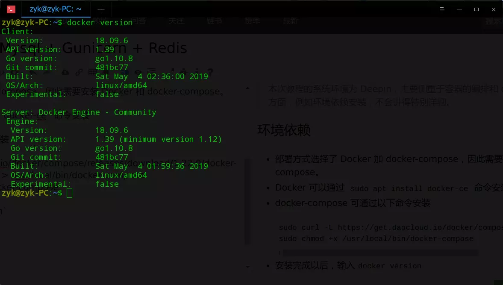
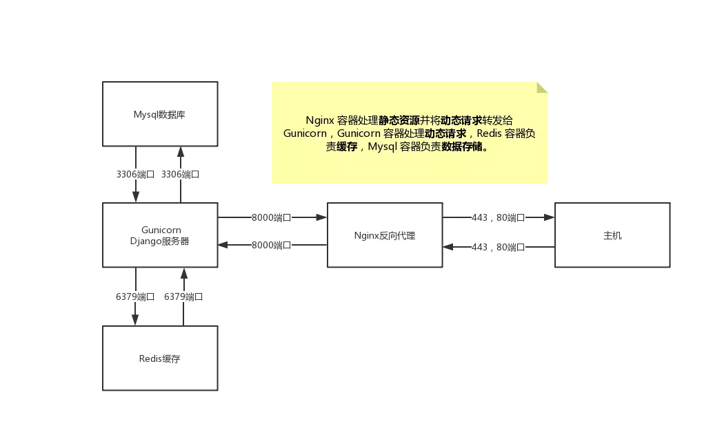
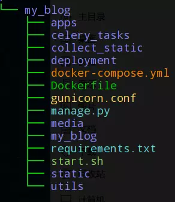
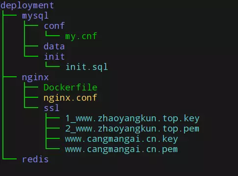
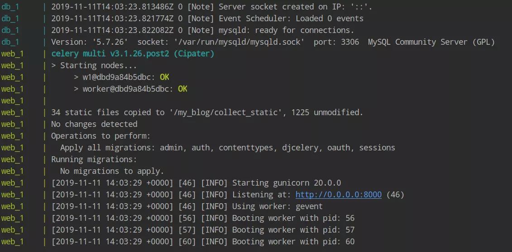
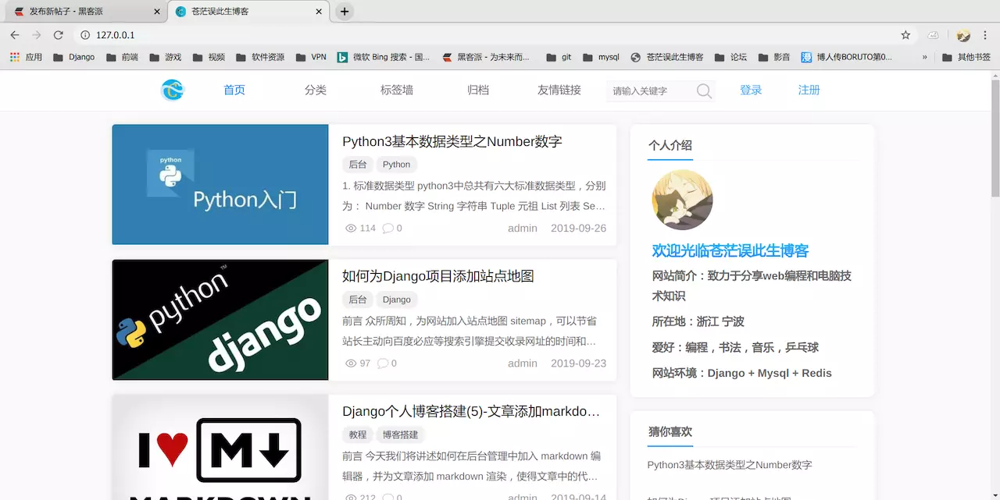

# Docker 部署 Django+Mysql+Redis+Gunicorn+Nginx

## 一. 前言

**docker** 技术现在非常火热，通过容器构建项目环境，运行效率和部署效率都很不错。所以最近抽空看了一些教程，然后将博客部署方式改为了docker，感觉网上没有特别好的关于 **docker** 部署**django**项目的教程，特意写了这篇文章，算是记录自己的心得。

> 本次教程的测试环境为 **Deepin**，主要侧重于**容器的编排**和 **Django** 相关部署知识，一些细节方面，例如环境依赖安装，不会讲得特别详细。由于是在本地测试，所以在配置 **nginx** 相关信息时，将配置 **http** 代理而非 **https** 代理。

## 二. 环境依赖

部署方式选择了 docker 加 docker-compose，因此需要安装 docker 和 docker-compose。

- docker 可以通过 `sudo apt install docker-ce` 命令安装。
- docker-compose 可通过以下命令安装。

```
sudo curl -L https://get.daocloud.io/docker/compose/releases/download/1.22.0/docker-compose-`uname -s`-`uname -m` > /usr/local/bin/docker-compose 
sudo chmod +x /usr/local/bin/docker-compose
```

- 安装完成以后，输入 `docker version`，看到以下画面表示 docker 安装成功。

  [](https://imgsoul.com/image/Kyis)

  

- 输入 `docker-compose version`，看到以下画面表示 docker-compose 安装成功。

  [](https://imgsoul.com/image/K7P7)

  

## 三. 部署分析

- 博客项目中使用到了 **Django**, **Mysql**, **Redis**, **Nginx**，因此需要四个容器，每个容器对应一个应用，当然这些容器是有先后顺序的，也就是说存在依赖关系。然后通过 docker-compose 编排这四个容器，构建容器运行环境。

- 总共四个容器：

  1. **Redis** 容器：缓存服务
  2. **Mysql** 容器：数据存储
  3. **Django**（**Gunicorn**）容器：处理动态请求
  4. **Nginx** 容器：反向代理，处理静态资源

- 下面是容器的结构图。

    

- 容器依赖关系：Django 容器依赖 Redis 容器和 Mysql 容器，Nginx 容器依赖Gunicorn 容器。

## 四. 项目结构

> 看这个教程的小伙伴请尽量把目录和教程中目录保持**一致**，否则在后续部署过程中极有可能会出错。

- **my_blog** 是 **django** 项目目录，**deployment** 文件夹放置了除 **Django** 容器外的三个容器配置信息。
  **Dockerfile**：docker 环境文件
  **docker-compose.yml**：编排容器文件
  **start.sh**：容器初始化后执行的 shell 命令脚本
  **requirements.txt**：django项目环境依赖文件
  **gunicorn.conf**：gunicorn 配置文件

    

- **deployment** 目录包含 **mysql** 容器配置信息，**nginx** 容器配置信息和 **redis** 容器数据目录。
  **mysql**：放置数据库配置信息，conf 放置数据库初始化配置文件 my.cnf，data 用于挂载数据库数据，init 放置 sql 脚本（导入表结构和数据，并挂载到容器中）。
  **nginx**：放置 nginx 配置信息，ssl 放置 ssl证书
  **redis**： 挂载 redis 数据

    

## 五. 构建 Django 容器环境

### 1. Django 项目 Dockerfile编写

> 容器环境和本机环境是**隔离**的，你可以把容器当做**另一个系统**，起初这个系统与你本机的系统**并无关联**，我们通过编写 **Dockerfile** 文件**配置并构建**容器环境（像在干净的系统中配置 python 环境一样）。

```
# 建立 python3.6 环境
FROM daocloud.io/python:3.6

# 镜像作者
MAINTAINER zyk 2295098032@qq.com

# 设置 python 环境变量
ENV PYTHONUNBUFFERED 1

# 创建 my_blog 文件夹
RUN mkdir /my_blog

# 将 my_blog 文件夹为工作目录
WORKDIR /my_blog

# 将当前目录加入到工作目录中（. 表示当前目录）
ADD . /my_blog

# 利用 pip 安装依赖（- i 表示指定清华源，默认源下载过慢）
RUN pip3 install -r requirements.txt -i https://pypi.tuna.tsinghua.edu.cn/simple/

#设置环境变量
ENV SPIDER=/my_blog
```

### 2. 编写 gunicorn 配置文件

编写 gunicorn.conf 文件，用于 gunicorn 的启动

```
workers=3 # 并行工作进程数   
threads = 2 # 指定每个工作者的线程数   
bind=['0.0.0.0:8000'] # 监听内网端口8000   
proc_name='my_blog' # 进程名称   
pidfile='/tmp/blog.pid' # 设置进程文件目录   
worker_class='gevent' # 工作模式协程   
timeout=30 # 超时   
max_requests=6000 # 最大请求数
```

### 3. 编写 start.sh 命令脚本

start.sh 脚本用于启动 django 容器

```bash
#!/bin/bash
# 从第一行到最后一行分别表示：
# 1. 守护进程执行 celery，没有这个需求的小伙伴可以将第一行命令其删除
# 2. 收集静态文件到根目录，
# 3. 生成数据库可执行文件，
# 4. 根据数据库可执行文件来修改数据库
# 5. 用 gunicorn 启动 django 服务
celery multi start w1 -A celery_tasks.tasks worker -l info&&
python manage.py collectstatic --noinput&&
python manage.py makemigrations&&
python manage.py migrate&&
gunicorn my_blog.wsgi:application -c gunicorn.conf
```

## 六. 构建 nginx 容器环境

### 1. nginx 容器 Dockefile 编写

  

- 创建并编写 nginx 文件夹下的 Dockerfile

```dockerfile
# nginx镜像
FROM daocloud.io/nginx

# 删除原有配置文件，创建静态资源文件夹和ssl证书保存文件夹
RUN rm /etc/nginx/conf.d/default.conf \
&& mkdir -p /usr/share/nginx/html/static \
&& mkdir -p /usr/share/nginx/html/media \
&& mkdir -p /usr/share/nginx/ssl

# 添加配置文件
ADD ./nginx.conf /etc/nginx/conf.d/
```

### 2. 配置 nginx.conf

- nginx.conf用于反向代理域名或者 ip，将动态请求分发至内部的 django 容器的8000端口，并配置静态资源路径。
- 配置反向代理时，注意 host 一定要改为 web，web即是django容器的名称（在docker-compose.yml中配置）

```nginx
# 仅用于本地docker环境测试（80端口代理http请求）
server {
    listen 80; # 监听80端口
    server_name  127.0.0.1;  # 生产环境请换成域名
    location / {
        proxy_pass http://web:8000; # 反向代理 django容器8000端口，web为django容器名称，切记不要写域名或者ip
        proxy_set_header Host $host;
        proxy_redirect off;
        proxy_set_header X-Forwarded-For $proxy_add_x_forwarded_for;
    }
    location /static/ {
        alias /usr/share/nginx/html/static/; #静态资源路径
    }
    location /media/ {
        alias /usr/share/nginx/html/media/; #上传文件路径
    }
}
```

## 七. 配置 mysql

### 1. 编写 my.cnf 文件

my.cnf 文件用于初始化 mysql 配置，这个文件将被挂载到容器中。

```mysql
[mysqld]
user=mysql
default-storage-engine=INNODB
character-set-server=utf8
sql_mode=STRICT_TRANS_TABLES,NO_ZERO_IN_DATE,NO_ZERO_DATE,ERROR_FOR_DIVISION_BY_ZERO,NO_AUTO_CREATE_USER,NO_ENGINE_SUBSTITUTION
[client]
default-character-set=utf8
[mysql]
default-character-set=utf8
```

### 2. 导入初始化 sql 文件（不需要导入初始数据库的小伙伴可以忽略此步骤）

将需要导入的sql文件放入init目录下，并修改其名称为init.sql

## 八. 利用 docker-compose 编排容器

编写 docker-compose.yml

```yaml
version: "3"
services:
  redis:
    image: daocloud.io/redis:3
    command: redis-server
    volumes:
      - ./deployment/redis:/data
    ports:
      - "6379:6379"
    restart: always # always表容器运行发生错误时一直重启

  db:
    image: daocloud.io/mysql:5.7
    environment:
      - MYSQL_DATABASE=my_blog # 数据库名称
      - MYSQL_ROOT_PASSWORD=19960331 # 数据库密码
    volumes:
      - ./deployment/mysql/data:/var/lib/mysql # 挂载数据库数据
      - ./deployment/mysql/conf/my.cnf:/etc/mysql/my.cnf # 挂载配置文件
      - ./deployment/mysql/init:/docker-entrypoint-initdb.d/ # 挂载数据初始化sql脚本
    ports:
      - "3306:3306"
    restart: always

  web:
    build: .
    expose:
      - "8000"
    volumes:
      - .:/my_blog
      - /tmp/logs:/tmp
    command: bash start.sh
    links:
      - db
      - redis
    depends_on:
      - db
      - redis
    restart: always

  nginx:
    build: deployment/nginx
    ports:
      - "80:80"
      - "443:443"
    expose:
      - "8000"
    volumes:
      - ./collect_static:/usr/share/nginx/html/static # 挂载静态文件
      - ./media:/usr/share/nginx/html/media # 挂载上传文件
      - ./deployment/nginx/ssl:/usr/share/nginx/ssl # 挂载ssl证书目录
    links:
      - web
    depends_on:
      - web
    restart: always
```

- redis，db，web，nginx为容器名称。
- **image** 表示拉取镜像名称，**build**会在给定目录下寻找 Dockerfile 并构建容器环境。
- **expose** 表示将端口暴露给其他容器，但**不**暴露给主机（不同容器默认相互隔离）。
- **ports** 表示将该容器端口映射到主机端口（从右往左读，例如ports: - "3307:3306"，是指把容器的3306端口映射到主机的3307端口），同时该容器端口也会对其他容器开放。
- **volumes** 表示挂载，就是将本机的文件和容器中的文件映射起来，容器和本地环境本来是隔离的，挂载相当于是凿了一个小洞，让两者数据可以互通。
- **links** 表示将容器互联起来。
- **depends_on**：表示依赖关系，因为容器的启动有先后顺序，django 容器依赖于 mysql 容器和 redis 容器（django需要从数据库和缓存中读写数据），而 nginx 依赖于 django 容器（nginx 容器需要反向代理 django 容器的8000端口）

## 九. 构建、运行容器

- 在构建运行容器之前，需要修改 django 项目的 **settings.py**文件。
- 将 数据库连接 HOST 改为 mysql 容器名称 **db**

```python
DATABASES = {
    'default': {
        'ENGINE': 'django.db.backends.mysql',  # mysql驱动
        'NAME': 'my_blog',  # 数据库名称
        'USER': 'root',  # 登录帐号
        'PASSWORD': '19960331',  # 登录密码
        'HOST': 'db',  # 主机地址（容器部署）
        # 'HOST': '127.0.0.1',  # 主机地址
        'PORT': '3306',  # 端口
        'OPTIONS': {'charset': 'utf8mb4'},
    }
}
```
- 将缓存配置中的 host 改为 redis 容器名称 **redis**（如果你配置了redis作为缓存的话，没配置的话请忽略）

```python
CACHES = {
    'default': {
        'BACKEND': 'django_redis.cache.RedisCache',
        'LOCATION': 'redis://redis:6379',  # redis（容器）
        # 'LOCATION': '127.0.0.1:6379',
        'OPTIONS': {
            "CLIENT_CLASS": "django_redis.client.DefaultClient",
            "CONNECTION_POOL_KWARGS": {"max_connections": 100},
            'SOCKET_TIMEOUT': 10,
        },
    },
}
```
- 生产环境部署请将 **settings.py** 中的 `DEBUG = True` 改为 `DEBUG = False`以关闭debug模式。

- 最后在项目根目录执行命令 `docker-compose up --build`。

- 执行完毕以后看到以下画面表明构建成功。

  

- 在浏览器端口访问127.0.0.1或者你的公网 ip，若能成功访问表明构建成功。

  

## 十. 最后

我也是第一次用 docker-compose 来部署 django 项目，若有写得不得当或者有误的地方麻烦大家帮忙指出。