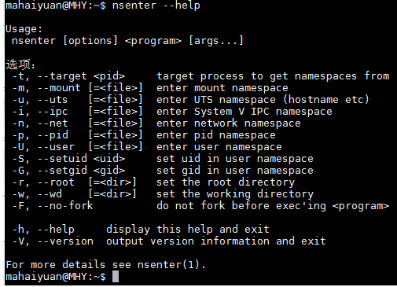
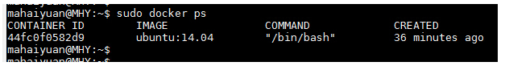
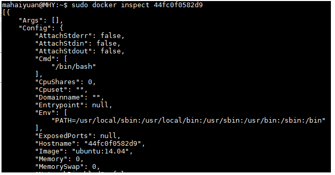
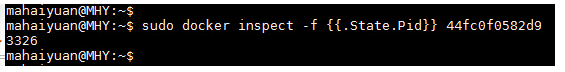
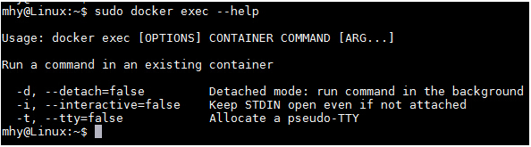

# Docker容器进入的4种方式

## 

　　在使用Docker创建了容器之后，大家比较关心的就是如何进入该容器了，其实进入Docker容器有好几多种方式，这里我们就讲一下常用的几种进入Docker容器的方法。

进入Docker容器比较常见的几种做法如下：

- 使用docker attach
- 使用SSH
- 使用nsenter
- 使用exec

## 一、使用docker attach进入Docker容器

　　Docker提供了attach命令来进入Docker容器。

　　接下来我们创建一个守护态的Docker容器，然后使用docker attach命令进入该容器。

```
$ sudo docker run -itd ubuntu:14.04 /bin/bash 
```

　　然后我们使用docker ps查看到该容器信息，接下来就使用docker attach进入该容器

```
$ sudo docker attach 44fc0f0582d9
```

可以看到我们已经进入到该容器中了。

　　但在，使用该命令有一个问题。当多个窗口同时使用该命令进入该容器时，所有的窗口都会同步显示。如果有一个窗口阻塞了，那么其他窗口也无法再进行操作。

因为这个原因，所以docker attach命令不太适合于生产环境，平时自己开发应用时可以使用该命令。

## 二、使用SSH进入Docker容器

　　在生产环境中排除了使用`docker attach`命令进入容器之后，相信大家第一个想到的就是`ssh`。在镜像（或容器）中安装SSH Server，这样就能保证多人进入。

容器且相互之间不受干扰了，相信大家在当前的生产环境中（没有使用Docker的情况）也是这样做的。但是使用了Docker容器之后不建议使用ssh进入到Docker容器内。关于为什么不建议使用，请参考如下文章：

[为什么不需要在 Docker 容器中运行 sshd](http://www.oschina.net/translate/why-you-dont-need-to-run-sshd-in-docker?cmp)

## 三、使用nsenter进入Docker容器

　　在上面两种方式都不适合的情况下，还有一种比较方便的方法，即使用nsenter进入Docker容器。关于什么是nsenter请参考如下文章：

https://github.com/jpetazzo/nsenter

在了解了什么是nsenter之后，系统默认将我们需要的nsenter安装到主机中

如果没有安装的话，按下面步骤安装即可（注意是主机而非容器或镜像）

具体的安装命令如下：

```
$ wget https://www.kernel.org/pub/linux/utils/util-linux/v2.24/util-linux-2.24.tar.gz 
$ tar -xzvf util-linux-2.24.tar.gz 
$ cd util-linux-2.24/ 
$ ./configure --without-ncurses 
$ make nsenter 
$ sudo cp nsenter /usr/local/bin 
```

安装好nsenter之后可以查看一下该命令的使用。



　　nsenter可以访问另一个进程的名称空间。所以为了连接到某个容器我们还需要获取该容器的第一个进程的PID。可以使用docker inspect命令来拿到该PID。

docker inspect命令使用如下：

```
$ sudo docker inspect --help
```

inspect命令可以分层级显示一个镜像或容器的信息。比如我们当前有一个正在运行的容器



可以使用docker inspect来查看该容器的详细信息。

```
$ sudo docker inspect 44fc0f0582d9 
```



由其该信息非常多，此处只截取了其中一部分进行展示。如果要显示该容器第一个进行的PID可以使用如下方式

```
$ sudo docker inspect -f {{.State.Pid}} 44fc0f0582d9 
```



在拿到该进程PID之后我们就可以使用nsenter命令访问该容器了。

```
$ sudo nsenter --target 3326 --mount --uts --ipc --net --pid 
```

其中的3326即刚才拿到的进程的PID

当然，如果你认为每次都输入那么多参数太麻烦的话，网上也有许多做好的脚本供大家使用。

地址如下：

http://yeasy.gitbooks.io/docker_practice/content/container/enter.html

http://www.tuicool.com/articles/eYnUBrR

## 四、使用docker exec进入Docker容器

　　除了上面几种做法之外，docker在1.3.X版本之后还提供了一个新的命令exec用于进入容器，这种方式相对更简单一些，下面我们来看一下该命令的使用：

```
$ sudo docker exec --help  
```



接下来我们使用该命令进入一个已经在运行的容器

```
$ sudo docker ps 
$ sudo docker exec -it 775c7c9ee1e1 /bin/bash
```

