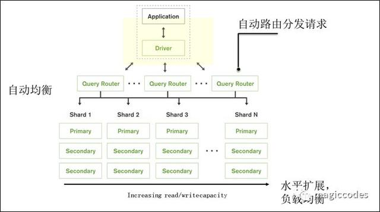
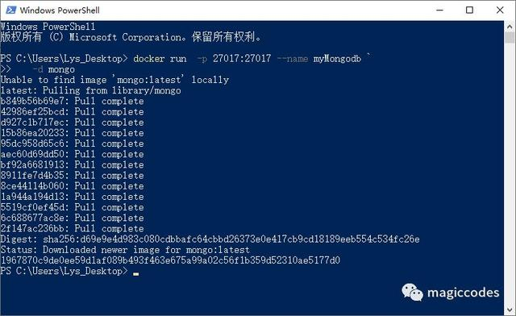
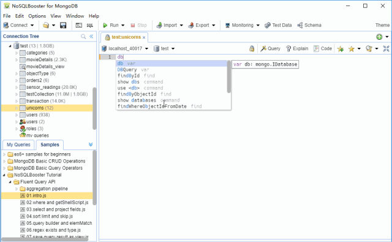
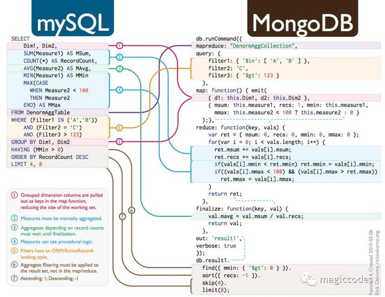
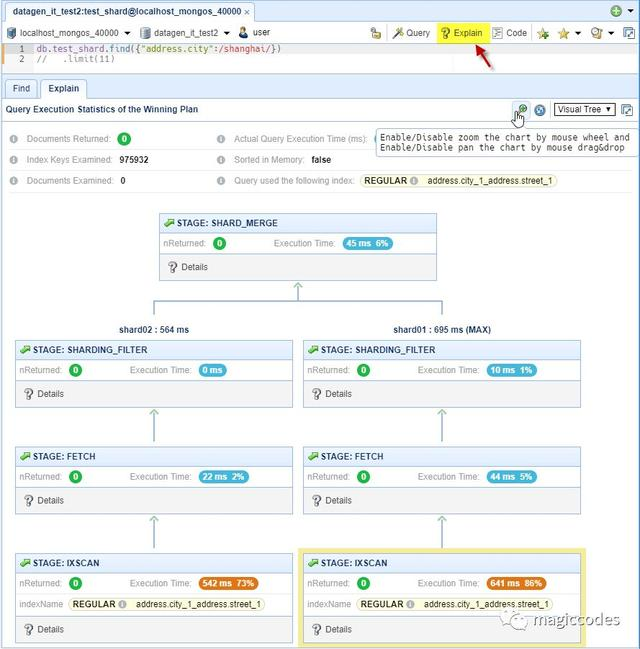

# Docker最全教程——MongoDB容器化（十三）

心莱科技 2019-03-15 09:30:27

上一节我们讲述了数据库容器化之持久保存数据，本节将讲诉MongoDB容器化实践，并且接下来将逐步讲解其他数据库（MySql、Redis等等）的容器化实践，然后将讲诉一些分布式架构的项目实践。由于实践需要花费大量的时间，而目年前业务繁忙，只能加班来进行一些实践并编写，如果编写比较慢，请多多海涵。另外，考虑到文本内容表达有限，**2月份将会推出视频教程，并且提供脚本、代码和笔记。**

## **MongoDB容器化**

MongoDB是一个免费的、开源的、跨平台分布式面向文档存储的数据库，由C++语言编写。旨在为WEB应用提供可扩展的高性能数据存储解决方案。

MongoDB是一个介于关系数据库和非关系数据库之间的产品，是非关系数据库当中功能最丰富，最像关系数据库的。它支持的数据结构非常松散，是类似json的bson格式，因此可以存储比较复杂的数据类型。Mongo最大的特点是它支持的查询语言非常强大，其语法有点类似于面向对象的查询语言，几乎可以实现类似关系数据库单表查询的绝大部分功能，而且还支持对数据建立索引。

官网：https://www.mongodb.com/

### **适用场景**

- 网站实时数据处理。它非常适合实时的插入、更新与查询，并具备网站实时数据存储所需的复制及高度伸缩性。
- 缓存。由于性能很高，它适合作为信息基础设施的缓存层。在系统重启之后，由它搭建的持久化缓存层可以避免下层的数据源过载。
- 高伸缩性高可用的场景。MongoDB使用分片水平缩放，并且可以运行在多个服务器上，平衡负载或复制数据，以便在硬件出现故障时保持系统正常运行。
- 海量数据。



### **不适用的场景**

- 要求高度事务性的系统。
- 传统的商业智能应用。
- 复杂的跨文档（表）级联查询。

镜像说明

官方镜像地址：

https://hub.docker.com/_/mongo

主要环境变量说明

- MONGO_INITDB_ROOT_YSERNAME:管理员账号，例如：root
- MONGO_INITDB_ROOT_PASSWORD:管理员密码，例如：12345

运行MongoDB容器镜像

```powershell
# Powershell:
docker run -p 27017:27017 --name myMongodb `
-d mongo
```



使用主机目录保存数据库文件

```powershell
# PowerShell：
docker run -p 27017:27017 --name myMongodb `
-v d:/temp/data/mongodb:/data/db `
-d mongo
```

执行之后如下图所示：


*注意：Windows和OS X上的Docker默认设置使用VirtualBox VM来托管Docker守护程序。但是，VirtualBox用于在主机系统和Docker容器之间共享文件夹的机制与MongoDB使用的内存映射文件不兼容（请参阅vbox bug，docs.mongodb.org和相关的jira.mongodb.org错误），这意味着无法运行映射到主机的数据目录的MongoDB容器。*

## **管理Mongodb**

### **使用nosqlbooster管理MongoDB**

nosqlbooster以shell为中心的跨平台GUI的MongoDB管理工具，它提供全面的服务器监控工具，流畅的查询构建器，SQL查询支持，ES2017语法支持和真正的智能感知体验，是非常值得推荐的一个MongoDB管理工具。

官方网址：https://nosqlbooster.com



非常值得推荐的是，NoSQLBooster支持我们使用SQL查询语法来执行查询（MongoDB本身不支持，是由NoSQLBooster进行了验证和转换处理）。

例如以下MongoDB查询语法：

```sql
db.employees.aggregate([{
$group: { _id: "$department", total: { $sum: "$salary" }}
}])
```

可以使用我们熟悉的SQL查询语法来查询：

```sql
mb.runSQLQuery(`
SELECT department, SUM(salary) AS total FROM employees GROUP BY department
`)
```

这里附上一个MySql和MongoDB的语法对比示例：



同时，NoSQLBooster还提供丰富的性能监视和分析工具，如Visual Explain Plan：



### **使用MongoDB Compass**

MongoDB Compass是MongoDB的可视化工具，适用于Linux，Mac或Windows，能够非常直观的查看和管理数据，并且可以轻松识别可能导致性能问题的瓶颈或慢查询，这意味着我们可以更快地解决问题。


