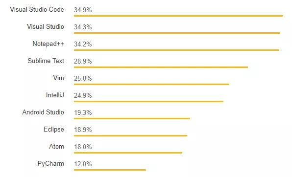
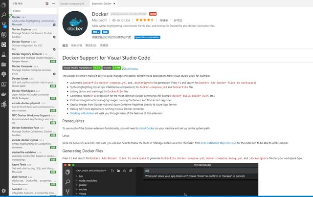
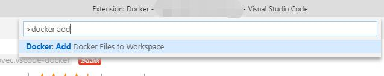
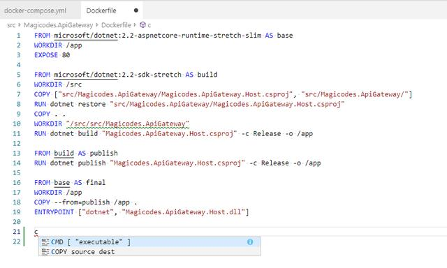
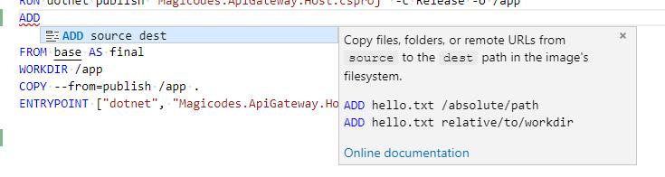
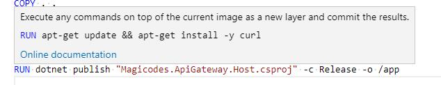
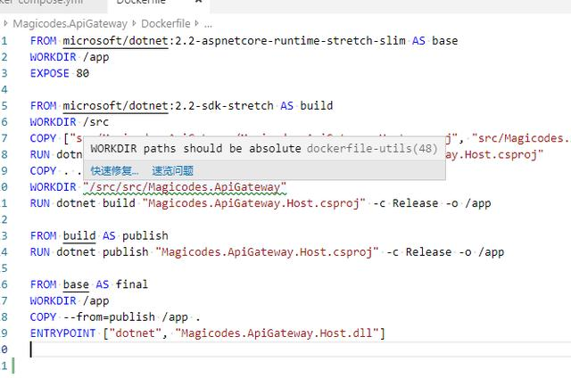

# Docker最全教程之使用 Visual Studio Code玩转Docker（二十一）

## **前言**

VS Code是一个年轻的编辑器，但是确实是非常犀利。通过本篇，老司机带你使用VS Code玩转Docker——相信阅读本篇之后，无论是初学者还是老手，都可以非常方便的玩转Docker了！所谓是“工欲善其事必先利其器”，VS Code，你值得拥有！

## **使用 Visual Studio Code玩转Docker**

Visual Studio是我们熟知的宇宙第一IDE，而Visual Studio Code（简称VS Code）则是微软推出的开源的跨平台编辑器，自从出世，一直是战斗力爆表——短短4年，就已拔得头筹，并且得到了众多开发者的拥护。如下图所示，以下是Stack Overflow 的 2018 年开发者最受欢迎的开发工具调查结果：

在Stack Overflow 的 2018 年开发者调查中，VSCode 成为了最受欢迎的开发工具

目前VisualStudio Code已经拥有了超过一万个插件，插件市场生态是极其丰富。同时其对所有的编程语言都非常友好（体验很不错），包括Docker。接下来，我们就说说Visual Studio Code对Docker的一些支持。

## **官方扩展插件Docker**

VS Code提供了对Docker支持的一些官方扩展，我们可以按Ctrl + Shift + X打开“扩展”视图，然后搜索docker以过滤结果，最后选择Microsoft Docker扩展进行安装：

使用此Docker扩展可以非常方便的从VisualStudio Code构建，管理和部署容器化应用程序，主要体现在以下几点：

- 自动生成dockerfile、docker-compose.yml和.dockerignore文件（按F1并搜索Docker：将Docker文件添加到Workspace）；

- 语法突出高亮显示以及docker-compose.yml和Dockerfile文件的智能提示

- 悬停提示；

- Dockerfile文件的语法检查和分析，会提示警告或错误；

- 镜像搜索和智能提示；

- 集成最常见的Docker命令（例如docker build，docker push等，需按F1唤起）；

- Docker镜像、容器管理；

- 其他
- 对Azure的支持（这块我们就不具体介绍了）；
- .NET Core程序调试支持；
- 连接docker-machine；
- 在Linux上允许命令。

## **Docker Compose扩展插件**

我们可以按Ctrl + Shift + X打开“扩展”视图，然后搜索Docker Compose来安装此插件，扩展如下图所示：

该扩展支持以下功能：

- 管理Compose的工程（ Start、Stop、Up, Down）；

- 管理Compose服务（支持Up, Shell, Start, Stop, Restart,Build, Kill, Down）；

- 支持多个根；

## **最后**

VS Code是一个年轻的编辑器，但是确实是非常犀利。通过这两个插件，无论是初学者还是老手，都可以非常方便的玩转容器了！所谓是“工欲善其事必先利其器”，VS Code，你值得拥有！