## Kubernetes 稳定性保障手册 -- 极简版

作者 | 悟鹏
来源 | [阿里巴巴云原生公众号](https://mp.weixin.qq.com/s/kZmi2gK16qe2yMYMRS3Etg)

Kubernetes 在生产环境中的采用率越来越高，复杂度越来越高，由此带来的稳定性保障的挑战越来越大。

对于基于 Kubernetes 的云产品，稳定性保障已成为基本诉求，稳定性缺陷会给产品带来巨大的损失，如用户流失、用户信心下降、产品迭代速度变慢等。

虽然基于 Kubernetes 的稳定性保障很重要，但业界缺少基于实践的标准化稳定性保障方案，导致同样的问题在同一产品或不同的产品中重复出现，最佳实践不能应用在更多相同技术栈的产品中，不同产品形成的稳定性保障最佳实践也不能互补。

为此，基于过去的开发实践以及基于 Kubernetes 的稳定性保障经验，尝试形成《Kuberentes 稳定性保障手册》，将稳定性保障最佳实践进行沉淀，使得人人对 Kubenretes 稳定性保障的理论形成全面的理解，相应的工具和服务成为基础设施，复用在类似技术栈的产品中，加速稳定性保障最佳实践的传播、迭代和应用。

本篇文章作为《Kubernetes 稳定性保障手册》第一篇文章，抽象稳定性保障中的核心内容，作为稳定性保障最简使用手册。

## 极简手册目标

- 1min 理解稳定性保障目标
- 3min 把握稳定性保障全局视图
- 一站查找稳定性保障推荐工具或服务

## 稳定性保障目标

- 满足服务或产品对稳定性的诉求
- 加速服务或产品的迭代

## 稳定性保障检查项

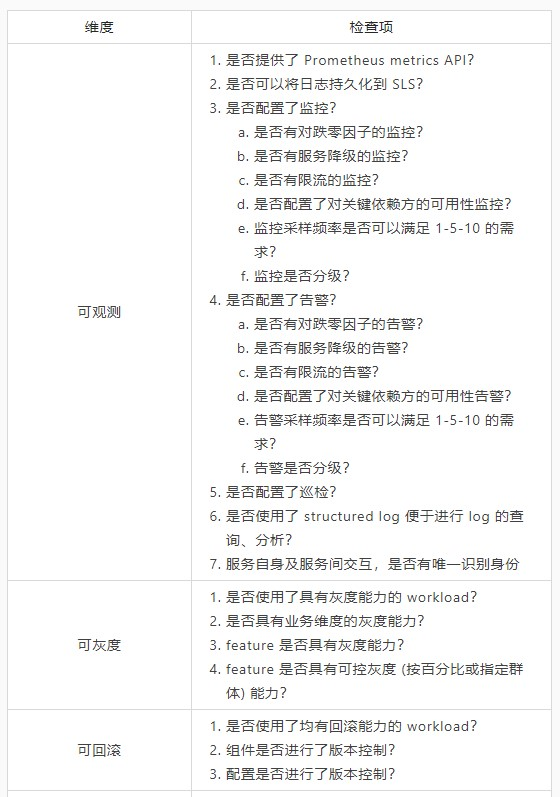
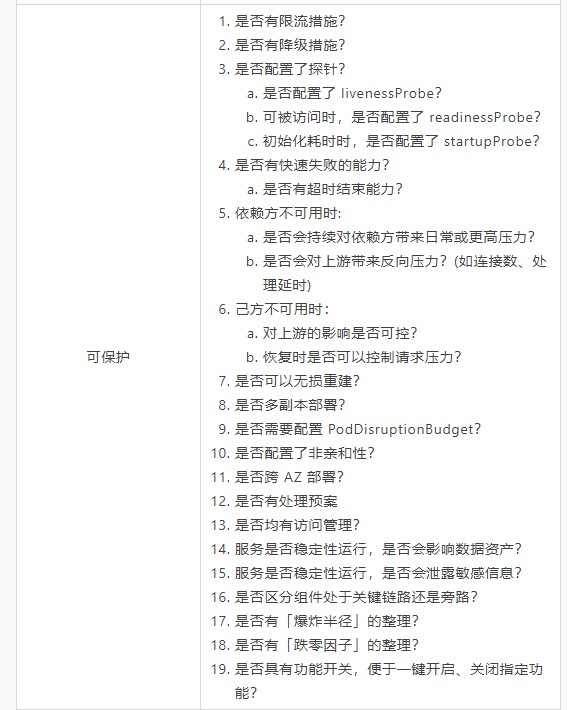
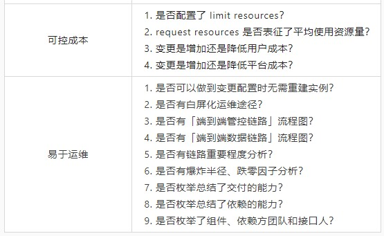

## 稳定性保障级别

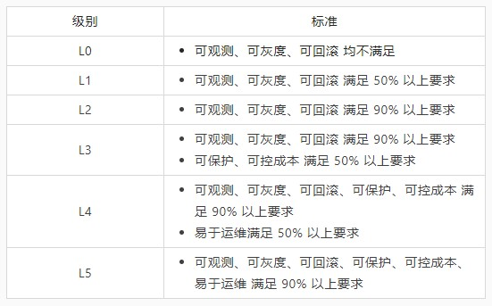

## 实践

### 方法论

#### 全局视图

实践流程：

1. 整理运行链路图，标记链路是否是关键链路
2. 基于运行链路图，进行可观测性配置
3. 基于链路重要程度，进行可控性治理

为了降低实践的成本，需要把握云产品中的元素及交互关系，从基础的元素和交互方面解构复杂系统：

- 元素 (2 类)
  - 云产品组件
  - 云产品
- 交互 (2 类，共 3 种场景)
  - 云产品内部
    - 组件自身
    - 组件与组件之间
  - 云产品之间
    - 云产品与云产品之间

如下图：

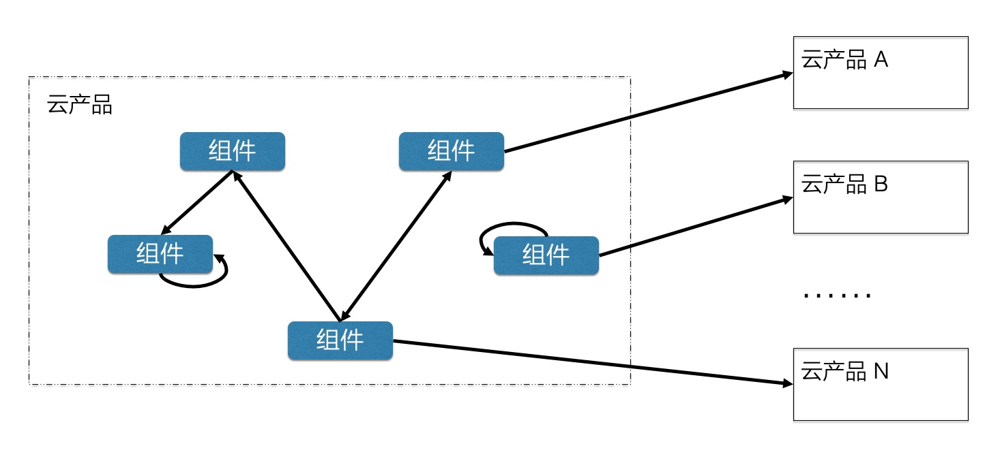

随着**元素数量**和**交互关系**的增多，系统会逐步变得复杂，稳定性保障面临的挑战也会越来越大，要避免引入非必要的复杂性。

因此，需要先梳理清楚当前的运行链路图，进行链路重要性分析，并整理组件大图，判断组件的爆炸半径。在此基础上，还需要进行参与人员的 review，避免在人员的投入方面存在单点风险。

运行链路图示例：

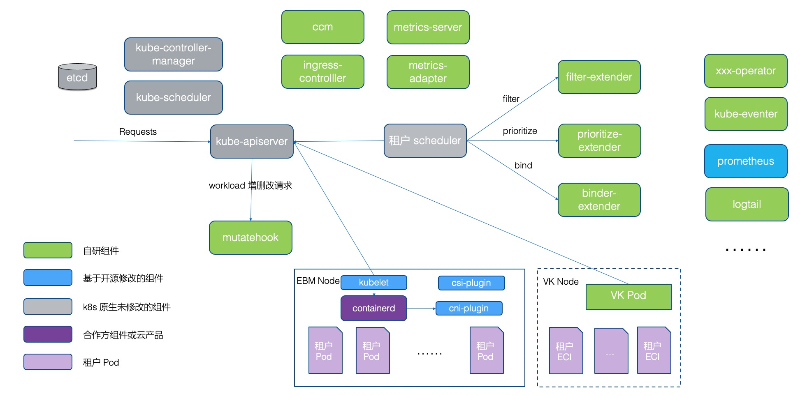

链路重要性示例：

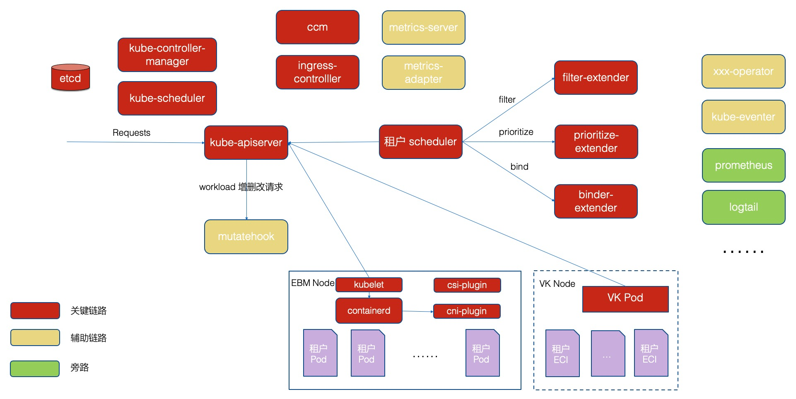

云产品间交互示例：

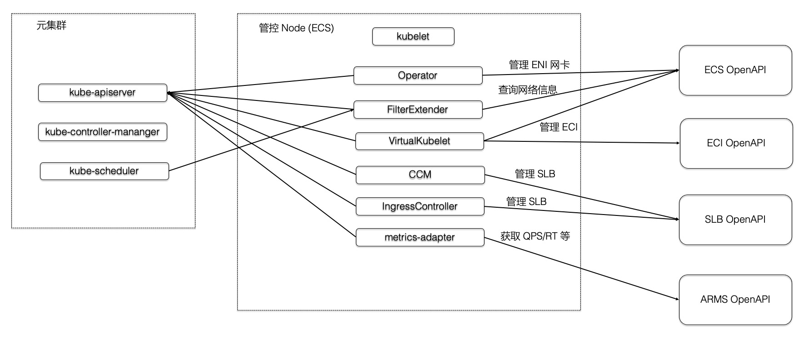

基于上述对系统复杂度、运行链路的分析，面对稳定性保障的问题域，可以有效提出、落地解决方案。

#### 问题处理

实践流程：

1. 长期维护角色列表、功能流程图、运行链路图
2. 在多个分级的「告警群」中感知问题的发生和恢复
3. 在唯一的「问题处理群」中处理问题和复盘问题

对于复杂的系统，通常会有如下的角色关系：

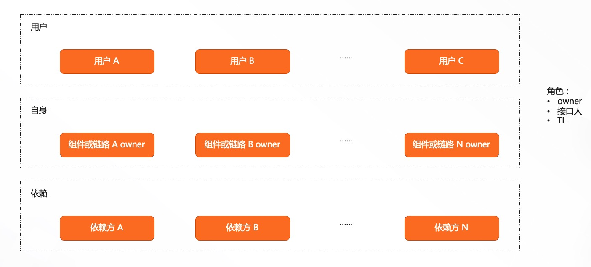

梳理清楚每层的角色，并使得参与同学可以方便查找目标同学，会缩短问题处理时间。

### 问题域

#### 概述

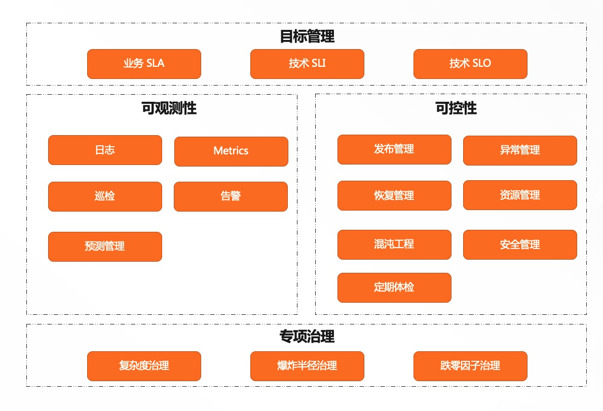

#### 推荐

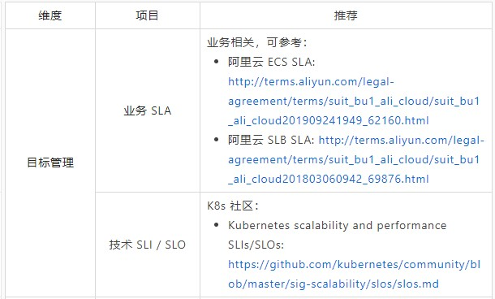
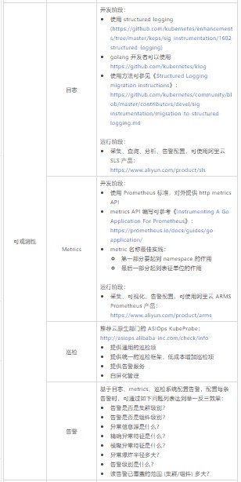
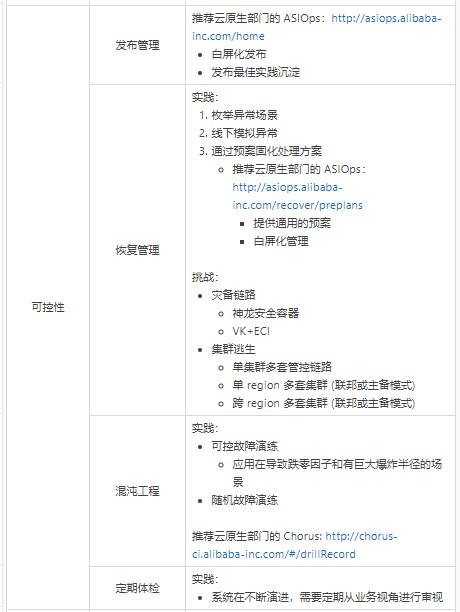
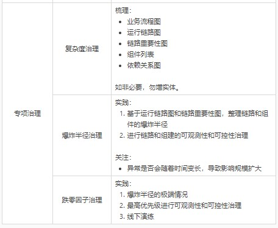

## 后续

对于《Kubernetes 稳定性保障手册》，接下来会进行如下的章节细化，分别从方法论和工具/服务的角度进行总结，形成初版后与大家分享，进行共建：

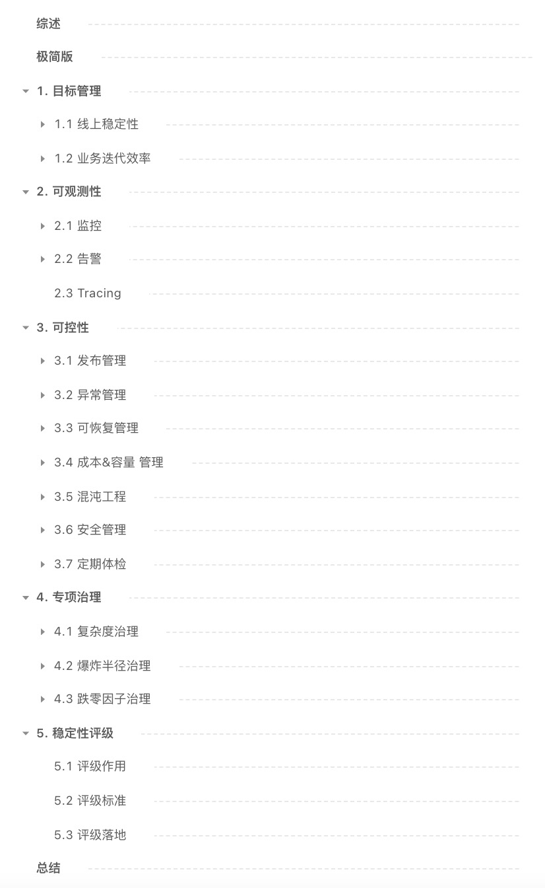

