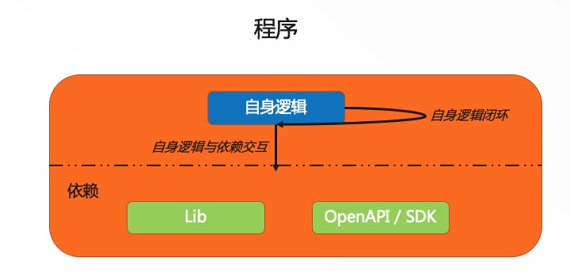
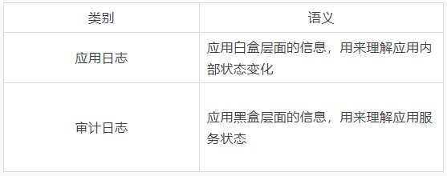
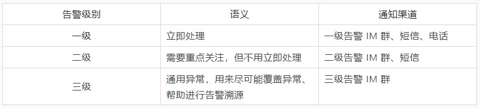
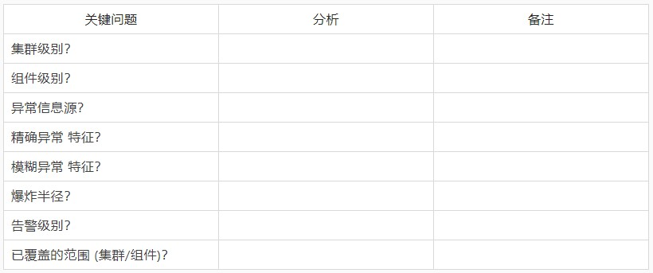

# Kubernetes 稳定性保障手册 -- 日志专题

《Kubernetes 稳定性保障手册》系列文章：

- [Kubernetes 稳定性保障手册 — 极简版](http://mp.weixin.qq.com/s?__biz=MzUzNzYxNjAzMg==&mid=2247501775&idx=1&sn=8b3b27934e7bced10b2a7f81483e3256&chksm=fae6cc00cd9145168b57c579ed488a7f92b67f86daf039de6b9518995d9e1ad27df2a382290e&scene=21#wechat_redirect)
- Kubernetes 稳定性保障手册 — 日志专题（本文）

不论对于软件的用户还是开发者，日志都是很重要的信息源。日志可以用来表征软件的运行状态，在软件运行不符合预期时提供丰富的信息，也可以用在开发阶段调试软件，方便定位问题。

软件的生命周期涉及到 **开发** 和 **运行** 两个阶段，日志的生成是在软件的开发阶段，日志的使用集中在软件的运行阶段。
在开发阶段规范化日志，有助于运行阶段通过标准化方法分析日志、配置日志监控和告警。
在运行阶段通过标准化方法使用日志，有助于低成本把握程序的运行态行为，及时感知异常，促进开发阶段的迭代效率。

在软件的生命周期中，运行阶段时长占比会远大于开发阶段，即对日志的使用时长会远大于开发阶段写日志逻辑的时长。在开发阶段应用良好的日志规范，会对软件生命周期的正常运行和快速迭代带来很大帮助：

## 复杂度分析

程序中的元素可以抽象为两部分：自身逻辑，依赖。两类元素之间的交互为：自身逻辑闭环，自身逻辑与依赖交互。

从长期角度来看，交互环节出问题的概率会比自身逻辑出问题的概率高，因此要重点关注交互环节的日志逻辑。

同时，对日志的管理需要意识到 *谁会使用这些日志，*通常有 4 类角色：

- 用户
- 维护者
- 安全人员
- 审计人员

用户从黑盒角度使用软件，通过日志了解软件当前的运行状态，关注重点是软件正常的状态。

维护者从白盒角度使用软件，开发角色通过日志调试软件，SRE 角色通过日志及时感知软件的异常状态，并通过日志上下文分析异常原因。

安全人员通过分析日志，了解恶意登录、异常删除等风险。

审计人员通过审计日志、应用日志，确认业务、架构的合规性。

根据上述不同的使用场景，我们可以梳理出几类日志类别，进一步增强开发和运行阶段对日志的理解：

## 开发阶段

### 最佳实践

理解了日志使用者关注的重点后，开发阶段写日志时，推荐使用如下最佳实践：

- 使用 structured logs

  - 不使用 format strings

- 使用 info 和 error 表征日志级别

  - info 又可细化为多个级别，0~10，信息的重要性依次降低 (也可以参考

    《Kubernetes: sig-instrumentation/logging.md》

    - 0：用户想要看到的信息
    - 1：维护者关注的白盒行为信息
    - 10： 维护者调试用的信息

- 使用具有过滤器能力的 log lib，通过 logger 自动过滤敏感信息

  - 参见 [《KEP: Kubernetes system components logs sanitization》](https://github.com/kubernetes/enhancements/blob/master/keps/sig-security/1753-logs-sanitization/README.md)

- 日志通过 stdout/stderr 输出，关闭不必要的文本日志

  - 避免额外的磁盘占用、IO 消耗、日志清理任务的维护等

对于 golang，可以考虑使用 [klog](https://github.com/kubernetes/klog) 作为 logger 实现。

### FAQ

#### 为什么使用 structured logs？

structured logs 是一种结构化的日志格式，结构如下，其中 msg 表征通用的事件，多对的 k=v 用来具化事件：

> msg k=v k=v … k=v

示例：

> “Pod status updated” pod=”kube-system/kubedns” status=”ready”

对于开发阶段，structured logs 通过固化的结构和字段语义，协助开发者思考程序逻辑状态，有助于进一步控制程序复杂度和理解程序逻辑。

对于运行阶段，structured logs 中的 k 天然具备索引的属性，便于进行查询和分析。也可以考虑将 msg 规范化，增加 **事件** 语义，通过限制 msg 语义来增强 msg 的作用。

#### 为什么不使用 debug/warning/critical/fatal？

通过减少日志类型，降低使用和维护负担。

debug 可以融入到 info 级别。

warning/critical 对于用户和维护者都是模糊的词，对于要采取的行动通常不具备指导意义。warning/critical 和 error 类似，表征程序运行过程中出现了预期外的现象，此时程序要么自动处理，要么交由外部人工介入判断。若由程序自动处理，那么用户和维护者感知到这类现象即可，info 可以满足。若需要交由外部人工介入，那么 error 就可以满足。对于问题的严重性，可放在运行阶段，通过异常具体的信息来表征，如 ServiceUnavailable、Unauthorized 等。

fatal 是将 error 和 panic 两类逻辑封装了起来，在开发过程中可能会带来执行逻辑上的不清晰，如决定是否 panic 的逻辑需要放在最顶层逻辑中，若在顶层逻辑之下调用 fatal，可能会带来资源泄露、程序运行复杂度增加等问题。

#### 为什么不使用 format strings？

format strings 是形如如下的结构：

> klog.V(4).Infof(“Got a Retry-After %ds response for attempt %d to %v”, seconds, retries, url)

这种结构将 **通用事件** 和 **具体内容** 耦合在一起，不利于开发阶段降低理解程序逻辑的成本，也不便于使用阶段通过标准化的方式进行查询、分析，增加日志的使用成本。

一种改善方式：

> klog.V(4).InfoS(“got a retry-after response when requesting url”, “attempt”, retries, “after seconds”, seconds, “url”, url)

#### 为什么要使用具有过滤器能力的 log lib？

开发过程中，可能会由于疏忽而将敏感信息输出到日志中，如密码、token 等信息。为了避免敏感信息泄露，需要加强 code review，同时也可以考虑在 logger 中配置过滤器，自动进行敏感信息的过滤，参见 [《KEP: Kubernetes system components logs sanitization》](https://github.com/kubernetes/enhancements/blob/master/keps/sig-security/1753-logs-sanitization/README.md) 。

对于 golang，可以考虑使用 [klog](https://github.com/kubernetes/klog) 作为 logger 实现，并配合 [Kubernetes/component-base: sanitization](https://github.com/kubernetes/component-base/blob/master/logs/sanitization/sanitization.go) 进行使用。

## 运行阶段

### 最佳实践

运行阶段是对日志的使用，包括如下 4 个阶段：

1. 采集
2. 查询
3. 分析
4. 告警

由于日志服务对程序的运行以及后续的运营极为重要，建议采用托管型的日志产品来满足运行阶段对日志的使用需求，如[阿里云的 SLS 产品](https://www.aliyun.com/product/sls)。

若在多个 region 部署集群，且集群的组件相同，在使用日志产品时，需要确保每个 region 中日志项目名称规则的一致性。以阿里云 SLS 产品为例，若需要分别收集多个 region 的日志，则 project、logstore 的名称需要在多个 region 中保持相同的规则，目的是便于通过统一的方法对不同集群的日志做查询和分析。

通常情况下，日志产品会提供上述 4 个阶段的服务，具体的使用方法可以参见对应日志产品的文档，下述针对告警做重点分析。

#### 告警

告警要满足如下目标：

- 覆盖面全
- 关键告警及时感知

基于开发阶段的日志规范，可对 error 级别的告警做统一告警，将告警信息统一到低优先级的通知渠道，如表征普通告警的钉钉群。

若要及时感知到关键告警，需要从如下 2 个方面入手：

- 定义「关键告警」特征
- 分级告警，与相应的通知渠道结合

定义「关键告警」的特征是个 **长期**、**持续完善** 的过程，有 通用关键告警 和 业务关键告警。

通用关键告警 与业务耦合度小，如机器级别的关键告警 (宕机、内存压力大、load 过高等)、托管服务的关键告警 (master 组件 panic/OOM、master 组件内存压力大等)，这部分告警配置可以作为基础服务，作为集群1交付的一部分。

业务关键告警 与业务耦合度大，需要与业务长期维护，重点关注「业务交互环节」的告警。

通知渠道通常会有如下几类：

- IM 群 (如钉钉群等)
- 短信
- 电话
- webhook

这些通知渠道对人触达的及时性不同，电话触达性最好，短信其次，然后是 IM 群。webhook 本质上是条通道，可以对接不同的 IM 群或短信、电话渠道。

推荐如下三种告警级别：

配置告警是个长期、不断迭代的过程，为了有助于告警有效性的迭代，配置每条告警时，可以考虑使用如下表格，规范化每条告警的配置，并深入思考告警配置的有效性：

### FAQ

#### 如何预先配置未模拟出的异常？

业务依赖的 OpenAPI/SDK/Lib 等通常都会有错误码列表，如 [阿里云：API 错误中心](https://error-center.aliyun.com/)、Lib 中的 errors 文件等。可以基于该已知信息，枚举依赖的 OpenAPI/SDK 中对业务有明显负面影响的状态码做分级告警，如 ServiceUnavailable/Forbbiden/Unauthorized 等。

欢迎大家留言交流使用 Kubernetes 过程中的稳定性保障问题，以及对稳定性保障的期待工具或服务。大家也可通过邮箱联系作者，进一步深入交流：flyer.zyf[@alibaba](https://github.com/alibaba)-inc.com