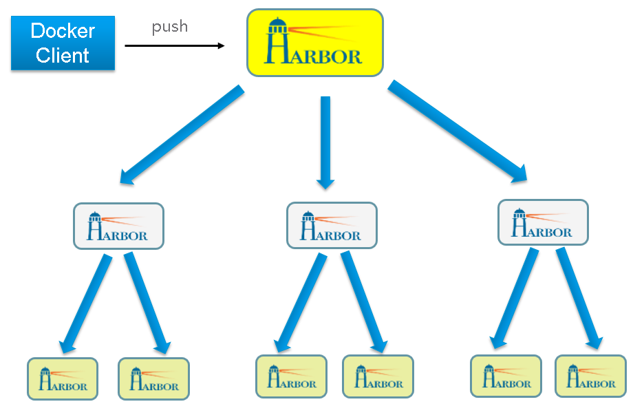

# 使用Harbor搭建企业级的Docker私有镜像库

## 1. 前言

之前使用Docker官方的Registry镜像搭建了私有仓库，但是没有可一个可视化的界面去维护，非常不方便。所幸Vmware推出一个基于官方Registry V2镜像打造的私有仓库项目，今天就来尝试搭建一下。

## 2. 简介

Harbor是VMware公司最近开源的企业级Docker Registry项目, 其目标是帮助用户迅速搭建一个企业级的Docker registry服务。它以Docker公司开源的registry为基础，提供了管理UI, 基于角色的访问控制(Role Based Access Control)，AD/LDAP集成、以及审计日志(Audit logging) 等企业用户需求的功能，同时还原生支持中文。Harbor的每个组件都是以Docker容器的形式构建的，使用Docker Compose来对它进行部署。用于部署Harbor的Docker Compose模板位于docker-compose.yml，由7个容器组成

- harbor-jobservice 是harbor的job管理模块，job在harbor里面主要是为了镜像仓库之前同步使用的
- harbor-adminserver:是harbor系统管理接口，可以修改系统配置以及获取系统信息。
- harbor-db:是harbor的数据库(MySQL)，这里保存了系统的job以及项目、人员权限管理。由于本harbor的认证也是通过数据，在生产环节大多对接到企业的ldap中。
- harbor-log:harbor的日志服务，统一管理harbor的日志。通过inspect可以看出容器统一将日志输出的syslog。
- harbor-ui:是web管理页面，主要是前端的页面和后端CURD的接口
- nginx:负责流量转发和安全验证，对外提供的流量都是从nginx中转，所以开放https的443端口，它将流量分发到后端的ui和正在Docker镜像存储的docker registry。
- registry:由Docker官方的开源registry 镜像构成的容器实例

这几个容器通过Docker link的形式连接在一起，在容器之间通过容器名字互相访问。对终端用户而言，只需要暴露Nginx的服务端口。

## 3. 部署环境

- CentOS 7
- docker  V1.12.6
- docker-compose V1.13
- Harbor V1.1.2 [官网GitHub](https://link.jianshu.com?t=https://github.com/vmware/harbor)

## 4. 安装过程

### 4.1 下载Harbor

有离线安装和在线安装包两种，这里下载离线安装包，之后安装会比较快
 `wget https://github.com/vmware/harbor/releases/download/v1.1.2/harbor-offline-installer-v1.1.2.tgz`

### 4.2 解压并配置Harbor

#### 4.2.1 解压

```bash
tar xvfz harbor-offline-installer-v1.1.2.tgz
```

#### 4.2.2 配置

##### 4.2.2.1 编辑安装模板harbor.cfg

harbor的nginx默认暴露本机的80端口，但是一般80端口都会被占用，我改成8060端口，如下是我的配置文件，有改动的地方我用**标注了，大家也可以根据实际情况进行修改

需要配置的参数如下：

hostname：私有仓库的主机名。可以是IP地址或是域名。

ui_url_protocol：用户访问私仓使用的协议，默认是http，这里配置成https；

harbor_admin_password：harbor的管理员账户密码，默认密码是Harbor12345

```php
## Configuration file of Harbor

#The IP address or hostname to access admin UI and registry service.
#DO NOT use localhost or 127.0.0.1, because Harbor needs to be accessed by external clients.
#修改成本地IP:暴露端口
** hostname = 192.168.3.42:8060

#The protocol for accessing the UI and token/notification service, by default it is http.
#It can be set to https if ssl is enabled on nginx.
ui_url_protocol = http

#The password for the root user of mysql db, change this before any production use.
db_password = root123

#Maximum number of job workers in job service  
max_job_workers = 3 

#Determine whether or not to generate certificate for the registry's token.
#If the value is on, the prepare script creates new root cert and private key 
#for generating token to access the registry. If the value is off the default key/cert will be used.
#This flag also controls the creation of the notary signer's cert.
customize_crt = on

#The path of cert and key files for nginx, they are applied only the protocol is set to https
#存放认证书的位置
**ssl_cert = ./data/cert/server.crt
**ssl_cert_key = ./data/cert/server.key

#The path of secretkey storage
**secretkey_path = ./data

#Admiral's url, comment this attribute, or set its value to NA when Harbor is standalone
admiral_url = NA

#NOTES: The properties between BEGIN INITIAL PROPERTIES and END INITIAL PROPERTIES
#only take effect in the first boot, the subsequent changes of these properties 
#should be performed on web ui

#************************BEGIN INITIAL PROPERTIES************************

#Email account settings for sending out password resetting emails.

#Email server uses the given username and password to authenticate on TLS connections to host and act as identity.
#Identity left blank to act as username.
email_identity = 

email_server = smtp.mydomain.com
email_server_port = 25
email_username = sample_admin@mydomain.com
email_password = abc
email_from = admin <sample_admin@mydomain.com>
email_ssl = false

##The initial password of Harbor admin, only works for the first time when Harbor starts. 
#It has no effect after the first launch of Harbor.
#Change the admin password from UI after launching Harbor.
# 默认的管理员登录密码
harbor_admin_password = Harbor12345

##By default the auth mode is db_auth, i.e. the credentials are stored in a local database.
#Set it to ldap_auth if you want to verify a user's credentials against an LDAP server.
auth_mode = db_auth

#The url for an ldap endpoint.
ldap_url = ldaps://ldap.mydomain.com

#A user's DN who has the permission to search the LDAP/AD server. 
#If your LDAP/AD server does not support anonymous search, you should configure this DN and ldap_search_pwd.
#ldap_searchdn = uid=searchuser,ou=people,dc=mydomain,dc=com

#the password of the ldap_searchdn
#ldap_search_pwd = password

#The base DN from which to look up a user in LDAP/AD
ldap_basedn = ou=people,dc=mydomain,dc=com

#Search filter for LDAP/AD, make sure the syntax of the filter is correct.
#ldap_filter = (objectClass=person)

# The attribute used in a search to match a user, it could be uid, cn, email, sAMAccountName or other attributes depending on your LDAP/AD  
ldap_uid = uid 

#the scope to search for users, 1-LDAP_SCOPE_BASE, 2-LDAP_SCOPE_ONELEVEL, 3-LDAP_SCOPE_SUBTREE
ldap_scope = 3 

#Timeout (in seconds)  when connecting to an LDAP Server. The default value (and most reasonable) is 5 seconds.
ldap_timeout = 5

#Turn on or off the self-registration feature
#是否允许用户注册
self_registration = off

#The expiration time (in minute) of token created by token service, default is 30 minutes
token_expiration = 30

#The flag to control what users have permission to create projects
#The default value "everyone" allows everyone to creates a project. 
#Set to "adminonly" so that only admin user can create project.
#只有管理员可以有权限创建项目
**project_creation_restriction = adminonly

#Determine whether the job service should verify the ssl cert when it connects to a remote registry.
#Set this flag to off when the remote registry uses a self-signed or untrusted certificate.
verify_remote_cert = on
#************************END INITIAL PROPERTIES************************
#############
```

**https证书配置**

修改配置文件/etc/pki/tls/openssl.cnf

指定CA服务器地址为harbor仓库服务器地址


然后执行以下命令来生成ca.crt和ca.key两个证书文件。注意这里的CN=XXX和IP=XXX，如果Harbor用域名来访问则XXX换成域名，如果使用的是IP访问https访问则配置ip，将证书文件生成到/opt/cert目录。

```shell
mkdir –p /opt/cert

openssl req-newkey rsa:4096 -nodes -sha256 -keyout/opt/cert/ca.key \
-subj '/C=xj/O=shsnc onDocker/CN=192.168.56.106/emailAddress=harbor@shsnc.comsubjectAltName=IP=192.168.56.106'\
-x509 -days 365 -out/opt/cert/ca.crt
```

##### 4.2.2.2 初始化安装脚本及配置文件

在安装Harbor之前需要提前规划一个比较大的存储空间用于存储Harbor的镜像、数据库和日志，以保证后续Harbor系统运行良好。

```shell
./ prepare
```

系统已经提前准备好一个大的文件系统`/opt/harbor/data`，我们需要在运行`prepare`后，需要修改`/opt/harbor/docker-compose.yml`文件中，并提前创建一些数据卷目录：

```bash
mkdir -p /opt/harbor/data/registry
mkdir -p /opt/harbor/data/log
mkdir -p /opt/harbor/data/database
```

##### 4.2.2.3 修改docker-compose.yml

找到proxy那一段代码，将80改成8060

```yaml
 proxy:
    image: vmware/nginx:1.11.5-patched
    container_name: nginx
    restart: always
    volumes:
      - ./common/config/nginx:/etc/nginx:z
    networks:
      - harbor
    ports:
      - 8060:80 //此处原来是80:80
      - 443:443
      - 4443:4443
    depends_on:
      - mysql
      - registry
      - ui
      - log
    logging:
      driver: "syslog"
      options:
        syslog-address: "tcp://127.0.0.1:1514"
        tag: "proxy"
```


##### 4.2.2.4 配置docker

因为docker默认使用的是https连接，而harbor默认使用http连接，所以需要修改docker配置标志insecure registry不安全仓库的主机，当然也可以使用https连接，方法以后我再补充吧。

centos7下是编辑/etc/sysconfig/docker，分别修改**OPTIONS**、**ADD_REGISTRY**、**INSECURE_REGISTRY**这三个参数。

```shell
# /etc/sysconfig/docker

# Modify these options if you want to change the way the docker daemon runs
OPTIONS='--selinux-enabled=false --log-driver=journald --insecure-registry=192.168.3.42:8060'
if [ -z "${DOCKER_CERT_PATH}" ]; then
    DOCKER_CERT_PATH=/etc/docker
fi

# If you want to add your own registry to be used for docker search and docker
# pull use the ADD_REGISTRY option to list a set of registries, each prepended
# with --add-registry flag. The first registry added will be the first registry
# searched.
#ADD_REGISTRY='--add-registry registry.access.redhat.com'
ADD_REGISTRY='--add-registry 192.168.3.42:8060'

# If you want to block registries from being used, uncomment the BLOCK_REGISTRY
# option and give it a set of registries, each prepended with --block-registry
# flag. For example adding docker.io will stop users from downloading images
# from docker.io
# BLOCK_REGISTRY='--block-registry'

# If you have a registry secured with https but do not have proper certs
# distributed, you can tell docker to not look for full authorization by
# adding the registry to the INSECURE_REGISTRY line and uncommenting it.
# INSECURE_REGISTRY='--insecure-registry'
INSECURE_REGISTRY='--insecure-registry=192.168.3.42:8060'

# On an SELinux system, if you remove the --selinux-enabled option, you
# also need to turn on the docker_transition_unconfined boolean.
# setsebool -P docker_transition_unconfined 1

# Location used for temporary files, such as those created by
# docker load and build operations. Default is /var/lib/docker/tmp
# Can be overriden by setting the following environment variable.
# DOCKER_TMPDIR=/var/tmp

# Controls the /etc/cron.daily/docker-logrotate cron job status.
# To disable, uncomment the line below.
# LOGROTATE=false
#

# docker-latest daemon can be used by starting the docker-latest unitfile.
# To use docker-latest client, uncomment below lines
#DOCKERBINARY=/usr/bin/docker-latest
#DOCKERDBINARY=/usr/bin/dockerd-latest
#DOCKER_CONTAINERD_BINARY=/usr/bin/docker-containerd-latest
#DOCKER_CONTAINERD_SHIM_BINARY=/usr/bin/docker-containerd-shim-latest
```

重启docker

```shell
#systemctl daemon-reload
#systemctl restart docker.service
```

另外需要注意的是，之后所有需要从镜像库拉取镜像的主机都需要重复**4.2.2.3**这一小节的步骤。

##### 4.2.2.5 执行安装

安装的时候我是使用root用户执行的，因为默认的模板中有很多文件目录权限只有root用户才有权限，如果想使用其他用户安装，需要修改相应配置文件中的文件目录路径。

```shell
#./install.sh
Note: docker version: 1.12.6
Note: docker-compose version: 1.13.0

[Step 0]: checking installation environment ...
....

[Step 1]: loading Harbor images ...
....

[Step 2]: preparing environment ...
....

[Step 3]: checking existing instance of Harbor ...
....

[Step 4]: starting Harbor ...
....

✔ ----Harbor has been installed and started successfully.----

Now you should be able to visit the admin portal at http://192.168.3.42:8060. 
For more details, please visit https://github.com/vmware/harbor .
```

安装过程中会从网络上拉取一些镜像，安装完成后，在任意目录下执行`docker ps`命令或在harbor目录下执行`docker-compose ps`，查看harbor组件的运行时的状态，显示有7个容器

```shell
#docker-compose ps
       Name                     Command               State                                 Ports     
-------------------------------------------------------------------------------------------------------------------
harbor-adminserver   /harbor/harbor_adminserver       Up    
harbor-db            docker-entrypoint.sh mysqld      Up      3306/tcp     
harbor-jobservice    /harbor/harbor_jobservice        Up                 
harbor-log           /bin/sh -c crond && rm -f  ...   Up      127.0.0.1:1514->514/tcp     
harbor-ui            /harbor/harbor_ui                Up                               
nginx                nginx -g daemon off;             Up      0.0.0.0:443->443/tcp, 0.0.0.0:4443->4443/tcp, 0.0.0.0:8060->80/tcp 
registry             /entrypoint.sh serve /etc/ ...   Up      5000/tcp    
```

## 5. 使用

### 5.1 访问登录页

打开[http://192.168.3.42:8060](https://link.jianshu.com?t=192.168.3.42:8060),默认用户及密码是admin/Harbor12345。

之前我在 harbor.cfg 中将 self_registration 属性设置为 off ，那么普通用户将无法自己实现注册，只能由管理员创建用户，否则在页面上可以看到注册按钮。

如果设置https方式，则访问Harbor仓库的客户端，需要复制刚生成的证书：将harbor主机上的/opt/cert/ca.crt文件，复制到客户端宿主机上的：/etc/docker/certs.d/192.168.56.104/ca.crt

### 5.2 验证镜像上传

#### 5.2.1 创建用户

在系统管理->用户管理中创建用户（例如：用户名：docker、管理员：否）。

#### 5.2.2 创建项目

点击“项目”菜单，新建项目，如core，非公开；library，公开。


#### 5.2.3 为新项目添加成员

角色权限分类：

- 项目管理员：项目管理、用户管理、镜像管理和复制策略等权限
- 开发人员：只能针对自己项目镜像具有pull/push等权限
- 访客：只具有pull权限


添加项目成员

也可**通过api调整用户的权限**。

3）通过API给项目添加用户权限（5代表项目testrpo）

1）、查看项目中拥有的权限

```bash
curl-u "admin:Harbor12345" -X GET -H "Content-Type:application/json" "https://192.168.56.105/api/projects/5/members/"
```

2）、删除项目中用户权限

```shell
curl-u "admin:Harbor12345" -X DELETE -H "Content-Type:application/json""https://192.168.56.105/api/projects/5/members/3"
```

3）、给项目testrpo分配一个xinju用户访问权限，并赋予开发人员角色

```shell
curl -u "admin:Harbor12345" -X POST-H "Content-Type: application/json""https://192.168.56.105/api/projects/5/members/" -d @role.json

--json文件 ：roles:2代表开发人员角色，xinju代表用户
catrole.json
{
    "roles": [2],
    "username": "xinju"
}
```

#### 5.2.4 push镜像到镜像仓库

登录到某台主机上，主机上有一个busybox镜像

```shell
# docker images
REPOSITORY          TAG                 IMAGE ID            CREATED             SIZE
docker.io/busybox   latest              c75bebcdd211        6 weeks ago         1.106 MB
```

为这个镜像打上标签，名称一定要标准(registryAddress[:端口]/项目/imageName[:tag] )

```
docker tag busybox 192.168.3.42:8060/core/busybox
```

再看一下目前的镜像

```bash
# docker images
REPOSITORY                      TAG                 IMAGE ID            CREATED             SIZE
docker.io/busybox               latest              c75bebcdd211        6 weeks ago         1.106 MB
192.168.3.42:8060/core/busybox   latest              c75bebcdd211        6 weeks ago         1.106 MB
```

登录仓库

```shell
# docker login -u docker -p Docker12345 192.168.3.42:8060
Login Succeeded
```

push镜像

```bash
# docker push 192.168.3.42:8060/core/busybox
The push refers to a repository [192.168.3.42:8060/core/busybox]
4ac76077f2c7: Pushed 
latest: digest: sha256:c79345819a6882c31b41bc771d9a94fc52872fa651b36771fbe0c8461d7ee558 size: 527
```

在另外的主机上验证是否可以下载刚才上传到仓库中的镜像

```bash
# docker login -u docker -p Docker12345 192.168.3.42:8060
Login Succeeded
# docker pull 192.168.3.42:8060/core/busybox
```

在Harbor的WEB界面验证


查看镜像

### 5.3 跨仓库数据中心复制镜像

目前Harbor支持跨数据仓库镜像远程复制功能，从某种程度上满足了镜像仓库HA高可用。但复制策略是以“项目”为中心， 通过管理员对具体项目的Harbor源端配置“复制策略”，标明需要复制的项目以及镜像到harbor目标仓库。并对它的地址和连接时使用的用户名密码进行设置。当复制策略被激活时，Harbor源项目下的所有镜像，都会被复制到harbor目标仓库；此外，当Harbor源项目下的镜像被添加或删除（push或delete),只要策略还在激活状态，镜像的变化都会同步到harbor目标仓库上去：

以下验证一下如何进行跨数据中心镜像复制功能

- Harbor源仓库主机：192.168.56.105（主节点）
- Harbor目标仓库主机：192.168.56.106（从节点）

将主节点的其中一个testrpo项目中的镜像文件同步到从节点中

1. 登录Harbor源仓库web ui https:// 192.168.56.105,选择testrpo项目来做镜像同步
2. 填写需要同步的目标仓库地址
3. 开启复制策略，看到下面的复制任务已完成
4. 登录Harbor目标仓（[https://192.168.56.106](https://link.jianshu.com?t=https://192.168.56.106/)）发现目标仓库中已经同步过来了testrpo目标中有两个镜像文件。
5. 同时也可以看到日志中镜像复制过程中的所有操作

## 6 Harbor高可用设计

Registry高可用性（HA）是多数生产系统需要关心的问题，基本要求就是没有单点故障。通常需要根据允许服务中断的时间，以及可以承受的成本和损失，来确定采用的技术。下面介绍3种HA的方案。

### 6.1 磁盘共享负载均衡分发方案


这是一种比较标准的方案，就是多个的Registry实例共享同一个存储，任何一个实例持久化到存储的镜像，都可被其他实例中读取。通过前置负载均衡进来的请求，可以分流到不同的实例中去处理，实现了负载均衡，也避免了单点故障。

### 6.2 Harbor复制同步策略方案


这一种方案利用了Harbor镜像复制特性，能将多个节点间采用多主复制策略来互相复制镜像。仓库没有共享同一个存储，前置采用负载均衡进来请求，只要配置好主从项目同步复制镜像策略后镜像会自动同步到对应Harbor实例

仓库没有共享同一个存储，这种方案无法保障镜像的一致性。即使有一个实例失效，另一个实例仍然可以提供服务，从而在一定程度上可以满足HA的需求。

### 6.3 HA主从方案


这中方案是利用主机的HA软件高可用来实现Harbor的HA，当节点一个Harbor节点主机故障时，HA软件会自动切换到正常的Harbor节点，另一台Harbor主机仍然可以提供服务，从而在一定程度上可以满足HA的需求。

### 6.4 [跨数据中心复制Docker镜像](https://my.oschina.net/vmwareharbor/blog/728085)

在最近发布的版本中，Harbor新增了基于策略的Docker镜像复制功能，可在不同的数据中心、不同的运行环境之间同步镜像，并提供友好的管理界面，大大简化了实际运维中的镜像管理工作。


Harbor镜像复制的管理界面

**功能简介**

在功能设计方面，Harbor仍然以“项目”为中心， 通过对项目配置“复制策略”，标明需要复制的项目以及镜像。管理员在复制策略中指明目标实例，即复制的“目的地”，并对它的地址和连接时使用的用户名密码进行设置。当复制策略被激活时，源项目下的所有镜像，都会被复制到目标实例；此外，当源项目下的镜像被添加或删除（push或delete), 只要策略还在激活状态，镜像的变化都会同步到目标实例上去， 如下图所示：

 

在较大的容器集群中，往往需要多个Registry服务器做负载均衡，可以采用主从发布模式，镜像只需要发布一次，就可以推送到多个Registry实例中。同时还支持双主复制和层次型的多级镜像发布，如下图所示： 



## 7 总结

1. 提供可视化的Web界面方便云计算机运维工程师来管理docker镜像，友好的操作界面使用简单又方便。
2. 提供了基于角色的访问控制机制，并通过项目来对镜像进行组织和访问权限的控制，Harbor的安全机制是做的比较好。
3. 支持跨数据仓库镜像远程同步功能，从某种程度上可以满足HA的需求。
4. 提供详细的RESTful API接口方便第三方开发集成。
5. Harbor是VMware中国研发的团队负责开发社区文档资料比较丰富。
6. Harbor系统平台不支持镜像文件自动清理，在平台上删除一些镜像却只是删除了镜像的软链接，需要人工用命令去后台清理镜像。
7. 后续会考虑如何去搭建使用Harbor高可用集群。

