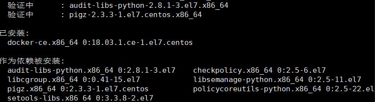

# 十分钟学会用docker部署微服务

>本文来自于oschina，介绍了Docker的优点，Docker架构，以CentOS为例介绍Docker安装等相关内容。

2013年发布至今， Docker 一直广受瞩目，被认为可能会改变软件行业。

但是，许多人并不清楚 Docker 到底是什么，要解决什么问题，好处又在哪里？今天就来详细解释，帮助大家理解它，还带有简单易懂的实例，教你如何将它用于日常开发并用其部署微服务。

## Docker简介

Docker是一个开源的容器引擎，它有助于更快地交付应用。 Docker可将应用程序和基础设施层隔离，并且能将基础设施当作程序一样进行管理。使用 Docker可更快地打包、测试以及部署应用程序，并可以缩短从编写到部署运行代码的周期。

Docker的优点如下：

1、简化程序

Docker 让开发者可以打包他们的应用以及依赖包到一个可移植的容器中，然后发布到任何流行的 Linux 机器上，便可以实现虚拟化。Docker改变了虚拟化的方式，使开发者可以直接将自己的成果放入Docker中进行管理。方便快捷已经是 Docker的最大优势，过去需要用数天乃至数周的 任务，在Docker容器的处理下，只需要数秒就能完成。

2、避免选择恐惧症

如果你有选择恐惧症，还是资深患者。Docker 帮你 打包你的纠结！比如 Docker 镜像；Docker 镜像中包含了运行环境和配置，所以 Docker 可以简化部署多种应用实例工作。比如 Web 应用、后台应用、数据库应用、大数据应用比如 Hadoop 集群、消息队列等等都可以打包成一个镜像部署。

3、节省开支

一方面，云计算时代到来，使开发者不必为了追求效果而配置高额的硬件，Docker 改变了高性能必然高价格的思维定势。Docker 与云的结合，让云空间得到更充分的利用。不仅解决了硬件管理的问题，也改变了虚拟化的方式。

## Docker架构


Docker daemon（ Docker守护进程）

Docker daemon是一个运行在宿主机（ DOCKER-HOST）的后台进程。可通过 Docker客户端与之通信。

Client（ Docker客户端）

Docker客户端是 Docker的用户界面，它可以接受用户命令和配置标识，并与 Docker daemon通信。图中， docker build等都是 Docker的相关命令。

Images（ Docker镜像）

Docker镜像是一个只读模板，它包含创建 Docker容器的说明。它和系统安装光盘有点像，使用系统安装光盘可以安装系统，同理，使用Docker镜像可以运行 Docker镜像中的程序。

Container（容器）

容器是镜像的可运行实例。镜像和容器的关系有点类似于面向对象中，类和对象的关系。可通过 Docker API或者 CLI命令来启停、移动、删除容器。

Registry

Docker Registry是一个集中存储与分发镜像的服务。构建完 Docker镜像后，就可在当前宿主机上运行。但如果想要在其他机器上运行这个镜像，就需要手动复制。此时可借助 Docker Registry来避免镜像的手动复制。

一个 Docker Registry可包含多个 Docker仓库，每个仓库可包含多个镜像标签，每个标签对应一个 Docker镜像。这跟 Maven的仓库有点类似，如果把 Docker Registry比作 Maven仓库的话，那么 Docker仓库就可理解为某jar包的路径，而镜像标签则可理解为jar包的版本号。

## Docker安装

Docker 是一个开源的商业产品，有两个版本：社区版（Community Edition，缩写为 CE）和企业版（Enterprise Edition，缩写为 EE）。企业版包含了一些收费服务，个人开发者一般用不到。下面的介绍都针对社区版。

我们这里以CentOS为例：

1、Docker 要求 CentOS 系统的内核版本高于 3.10 ，查看本页面的前提条件来验证你的CentOS 版本是否支持 Docker 。

通过 uname -r 命令查看你当前的内核版本

```
# uname -r
```

2、使用 root 权限登录 Centos。确保 yum 包更新到最新。

```
# yum -y update
```

3、卸载旧版本(如果安装过旧版本的话)

```
# yum remove docker docker-common docker-selinux docker-engine
```

4、安装需要的软件包， yum-util 提供yum-config-manager功能，另外两个是devicemapper驱动依赖的

```
# yum install -y yum-utils device-mapper-persistent-data lvm2
```

5、设置yum源

```
# yum-config-manager --add-repo https://download.docker.com/linux/centos/docker-ce.repo
```


6、可以查看所有仓库中所有docker版本，并选择特定版本安装

```

# yum list docker-ce --showduplicates | sort -r
```


7、安装docker

```
# sudo yum install -y docker-ce #由于repo中默认只开启stable仓库，故这里安装的是最新稳定版18.03.1
```



8、启动并加入开机启动

```
# systemctl start docker
# systemctl enable docker
```

9、验证安装是否成功(有client和service两部分表示docker安装启动都成功了)

```
# docker version
```


10、卸载docker

```
# yum -y remove docker-engine
```

## Docker常用命令

镜像相关命令

### 1、搜索镜像

可使用 docker search命令搜索存放在 Docker Hub(这是docker官方提供的存放所有docker镜像软件的地方，类似maven的中央仓库)中的镜像。执行该命令后， Docker就会在Docker Hub中搜索含有 java这个关键词的镜像仓库。

```
#docker search java
```


以上列表包含五列，含义如下：

\- NAME:镜像仓库名称。

\- DESCRIPTION:镜像仓库描述。

\- STARS：镜像仓库收藏数，表示该镜像仓库的受欢迎程度，类似于 GitHub的 stars0

\- OFFICAL:表示是否为官方仓库，该列标记为[0K]的镜像均由各软件的官方项目组创建和维护。

\- AUTOMATED：表示是否是自动构建的镜像仓库。

注意：使用docker查找或下载镜像可能会超时，所以我们需要为docker配置国内的镜像加速器

我们可以借助阿里云的镜像加速器，登录阿里云(https://cr.console.aliyun.com/#/accelerator)

可以看到镜像加速地址如下图：


`# cd /etc/docker` ，查看有没有 daemon.json。这是docker默认的配置文件。

如果没有新建，如果有，则修改。

```js
# vim daemon.json 
{
  "registry-mirrors": ["https://m9r2r2uj.mirror.aliyuncs.com"]
}
```

保存退出并重启docker服务

```
# service docker restart
```

### 2、下载镜像

使用命令docker pull命令即可从 Docker Registry上下载镜像，执行该命令后，Docker会从 Docker Hub中的 java仓库下载最新版本的 Java镜像。如果要下载指定版本则在java后面加冒号指定版本，例如：docker pull java:8

```
# docker pull java:8
```


### 3、列出镜像

使用 `docker images`命令即可列出已下载的镜像


以上列表含义如下

\- REPOSITORY：镜像所属仓库名称。

\- TAG:镜像标签。默认是 latest,表示最新。

\- IMAGE ID：镜像 ID，表示镜像唯一标识。

\- CREATED：镜像创建时间。

\- SIZE: 镜像大小。

### 4、删除本地镜像

使用 docker rmi命令即可删除指定镜像

```
# docker rmi java
```

## 容器相关命令

### 1、新建并启动容器

使用以下docker run <镜像名>命令即可新建并启动一个容器，该命令是最常用的命令，它有很多选项，下面将列举一些常用的选项。

```
# docker run -d -p 91:80 nginx
```

这样就能启动一个 Nginx容器。在本例中，为 docker run添加了两个参数，含义如下：

- -d 后台运行
- -p 宿主机端口:容器端口 #开放容器端口到宿主机端口

访问 http://Docker宿主机 IP:91/，将会看到nginx的主界面如下：


需要注意的是，使用 docker run命令创建容器时，会先检查本地是否存在指定镜像。如果本地不存在该名称的镜像， Docker就会自动从 Docker Hub下载镜像并启动一个 Docker容器。

该命令还有一个网络配置参数，如下所示

- --net选项：指定网络模式，该选项有以下可选参数：
- --net=bridge:默认选项，表示连接到默认的网桥。
- --net=host:容器使用宿主机的网络。

- --net=container:NAME-or-ID：告诉 Docker让新建的容器使用已有容器的网络配置。

- --net=none：不配置该容器的网络，用户可自定义网络配置。

### 2、列出容器

用 `docker ps` 命令即可列出运行中的容器


如需列出所有容器（包括已停止的容器），可使用-a参数。该列表包含了7列，含义如下

\- CONTAINER_ID：表示容器 ID。

\- IMAGE:表示镜像名称。

\- COMMAND：表示启动容器时运行的命令。

\- CREATED：表示容器的创建时间。

\- STATUS：表示容器运行的状态。UP表示运行中， Exited表示已停止。

\- PORTS:表示容器对外的端口号。

\- NAMES:表示容器名称。该名称默认由 Docker自动生成，也可使用 docker run命令的--name选项自行指定。

3、停止容器

使用 docker stop <容器id>命令，即可停止容器

```
# docker stop f0b1c8ab3633
```

其中f0b1c8ab3633是容器 ID，当然也可使用 `docker stop 容器名称` 来停止指定容器。

4、强制停止容器

可使用 `docker kill <容器id>` 命令发送 SIGKILL信号来强制停止容器。

5、启动已停止的容器

使用`docker run`命令，即可新建并启动一个容器。对于已停止的容器，可使用 `docker start <容器id>` 命令来启动

6、查看容器所有信息

使用命令 `docker inspect <容器id>`

7、查看容器日志，

使用命令 `docker container logs <容器id>` 

8、查看容器里的进程

使用命令 `docker top <容器id>`

9、进入容器

使用 `docker container exec -it <容器id> /bin/bash` 命令用于进入一个正在运行的docker容器。如果docker run命令运行容器的时候，没有使用-it参数，就要用这个命令进入容器。一旦进入了容器，就可以在容器的 Shell 执行命令了

9、删除容器

使用 `docker rm <容器id>`命令即可删除指定容器。

该命令只能删除已停止的容器，如需删除正在运行的容器，可使用-f参数

## 构建自己的docker镜像

使用Dockerfile构建自己的Docker镜像

Dockerfile是一个文本文件，其中包含了若干条指令，指令描述了构建镜像的细节

先来编写一个最简单的Dockerfile，以前文下载的Nginx镜像为例，来编写一个Dockerfile修改该Nginx镜像的首页

1、新建文件夹/app，在app目录下新建一个名为Dockerfile的文件，在里面增加如下内容：

```
FROM nginx #从本地的镜像仓库里拉取ngxin的docker镜像 
RUN echo 'This is QingFeng Nginx!!!' > /usr/share/nginx/html/index.html #修改ngxin的docker镜像的首页内容
```

该Dockerfile非常简单，其中的 FORM、 RUN都是 Dockerfile的指令。 FROM指令用于指定基础镜像， RUN指令用于执行命令。

2、在Dockerfile所在路径执行以下命令构建我们自己的ngxin镜像，构建完可用docker images命令查看是否已生成镜像ngxin:tuling：

```
# docker build -t nginx:qingfeng .
```

其中，-t指定镜像名字，命令最后的点（.）表示Dockerfile文件所在路径

3、执行以下命令，即可使用该镜像启动一个 Docker容器

```
# docker run -d -p 92:80 nginx:qingfeng
```

4、访问 http://Docker宿主机IP:92/，可看到下图所示界面，


Dockerfile的文件编写还有如下常用指令


注意：RUN命令在 image 文件的构建阶段执行，执行结果都会打包进入 image 文件；CMD命令则是在容器启动后执行。另外，一个 Dockerfile 可以包含多个RUN命令，但是只能有一个CMD命令。

注意，指定了CMD命令以后，`docker container run` 命令就不能附加命令了（比如前面的`/bin/bash`），否则它会覆盖CMD命令。

## 使用Dockerfile构建微服务镜像

以spring boot项目ms-eureka-server(源码在最后)为例，该项目就是一个spring cloud eureka的微服务项目，该项目可通过spring boot的maven插件打包成可执行的jar包运行，如下图所示


将该项目的可执行jar包构建成docker镜像：

1、将jar包上传linux服务器/app/eureka目录，在jar包所在目录创建名为Dockerfile的文件

2、在Dockerfile中添加以下内容

基于哪个镜像

```
From java:8
```

复制文件到容器

```
ADD microservice-eureka-server-0.0.1-SNAPSHOT.jar /app.jar
```

声明需要暴露的端口

```
EXPOSE 8761 # 微服务项目的启动端口
```

配置容器启动后执行的命令

```
ENTRYPOINT ["java","-jar","/app.jar"]
```

3、使用docker build命令构建镜像

```
# docker build -t microservice-eureka-server:0.0.1 .
```

格式： docker build -t 镜像名称:标签 Dockerfile的相对位置

在这里，使用-t选项指定了镜像的标签。执行该命令后，终端将会输出如下的内容


4、启动镜像，加-d可在后台启动

```
# docker run -p 8761:8761 microservice-eureka-server:0.0.1
```

5、访问http://Docker宿主机IP:8761/，可正常显示微服务Eureka Server的首页

