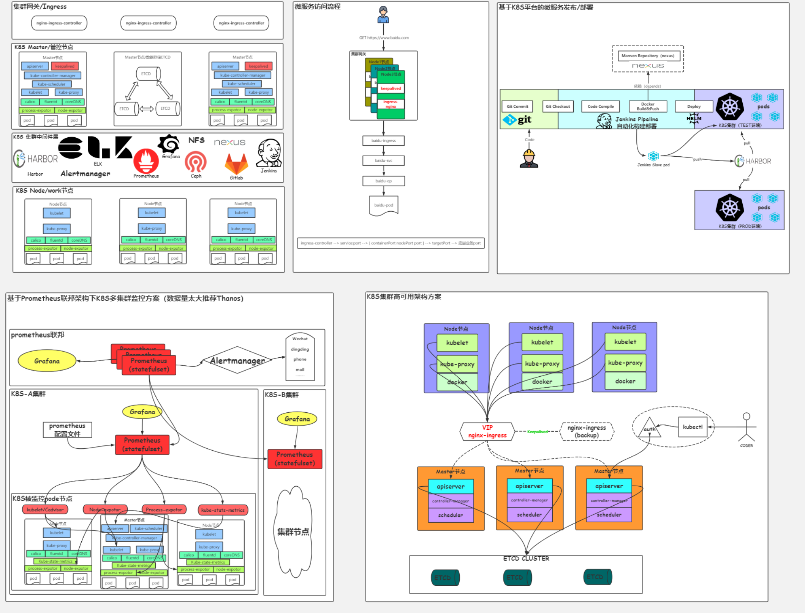
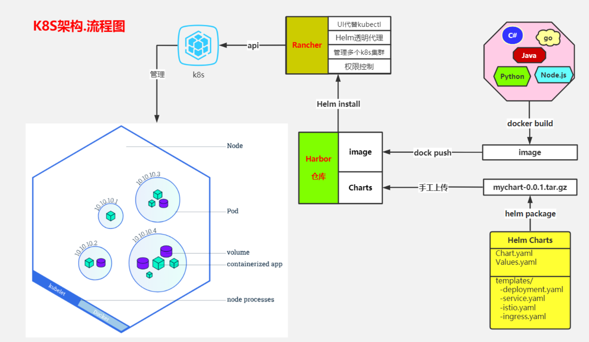
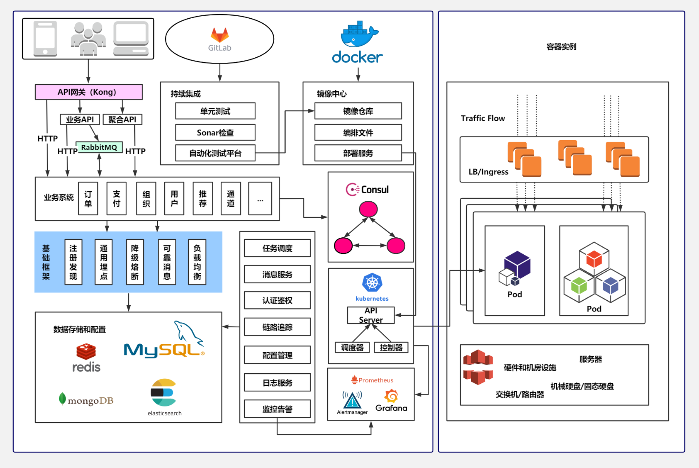
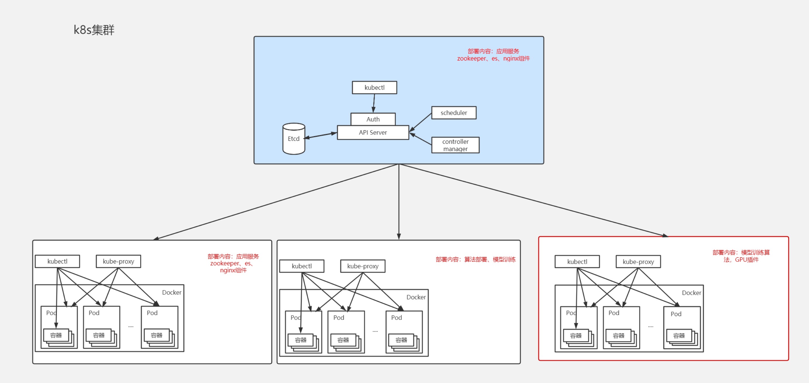
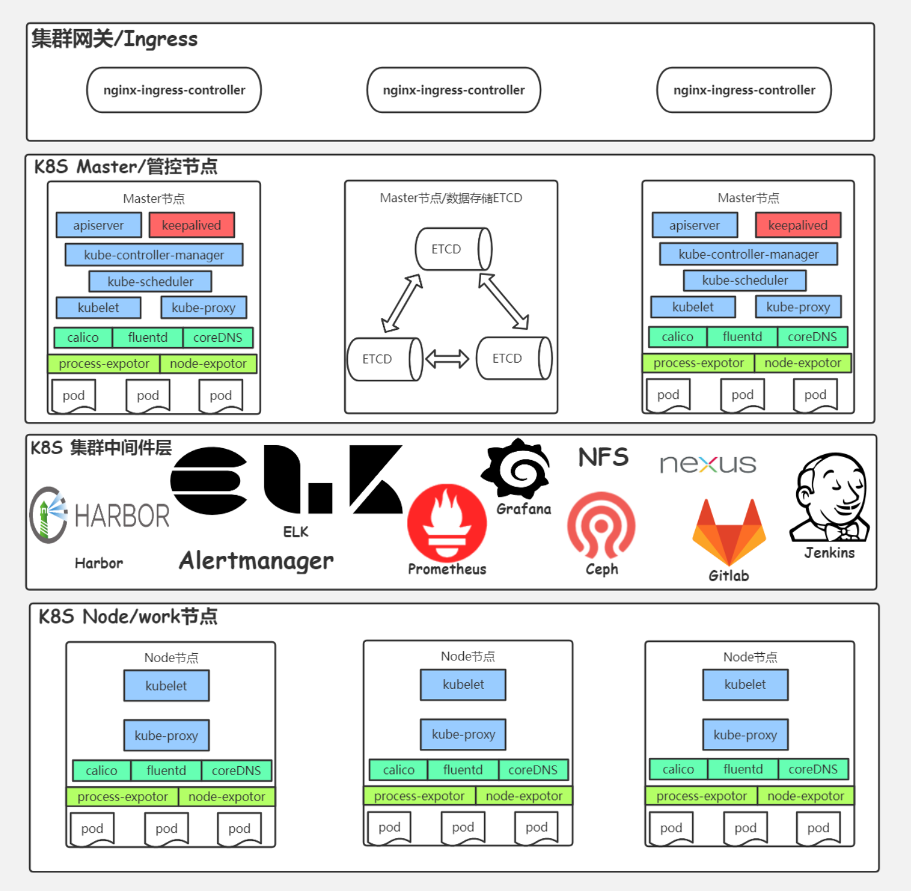
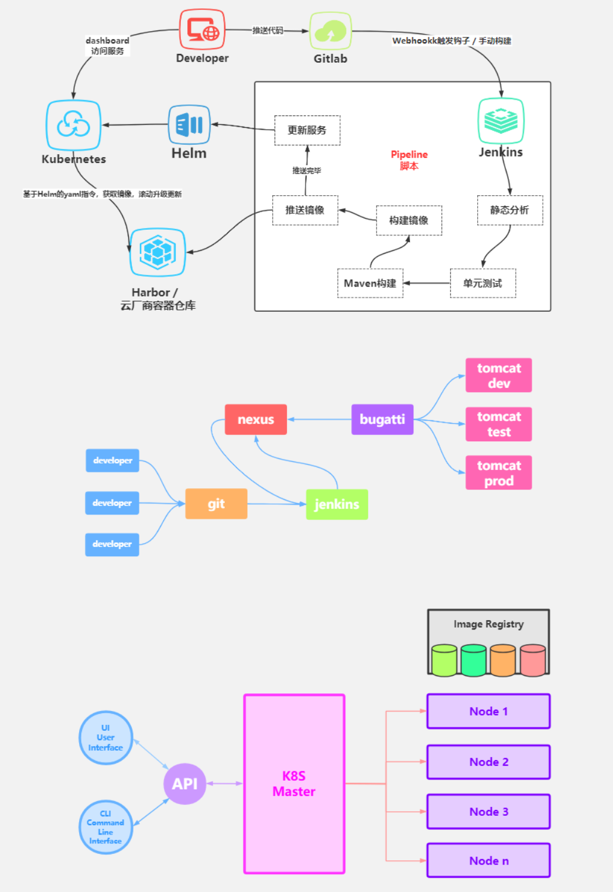
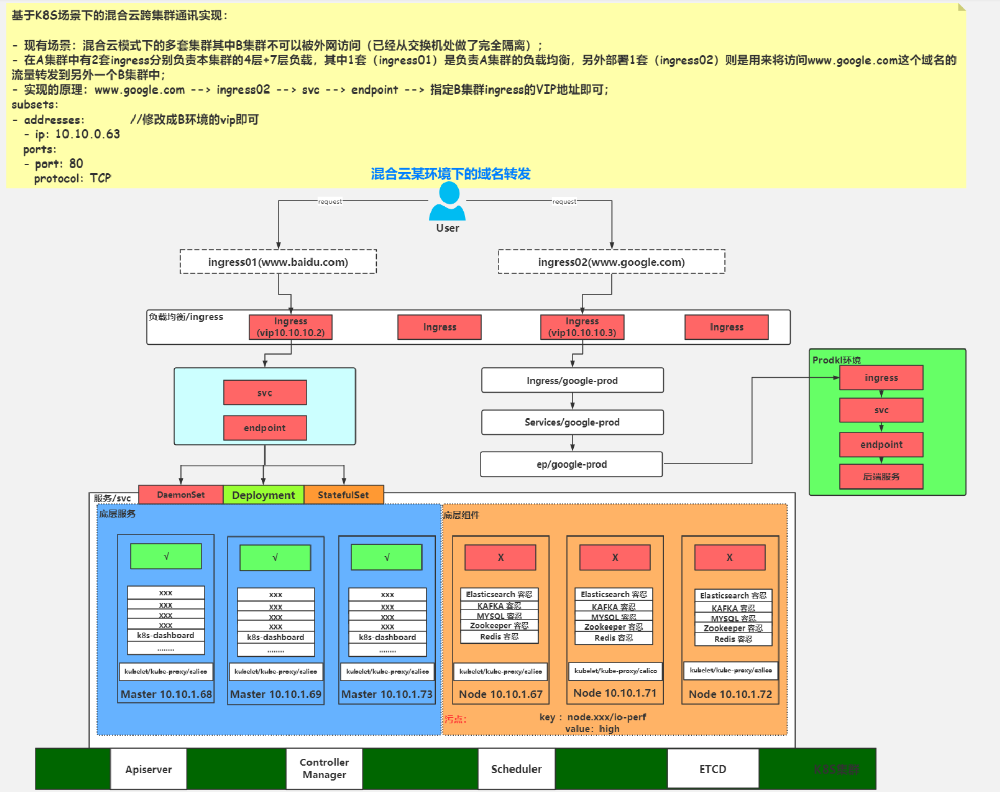
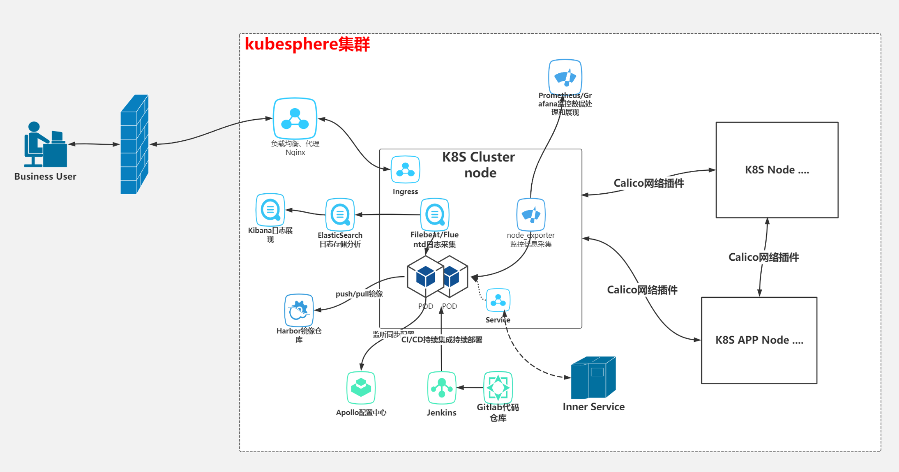

# 图解基于 Kubernetes 作为容器集群的管理平台 

图解基于 Kubernetes 作为容器集群的管理平台 （多图），包含基于K8s的全实现（组件、监控、访问/发版流程）、K8s架构流程图、基于K8s的微服务架构、K8s部署环境、K8s生产环境全概览、K8s架构分享、基于K8s的混合云集群通讯实现、K8s逻辑架构图。

基于 Kubernetes 作为容器集群的管理平台被广泛应用，今天我们一起来看看 Kubernetes 架构中有哪些常用的组件以及运行原理。

