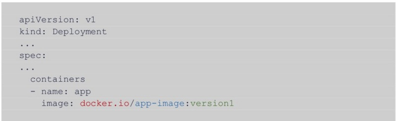
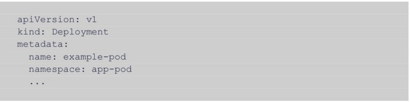
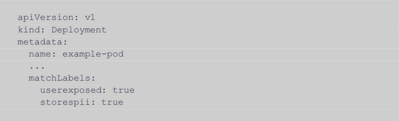
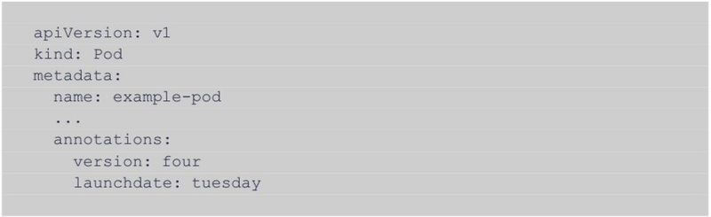

# [构建生产就绪的K8S集群的16点清单](https://segmentfault.com/a/1190000021377024)

Kubernetes是用于构建高度可扩展系统的强大工具。结果，许多公司已经开始或正在计划使用它来协调生产服务。不幸的是，像大多数强大的技术一样，Kubernetes也很复杂。我们整理了以下清单，以帮助你生产环境最佳实践Kubernetes。

## 容器最佳实践

Kubernetes提供了一种编排容器化服务的方法，因此，如果您没有按顺序实践你的容器，那么集群一开始就不会处于良好状态。请按照以下提示开始。

1: 使用精简基础镜像

**what**：容器是内置在系统镜像中的应用程序堆栈。从业务逻辑到内核的所有内容都打包在一起。最小的镜像会占用尽可能多的OS，并迫使您显式添加所需的任何组件。

**why**：仅在您的容器中包括要使用的软件，同时具有性能和安全性方面的好处。磁盘上的字节数更少，复制镜像的网络流量更少，并且潜在的攻击者无法访问的工具也更少。

**how**：Alpine Linux是一个流行的选择，并具有广泛的支持。

2：使用提供最佳正常运行时间的注册表

**what**：注册表是镜像的存储库，使这些镜像可供下载和启动。在指定部署配置时，您需要指定从何处获取路径为<registry> / <remote name>：<tag>的镜像：

**why**：您的集群需要镜像去运行。

**how**：大多数云提供商都提供私有镜像注册表服务：Google提供Google容器注册表，AWS提供Amazon ECR，Microsoft提供Azure容器注册表。

仔细调研，并选择提供最佳正常运行时间的私人注册表。由于您的群集将依靠您的注册表来启动软件的较新版本，因此任何停机时间都将阻止对正在运行的服务进行更新。

3：使用ImagePullSecrets对您的注册表进行身份验证

**what**：ImagePullSecrets是Kubernetes对象，可让您的群集通过注册表进行身份验证，因此注册表可以选择谁可以下载镜像。

**why**：如果您的注册表足够公开，可以让集群从中提取镜像，则表明注册表足够公开，需要身份验证。

**how**：Kubernetes网站在配置ImagePullSecrets方面有很好的演练，该[示例](https://kubernetes.io/docs/tasks/configure-pod-container/pull-image-private-registry/#log-in-to-docker)使用Docker作为示例注册表。

## 管理你的集群

微服务本质上是一团糟。使用微服务的许多好处来自在服务级别上强制职责分离，有效地为后端的各个组件创建了抽象。一些很好的例子是运行与业务逻辑分离的数据库，运行软件的单独开发和生产版本，或分离出水平可伸缩的流程。

具有不同服务执行不同职责的阴暗面是，它们不能被平等对待。值得庆幸的是，Kubernetes为您提供了许多解决此问题的工具。

4：使用命名空间隔离环境

**what**：命名空间是Kubernetes中最基本，最强大的分组机制。它们几乎像虚拟集群一样工作。默认情况下，Kubernetes中的大多数对象仅限于一次影响单个名称空间。

**why**：大多数对象都是在命名空间范围内定义的，因此您必须使用命名空间。鉴于它们提供了强大的隔离性，因此它们非常适合隔离具有不同目的的环境，例如用户服务的生产环境和严格用于测试的环境，或者分离支持单个应用程序的不同服务堆栈，例如保持安全解决方案的工作负载与您自己的应用程序分开。一个好的经验法则是按资源分配划分名称空间：如果两组微服务将需要不同的资源池，请将它们放在单独的名称空间中。

**how**：它是大多数对象类型的元数据的一部分：

请注意，您应该始终创建自己的名称空间，而不要依赖“默认”名称空间。 Kubernetes的默认设置通常会为开发人员优化以最小的摩擦，这通常意味着甚至放弃最基本的安全措施。

5：通过Labels 管理您的集群

**what**：Labels是组织集群的最基本且可扩展的方法。它们允许您创建用于分隔Kubernetes对象的任意key：value对。例如，您可以创建一个标签密钥，将处理敏感信息的服务与不处理敏感信息的服务区分开。

**why**：如前所述，Kubernetes使用标签进行组织，但更具体地说，它们用于选择。这意味着，当您想给Kubernetes对象引用某个命名空间中的一组对象时（例如告诉网络策略允许哪些服务相互通信），请使用它们的标签。由于它们代表了这种开放式组织类型，因此请尽最大努力使事情简单化，并且仅在需要选择权的地方创建标签。

**how**：标签是一个简单的规范字段，您可以将其添加到YAML文件中：

6：使用注释来跟踪重要的系统更改等

**what**：注释是可以附加到pod的任意键值元数据，就像标签一样。但是，Kubernetes不会读取或处理批注，因此围绕您可以和不能使用批注进行注释的规则相当宽松，并且不能用于选择。

**why**：它们可帮助您跟踪容器化应用程序的某些重要功能，例如版本号或首次启动的日期和时间。仅在Kubernetes的上下文中，注释是一种无能为力的构造，但是当用于跟踪重要的系统更改时，注释可以成为开发人员和运营团队的资产。

**how**：注释是类似于标签的规格字段。

## 让你的集群更加安全

好了，您已经建立了集群并按所需方式组织了-现在呢？好吧，接下来是要确保一些安全。您可能会花费一生的时间来学习，但仍未发现有人可以侵入您系统的所有方式。博客文章的内容空间要比一生少得多，因此您必须满足一些强烈的建议。

7：使用RBAC实施访问控制

**what**：RBAC（基于角色的访问控制）使您可以控制谁可以查看或修改群集的不同方面。

**why**：如果要遵循最小特权原则，则需要设置RBAC来限制群集用户和部署能够执行的操作。

**how**：如果要设置自己的集群（即不使用托管的Kube服务），请确保使用''--authorization-mode = Node，RBAC“启动您的kube apiserver。如果使用托管的Kubernetes例如，您可以通过查询用于启动kube apiserver的命令来检查它是否设置为使用RBAC。唯一通用的检查方法是在`kubectl cluster-info dump`的输出中查找“ --authorization-mode ...”。

RBAC打开后，您需要更改默认权限以适合您的需求。 Kubernetes项目站点在此处提供了有关设置角色和RoleBindings的[演练](https://kubernetes.io/docs/reference/access-authn-authz/rbac/)。托管的Kubernetes服务需要启用RBAC的自定义步骤-请参阅Google的GKE指南或Amazon的AKS指南。

8: 使用Pod安全策略防止危险行为

**what**：Pod安全策略是一种资源，非常类似于Deployment或Role，可以通过kubectl以相同的方式创建和更新。每个都有一个标志集合，可用来防止集群中特定的不安全行为。

**why**：如果创建Kubernetes的人认为限制这些行为足够重要，可以创建一个特殊的对象来处理它，那么它们很重要。

**how**：让他们工作可能会令人沮丧。我建议启动并运行RBAC，然后在此处查看Kubernetes项目的[指南](https://kubernetes.io/docs/concepts/policy/pod-security-policy/)。在我看来，最重要的使用是防止[特权容器](https://kubernetes.io/docs/concepts/policy/pod-security-policy/#privileged)和对[主机文件系统](https://kubernetes.io/docs/concepts/policy/pod-security-policy/#volumes-and-file-systems)的写访问，因为它们代表了容器抽象中一些较泄漏的部分。

9: 使用网络策略实施网络控制/防火墙

**what**：网络策略是允许您明确声明允许哪些流量的对象，而Kubernetes将阻止所有其他不符合标准的流量。

**why**：限制群集中的网络流量是一项基本且重要的安全措施。默认情况下，Kubernetes启用所有服务之间的开放式通信。保留此“默认开放”配置意味着与Internet连接的服务与存储敏感信息的数据库仅一步之遥。

**how**：有一篇文章写的很好，具体详情查看[这里](https://www.cncf.io/blog/2019/04/19/setting-up-kubernetes-network-policies-a-detailed-guide/)。

10：使用Secrets来存储和管理必要的敏感信息

**what**：Secrets是您如何在Kubernetes中存储敏感数据，包括密码，证书和令牌。

**why**：无论您是实施TLS还是限制访问，您的服务都可能需要相互认证，与其他第三方服务或您的用户进行认证。

**how**：Kubernetes项目在此处提供了[指南](https://kubernetes.io/docs/concepts/configuration/secret/)。一个关键建议：避免将机密作为环境变量加载，因为在您的环境中拥有机密数据通常是不安全的。相反，将机密装入容器中的只读卷中-您可以在本 [Use Secrets](https://kubernetes.io/docs/concepts/configuration/secret/#using-secrets)中找到一个示例。

11：使用镜像扫描识别和修复镜像漏洞

**what**：扫描仪检查镜像中安装的组件。从操作系统到应用程序堆栈的所有内容。扫描程序对于找出镜像所包含的软件版本中存在哪些漏洞非常有用。

**why**：漏洞一直在流行的开源软件包中发现。一些著名的例子是Heartbleed和Shellshock。您将想知道这些漏洞在系统中的什么位置，以便您知道哪些镜像可能需要更新。

**how**：扫描仪是基础设施中相当常见的部分-大多数云提供商都提供了产品。如果您想自己托管一些东西，那么开源Clair项目是一个受欢迎的选择。

## 保持您进群稳定

Kubernetes代表很高的技术栈。您拥有在嵌入式内核上运行的应用程序，在VM中运行的应用程序（在某些情况下甚至在裸机上），以及Kubernetes自己的服务共享硬件。考虑到所有这些因素，在物理和虚拟领域中很多事情都会出错，因此尽可能降低开发周期的风险非常重要。 Kubernetes周围的生态系统已经开发了一系列最佳实践，以使事情尽可能保持一致。

12：遵循CI / CD方法

**what**：持续集成/持续部署是一种过程哲学。相信对代码库进行的每次修改都应增加增量值，并准备投入生产。因此，如果代码库中的某些内容发生了更改，则可能要启动服务的新版本，以运行测试。

**why**：遵循CI / CD可以帮助您的工程团队在日常工作中牢记质量。如果出现问题，修复问题将成为整个团队的当务之急，因为此后依赖于已分解的提交的所有更改也将被分解。

**how**：由于云部署软件的兴起，CI / CD越来越流行。因此，您可以从托管或自托管的众多出色产品中进行选择。如果您的团队比较小，我建议您采用托管路线，因为节省的时间和精力绝对值得您付出额外的费用。

13：使用Canary方法进行更新

**what**：Canary是一种将服务更改从代码库中的提交带给用户的方法。您启动了一个运行最新版本的新实例，然后将用户缓慢迁移到新实例，从而逐渐获得了对更新的信心，而不是一次全部交换。

**why**：无论您的单元测试和集成测试有多广泛，它们都无法完全模拟生产中的运行-总是有可能某些功能无法按预期运行。使用金丝雀可以限制用户接触这些问题。

**how**：Kubernetes的可扩展性提供了许多途径来逐步推出服务更新。最直接的方法是创建一个单独的部署，与当前正在运行的实例共享一个负载平衡器。这个想法是您扩展新的部署，同时缩减旧的部署，直到所有正在运行的实例都是新版本。

14：实施监控并将其与SIEM集成

**what**：监视意味着跟踪和记录您的服务正在做什么。

**why**：让我们面对现实吧-不管您的开发人员多么出色，无论您的安全专家如何努力地发挥他们的聪明才智，事情都会出错。当他们这样做时，您将想知道发生了什么，以确保您不会两次犯相同的错误。

**how**：成功监视服务有两个步骤-需要对代码进行检测，并且需要将该检测的输出馈送到某个地方以进行存储，检索和分析。执行检测的方式在很大程度上取决于您的工具链，但是快速的网络搜索应该可以让您有所作为。就存储输出而言，除非您有专门知识或需求，否则我建议使用托管SIEM（例如Splunk或Sumo Logic）-根据我的经验，DIY始终是与任何存储相关的期望时间和精力的10倍。

## 深度建议

一旦集群达到一定规模后，您将发现手动执行所有最佳做法将变得不再可行，结果将给系统的安全性和稳定性带来挑战。超过此阈值后，请考虑以下主题：

15：使用服务网格管理服务间通信

**what**：服务网格是管理服务间通信的一种方法，可以有效地创建在实施服务时使用的虚拟网络。

**why**：使用服务网格可以减轻管理群集的一些较繁琐的方面，例如确保对通信进行正确的加密。

**how**：根据您对服务网格的选择，启动和运行的复杂性可能千差万别。作为最常用的服务网格，Istio似乎正在蓬勃发展，并且您的配置过程将在很大程度上取决于您的工作负载。

一个警告：如果您需要采用一个服务网格，请尽早采用它而不是稍后采用它-逐渐改变集群中的通信样式可能会非常痛苦。

16：使用准入控制器解锁Kubernetes中的高级功能

**what**：准入控制器是一种很好的万能工具，可用于管理集群中发生的一切。它们允许您设置Kubernetes在启动时将参考的Webhook。它们有两种形式：变异和验证。突变准入控制器会在部署启动之前更改其配置。验证准入控制器会与您的webhook一致，以允许启动给定的部署。

**why**：它们的用例广泛且数量众多–它们提供了一种通过自行开发的逻辑和限制来迭代地提高集群稳定性的好方法。

**how**：查看有关如何开始使用Admission Controllers的[指南](https://kubernetes.io/blog/2019/03/21/a-guide-to-kubernetes-admission-controllers/)。