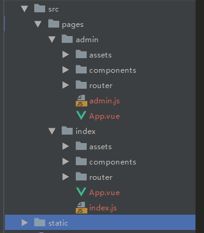

# vue多页面开发和打包正确处理方法


前段时间做项目，技术栈是vue+webpack,主要就是官网首页加后台管理系统 根据当时情况，分析出三种方案

1. 一个项目代码里面嵌两个spa应用(官网和后台系统)
2. 分开两套项目源码
3. 一套项目源码里面就一个spa应用

## 思考

1. 直接否定了一套项目源码里一个spa应用(ui样式会相互覆盖，如果没有代码规范后期比较难维护)
2. 两套源码的话，后台可能开两个端口，然后需要用nginx反向代理可能比较麻烦，而且前端开发也比较麻烦麻烦，毕竟需要维护两个git仓库，两套git上线流程，可能会损耗很多时间。
3. 对自己的技术(盲目)自信,也想尝尝鲜，分析出需求也不算很复杂。选了第一种方案，就是多个单页面应用在一套源码里面

多页面的结构图


## 下载vue spa模板

```
npm install vue-cli -g
vue init webpack multiple-vue-amazing
```

## 改造多页面应用

```
npm install glob --save-dev
```

修改src文件夹下面的目录结构

 

