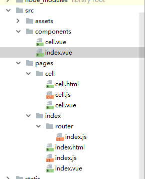

# Vue搭建多页面开发环境


自从习惯开发了单页面应用，对多页面的页面间的相互跳转间没有过渡效果、难维护极度反感。但是最近公司技术老大说，当一个应用越来越大的时候单页面模式应付不来，但是没讲怎么应付不来。

## 单页面和多页面应用模式的区别


| mm                         | 多页应用模式MPA                                          | 单页应用模式SPA                                              |
| -------------------------- | -------------------------------------------------------- | ------------------------------------------------------------ |
| 应用构成                   | 由多个完整页面构成                                       | 一个外壳页面和多个页面片段构成                               |
| 跳转方式                   | 页面之间的跳转是从一个页面跳转到另一个页面               | 页面片段之间的跳转是把一个页面片段删除或隐藏，加载另一个页面片段并显示出来。这是片段之间的模拟跳转，并没有开壳页面 |
| 跳转后公共资源是否重新加载 | 是                                                       | 否                                                           |
| URL模式                    | <http://xxx/page1.html><http://xxx/page2.html>           | <http://xxx/shell.html#page1> <http://xxx/shell.html#page2>  |
| 用户体验                   | 页面间切换加载慢，不流畅，用户体验差，特别是在移动设备上 | 页面片段间的切换快，用户体验好，包括在移动设备上             |
| 能否实现转场动画           | 无法实现                                                 | 容易实现（手机app动效）                                      |
| 页面间传递数据             | 依赖URL、cookie或者localstorage，实现麻烦                | 因为在一个页面内，页面间传递数据很容易实现                   |
| 搜索引擎优化（SEO）        | 可以直接做                                               | 需要单独方案做，有点麻烦                                     |
| 特别适用的范围             | 需要对搜索引擎友好的网站                                 | 对体验要求高的应用，特别是移动应用                           |
| 搜索引擎优化（SEO）        | 可以直接做                                               | 需要单独方案做，有点麻烦                                     |
| 开发难度                   | 低一些，框架选择容易                                     | 高一些，需要专门的框架来降低这种模式的开发难度               |

这样对比的话，单页面的优势确实很大，但当我自己去打开某宝，某东的移动端页面时，确实它们都是多页面应用。为什么？我能想到的就几点：

1. 单页面使用的技术对低版本的浏览器不友好，大公司还得兼顾使用低版本浏览器的用户啊

2. 功能模块开发来说，比如说单页面的业务公用组件，有时候你都不知道分给谁开发

3. seo优化（PS：既然是大应用应该很多人都知道，为什么还要做搜索引擎优化）

## 为什么用Vue写多页面

vue只是一个工具，把他当做一个操作dom的工具来用写多页面，有单页面的优势同时是多页面的表现形式（具体要看需求）

## 构建多页面应用

### 准备工作

新建一个项目，项目需要一个`"glob":"^7.0.3"`的依赖

### 修改webpack的配置

我们需要更改的文件

- utils.js
- webpack.base.conf.js
- webpack.dev.conf.js
- webpack.prod.conf.js

#### utils.js

在文件最后添加

```js
// utils.js文件
/* 这里是添加的部分 ---------------------------- 开始 */

// glob是webpack安装时依赖的一个第三方模块，还模块允许你使用 *等符号, 例如lib/*.js就是获取lib文件夹下的所有js后缀名的文件
var glob = require('glob')
// 页面模板
var HtmlWebpackPlugin = require('html-webpack-plugin')
// 取得相应的页面路径，因为之前的配置，所以是src文件夹下的pages文件夹
var PAGE_PATH = path.resolve(__dirname, '../src/pages')
// 用于做相应的merge处理
var merge = require('webpack-merge')
//多入口配置
// 通过glob模块读取pages文件夹下的所有对应文件夹下的js后缀文件，如果该文件存在
// 那么就作为入口处理
exports.entries = function () {
    var entryFiles = glob.sync(PAGE_PATH + '/*/*.js')
    var map = {}
    entryFiles.forEach((filePath) => {
        var filename = filePath.substring(filePath.lastIndexOf('\/') + 1, filePath.lastIndexOf('.'))
        map[filename] = filePath
    })
    return map
}

//多页面输出配置
// 与上面的多页面入口配置相同，读取pages文件夹下的对应的html后缀文件，然后放入数组中
exports.htmlPlugin = function () {
    let entryHtml = glob.sync(PAGE_PATH + '/*/*.html')
    let arr = []
    entryHtml.forEach((filePath) => {
        let filename = filePath.substring(filePath.lastIndexOf('\/') + 1, filePath.lastIndexOf('.'))
        let conf = {
            // 模板来源
            template: filePath,
            // 文件名称
            filename: filename + '.html',
            // 页面模板需要加对应的js脚本，如果不加这行则每个页面都会引入所有的js脚本
            chunks: ['manifest', 'vendor', filename],
            inject: true
        }
        if (process.env.NODE_ENV === 'production') {
            conf = merge(conf, {
                minify: {
                    removeComments: true,
                    collapseWhitespace: true,
                    removeAttributeQuotes: true
                },
                chunksSortMode: 'dependency'
            })
        }
        arr.push(new HtmlWebpackPlugin(conf))
    })
    return arr
}
/* 这里是添加的部分 ---------------------------- 结束 */
```


#### webpack.base.config.js

改为如下:

```js
module.exports = {
  /* 修改部分 ---------------- 开始 */
  entry: utils.entries(),
  /* 修改部分 ---------------- 结束 */
  output: {
    path: config.build.assetsRoot,
```

 注意我的多页面目录：


#### webpack.dev.conf.js

 文件修改如下：

```js
// https://github.com/glenjamin/webpack-hot-middleware#installation--usage
    new webpack.HotModuleReplacementPlugin(),
    new webpack.NoEmitOnErrorsPlugin(),
    // https://github.com/ampedandwired/html-webpack-plugin
    /* 注释这个区域的文件 ------------- 开始 */
    // new HtmlWebpackPlugin({
    //   filename: 'index.html',
    //   template: 'index.html',
    //   inject: true
    // }),
    /* 注释这个区域的文件 ------------- 结束 */
    new FriendlyErrorsPlugin()

    /* 添加 .concat(utils.htmlPlugin()) ------------------ */
  ].concat(utils.htmlPlugin())
})
```

#### webpack.prod.conf.js

```js
new OptimizeCSSPlugin({
      cssProcessorOptions: {
        safe: true
      }
    }),
    // generate dist index.html with correct asset hash for caching.
    // you can customize output by editing /index.html
    // see https://github.com/ampedandwired/html-webpack-plugin

    /* 注释这个区域的内容 ---------------------- 开始 */
    // new HtmlWebpackPlugin({
    //   filename: config.build.index,
    //   template: 'index.html',
    //   inject: true,
    //   minify: {
    //     removeComments: true,
    //     collapseWhitespace: true,
    //     removeAttributeQuotes: true
    //     // more options:
    //     // https://github.com/kangax/html-minifier#options-quick-reference
    //   },
    //   // necessary to consistently work with multiple chunks via CommonsChunkPlugin
    //   chunksSortMode: 'dependency'
    // }),
    /* 注释这个区域的内容 ---------------------- 结束 */

    // split vendor js into its own file
    new webpack.optimize.CommonsChunkPlugin({
      name: 'vendor',
      minChunks: function (module, count) {
        // any required modules inside node_modules are extracted to vendor
        return (
          module.resource &&
          /\.js$/.test(module.resource) &&
          module.resource.indexOf(
            path.join(__dirname, '../node_modules')
          ) === 0
        )
      }
    }),
    // extract webpack runtime and module manifest to its own file in order to
    // prevent vendor hash from being updated whenever app bundle is updated
    new webpack.optimize.CommonsChunkPlugin({
      name: 'manifest',
      chunks: ['vendor']
    }),
    // copy custom static assets
    new CopyWebpackPlugin([{
      from: path.resolve(__dirname, '../static'),
      to: config.build.assetsSubDirectory,
      ignore: ['.*']
    }])
    /* 该位置添加 .concat(utils.htmlPlugin()) ------------------- */
  ].concat(utils.htmlPlugin())
})
if (config.build.productionGzip) {
  var CompressionWebpackPlugin = require('compression-webpack-plugin')

  webpackConfig.plugins.push(
    new CompressionWebpackPlugin({
      asset: '[path].gz[query]',
      algorithm: 'gzip',
      test: new RegExp(
        '\\.(' +
        config.build.productionGzipExtensions.join('|') +
        ')$'
      ),
      threshold: 10240,
      minRatio: 0.8
    })
  )
}

if (config.build.bundleAnalyzerReport) {
  var BundleAnalyzerPlugin = require('webpack-bundle-analyzer').BundleAnalyzerPlugin
  webpackConfig.plugins.push(new BundleAnalyzerPlugin())
}

module.exports = webpackConfig
```

src是我使用的工程文件，asset，components,pages分别是静态资源文件，组件文件，页面文件


pages是按照项目的模块分的文件夹，每个模块都有三个内容：vue文件，js文件，html文件。这三个文件的作用相当于做SPA单页面应用时，根目录的index.html页面模板，src文件下的main.js和app.vue的功能。
原先，入口文件只有一个Main.js，但现在由于是多页面，因此入口也没多了，我目前就是两个：index和cell,之后如果打包，就会在dist文件夹下生成两个html文件：index.html和cell.html（可以参考一下单页面应用时，打包只会生成一个Index.html）