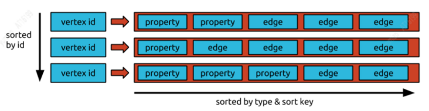

# [面向推荐的汽车知识图谱构建](https://segmentfault.com/a/1190000042287137)

### 一、背景

#### 1、引言

知识图谱的概念，最早由 Google 在2012 年提出， 旨在实现更智能的搜索引擎，并在2013年之后开始在学术界和工业级普及。目前，随着人工智能技术的高速发展，知识图谱已广泛应用于搜索、推荐、广告、风控、智能调度、语音识别、机器人等多个领域。

#### 2、发展现状

知识图谱作为人工智能的核心技术驱动力，能缓解深度学习依赖海量训练数据、大规模算力的问题，它能够广泛适配不同的下游任务，且具有良好的解释性，因此，全球大型互联网公司都在积极部署本企业的知识图谱。
例如2013年Facebook发布Open Graph，应用于社交网络智能搜索；2014年百度推出的知识图谱，主要应用于搜索、助理、及toB商业场景；2015年阿里推出的商品知识图谱，在前端导购、平台治理和智能问答等业务上起到关键作用；腾讯于17年推出的腾讯云知识图谱，有效助力于金融搜索、实体风险预测等场景；美团于2018年推出的美团大脑知识图谱，已经在智能搜索推荐、智能商户运营等多个业务中落地。

#### 3、目标及收益

目前领域图谱主要集中在电商、医疗、金融等商业领域，而关于汽车知识的语义网络及知识图谱构建缺少系统性的指导方法。本文以汽车领域知识为例，围绕车系、车型、经销商、厂商、品牌等实体及相互关系，提供一种从零搭建领域图谱的思路，并对搭建知识图谱中的步骤及方法进行了详细说明，以及介绍了基于本图谱的几个典型落地应用。
其中，数据源采用汽车之家网站，汽车之家是由导购、资讯、评测、口碑等多个板块组成的汽车服务类平台，在看、买、用等维度积累了大量的汽车数据，通过构建知识图谱把以汽车为核心的内容进行组织和挖掘，提供丰富的知识信息，结构化精准刻画兴趣，支持推荐用户冷启、召回、排序、展示等多个维度，给业务提升带来效果。

### 二、图谱构建

#### 1、构建的挑战

知识图谱是真实世界的语义表示，，其基本组成单位是【实体-关系-实体】，【实体-属性-属性值】的三元组（Triplet），实体之间通过关系相互联结，从而构成语义网络。图谱构建中会面临较大的挑战，但构建之后，可在数据分析、推荐计算、可解释性等多个场景展现出丰富的应用价值。
构建挑战：

- schema难定义：目前尚无统一成熟的本体构建流程，且特定领域本体定义通常需专家参与；

- 数据类型异构：通常情况下，一个知识图谱构建中面对的数据源不会是单一类型，包含结构化、半结构化，及非结构化数据，面对结构各异的数据，知识转模及挖掘的难度较高；

- 依赖专业知识：领域知识图谱通常依赖较强的专业知识，例如车型对应的维修方法，涉及机械、电工、材料、力学等多个领域知识，且此类关系对于准确度的要求较高，需要保证知识足够正确，因此也需要较好的专家和算法相结合的方式来进行高效的图谱构建；

- 数据质量无保证：挖掘或抽取信息需要知识融合或人工校验，才能作为知识助力下游应用。

- 收益：

- 知识图谱统一知识表示：通过整合多源异构数据，形成统一视图；

- 语义信息丰富：通过关系推理可以发现新关系边，获得更丰富的语义信息；

- 可解释性强：显式的推理路径对比深度学习结果具有更强的解释性；

- 高质量且能不断积累：根据业务场景设计合理的知识存储方案，实现知识更新和累积。

  #### 2、图谱架构设计

  技术架构主要分为构建层、存储层及应用层三大层，架构图如下：

- 构建层：包括schema定义，结构化数据转模，非结构化数据挖掘，以及知识融合；

- 存储层：包括知识的存储和索引，知识更新，元数据管理，以及支持基本的知识查询；

- 服务层：包括智能推理、结构化查询等业务相关的下游应用层。
  

  #### 3、具体构建步骤及流程

  依据架构图，具体构建流程可分为四步：本体设计、知识获取、知识入库，以及应用服务设计及使用。
  3.1 本体构建
  本体（Ontology）是公认的概念集合，本体的构建是指依据本体的定义，构建出知识图谱的本体结构和知识框架。
  基于本体构建图谱的原因主要有以下几点：

- 明确专业术语、关系及其领域公理，当一条数据必须满足Schema预先定义好的实体对象和类型后，才允许被更新到知识图谱中。

- 将领域知识与操作性知识分离，通过Schema可以宏观了解图谱架构及相关定义，无须再从三元组中归纳整理。

- 实现一定程度的领域知识复用。在构建本体之前，可以先调研是否有相关本体已经被构建出来了，这样可以基于已有本体进行改进和扩展，达到事半功倍的效果。

- 基于本体的定义，可以避免图谱与应用脱节，或者修改图谱schema比重新构建成本还要高的情况。例如将“宝马x3”、“2022款宝马x3”都作为汽车类实体来储存，在应用时都可能造成实例关系混乱、可用性差的问题，这种情况可以在设本体计阶段，通过将“汽车类实体”进行“车系”、“车型”子类细分的方法来避免。
  按照知识的覆盖面来看，知识图谱可以划分为通用知识图谱和领域知识图谱，目前通用知识图谱已有较多案例，例如Google的Knowledge Graph、微软的Satori和Probase等，领域图谱则为金融、电商等具体行业图谱。通用图谱更注重广度，强调融合更多的实体数量，但对精确度的要求不高，很难借助本体库对公理、规则及约束条件进行推理和使用；而领域图谱的知识覆盖范围较小，但知识深度更深，往往是在某一专业领域上的构建。
  考虑对准确率的要求，领域本体构建多倾向于手工构建的方式，例如代表性的七步法、IDEF5方法等[1]，该类方法的核心思想是，基于已有结构化数据，进行本体分析，将符合应用目的和范围的本体进行归纳及构建，再对本体进行优化和验证，从而获取初版本体定义。若想获取更大范畴的领域本体，则可以从非结构化语料中补充，考虑手工构建过程较大，本文以汽车领域为例，提供一种半自动本体构建的方式，详细步骤如下：

- 首先收集大量汽车非结构化语料（例如车系咨询、新车导购文章等），作为初始个体概念集，利用统计方法或无监督模型（TF-IDF、BERT等）获取字特征和词特征；

- 其次利用BIRCH聚类算法对概念间层次划分，初步构建起概念间层级关系，并对聚类结果进行人工概念校验和归纳，获取本体的等价、上下位概念；

- 最后使用卷积神经网络结合远程监督的方法，抽取本体属性的实体关系，并辅以人工识别本体中的类及属性的概念，构建起汽车领域本体。
  上述方法可有效利用BERT等深度学习的技术，更好地捕捉语料间的内部关系，使用聚类分层次对本体各模块进行构建，辅以人工干预，能够快速、准确的完成初步本体构建。下图为半自动化本体构建示意图：
  
  利用Protégé本体构建工具[2]，可以进行本体概念类、关系、属性和实例的构建，下图为本体构建可视化示例图：
  
  本文将汽车领域的顶层本体概念划分为三类，实体、事件及标签体系：
  1）实体类代表特定意义的概念类实体，包括词汇实体和汽车类实体，其中汽车类实体又包括组织机构和汽车概念等子实体类型；
  2）标签体系代表各个维度的标签体系，包括内容分类、概念标签、兴趣标签等以物料维度刻画的标签；
  3）事件类代表一个或多个角色的客观事实，不同类型事件间具有演变关系。
  Protégé可以导出不同类型的Schema配置文件，其中owl.xml结构配置文件如下图所示。该配置文件可直接在MYSQL、JanusGraph中加载使用，实现自动化的创建Schema。
  

  #### 3.2 知识获取

  知识图谱的数据来源通常包括三类数据结构，分别为结构化数据、半结构化数据、非结构化数据。 面向不同类型的数据源，知识抽取涉及的关键技术和需要解决的技术难点有所不同。

  ##### 3.2.1 结构化知识转模

  结构化数据是图谱最直接的知识来源，基本通过初步转换就可以使用，相较其他类型数据成本最低，所以一般图谱数据优先考虑结构化数据。结构化数据可能涉及多个数据库来源，通常需要使用ETL方法转模，ETL即Extract（抽取）、Transform（转换）、Load（装载），抽取是将数据从各种原始的业务系统中读取出来，这是所有工作的前提；转换是按照预先设计好的规则将抽取的数据进行转换，使本来异构的数据格式可以统一起来；装载是将转换完的数据按计划增量或全部导入到数据仓库中。
  通过上述ETL流程可将不同源数据落到中间表，从而方便后续的知识入库。下图为车系实体属性、关系表示例图：
  
  车系与品牌关系表：
  

  ##### 3.2.2 非结构化知识抽取-三元组抽取

  除了结构化数据，非结构化数据中也存在着海量的知识（三元组）信息。一般来说企业的非结构化数据量要远大于结构化数据，挖掘非结构化知识能够极大拓展和丰富知识图谱。
  三元组抽取算法的挑战
  问题1：单个领域内，⽂档内容和格式多样，需要⼤量的标注数据，成本⾼
  问题2：领域之间迁移的效果不够好，跨领域的可规模化拓展的代价⼤
  模型基本都是针对特定⾏业特定场景，换⼀个场景，效果会出现明显下降。
  解决思路，Pre-train + Finetune的范式，预训练：重量级底座让模型“⻅多识⼴”充分利⽤⼤规模多⾏业的⽆标⽂档，训练⼀个统⼀的预训练底座，增强模型对各类⽂档的表示和理解能⼒。
  微调：轻量级⽂档结构化算法。在预训练基础上，构建轻量级的⾯向⽂档结构化的算法，降低
  标注成本。
  针对⽂档的预训练⽅法
  现有关于⽂档的预训练模型，如果文本较短的类型，Bert可以完全编码整篇⽂档；⽽我们实际的⽂档通常⽐较⻓，需要抽取的属性值有很多是超过1024个字的，Bert进⾏编码会造成属性值截断。
  针对长文本预训练方法优点和不足
  Sparse Attention的⽅法通过优化Self-Attention，将O(n2)的计算优化⾄O(n)，⼤⼤提⾼了输⼊⽂本⻓度。虽然普通模型的⽂本⻓度从512提升到4096，但是依旧不能完全解决截断⽂
  本的碎⽚化问题。百度提出了ERNIE-DOC[3]使用了Recurrence Transformer方法，理论上可以建模⽆限⻓的⽂本。由于建模要输⼊所有的⽂本信息，耗时⾮常⾼。
  上述两种基于⻓⽂本的预训练⽅法，都没有考虑⽂档特性，如空间(Spartial)、视觉(Visual)等信息。并且基于⽂本设计的PretrainTask，整体是针对纯⽂本进⾏的设计，⽽没有针对⽂档的逻辑结构设计。
  针对上述不足这里介绍一种⻓⽂档预训练模型DocBert[4],DocBert模型设计：
  使⽤⼤规模（百万级）⽆标注⽂档数据进⾏预训练，基于⽂档的⽂本语义(Text)、版⾯信息
  (Layout)、视觉特征(Visual)构建⾃监督学习任务，使模型更好地理解⽂档语义和结构信息。
  1.Layout-Aware MLM：在Mask语⾔模型中考虑⽂本的位置、字体⼤⼩信息，实现⽂档布局感知的语义理解。
  2.Text-Image Alignment：融合⽂档视觉特征，重建图像中被Mask的⽂字，帮助模型学习⽂本、版⾯、图像不同模态间的对⻬关系。
  3.Title Permutation：以⾃监督的⽅式构建标题重建任务，增强模型对⽂档逻辑结构的理解能⼒。
  4.Sparse Transformer Layers：⽤Sparse Attention的⽅法，增强模型对⻓⽂档的处理能⼒。
  

  ##### 3.2.3 挖掘概念，兴趣词标签，关联到车系、实体

  除了结构化和非结构化文本中获取三元组，汽车之家还挖掘物料所包含的分类、概念标签和兴趣关键词标签，并建立物料和车实体之间的关联，为汽车知识图谱带来新的知识。下面从分类、概念标签、兴趣词标签来介绍汽车之家所做的内容理解部分工作以及思考。
  分类体系作为内容刻画基础，对物料进行粗粒度的划分。建立的统一的内容体系更多的是基于人工定义的方式，通过AI模型进行划分。在分类方法上我们我们采用了主动学习，对于比较难分的数据进行标注，同时采用数据增强，对抗训练，以及关键词融合方式提高分类的效果。
  
  概念标签粒度介于分类和兴趣词标签之间，比分类粒度更细，同时比兴趣词对于兴趣点刻画更加完整，我们建立了车视野、人视野、内容视野三个维度，丰富了标签维度，细化了标签粒度。丰富且具体的物料标签，更加方便搜索推荐基于标签的模型优化，且可用于标签外展起到吸引用户及二次引流等作用。概念标签的挖掘，结合在query等重要数据上采用机器挖掘方式，并对概括性进行分析，通过人工review，拿到概念标签集合，采用多标签模型分类。
  兴趣词标签是最细粒度的标签，映射为用户兴趣，根据不同用户兴趣偏好进可以更好的进行行个性化推荐。关键词的挖掘采用多种兴趣词挖掘相结合的方式，包括Keybert提取关键子串，并结合TextRank、positionRank、singlerank、TopicRank、MultipartiteRank等+句法分析多种方法，产生兴趣词候选。
  
  挖掘出来的词，相似度比较高，需要对同义词进行识别，需要提升人工的效率，因此我们也通过聚类进行自动化语义相似识别。用于聚类的特征有word2vec，bert embding等其他人工特征。然后使用聚类方法，最后经过人工矫正我们离线产生了一批高质量的关键词。
  对于不同粒度的标签还是在物料层面的，我们需要把标签和车建立起关联，首先我们分别计算出标题\文章的所属标签，然后识别出标题\文章内的实体，得到若干标签-实体伪标签，最后根据大量的语料，共现概率高的标签就会标记为该实体的标签。通过以上三个任务，我们在获得了丰富且海量的标签。对车系、实体关联上这些标签，会极大丰富我们的汽车图谱，建立了媒体和用户的关注车标签。

  ##### 3.2.4人效提升：

  伴随着更大规模的训练样本，如何获得更好的模型质量，如何解决标注成本高，标注周期长成为亟待解决的问题。首先我们可以使用半监督学习，利用海量未标注数据进行预训练。然后采用主动学习方式，最大化标注数据的价值，迭代选择高信息量样本进行标注。最后可以利用远程监督，发挥已有知识的价值，发觉任务之间的相关性。例如在有了图谱和标题后，可以用远程监督的方法基于图谱构造NER训练数据。

#### 3.3 知识入库

知识图谱中的知识是通过RDF结构来进行表示的，其基本单元是事实。每个事实是一个三元组(S, P, O)，在实际系统中，按照存储方式的不同，知识图谱的存储可以分为基于RDF表结构的存储和基于属性图结构的存储。图库更多是采用属性图结构的存储，常见的存储系统有Neo4j、JanusGraph、OritentDB、InfoGrid等。
图数据库选择
通过 JanusGraph 与 Neo4J、ArangoDB、OrientDB 这几种主流图数据库的对比，我们最终选择JanusGraph 作为项目的图数据库，之所以选择 JanusGraph，主要有以下原因：

- 基于 Apache 2 许可协议开放源码，开放性好。
- 支持使用 Hadoop 框架进行全局图分析和批量图处理。
- 支持很大的并发事务处理和图操作处理。通过添加机器横向扩展 JanusGraph 的事务 处理能力，可以在毫秒级别相应大图的复杂查询。
- 原生支持 Apache TinkerPop 描述的当前流行的属性图数据模型。
- 原生支持图遍历语言 Gremlin。
- 下图是主流图数据库对比
  
  **Janusgraph介绍**
  JanusGraph[5]是一个图形数据库引擎。其本身专注于紧凑图序列化、丰富图数据建模、高效的查询执行。图库schema 构成可以用下面一个公式来表示：
  janusgraph schema = vertex label + edge label + property keys
  这里值得注意的是property key通常用于graph index。

为了更好的图查询性能janusgraph建立了索引，索引分为Graph Index，Vertex-centric Indexes。Graph Index包含组合索引(Composite Index)和混合索引(Mixed Index).
组合索引仅限相等查找。（组合索引不需要配置外部索引后端，通过主存储后端支持(当然也可以配置hbase，Cassandra，Berkeley))
举例：
mgmt.buildIndex('byNameAndAgeComposite', Vertex.class).addKey(name).addKey(age).buildCompositeIndex() #构建一个组合索引“name-age”
g.V().has('age', 30).has('name', '小明')#查找 名字为小明年龄30的节点
混合索引需要ES作为后端索引以支持除相等以外的多条件查询（也支持相等查询，但相等查询，组合索引更快）。根据是否需要分词分为full-text search，和string search
JanusGraph数据存储模型
了解Janusgraph存储数据的方式，有助于我们更好的利用该图库。JanusGraph 以邻接列表格式存储图形，这意味着图形存储为顶点及其邻接列表的集合。 顶点的邻接列表包含顶点的所有入射边（和属性）。

JanusGraph 将每个邻接列表作为一行存储在底层存储后端中。 （64 位）顶点 ID（JanusGraph 唯一分配给每个顶点）是指向包含顶点邻接列表的行的键。 每个边和属性都存储为行中的一个单独的单元格，允许有效的插入和删除。 因此，特定存储后端中每行允许的最大单元数也是 JanusGraph 可以针对该后端支持的顶点的最大度数。
如果存储后端支持 key-order，则邻接表将按顶点 id 排序，JanusGraph 可以分配顶点 id，以便对图进行有效分区。 分配 id 使得经常共同访问的顶点具有绝对差异小的 id。

#### 3.4 图谱查询服务

Janusgraph进行图搜索用的是gremlin语言，我们提供了统一的图谱查询服务，外部使用不用关心gremlin语言的具体实现，采用通用的接口进行查询。我们分为三个接口：条件搜索接口，以节点为中心向外查询，和节点间路径查询接口。下面是几个gremlin实现的例子：

- 条件搜索：查询10万左右，销量最高的车：
  g.V().has('price',gt(8)).has('price',lt(12)).order().by('sales',desc).valueMap().limit(1)
  输出：
  ==>{name=[xuanyi], price=[10], sales=[45767]}
  轩逸销量最高，为45767
- 以节点为中心向外查询：查询以小明为中心，2度的节点
  g.V(xiaoming).repeat(out()).times(2).valueMap()
- 节点间路径查询：荐给小明推荐两篇文章，这两篇文章分别介绍的是卡罗拉和轩逸，查询小明 和 这两篇文章的路径：
  g.V(xiaoming).repeat(out().simplePath()).until(or(has("car", 'name', 'kaluola'),has("car", 'name', 'xuanyi'))).path().by("name")
  输出
  ==>path[xiaoming, around 10w, kaluola]
  ==>path[xiaoming, around 10w, xuanyi]
  发现小明和这两篇文章之间有个节点“10万左右”

### 三、知识图谱在推荐的应用

知识图谱中存在大量的非欧式数据，基于KG的推荐应用有效利用非欧式数据提升推荐系统准确度，进而让推荐系统能达到传统系统所无法达到的效果。基于KG的推荐可以分成以三类，基于KG表征技术（KGE）、基于路径的方法、图神经网络。本章将从KG在推荐系统中冷启、理由、排序三方面的应用和论文进行介绍。

#### 3.1 知识图谱在推荐冷启动的应用

知识图谱能够从user-item交互中建模KG中隐藏的高阶关系,很好地解决了因用户调用有限数量的行为而导致的数据稀疏性，进而可以应用在解决冷启动问题。这一问题业界也有相关研究。
Sang 等[6]提出了一种双通道神经交互方法，称为知识图增强的残差递归神经协同过滤（KGNCF-RRN），该方法利用KG上下文的长期关系依赖性和用户项交互进行推荐。（1）对于KG上下文交互通道，提出了残差递归网络（RRN）来构造基于上下文的路径嵌入，将残差学习融入传统的递归神经网络（RNN）中，以有效地编码KG的长期关系依赖。然后将自关注网络应用于路径嵌入，以捕获各种用户交互行为的多义。（2） 对于用户项目交互通道，用户和项目嵌入被输入到新设计的二维交互图中。（3）最后，在双通道神经交互矩阵之上，使用卷积神经网络来学习用户和项目之间的复杂相关性。该方法能捕捉丰富的语义信息，还能捕捉用户与项目之间复杂的隐含关系，用于推荐。
Du Y等[7]提出了一种新的基于元学习框架的冷启问题解决方案MetaKG，包括collaborative-aware meta learner和knowledge-aware meta learner，捕捉用户的偏好和实体冷启动知识。collaborative-aware meta learner学习任务旨在聚合每个用户的偏好知识表示。相反，knowledge-aware meta learner学习任务要在全局泛化不同的用户偏好知识表示。在两个learner的指导下，MetaKG可以有效地捕捉到高阶的协作关系关系和语义表示，可以轻松适应冷启动场景。此外，作者还设计了一种自适应任务，可以自适应地选择KG信息进行学习，以防止模型被噪声信息干扰。MetaKG架构如下图所示。

#### 3.2 知识图谱在推荐理由生成的应用

推荐理由能提高推荐系统的可解释性，让用户理解生成推荐结果的计算过程，同时也可以解释item受欢迎的原因。用户通过推荐理由了解推荐结果的产生原理，可以增强用户对系统推荐结果的信心，并且在推荐失误的情况下对错误结果更加宽容。
最早可解释推荐是以模板为主，模板的好处是保证了可读性和高准确率。但是需要人工整理模板，并且泛华性不强，给人一种重复的感觉。后来发展不需要预设的free-form形式，并且加以知识图谱，以其中的一条路径作为解释，配合标注还有一些结合KG路径的生成式的方法，模型中选择的每个点或边都是一个推理过程，可以向用户展示。最近Chen Z [8]等人提出一种增量多任务学习框架ECR，可以实现推荐预测、解释生成和用户反馈集成之间的紧密协作。它由两大部分组成。第一部分，增量交叉知识建模，学习推荐任务和解释任务中转移的交叉知识，并说明如何使用交叉知识通过使用增量学习进行更新。第二部分，增量多任务预测，阐述如何基于交叉知识生成解释，以及如何根据交叉知识和用户反馈预测推荐分数。

#### 3.3 知识图谱在推荐排序的应用

KG可以通过给item用不同的属性进行链接，建立user-item之间interaction，将uesr-item graph和KG结合成一张大图，可以捕获item间的高阶联系。传统的推荐方法是将问题建模为一个监督学习任务，这种方式会忽略item之间的内在联系(例如凯美瑞和雅阁的竞品关系)，并且无法从user行为中获取协同信号。下面介绍两篇KG应用在推荐排序的论文。
Wang[9]等人设计了KGAT算法，首先利用GNN迭代对embedding进行传播、更新，从而能够在快速捕捉高阶联系；其次，在aggregation时使用attention机制，传播过程中学习到每个neighbor的weight，反应高阶联系的重要程度；最后，通过N阶传播更新得到user-item的N个隐式表示，不同layer表示不同阶数的连接信息。KGAT可以捕捉更丰富、不特定的高阶联系。

Zhang[20]等人提出RippleNet模型，其关键思想是兴趣传播：RippleNet将用户的历史兴趣作为KG中的种子集合(seed set)，然后沿着KG的连接向外扩展用户兴趣，形成用户在KG上的兴趣分布。RippleNet最大的优势在于它可以自动地挖掘从用户历史点击过的物品到候选物品的可能路径，不需要任何人工设计元路径或元图。

RippleNet将用户U和项目V作为输入，并输出用户U单击项目V的预测概率。对于用户U，将其历史兴趣V_{u}作为种子，在图中可以看到最初的起点是两个，之后不断向周围扩散。给定itemV和用户U的1跳ripple集合V_{u_{}^{1}}中的每个三元组\left( h_{i},r_{i},t_{i} \right)，通过比较V与三元组中的节点h_{i}和关系r_{i}分配相关概率。

在得到相关概率后，将V_{u_{}^{1}}中三元组的尾部乘以相应的相关概率进行加权求和，得到用户U的历史兴趣关于V的一阶响应，用户兴趣由V_{u}转移到o_{u}^{1}，可以计算得到o_{u}^{2}、o_{u}^{3}...o_{u}^{n}，进而计算得到U关于item V的特征可以被计算为融合他的所有阶数响应。

### 四、总结

综上，我们主要围绕推荐，介绍了图谱构建详细流程，对其中的困难和挑战做出了分析。同时也综述了很多重要的工作，以及给出了具体的解决方案，思路以及建议。最后介绍了包括知识图谱的应用，特别在推荐领域中冷起、可解释性、召回排序介绍了知识图谱的作用与使用。

------

**引用**：
[1] Kim S，Oh S G．Extracting and Applying Evaluation Criteria for Ontology Quality Assessment［J］．Library Hi Tech，2019.
[2] Protege: [https://protegewiki.stanford.edu](https://link.segmentfault.com/?enc=0QhXzIkiB8V0q9sXmui%2BLw%3D%3D.3iKpxuWboJOXnvNdRh2Yez%2BdrLOl%2Bus46cnouAEvUDUKlUdE0F4DPR4bAl3zraEd)
[3] Ding S , Shang J , Wang S , et al. ERNIE-DOC: The Retrospective Long-Document Modeling Transformer[J]. 2020.
[4] DocBert，[1] Adhikari A , Ram A , Tang R , et al. DocBERT: BERT for Document Classification[J]. 2019.
[5] JanusGraph，[https://docs.janusgraph.org/](https://link.segmentfault.com/?enc=U9NBciABbyCcEOV1LQL6lQ%3D%3D.0IhbDe8QVVD2XlC9AoKDNBczLvAvrq9n3q%2FodBp8a%2B4%3D)
[6] Sang L, Xu M, Qian S, et al. Knowledge graph enhanced neural collaborative filtering with residual recurrent network[J]. Neurocomputing, 2021, 454: 417-429.
[7] Du Y , Zhu X , Chen L , et al. MetaKG: Meta-learning on Knowledge Graph for Cold-start Recommendation[J]. arXiv e-prints, 2022.
[8] Chen Z , Wang X , Xie X , et al. Towards Explainable Conversational Recommendation[C]// Twenty-Ninth International Joint Conference on Artificial Intelligence and Seventeenth Pacific Rim International Conference on Artificial Intelligence {IJCAI-PRICAI-20. 2020.
[9] Wang X , He X , Cao Y , et al. KGAT: Knowledge Graph Attention Network for Recommendation[J]. ACM, 2019.
[10] Wang H , Zhang F , Wang J , et al. RippleNet: Propagating User Preferences on the Knowledge Graph for Recommender Systems[J]. ACM, 2018.