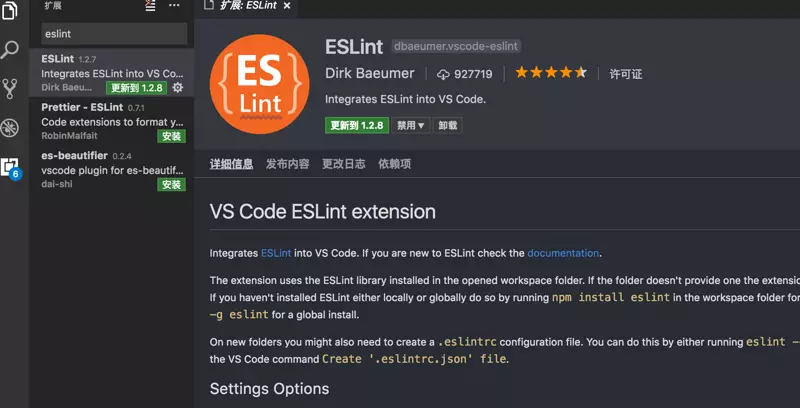

# 使用vue实现后台管理界面

## 一、基础篇

完整项目地址：[vue-element-admin](https://link.juejin.im?target=https%3A%2F%2Fgithub.com%2FPanJiaChen%2Fvue-element-admin)

配套完整后台demo地址：[vue-element-admin](https://github.com/PanJiaChen/vue-element-admin)

系列文章：

*   [手摸手，带你用vue撸后台 系列一（基础篇）](https://juejin.im/post/59097cd7a22b9d0065fb61d2)
*   [手摸手，带你用vue撸后台 系列二(登录权限篇)](https://juejin.im/post/591aa14f570c35006961acac)
*   [手摸手，带你用vue撸后台 系列三 (实战篇)](https://juejin.im/post/593121aa0ce4630057f70d35)
*   [手摸手，带你用vue撸后台 系列四(vueAdmin 一个极简的后台基础模板)](https://juejin.im/post/595b4d776fb9a06bbe7dba56)
*   [手摸手，带你封装一个vue component](https://link.juejin.im?target=https%3A%2F%2Fsegmentfault.com%2Fa%2F1190000009090836)
*   [手摸手，带你优雅的使用 icon](https://juejin.im/post/59bb864b5188257e7a427c09)
*   [手摸手，带你用合理的姿势使用webpack4（上）](https://juejin.im/post/5b56909a518825195f499806)
*   [手摸手，带你用合理的姿势使用webpack4（下）](https://juejin.im/post/5b5d6d6f6fb9a04fea58aabc)

### 前言


说好的教程终于来了，第一篇文章主要来说一说在开始写实际业务代码之前的一些准备工作吧，但这里不会教你 webpack 的基础配置，热更新原理是什么，webpack速度优化等等，有需求的请自行 google，相关文章已经很多了。

### 目录结构


    ├── build                      // 构建相关  
    ├── config                     // 配置相关
    ├── src                        // 源代码
    │   ├── api                    // 所有请求
    │   ├── assets                 // 主题 字体等静态资源
    │   ├── components             // 全局公用组件
    │   ├── directive              // 全局指令
    │   ├── filtres                // 全局 filter
    │   ├── icons                  // 项目所有 svg icons
    │   ├── lang                   // 国际化 language
    │   ├── mock                   // 项目mock 模拟数据
    │   ├── router                 // 路由
    │   ├── store                  // 全局 store管理
    │   ├── styles                 // 全局样式
    │   ├── utils                  // 全局公用方法
    │   ├── vendor                 // 公用vendor
    │   ├── views                   // view
    │   ├── App.vue                // 入口页面
    │   ├── main.js                // 入口 加载组件 初始化等
    │   └── permission.js          // 权限管理
    ├── static                     // 第三方不打包资源
    │   └── Tinymce                // 富文本
    ├── .babelrc                   // babel-loader 配置
    ├── eslintrc.js                // eslint 配置项
    ├── .gitignore                 // git 忽略项
    ├── favicon.ico                // favicon图标
    ├── index.html                 // html模板
    └── package.json               // package.json
    复制代码

这里来简单讲一下src文件

#### api 和 views

简单截取一下公司后台项目，现在后台大概有四五十个 api 模块


如图可见模块有很多，而且随着业务的迭代，模块还会会越来越多。 所以这里建议根据业务模块来划分 views，并且 将views 和 api 两个模块一一对应，从而方便维护。如下图：


如 article 模块下放的都是文章相关的 api，这样不管项目怎么累加，api和views的维护还是清晰的，当然也有一些全区公用的api模块，如七牛upload，remoteSearch等等，这些单独放置就行。

#### components

这里的 components 放置的都是全局公用的一些组件，如上传组件，富文本等等。一些页面级的组件建议还是放在各自views文件下，方便管理。如图：


#### store

这里我个人建议不要为了用 vuex 而用 vuex。就拿我司的后台项目来说，它虽然比较庞大，几十个业务模块，几十种权限，但业务之间的耦合度是很低的，文章模块和评论模块几乎是俩个独立的东西，所以根本没有必要使用 vuex 来存储data，每个页面里存放自己的 data 就行。当然有些数据还是需要用 vuex 来统一管理的，如登录token,用户信息，或者是一些全局个人偏好设置等，还是用vuex管理更加的方便，具体当然还是要结合自己的业务场景的。总之还是那句话，不要为了用vuex而用vuex！

* * *

### webpack


> 这里是用 [vue-cli](https://link.juejin.im?target=https%3A%2F%2Fgithub.com%2Fvuejs%2Fvue-cli) 的 [webpack-template](https://link.juejin.im?target=https%3A%2F%2Fgithub.com%2Fvuejs-templates%2Fwebpack) 为基础模板构建的，如果你对这个有什么疑惑请自行google，相关的配置绍其它的文章已经介详细了，这里就不再展开了。简单说一些需要注意到地方。

#### jquery (本项目已移除)

管理后台不同于前台项目，会经常用到一些第三方插件，但有些插件是不得不依赖 jquery 的，如市面很多富文本基都是依赖 jquery 的，所以干脆就直接引入到项目中省事(gzip之后只有34kb，而且常年from cache,不要考虑那些吹毛求疵的大小问题，这几kb和提高的开发效率根本不能比)。但是如果第三方库的代码中出现则会直接报错。要达到类似的效果，则需要使用 webpack 内置的 `ProvidePlugin` 插件，配置很简单，只需要

    new webpack.ProvidePlugin({
      $: 'jquery' ,
      'jQuery': 'jquery'
    })

这样当 webpack 碰到 require 的第三方库中出现全局的$、jQeury和window.jQuery 时，就会使用 node_module 下 jquery 包 export 出来的东西了。

#### alias

当项目逐渐变大之后，文件与文件直接的引用关系会很复杂，这时候就需要使用[alias](https://link.juejin.im?target=https%3A%2F%2Fwebpack.js.org%2Fconfiguration%2Fresolve%2F) 了。 有的人喜欢alias 指向src目录下，再使用相对路径找文件

    resolve: {
      alias: {
        '~': resolve(__dirname, 'src')
      }
    }
    
    //使用
    import stickTop from '~/components/stickTop'

或者也可以

    alias: {
      'src': path.resolve(__dirname, '../src'),
      'components': path.resolve(__dirname, '../src/components'),
      'api': path.resolve(__dirname, '../src/api'),
      'utils': path.resolve(__dirname, '../src/utils'),
      'store': path.resolve(__dirname, '../src/store'),
      'router': path.resolve(__dirname, '../src/router')
    }
    
    //使用
    import stickTop from 'components/stickTop'
    import getArticle from 'api/article'

没有好与坏对与错，纯看个人喜好和团队规范。

* * *

### ESLint


不管是多人合作还是个人项目，代码规范是很重要的。这样做不仅可以很大程度地避免基本语法错误，也保证了代码的可读性。这所谓工欲善其事，必先利其器，个人推荐 eslint+vscode 来写 vue，绝对有种飞一般的感觉。效果如图：


每次保存，vscode就能标红不符合eslint规则的地方，同时还会做一些简单的自我修正。安装步骤如下：

首先安装eslint插件



安装并配置完成 ESLint 后，我们继续回到 VSCode 进行扩展设置，依次点击 文件 > 首选项 > 设置 打开 VSCode 配置文件,添加如下配置


        "files.autoSave":"off",
        "eslint.validate": [
           "javascript",
           "javascriptreact",
           "html",
           { "language": "vue", "autoFix": true }
         ],
         "eslint.options": {
            "plugins": ["html"]
         }

这样每次保存的时候就可以根据根目录下.eslintrc.js你配置的eslint规则来检查和做一些简单的fix。这里提供了一份我平时的eslint规则[地址](https://link.juejin.im?target=https%3A%2F%2Fgithub.com%2FPanJiaChen%2Fvue-element-admin%2Fblob%2Fmaster%2F.eslintrc.js)，都简单写上了注释。每个人和团队都有自己的代码规范，统一就好了，去打造一份属于自己的eslint 规则上传到npm吧，如饿了么团队的 [config](https://link.juejin.im?target=https%3A%2F%2Fwww.npmjs.com%2Fpackage%2Feslint-config-elemefe)，vue的 [config](https://link.juejin.im?target=https%3A%2F%2Fgithub.com%2Fvuejs%2Feslint-config-vue)。

[vscode 插件和配置推荐](https://link.juejin.im?target=https%3A%2F%2Fgithub.com%2FvarHarrie%2FDawn-Blossoms%2Fissues%2F10)

* * *

### 封装 axios


我们经常遇到一些线上 的bug，但测试环境很难模拟。其实可以通过简单的配置就可以在本地调试线上环境。 这里结合业务封装了axios ，[线上代码](https://link.juejin.im?target=https%3A%2F%2Fgithub.com%2FPanJiaChen%2Fvue-element-admin%2Fblob%2Fmaster%2Fsrc%2Futils%2Ffetch.js)

    import axios from 'axios'
    import { Message } from 'element-ui'
    import store from '@/store'
    import { getToken } from '@/utils/auth'
    
    // 创建axios实例
    const service = axios.create({
      baseURL: process.env.BASE_API, // api的base_url
      timeout: 5000 // 请求超时时间
    })
    
    // request拦截器
    service.interceptors.request.use(config => {
      // Do something before request is sent
      if (store.getters.token) {
        config.headers['X-Token'] = getToken() // 让每个请求携带token--['X-Token']为自定义key 请根据实际情况自行修改
      }
      return config
    }, error => {
      // Do something with request error
      console.log(error) // for debug
      Promise.reject(error)
    })
    
    // respone拦截器
    service.interceptors.response.use(
      response => response,
      /**
      * 下面的注释为通过response自定义code来标示请求状态，当code返回如下情况为权限有问题，登出并返回到登录页
      * 如通过xmlhttprequest 状态码标识 逻辑可写在下面error中
      */
      //  const res = response.data;
      //     if (res.code !== 20000) {
      //       Message({
      //         message: res.message,
      //         type: 'error',
      //         duration: 5 * 1000
      //       });
      //       // 50008:非法的token; 50012:其他客户端登录了;  50014:Token 过期了;
      //       if (res.code === 50008 || res.code === 50012 || res.code === 50014) {
      //         MessageBox.confirm('你已被登出，可以取消继续留在该页面，或者重新登录', '确定登出', {
      //           confirmButtonText: '重新登录',
      //           cancelButtonText: '取消',
      //           type: 'warning'
      //         }).then(() => {
      //           store.dispatch('FedLogOut').then(() => {
      //             location.reload();// 为了重新实例化vue-router对象 避免bug
      //           });
      //         })
      //       }
      //       return Promise.reject('error');
      //     } else {
      //       return response.data;
      //     }
      error => {
        console.log('err' + error)// for debug
        Message({
          message: error.message,
          type: 'error',
          duration: 5 * 1000
        })
        return Promise.reject(error)
      })
    
    export default service


​    
​    import request from '@/utils/request'
​    
​    //使用
​    export function getInfo(params) {
​      return request({
​        url: '/user/info',
​        method: 'get',
​        params
​      });
​    }

比如后台项目，每一个请求都是要带 token 来验证权限的，这样封装以下的话我们就不用每个请求都手动来塞 token，或者来做一些统一的异常处理，一劳永逸。 而且因为我们的 api 是根据 `env` 环境变量动态切换的，如果以后线上出现了bug，我们只需配置一下 `@/config/dev.env.js` 再重启一下服务，就能在本地模拟线上的环境了。

    module.exports = {
        NODE_ENV: '"development"',
        BASE_API: '"https://api-dev"', //修改为'"https://api-prod"'就行了
        APP_ORIGIN: '"https://wallstreetcn.com"' //为公司打个广告 pc站为vue+ssr
    }

**妈妈再也不用担心我调试线上bug了。** 当然这里只是简单举了个例子，axios还可以执行多个并发请求，拦截器什么的，大家自行去研究吧。

* * *

### 多环境


vue-cli 默认只提供了`dev`和`prod`两种环境。但其实正真的开发流程可能还会多一个`sit`或者`stage`环境，就是所谓的测试环境和预发布环境。所以我们就要简单的修改一下代码。其实很简单就是设置不同的环境变量

    "build:prod": "NODE_ENV=production node build/build.js",
    "build:sit": "NODE_ENV=sit node build/build.js",

之后在代码里自行判断，想干就干啥

    var env = process.env.NODE_ENV === 'production' ? config.build.prodEnv : config.build.sitEnv

新版的 vue-cli 也内置了 `webpack-bundle-analyzer` 一个模块分析的东西，相当的好用。使用方法也很简单，和之前一样封装一个 npm script 就可以。

    //package.json
     "build:sit-preview": "cross-env NODE_ENV=production env_config=sit npm_config_preview=true  npm_config_report=true node build/build.js"
    
    //之后通过process.env.npm_config_report来判断是否来启用webpack-bundle-analyzer
    
    var BundleAnalyzerPlugin = require('webpack-bundle-analyzer').BundleAnalyzerPlugin
    webpackConfig.plugins.push(new BundleAnalyzerPlugin())

效果图


webpack-bundle-analyzer这个插件还是很有用的，对后期的代码优化什么的，最重要的是它够**装逼**~

* * *

### 前后端交互


每个公司都有自己一套的开发流程，没有绝对的好与坏。这里我来讲讲我司的前后端交互流程。

#### 跨域问题

首先前后端交互不可避免的就会遇到跨域问题，我司现在全是用 `cors`来解决的，如果你司后端嫌麻烦不肯配置的话，dev环境也可以通过 `webpack-dev-server`的`proxy`来解决，开发环境用`nginx`反代理一下就好了，具体配置这里就不展开了。

#### 前后端的交互问题

其实大家也知道，平时的开发中交流成本占据了我们很大一部分时间，但前后端如果有一个好的协作方式的话能解决很多时间。我司开发流程都是前后端和产品一起开会讨论项目，之后后端根据需求，首先定义数据格式和api，然后 mock api 生成好文档，我们前端才是对接接口的。这里推荐一个文档生成器 [swagger](https://link.juejin.im?target=http%3A%2F%2Fswagger.io%2F)。 **swagger**是一个REST APIs文档生成工具，可以在许多不同的平台上从代码注释中自动生成，开源，支持大部分语言，社区好，总之就是一个强大，如下图的api 文档(swagger自动生成，ui忽略)


api 地址，需要传是没参数，需要的传参类型，返回的数据格式什么都一清二楚了。

#### 前端自行mock

如果后端不肯来帮你 mock 数据的话，前端自己来 mock 也是很简单的。你可以使用mock server 或者使用 [mockjs](https://link.juejin.im?target=https%3A%2F%2Fgithub.com%2Fbadoo%2FMockJS) \+ [rap](https://link.juejin.im?target=https%3A%2F%2Fgithub.com%2Fthx%2FRAP) 也是很方便的。 不久前出的 [easy-mock](https://link.juejin.im?target=https%3A%2F%2Feasy-mock.com%2F)也相当的不错，还能结合 swagger。 我们大前端终于不用再看后端的脸色了~

#### iconfont

element-ui 默认的icon不是很多，这里要安利一波阿里的[iconfont](https://link.juejin.im?target=http%3A%2F%2Ficonfont.cn%2F)简直是神器，不管是公司项目还是个人项目都在使用。它提供了png,ai,svg三种格式，同时使用也支持unicode，font-class，symbol三种方式。由于是管理后台对兼容性要求不高，楼主平时都喜欢用symbol，晒一波我司后台的图标(都是楼主自己发挥的)。


详细具体的使用可以见文章 [手摸手，带你优雅的使用 icon](https://juejin.im/post/59bb864b5188257e7a427c09)

* * *

### router-view


different router the same component vue。真实的业务场景中，这种情况很多。比如

```
{path: 'create', component: PostCreate, name: '发表文章'},
{path: 'edit/:id(\\d+)', component: PostCreate, name: '编辑文章'},
```

我创建和编辑的页面使用的是同一个component,默认情况下当这两个页面切换时并不会触发vue的created或者mounted钩子，官方说你可以通过watch $route的变化来做处理，但其实说真的还是蛮麻烦的。后来发现其实可以简单的在 router-view上加上一个唯一的key，来保证路由切换时都会重新渲染触发钩子了。这样简单的多了。

    <router-view :key="key"></router-view>
    
    computed: {
        key() {
            return this.$route.name !== undefined? this.$route.name + +new Date(): this.$route + +new Date()
        }
     }

* * *

### 优化


有些人会觉得现在构建是不是有点慢，我司现在技术栈是容器服务，后台项目会把dist文件夹里的东西都会打包成一个docker镜像，基本步骤为

    npm install
    npm run build:prod

加打包镜像，一共是耗时如下


还是属于能接受时间的范围。 主站PC站基于nodejs、Vue实现服务端渲染，所以不仅需要依赖nodejs，而且需要利用pm2进行nodejs生命周期的管理。为了加速线上镜像构建的速度，我们利用taobao源 https://registry.npm.taobao.org 进行加速, 并且将一些常见的npm依赖打入了基础镜像，避免每次都需要重新下载。 这里注意下 建议不要使用cnpm install或者update 它的包都是一个link，反正会有各种诡异的bug，这里建议这样使用

    npm install --registry=https://registry.npm.taobao.org

如果你觉得慢还是有可优化的空间如使用`webpack dll` 或者把那些第三方vendor单独打包 external出去，或者我司现在用的是http2 可以使用`AggressiveSplittingPlugin`等等，这里有需求的可以自行优化。

* * *

## 二、登录权限篇

### 前言


> 拖更有点严重，过了半个月才写了第二篇教程。无奈自己是一个业务猿，每天被我司的产品虐的死去活来，之前又病了一下休息了几天，大家见谅。

进入正题，做后台项目区别于做其它的项目，权限验证与安全性是非常重要的，可以说是一个后台项目一开始就必须考虑和搭建的基础核心功能。我们所要做到的是：不同的权限对应着不同的路由，同时侧边栏也需根据不同的权限，异步生成。这里先简单说一下，我实现登录和权限验证的思路。

*   登录：当用户填写完账号和密码后向服务端验证是否正确，验证通过之后，服务端会返回一个**token**，拿到token之后（我会将这个token存贮到cookie中，保证刷新页面后能记住用户登录状态），前端会根据token再去拉取一个 **user_info** 的接口来获取用户的详细信息（如用户权限，用户名等等信息）。
*   权限验证：通过token获取用户对应的 **role**，动态根据用户的 role 算出其对应有权限的路由，通过 **router.addRoutes** 动态挂载这些路由。

上述所有的数据和操作都是通过vuex全局管理控制的。(**补充说明**：刷新页面后 vuex的内容也会丢失，所以需要重复上述的那些操作)接下来，我们一起手摸手一步一步实现这个系统。

### 登录篇


> 首先我们不管什么权限，来实现最基础的登录功能。

随便找一个空白页面撸上两个input的框，一个是登录账号，一个是登录密码。再放置一个登录按钮。我们将登录按钮上绑上click事件，点击登录之后向服务端提交账号和密码进行验证。 这就是一个最简单的登录页面。如果你觉得还要写的更加完美点，你可以在向服务端提交之前对账号和密码做一次简单的校验。[详细代码](https://link.juejin.im?target=https%3A%2F%2Fgithub.com%2FPanJiaChen%2Fvue-element-admin%2Fblob%2Fmaster%2Fsrc%2Fviews%2Flogin%2Findex.vue)


**click事件触发登录操作:**

    this.$store.dispatch('LoginByUsername', this.loginForm).then(() => {
      this.$router.push({ path: '/' }); //登录成功之后重定向到首页
    }).catch(err => {
      this.$message.error(err); //登录失败提示错误
    });
    
    复制代码

**action:**

    LoginByUsername({ commit }, userInfo) {
      const username = userInfo.username.trim()
      return new Promise((resolve, reject) => {
        loginByUsername(username, userInfo.password).then(response => {
          const data = response.data
          Cookies.set('Token', response.data.token) //登录成功后将token存储在cookie之中
          commit('SET_TOKEN', data.token)
          resolve()
        }).catch(error => {
          reject(error)
        });
      });
    }
    复制代码

登录成功后，服务端会返回一个 **token**（该token的是一个能唯一标示用户身份的一个key），之后我们将token存储在本地cookie之中，这样下次打开页面或者刷新页面的时候能记住用户的登录状态，不用再去登录页面重新登录了。

ps:为了保证安全性，我司现在后台所有token有效期(Expires/Max-Age)都是Session，就是当浏览器关闭了就丢失了。重新打开游览器都需要重新登录验证，后端也会在每周固定一个时间点重新刷新token，让后台用户全部重新登录一次，确保后台用户不会因为电脑遗失或者其它原因被人随意使用账号。

#### 获取用户信息

用户登录成功之后，我们会在全局钩子`router.beforeEach`中拦截路由，判断是否已获得token，在获得token之后我们就要去获取用户的基本信息了

    //router.beforeEach
    if (store.getters.roles.length === 0) { // 判断当前用户是否已拉取完user_info信息
      store.dispatch('GetInfo').then(res => { // 拉取user_info
        const roles = res.data.role;
        next();//resolve 钩子
      })
    
    复制代码

就如前面所说的，我只在本地存储了一个用户的token，并没有存储别的用户信息（如用户权限，用户名，用户头像等）。有些人会问为什么不把一些其它的用户信息也存一下？主要出于如下的考虑：

假设我把用户权限和用户名也存在了本地，但我这时候用另一台电脑登录修改了自己的用户名，之后再用这台存有之前用户信息的电脑登录，它默认会去读取本地 cookie 中的名字，并不会去拉去新的用户信息。

所以现在的策略是：页面会先从 cookie 中查看是否存有 token，没有，就走一遍上一部分的流程重新登录，如果有token,就会把这个 token 返给后端去拉取user_info，保证用户信息是最新的。 当然如果是做了单点登录得功能的话，用户信息存储在本地也是可以的。当你一台电脑登录时，另一台会被提下线，所以总会重新登录获取最新的内容。

而且从代码层面我建议还是把 `login`和`get_user_info`两件事分开比较好，在这个后端全面微服务的年代，后端同学也想写优雅的代码~

* * *

### 权限篇


先说一说我权限控制的主体思路，前端会有一份路由表，它表示了每一个路由可访问的权限。当用户登录之后，通过 **token** 获取用户的 **role** ，动态根据用户的 **role** 算出其对应有权限的路由，再通过`router.addRoutes`动态挂载路由。但这些控制都只是页面级的，说白了前端再怎么做权限控制都不是绝对安全的，后端的权限验证是逃不掉的。

我司现在就是前端来控制页面级的权限，不同权限的用户显示不同的侧边栏和限制其所能进入的页面(也做了少许按钮级别的权限控制)，后端则会验证每一个涉及请求的操作，验证其是否有该操作的权限，每一个后台的请求不管是 get 还是 post 都会让前端在请求 `header`里面携带用户的 **token**，后端会根据该 **token** 来验证用户是否有权限执行该操作。若没有权限则抛出一个对应的状态码，前端检测到该状态码，做出相对应的操作。

#### 权限 前端or后端 来控制？

有很多人表示他们公司的路由表是于后端根据用户的权限动态生成的，我司不采取这种方式的原因如下：

*   项目不断的迭代你会异常痛苦，前端新开发一个页面还要让后端配一下路由和权限，让我们想了曾经**前后端不分离**，被后端支配的那段恐怖时间了。
*   其次，就拿我司的业务来说，虽然后端的确也是有权限验证的，但它的验证其实是针对业务来划分的，比如超级编辑可以发布文章，而实习编辑只能编辑文章不能发布，但对于前端来说不管是超级编辑还是实习编辑都是有权限进入文章编辑页面的。所以前端和后端权限的划分是不太一致。
*   还有一点是就vue2.2.0之前异步挂载路由是很麻烦的一件事！不过好在官方也出了新的api，虽然本意是来解决ssr的痛点的。。。

#### addRoutes

在之前通过后端动态返回前端路由一直很难做的，因为vue-router必须是要vue在实例化之前就挂载上去的，不太方便动态改变。**不过好在vue2.2.0以后新增了router.addRoutes**

> Dynamically add more routes to the router. The argument must be an Array using the same route config format with the routes constructor option.

有了这个我们就可相对方便的做权限控制了。(楼主之前在权限控制也走了不少歪路，可以在项目的commit记录中看到，重构了很多次，最早没用addRoute整个权限控制代码里都是各种if/else的逻辑判断，代码相当的耦合和复杂)

* * *

### 具体实现


1.  创建vue实例的时候将vue-router挂载，但这个时候vue-router挂载一些登录或者不用权限的公用的页面。
2.  当用户登录后，获取用role，将role和路由表每个页面的需要的权限作比较，生成最终用户可访问的路由表。
3.  调用router.addRoutes(store.getters.addRouters)添加用户可访问的路由。
4.  使用vuex管理路由表，根据vuex中可访问的路由渲染侧边栏组件。

#### router.js

首先我们实现router.js路由表，这里就拿前端控制路由来举例(后端存储的也差不多，稍微改造一下就好了)

    // router.js
    import Vue from 'vue';
    import Router from 'vue-router';
    
    import Login from '../views/login/';
    const dashboard = resolve => require(['../views/dashboard/index'], resolve);
    //使用了vue-routerd的[Lazy Loading Routes
    ](https://router.vuejs.org/en/advanced/lazy-loading.html)
    
    //所有权限通用路由表 
    //如首页和登录页和一些不用权限的公用页面
    export const constantRouterMap = [
      { path: '/login', component: Login },
      {
        path: '/',
        component: Layout,
        redirect: '/dashboard',
        name: '首页',
        children: [{ path: 'dashboard', component: dashboard }]
      },
    ]
    
    //实例化vue的时候只挂载constantRouter
    export default new Router({
      routes: constantRouterMap
    });
    
    //异步挂载的路由
    //动态需要根据权限加载的路由表 
    export const asyncRouterMap = [
      {
        path: '/permission',
        component: Layout,
        name: '权限测试',
        meta: { role: ['admin','super_editor'] }, //页面需要的权限
        children: [
        { 
          path: 'index',
          component: Permission,
          name: '权限测试页',
          meta: { role: ['admin','super_editor'] }  //页面需要的权限
        }]
      },
      { path: '*', redirect: '/404', hidden: true }
    ];

这里我们根据 [vue-router官方推荐](https://link.juejin.im?target=https%3A%2F%2Frouter.vuejs.org%2Fen%2Fadvanced%2Fmeta.html) 的方法通过meta标签来标示改页面能访问的权限有哪些。如`meta: { role: ['admin','super_editor'] }`表示该页面只有admin和超级编辑才能有资格进入。

**注意事项**：这里有一个需要非常注意的地方就是 `404` 页面一定要最后加载，如果放在`constantRouterMap`一同声明了`404`，后面的所以页面都会被拦截到`404`，详细的问题见[addRoutes when you've got a wildcard route for 404s does not work](https://link.juejin.im?target=https%3A%2F%2Fgithub.com%2Fvuejs%2Fvue-router%2Fissues%2F1176)

#### main.js

**关键的main.js**

    // main.js
    router.beforeEach((to, from, next) => {
      if (store.getters.token) { // 判断是否有token
        if (to.path === '/login') {
          next({ path: '/' });
        } else {
          if (store.getters.roles.length === 0) { // 判断当前用户是否已拉取完user_info信息
            store.dispatch('GetInfo').then(res => { // 拉取info
              const roles = res.data.role;
              store.dispatch('GenerateRoutes', { roles }).then(() => { // 生成可访问的路由表
                router.addRoutes(store.getters.addRouters) // 动态添加可访问路由表
                next({ ...to, replace: true }) // hack方法 确保addRoutes已完成 ,set the replace: true so the navigation will not leave a history record
              })
            }).catch(err => {
              console.log(err);
            });
          } else {
            next() //当有用户权限的时候，说明所有可访问路由已生成 如访问没权限的全面会自动进入404页面
          }
        }
      } else {
        if (whiteList.indexOf(to.path) !== -1) { // 在免登录白名单，直接进入
          next();
        } else {
          next('/login'); // 否则全部重定向到登录页
        }
      }
    });


这里的router.beforeEach也结合了上一章讲的一些登录逻辑代码。


上面一张图就是在使用`addRoutes`方法之前的权限判断，非常的繁琐，因为我是把所有的路由都挂在了上去，所有我要各种判断当前的用户是否有权限进入该页面，各种`if/else`的嵌套，维护起来相当的困难。但现在有了`addRoutes`之后就非常的方便，我只挂载了用户有权限进入的页面，没权限，路由自动帮我跳转的`404`,省去了不少的判断。

这里还有一个小hack的地方，就是`router.addRoutes`之后的`next()`可能会失效，因为可能`next()`的时候路由并没有完全add完成，好在查阅文档发现

> next('/') or next({ path: '/' }): redirect to a different location. The current navigation will be aborted and a new one will be started.

这样我们就可以简单的通过`next(to)`巧妙的避开之前的那个问题了。这行代码重新进入`router.beforeEach`这个钩子，这时候再通过`next()`来释放钩子，就能确保所有的路由都已经挂在完成了。

#### store/permission.js

就来就讲一讲 `GenerateRoutes Action`

    // store/permission.js
    import { asyncRouterMap, constantRouterMap } from 'src/router';
    
    function hasPermission(roles, route) {
      if (route.meta && route.meta.role) {
        return roles.some(role => route.meta.role.indexOf(role) >= 0)
      } else {
        return true
      }
    }
    
    const permission = {
      state: {
        routers: constantRouterMap,
        addRouters: []
      },
      mutations: {
        SET_ROUTERS: (state, routers) => {
          state.addRouters = routers;
          state.routers = constantRouterMap.concat(routers);
        }
      },
      actions: {
        GenerateRoutes({ commit }, data) {
          return new Promise(resolve => {
            const { roles } = data;
            const accessedRouters = asyncRouterMap.filter(v => {
              if (roles.indexOf('admin') >= 0) return true;
              if (hasPermission(roles, v)) {
                if (v.children && v.children.length > 0) {
                  v.children = v.children.filter(child => {
                    if (hasPermission(roles, child)) {
                      return child
                    }
                    return false;
                  });
                  return v
                } else {
                  return v
                }
              }
              return false;
            });
            commit('SET_ROUTERS', accessedRouters);
            resolve();
          })
        }
      }
    };
    
    export default permission;


这里的代码说白了就是干了一件事，通过用户的权限和之前在router.js里面asyncRouterMap的每一个页面所需要的权限做匹配，最后返回一个该用户能够访问路由有哪些。

* * *

#### 侧边栏

最后一个涉及到权限的地方就是侧边栏，不过在前面的基础上已经很方便就能实现动态显示侧边栏了。这里侧边栏基于element-ui的NavMenu来实现的。 代码有点多不贴详细的代码了，有兴趣的可以直接去github上看[地址](https://link.juejin.im?target=https%3A%2F%2Fgithub.com%2FPanJiaChen%2Fvue-element-admin%2Ftree%2Fmaster%2Fsrc%2Fviews%2Flayout%2Fcomponents%2FSidebar)，或者直接看关于侧边栏的[文档](https://link.juejin.im?target=https%3A%2F%2Fpanjiachen.github.io%2Fvue-element-admin-site%2F%23%2Frouter-and-nav)。

说白了就是遍历之前算出来的`permission_routers`，通过vuex拿到之后动态v-for渲染而已。不过这里因为有一些业务需求所以加了很多判断 比如我们在定义路由的时候会加很多参数

    /**
    * hidden: true                   if `hidden:true` will not show in the sidebar(default is false)
    * redirect: noredirect           if `redirect:noredirect` will no redirct in the breadcrumb
    * name:'router-name'             the name is used by <keep-alive> (must set!!!)
    * meta : {
       role: ['admin','editor']     will control the page role (you can set multiple roles)
       title: 'title'               the name show in submenu and breadcrumb (recommend set)
       icon: 'svg-name'             the icon show in the sidebar,
       noCache: true                if fasle ,the page will no be cached(default is false)
     }
    **/


这里仅供参考，而且本项目为了支持无限嵌套路由，所有侧边栏这块使用了递归组件。如需要请大家自行改造，来打造满足自己业务需求的侧边栏。

**侧边栏高亮问题**:很多人在群里问为什么自己的侧边栏不能跟着自己的路由高亮，其实很简单，element-ui官方已经给了`default-active`所以我们只要

> :default-active="$route.path" 将`default-active`一直指向当前路由就可以了，就是这么简单

* * *

### 按钮级别权限控制


有很多人一直在问关于按钮级别粒度的权限控制怎么做。我司现在是这样的，真正需要按钮级别控制的地方不是很多，现在是通过获取到用户的role之后，在前端用v-if手动判断来区分不同权限对应的按钮的。理由前面也说了，我司颗粒度的权限判断是交给后端来做的，每个操作后端都会进行权限判断。而且我觉得其实前端真正需要按钮级别判断的地方不是很多，如果一个页面有很多种不同权限的按钮，我觉得更多的应该是考虑产品层面是否设计合理。当然你强行说我想做按钮级别的权限控制，你也可以参照路由层面的做法，搞一个操作权限表。。。但个人觉得有点多此一举。或者将它封装成一个指令都是可以的。

* * *

### axios拦截器


这里再说一说 axios 吧。虽然在上一篇[系列文章](https://juejin.im/post/59097cd7a22b9d0065fb61d2)中简单介绍过，不过这里还是要在唠叨一下。如上文所说，我司服务端对每一个请求都会验证权限，所以这里我们针对业务封装了一下请求。首先我们通过**request拦截器**在每个请求头里面塞入**token**，好让后端对请求进行权限验证。并创建一个respone拦截器，当服务端返回特殊的状态码，我们统一做处理，如没权限或者token失效等操作。

    import axios from 'axios'
    import { Message } from 'element-ui'
    import store from '@/store'
    import { getToken } from '@/utils/auth'
    
    // 创建axios实例
    const service = axios.create({
      baseURL: process.env.BASE_API, // api的base_url
      timeout: 5000 // 请求超时时间
    })
    
    // request拦截器
    service.interceptors.request.use(config => {
      // Do something before request is sent
      if (store.getters.token) {
        config.headers['X-Token'] = getToken() // 让每个请求携带token--['X-Token']为自定义key 请根据实际情况自行修改
      }
      return config
    }, error => {
      // Do something with request error
      console.log(error) // for debug
      Promise.reject(error)
    })
    
    // respone拦截器
    service.interceptors.response.use(
      response => response,
      /**
      * 下面的注释为通过response自定义code来标示请求状态，当code返回如下情况为权限有问题，登出并返回到登录页
      * 如通过xmlhttprequest 状态码标识 逻辑可写在下面error中
      */
      //  const res = response.data;
      //     if (res.code !== 20000) {
      //       Message({
      //         message: res.message,
      //         type: 'error',
      //         duration: 5 * 1000
      //       });
      //       // 50008:非法的token; 50012:其他客户端登录了;  50014:Token 过期了;
      //       if (res.code === 50008 || res.code === 50012 || res.code === 50014) {
      //         MessageBox.confirm('你已被登出，可以取消继续留在该页面，或者重新登录', '确定登出', {
      //           confirmButtonText: '重新登录',
      //           cancelButtonText: '取消',
      //           type: 'warning'
      //         }).then(() => {
      //           store.dispatch('FedLogOut').then(() => {
      //             location.reload();// 为了重新实例化vue-router对象 避免bug
      //           });
      //         })
      //       }
      //       return Promise.reject('error');
      //     } else {
      //       return response.data;
      //     }
      error => {
        console.log('err' + error)// for debug
        Message({
          message: error.message,
          type: 'error',
          duration: 5 * 1000
        })
        return Promise.reject(error)
      })
    
    export default service


* * *

#### 两步验证


文章一开始也说了，后台的安全性是很重要的，简简单单的一个账号+密码的方式是很难保证安全性的。所以我司的后台项目都是用了两步验证的方式，之前我们也尝试过使用基于 [google-authenticator](https://link.juejin.im?target=https%3A%2F%2Fgithub.com%2Fgoogle%2Fgoogle-authenticator) 或者`youbikey`这样的方式但难度和操作成本都比较大。后来还是准备借助腾讯爸爸，这年代谁不用微信。。。安全性腾讯爸爸也帮我做好了保障。 **楼主建议**两步验证要支持多个渠道不要只微信或者QQ，前段时间QQ第三方登录就出了bug，官方两三天才修好的，害我背了锅/(ㄒoㄒ)/~~ 。

这里的两部验证有点名不副实，其实就是账号密码验证过之后还需要一个绑定的第三方平台登录验证而已。 写起来也很简单，在原有登录得逻辑上改造一下就好。

    this.$store.dispatch('LoginByEmail', this.loginForm).then(() => {
      //this.$router.push({ path: '/' });
      //不重定向到首页
      this.showDialog = true //弹出选择第三方平台的dialog
    }).catch(err => {
      this.$message.error(err); //登录失败提示错误
    });

登录成功之后不直接跳到首页而是让用户两步登录，选择登录得平台。 接下来就是所有第三方登录一样的地方通过 OAuth2.0 授权。这个各大平台大同小异，大家自行查阅文档，不展开了，就说一个微信授权比较坑的地方。**注意**你连参数的顺序都不能换，不然会验证不通过。[具体代码](https://link.juejin.im?target=https%3A%2F%2Fgithub.com%2FPanJiaChen%2Fvue-element-admin%2Fblob%2Fmaster%2Fsrc%2Fviews%2Flogin%2Fsocialsignin.vue)，同时我也封装了[openWindow](https://link.juejin.im?target=https%3A%2F%2Fgithub.com%2FPanJiaChen%2Fvue-element-admin%2Fblob%2Fmaster%2Fsrc%2Futils%2FopenWindow.js)方法大家自行看吧。 当第三方授权成功之后都会跳到一个你之前有一个传入redirect——uri的页面


如微信还必须是你授权账号的一级域名。所以你授权的域名是vue-element-admin.com,你就必须重定向到vue-element-admin.com/xxx/下面，所以你需要写一个重定向的服务，如vue-element-admin.com/auth/redirect?a.com 跳到该页面时会再次重定向给a.com。

所以我们后台也需要开一个authredirect页面：[代码](https://link.juejin.im?target=https%3A%2F%2Fgithub.com%2FPanJiaChen%2Fvue-element-admin%2Fblob%2Fmaster%2Fsrc%2Fviews%2Flogin%2Fauthredirect.vue)。他的作用是第三方登录成功之后会默认跳到授权的页面，授权的页面会再次重定向回我们的后台，由于是spa，改变路由的体验不好，我们通过`window.opener.location.href`的方式改变hash，在login.js里面再监听hash的变化。当hash变化时，获取之前第三方登录成功返回的code与第一步账号密码登录之后返回的uid一同发送给服务端验证是否正确，如果正确，这时候就是真正的登录成功。

     created() {
         window.addEventListener('hashchange', this.afterQRScan);
       },
       destroyed() {
         window.removeEventListener('hashchange', this.afterQRScan);
       },
       afterQRScan() {
         const hash = window.location.hash.slice(1);
         const hashObj = getQueryObject(hash);
         const originUrl = window.location.origin;
         history.replaceState({}, '', originUrl);
         const codeMap = {
           wechat: 'code',
           tencent: 'code'
         };
         const codeName = hashObj[codeMap[this.auth_type]];
         this.$store.dispatch('LoginByThirdparty', codeName).then(() => {
           this.$router.push({
             path: '/'
           });
         });
       }


到这里涉及登录权限的东西也差不多讲完了，这里楼主只是给了大家一个实现的思路(都是楼主不断摸索的血泪史)，每个公司实现的方案都有些出入，请谨慎选择适合自己业务形态的解决方案。如果有什么想法或者建议欢迎去本项目下留言，一同[讨论](https://link.juejin.im?target=https%3A%2F%2Fgithub.com%2FPanJiaChen%2Fvue-element-admin%2Fissues%2Fnew)。

* * *

## 三、实战篇

### 前言


在前面两篇文章中已经把基础工作环境构建完成，也已经把后台核心的登录和权限问题完成了，现在手摸手，一起进入实操。

### Element


去年十月份开始用 vue 做管理后台的时候毫不犹豫的就选择了 [element-ui](https://link.juejin.im?target=https%3A%2F%2Fgithub.com%2FElemeFE%2Felement)，那时候 vue2.0 刚发布也没多久，市面上也没有很多其它的 vue2.0 的 ui 框架可供选择。虽然 `element-ui` 也有很多的不足，前期的bug也不少，但我还是选择了它，简单说一下我选择`element-ui`的原因吧：

*   有大厂背书 : 虽然核心开发只有两三个人，但至少不用担心哪天就不维护，带着小姨子跑路了
*   持续迭代 : `element-ui`发版至今release了四十多个版本，之前平均都是一周一个小版本更新(是不是不小心暴露了它bug多的问题/(ㄒoㄒ)/~~)(ps: 至2017.12.4 已经迭代了74个版本，还保持着较高更新频率)。
*   生态圈优异，社区活跃 ：其 contributors已经有250多人(前期我有饶有兴致的贡献过几个pr，参与过七八十个issue)，社区里也有很多基于`element-ui` 的拓展组件，也有很多相关的 qq 讨论群或者 [gitter](https://link.juejin.im?target=https%3A%2F%2Fgitter.im%2FElemeFE%2Felement)。
*   社区的认可:目前Element已经是vue相关最多star的开源项目了，体现出了社区对其的认可。

说了这么多优点，作为一个资深`element-ui`用户还是有些要抱怨的~和react老大哥 **[Ant Design](https://link.juejin.im?target=https%3A%2F%2Fant.design%2F)** 相比还是有一定的差距的，不管是组件的丰富性，参数的可配性还是文档的完整性，亦或是UI的交互和美观度。不过 ant 也是经过了近9k次commit的不断打磨，才有了今天。我也相信 `element-ui`也会越来越好的。

这里还有一些其它的框架(只讨论pc端的框架)大家可以自行选择：

*   **[ivew](https://link.juejin.im?target=https%3A%2F%2Fgithub.com%2Fiview%2Fiview)** 一国人个人写的框架，美观度和交互性都不错，有种介于Element和Ant之间的感觉，之前和element团队小小的撕了一下，有兴趣的自己去[围观](https://link.juejin.im?target=https%3A%2F%2Fwww.zhihu.com%2Fquestion%2F57118065)吧，框架还是很不做的，一个人能做出这样，也是很不容易的。[作者公开信件](https://link.juejin.im?target=https%3A%2F%2Fzhuanlan.zhihu.com%2Fp%2F25893972)
*   **[vue-admin](https://link.juejin.im?target=https%3A%2F%2Fgithub.com%2Fvue-bulma%2Fvue-admin)** 也是一个不错的选择，代码写的和不错，官方也出了一个admin的架子，也很值得借鉴
*   **[vue-material](https://link.juejin.im?target=https%3A%2F%2Fgithub.com%2Fvuematerial%2Fvue-material)** 一个material design vue框架库
*   **[vuetify](https://link.juejin.im?target=https%3A%2F%2Fgithub.com%2Fvuetifyjs%2Fvuetify)** 又是一个material design vue框架库
*   **[Keen-UI](https://link.juejin.im?target=https%3A%2F%2Fgithub.com%2FJosephusPaye%2FKeen-UI)** 又又是一个material design vue框架库
*   **[CoreUI-Free-Bootstrap-Admin-Template](https://link.juejin.im?target=https%3A%2F%2Fgithub.com%2Fmrholek%2FCoreUI-Free-Bootstrap-Admin-Template)** 和以前的Bootstrap一样，搭好了一个完整的架子，大家可以进行二次拓展，它有vue,react,angular多个版本
*   **[Framework7-Vue](https://link.juejin.im?target=https%3A%2F%2Fgithub.com%2Fframework7io%2FFramework7-Vue)** 个人感觉这是本人体验到现在移动端体验最好的框架。不过`Framework7-Vue`感觉还不是很完善，还需要观望一段时间。而且它有自己的路由规则，所以不能使用 `vue-router`，这点还是很不方便的。

简单列举了一些主流的框架，不得不感慨现在vue的生态圈真是太繁荣了，上述框架楼主并没有深入使用过，不好发表太多建议，大家自行甄别适合自己业务的框架吧。

* * *

**这里开始我们会开始介绍一些结合Element的开发经验。**

### 基于Element的动态换肤

有些产品就是这么残忍，能完成需求就不错了，还要让我们做动态换肤。Element官网上也提供了自定义主题的[方案](https://link.juejin.im?target=http%3A%2F%2Felement.eleme.io%2F%23%2Fzh-CN%2Fcomponent%2Fcustom-theme) 同时也提供了一个在线自定义主题的[demo](https://link.juejin.im?target=https%3A%2F%2Felementui.github.io%2Ftheme-preview%2F%23%2Fzh-CN)


是不是很酷，作者也说明了实现的方案 [地址](https://link.juejin.im?target=https%3A%2F%2Fgithub.com%2FElemeFE%2Felement%2Fissues%2F3054),大概思路:

1.  先把默认主题文件中涉及到颜色的 CSS 值替换成关键词
2.  根据用户选择的主题色生成一系列对应的颜色值
3.  把关键词再换回刚刚生成的相应的颜色值
4.  直接在页面上加 style 标签，把生成的样式填进去

我看完觉得真的还是有点复杂的。有没有简单的方案呢？ 让我们思考一下，让我们自己写动态换肤该怎么写呢？最常见的方法就是写两套主题，一套叫`day theme` ，一套叫`night theme`，`night theme`主题 都在一个`.night-theme`的命名空间下，我们动态的在`body`上`add .night-theme` ， `remove .night-theme`。这就是最简单的动态换肤。所以我们也能不能顺着这个思路，基于 element-ui 实现动态换肤呢？

首先我们下载官方通过的 [Theme generator](https://link.juejin.im?target=https%3A%2F%2Fgithub.com%2FElementUI%2Felement-theme) ,一个专门用来生成Element主题的工具。按照文档，我们生成了需要的主题。


之后就是我们要做的事情了，将这个主题的每个元素外面包裹一个class 来做命名空间。 我们这里用到了`gulp-css-wrap`这个神器，轻轻松松就完成了我们想要的结果

    var path = require('path')
    var gulp = require('gulp')
    var cleanCSS = require('gulp-clean-css');
    var cssWrap = require('gulp-css-wrap');
    
    var customThemeName='.custom-theme'
    
    gulp.task('css-wrap', function() {
      return gulp.src( path.resolve('./theme/index.css'))
        .pipe(cssWrap({selector:customThemeName}))
        .pipe(cleanCSS())
        .pipe(gulp.dest('dist'));
    });
    
    gulp.task('move-font', function() {
      return gulp.src(['./theme/fonts/**']).pipe(gulp.dest('dist/fonts'));
    });
    
    gulp.task('default',['css-wrap','move-font']);


这样就得到了一个以.custom-theme为命名空间的自定义主题了，之后我们在项目中引入主题

    //main.js
    import 'assets/custom-theme/index.css'


我们在换肤的地方`toggleClass(document.body, 'custom-theme')`一直toggle body 的 class就可以了。我们就简单实现了动态换肤效果。


不过这种模式实现换肤也是有一个弊端的，它等于把这两个主题都打包在了项目里，如果你的项目主题需要七八种，这种模式就不适合了。我们就需要动态的加载css，下面就是最简单的动态添加css的例子，当然你可以封装一下，增加成功或者失败回调，判断是否加载过改资源等等就不展开了。

    var head = document.getElementsByTagName('HEAD').item(0);
    var style = document.createElement('link');
    style.href = 'style.css';
    style.rel = 'stylesheet';
    style.type = 'text/css';
    head.appendChild(style);


**更新(2017.12)**

`element-ui` 官方更新了2.0版本，同时也提供了一个新的换肤思路。 [文档](https://link.juejin.im?target=https%3A%2F%2Fpanjiachen.github.io%2Fvue-element-admin-site%2F%23%2Ftheme)

* * *

### 侧边栏


这里又有谈一下导航栏的问题，本项目里的侧边栏是根据 router.js 配置的路由并且根据权限动态生成的，这样就省去了写一遍路由还要手动再写一次侧边栏这种麻烦事，但也遇到了一个问题，路由可能会有多层嵌套，很多人反馈自己的侧边栏会有三级，甚至还有五级的。所以重构了一下侧边栏，使用了递归组件，这样不管你多少级，都能愉快的显示了。[代码](https://link.juejin.im?target=https%3A%2F%2Fgithub.com%2FPanJiaChen%2Fvue-element-admin%2Ftree%2Fmaster%2Fsrc%2Fviews%2Flayout%2Fcomponents%2FSidebar)


**侧边栏高亮问题:** 很多人在群里问为什么自己的侧边栏不能跟着自己的路由高亮，其实很简单，element-ui官方已经给了default-active所以我们只要

    :default-active="$route.path"

将`default-active`一直指向当前路由就可以了，就是这么简单。

**点击侧边栏 刷新当前路由**

在用 spa(单页面开发) 这种开发模式之前，大部分都是多页面后台，用户每次点击侧边栏都会重新请求这个页面，用户渐渐养成了点击侧边栏当前路由来刷新页面的习惯。但现在 spa 就不一样了，用户点击当前高亮的路由并不会刷新view，因为`vue-router`会拦截你的路由，它判断你`的url`并没有任何变化，所以它不会触发任何钩子或者是`view`的变化。[issue地址](https://link.juejin.im?target=https%3A%2F%2Fgithub.com%2Fvuejs%2Fvue-router%2Fissues%2F296)，社区也对该问题展开了激烈讨论。


尤大本来也说要增加一个方法来强刷view，但后来他又改变了心意/(ㄒoㄒ)/~~。但需要就摆在这里，我们该怎么办呢？他说了不改变`current URL` 就不会触发任何东西，那我可不可以强行触发东西你？上有政策， 下有对策我们变着花来hack。方法也很简单，通过不断改变`url`的`query`来触发view的变化。我们监听侧边栏每个link 的 click事件，每次点击都给router push 一个不一样的query 来确保会重新刷新view。

    clickLink(path) {
      this.$router.push({
        path,
        query: {
          t: +new Date() //保证每次点击路由的query项都是不一样的，确保会重新刷新view
        }
      })
    }


但这也有一个弊端就是 url 后面有一个很难看的 query 后缀如 `xxx.com/article/list?t=1496832345025`，但我司用户们表示能接受。。。只能暂时这样hack了，不知道大家有没有更好的方法，学习学习。

* * *

### Table


经过好几个版本的迭代，element-ui 的table组件已经能满足大部分业务需求了。不过rowSpan colSpan表格行/列合并现在并不是支持(element-ui2.0版本之后开始支持)。官方对此功能的更新情况可以关注这个[issue](https://link.juejin.im?target=https%3A%2F%2Fgithub.com%2FElemeFE%2Felement%2Fissues%2F670)。

这里我着重讲一下table表格几个常用的业务形态。

#### Table 拖拽排序


这里主要是基于[Sortable](https://link.juejin.im?target=https%3A%2F%2Fgithub.com%2FRubaXa%2FSortable)

    import Sortable from 'sortablejs'
    let el = document.querySelectorAll('.el-table__body-wrapper > table > tbody')[0]
    let sortable = Sortable.create(el)

在table mounted之后申明`Sortable.create(el)` table的每行tr就可以随意拖拽了，麻烦的目前我们的排序都是基于dom的，我们的数据层list并没有随之改变。所以我们就要手动的来管理我们的列表。

    this.sortable = Sortable.create(el, {
      onEnd: evt => { //监听end事件 手动维护列表
        const tempIndex = this.newList.splice(evt.oldIndex, 1)[0];
        this.newList.splice(evt.newIndex, 0, tempIndex);
      }
    });


这样我们就简单的完成了 table 拖拽排序。这里如果不是基于 dom 的排序推荐使用[Vue.Draggable](https://link.juejin.im?target=https%3A%2F%2Fgithub.com%2FSortableJS%2FVue.Draggable)。[完整代码](https://link.juejin.im?target=https%3A%2F%2Fgithub.com%2FPanJiaChen%2Fvue-element-admin%2Fblob%2Fmaster%2Fsrc%2Fviews%2Fexample%2Ftable%2FdragTable.vue)

* * *

#### Table 内联编辑

table内联编辑也是一个常见的需求。


其实也很简单，当我们拿到 list 数据之后先洗一下数据，每一条数据里面插入一个edit\[ true or false \]判断符，来表示当前行是否处于编辑状态。之后就是通过v-show动态切换不同的相应view就可以了。[完整代码](https://link.juejin.im?target=https%3A%2F%2Fgithub.com%2FPanJiaChen%2Fvue-element-admin%2Fblob%2Fmaster%2Fsrc%2Fviews%2Fexample%2Ftable%2FinlineEditTable.vue)

    <el-table-column min-width="300px" label="标题">
      <template scope="scope">
        <el-input v-show="scope.row.edit" size="small" v-model="scope.row.title"></el-input>
        <span v-show="!scope.row.edit">{{ scope.row.title }}</span>
      </template>
    </el-table-column>
    <el-table-column align="center" label="编辑" width="120">
      <template scope="scope">
        <el-button v-show='!scope.row.edit' type="primary" @click='scope.row.edit=true' size="small" icon="edit">编辑</el-button>
        <el-button v-show='scope.row.edit' type="success" @click='scope.row.edit=false' size="small" icon="check">完成</el-button>
      </template>
    </el-table-column>

* * *

#### Table 常见坑

通过dialog来编辑，新建，删除table的元素这种业务场景相对于前面说的两种更加的常见。而且也有不少的小坑。 首先我们要明确一个点 vue 是一个MVVM框架，我们传统写代码是命令式编程，拿到table这个dom之后就是命令式对dom增删改。而我们现在用声明式编程，只用关注data的变化就好了，所以我们这里的增删改都是基于list这个数组来的。这里我们还要明确一点[vue 列表渲染注意事项](https://link.juejin.im?target=https%3A%2F%2Fcn.vuejs.org%2Fv2%2Fguide%2Flist.html%23%25E6%25B3%25A8%25E6%2584%258F%25E4%25BA%258B%25E9%25A1%25B9)

> 由于 JavaScript 的限制， Vue 不能检测以下变动的数组： * 当你利用索引直接设置一个项时，例如： vm.items\[indexOfItem\] = newValue

所以我们想改变table中第一条数据的值，通过`this.list[0]=newValue`这样是不会生效的。

    解决方案：
    // Array.prototype.splice`
    example1.items.splice(indexOfItem, 1, newValue)


所以我们可以通过

    //添加数据
    this.list.unshift(this.temp);
    
    //删除数据 
    const index = this.list.indexOf(row); //找到要删除数据在list中的位置
    this.list.splice(index, 1); //通过splice 删除数据
    
    //修改数据
    const index = this.list.indexOf(row); //找到修改的数据在list中的位置
    this.list.splice(index, 1,this.updatedData); //通过splice 替换数据 触发视图更新


这样我们就完成了对table的增删改操作，列表view也自动响应发生了变化。这里在修改数据的时候还有一个小坑**需要主要**。 当我们拿到需要修改行的数据时候不能直接将它直接赋值给dialog，不然会发生下面的问题。


如上图所示，我们在dialog里面改变状态的时候，遮罩下面的table里面该行的状态也在那里跟着一只变化着。原因想必大家都猜到了。赋值的数据是一个objec引用类型共享一个内存区域的。所以我们就不能直接连等复制，需要重新指向一个新的引用，方案如下：

    //赋值对象是一个obj
    this.objData=Object.assign({}, row) //这样就不会共用同一个对象
    
    //数组我们也有一个巧妙的防范
    newArray = oldArray.slice(); //slice会clone返回一个新数组

* * *

#### Tabs

tab在后台项目中也比较常用的。假设我们有四个tab选项，每个tab都会向后端请求数据，但我们希望一开始只会请求当前的tab数据，而且tab来回切换的时候不会重复请求，只会实例化一次。首先我们想到的就是用`v-if` 这样的确能做到一开始不会挂载后面的tab，但有一个问题，每次点击这个tab组件都会重新挂载一次，这是我们不想看到的，这时候我们就可以用到`<keep-alive>`了。

> keep-alive 包裹动态组件时，会缓存不活动的组件实例，而不是销毁它们。 它是一个抽象组件：它自身不会渲染一个 DOM 元素，也不会出现在父组件链中。

所以我们就可以这样写tabs了

    <el-tabs v-model="activeTab">
      <el-tab-pane label="简介及公告" name="announcement">
        <announcement />
      </el-tab-pane>
      <el-tab-pane label="资讯" name="information">
        <keep-alive>
          <information v-if="activeTab=='information'" />
        </keep-alive>
      </el-tab-pane>
      <el-tab-pane label="直播流配置" name="stream">
        <keep-alive>
          <stream v-if="activeTab=='stream'" />
        </keep-alive>
      </el-tab-pane>
    </el-tabs>

* * *

### Select 选择器


Select 选择器直接使用没有什么太多问题，但很多时候我们需要通过Select来回显一些数据，当我们`<el-select v-model="objValue">` select 绑定一个obj value回显就会很蛋疼了，它要求必须保持同一个引用[issue](https://link.juejin.im?target=https%3A%2F%2Fgithub.com%2FElemeFE%2Felement%2Fissues%2F1780)。这就意味着，我们回显数据的时候想先要找到该数据在arr中的位置，再回塞：[demo](https://link.juejin.im?target=https%3A%2F%2Fgithub.com%2FElemeFE%2Felement%2Fissues%2F2479%2F)。这还不是在远程搜索的情况下，如果是远程搜索的情况还要当疼。 这里推荐一下[vue-multiselect](https://link.juejin.im?target=https%3A%2F%2Fgithub.com%2Fmonterail%2Fvue-multiselect) 它能完美的解决前面Element select的问题。目前也是vue component 中比较好用的一个，ui也非常的好看，建议大家可以尝试性用一下，真的非常的不错。

* * *

### Upload 上传


Upload本身没什么好说的，文档写的蛮清楚了。这里主要说一下怎么将Upload组件和七牛直传结合在一起。

这里我们选择api直传的方式，就是我们首先要通过后端(go,node,php都可以)[文档](https://link.juejin.im?target=https%3A%2F%2Fdeveloper.qiniu.com%2Fsdk%23official-sdk)生成七牛上传必要的token(上传凭证)和key(资源的最终名称)。 所以现在只要想办法讲token和key塞进post请求里面就可以了，好在官方也提供了这个方法。


。但怎么才能先异步的拿到token再将它塞入请求里呢？


这时候我们又发现了before-upload 这个钩子还支持promise简直合我们的心意。 但我们写着写着怎样才能动态的改变之前的dataObj呢？通过看源码发现我们可以\_self.\_data这样子拿到我们想要的数据。[线上代码](https://link.juejin.im?target=https%3A%2F%2Fgithub.com%2FPanJiaChen%2Fvue-element-admin%2Fblob%2Fmaster%2Fsrc%2Fviews%2Fqiniu%2Fupload.vue)

    <template>
      <el-upload
          action="https://upload.qbox.me"
          :data="dataObj"
          drag
          :multiple="true"
          :before-upload="beforeUpload">
        <i class="el-icon-upload"></i>
        <div class="el-upload__text">将文件拖到此处，或<em>点击上传</em></div>
      </el-upload>
    </template>
    <script>
        import { getToken } from 'api/qiniu'; // 获取七牛token 后端通过Access Key,Secret Key,bucket等生成token
        // 七牛官方sdk https://developer.qiniu.com/sdk#official-sdk
        export default{
          data() {
            return {
              dataObj: { token: '', key: '' },
              image_uri: [],
              fileList: []
            }
          },
          methods: {
            beforeUpload() {
              const _self = this;
              return new Promise((resolve, reject) => {
                getToken().then(response => {
                  const key = response.data.qiniu_key;
                  const token = response.data.qiniu_token;
                  _self._data.dataObj.token = token;
                  _self._data.dataObj.key = key;
                  resolve(true);
                }).catch(err => {
                  console.log(err)
                  reject(false)
                });
              });
            }
          }
        }
    </script>

* * *

#### jsx

在使用Element的时候，官方提供了很多可以自己写render function的地方，但由于Element内部都是用jsx 写render function的，所以demo也都是jsx，但很多人自己项目中其实是没有安装的，导致报错。但说真的用createElement裸写render 函数还是有些蛋疼。我们要用jsx，首先要安装 [babel-plugin-transform-vue-jsx](https://link.juejin.im?target=https%3A%2F%2Fgithub.com%2Fvuejs%2Fbabel-plugin-transform-vue-jsx) 安装方法如下：

    npm install\
      babel-plugin-syntax-jsx\
      babel-plugin-transform-vue-jsx\
      babel-helper-vue-jsx-merge-props\
      babel-preset-es2015\
      --save-dev


.babelrc:文件

    {
      "presets": ["es2015"],
      "plugins": ["transform-vue-jsx"]
    }


这样我们就可以愉快的使用 jsx 写render function了。

* * *

### element 常见问题

\*\*click事件不触发问题：\*\*一直有人在群里问`<el-input @click="handlenClick">Click Me</el-input>`怎么不触发click事件，虽然element文档还有完善的空间但这种问题大家还真要自己好好认真看一下官方的[FAQ](https://link.juejin.im?target=https%3A%2F%2Fgithub.com%2FElemeFE%2Felement%2Fblob%2Fdev%2FFAQ.md)了。

> 官方说明了所有的原生事件必须添加 .native 修饰符。

**修改element样式问题：** 用ui组件总免不了需要对它做一些个性化定制的需求，所以我们就要覆盖element的一些样式。 首先我们要了解一下vue scoped是什么，很多人非常喜欢用scoped，妈妈再也不用担心样式冲突问题了，其实scoped也没有很神秘的，它就是基于PostCss的，加了一个作用局的概念。

    //编译前
    .example {
      color: red;
    }
    //编译后
    .example[_v-f3f3eg9] {
      color: red;
    }


它和我们传统的命名空间的方法避免css冲突没有什么本质性的区别。 现在我们来说说怎么覆盖element-ui样式。由于element-ui的样式我们是在全局引入的，所以你想在某个view里面覆盖它的样式就不能加scoped，但你又想只覆盖这个页面的element样式，你就可在它的父级加一个class，以用命名空间来解决问题。

    .aritle-page{ //你的命名空间
        .el-tag { //element-ui 元素
          margin-right: 0px;
        }
    }


建议向楼主一样专门建一个scss文件里专门自定义element-ui的各种样式。[线上代码](https://link.juejin.im?target=https%3A%2F%2Fgithub.com%2FPanJiaChen%2Fvue-element-admin%2Fblob%2Fmaster%2Fsrc%2Fstyles%2Felement-ui.scss)

其它关于element相关的东西真的没有什么好说的了，人家文档和源码就放在那里，有问题就去看文档，再去issue里找找，再去看看源码，大部分问题都能解决了。给一个诀窍其实大部分诡异的问题都可以通过加一个key或者 Vue.nextTick来解决。。

* * *

### 富文本


管理后台富文本也是一个非常重要的功能，楼主在这里也踩了不少的坑。楼主在项目里最终选择了 [tinymce](https://link.juejin.im?target=https%3A%2F%2Fgithub.com%2Ftinymce%2Ftinymce)

这里在简述一下推荐使用tinymce的原因：tinymce 是一家老牌做富文本的公司(这里也推荐 ckeditor，也是一家一直做富文本的公司，新版本很不错)，它的产品经受了市场的认可，不管是文档还是配置的自由度都很好。在使用富文本的时候有一点也很关键就是复制格式化，之前在用一款韩国人做的富文本summernote被它的格式化坑的死去活来，但 tinymce 的去格式化相当的好，它还有一个增值项目就是powerpaste,那是无比的强大，支持从word里面复制各种东西，都不会有问题。富文本还有一点也很关键，就是拓展性。楼主用tinymce写了好几个插件，学习成本和容易度都不错，很方便拓展。最后一点就是文档很完善，基本你想得到的配置项，它都有。tinymce也支持按需加载，你可以通过它官方的build页定制自己需要的plugins。 我再来分析一下市面上其它的一些富文本：

*   **[summernote](https://link.juejin.im?target=https%3A%2F%2Fgithub.com%2Fsummernote%2Fsummernote)** 先来说一个我绝对不推荐的富文本。这是一个韩国人开源的富文本(当然不推荐的理由不是因为这个)，它对很多富文本业界公认的默认行为理解是反起到而行的，而且只为用了一个dialog的功能，引入了boostrap，一堆人抗议就是不改。格式化也是差劲。。反正不要用！不要用！不要用！
*   **[ckeditor](https://link.juejin.im?target=https%3A%2F%2Fgithub.com%2Fgaletahub%2Fckeditor)** ckeditor也是一家老牌做富文本的公司，楼主旧版后台用的就是这个，今年也出了5.0版本，ui也变美观了不少，相当的不错，而且它号称是插件最丰富的富文本了。推荐大家也可以试用一下。
*   **[quill](https://link.juejin.im?target=https%3A%2F%2Fgithub.com%2Fquilljs%2Fquill)** 也是一个非常火的富文本，长相很不错。基于它写插件也很简单，api设计也很简单。楼主不选择它的原因是它对图片的各种操作不友善，而且很难改。如果对图片没什么操作的用户，推荐使用。
*   **[medium-_editor_](https://link.juejin.im?target=https%3A%2F%2Fgithub.com%2Fyabwe%2Fmedium-editor)** 大名鼎鼎的medium的富文本(非官方出品)，但完成度还是不很不错，拓展性也不错。不过我觉得大部分用户还是会不习惯medium这种写作方式的。
*   **[Squire](https://link.juejin.im?target=https%3A%2F%2Fgithub.com%2Fneilj%2FSquire)** 一个比较轻量的富文本，压缩完才11.5kb，相对于其它的富文本来说是非常的小了，推荐功能不复杂的建议使用。
*   **[wangEditor](https://link.juejin.im?target=https%3A%2F%2Fgithub.com%2Fwangfupeng1988%2FwangEditor)** 一个国人写的富文本，用过感觉还是不错的。不过毕竟是个人的，不像专门公司做富文本的，配置型和丰富性不足。前端几大禁忌就有富文本 [为什么都说富文本编辑器是天坑?](https://link.juejin.im?target=https%3A%2F%2Fwww.zhihu.com%2Fquestion%2F38699645)，不过个人能做成这样子很不容易了。
*   **[百度UEditor](https://link.juejin.im?target=http%3A%2F%2Fueditor.baidu.com%2Fwebsite%2Findex.html)** 没有深入使用过，只在一个angular1X的项目简单用过，不过说着的ui真的不好看，不符合当今审美了，官方也已经很久没跟新过了。

楼主列举了很多富文本但并没有列举任何 vue 相关的富文本，主要是因为富文本真的比想象中复杂，在前面的文章里也说过了，其实用 vue 封装组件很方便的，没必要去用人家封装的东西什么vue-quill vue-editor这种都只是简单包了一层，没什么难度的。还不如自己来封装，灵活性可控性更强一点。还有一点基于 vue 真没什么好的富文本，不像 react 有 facebook 出的 [draft-js](https://link.juejin.im?target=https%3A%2F%2Fgithub.com%2Ffacebook%2Fdraft-js)，ory 出的 [editor](https://link.juejin.im?target=https%3A%2F%2Fgithub.com%2Fory%2Feditor)，这种大厂出的产品。

当然你也可以选择一些付费的富文本编辑器，作者自己公司里面有一个项目就使用了 [froala-editor](https://link.juejin.im?target=https%3A%2F%2Fwww.froala.com%2Fwysiwyg-editor) 这款编辑器。不管是美观和易用性都是不错的，公司买的是专业版，一年也就 `$349` ，价格也是很合理的，但其实省去的程序员开发陈本可能远不止这个价钱。

### Tinymce


这里来简单讲一下在自己项目中使用 `Tinymce` 的方法。

> 由于目前使用 npm 安装 `Tinymce` 方法比较负责复杂而且还有一些问题(日后可能会采用该模式)。:space_invader:

目前采用全局引用的方式。代码地址：`static/tinymce` static目录下的文件不会被打包, 在 index.html 中引入。

**使用** 由于富文本不适合双向数据流，所以只会 watch 传入富文本的内容一次变化，只会就不会再监听了，如果之后还有改变富文本内容的需求。 可以通过 `this.refs.xxx.setContent()` 来设置

源码也很简单，有任何别的需求都可以在 `@/components/Tinymce/index.vue` 中自行修改。

* * *

### Markdown


markdown 我们这里选用了 [simplemde-markdown-editor](https://link.juejin.im?target=https%3A%2F%2Fgithub.com%2Fsparksuite%2Fsimplemde-markdown-editor) ，简单的用vue封装了一下[地址](https://link.juejin.im?target=https%3A%2F%2Fgithub.com%2FF-loat%2Fvue-simplemde%2Fblob%2Fmaster%2Fmarkdown-editor.vue),如果需求方能接受 markdown 就一定要用 markdown，坑真心会比富文本少很多。这里我们用markdown做了编辑器，还需要一个能解析的的东西。可以你传给后端让后端帮你转化，也可以前端自己来，这里推荐一个转化库[showdown](https://link.juejin.im?target=https%3A%2F%2Fgithub.com%2Fshowdownjs%2Fshowdown)。使用方法：

    import('showdown').then(showdown => { //用了 Dynamic import
      const converter = new showdown.Converter();//初始化
      this.html = converter.makeHtml(this.content)//转化
    })


用法也很简单两行代码就完成了markdown to html，当然它还有很多个性画的配置，大家有需求自行研究吧。


* * *

### 导出excel


这里先明确一点，如果你的业务需求对导出文件的格式没有什么要求，不建议导出成xlsx格式的，直接导出成csv的就好了，真的会简单很多。创建一个a标签，写上`data:text/csv;charset=utf-8`头，再把数据塞进去，`encodeURI(csvContent)`一下就好了，详情就不展开了，大家可以借鉴这个[stackoverflow回答](https://link.juejin.im?target=https%3A%2F%2Fstackoverflow.com%2Fquestions%2F14964035%2Fhow-to-export-javascript-array-info-to-csv-on-client-side)。 我们重点说一下转xlsx，我们这里用到了[js-xlsx](https://link.juejin.im?target=https%3A%2F%2Fgithub.com%2FSheetJS%2Fjs-xlsx)，一个功能很强大excel处理库，只是下载各种格式excel，还支持读取excel，但上手难度也非常大，相当的复杂，其中涉及不少二进制相关的东西。不过好在官方给了我们一个[demo例子](https://link.juejin.im?target=http%3A%2F%2Fsheetjs.com%2Fdemos%2Fwritexlsx.html),我们写不来还抄不来么，于是我们就借鉴官方的例子来改造了一下，具体原理就不详细说了，真的很复杂。。。 重点是我们怎么使用！首先我们封装一个[Export2Excel.js](https://link.juejin.im?target=https%3A%2F%2Fgithub.com%2FPanJiaChen%2Fvue-element-admin%2Fblob%2Fmaster%2Fsrc%2Fvendor%2FExport2Excel.js)， 它又依赖三个库

    require('script-loader!file-saver'); //保存文件用
    require('script-loader!vendor/Blob'); //转二进制用
    require('script-loader!xlsx/dist/xlsx.core.min'); //xlsx核心
    
    由于这几个文件不支持import引入，所以我们需要`script-loader`来将他们挂载到全局环境下。


它暴露了两个接口`export_table_to_excel`和`export_json_to_excel`,我们常用`export_json_to_excel`因为更加的可控一点，我们可以自由的洗数据。

    handleDownload() {
      require.ensure([], () => { // 用 webpack Code Splitting xlsl还是很大的
        const { export_json_to_excel } = require('vendor/Export2Excel');
        const tHeader = ['序号', '文章标题', '作者', '阅读数', '发布时间']; // excel 表格头
        const filterVal = ['id', 'title', 'author', 'pageviews', 'display_time'];
        const list = this.list;
        const data = this.formatJson(filterVal, list); // 自行洗数据 按序排序的一个array数组
        export_json_to_excel(tHeader, data, '列表excel');
      })
    }，
    formatJson(filterVal, jsonData) {
      return jsonData.map(v => filterVal.map(j => v[j]))
    }


[完整显示线上代码](https://link.juejin.im?target=https%3A%2F%2Fgithub.com%2FPanJiaChen%2Fvue-element-admin%2Fblob%2Fmaster%2Fsrc%2Fviews%2Fexcel%2Findex.vue)

* * *

### ECharts


管理后台图表也是常见得需求。这里图表就只推荐ECharts，功能齐全，社区demo也丰富[gallery](https://link.juejin.im?target=http%3A%2F%2Fgallery.echartsjs.com%2Fexplore.html)。我还是那个观点，大部分插件建议大家还是自己用vue来包装就好了，真的很简单。ECharts支持webpack引入，图省事可以将ECharts整个引入`var echarts = require('echarts');`不过ECharts还是不小的，我们大部分情况只是用到很少一部分功能，我平时习惯于按需引入的。

    // 引入 ECharts 主模块
    var echarts = require('echarts/lib/echarts');
    // 引入柱状图
    require('echarts/lib/chart/bar');
    // 引入提示框和标题组件
    require('echarts/lib/component/tooltip');
    require('echarts/lib/component/title');


[webpack中使用ECharts文档](https://link.juejin.im?target=http%3A%2F%2Fecharts.baidu.com%2Ftutorial.html%23%25E5%259C%25A8%2520webpack%2520%25E4%25B8%25AD%25E4%25BD%25BF%25E7%2594%25A8%2520ECharts) [ECharts按需引入模块文档](https://link.juejin.im?target=https%3A%2F%2Fgithub.com%2Fecomfe%2Fecharts%2Fblob%2Fmaster%2Findex.js) 接下来我们就要在vue中声明初始化ECharts了。因为ECharts初始化必须绑定dom，所以我们只能在vue的mounted生命周期里初始化。

    mounted() {
      this.initCharts();
    },
    methods: {
      this.initCharts() {
        this.chart = echarts.init(this.$el);
        this.setOptions();
      },
      setOptions() {
        this.chart.setOption({
          title: {
            text: 'ECharts 入门示例'
          },
          tooltip: {},
          xAxis: {
            data: ["衬衫", "羊毛衫", "雪纺衫", "裤子", "高跟鞋", "袜子"]
          },
          yAxis: {},
          series: [{
            name: '销量',
            type: 'bar',
            data: [5, 20, 36, 10, 10, 20]
          }]
        })
      }
    }


就这样简单，ECharts就配置完成了，这时候你想说我的data是远程获取的，或者说我动态改变ECharts的配置该怎么办呢？我们可以通过watch来触发setOptions方法

    //第一种 watch options变化 利用vue的深度 watcher，options一有变化就重新setOption
    watch: {
      options: {
        handler(options) {
          this.chart.setOption(this.options)
        },
        deep: true
      },
    }
    //第二种 只watch 数据的变化 只有数据变化时触发ECharts
    watch: {
      seriesData(val) {
        this.setOptions({series:val})
      }
    }


其实都差不多，还是要结合自己业务来封装。后面就和平时使用ECharts没有什么区别了。题外话ECharts的可配置项真心多，大家使用的时候可能要花一点时间了解它的api的。知乎有个问题：百度还有什么比较良心的产品？答案：ECharts，可见ECharts的强大与好用。

* * *

### 相同component 不同参数


**创建与编辑** 其实后台创建与编辑功能是最常见的了，它区别去前台项目多了改的需求，但大部分创建页面与编辑页面字段和ui几乎是一样的，所以我们准备公用一个component来对应不同的页面。有两种常见的方法，来区别创建与编辑。

1. 通过路由path的方式 这种方式最简单暴力，我自己的项目中使用这种方式，通过约定路径中出现'edit'就判断为编辑模式。比较省力和方便，不过这是要在大家写路径的时候都按照规范来写的前提下。
2. 通过meta来区分 比较推荐这种方式来区分。

    

```
    computed: {
      isEdit() {
        return this.$route.meta.isEdit // 根据meta判断
        // return this.​$route.path.indexOf('edit') !== -1 // 根据路由判断
      }
    }，
    created() {
      if (this.isEdit) { 
        this.fetchData();
      }
    },
```

就这样简单的实现了多路由复用了一个component，其实不只是创建和编辑可以这样用，如两个列表的一模一样，只是一个是内部文章另一个是调取外部文章都能复用组件，通过meta的方式来判断调取不同的接口。

* * *

## 四、vueAdmin 一个极简的后台基础模板

### 前言


做这个 **vueAdmin-template** 的主要原因是: [vue-element-admin](https://link.juejin.im?target=https%3A%2F%2Fgithub.com%2FPanJiaChen%2Fvue-element-admin) 这个项目的初衷是一个 vue 的管理后台集成方案，把平时用到的一些组件或者经验分享给大家，同时它也在不断的维护和拓展中，比如最近重构了dashboard，加入了全屏功能，新增了 tabs-view 等等。所以项目会越来越复杂，不太适合很多初用 vue 的同学来构建后台。所以就写了这个基础模板，它没有复杂的功能，只包含了一个后台需要最基础的东西。 **vueAdmin-template** 主要是基于vue-cli webpack模板为基础开发的，引入了如下dependencies:

*   element-ui 饿了么出品的vue2.0 pc UI框架
*   axios 一个现在主流并且很好用的请求库 支持Promise
*   js-cookie 一个轻量的JavaScript库来处理cookie
*   normalize.css 格式化css
*   nprogress 轻量的全局进度条控制
*   vuex 官方状态管理
*   vue-router 官方路由

该项目只做了一个管理后台需要极简的功能，封装了axios请求，支持无限层级路由，动态权限和动态侧边栏。 如果需要更多复杂的功能可以参考 [vue-element-admin](https://link.juejin.im?target=https%3A%2F%2Fgithub.com%2FPanJiaChen%2Fvue-element-admin)，若还有不足，欢迎提issue或者pr。下文会简单说一下用该模板需要注意的地方。

* * *

### 路由懒加载


路由懒加载应该是写大一点的项目都会用的一个功能，只有在使用这个component的时候才会加载这个相应的组件，这样写大大减少了初始页面 js 的大小并且能更好的利用游览器的缓存。

    const Foo = resolve => require(['./Foo.vue'], resolve)
    //或者
    const Foo = () => import('./Foo');


在懒加载页面不多的情况下一切是那么的美好，但我司后台业务在不断地迭代，现在项目近百个路由，这时候使用路由懒加载在开发模式下就是一件痛苦的事情了，随手改一行代码热更新都是要6000ms+的，这怎么能忍。楼主整整花了一天多的时间找原因，能webpack优化的方法都用了,什么 `dll`, `HappyPack` 等方法都是过了，但提升的效果都不是很明显，正好那段时间出了 `webpack3` 楼主也升级了，编译速度也得到了很大幅度的提升，不过也要2000ms+。后来经过大神 [@jzlxiaohei](https://link.juejin.im?target=https%3A%2F%2Fgithub.com%2Fjzlxiaohei) 的指点发现原来是路由懒加载搞得鬼，楼主猜测可能是异步加载导致 webpack 每次的 cache 失效了，所以每次的rebuild 才会这么的慢。找到了原因我们就可以对症下药了，我们就自己封装了一个`_import()`的方法，只有在正式环境下才使用懒加载。这样解决了困扰多事的rebuild慢问题。[代码](https://link.juejin.im?target=https%3A%2F%2Fgithub.com%2FPanJiaChen%2Fvue-element-admin%2Fblob%2Fmaster%2Fsrc%2Frouter%2Findex.js%23L3)

    const _import = require('./_import_' + process.env.NODE_ENV);
    const Foo = _import('Foo');


整整比原来6000ms快了十多倍，我终于又能愉快的开发了。

* * *

### 权限控制


在[手摸手，带你用vue撸后台 系列二(登录权限篇)](https://link.juejin.im?target=https%3A%2F%2Fsegmentfault.com%2Fa%2F1190000009506097)这章中其实已经详细介绍过了。该项目中权限的实现方式是：通过获取当前用户的权限去比对路由表，生成当前用户具的权限可访问的路由表，通过`router.addRoutes`动态挂载到router上。 但其实很多公司的业务逻辑可能不是这样的，举一个例子来说，很多公司的需求是每个页面的权限是动态配置的，不像本项目中是写死预设的。但其实原理是相同的。如这个例子，你可以在后台通过一个tree控件或者其它展现形式给每一个页面动态配置权限，之后将这份路由表存储到后端。当用户登录后根据role，后端返回一个相应的路由表或者前端去请求之前存储的路由表动态生成可访问页面，之后就是`router.addRoutes`动态挂载到router上，你会发现原来是相同的，万变不离其宗。

* * *

### 导航


**侧边栏**:本项目里的侧边栏是根据 router.js 配置的路由并且根据权限动态生成的，这样就省去了写一遍路由还要再手动写侧边栏这种麻烦事，同是使用了递归组件，这样不管你路由多少级嵌套，都能愉快的显示了。权限验证那里也做了递归的处理。


**面包屑**:本项目中也封装了一个面包屑导航，它也是通过`watch $route`动态生成的。[代码](https://link.juejin.im?target=https%3A%2F%2Fgithub.com%2FPanJiaChen%2Fvue-admin-template%2Fblob%2Fmaster%2Fsrc%2Fcomponents%2FBreadcrumb%2Findex.vue)


由于侧边栏导航和面包屑亦或是权限，你会发现其实都是和router密切相关的，所以基于vue-router路由信息对象上做了一下小小的拓展，自定义了一些属性

> *   icon : the icon show in the sidebar

* hidden : if `hidden:true` will not show in the sidebar

* redirect : if `redirect:noredirect` will not redirct in the levelbar

* noDropdown : if `noDropdown:true` will not has submenu in the sidebar

* meta : `{ role: ['admin'] }` will control the page role

    大家也可以结合自己的业务需求增改这些自定义属性。

    * * *


### iconfont


element-ui自带的图标不是很丰富，但管理后台图标的定制性又很强。这里只给大家推荐使用阿里的 [iconfont](https://link.juejin.im?target=http%3A%2F%2Ficonfont.cn%2F) ，简单好用又方便管理。本项目中已经嵌入了一些 iconfont 作为例子，大家可以自行替换。 这里来简单介绍一下 iconfont 的使用方式。首先注册好 iconfont 账号之后，可以在我的项目中管理自己的 iconfont 。我司所有的项目都是用这个管理的，真心推荐使用。


创建好图标库后如果有更新替换也很方便，这里我使用了 Symbol 的方式引入，这里还有`unicode`，`font-class`的引入方式，有兴趣的可以[自行研究](https://link.juejin.im?target=http%3A%2F%2Ficonfont.cn%2Fhelp%2Fdetail%3Fspm%3Da313x.7781069.1998910419.13.HpQ1yI%26helptype%3Dcode)。 之后我们点击下载 Symbol，会发现有如下这些文件，我们只要关心`iconfont.js`就可以了


我们将它替换项目中的 [iconfont.js](https://link.juejin.im?target=https%3A%2F%2Fgithub.com%2FPanJiaChen%2Fvue-admin-template%2Fblob%2Fmaster%2Fsrc%2Fassets%2Ficonfont%2Ficonfont.js) 就可以了。本项目中也封装了一个[svg component](https://link.juejin.im?target=https%3A%2F%2Fgithub.com%2FPanJiaChen%2Fvue-admin-template%2Fblob%2Fmaster%2Fsrc%2Fcomponents%2FSvgIcon%2Findex.vue) 方便大家使用。

        <icon-svg icon-class="填入你需要的iconfont名字就能使用了"></icon-svg>


### favicon


每个项目都需要有一个属于自己的favicon。


其实实现起来非常的方便，我们主需要借助[html-webpack-plugin](https://link.juejin.im?target=https%3A%2F%2Fgithub.com%2Fjantimon%2Fhtml-webpack-plugin)

    //webpack config
    function resolveApp(relativePath) {
        return path.resolve(relativePath);
    }
    new HtmlWebpackPlugin({
          filename: config.build.index,
          template: 'index.html',
          inject: true,
          favicon: resolveApp('favicon.ico')
        }),


你只要将本项目跟目录下的favicon.ico文件替换为你想要的图标即可。

* * *

### eslint


`vue cli` 默认提供了`standard`和`airbnb` 两种 lint 规范，说真的一个j检查校验的太松一个又太紧，而且每个团队的 lint 规范又是不同的，所以楼主干脆在项目里把大部分常用的 lint 规范都列举了出来并写上了注释方便大家修改[代码地址](https://link.juejin.im?target=https%3A%2F%2Fgithub.com%2FPanJiaChen%2Fvue-admin-template%2Fblob%2Fmaster%2F.eslintrc.js)，大家也可以把自己的规范上传到npm，像 vue 一样 [vue-eslint-config](https://link.juejin.im?target=https%3A%2F%2Fgithub.com%2Fvuejs%2Feslint-config-vue)。配置 eslint 对多人协作的项目有很大的好处,同时配置好lint 在加 ide 的 lint 插件写代码简直要起飞。相关配置可见[第一篇教程](https://link.juejin.im?target=https%3A%2F%2Fsegmentfault.com%2Fa%2F1190000009275424%23articleHeader8)。

### postcss


相信大部分 vue 的项目都是基于 [vue-cli](https://link.juejin.im?target=https%3A%2F%2Fgithub.com%2Fvuejs%2Fvue-cli) 来开发的，不过毕竟每个人需求都是不太一样的，需要自定义一些的东西。就比如拿 postcss 来说 vue-cli 有一个小坑，它默认 autoprefixer 只会对通过 vue-loader 引入的样式有作用，换而言之也就是 .vue 文件里面的 css autoprefixer 才会效果。相关问题[issues/544](https://link.juejin.im?target=https%3A%2F%2Fgithub.com%2Fvuejs-templates%2Fwebpack%2Fissues%2F544),[issues/600](https://link.juejin.im?target=https%3A%2F%2Fgithub.com%2Fvuejs-templates%2Fwebpack%2Fissues%2F600)。解决方案也很简单粗暴

    //app.vue
    <style lang="scss">
      @import './styles/index.scss'; // 全局自定义的css样式
    </style>


你在 .vue 文件中引入你要的样式就可以了，或者你可以改变 vue-cli的文件在 css-loader 前面在加一个 postcss-loader，在前面的issue地址中已经给出了解决方案。 这里再来说一下 postcss 的配置问题，新版的[vue-cli webpack 模板](https://link.juejin.im?target=https%3A%2F%2Fgithub.com%2Fvuejs-templates%2Fwebpack) inti 之后跟目录下默认有一个`.postcssrc.js` 。vue-loader 的 postcss 会默认读取这个文件的里的配置项，所以在这里直接改配置文件就可以了。配置和[postcss](https://link.juejin.im?target=https%3A%2F%2Fgithub.com%2Fpostcss%2Fpostcss)是一样的。

    //.postcssrc.js
    module.exports = {
      "plugins": {
        // to edit target browsers: use "browserlist" field in package.json
        "autoprefixer": {}
      }
    }
    //package.json
    "browserslist": [
        "> 1%",
        "last 2 versions",
        "not ie <= 8"
      ]


如上代码所述，autoprefixe r回去读取 package.json 下 browserslist的配置文件

*   `> 1%` 兼容全球使用率大于1%的游览器
*   `last 2 versions` 兼容每个游览器的最近两个版本
*   `not ie <= 8` 不兼容ie8及以下 具体可见 [browserslist](https://link.juejin.im?target=https%3A%2F%2Fgithub.com%2Fai%2Fbrowserslist), postcss也还有很多很多其它的功能大家可以[自行去把玩](https://link.juejin.im?target=https%3A%2F%2Fwww.postcss.parts%2F)

*   * *

### babel-polyfill


本项目暂时没有兼容性需求，如有兼容性需求可自行使用babel-polyfill。 在Node/Browserify/webpack中使用

    npm install --save babel-polyfill //下载依赖


在入口文件中引入

    import 'babel-polyfill';
    // 或者
    require('babel-polyfill');//es6


在webpack.config.js中加入babel-polyfill到你的入口数组：

    module.exports = {
        entry:["babel-polyfill","./app/js"]
    }


具体可参考 [link](https://link.juejin.im?target=https%3A%2F%2Fbabeljs.io%2Fdocs%2Fusage%2Fpolyfill%2F)

或者更简单暴力 [polyfill.io](https://link.juejin.im?target=https%3A%2F%2Fcdn.polyfill.io%2Fv2%2Fdocs%2F) 使用它给的一个 cdn 地址，引入这段js之后它会自动判断游览器，加载缺少的那部分 polyfill，但国内速度肯能不行，大家可以自己搭 cdn。

* * *

### 跨域问题


楼主 vue 群里的小伙伴们问的最多的问题还是关于跨域的，其实跨域问题真的不是一个很难解决的问题。这里我来简单总结一下我推荐的几种跨域解决方案。

*   我最推荐的也是我司常用的方式就是**`cors`**全称为 Cross Origin Resource Sharing（跨域资源共享）。这玩意对应前端来说和平时发请求写法上没有任何区别，工作量基本都在后端这里。每一次请求浏览器必须先以 OPTIONS 请求方式发送一个预请求，从而获知服务器端对跨源请求所支持 HTTP 方法。在确认服务器允许该跨源请求的情况下，以实际的 HTTP 请求方法发送那个真正的请求。推荐的原因是只要第一次配好了，之后不管有多少接口和项目复用就可以了，一劳永逸的解决了跨域问题，而且不管是开发环境还是测试环境都能方便的使用。
*   但总有后端觉得麻烦不想这么搞。那前端也是有解决方案的，在 dev 开发模式下可以下使用**`webpack 的 proxy`**使用也是很方便的看一下文档就会使用了，楼主一些个人项目使用的该方法。但这种方法在生成环境是不适用的。在生产环境中需要使 用**Nginx反向代理** 不管是 proxy 和 nginx 的原理都是一样的通过搭建一个中转服务器来转发请求规避跨域的问题。

| 开发环境  |  生成环境|
|-----------|--------|
|cors | cors|
|proxy|nginx|

这里我只推荐这两种方式跨域，其它的跨域方式都很多，但真心主流的也就这两种方式。

* * *

### easy-mock


[vue-element-admin](https://link.juejin.im?target=https%3A%2F%2Fgithub.com%2FPanJiaChen%2Fvue-element-admin) 由于是一个纯前端个人项目,所以所以的数据都是用[mockjs](https://link.juejin.im?target=https%3A%2F%2Fgithub.com%2Fnuysoft%2FMock)生成的,它的原理是:拦截了所有的请求并代理到本地模拟数据，所以 network 中没有任何的请求发出。不过这并不符合实际业务开发中的场景，所以这个项目中使用了前不久刚出的 [easy-mock](https://link.juejin.im?target=https%3A%2F%2Feasy-mock.com%2F)，支持跨域，mockjs 的语法，支持Swagger 这几点还是挺不错的。[相关文章](https://juejin.im/post/58ff1fae61ff4b0066792f6e)

### baseurl


线上或者测试环境接口的 base_url 不一样是很长见得需求，或者你在本地用了如 easy-mock 这种模拟数据到线上环境你想用自己公司生产环境的数据，这些需求都可以简单的通过用 baseurl 来解决。首先我们在`config/`下有`dev.env.js`和`prod.env.js`这两个配置文件。用它来区分不同环境的配置参数。

    //dev.env.js
    module.exports = {
      NODE_ENV: '"development"',
      BASE_API: '"https://easy-mock.com/mock/5950a2419adc231f356a6636/vue-admin"',
    }
    //prod.env.js
    module.exports = {
      NODE_ENV: '"production"',
      BASE_API: '"https://prod-xxx"',
    }


同时本项目封装了axios拦截器，方便大家使用，大家也可根据自己的业务自行修改。

    import axios from 'axios';
    import { Message } from 'element-ui';
    import store from '../store';
    
    // 创建axios实例
    const service = axios.create({
      baseURL: process.env.BASE_API, // api的base_url 读取config配置文件
      timeout: 5000                  // 请求超时时间
    });
    
    // request拦截器
    service.interceptors.request.use(config => {
      if (store.getters.token) {
        config.headers['X-Token'] = store.getters.token; // 让每个请求携带自定义token 请根据实际情况自行修改
      }
      return config;
    }, error => {
      // Do something with request error
      console.log(error); // for debug
      Promise.reject(error);
    })
    
    // respone拦截器
    service.interceptors.response.use(
      response => {
      /**
      * code为非20000是抛错 可结合自己业务进行修改
      */
        const res = response.data;
        if (res.code !== 20000) {
          Message({
            message: res.data,
            type: 'error',
            duration: 5 * 1000
          });
    
          // 50008:非法的token; 50012:其他客户端登录了;  50014:Token 过期了;
          if (res.code === 50008 || res.code === 50012 || res.code === 50014) {
            MessageBox.confirm('你已被登出，可以取消继续留在该页面，或者重新登录', '确定登出', {
              confirmButtonText: '重新登录',
              cancelButtonText: '取消',
              type: 'warning'
            }).then(() => {
              store.dispatch('FedLogOut').then(() => {
                location.reload();// 为了重新实例化vue-router对象 避免bug
              });
            })
          }
          return Promise.reject(error);
        } else {
          return response.data;
        }
      },
      error => {
        console.log('err' + error);// for debug
        Message({
          message: error.message,
          type: 'error',
          duration: 5 * 1000
        });
        return Promise.reject(error);
      }
    )
    
    export default service;

由于axios每一个都是一个实例，你的请求都是基于这个实例来的，所以所以配置的参数属性都继承了下来.

    //api.xxx.js
    import fetch from '@/utils/fetch';
    export function getInfo(token) {
      return fetch({
        url: '/user/info',
        method: 'get',
        params: { token }
      });
    }
    //你可以直接这样使用，之前拦截器写的东西都是生效的，
    //它自动会有一个你之前配置的baseURL,
    //但你说我这个请求baseURL和其它的不同,
    //这也是很方便的，你可以字请求内部修改，
    //它会自动覆盖你在创建实例时候写的参数如
    export function getInfo(token) {
      return fetch({
        baseURL: https://api2-xxxx.com
        url: '/user/info',
        method: 'get',
        params: { token }
      });
    }

* * *

### 总结


这篇文章主要是介绍了 **vueAdmin** 做了哪些事情，希望大家如果有后台新项目要开发，建议基于 [vue-admin-template](https://link.juejin.im?target=https%3A%2F%2Fgithub.com%2FPanJiaChen%2Fvue-admin-template) 来开发，而 [vue-element-admin](https://link.juejin.im?target=https%3A%2F%2Fgithub.com%2FPanJiaChen%2Fvue-element-admin) 更多的是用来当做一个集成方案，你要什么功能就去里面找拿来用，因为两者的基础架构是一样的，所以复用成本也很低。

## 五、封装一个vue component


## 六、优雅的使用 icon

### 前言

> 本篇文章其实陆陆续续写了快半年，主体部分写好了很久了，但由于种种原因一直没有发布。 首先来说说写这篇文章的主要初衷是：在做前端后台项目的时候经常会用到很多 icon 图标，刚开始还好，但随着项目的不断迭代，每次修改添加图标会变得很麻烦，而且总觉得不够优雅，就开始琢磨着有啥简单方便的工作流呢？

### 演进史


首先我们来说一下前端 icon 的发展史。

**远古时代** 在我刚开始实习时，大部分图标都是用 img 来实现的。渐渐发现一个页面的请求资源中图片 img 占了大部分，所以为了优化有了`image sprite` 就是所谓的雪碧图，就是将多个图片合成一个图片，然后利用 css 的 background-position 定位显示不同的 icon 图标。但这个也有一个很大的痛点，维护困难。每新增一个图标，都需要改动原始图片，还可能不小心出错影响到前面定位好的图片，而且一修改雪碧图，图片缓存就失效了，久而久之你不知道该怎么维护了。


**font 库** 后来渐渐地一个项目里几乎不会使用任何本地的图片了，而使用一些 font 库来实现页面图标。常见的如 [Font Awesome](https://link.juejin.im?target=http%3A%2F%2Ffontawesome.io%2F) ，使用起来也非常的方便，但它有一个致命的缺点就是找起来真的很不方便，每次找一个图标特别的费眼睛，还有就是它的定制性也非常的不友善，它的图标库一共有675个图标，说少也不少，但还是会常常出现找不到你所需要图标的情况。当然对于没有啥特别 ui 追求的初创公司来说还是能忍一忍的。但随着公司的壮大，来了越来越多对前端指手画脚的人，丧心病狂的设计师，他们会说不！这icon这么丑，这简直是在侮辱他们高级设计师的称号啊！不过好在这时候有了[iconfont](https://link.juejin.im?target=http%3A%2F%2Ficonfont.cn%2F) 。

**iconfont** 一个阿里爸爸做的开源图库，人家还有专门的 [github issue](https://link.juejin.im?target=https%3A%2F%2Fgithub.com%2Fthx%2Ficonfont-plus%2Fissues)(虽然我的一个 issue 半年多了也没回应/(ㄒoㄒ)/~~)，但人家的图标数量还是很惊人的，不仅有几百个公司的开源图标库，还有各式各样的小图标，还支持自定义创建图标库，所以不管你是一家创业公司还是对设计很有要求的公司，它都能很好的帮助你解决管理图标的痛点。你想要的基本都有~


### iconfont 三种使用姿势


#### unicode

最开始我们使用了`unicode`的格式，它主要的特点是 **优势**

*   兼容性最好，支持ie6+
*   支持按字体的方式去动态调整图标大小，颜色等等

**劣势**

*   不支持多色图标
*   在不同的设备浏览器字体的渲染会略有差别，在不同的浏览器或系统中对文字的渲染不同，其显示的位置和大小可能会受到font-size、line-height、word-spacing等CSS属性的影响，而且这种影响调整起来较为困难

**使用方法：** 第一步：引入自定义字体 `font-face

     @font-face {
       font-family: "iconfont";
       src: url('iconfont.eot'); /* IE9*/
       src: url('iconfont.eot#iefix') format('embedded-opentype'), /* IE6-IE8 */
       url('iconfont.woff') format('woff'), /* chrome, firefox */
       url('iconfont.ttf') format('truetype'), /* chrome, firefox, opera, Safari, Android, iOS 4.2+*/
       url('iconfont.svg#iconfont') format('svg'); /* iOS 4.1- */
     }


第二步：定义使用iconfont的样式

    .iconfont {
      font-family:"iconfont" !important;
      font-size:16px;
      font-style:normal;
      -webkit-font-smoothing: antialiased;
      -webkit-text-stroke-width: 0.2px;
      -moz-osx-font-smoothing: grayscale;
    }


第三步：挑选相应图标并获取字体编码，应用于页面

    <i class="iconfont">&#xe604;</i>


效果图：


其实它的原理也很简单，就是通过 `@font-face` 引入自定义字体(其实就是一个字体库)，它里面规定了`&#xe604` 这个对应的形状就长这企鹅样。其实类似于 '花裤衩'，在不同字体设定下长得是不同的一样。


不过它的缺点也显而易见，`unicode`的书写不直观，语意不明确。光看`&#xe604;`这个`unicode`你完全不知道它代表的是什么意思。这时候就有了 `font-class`。

#### font-class

与unicode使用方式相比，具有如下特点：

*   兼容性良好，支持ie8+
*   相比于unicode语意明确，书写更直观。可以很容易分辨这个icon是什么。

**使用方法：** 第一步：拷贝项目下面生成的fontclass代码：

    ../font_8d5l8fzk5b87iudi.css


第二步：挑选相应图标并获取类名，应用于页面：

    <i class="iconfont icon-xxx"></i>


效果图：


它的主要原理其实是和 `unicode` 一样的，它只是多做了一步，将原先`&#xe604`这种写法换成了`.icon-QQ`，它在每个 class 的 before 属性中写了`unicode`,省去了人为写的麻烦。如 `.icon-QQ:before { content: "\e604"; }`

相对于`unicode` 它的修改更加的方便与直观。但也有一个大坑，之前楼主一个项目中用到了两组`font-class` 由于没有做好命名空间，所有的class都是放在`.iconfont` 命名空间下的，一上线引发了各种雪崩问题，修改了半天，所以使用`font-class`一定要注意命名空间的问题。

#### symbol

随着万恶的某某浏览器逐渐淡出历史舞台，svg-icon 使用形式慢慢成为主流和推荐的方法。相关文章可以参考张鑫旭大大的文章[未来必热：SVG Sprite技术介绍](https://link.juejin.im?target=http%3A%2F%2Fwww.zhangxinxu.com%2Fwordpress%2F2014%2F07%2Fintroduce-svg-sprite-technology%2F%3Fspm%3Da313x.7781069.1998910419.50)

*   支持多色图标了，不再受单色限制。
*   支持像字体那样通过font-size,color来调整样式。
*   支持 ie9+
*   可利用CSS实现动画。
*   减少HTTP请求。
*   矢量，缩放不失真
*   可以很精细的控制SVG图标的每一部分

**使用方法：** 第一步：拷贝项目下面生成的symbol代码：

    引入  ./iconfont.js


第二步：加入通用css代码（引入一次就行）：

    <style type="text/css">
        .icon {
           width: 1em; height: 1em;
           vertical-align: -0.15em;
           fill: currentColor;
           overflow: hidden;
        }
    </style>


第三步：挑选相应图标并获取类名，应用于页面：

    <svg class="icon" aria-hidden="true">
        <use xlink:href="#icon-xxx"></use>
    </svg>


使用svg-icon的好处是我再也不用发送`woff|eot|ttf|` 这些很多个字体库请求了，我所有的svg都可以内联在html内。


还有一个就是 svg 是一个真正的矢量，不管你再怎么的放缩它都不会失真模糊，而且svg可以控制的属性也更加的丰富，也能做出更加生动和复杂的图标。现在ui设计师平时都喜欢使用 sketch 来工作，只要轻松一键就能导出 svg 了，所以 svg 也更受设计师的青睐。[Inline SVG vs Icon Fonts](https://link.juejin.im?target=https%3A%2F%2Fcss-tricks.com%2Ficon-fonts-vs-svg%2F) 这篇文章详细的比较了 `svg` 和 `icon-font`的优劣，大家可以去看看。PS：这里其实还用到了 `SVG Sprite` 技术。简单的理解就是类 svg 的似雪碧图，它在一个 svg 之中运用 symbol 标示了一个一个的 svg 图标，这样一个页面中我们遇到同样的 svg 就不用重复再画一个了，直接使用`<use xlink:href="#icon-QQ" x="50" y="50" />` 就能使用了，具体的细节可以看这篇文章开头的文章 [未来必热：SVG Sprite技术介绍](https://link.juejin.im?target=http%3A%2F%2Fwww.zhangxinxu.com%2Fwordpress%2F2014%2F07%2Fintroduce-svg-sprite-technology%2F)，在之后的文章中也会手摸手叫你自己如何制作 `SVG Sprite`。

### 创建 icon-component 组件


我们有了图标，接下来就是如何在自己的项目中优雅的使用它了。 之后的代码都是基于 vue 的实例(ps: react 也很简单，原理都是类似的)

    //components/Icon-svg
    <template>
      <svg class="svg-icon" aria-hidden="true">
        <use :xlink:href="iconName"></use>
      </svg>
    </template>
    
    <script>
    export default {
      name: 'icon-svg',
      props: {
        iconClass: {
          type: String,
          required: true
        }
      },
      computed: {
        iconName() {
          return `#icon-${this.iconClass}`
        }
      }
    }
    </script>
    
    <style>
    .svg-icon {
      width: 1em;
      height: 1em;
      vertical-align: -0.15em;
      fill: currentColor;
      overflow: hidden;
    }
    </style>


​    


    //引入svg组件
    import IconSvg from '@/components/IconSvg'
    
    //全局注册icon-svg
    Vue.component('icon-svg', IconSvg)
    
    //在代码中使用
    <icon-svg icon-class="password" />


就这样简单封装了一个 `Icon-svg` 组件 ，我们就可以简单优雅的在自己的vue项目之中使用图标了。

### 进一步改造


但作为一个有逼格的前端开发，怎能就此满足呢!目前还是有一个致命的缺点的，就是现在所有的 `svg-sprite` 都是通过 iconfont 的 `iconfont.js` 生成的。

*   首先它是一段用js来生成svg的代码，所有图标 icon 都很**不直观**。


你完全不知道哪个图标名对应什么图标，一脸尼克扬问号??? 每次增删改图标只能整体js文件一起替换。

*   其次它也做不到**按需加载**，不能根据我们使用了那些 svg 动态的生成 `svg-sprite`。
*   **自定义性差**，通常导出的svg包含大量的无用信息，例如编辑器源信息、注释等。通常包含其它一些不会影响渲染结果或可以移除的内容。
*   **添加不友善**，如果我有一些自定义的svg图标，该如何和原有的 `iconfont` 整合到一起呢？目前只能将其也上传到 `iconfont` 和原有的图标放在一个项目库中，之后再重新下载，很繁琐。

#### 使用 svg-sprite

接下来我们就要自己来制作 `svg-sprite` 了。这里要使用到 [svg-sprite-loader](https://link.juejin.im?target=https%3A%2F%2Fgithub.com%2Fkisenka%2Fsvg-sprite-loader) 这个神器了， 它是一个 webpack loader ，可以将多个 svg 打包成 `svg-sprite` 。

我们来介绍如何在 `vue-cli` 的基础上进行改造，加入 `svg-sprite-loader`。

我们发现`vue-cli`默认情况下会使用 `url-loader` 对svg进行处理，会将它放在`/img` 目录下，所以这时候我们引入`svg-sprite-loader` 会引发一些冲突。

    //默认`vue-cli` 对svg做的处理，正则匹配后缀名为.svg的文件，匹配成功之后使用 url-loader 进行处理。
     {
        test: /\.(png|jpe?g|gif|svg)(\?.*)?$/,
        loader: 'url-loader',
        options: {
          limit: 10000,
          name: utils.assetsPath('img/[name].[hash:7].[ext]')
        }
    }


解决方案有两种，最简单的就是你可以将 test 的 svg 去掉，这样就不会对svg做处理了，当然这样做是很不友善的。

*   你不能保证你所有的 svg 都是用来当做 icon的，有些真的可能只是用来当做图片资源的。
*   不能确保你使用的一些第三方类库会使用到 svg。

所以最安全合理的做法是使用 webpack 的 [exclude](https://link.juejin.im?target=https%3A%2F%2Fwebpack.js.org%2Fconfiguration%2Fmodule%2F%23rule-exclude) 和 [include](https://link.juejin.im?target=https%3A%2F%2Fwebpack.js.org%2Fconfiguration%2Fmodule%2F%23rule-include) ，让`svg-sprite-loader`只处理你指定文件夹下面的 svg，`url-loaer`只处理除此文件夹之外的所以 svg，这样就完美解决了之前冲突的问题。 代码如下


这样配置好了，只要引入svg之后填写类名就可以了

    import '@/src/icons/qq.svg; //引入图标
    
    <svg><use xlink:href="#qq" /></svg>  //使用图标


单这样还是非常的不优雅，如果我项目中有一百个 icon，难不成我要手动一个个引入么！ **偷懒是程序员的第一生产力！！！**

### 自动导入


首先我们创建一个专门放置图标 icon 的文件夹如：`@/src/icons`，将所有 icon 放在这个文件夹下。 之后我们就要使用到 webpack 的 [require.context](https://link.juejin.im?target=https%3A%2F%2Fwebpack.js.org%2Fguides%2Fdependency-management%2F%23require-context)。很多人对于 `require.context`可能比较陌生，直白的解释就是

> require.context("./test", false, /.test.js$/); 这行代码就会去 test 文件夹（不包含子目录）下面的找所有文件名以 `.test.js` 结尾的文件能被 require 的文件。 更直白的说就是 我们可以通过正则匹配引入相应的文件模块。

require.context有三个参数：

*   directory：说明需要检索的目录
*   useSubdirectories：是否检索子目录
*   regExp: 匹配文件的正则表达式

了解这些之后，我们就可以这样写来自动引入 `@/src/icons` 下面所有的图标了

    const requireAll = requireContext => requireContext.keys().map(requireContext)
    const req = require.context('./svg', false, /\.svg$/)
    requireAll(req)


之后我们增删改图标直接直接文件夹下对应的图标就好了，什么都不用管，就会自动生成 `svg symbol`了。


### 更进一步优化自己的svg


首先我们来看一下 从 `阿里iconfont` 网站上导出的 svg 长什么样？


没错虽然 iconfont 网站导出的 svg 内容已经算蛮精简的了，但你会发现其实还是与很多无用的信息，造成了不必要的冗余。就连 iconfont 网站导出的 svg 都这样，更不用说那些更在意 ui漂不漂亮不懂技术的设计师了(可能)导出的svg了。好在 `svg-sprite-loader`也考虑到了这点，它目前只会获取 svg 中 path 的内容，而其它的信息一概不会获取。生成 svg 如下图：


但任何你在 path 中产生的冗余信息它就不会做处理了。如注释什么的


这时候我们就要使用另一个很好用的东西了\-\- [svgo](https://link.juejin.im?target=https%3A%2F%2Fgithub.com%2Fsvg%2Fsvgo)

> SVG files, especially exported from various editors, usually contain a lot of redundant and useless information such as editor metadata, comments, hidden elements, default or non-optimal values and other stuff that can be safely removed or converted without affecting SVG rendering result.

它支持几十种优化项，非常的强大，8k+的star 也足以说明了问题。

详细的操作可以参照 [官方文档](https://link.juejin.im?target=https%3A%2F%2Fgithub.com%2Fsvg%2Fsvgo) [张鑫旭大大的文章](https://link.juejin.im?target=http%3A%2F%2Fwww.zhangxinxu.com%2Fwordpress%2F2016%2F02%2Fsvg-compress-tool-svgo-experience%2F)（没错又是这位大大的文章，或许这就是大佬吧！）本文就不展开了。

写在最后
----

上面大概阐述了一下前端项目中 icon 使用的演进史。 总的来说还是那句话，**适合的才是最好的**。就拿之前争论的选择 vue react 还是 angular，个人觉得每个框架都有自己的特点和适用的业务场景，所以所有不结合业务场景的推荐和讨论都是瞎bb。。。如上文其实大概讲了五种前端icon的使用场景，第一种`Font Awesome`不用它并不是因为它不好，而是业务场景不适合，如果你团队没有专门的设计师或者对 icon 的自定义度不高完全可以使用它，[Font Awesome](https://link.juejin.im?target=https%3A%2F%2Fgithub.com%2FFortAwesome%2FFont-Awesome) github有五万多 star，足见社区对它的认可。还比如说，你们项目对低端浏览器有较高的适配要求，你还强行要用 svg 作为图标 icon，那你真的是存心和自己过不去了。所以所有方案都没有绝对的优与劣之分，适合自己业务场景，解决自己实际痛点，提高自己开发效率的方案就是好的方案。

## 六、使用webpack4（上）

> 本文作者来自 [华尔街见闻技术团队](https://link.juejin.im?target=https%3A%2F%2Fwww.zhihu.com%2Forg%2Fhua-er-jie-jian-wen-ji-zhu-tuan-dui-92%2Factivities) \- [花裤衩](https://link.juejin.im?target=https%3A%2F%2Fgithub.com%2FPanJiaChen)

前几天 webpack 作者 [Tobias Koppers](https://link.juejin.im?target=https%3A%2F%2Fgithub.com%2Fsokra) 发布了一篇新的文章 [webpack 4.0 to 4.16: Did you know?](https://link.juejin.im?target=https%3A%2F%2Fmedium.com%2Fwebpack%2Fwebpack-4-0-to-4-16-did-you-know-71e25a57fa6b)(需翻墙)，总结了一下`webpack 4`发布以来，做了哪些调整和优化。 并且说自己正在着手开发 `webpack 5`。

> Oh you are still on webpack 3. I’m sorry, what is blocking you? We already working on webpack 5, so your stack might be outdated soon…

翻译成中文就是：


正好我也在使用一个文档生成工具 [docz](https://link.juejin.im?target=https%3A%2F%2Fgithub.com%2Fpedronauck%2Fdocz)(安利一波) 也最低需要`webpack 4+`，新版`webpack`性能提高了不少，而且`webpack 4` 都已经发布五个多月了，想必应该已经没什么坑了，应该可以安心的按照别人写的升级攻略升级了。之前一直迟迟不升级完全是被去年被 `webpack 3` 坑怕了。它在 `code splitting` 的情况下 `CommonsChunkPlugin`会完全失效。过了好一段时间才修复，欲哭无泪。

所以这次我等了快大半年才准备升级到`webpack 4` **但万万没想到还是遇到了不少的问题！** 有很多之前遗留的问题还是没有很好地解决。但最主要的问题还是它的文档有所欠缺，已经废除了的东西如`commonsChunkPlugin`还在官方文档中到处出现，很多重要的东西却一笔带过，甚至没写，需要用户自己去看源码才能解决。

还比如在`v4.16.0`版本中废除了`optimization.occurrenceOrder`、`optimization.namedChunks`、`optimization.hashedModuleIds`、`optimization.namedModules` 这几个配置项，替换成了`optimization.moduleIds` 和 `optimization.chunkIds`，但文档完中全没有任何体现，所以你在新版本中还按照文档那样配置其实是没有任何效果的。

最新最完整的文档还是看他项目的配置[WebpackOptions.json](https://link.juejin.im?target=https%3A%2F%2Fgithub.com%2Fwebpack%2Fwebpack%2Fblob%2Fmaster%2Fschemas%2FWebpackOptions.json)，强烈建议遇到不清楚的配置项可以看这个，因为它一定保证是和最新代码同步的。

吐槽了这么多，我们言归正传。由于本次手摸手篇幅有些长，所以拆解成了上下两篇文章：

*   上篇 \-\- 就是普通的在`webpack 3`的基础上升级，要做哪些操作和遇到了哪些坑
*   下篇 \-\- 是在`webpack 4`下怎么合理的打包和拆包，并且如何最大化利用 `long term caching`

**本文章不是手摸手从零教你 webpack 配置，所以并不会讲太多很基础的配置问题**。比如如何处理 css 文件，如何配置 webpack-dev-server，讲述 file-loader 和 url-loader 之间的区别等等，有需求的推荐看 [官方文档](https://link.juejin.im?target=https%3A%2F%2Fwebpack.js.org%2Fconcepts%2F) 或者 [survivejs](https://link.juejin.im?target=https%3A%2F%2Fsurvivejs.com%2Fwebpack%2Fdeveloping%2Fwebpack-dev-server%2F) 出的一个系列教程。或者推荐看我司的另一篇 wbepack 入门文章，已同步到 webpack4 [传送门](https://link.juejin.im?target=https%3A%2F%2Fgithub.com%2Fwallstreetcn%2Fwebpack-and-spa-guide)。

### 升级篇


#### 前言

我一直认为模仿和借鉴是学习一个新东西最高效的方法。所以我建议还是通过借鉴一些成熟的 webpack 配置比较好。比如你项目是基于 react 生态圈的话可以借鉴 [create-react-app](https://link.juejin.im?target=https%3A%2F%2Fgithub.com%2Ffacebook%2Fcreate-react-app) ，下载之后`npm run eject` 就可以看到它详细的 webpack 配置了。vue 的话由于新版`vue cli`不支持 `eject`了，而且改用 [webpack-chain](https://link.juejin.im?target=https%3A%2F%2Fgithub.com%2Fmozilla-neutrino%2Fwebpack-chain)来配置，所以借鉴起来可能会不太方便，主要配置 [地址](https://link.juejin.im?target=https%3A%2F%2Fgithub.com%2Fvuejs%2Fvue-cli%2Ftree%2Fdev%2Fpackages%2F%40vue%2Fcli-service%2Flib%2Fconfig)。觉得麻烦的话你可以直接借鉴 `vue-element-admin` 的 [配置](https://link.juejin.im?target=https%3A%2F%2Fgithub.com%2FPanJiaChen%2Fvue-element-admin%2Fpull%2F889)。或者你想自己发挥，你可以借鉴 webpack 官方的各种 [examples](https://link.juejin.im?target=https%3A%2F%2Fgithub.com%2Fwebpack%2Fwebpack%2Ftree%2Fmaster%2Fexamples)，来组合你的配置。

#### 升级 webpack

首先将 webpack 升级到 4 之后，直接运行`webpack --xxx`是不行的，因为新版本将命令行相关的东西单独拆了出去封装成了`webpack-cli`。会报如下错误：

> The CLI moved into a separate package: webpack-cli. Please install `webpack-cli` in addition to webpack itself to use the CLI.

所有你需要安装`npm install webpack-cli -D -S`。你也可将它安装在全局。

同时新版 webpack 需要`Node.js 的最低支持版本为 6.11.5`不要忘了升级。如果还需要维护老项目可以使用 [nvm](https://link.juejin.im?target=https%3A%2F%2Fgithub.com%2Fcreationix%2Fnvm) 来做一下 node 版本管理。

**升级所有依赖**

因为`webpack4`改了 它的`hook` api ，所以所有的`loaders`、`plugins`都需要升级才能够适配。

可以使用命令行 `npm outdated`，列出所以可以更新的包。免得再一个个去`npm`找相对于的可用版本了。


反正把`devDependencies`的依赖都升级一下，总归不会有错。

#### 带来的变化

其实这次升级带来了不少改变，但大部分其实对于普通用户来说是不需要关注的，比如这次升级带来的功能`SideEffects`、`Module Type’s Introduced`、`WebAssembly Support`，基本平时是用不到的。我们主要关注那些对我们影响比较大的改动如：`optimization.splitChunks`代替原有的`CommonsChunkPlugin`(下篇文章会着重介绍)，和`Better Defaults-mode`更好的默认配置，这是大家稍微需要关注一下的。

| 废弃项                    | 替代项（optimization）     | 主要功能                   |
| ------------------------- | -------------------------- | -------------------------- |
| UglifyjsWebpackPlugin     | .minmize                   | 压缩优化                   |
| ModuleConcatenationPlugin | .opconcatenateModules      | Scope hoisting             |
| CommonsChunkPlugin        | .splitChunks/.runtimeChunk | Code splitting             |
| NoEmitOnErrorsPlugin      | noEmitOnErrors             | 编译出现错误，跳过输出阶段 |

> 如果想进一步了解 `Tree Shaking`和`SideEffects`的可见文末拓展阅读。 _上表参考 [Webpack 4 进阶](https://link.juejin.im?target=https%3A%2F%2Fzhuanlan.zhihu.com%2Fp%2F35407642)_

#### 默认配置

webpack 4 引入了`零配置`的概念，被 [parcel](https://link.juejin.im?target=https%3A%2F%2Fgithub.com%2Fparcel-bundler%2Fparcel) 刺激到了。 不管效果怎样，这改变还是值得称赞的。

> 最近又新出了 [Fastpack](https://link.juejin.im?target=http%3A%2F%2Ffastpack.io%2F) 可以关注一下。

言归正题，我们来看看 webpack 默认帮我们做了些什么?

`development` 模式下，默认开启了`NamedChunksPlugin` 和`NamedModulesPlugin`方便调试，提供了更完整的错误信息，更快的重新编译的速度。

    module.exports = {
    + mode: 'development'
    - devtool: 'eval',
    - plugins: [
    -   new webpack.NamedModulesPlugin(),
    -   new webpack.NamedChunksPlugin(),
    -   new webpack.DefinePlugin({ "process.env.NODE_ENV": JSON.stringify("development") }),
    - ]
    }


`production` 模式下，由于提供了`splitChunks`和`minimize`，所以基本零配置，代码就会自动分割、压缩、优化，同时 webpack 也会自动帮你 `Scope hoisting` 和 `Tree-shaking`。

    module.exports = {
    +  mode: 'production',
    -  plugins: [
    -    new UglifyJsPlugin(/* ... */),
    -    new webpack.DefinePlugin({ "process.env.NODE_ENV": JSON.stringify("production") }),
    -    new webpack.optimize.ModuleConcatenationPlugin(),
    -    new webpack.NoEmitOnErrorsPlugin()
    -  ]
    }


webpack 一直以来最饱受诟病的就是其配置门槛极高，配置内容极其复杂和繁琐，容易让人从入门到放弃，而它的后起之秀如 rollup、parcel 等均在配置流程上做了极大的优化，做到开箱即用，所以`webpack 4` 也从中借鉴了不少经验来提升自身的配置效率。**愿世间再也不需要 webpack 配置工程师**。

### html-webpack-plugin


用最新版本的的 `html-webpack-plugin`你可能还会遇到如下的错误：

`throw new Error('Cyclic dependency' + nodeRep)`

产生这个 bug 的原因是循环引用依赖，如果你没有这个问题可以忽略。

目前解决方案可以使用 Alpha 版本，`npm i --save-dev html-webpack-plugin@next`

或者加入`chunksSortMode: 'none'`就可以了。

但仔细查看文档发现设置成`chunksSortMode: 'none'`这样是会有问题的。

> Allows to control how chunks should be sorted before they are included to the HTML.

这属性会决定你 chunks 的加载顺序，如果设置为`none`，你的 chunk 加载在页面中加载的顺序就不能够保证了，可能会出现样式被覆盖的情况。比如我在`app.css`里面修改了一个第三方库`element-ui`的样式，通过加载顺序的先后来覆盖它，但由于设置为了`none`，打包出来的结果变成了这样：

    <link href="/app.8945fbfc.css" rel="stylesheet">
    <link href="/chunk-elementUI.2db88087.css" rel="stylesheet">


`app.css`被先加载了，之前写的样式覆盖就失效了，除非你使用`important`或者其它 css 权重的方式覆盖它，但这明显是不太合理的。 `vue-cli`正好也有这个相关 [issue](https://link.juejin.im?target=https%3A%2F%2Fgithub.com%2Fvuejs%2Fvue-cli%2Fissues%2F1978%23issuecomment-409267484)，尤雨溪也在不使用`@next`版本的基础上 hack 了它，有兴趣的可以自己研究一下，本人在项目中直接使用了`@next`版本，也没遇到其它什么问题（除了不兼容 webpack 的 `prefetch/preload` 相关 [issue](https://link.juejin.im?target=https%3A%2F%2Fgithub.com%2Fjantimon%2Fhtml-webpack-plugin%2Fissues%2F934)）。两种方案都可以，自行选择。

其它 `html-webpack-plugin` 的配置和之前使用没有什么区别。

### mini-css-extract-plugin


#### 与 extract-text-webpack-plugin 区别

由于`webpack4`对 css 模块支持的完善以及在处理 css 文件提取的方式上也做了些调整，所以之前我们一直使用的`extract-text-webpack-plugin`也完成了它的历史使命，将让位于`mini-css-extract-plugin`。

使用方式也很简单，大家看着 [文档](https://link.juejin.im?target=https%3A%2F%2Fgithub.com%2Fwebpack-contrib%2Fmini-css-extract-plugin%23minimal-example) 抄就可以了。

它与`extract-text-webpack-plugin`最大的区别是：它在`code spliting`的时候会将原先内联写在每一个 js `chunk bundle`的 css，单独拆成了一个个 css 文件。

原先 css 是这样内联在 js 文件里的：

```js
vVny:function(t,e,n){
    (t.exports = n("FZ+f")(!1)).push([t.i, "\n.icons-container[data-v-268224c6] {\n margin:10px; \n overflow:hidden;..."}])
}
```

将 css 独立拆包最大的好处就是 js 和 css 的改动，不会影响对方。比如我改了 js 文件并不会导致 css 文件的缓存失效。而且现在它自动会配合`optimization.splitChunks`的配置，可以自定义拆分 css 文件，比如我单独配置了`element-ui`作为单独一个`bundle`,它会自动也将它的样式单独打包成一个 css 文件，不会像以前默认将第三方的 css 全部打包成一个几十甚至上百 KB 的`app.xxx.css`文件了。


#### 压缩与优化

打包 css 之后查看源码，我们发现它并没有帮我们做代码压缩，这时候需要使用 [optimize-css-assets-webpack-plugin](https://link.juejin.im?target=https%3A%2F%2Fgithub.com%2FNMFR%2Foptimize-css-assets-webpack-plugin) 这个插件，它不仅能帮你压缩 css 还能优化你的代码。

    //配置
    optimization: {
      minimizer: [new OptimizeCSSAssetsPlugin()];
    }


如上图测试用例所示，由于`optimize-css-assets-webpack-plugin`这个插件默认使用了 [cssnano](https://link.juejin.im?target=https%3A%2F%2Fgithub.com%2Fcssnano%2Fcssnano) 来作 css 优化， 所以它不仅压缩了代码、删掉了代码中无用的注释、还去除了冗余的 css、优化了 css 的书写顺序，优化了你的代码 `margin: 10px 20px 10px 20px;` =>`margin:10px 20px;`。同时大大减小了你 css 的文件大小。更多优化的细节见[文档](https://link.juejin.im?target=https%3A%2F%2Fcssnano.co%2Fguides%2Foptimisations)。

#### contenthash

但使用 `MiniCssExtractPlugin` 有一个需求特别注意的地方，在默认文档中它是这样配置的：

    new MiniCssExtractPlugin({
      // Options similar to the same options in webpackOptions.output
      // both options are optional
      filename: devMode ? "[name].css" : "[name].[hash].css",
      chunkFilename: devMode ? "[id].css" : "[id].[hash].css"
    });


> 简单说明一下： `filename` 是指在你入口文件`entry`中引入生成出来的文件名，而`chunkname`是指那些未被在入口文件`entry`引入，但又通过按需加载（异步）模块的时候引入的文件。

在 **copy** 如上代码使用之后发现情况不对！每次改动一个`xx.js`文件，它对应的 css 虽然没做任何改动，但它的 文件 hash 还是会发生变化。仔细对比发现原来是 `hash` 惹的祸。 `6.f3bfa3af.css` =\> `6.40bc56f6.css`


但我这是根据官方文档来写的！为什么还有问题！后来在文档的**最最最**下面发下了这么一段话！

> For long term caching use filename: `[contenthash].css`. Optionally add \[name\].

非常的不理解，这么关键的一句话会放在 `Maintainers` 还后面的地方，默认写在配置里面提示大家不是更好？有热心群众已经开了一个`pr`，将文档默认配置为 `contenthash`。`chunkhash` =\> `contenthash`相关 [issue](https://link.juejin.im?target=https%3A%2F%2Fgithub.com%2Fwebpack%2Fwebpack.js.org%2Fissues%2F2096)。

这个真的蛮过分的，稍不注意就会让自己的 css 文件缓存无效。而且很多用户平时修改代码的时候都不会在意自己最终打包出来的 `dist`文件夹中到底有哪些变化。所以这个问题可能就一直存在了。浪费了多少资源！人艰不拆！大家觉得 webpack 难用不是没道理的。

**补充一点**：目前`MiniCssExtractPlugin`也不是非常完美的，它现在默认会将每个 bundle 的 css 独立于 js文件， 单独拆成一个 css 文件。但这样会产生一个新的问题。比如我有一个页面它只有一行css，但也会被拆成了一个独立的css文件，还需要额外的一次 http 请求，非常的不合理。所以我就给官方提了一个 [issue](https://link.juejin.im?target=https%3A%2F%2Fgithub.com%2Fwebpack-contrib%2Fmini-css-extract-plugin%2Fissues%2F234)，呼吁增加一个`minSize`，当 css 的内容小于这个`size`的时候还是内联到 js 文件中，期待官方增加这个功能。

#### 这里再简单说明一下几种 hash 的区别：

*   **hash**

`hash` 和每次 `build`有关，没有任何改变的情况下，每次编译出来的 `hash`都是一样的，但当你改变了任何一点东西，它的`hash`就会发生改变。

简单理解，你改了任何东西，`hash` 就会和上次不一样了。

*   **chunkhash**

`chunkhash`是根据具体每一个模块文件自己的的内容包括它的依赖计算所得的`hash`，所以某个文件的改动只会影响它本身的`hash`，不会影响其它文件。

*   **contenthash**

它的出现主要是为了解决，让`css`文件不受`js`文件的影响。比如`foo.css`被`foo.js`引用了，所以它们共用相同的`chunkhash`值。但这样子是有问题的，如果`foo.js`修改了代码，`css`文件就算内容没有任何改变，由于是该模块的 `hash` 发生了改变，其`css`文件的`hash`也会随之改变。

这个时候我们就可以使用`contenthash`了，保证即使`css`文件所处的模块里有任何内容的改变，只要 css 文件内容不变，那么它的`hash`就不会发生变化。

`contenthash` 你可以简单理解为是 `moduleId` \+ `content` 所生成的 `hash`。

### 热更新速度


其实相对 webpack 线上打包速度，我更关心的本地开发热更新速度，毕竟这才是和我们每一个程序员每天真正打交道的东西，打包一般都会扔给`CI`自动执行，而且一般项目每天也不会打包很多次。

`webpack 4`一直说自己更好的利用了`cache`提高了编译速度，但实测发现是有一定的提升，但当你一个项目，路由懒加载的页面多了之后，50+之后，热更新慢的问题会很明显，之前的[文章](https://juejin.im/post/595b4d776fb9a06bbe7dba56#heading-1)中也提到过这个问题，原以为新版本会解决这个问题，但并没有。

不过你首先要排斥你的热更新慢不是，如：

*   没有使用合理的 [Devtool](https://link.juejin.im?target=https%3A%2F%2Fwebpack.js.org%2Fconfiguration%2Fdevtool%2F%23devtool) souce map 导致
*   没有正确使用 [exclude/include](https://link.juejin.im?target=https%3A%2F%2Fwebpack.js.org%2Fconfiguration%2Fmodule%2F%23rule-include) 处理了不需要处理的如`node_modules`
*   在开发环境不要压缩代码`UglifyJs`、提取 css、babel polyfill、计算文件 hash 等不需要的操作

**旧方案**

最早的方案是开发环境中不是用路由懒加载了，只在线上环境中使用。封装一个`_import`函数，通过环境变区分是否需要懒加载。

开发环境：

    module.exports = file => require("@/views/" + file + ".vue").default;


生成环境：

    module.exports = file => () => import("@/views/" + file + ".vue");


但由于 webpack `import`实现机制问题，会产生一定的副作用。如上面的写法就会导致`@/views/`下的 所有`.vue` 文件都会被打包。不管你是否被依赖引用了，会多打包一些可能永远都用不到 js 代码。 [相关 issue](https://link.juejin.im?target=https%3A%2F%2Fgithub.com%2FPanJiaChen%2Fvue-element-admin%2Fissues%2F292)

目前新的解决方案思路还是一样的，只在生成模式中使用路由懒加载，本地开发不使用懒加载。但换了一种没副作用的实现方式。

**新方案**

使用`babel` 的 `plugins` [babel-plugin-dynamic-import-node](https://link.juejin.im?target=https%3A%2F%2Fgithub.com%2Fairbnb%2Fbabel-plugin-dynamic-import-node)。它只做一件事就是：将所有的`import()`转化为`require()`，这样就可以用这个插件将所有异步组件都用同步的方式引入了，并结合 [BABEL_ENV](https://link.juejin.im?target=https%3A%2F%2Fbabeljs.io%2Fdocs%2Fusage%2Fbabelrc%2F%23env-option) 这个`bebel`环境变量，让它只作用于开发环境下。将开发环境中所有`import()`转化为`require()`，这种方案解决了之前重复打包的问题，同时对代码的侵入性也很小，你平时写路由的时候只需要按照官方[文档](https://link.juejin.im?target=https%3A%2F%2Frouter.vuejs.org%2Fzh%2Fguide%2Fadvanced%2Flazy-loading.html)路由懒加载的方式就可以了，其它的都交给`babel`来处理，当你不想用这个方案的时候，也只需要将它从`babel` 的 `plugins`中移除就可以了。

**具体代码：**

首先在`package.json`中增加`BABEL_ENV`

    "dev": "BABEL_ENV=development webpack-dev-server XXXX"


接着在`.babelrc`只能加入`babel-plugin-dynamic-import-node`这个`plugins`，并让它只有在`development`模式中才生效。

    {
      "env": {
        "development": {
          "plugins": ["dynamic-import-node"]
        }
      }
    }


之后就大功告成了，路由只要像平时一样写就可以了。[文档](https://link.juejin.im?target=https%3A%2F%2Fpanjiachen.github.io%2Fvue-element-admin-site%2Fzh%2Fguide%2Fadvanced%2Flazy-loading.html%23%25E6%2596%25B0%25E6%2596%25B9%25E6%25A1%2588)

     { path: '/login', component: () => import('@/views/login/index')}


这样能大大提升你热更新的速度。基本两百加页面也能在`2000ms`的热跟新完成，基本做到无感刷新。当然你的项目本身就不大页面也不多，完全没必要搞这些。**当你的页面变化跟不是你写代码速度的时候再考虑也不迟。**

### 打包速度


`webpack 4` 在项目中实际测了下，普遍能提高 20%~30%的打包速度。

本文不准备太深入的讲解这部分内容，详细的打包优化速度可以参考 [slack 团队的这篇文章](https://link.juejin.im?target=https%3A%2F%2Fslack.engineering%2Fkeep-webpack-fast-a-field-guide-for-better-build-performance-f56a5995e8f1)，掘金还有[译文](https://link.juejin.im?target=https%3A%2F%2Fgithub.com%2Fxitu%2Fgold-miner%2Fblob%2Fmaster%2FTODO%2Fkeep-webpack-fast-a-field-guide-for-better-build-performance.md).

这里有几个建议来帮你加速 webpack 的打包速度。

首先你需要知道你目前打包慢，是慢在哪里。

我们可以用 [speed-measure-webpack-plugin](https://link.juejin.im?target=https%3A%2F%2Fgithub.com%2Fstephencookdev%2Fspeed-measure-webpack-plugin%23readme) 这个插件，它能监控 webpack 每一步操作的耗时。如下图：


可以看出其实大部分打包花费的时间是在`Uglifyjs`压缩代码。和前面的提升热更新的切入点差不多，查看`source map`的正确与否，`exclude/include`的正确使用等等。

使用新版的`UglifyJsPlugin`的时候记住可以加上`cache: true`、`parall: true`，可以提搞代码打包压缩速度。更多配置可以参考 [文档](https://link.juejin.im?target=https%3A%2F%2Fgithub.com%2Fwebpack-contrib%2Fuglifyjs-webpack-plugin) 或者 vue-cli 的 [配置](https://link.juejin.im?target=https%3A%2F%2Fgithub.com%2Fvuejs%2Fvue-cli%2Fblob%2Fdev%2Fpackages%2F%40vue%2Fcli-service%2Flib%2Fconfig%2FuglifyOptions.js)。

编译的时候还有还有一个很慢的原因是那些第三方库。比如`echarts`、`element-ui`其实都非常的大，比如`echarts`打包完也还有 775kb。所以你想大大提高编译速度，可以将这些第三方库 `externals` 出去，使用`script`的方式引入，或者使用 `dll`的方式打包。经测试一般如`echarts`这样大的包可以节省十几秒到几十秒不等。

还有可以使用一些并行执行 webpack 的库：如[parallel-webpack](https://link.juejin.im?target=https%3A%2F%2Fgithub.com%2Ftrivago%2Fparallel-webpack)、[happypack](https://link.juejin.im?target=https%3A%2F%2Fgithub.com%2Famireh%2Fhappypack)。

**顺便说一下，升级一下`node`可能有惊喜。前不久将`CI`里面的 node 版本依赖从 `6.9.2` =\> `8.11.3`，打包速度直接提升了一分多钟。**

总之我觉得打包时间控制在差不多的范围内就可以了，没必要过分的优化。可能你研究了半天，改了一堆参数发现其实也就提升了几秒，但维护成本上去了，得不偿失。还不如升级 node、升级 webpack、升级你的编译环境的硬件水平来的实在和简单。

比如我司`CI`使用的是腾讯云普通的的 8 核 16g 的机器，这个项目也是一个很大的后台管理项目 200+页面，引用了很多第三方的库，但没有使用什么`happypack`、`dll`，只是用了最新版的`webpack4`，`node@8.11.3`。 编译速度稳定在两分多钟，完全不觉得有什么要优化的必要。


### Tree-Shaking


这其实并不是 webpack 4 才提出来的概念，最早是 [rollup](https://link.juejin.im?target=https%3A%2F%2Fgithub.com%2Frollup%2Frollup) 提出来并实现的，后来在 webpack 2 中就实现了，本次在 webpack 4 只是增加了 `JSON Tree Shaking`和`sideEffects`能让你能更好的**摇**。

不过这里还是要提一下，默认 webpack 是支持`Tree-Shaking`的，但在你的项目中可能会因为`babel`的原因导致它失效。

因为`Tree Shaking`这个功能是基于`ES6 modules` 的静态特性检测，来找出未使用的代码，所以如果你使用了 babel 插件的时候，如：[babel-preset-env](https://link.juejin.im?target=https%3A%2F%2Fbabeljs.io%2Fdocs%2Fen%2Fbabel-preset-env%2F)，它默认会将模块打包成`commonjs`，这样就会让`Tree Shaking`失效了。

其实在 webpack 2 之后它自己就支持模块化处理。所以只要让 babel 不`transform modules`就可以了。配置如下：

    // .babelrc
    {
      "presets": [
        ["env", {
          modules: false,
          ...
        }]
      ]
    }


顺便说一下都 8102 年了，请不要在使用`babel-preset-esxxxx`系列了，请用`babel-preset-env`，相关文章 [再见，babel-preset-2015](https://link.juejin.im?target=https%3A%2F%2Fzhuanlan.zhihu.com%2Fp%2F29506685)。

### 下部分内容


*   [手摸手，带你用合理的姿势使用 webpack4 （下）](https://juejin.im/post/5b5d6d6f6fb9a04fea58aabc)

### 拓展阅读


*   [Webpack 4 和单页应用入门](https://link.juejin.im?target=https%3A%2F%2Fgithub.com%2Fwallstreetcn%2Fwebpack-and-spa-guide)
*   [Webpack 中的 sideEffects 到底该怎么用？](https://link.juejin.im?target=https%3A%2F%2Fzhuanlan.zhihu.com%2Fp%2F40052192)
*   [你的 Tree-Shaking 并没什么卵用](https://link.juejin.im?target=https%3A%2F%2Fzhuanlan.zhihu.com%2Fp%2F32831172)
*   [对 webpack 文档的吐槽](https://link.juejin.im?target=https%3A%2F%2Fzhuanlan.zhihu.com%2Fp%2F32148338)
*   [Tree-Shaking 性能优化实践 - 原理篇](https://link.juejin.im?target=https%3A%2F%2Fzhuanlan.zhihu.com%2Fp%2F32554436)
*   [再见，babel-preset-2015](https://link.juejin.im?target=https%3A%2F%2Fzhuanlan.zhihu.com%2Fp%2F29506685)

## 七、使用 webpack4（下）

推荐先阅读 webpack 入门教程之后再来阅读本文。

*   [Webpack 4 和单页应用入门](https://link.juejin.im?target=https%3A%2F%2Fgithub.com%2Fwallstreetcn%2Fwebpack-and-spa-guide)
*   [使用 webpack4 （上）](https://juejin.im/post/5b56909a518825195f499806)

本篇主要分为两部分：

*   怎么合理的运用浏览器缓存
*   怎么构建可靠的持久化缓存

### 默认分包策略


webpack 4 最大的改动就是废除了 `CommonsChunkPlugin` 引入了 `optimization.splitChunks`。

webpack 4 的`Code Splitting` 它最大的特点就是配置简单，如果你的 `mode` 是 `production`，那么 webpack 4 就会自动开启 `Code Splitting`。


> 以下内容都会以 [vue-element-admin](https://link.juejin.im?target=https%3A%2F%2Fgithub.com%2FPanJiaChen%2Fvue-element-admin) 为例子。 在线 [bundle-report](https://link.juejin.im?target=https%3A%2F%2Fpanjiachen.gitee.io%2Fvue-element-admin%2Fbundle-report)

如上图所示，在没配置任何东西的情况下，webpack 4 就智能的帮你做了代码分包。入口文件依赖的文件都被打包进了`app.js`，那些大于 30kb 的第三方包，如：`echarts`、`xlsx`、`dropzone`等都被单独打包成了一个个独立 bundle。

它内置的代码分割策略是这样的：

*   新的 chunk 是否被共享或者是来自 node_modules 的模块
*   新的 chunk 体积在压缩之前是否大于 30kb
*   按需加载 chunk 的并发请求数量小于等于 5 个
*   页面初始加载时的并发请求数量小于等于 3 个


但有一些小的组件，如上图：[vue-count-to](https://link.juejin.im?target=https%3A%2F%2Fgithub.com%2FPanJiaChen%2Fvue-countTo) 在未压缩的情况下只有 5kb，虽然它被两个页面共用了，但 webpack 4 默认的情况下还是会将它和那些懒加载的页面代码打包到一起，并不会单独将它拆成一个独立的 bundle。（虽然被共用了，但因为体积没有大于 30kb）

你可能会觉得 webpack 默认策略是不是有问题，我一个组件被多个页面，你每个页面都将这个组件打包进去了，岂不是会重复打包很多次这个组件？就拿`vue-count-to`来举例，你可以把共用`两次以上`的组件或者代码单独抽出来打包成一个 bundle，但你不要忘了`vue-count-to`未压缩的情况下就只有 5kb，gizp 压缩完可能只有 1.5kb 左右，你为了共用这 1.5kb 的代码，却要额外花费一次 http 请求的时间损耗，得不偿失。我个人认为 webpack 目前默认的打包规则是一个比较合理的策略了。

但有些场景下这些规则可能就显得不怎么合理了。比如我有一个管理后台，它大部分的页面都是表单和 Table，我使用了一个第三方 table 组件，几乎后台每个页面都需要它，但它的体积也就 15kb，不具备单独拆包的标准，它就这样被打包到每个页面的 bundle 中了，这就很浪费资源了。这种情况下建议把大部分页面能共用的组件单独抽出来，合并成一个`component-vendor.js`的包（后面会介绍）。

**优化没有银弹**，不同的业务，优化的侧重点是不同的。个人认为 webpack 4 默认拆包已经做得不错了，对于大部分简单的应用来说已经够用了。但作为一个通用打包工具，它是不可能满足所有的业务形态和场景的，所以接下来就需要我们自己稍微做一些优化了。

### 优化分包策略


就拿 [vue-element-admin](https://link.juejin.im?target=https%3A%2F%2Fgithub.com%2FPanJiaChen%2Fvue-element-admin) 来说，它是一个基于 [Element-UI](https://link.juejin.im?target=https%3A%2F%2Fgithub.com%2FElemeFE%2Felement) 的管理后台，所以它会用到如 `echarts`、`xlsx`、`dropzone`等各种第三方插件，同时又由于是管理后台，所以本身自己也会写很多共用组件，比如各种封装好的搜索查询组件，共用的业务模块等等，如果按照默认的拆包规则，结果就不怎么完美了。

如第一张图所示，由于`element-ui`在`entry`入口文件中被引入并且被大量页面共用，所以它默认会被打包到 `app.js` 之中。这样做是不合理的，因为`app.js`里还含有你的`router 路由声明`、`store 全局状态`、`utils 公共函数`，`icons 图标`等等这些全局共用的东西。

但除了`element-ui`，其它这些又是平时开发中经常会修改的东西，比如我新增了一个全局功能函数，`utils文件`就会发生改变，或者我修改一个路由的 path，`router文件`就变了，这些都会导致`app.js`的 hash 发生改变：`app.1.js` =\> `app.2.js`。但由于 `element-ui`和 `vue/react`等也被打包在其中，虽然你没改变它们，但它们的缓存也会随着`app.xxx.js`变化而失效了，这就非常不合理的。所以我们需要自己来优化一下缓存策略。

我们现在的策略是按照体积大小、共用率、更新频率重新划分我们的包，使其尽可能的利用浏览器缓存。


我们根据上表来重新划分我们的代码就变成了这样。

*   基础类库 chunk-libs

它是构成我们项目必不可少的一些基础类库，比如 `vue`+`vue-router`+`vuex`+`axios` 这种标准的全家桶，它们的升级频率都不高，但每个页面都需要它们。（一些全局被共用的，体积不大的第三方库也可以放在其中：比如 nprogress、js-cookie、clipboard 等）

*   UI 组件库

理论上 UI 组件库也可以放入 libs 中，但这里单独拿出来的原因是： 它实在是比较大，不管是 `Element-UI`还是`Ant Design` gizp 压缩完都可能要 200kb 左右，它可能比 libs 里面所有的库加起来还要大不少，而且 UI 组件库的更新频率也相对的比 libs 要更高一点。我们不时的会升级 UI 组件库来解决一些现有的 bugs 或使用它的一些新功能。所以建议将 UI 组件库也单独拆成一个包。

*   自定义组件/函数 chunk-commons

这里的 commons 主要分为 **必要**和**非必要**。

必要组件是指那些项目里必须加载它们才能正常运行的组件或者函数。比如你的路由表、全局 state、全局侧边栏/Header/Footer 等组件、自定义 Svg 图标等等。这些其实就是你在入口文件中依赖的东西，它们都会默认打包到`app.js`中。

非必要组件是指被大部分页面使用，但在入口文件 entry 中未被引入的模块。比如：一个管理后台，你封装了很多 select 或者 table 组件，由于它们的体积不会很大，它们都会被默认打包到到每一个懒加载页面的 chunk 中，这样会造成不少的浪费。你有十个页面引用了它，就会包重复打包十次。所以应该将那些被大量共用的组件单独打包成`chunk-commons`。

不过还是要结合具体情况来看。一般情况下，你也可以将那些_非必要组件\\函数_也在入口文件 entry 中引入，和_必要组件\\函数_一同打包到`app.js`之中也是没什么问题的。

*   低频组件

低频组件和上面的共用组件 `chunk-commons` 最大的区别是，它们只会在一些特定业务场景下使用，比如富文本编辑器、`js-xlsx`前端 excel 处理库等。一般这些库都是第三方的且大于 30kb，所以 webpack 4 会默认打包成一个独立的 bundle。也无需特别处理。小于 30kb 的情况下会被打包到具体使用它的页面 bundle 中。

*   业务代码

这部分就是我们平时经常写的业务代码。一般都是按照页面的划分来打包，比如在 vue 中，使用[路由懒加载](https://link.juejin.im?target=https%3A%2F%2Frouter.vuejs.org%2Fzh%2Fguide%2Fadvanced%2Flazy-loading.html)的方式加载页面 `component: () => import('./Foo.vue')` webpack 默认会将它打包成一个独立的 bundle。

完整配置代码：

    splitChunks: {
      chunks: "all",
      cacheGroups: {
        libs: {
          name: "chunk-libs",
          test: /[\\/]node_modules[\\/]/,
          priority: 10,
          chunks: "initial" // 只打包初始时依赖的第三方
        },
        elementUI: {
          name: "chunk-elementUI", // 单独将 elementUI 拆包
          priority: 20, // 权重要大于 libs 和 app 不然会被打包进 libs 或者 app
          test: /[\\/]node_modules[\\/]element-ui[\\/]/
        },
        commons: {
          name: "chunk-commons",
          test: resolve("src/components"), // 可自定义拓展你的规则
          minChunks: 2, // 最小共用次数
          priority: 5,
          reuseExistingChunk: true
        }
      }
    };


上图就是最终拆包结果概要，你可以 **[点我点我点我](https://link.juejin.im?target=https%3A%2F%2Fpanjiachen.gitee.io%2Fvue-element-admin%2Fbundle-report)**，在线查看拆包结果。

这样就能尽可能的利用了浏览器缓存。当然这种优化还是需要因项目而异的。比如上图中的共用组件 `chunk-commons`，可能打包出来发现特别大，包含了很多组件，但又不是每一个页面或者大部分页面需要它。很可能出现这种状况：A 页面只需要 `chunk-commons`里面的 A 组件， 但却要下载整个`chunk-commons.js`，这时候就需要考虑一下，目前的拆包策略是否合理，是否还需要`chunk-commons`？还是将这些组件打包到各自的 bundle 中？还是调整一下 `minChunks: 2`（ 最小共用次数）？或者修改一下它的拆包规则？

    // 或者你可以把策略改为只提取那些你注册在全局的组件。
    
    - test: resolve("src/components")
    + test: resolve("src/components/global_components") //你注册全局组件的目录


#### 博弈

其实优化就是一个**博弈**的过程，是让 a bundle 大一点还是 b? 是让首次加载快一点还是让 cache 的利用率高一点？ 但有一点要切记，拆包的时候不要过分的追求颗粒化，什么都单独的打成一个 bundle，不然你一个页面可能需要加载十几个`.js`文件，如果你还不是`HTTP/2`的情况下，请求的阻塞还是很明显的(受限于浏览器并发请求数)。所以还是那句话资源的加载策略并没什么完全的方案，都需要结合自己的项目找到最合适的拆包策略。

> 比如支持`HTTP/2`的情况下，你可以使用 `webpack4.15.0` 新增的 [maxSize](https://link.juejin.im?target=https%3A%2F%2Fwebpack.js.org%2Fplugins%2Fsplit-chunks-plugin%2F%23splitchunks-maxsize)，它能将你的`chunk`在`minSize`的范围内更加合理的拆分，这样可以更好地利用`HTTP/2`来进行长缓存(在`HTTP/2`的情况下，缓存策略就和之前又不太一样了)。

* * *

### Long term caching


持久化缓存其实是一个老生常谈的问题，前端发展到现在，缓存方案已经很成熟了。简单原理：

*   针对 html 文件：不开启缓存，把 html 放到自己的服务器上，关闭服务器的缓存
*   针对静态的 js，css，图片等文件：开启 cdn 和缓存，将静态资源上传到 cdn 服务商，我们可以对资源开启长期缓存，因为每个资源的路径都是独一无二的，所以不会导致资源被覆盖，保证线上用户访问的稳定性。
*   每次发布更新的时候，先将静态资源(js, css, img) 传到 cdn 服务上，然后再上传 html 文件，这样既保证了老用户能否正常访问，又能让新用户看到新的页面。

相关文章 [大公司里怎样开发和部署前端代码？](https://link.juejin.im?target=https%3A%2F%2Fwww.zhihu.com%2Fquestion%2F20790576%2Fanswer%2F32602154)

所以我们现在要做的就是要让 webpack 给静态资源生产一个可靠的 hash，让它能自动在合适的时候更新资源的 hash， 并且保证 hash 值的唯一性，即为每个打包后的资源生成一个独一无二的 hash 值，只要打包内容不一样，那么 hash 值就不一样。

其实 webpack 4 在持久化缓存这一块已经做得非常的不错了，但还是有一些欠缺，下面我们将要从这几个方面讨论这个问题。

*   RuntimeChunk(manifest)
*   Module vs Chunk
*   HashedModuleIdsPlugin
*   NamedChunksPlugin

#### RuntimeChunk(manifest)

webpack 4 提供了 runtimeChunk 能让我们方便的提取 `manifest`，以前我们需要这样配置

    new webpack.optimize.CommonsChunkPlugin({
      name: "manifest",
      minChunks: Infinity
    });


现在只要一行配置就可以了

    {
      runtimeChunk: true;
    }


它的作用是将包含`chunks 映射关系的 list`单独从 `app.js`里提取出来，因为每一个 chunk 的 id 基本都是基于内容 hash 出来的，所以你每次改动都会影响它，如果不将它提取出来的话，等于`app.js`每次都会改变。缓存就失效了。

单独抽离 runtimeChunk 之后，每次打包都会生成一个`runtimeChunk.xxx.js`。（默认叫这名字，可自行修改）


**优化**

其实我们发现打包生成的 `runtime.js`非常的小，gzip 之后一般只有几 kb，但这个文件又经常会改变，我们每次都需要重新请求它，它的 http 耗时远大于它的执行时间了，所以建议不要将它单独拆包，而是将它内联到我们的 `index.html` 之中(`index.html` 本来每次打包都会变)。

这里我选用了 [script-ext-html-webpack-plugin](https://link.juejin.im?target=https%3A%2F%2Fgithub.com%2Fnumical%2Fscript-ext-html-webpack-plugin)，主要是因为它还支持`preload`和 `prefetch`，正好需要就不想再多引用一个插件了，你完全可以使用 [inline-manifest-webpack-plugin](https://link.juejin.im?target=https%3A%2F%2Fgithub.com%2Fszrenwei%2Finline-manifest-webpack-plugin)或者 [assets-webpack-plugin](https://link.juejin.im?target=https%3A%2F%2Fgithub.com%2Fztoben%2Fassets-webpack-plugin)等来实现相同的效果。

    const ScriptExtHtmlWebpackPlugin = require("script-ext-html-webpack-plugin");
    
    // 注意一定要在HtmlWebpackPlugin之后引用
    // inline 的name 和你 runtimeChunk 的 name保持一致
    new ScriptExtHtmlWebpackPlugin({
      //`runtime` must same as runtimeChunk name. default is `runtime`
      inline: /runtime\..*\.js$/
    });


#### Module vs Chunk

我们经常看到`xxxModuleIdsPlugin`、`xxxChunksPlugin`，所以在 webpack 中 `module`和 `chunk`到底是一个怎么样的关系呢？

*   chunk: 是指代码中引用的文件（如：js、css、图片等）会根据配置合并为一个或多个包，我们称一个包为 chunk。
*   module: 是指将代码按照功能拆分，分解成离散功能块。拆分后的代码块就叫做 module。可以简单的理解为一个 export/import 就是一个 module。

**每个 chunk 包可含多个 module。** 比如：

    //9.xxxxxxxxx.js
    
    //chunk id为 9 ，包含了Vc2m和JFUb两个module
    (window.webpackJsonp = window.webpackJsonp || []).push([
      [9],
      {
        Vc2m: function(e, t, l) {},
        JFUb: function(e, t, l) {}
      }
    ]);


一个`module`还能跨`chunk`引用另一个`module`，比如我想在`app.js`里面需要引用 `chunkId`为`13`的模块`2700`可以这样引用：

    return n.e(13).then(n.bind(null, "27OO"));


#### HashedModuleIdsPlugin

了解了 `module`和`chunk`之后，我们来研究一下 `moduleId`。

首先要确定你的 filename 配置的是`chunkhash`(它与 hash 的区别可以看上篇文章)。

    output: {
      path: path.join(__dirname, 'dist'),
      filename: '[name].[chunkhash].js',
    }


我们在入口文件中随便引入一个新文件`test.js`

    //main.js
    import "./test";
    
    //test.js
    console.log("apple");


我们运行`npm run build`，发现了一件奇怪的事情，我只是多引入了一个文件，但发现有十几个文件发生了变化。这是为什么呢？

我们随便挑一个文件 diff 一下，发现两个文件只有 `module id` 的不同。


这是因为： **webpack 内部维护了一个自增的 id，每个 module 都有一个 id。所以当增加或者删除 module 的时候，id 就会变化，导致其它文件虽然没有变化，但由于 id 被强占，只能自增或者自减，导致整个 id 的顺序都错乱了。**

虽然我们使用 \[chunkhash\] 作为输出名，但仍然是不够的。 因为 chunk 内部的每个 module 都有一个 id，webpack 默认使用递增的数字作为 `moduleId`。 如果引入了一个新文件或删掉一个文件，都可能会导致其它文件的 `moduleId` 发生改变， 那这样缓存失效了。如：


本来是一个按序的 moduleId list，这时候我插入一个`orange`模块，插在第三个位置，这样就会导致它之后的所以 module id 都依次加了 1。

这到了原因，解决方案就很简单了。我们就不要使用一个自增的 id 就好了，这里我们使用`HashedModuleIdsPlugin`。

> 或者使用`optimization.moduleIds` [v4.16.0](https://link.juejin.im?target=https%3A%2F%2Fgithub.com%2Fwebpack%2Fwebpack%2Freleases%2Ftag%2Fv4.16.0) 新发布，文档还没有。查看 [源码](https://link.juejin.im?target=https%3A%2F%2Fgithub.com%2Fwebpack%2Fwebpack%2Fblob%2Fmaster%2Flib%2FWebpackOptionsApply.js%23L374)发现它有`natural`、`named`、`hashed`、`size`、`total-size`。这里我们设置为`optimization.moduleIds='hash'`等于`HashedModuleIdsPlugin`。源码了也写了`webpack5`会优化这部分代码。

它的原理是使用文件路径的作为 id，并将它 hash 之后作为 moduleId。


使用了 HashedModuleIdsPlugin`，我们再对比一下发现 module id 不再是简单的 id 了，而是一个四位 hash 过得字符串(不一定都是四位的，如果重复的情况下会增加位数，保证唯一性 [源码](https://link.juejin.im?target=https%3A%2F%2Fgithub.com%2Fwebpack%2Fwebpack%2Fblob%2Fmaster%2Flib%2FHashedModuleIdsPlugin.js))。 这样就固定住了 module id 了。

> NamedModulesPlugin 和 HashedModuleIdsPlugin 原理是相同的，将文件路径作为 id，只不过没有把路径 hash 而已，适用于开发环境方便调试。不建议在生产环境配置，因为这样不仅会增加文件的大小（路径一般偶读比较长），更重要的是为暴露你的文件路径。

### NamedChunkPlugin

我们在固定了 module id 之后同理也需要固定一下 chunk id，不然我们增加 chunk 或者减少 chunk 的时候会和 module id 一样，都可能会导致 chunk 的顺序发生错乱，从而让 chunk 的缓存都失效。

作者也意识到了这个问题，提供了一个叫`NamedChunkPlugin`的插件，但在使用路由懒加载的情况下，你会发现`NamedChunkPlugin`并没什么用。 供了一个线上[demo](https://link.juejin.im?target=https%3A%2F%2Fgithub.com%2FPanJiaChen%2Fchunk-test)，可以自行测一下。这里提就直接贴一下结果：


产生的原因前面也讲了，使用自增 id 的情况下是不能保证你新添加或删除 chunk 的位置的，一旦它改变了，这个顺序就错乱了，就需要重排，就会导致它之后的所有 id 都发生改变了。

接着我们 [查看源码](https://link.juejin.im?target=https%3A%2F%2Fgithub.com%2Fwebpack%2Fwebpack%2Fblob%2Fmaster%2Flib%2FNamedChunksPlugin.js) 还发现它只对有 **name** 的 chunk 才奏效！所以我们那些异步懒加载的页面都是无效的。这启不是坑爹！我们迭代业务肯定会不断的添加删除页面，这岂不是每新增一个页面都会让之前的缓存都失效？那我们之前还费这么大力优化什么拆包呢？

其实这是一个古老的问题了 相关 issue: [Vendor chunkhash changes when app code changes](https://link.juejin.im?target=https%3A%2F%2Fgithub.com%2Fwebpack%2Fwebpack%2Fissues%2F1315) 早在 2015 年就有人提了这个问题，这个问题也一直讨论至今，'网友们'也提供了各种奇淫巧技，不过大部分随着 webpack 的迭代已经不适用或者是修复了。

这里我就结合一下 [timse](https://link.juejin.im?target=https%3A%2F%2Fgithub.com%2Ftimse)(webpack 第二多贡献)写的持久缓存的[文章](https://link.juejin.im?target=https%3A%2F%2Fmedium.com%2Fwebpack%2Fpredictable-long-term-caching-with-webpack-d3eee1d3fa31)(在 medium 上需要翻墙) 总结一下目前能解决这个问题的三种方案。

目前解决方案有三种

*   records
*   webpackChunkName
*   自定义 nameResolver

### webpack records


很多人可能连这个配置项都没有注意过，不过早在 2015 年就已经被设计出来让你更好的利用 cache。[官方文档](https://link.juejin.im?target=https%3A%2F%2Fwebpack.js.org%2Fconfiguration%2Fother-options%2F%23recordspath)

要使用它配置也很简单：

    recordsPath: path.join(__dirname, "records.json");


对，只要这一行代码就能开启这个选项，并打包的时候会自动生成一个 JSON 文件。它含有 webpack 的 `records` 记录 \- 即「用于存储跨多次构建(across multiple builds)的模块标识符」的数据片段。可以使用此文件来跟踪在每次构建之间的模块变化。

大白话就是：等于每次构建都是基于上次构建的基础上进行的。它会先读取你上次的 chunk 和 module id 的信息之后再进行打包。所以这时候你再添加或者删除 `chunk`，并不会导致之前所说的乱序了。

简单看一下构建出来的 JSON 长啥样。

    {
      "modules": {
        "byIdentifier": {
          "demo/vendor.js": 0,
          "demo/vendor-two.js": 1,
          "demo/index.js": 2,
          ....
        },
        "usedIds": {
          "0": 0,
          "1": 1,
          "2": 2,
          ...
        }
      },
      "chunks": {
        "byName": {
          "vendor-two": 0,
          "vendor": 1,
          "entry": 2,
          "runtime": 3
        },
        "byBlocks": {},
        "usedIds": [
          0,
          1,
          2
      }
    }


我们和之前一样，在路由里面添加一个懒加载的页面，打包对比后发现 id 并不会像之前那样按照遍历到的顺序插入了，而是基于之前的 id 依次累加了。一般新增页面都会在末尾填写一个新 id，删除 chunk 的话，会将原来代表 chunk 的 id，保留，但不会再使用。


但这个方案不被大家知晓主要原因就是维护这个`records.json`比较麻烦。如果你是在本地打包运行`webpack`的话，你只要将`records.json`当做普通文件上传到`github`、`gitlab`或其它版本控制仓库。

但现在一般公司都会将打包放在 `CI`里面，用`docker`打包，这时候这份`records.json`存在哪里就是一个问题了。它不仅需要每次打包之前先读取你这份 json，打包完之后它还需要再更新这份 json，并且还要找地方存贮，为了下次构建再使用。你可以存在 git 中或者找一个服务器存，但存在什么地其它方都感觉怪怪的。

如果你使用 `Circle CI`可以使用它的`store_artifacts`，相关[教程](https://link.juejin.im?target=https%3A%2F%2Fmedium.com%2F%40songawee%2Flong-term-caching-using-webpack-records-9ed9737d96f2)。

**本人在使用了之后还是放弃了这个方案，使用成本略高。前端打包应该更加的纯粹，不需要依赖太多其它的东西。**

### webpackChunkName


在 webpack2.4.0 版本之后可以自定义异步 chunk 的名字了，例如：

    import(/* webpackChunkName: "my-chunk-name" */ "module");


我们在结合 vue 的懒加载可以这样写。

    {
        path: '/test',
        component: () => import(/* webpackChunkName: "test" */ '@/views/test')
      },


打包之后就生成了名为 `test`的 chunk 文件。


chunk 有了 name 之后就可以解决`NamedChunksPlugin`没有 name 的情况下的 bug 了。查看打包后的代码我们发现 chunkId 就不再是一个简单的自增 id 了。

不过这种写法还是有弊端的，首先你需要手动编写每一个 chunk 的 name，同时还需要保证它的唯一性，当页面一多，维护起来还是很麻烦的。**这就违背了程序员的原则：能偷懒就偷懒。**

所以有什么办法可以自动生成一个 name 给 chunk 么 ？查看 webpack 源码我们发现了`NamedChunksPlugin`其实可以自定义 nameResolver 的。

### 自定义 nameResolver


`NamedChunksPlugin`支持自己写 nameResolver 的规则的。但目前大部分相关的文章里的自定义函数是不适合 webpack4 ，而且在结合 vue 的情况下还会报错。

社区旧方案：

    new webpack.NamedChunksPlugin(chunk => {
      if (chunk.name) {
        return chunk.name;
      }
      return chunk.modules.map(m => path.relative(m.context, m.request)).join("_");
    });


适配 webpack4 和 vue 的新实现方案：

    new webpack.NamedChunksPlugin(chunk => {
      if (chunk.name) {
        return chunk.name;
      }
      return Array.from(chunk.modulesIterable, m => m.id).join("_");
    });


当然这个方案还是有一些弊端的因为 id 会可能很长，如果一个 chunk 依赖了很多个 module 的话，id 可能有几十位，所以我们还需要缩短一下它的长度。我们首先将拼接起来的 id hash 以下，而且要保证 hash 的结果位数也能太长，浪费字节，但太短又容易发生碰撞，所以最后我们我们选择 4 位长度，并且手动用 Set 做一下碰撞校验，发生碰撞的情况下位数加 1，直到碰撞为止。详细代码如下：

    const seen = new Set();
    const nameLength = 4;
    
    new webpack.NamedChunksPlugin(chunk => {
      if (chunk.name) {
        return chunk.name;
      }
      const modules = Array.from(chunk.modulesIterable);
      if (modules.length > 1) {
        const hash = require("hash-sum");
        const joinedHash = hash(modules.map(m => m.id).join("_"));
        let len = nameLength;
        while (seen.has(joinedHash.substr(0, len))) len++;
        seen.add(joinedHash.substr(0, len));
        return `chunk-${joinedHash.substr(0, len)}`;
      } else {
        return modules[0].id;
      }
    });


我给 `vue-cli` 官方也提了一个相关 [issue](https://link.juejin.im?target=https%3A%2F%2Fgithub.com%2Fvuejs%2Fvue-cli%2Fissues%2F1916)尤雨溪最后也采纳了这个方案。 所以如果你现在下载最新 `vue-cli@3`上面啰嗦了半天的东西，其实都已经默认配置好了(但作者本人为了找到这个 hack 方法整整花了两天时间 o(╥﹏╥)o)。

目前测试了一段时间没发现有什么问题。不过有一点不是很理解，不知道 webpack 出于什么样的原因，官方一直没有修复这个问题？可能是在等 webpack5 的时候放大招吧。

### 总结


拆包策略：

*   基础类库 `chunk-libs`
*   UI 组件库 `chunk-elementUI`
*   自定义共用组件/函数 `chunk-commons`
*   低频组件 `chunk-eachrts`/`chunk-xlsx`等
*   业务代码 lazy-loading `xxxx.js`

持久化缓存：

*   使用 `runtimeChunk` 提取 `manifest`，使用 `script-ext-html-webpack-plugin`等插件内联到`index.html`减少请求
*   使用 `HashedModuleIdsPlugin` 固定 `moduleId`
*   使用 `NamedChunkPlugin`结合自定义 nameResolver 来固定 `chunkId`

上述说的问题大部分在 webpack 官方文档都没明确指出，唯一可以参考的就是这份 [cache 文档](https://link.juejin.im?target=https%3A%2F%2Fwebpack.js.org%2Fguides%2Fcaching%2F)，在刚更新 webpack4 的时候，我以为官方已经将 id 不能固定的问题解决了，但现实是残酷的，结果并不理想。不过作者也在很多的 issue 中说他正在着手优化 `long term caching`。

> We plan to add another way to assign module/chunk ids for long term caching, but this is not ready to be told yet.

在 webpack 的 issue 和源码中也经常见到 `Long term caching will be improved in webpack@5`和`TODO webpack 5 xxxx`这样的代码注释。这让我对`webpack 5`很期待。真心希望`webpack 5`能真正的解决前面几个问题，并且让它更加的`out-of-the-box`，更加的简单和智能，就像`webpack 4`的`optimization.splitChunks`，你基本不用做什么，它就能很好的帮你拆分好`bundle`包，同时又给你非常的自由发挥空间。

###展望

[Whats next?](https://link.juejin.im?target=https%3A%2F%2Fmedium.com%2Fwebpack%2Fwebpack-4-released-today-6cdb994702d4) 官方在这篇文章中展望了一下 webpack5 和讲述了一下未来的计划--持续改进用户体验、提升构建速度和性能，降低使用门槛，完善`Persistent Caching`等等。同时 webpack 也已经支持 `Prefetching/Preloading modules`，我相信之后也会有更多的网站会使用这一属性。

同时 webpack 的团队已经承诺会通过投票的方式来决定一些功能。大家可以关注 [Tobias Koppers](https://link.juejin.im?target=https%3A%2F%2Ftwitter.com%2FwSokra) 的 twitter 进行投票。

最后还是期待一下 webpack5 和它之后的发展吧。如果没有 webpack，也就不会有今天的前端。

其实如一开始就讲的，vue 有`vue-cli`、react 有`creat-react-app`，现在新建项目基本都是基于脚手架的，很少有人从零开始写 webpack 配置文件的，而且一般开发中，一般程序员也不需要经常去修改 webpack 的配置。webpack 官方本身也在不断完善默认配置项，相信 webpack 的配置门槛也会越来低多。

### 拓展阅读


*   [Webpack 4 和单页应用入门](https://link.juejin.im?target=https%3A%2F%2Fgithub.com%2Fwallstreetcn%2Fwebpack-and-spa-guide)
*   [Long term caching using Webpack records](https://link.juejin.im?target=https%3A%2F%2Fmedium.com%2F%40songawee%2Flong-term-caching-using-webpack-records-9ed9737d96f2)
*   [Predictable long term caching with Webpack](https://link.juejin.im?target=https%3A%2F%2Fmedium.com%2Fwebpack%2Fpredictable-long-term-caching-with-webpack-d3eee1d3fa31)
*   [从 Bundle 文件看 Webpack 模块机制](https://link.juejin.im?target=https%3A%2F%2Fzhuanlan.zhihu.com%2Fp%2F25954788)
*   [minipack](https://link.juejin.im?target=https%3A%2F%2Fgithub.com%2Fronami%2Fminipack)
*   [各种可视化分析 webpack bundle 库](https://link.juejin.im?target=https%3A%2F%2Fsurvivejs.com%2Fwebpack%2Foptimizing%2Fbuild-analysis%2F)