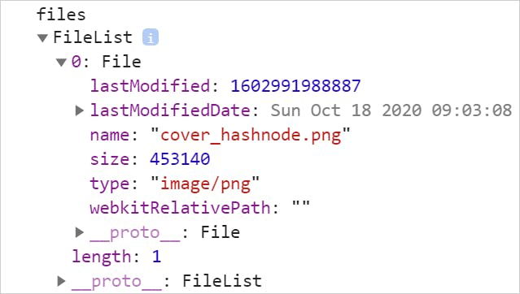
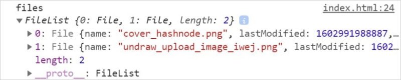
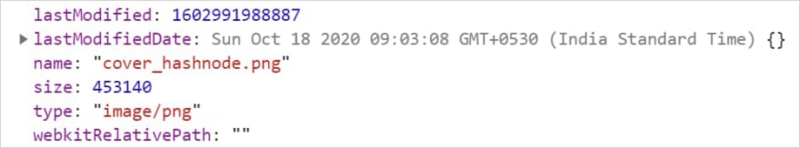
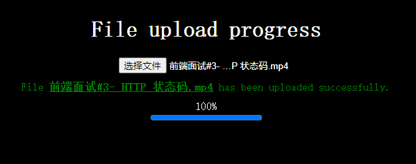
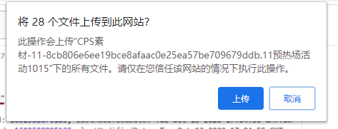
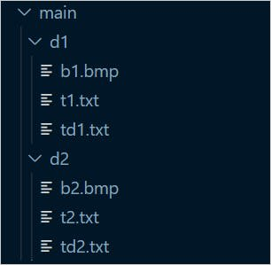
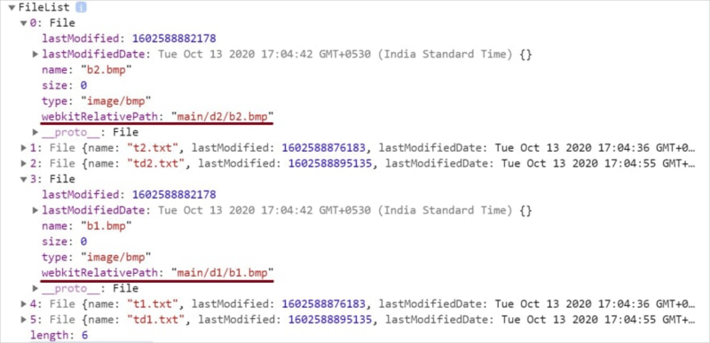
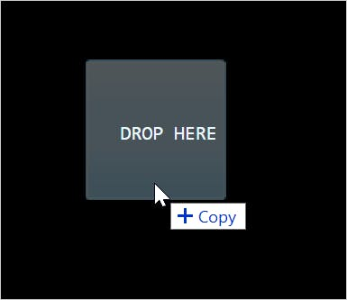

# [10个HTML文件上传技巧](https://segmentfault.com/a/1190000039312701)

**最近开源了一个 Vue 组件，还不够完善，欢迎大家来一起完善它，也希望大家能给个 star 支持一下，谢谢各位了。**

github 地址：[https://github.com/qq44924588...](https://github.com/qq449245884/vue-okr-tree)

## 简介

上传文件功能可以说是项目经常出现的需求。从在社交媒体上上传照片到在求职网站上发布简历，文件上传无处不在。在本文中，我们将讨论 HTML文件上传支持的10种用法，希望对你有用。

## 1. 单文件上传

我们可以将`input` 类型指定为`file`，以在Web应用程序中使用文件上传功能。

```
<input type="file" id="file-uploader">
```

`input filte` 提供按钮上传一个或多个文件。 默认情况下，它使用操作系统的本机文件浏览器上传单个文件。成功上传后，`File API` 使得可以使用简单的 JS 代码读取`File`对象。 要读取`File`对象，我们需要监听 `change`事件。

首先，通过`id`获取文件上传的实例:

```
const fileUploader = document.getElementById('file-uploader');
```

然后添加一个`change` 事件侦听器，以在上传完成后读取文件对象， 我们从`event.target.files`属性获取上传的文件信息：

```
fileUploader.addEventListener('change', (event) => {
  const files = event.target.files;
  console.log('files', files);
});
```

在控制台中观察输出结果，这里关注一下`FileList`数组和`File`对象，该对象具有有关上传文件的所有元数据信息。



如果大家看到这里，有点激动，想手贱一下，可以 CodePen 玩玩，地址：[https://codepen.io/atapas/pen...](https://codepen.io/atapas/pen/rNLOyRm)点击预览

## 2. 多文件上传

如果我们想上传多个文件，需要在标签上添加 `multiple` 属性：

```
<input type="file" id="file-uploader" multiple />
```

现在，我们可以上传多个文件了，以前面事例为基础，选择多个文件上传后，观察一下控制台的变化：



如果大家看到这里，有点激动，想手贱一下，可以 CodePen 玩玩，地址：[https://codepen.io/atapas/pen...](https://codepen.io/atapas/pen/MWeamYp)点击预览

## 3.了解文件元数据

每当我们上传文件时，`File`对象都有元数据信息，例如`file name`，`size`，last update time，type 等等。这些信息对于进一步的验证和特殊处理很有用。

```
const fileUploader = document.getElementById('file-uploader');

// 听更 change 件并读取元数据
fileUploader.addEventListener('change', (event) => {
  // 获取文件列表数组
  const files = event.target.files;

  // 遍历并获取元数据
  for (const file of files) {
    const name = file.name;
    const type = file.type ? file.type: 'NA';
    const size = file.size;
    const lastModified = file.lastModified;
    console.log({ file, name, type, size, lastModified });
  }
});
```

下面是单个文件上传的输出结果：



如果大家看到这里，有点激动，想手贱一下，可以 CodePen 玩玩，地址：[https://codepen.io/atapas/pen...](https://codepen.io/atapas/pen/gOMaRJv)点击预览

## 4.了解 `accept` 属性

我们可以使用`accept`属性来限制要上载的文件的类型，如果只想上传的文件格式是 `.jpg`，`.png` 时，可以这么做：

```
<input type="file" id="file-uploader" accept=".jpg, .png" multiple>
```

在上面的代码中，只能选择后缀是`.jpg`和`.png`的文件。

如果大家看到这里，有点激动，想手贱一下，可以 CodePen 玩玩，地址：[https://codepen.io/atapas/pen...](https://codepen.io/atapas/pen/OJXymRP)点击预览

## 5. 管理文件内容

成功上传文件后显示文件内容，站在用户的角度上，如果上传之后，没有一个预览的，就很奇怪也不体贴。

我们可以使用`FileReader`对象将文件转换为二进制字符串。 然后添加`load` 事件侦听器，以在成功上传文件时获取二进制字符串。

```
// FileReader 实例
const reader = new FileReader();

fileUploader.addEventListener('change', (event) => {
  const files = event.target.files;
  const file = files[0];

  reader.readAsDataURL(file);

  reader.addEventListener('load', (event) => {
    const img = document.createElement('img');
    imageGrid.appendChild(img);
    img.src = event.target.result;
    img.alt = file.name;
  });
});
```

如果大家看到这里，有点激动，想手贱一下，可以 CodePen 玩玩，地址：[https://codepen.io/atapas/pen...](https://codepen.io/atapas/pen/zYBvdjZ)点击预览

## 6.验证文件大小

如果用户上传图片过大，为了不让服务器有压力，我们需要限制图片的大小，下面是允许用户上传小于 `1M` 的图片，如果大于 `1M` 将上传失败。

```
fileUploader.addEventListener('change', (event) => {
  // Read the file size
  const file = event.target.files[0];
  const size = file.size;

  let msg = '';

 // 检查文件大小是否大于1MB
  if (size > 1024 * 1024) {
      msg = `<span style="color:red;">The allowed file size is 1MB. The file you are trying to upload is of ${returnFileSize(size)}</span>`;
  } else {
      msg = `<span style="color:green;"> A ${returnFileSize(size)} file has been uploaded successfully. </span>`;
  }
  feedback.innerHTML = msg;
});
```

如果大家看到这里，有点激动，想手贱一下，可以 CodePen 玩玩，地址：[https://codepen.io/atapas/pen...](https://codepen.io/atapas/pen/pobjMKv)点击预览

## 7. 显示文件上传进度

更好的用户体验是让用户知道文件上传进度，前面我们用过了`FileReader`以及读取和加载文件的事件。

```
const reader = new FileReader();
```

`FileReader`还有一个`progress` 事件，表示当前上传进度，配合HTML5的`progress`标签，我们来模拟一下文件的上传进度。

```
reader.addEventListener('progress', (event) => {
  if (event.loaded && event.total) {
    // 计算完成百分比
    const percent = (event.loaded / event.total) * 100;
    // 将值绑定到 `progress`标签
    progress.value = percent;
  }
});
```



如果大家看到这里，有点激动，想手贱一下，可以 CodePen 玩玩，地址：[https://codepen.io/atapas/pen...](https://codepen.io/atapas/pen/eYzpwYj)点击预览

## 8. 怎么上传目录上传?

我们可以上传整个目录吗?嗯，这是可能的，但有一些限制。有一个叫做`webkitdirectory`的非标准属性(目前只有谷歌浏览器还有Microsoft Edge支持按照文件夹进行上传)，它允许我们上传整个目录。

> 目前只有谷歌浏览器还有Microsoft Edge支持按照文件夹进行上传，具体可以看下百度云盘的网页版的上传按钮，在火狐下就支持按照文件进行上传，而在谷歌和Edge下，就会给用户提供一个下拉，让用户选择是根据文件进行上传还是根据文件夹进行上传。

```
<input type="file" id="file-uploader" webkitdirectory />
```

用户必须需要确认才能上传目录



用户单击“上传”按钮后，就会进行上传。 这里要注意的重要一点。 `FileList`数组将以平面结构的形式包含有关上载目录中所有文件的信息。 对于每个`File`对象，`webkitRelativePath`属性表示目录路径。

例如，上传一个主目录及其下的其他文件夹和文件：



现在，File 对象将将`webkitRelativePath`填充为：



如果大家看到这里，有点激动，想手贱一下，可以 CodePen 玩玩，地址：[https://codepen.io/atapas/pen...](https://codepen.io/atapas/pen/dyXYRKp)点击预览

## 9. 拖拽上传

不支持文件上传的拖拽就有点 low 了，不是吗?我们来看看如何通过几个简单的步骤实现这一点。

首先，创建一个拖放区域和一个可选的区域来显示上传的文件内容。

```
<div id="container">
  <h1>Drag & Drop an Image</h1>
  <div id="drop-zone">
    DROP HERE
  </div>

  <div id="content">
    Your image to appear here..
  </div>

</div>
```

通过它们各自的ID获取`dropzone`和`content` 区域。

```
 const dropZone = document.getElementById('drop-zone');
 const content = document.getElementById('content');
```

添加一个`dragover` 事件处理程序，以显示将要复制的内容的效果:

```
dropZone.addEventListener('dragover', event => {
  event.stopPropagation();
  event.preventDefault();
  event.dataTransfer.dropEffect = 'copy';
});
```



接下来，我们需要一个`drop`事件监听器来处理。

```
dropZone.addEventListener('drop', event => {
  // Get the files
  const files = event.dataTransfer.files;


});
```

如果大家看到这里，有点激动，想手贱一下，可以 CodePen 玩玩，地址：[https://codepen.io/atapas/pen...](https://codepen.io/atapas/pen/ExyVoXN)点击预览

## 10. 使用`objectURL`处理文件

有一个特殊的方法叫做`URL.createobjecturl()`，用于从文件中创建唯一的URL。还可以使用`URL.revokeObjectURL()`方法来释放它。

> `URL.revokeObjectURL()` 静态方法用来释放一个之前已经存在的、通过调用 `URL.createObjectURL()` 创建的 URL 对象。当你结束使用某个 URL 对象之后，应该通过调用这个方法来让浏览器知道不用在内存中继续保留对这个文件的引用了。

```
fileUploader.addEventListener('change', (event) => {
  const files = event.target.files;
  const file = files[0];
  
  const img = document.createElement('img');
  imageGrid.appendChild(img);
  img.src = URL.createObjectURL(file);
  img.alt = file.name;
});
```

如果大家看到这里，有点激动，想手贱一下，可以 CodePen 玩玩，地址：[https://codepen.io/atapas/pen...](https://codepen.io/atapas/pen/BazzaoN)点击预览

## 总结

无论何时，如果你还想学习本文涉及的一些知识，你可以在这里尝试。

[https://html-file-upload.netl...](https://html-file-upload.netlify.app/)

------

**代码部署后可能存在的BUG没法实时知道，事后为了解决这些BUG，花了大量的时间进行log 调试，这边顺便给大家推荐一个好用的BUG监控工具 [Fundebug](https://www.fundebug.com/?utm_source=xiaozhi)。**

原文：[https://dev.to/atapas/10-usef...](https://dev.to/atapas/10-useful-file-upload-tips-for-web-developers-2d1d)