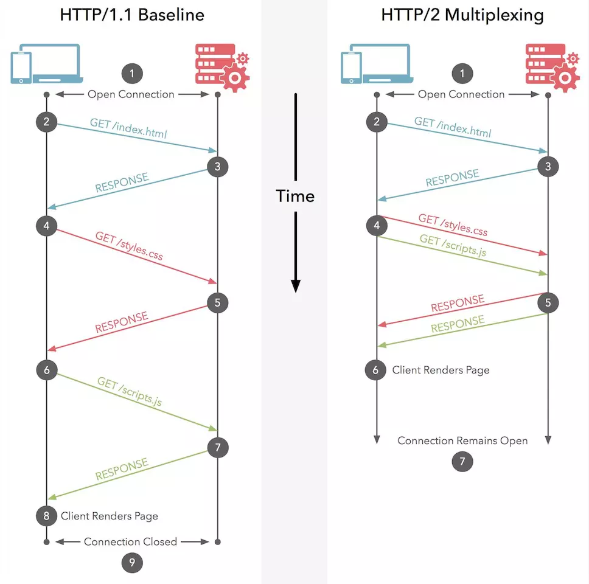
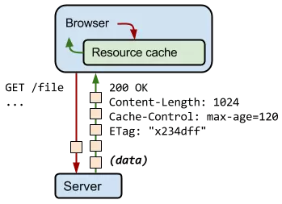
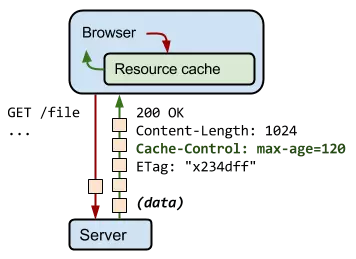
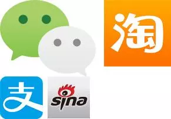
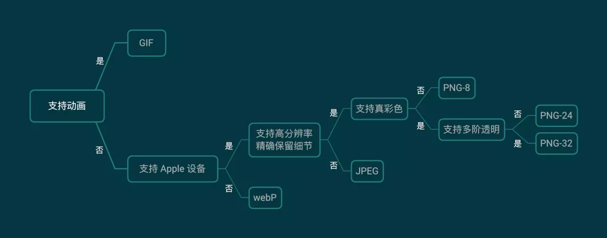

# Web 体验优化中和图有关的那些事

> 本文首发于政采云前端团队博客： [为你重新系统梳理下， Web 体验优化中和图有关的那些事（ 万字长文）](https://www.zoo.team/article/picture)

Web 页面性能优化，解决了图片相关，问题就解决了大半。本文从 Web 常见的图片格式入手，引出与图片优化相关的有效方案，期望对大家能有一点帮助。

## 先来点背景知识

> 注：如下说明整理于网络公开信息。

### ◎ 名词解释

- **有损压缩**：借由将次要的信息数据舍弃，牺牲一些质量来减少数据量、提高压缩比。这个过程是不可逆的。图片常见的有损压缩手段是合并相近的像素点。
- **无损压缩**：数据经过压缩后，信息不受损失，还可以完全恢复到压缩前的样子。无损压缩技术一般是通过两个步骤来完成：
  - 产生输入数据的统计模型。
  - 利用这个统计模型将较常出现的数据用较短的比特序列表示，较不常出现的数据用较长的比特序列表示。
- **索引色**（Indexed Color）：一个字节 2^8 表示一个颜色，也就是最多支持 256 种颜色。
- **直接色**（Direct Color）：4 个数字表示一个颜色，分别表示红、黄、蓝以及透明度，所以最多可以表达 2^32 种颜色。
- **位图**（Bitmap）：又叫栅格图、点阵图，使用像素阵列来表示图像。位图就是由象素阵列的排列来实现其显示效果的，每个象素有自己的颜色信息，在对位图图像进行编辑操作的时候，可操作的对象是每个象素，我们可以改变图像的色相、饱和度、明度，从而改变图像的显示效果。位图根据位深度，有 1、4、8、16、24、32 位图像等。位图放大会失真变模糊。
- **矢量图**：计算机图形学中用点、直线或者多边形等基于数学方程的几何图元表示图像。相比较位图，矢量图保存最少的信息，体积更小，缩放不会失真。
- **通道**：RGB 三种颜色信息称为红通道、绿通道、蓝通道，透明度是 Alpha 通道。

### ◎ Web 中常用图格式说明

- **JPEG/JPG**：使用 JPEG 格式压缩的图片文件，是目前应用最广泛的图片格式之一。最普遍被使用的扩展名格式为.jpg，其他常用的扩展名还包括 .jpeg、.jpe、.jfif 以及 .jif。联合图像专家小组（Joint Photographic Experts Group）1992 年发布 JPEG 压缩标准，1994 年获得 ISO10918-1 认证。其特点是有损压缩，直接色，位图，体积最小，常用于颜色较丰富、无透明要求的图片。
- **PNG**：PNG 是一种无损压缩的位图图形格式，支持索引、灰度、RGB 三种颜色方案以及 Alpha 通道等特性。PNG 的开发目标是改善并取代 GIF 作为适合网络传输的格式而不需专利许可。名称由来一个是 Portable Network Graphics（便携式网络图形），还有一个非正式的由来是 "Png is Not Gif"。使用场景是带有透明、半透明背景的图片，需要在网络传输中显示预览效果后展示全貌。上古时期的 IE6 不支持 PNG 半透明，需要用 hack 方法解决。PNG 体积比较大，非必须可用 JPG 替代。PNG 有 png8、png24、png32 之分。
  - png8: 最多支持 256 色的 PNG，无损、索引色的位图。非动图可以替代 GIF，体积更小，透明度支持也更好。
  - png24： 最多支持 2^24 色的 PNG，不支持透明，无损、直接色的位图。目标是替换 JPG，但一般来说，相同显示效果，PNG 图片是 JPG 体积的数倍。
  - png32： 加上 8 位 Alpha 通道的 png24。（注：PS 中导出图片时选择 png24，勾选透明度，导出的是png32）。
- **GIF**：图像互换格式（Graphics Interchange Format）是一种位图图形文件格式，无损压缩、索引色。原始版本为 87a，1989 年发布 89a 版本，支持多帧动画和透明色。1995 年 Netscape Navigator 2.0 发布，定义了动画循环多少次或是否无限次播放，现在聊天的动图都是基于该版本的 GIF。GIF 的特性如下：
  - 优秀的 LZW 算法在保证质量的同时将体积变的更小。
  - 可插入多帧实现动画效果。
  - 可实现透明效果。
  - 最多支持 256 色，故不适用于真彩色图片。
- **WebP**：Google 2010 年发布的同时支持有损和无损压缩的图片文件格式。有损用来替换 JPG，无损用来替换PNG，动态用来替换 GIF。根据 Google 较早的测试，WebP 的无损压缩比网络上找到的 PNG 档少了 45％ 的文件大小，即使这些 PNG 档在使用 [Pngcrush](https://en.wikipedia.org/wiki/Pngcrush) 和 [PNGOUT](https://en.wikipedia.org/wiki/PNGOUT) 处理过，WebP 还是可以减少近 30％ 的文件体积。WebP 目前还不能全平台兼容，相关兼容性可点[此链接](https://caniuse.com/#feat=webp)查看。
- **SVG**：可缩放矢量图形（Scalable Vector Graphics）是一种基于可扩展编辑语言（XML），用于描述二维矢量图形的图形格式。SVG 由 W3C 制定，是一个开放标准。SVG 的优点是文件可读，易于修改编辑。支持多种滤镜和特殊效果，在不改变图像内容的前提下可以实现位图中类似文字阴影的效果，还可以生成动态图形。

## 图优化之请求优化

### ◎ 拥抱 HTTP2

更快、更简单、更稳定是我们每一个前端工程师的追求，HTTP/2 的出现让这些美好的词汇都汇聚在一起。首先来一个 demo 感受一下牛逼哄哄的 HTTP/2，[HTTP/1.1 vs HTTP/2](https://http2.akamai.com/demo)

#### 二进制分帧层

HTTP/2 所有性能增强的核心在于新的二进制分帧层，它定义了如何封装 HTTP 消息并在客户端与服务器之间传输。


从这张图比较清晰地看出 HTTP/1.x 和 HTTP/2的区别。HTTP/1.x 协议以换行符作为纯文本的分隔符，而 HTTP/2 将所有传输的信息分割为更小的消息和帧，并采用二进制格式对它们编码。

#### 服务器端推送

一般情况下，客户端需要啥东西会告诉服务端，然后服务端返回对应的资源到客户端。HTTP/2 新增的另一个强大的新功能是，服务器可以对一个客户端请求发送多个响应。换句话说，服务端可以先于客户端检测到将要请求的资源，提前推送到客户端，不发送所有资源的实体，只发送资源的 URL。客户端接到后会进行验证缓存，如果发现需要这些资源，则正式发起请求。

#### 标头压缩

每个 HTTP 传输都承载一组标头，这些标头说明了传输的资源及其属性。在 HTTP/1.x 中，这些元数据始终以纯文本形式，通常会给每个传输增加 500–800 字节的开销。如果使用 HTTP Cookie，增加的开销有时会达到上千字节。 为了减少此开销和提升性能，HTTP/2 使用 HPACK 压缩格式压缩请求和响应标头元数据，这种格式采用两种简单但是强大的技术：

- 支持通过静态霍夫曼代码对传输的标头字段进行编码，从而减小了各个传输的大小。
- 客户端和服务端之间同时维护和更新一个包含之前见过的标头字段的索引列表（换句话说，它可以建立一个共享的压缩上下文），对相同请求而言不需要再次发送和相应，比如 User-Agent。

在 HTTP/2 中，请求和响应标头字段的定义保持不变，仅有一些微小的差异：所有标头字段名称均为小写，请求行现在拆分成各个 `:method`、`:scheme`、`:authority` 和 `:path` 伪标头字段。

  

### ◎ 多路复用

每个 TCP 连接只能发送一个请求， HTTP/1.x 在前面的请求没有完成前，后面的请求将会阻塞。

其实在 HTTP/2 之前，我们在写代码的时候也用过类似的思想，比如

- 合并 CSS 和 JS 代码
- 雪碧图
- Iconfont



HTTP/2 的出现又可以让我们省掉不少麻烦。多路复用允许同时通过单一的HTTP请求多个响应。

### ◎ 少不了的懒加载

#### 什么是懒加载？

只加载可视区的内容，当页面向下滚动时，再继续加载后面的内容。

图片懒加载的原理其实非常简单，我们先不设置图片的 src 属性，将图片的真实路径放到一个浏览器不认识的属性中（比如 data-src），然后我们去监听 scroll 事件。当页面的 scrollTop 与浏览器的高度之和大于图片距页面顶端的 Y (注意是整个页面不是浏览器窗口)时，说明图片已经进入可视区域，这是把 data-src 的值放到 src 中即可。 

#### 为什么要使用懒加载？

- 对于大多数用户，特别是移动端和网速比较的用户，如果首屏加载过多的图片，页面将会加载得很慢而且浪费用户的流量。
- Javascript 脚步通常要等到 DOM 加载完后才会执行，如果加载的资源过多，可能会影响网页的正常使用。
- 能够节省流量和减轻服务器压力，更近一步就是能够为公司省成本。

#### 怎么实现？

关于如何实现本文不做过多阐述，成熟的方案社区比比皆是。这边推荐几个比较好用的轮子。

- [Lozad.js](https://github.com/ApoorvSaxena/lozad.js)

安装

```
npm install --save lozad
```

使用

```


const observer = lozad(); // 默认会去找 .lozad 这个class
observer.observe();
```

- [vue-lazyload](https://github.com/hilongjw/vue-lazyload)

安装

```
npm i vue-lazyload -S
```

使用

```
Vue.use(VueLazyload)
```

- [react-lazyload](https://github.com/twobin/react-lazyload)

用高阶组件去包裹

安装

```
npm install --save react-lazyload
```

使用

```
import React from 'react';
import ReactDOM from 'react-dom';
import LazyLoad from 'react-lazyload';
import MyComponent from './MyComponent';

const App = () => {
  return (
    <div className="list">
      <LazyLoad height={200}>
        
      </LazyLoad>
      <LazyLoad>
        <MyComponent />
      </LazyLoad>
    </div>
  );
};

ReactDOM.render(<App />, document.body);
```

### ◎ 正确使用缓存

缓存是一种保存资源副本并在下次请求时直接使用该副本的技术，因此使用HTTP缓存是WEB性能优化中必不可少的，也是每位前端开发工程师的必修课。

  

浏览器和服务器之间使用的缓存策略可以分为**强缓存、协商缓存**两种：

- 强缓存：在缓存数据未失效的情况下，不需要再和服务器发生交互
- 协商缓存：需要与服务端校验是否使用缓存

#### ETag

有这样一种场景，浏览器检查本地缓存找到之前响应的文件发现已经过期，只能去服务端请求，但是服务器的资源没有发生变化，可以说是浪费了一次请求。

Etag 的出现很好地解决了这个问题，服务器生成并返回的随机令牌通常是文件内容的哈希值或某个其他指纹。

客户端不需要了解指纹是如何生成的，只需在下一次请求时将其发送至服务器。 如果指纹仍然相同，则表示资源未发生变化，您就可以跳过下载

  

浏览器自动在 `If-None-Match`  HTTP 请求头内提供 ETag。 服务器根据当前资源核对令牌，如果它未发生变化，服务器将返回 `304 Not Modified` 响应。这样一个来回避免了浏览器再次去请求资源，即省钱又省时间。

#### Cache-Control

Cache-Control是强缓存的一种，每个资源都可通过 Cache-Control 定义其缓存策略，Cache-Control来控制谁可以缓存、缓存多久。

无需和服务端通信的请求是最佳的，通过本地副本消除所有网络延迟、节省流量。

Cache-Control 是在 HTTP/1.1 规范中定义的，取代了之前用来定义响应缓存策略的头部（例如 Expires）。 所有现代浏览器都支持 Cache-Control，因此，用他就足够了。

  

| 指令     | 说明                                                         |
| -------- | ------------------------------------------------------------ |
| max-age  | 指令指定从请求的时间开始，允许提取的响应被重用的最长时间（单位：秒 |
| private  | 只为单个用户缓存，不允许任何中间缓存对其进行缓存             |
| no-cache | 先与服务器确认返回的响应是否发生了变化，走协商缓存           |
| no-store | 禁止浏览器以及所有中间缓存存储任何版本的返回响应             |

#### 缓存 CheckList

实际开发中往往不存在什么固定的最优解，我们需要根据不同的业务场景制定相应的策略。

- **变与不变** 一些不变的部分，如第三方库的代码，可以考虑和业务代码分离，这样一来可以减少下载资源的大小
- **最佳的缓存周期** 不同的资源可能有不同的更新要求，设置合适的max-age
- **Etag** 当服务器上的资源未发生变动时不需要请求

### ◎ 雪碧图

雪碧图，CSS Sprites，国内也叫 CSS 精灵，是一种 CSS 图像合成技术，主要用于小图片显示。

#### 使用场景

在网页中，为了更好的展现效果，经常会采用一些小图标来替代文字。常用的方式包括 Icon Fonts、SVG Icons、小图片，其中 Icon Fonts 只支持单色，SVG Icons 需 IE9+。

> *注：如不考虑低版本浏览器兼容性，推荐使用 SVG Icons，有兴趣可以阅读 [张鑫旭-SVG Sprites技术介绍](http://www.zhangxinxu.com/wordpress/2014/07/introduce-svg-sprite-technology)*

如果采用小图片，需要考虑一个问题：每张小图片独立请求，加载时都会产生一个 HTTP 请求，而小图片体积（1 ~ 2 kb）就比较小，对比上 HTTP 请求连接、请求头内容、响应等的开销，就显得非常没必要了，那有没有可能将多张小图片合并成一张图？

#### 实现原理

将小图标合并成一张图片，利用 `backround-position` 属性值来确定图片呈现的位置即可。如下图所示不同尺寸、位置：

  

通过 CSS 定位，可以展现对应的图标。

```
.icon-alipay {
  background-image: url(sprite.png);
  background-position: 0px -131px;
  width: 81px;
  height: 73px;
}
.icon-taobao {
  background-image: url(sprite.png);
  background-position: -177px 0px;
  width: 114px;
  height: 114px;
}
.icon-wechat {
  background-image: url(sprite.png);
  background-position: 0px 0px;
  width: 177px;
  height: 131px;
}
.icon-xinlang {
  background-image: url(sprite.png);
  background-position: -81px -131px;
  width: 72px;
  height: 72px;
}
```

#### 自动生成

每次修改或者新增图片时，都需要对雪碧图进行修改，如果依靠人工维护，成本太高，能否自动生成雪碧图和样式呢？可以使用 [spritesmith](https://github.com/twolfson/spritesmith)，该工具可自动合并图片，并得到图片在合并之后的相对位置。简单使用示例代码如下：

```
const fs = require('fs')
const path = require('path');
const Spritesmith = require('spritesmith');

const baseDir = './images';
const files = fs.readdirSync(baseDir)
const sprites = files.map(file => path.join(baseDir, file))

Spritesmith.run({src: sprites}, (err, result) => {
  if (err) {
    console.error(err)
  } else {
    console.info(result);
  }
})
```

运行的输出结果如下：

```
{
  coordinates: {
    'images/alipay.png': { x: 0, y: 131, width: 81, height: 73 },
    'images/taobao.png': { x: 177, y: 0, width: 114, height: 114 },
    'images/wechat.png': { x: 0, y: 0, width: 177, height: 131 },
    'images/xinlang.png': { x: 81, y: 131, width: 72, height: 72 }
  },
  properties: { width: 291, height: 204 },
  image: <Buffer 89 50 4e 47 0d 0a 1a 0a 00 00 00 0d 49 48 44 52 00 00 01 23 00 00 00 cc 08 06 00 00 00 38 45 c5 ce 00 00 40 06 49 44 41 54 78 01 ec c1 0b 98 e6 05 61 ... 22705 more bytes>
}
```

其中

- `coordinates`：每张图片对应的尺寸和位置
- `properties`：生成的图片尺寸
- `image`：文件的Buffer，可用于生成图片

对于现有的常用的构建工具，已有现成的插件可直接使用：

1. [webpack-spritesmith](https://github.com/mixtur/webpack-spritesmith)
2. [gulp.spritesmith](https://github.com/twolfson/gulp.spritesmith)
3. [grunt-spritesmith](https://github.com/twolfson/grunt-spritesmith)

以下为 `gulp` 配合 `gulp.spritesmith` 的示例代码：

```
const gulp = require('gulp');
const spritesmith = require('gulp.spritesmith');

// gulp任务定义
gulp.task('sprite', () => {
  return gulp.src('images/*.png')
    .pipe(spritesmith({
        imgName: 'sprite.png',
        cssName: 'sprite.css'
      })
    ).pipe(gulp.dest('./'));
});
```

运行后会得到`sprite.png`、`sprite.css` 两个文件，最后打包的时候将文件对应打包进去即可。

#### 注意事项

1. 如果要适配高清屏，需要配置高清屏的图片，并且通过设置`background-size`属性来使得最终显示正常，可参考以上插件的`retina`相关配置参数；
2. 由于 HTTP/2 的支持多路复用特性，使得单个图片的请求的开销很小，不推荐使用雪碧图了，但为了兼容 HTTP1.1，现阶段多版本HTTP 协议并存期间还是建议保留；
3. 雪碧图好用，可不要滥用。

### ◎ 使用 iconfont

iconfont 译为字体图标，即通过字体的方式展示图标，多用于渲染图标、简单图形、特殊字体等。

使用 iconfont 时，由于只需要引入对应的字体文件，针对加载图片张数较多的情况，可有效减少 HTTP 请求次数，而且一般字体体积较小，所以请求传输数据量较少。与直接引入图片不同，iconfont 可以像使用字体一样，设置大小和颜色，还可以通过 CSS 设置特殊样式，且因为其是矢量图，不存在失真的情况。

那么，怎么使用 iconfont 呢？请参照以下 demo：

> 根据开发需求，按需引入不同格式的字体文件（eot / ttf / woff / svg）

```
<style>
  @font-face {
    font-family: "iconfont";
    src: url('iconfont.eot'); /* IE9*/
    src: url('iconfont.eot?#iefix') format('embedded-opentype'), /* IE6-IE8 */
         url('iconfont.woff') format('woff'),
         url('iconfont.ttf') format('truetype'), /* chrome, firefox, opera, Safari,  Android, iOS 4.2+*/
         url('iconfont.svg?#iconfont') format('svg'); /* iOS 4.1- */
  }

  .iconfont {
    font-family: "iconfont";
  }
</style>

<body>
  // &#xe609 是一个字符的 unicode 码，在该 iconfont 字体文件中对应某个图标
  <i class="iconfont">&#xe609</i> 
</body>
```

关于 @font-face 的说明可参考 mozilla [官方文档](https://developer.mozilla.org/zh-CN/docs/Web/CSS/@font-face)。

在平时开发工作中，可使用以下常用图标字体库：

- [IconFont 阿里巴巴矢量图标库](https://www.iconfont.cn/help/detail?spm=a313x.7781069.1998910419.14&helptype=code)   使用方法详见 IconFont 图标库[官方文档](https://www.iconfont.cn/help/detail?spm=a313x.7781069.1998910419.14&helptype=code)。
- [IcoMoon](https://icomoon.io/app/#/select)   使用方法详见 IcoMoon[官方文档](https://icomoon.io/#docs)。
- [fontello](http://fontello.com/)  使用方法：选中并下载字体文件，引入项目使用即可。
- [Font Awesome](https://www.bootcss.com/p/font-awesome/)  多与 bootstrap 结合使用，使用方法详见 Font Awesome [官方文档](https://www.bootcss.com/p/font-awesome/#integration)。

### ◎ 使用 Base64

Base64 是网络上最常见的用于传输 8Bit 字节码的编码方式之一，可将图片编码为特定的字符串，由 52 个大小字母和 10 个数字，以及 +、/、= 三个字符组成，详见 [wiki](https://zh.wikipedia.org/wiki/Base64).

使用 Base64 编码渲染图片有以下优点：

- 有效减少 HTTP 请求次数
- 可对数据进行简单加密，无法肉眼获取信息
- 没有跨域问题，无需考虑图片缓存

凡事皆有利弊，使用 Base64 编码同时也会带来一些问题：

- 编码后文件体积增大，仅适用于小体积图片编码
- 增加了编码和解码的工作量
- 不支持 IE 8.0 以下版本

如需将图片转换为 Base64 编码，可以使用 JavaScript API `FileReader.readAsDataURL` ，详细可参考[文档](https://developer.mozilla.org/en-US/docs/Web/API/FileReader/readAsDataURL)。

## 图优化之体积优化

图片体积压缩就是在图片保持在可接受的清晰度范围内同时减少文件大小，图片体积压缩可以借助工具实现。

### ◎ 在线工具

- [TinyPNG](https://tinypng.com/)：免费，TinyPng  使用智能有损压缩技术减小 PNG 文件的文件大小，原理是将图片中相似的颜色组合起来（量化），通过减少颜色的数量，可以将 24 位 PNG 文件转为更小的 8 位索引图片，同时所有不必要的元数据被剥离。
- [PP鸭](http://ppduck.com/)：￥69.9，很好用，根据图片的特点，选择比较兼顾大小和质量的压缩方案。
- [智图](https://zhitu.isux.us/)：免费，可以选择压缩质量，生成 Webp。
- [Iloveimg](http://www.iloveimg.com/zh_cn)：免费，支持压缩 JPG，PNG， GIF， 能保持最佳文件质量和压缩程度, 并且 Iloveimg 不仅仅是一款图片压缩工具，还支持图片的裁剪、图片的格式转换以及大小调整等功能。

### ◎ 客户端工具

- PhotoShop：只适用 JPG，导出时选择 JPG，选择压缩质量。
- Sketch：只适用 JPG，导出时选择 JPG，选择压缩质量。

### ◎ 阿里云 OSS

阿里云 OSS 可以通过配置参数形式对图片进行处理，支持缩放、裁剪、旋转、效果、格式转换、水印等操作，详细信息点此 [文档](https://help.aliyun.com/document_detail/44688.html) 查看。

示例：将图强制缩略成宽度为 100，高度为 100。

```
http://image-demo.oss-cn-hangzhou.aliyuncs.com/example.jpg?x-oss-process=image/resize,m_fixed,h_100,w_100
```

本文作者之一@明明 亦做过一个小工具，通过配置缩放参数、压缩质量、格式等属性后自动生成 OSS 后缀地址，具体如何使用参考[文档](https://npm.taobao.org/package/vue-img-url-suffix-for-alioss)。

### ◎ 七牛云

七牛云的图片处理服务和阿里云 OSS 功能类似，也可以对图片进行缩放、裁剪、旋转、缩略等操作，详细[文档](https://developer.qiniu.com/dora/api/3683/img-directions-for-use)

示例：将图强制缩略成宽度为 100，高度为 100。

```
https://odum9helk.qnssl.com/resource/Ship.jpg?imageView2/2/w/100/h/100
```

## 图优化之格式、尺寸优化

### ◎ 图片格式

Web 开发中常见的图片包括 JPG，PNG，GIF，webP，选择合适的格式以及压缩质量可以在保证视觉效果的情况下，加速网站的呈现。下面针对不同图片格式的特性来做一下对比：

| 类型 | 动画   | 压缩类型           | 浏览器支持                            | 透明度 |
| ---- | ------ | ------------------ | ------------------------------------- | :----- |
| GIF  | 支持   | 无损压缩           | 所有                                  | 支持   |
| PNG  | 不支持 | 无损压缩           | 所有                                  | 支持   |
| JPEG | 不支持 | 有损压缩           | 所有                                  | 不支持 |
| webP | 不支持 | 无损压缩或有损压缩 | Chrome、Opera、Firefox、Edge、Android | 支持   |

回忆本文开头介绍的不同图片格式的特点，大家可以参考下图选择合适的使用场景：

  

### ◎ 多倍图

在 Retina 视网膜屏幕面世之前人们很少关注像素密度与设备像素比，随着 Retina 屏在移动设备中越来越广泛地应用，为了保证图片在不同 DPR（设备像素比）的设备上显示足够清晰，开发者需要针对不同设备适配不同倍数的图片。

#### 像素相关概念

- **DP** 设备像素，又名物理像素，即设备屏幕上真实的物理像素，以矩阵的形式排列，如 iphone X 屏幕分辨率为 2436*1125，即屏幕每行包含 1125 个物理像素，每列包含 2436 个物理像素。
- **DIP** 设备无关像素，是一种基于屏幕坐标的抽象像素，应用程序以抽象像素为单位，如我们 CSS 中使用的 px，实际渲染时通过底层程序转换为物理像素。
- **DPR** 设备像素比，设备像素 / 设备无关像素的值即为设备像素比，在 Javascript 中可以通过 `window.devicePixelRatio` 来获取。

#### 多倍图概念

了解以上的概念，我们不难理解：

- 在 DPR 为 1 的设备（一倍屏）上，使用 1 * 1 个物理像素展示一个 CSS 像素。
- 在 DPR 为 2 的设备（二倍屏）上，使用 2 * 2 个物理像素展示一个 CSS 像素。
- 在 DPR 为 3 的设备（三倍屏）上，使用 3 * 3 个物理像素展示一个 CSS 像素。

  

针对一张 30px * 30px 的图片，在 1 倍屏上，按照 1 : 1 平铺，图片质量并不损失。但是在 2 倍屏、3 倍屏上，分别通过 60 * 60 与 90 * 90 个物理像素渲染这张图片就会出现模糊、失真的现象，从而影响用户体验。所以，我们需要根据不同 DPR 去加载不同倍数的图片：

- 一倍屏上加载 30px * 30px 的图片，我们称之为一倍图。
- 二倍屏上加载 60px * 60px 的图片，图片名一般加上 @2x 标识，我们称之为二倍图。
- 三倍屏上加载 90px * 90px 的图片，图片名一般加上 @3x 标识，我们称之为三倍图。

#### 自适应 DPR 加载图片

在高分辨率显示屏如 2x 上，在页面中使用二倍图可以保证清晰度，但是当此页面在低 DPR 设备打开时，我们只需要 50% 长宽的图片就能保证显示效果，而此时带宽开销却是一样的。所以为了节约传输流量，我们需要告诉浏览器，根于不同的 DPR 加载不同尺寸的图片，通常有以下三种方法：

1. 使用 picture 标签，除了 IE，现有主浏览器均已支持该标签，兼容性参考[文档]([[caniuse.com/#search=Pic…](https://caniuse.com/#search=Picture element)]([caniuse.com/#search=Pic…](https://caniuse.com/#search=Picture) element))。

```
<picture>  
  <source srcset="photo@3x.jpg" media="(min-width: 800px)">  
  <source srcset="photo@2x.jpg" media="(min-width: 600px)">  
    
</picture>
```

1. 使用 img srcset 属性，除了 IE，现有主浏览器均已支持该属性，兼容性参考[文档](https://caniuse.com/#search=srcset)。

```

```

1. 使用 CSS3 img-set 函数，兼容性相较于前两者较差，参考[文档](https://caniuse.com/#search=image-set())。

```
background-image: image-set("photo.png" 1x,
                            "photo@2x.png" 2x,
                            "photo@3x.png" 3x);
```

## 勿忘无障碍，关怀弱视力群体

根据世界健康组织的统计，全球约有 2.85 亿视力障碍人士，仅美国就有 810 万网民患视力障碍，而在中国，这个数字要被乘以 2。不同于我们浏览网页的方式是看，视力障碍人员浏览互联网信息主要是靠听 —— 靠屏幕阅读器读出网页的有效信息，通过听这些信息来获知内容。对于前端工程师而言，关注到一些细节的优化，能更好的服务于这些视力障碍人士。

### ◎ 设置 Alt 属性

最基础的方式，是装饰性图片归类到背景图，通过 CSS 背景图进行设置；功能性图片放到 HTML 中，通过 `img` 标签引入，且要设置 `alt` 属性，以便被屏幕阅读器识别并阅读。图片 `alt` 信息应简短，介绍图片信息即可，避免内容冗余。图片的长信息介绍应被放到 `longdesc` 属性中：

```


```

- 宽或高不到 8px 或者没有 alt 的图片（特别是装饰性的图片）应该被移除，CSS 技术可以用来控制样式
- alt 是用来描述图片的，而非单纯的新闻标题或者名词
- alt 属性不应包含图片的文件名
-  alt 值不应包含冗长的信息（如果很长可以使用） 
- 每个 img 标签要应该设置 alt 属性
- 不能只依赖图片上的文字信息
- Banner、头图上的文字信息必须在代码中有所体现

更多无障碍相关，可参考《[腾讯网无障碍说明](https://www.qq.com/accessibility/)》。

### ◎ 考虑 IMG Sprite

“高对比度模式” 是一种 Windows 系统的设置主题，其用意是为了保证视力受损的用户，在查看 Web 信息时提供方便。它通过使用对比鲜明的色彩和字号来提高文本的可读性，高对比度模式下网页的背景默认会变成全黑。

CSS Image Sprites（CSS 雪碧图）是一项用来减少网页中图片 HTTP 请求数的技术，但其会导致在 Windows 高对比度模式下背景图片消失，其服务的 Web 应用性能的提升和对无障碍体验被破坏之间的矛盾，已经引起了 Web 开发者的关注。Sprite 技术的使用的确为更多网站的优化加载速度的体验贡献甚大，但我们要承认，这个过程中我们忽略并损害了使用高对比度模式用户的体验。由于 `` 元素可以在高对比度模式下显示，故而在此场景下，使用基于  ``  标签的 Sprite 技术，可以得到比基于 CSS 背景图的 Sprite 更多的收益。

关于 IMG Sprite 技术的应用，可以在此文中学习到 《[Foreground Sprites – High Contrast Mode Optimization](https://www.artzstudio.com/2010/04/img-sprites-high-contrast/)》

## 总结

就前端性能优化而言，图片优化可谓是其必不可少的环节。但是与其说是在做优化，不如说是在做“权衡”。一些操作是以牺牲一部分成像质量为代价的。我们的主要任务，是尽可能的去寻求一个质量与性能之间的平衡点，并在不同业务场景下，做好图片方案的选型工作。

## 更多阅读：

- [Foreground Sprites – High Contrast Mode Optimization](https://www.artzstudio.com/2010/04/img-sprites-high-contrast/)
- [background-position - CSS（层叠样式表）](https://developer.mozilla.org/zh-CN/docs/Web/CSS/background-position)
- [在 CSS 中实现图像合并](https://developer.mozilla.org/zh-CN/docs/Web/Guide/CSS/CSS_Image_Sprites)


作者：政采云前端团队链接：https://juejin.im/post/5dc7fb87e51d454b4213c934来源：掘金著作权归作者所有。商业转载请联系作者获得授权，非商业转载请注明出处。