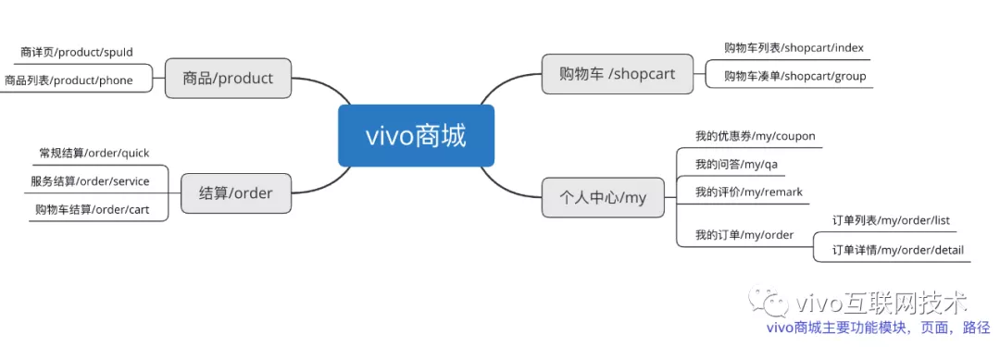
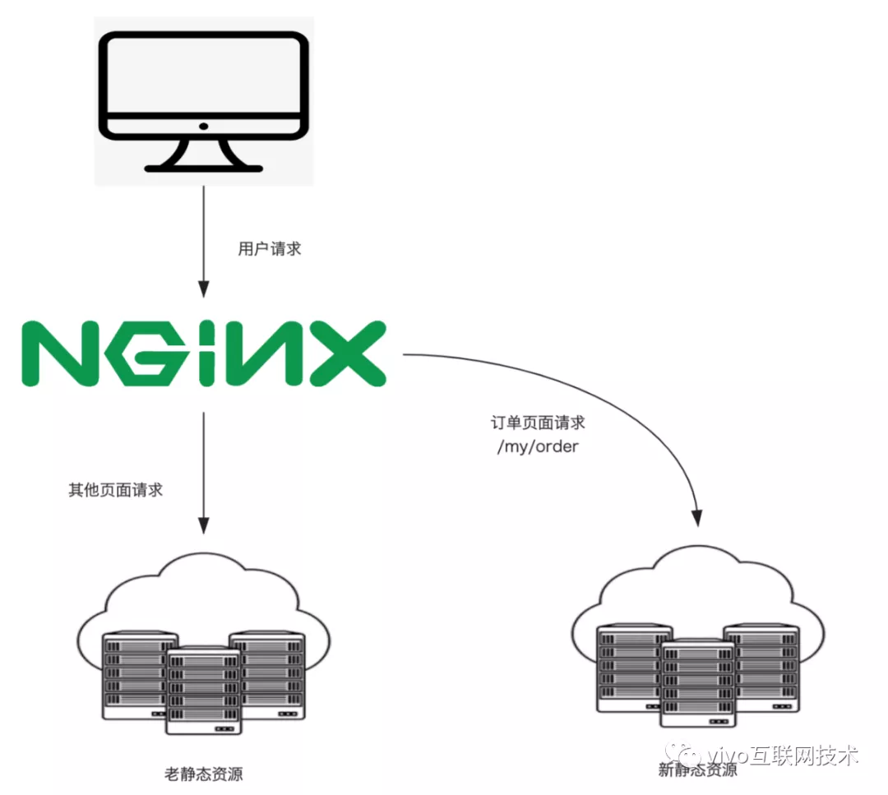
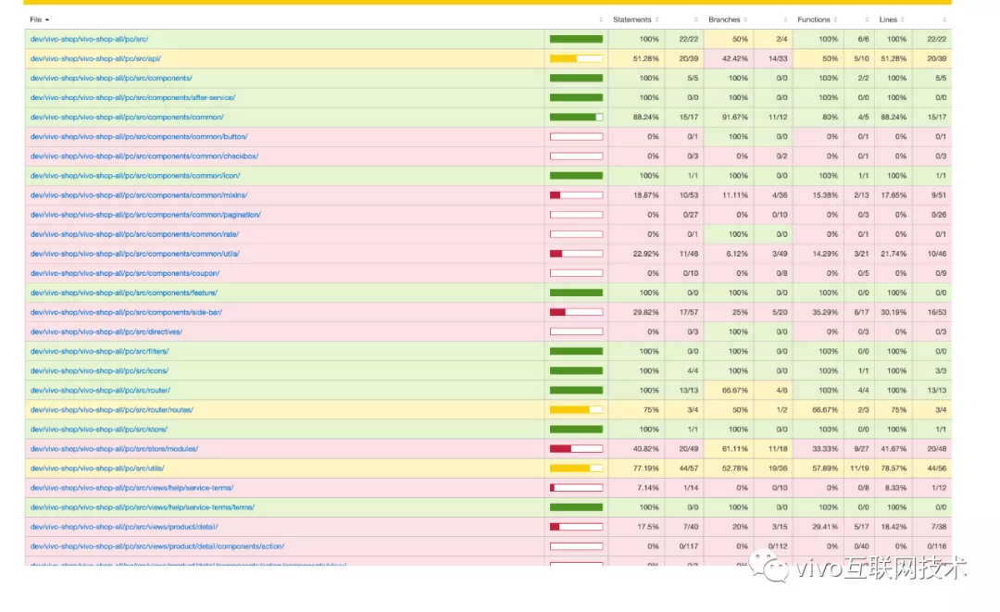
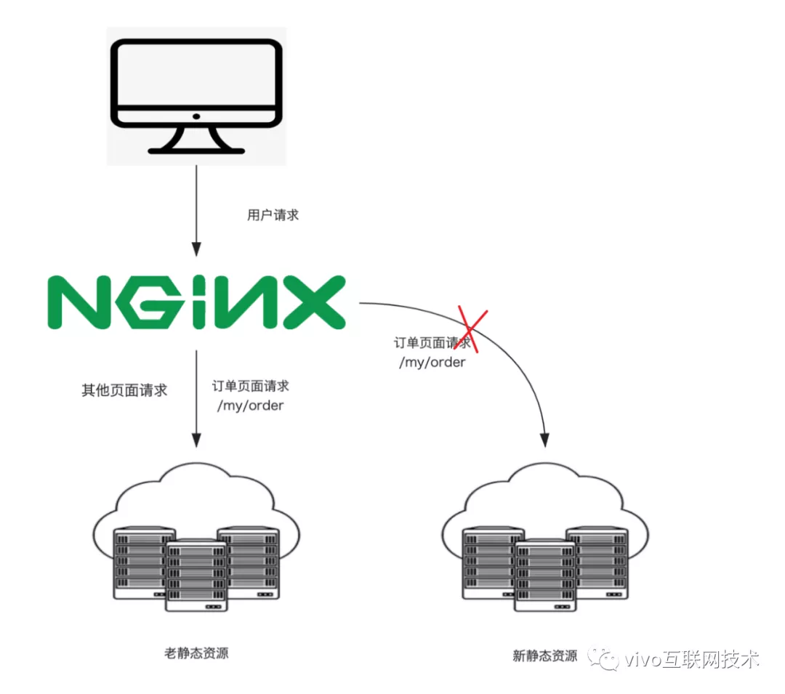

# [vivo 商城前端架构升级—前后端分离篇](https://my.oschina.net/vivotech/blog/4690514)

本文主要以 vivo 商城项目的前后端分离经验，总结前后端分离思路，整理前后端分离方案，以及分离过程中遇到的问题及解决方案。


# 一、前言

vivo官方商城在2015年创建网上商城，开辟网络销售渠道，几年来日活和销售额持续增长，极大的助力了vivo手机的销量。

而随着业务版本迭代越来越快，业务内容逐渐增多，前后端不分离模式的弊端也逐渐显露出来，迭代效率无法跟上逐步增长的业务需求，多端扩展成本高。

为此，我们在2019年开始进行商城项目的架构升级，进行前后端分离，前端技术升级，接口规范化，以便应对未来更多的业务挑战。


# 二、背景

架构升级，第一步面临的问题便是前后端分离，前后端不分离的痛点已经无需赘述，既影响开发效率，又影响开发体验，但商城仍然处于业务高速发展时期，不能因为技术重构而停下业务版本的迭代。

 因此业务版本迭代必须要和前后端分离同时进行，那怎么才能做到双线并行，鱼和熊掌兼得呢？方案要如何设计？如何应对技术升级带来的风险和不可控因素呢？

让我们带着这些问题来看看vivo商城是如何一步步实现前后端分离。


# 三、前后端分离


## 1、基本思路

先分析我们的业务模块，是标准的树形结构，每个功能模块包含若干子模块，每个子模块又可以包含若干更小的子模块，每个子模块对应的页面地址页类似于面包屑，形成层级包含关系，并且与功能模块的包含层级一一对应，如下图：



那如果我们能控制某个模块的页面请求，让它返回分离之后的新页面，别的请求还访问老页面，岂不是就能逐个功能模块进行分离？嗯，理论上是可行的。

比如以订单模块为例，我们可以拦截订单相关页面的请求，使得订单页面的请求访问新的资源，其他页面请求还访问老的资源，如下图：



 


## 2、逐步分离方案

那么问题来了，如何实现按访问路径去请求不同资源？商城目前的页面请求和接口请求都是通过 Nginx来做统一的门户入口，我们能否通过Nginx区分页面请求路径，从而达到路由控制的目的？

通过学习研究Nginx配置，发现 Nginx路由匹配有这样一条特性：

location 匹配首先检查使用前缀字符定义的 location，选择最长匹配的项并记录下来，如果没有匹配的正则 location 和精确匹配的 location，则使用前面记录的最长匹配前缀字符 location。

这条信息非常重要，Nginx 的 location 匹配会采用最长的匹配路径，因为我们的页面路径层级结构跟功能模块的层级结构是对应的，那我们 **location匹配的路径越长，匹配的功能模块的粒度就越细，匹配的相应页面就越精确**。

比如个人中心（路径为/my）下包含订单相关模块（路径为/my/order）,根据Nginx最长匹配原则，就可以**通过控制匹配路径长度，来控制要分离的模块的大小**，比如通过拦截/my/order来拦截所有的订单相关页面。

```javascript
location /my/order {
  # 匹配所有以/my/order开头的请求,其他请求不会被拦截，如/my/coupon则不会被拦截
  # 如订单列表页面 https://shop.vivo.com.cn/my/order/list 会被拦截
  # 将匹配到的页面请求转发到新的静态资源服务器
  proxy_pass http://new-download;
}
```

同理，个人中心下的评价模块下面的页面路径都以/my/remark开头，那可以通过增加配置 location /my/remark {} 来拦截评价模块。当个人中心下面的子模块都分离完毕，便可以通过缩短匹配路径来扩大匹配范围。

```javascript
location /my {
  # 匹配所有以/my开头的请求，即个人中心的所有页面都被拦截
  # 如个人中心首页 https://shop.vivo.com.cn/my 会被拦截
  # 将匹配到的页面请求转发到新的静态资源服务器
  proxy_pass http://new-download;
}
```

当所有的模块逐步完成了分离，就可以直接拦截根路径，将所有的页面请求都取新的静态资源。


## 3、双线并行

技术是服务于业务的，而技术的更迭演进又可以为业务带来提升，业务版本在高速迭代，犹如奋力爬升的航天飞机，而利用上述方案，便可以为飞行中的飞机更换零件甚至发动机，在业务版本迭代的同时逐步进行模块重构，业务是按版本逐步迭代的，但每次迭代一般不会涉及太多模块，而是重点针对其中一到两个模块进行迭代或者修改，当某次业务版本涉及某个模块时，我们便可以对这个模块进行分离，在分离的同时进行业务版本内容的开发，即完成了业务功能开发，又完成了模块的分离重构，而测试同学只需要测试一次，提高了版本迭代和测试效率。

当然，业务版本一般都是对一些通用模块的迭代，比如商品，结算，购物车等模块，总有一些比较稳定或者生僻的模块很长一段时间甚至一两年内都不会有大的变动，针对这种情况，就需要单独的版本进行迭代，好在这些模块并不算多，业务也相对比较稳定。


## 4、质量保证，风险规避

在一般的业务迭代中，只需要对某些模块代码进行修改，适配，或者补充，整个模块完全重构，无疑会增加额外的开发和测试工作量，而更多的变动和修改带来的是更多的风险和不可控因素，那怎么保证重构质量呢？

同时，业务版本策划可能只涉及此次版本业务内容，不涉及该模块的历史功能，那测试该以什么参考标准来测试这些历史功能呢，如何能保证测试覆盖率，确保所有的业务场景都能被覆盖到呢？

关于参考标准，线上标准就是最好的标准。现在网页都提供了http和https两种访问方式，用户访问的内容是一样的，在服务器配置也基本上是一样的，将https的配置改为新的配置，而http还保持不变，当用https的形式就可以访问到最新的页面，而用http形式访问的还是老页面，当然，这两个页面是可以同时访问的，因此我们可以进行新旧页面之间的对比，确保分离前后页面的一致性。

```javascript
server {
  listen       80;
  server_name  shop.vivo.com.cn;

  # 老的配置不变
  ...
}

server {
  listen       443;
  server_name  shop.vivo.com.cn;

  # 分离模块配置
  location /my {
    proxy_pass http://new-download;
  }
}
```

为了保证测试覆盖率，我们引入了代码覆盖率检查工具，精确检测某一行代码是否被测试用例覆盖。通过代码覆盖率报告，我们能很清晰的看出哪些代码被执行了，哪些分支没有被执行到，为什么没有被执行到，基于这些反馈对测试用例做调整和补充，确保全面的测试覆盖。




## 5、遇到的问题

**（1）上线部署顺序**

上线过程主要有三个部分，分别是服务端接口发布，前端静态资源发布，Nginx修改，这三个操作是有前后依赖关系的，如果顺序错了，那就会造成线上事故，因此必须严格遵守以下发布顺序：

- **服务端接口发布**

服务端接口是向前兼容的，在分离过程中并不是直接在老接口上修改，而是新开了接口，保证在发布期间新老接口都是可以调用的。

- **前端静态资源发布**

前端页面依赖于服务端接口，因此必须确保服务端接口已经发布完毕才可以发前端页面，否则会出现接口404的问题。

- **Nginx配置修改**

这一步要放到最后，如果Nginx在前端静态资源发布之前就进行了修改，那用户访问页面时就会出现页面404的情况。

**（2）容灾措施**

当版本上线出现问题时，如何能快速回退，且不对用户造成影响？因为我们是直接拦截用户请求并重定向到了新的静态资源服务器，那如果出现线上问题，只需要将此部分的拦截配置关闭，就可以达到快速回退的目的。而服务端接口是向前兼容的，因此无需后退。




# 四、结果

根据这个方案，我们经过一年时间的逐步迭代，迭代8个版本，终于完成wap端的前后端分离，可以让专业的人做专业的事。现在回过头来看看，这次技术升级我们到底解决了什么难题，而它又为我们带来了什么提升和正向作用呢？

> - 纯前端业务上线发布速度提升10+倍
> - 释放研发人力，专业的人做专业的事，开发效率最高提升1倍
> - 打好native化、多端渠道拓展基础
> - 积累技术经验、赋能更多业务


# 五、总结

整个前后端分离过程漫长而曲折，在这个过程中我们面临的最大问题就是如何在人力成本，业务需求和技术升级之间取得一个平衡点，这对我们来说是很有挑战性的一个难题，很多时候技术问题都可以找到参考和解决方案，但如何能在复杂的人力，资源，版本，技术积累情况下制定技术方案，兼顾各方，去主动推动解决问题，提前识别和规避风险才是对我们真正的考验。

> 作者：vivo官网商城前端团队