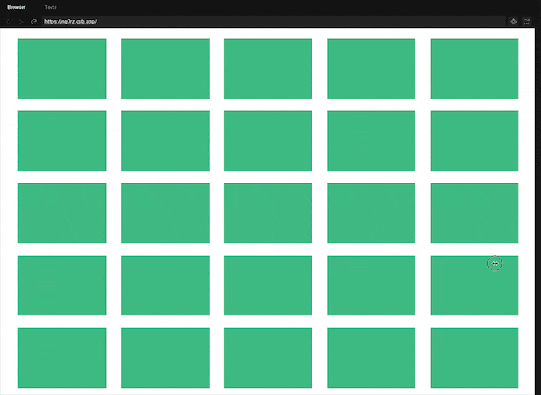

# [vivo 悟空活动中台 - 栅格布局方案](https://my.oschina.net/vivotech/blog/4536661)

> 本文首发于 vivo互联网技术 微信公众号 
> 链接： [https://mp.weixin.qq.com/s/6O0CH0U_WE1YkPK75m-jDQ](https://www.oschina.net/action/GoToLink?url=https%3A%2F%2Fmp.weixin.qq.com%2Fs%2F6O0CH0U_WE1YkPK75m-jDQ)
> 作者：悟空中台研发团队


# 一、背景

今天来给大家分享一下栅格布局方案。在后台展示页面中，常见卡片列表的展示需求。但是这类展示型需求其实不容易满足，有以下两个问题。


## **1、优化前的问题**


### **（1）PC分辨率不统一**

用户在使用管理后台时，打开浏览器页面宽度不一。主流的显示宽度1920像素，但也存在1366，1600等其他宽度的场景。而且用户在桌面端搭建页面时，同时在操作的内容不仅仅是管理后台，可能会适当缩小页面宽度来做其他的事情。这样我们在页面布局时需要考虑到兼容广泛的屏幕宽度。


### **（2）一份设计稿**

无论是前端开发还是设计师，在页面布局时，都希望能兼顾到不同终端场景下的展示差异，但是设计师不可能去针对性做出多套设计稿，来针对内容进行自适应设计。尚待有一种更加通用，且又轻量的方案供参考使用。


## **2、优化前的方案**

在卡片列表展示的页面，往往会实现一种统一尺寸的卡片依次排列，或者一行展示固定数量的卡片，宽度动态调整。这两种布局方式是我们实现展示类需求的常备方案。

但是这两种常备方案，只是简单的解决了设计稿所呈现的分辨率展示诉求，在页面宽度有调整时，展示效果就不尽如人意了。


(图1 - 优化前的方案)


### **（1）固定卡片宽度**

在页面宽度进行调整时，页面左右侧会有较大幅度的空白，没有展示具体的内容。


### **（2）固定卡片个数**

在页面宽度过大或者宽度过小时，卡片容易放大缩小至非常夸张的比例，展示的效果欠佳。


# 二、布局方案分析

鉴于目前简单的方案无法满足广泛页面宽度的诉求，我们可以对行业内多种自适应布局方案进行调研，来对我们最终的布局方案做出一定程度的参考。为了兼容页面不同宽度的情况，我们先将页面上布局元素进行一个简单的分类，布局的组成部分为**卡片宽度，卡片外边距，容器内边距**。自适应栅格布局，就是动态的调整这三个影响因子，来实现页面更理想的展示。

> - **卡片宽度：**卡片的宽度随着页面宽度自适应调整
> - **卡片外边距：**卡片互相之间的边距随着页面宽度自适应调整
> - **容器内边距：**容器的内边距随着页面宽度自适应调整


(图2 - 影响因子)


## **1、行业内的方案**

我们这里收集了三种常见的行业内解决方案，来进行一一列举。


### **（1）谷歌 Material Design**

谷歌的 Material Design ，是一套大一统的自适应布局解决方案，将页面宽度划分为13种场景，在达到这13种场景的临界点时，调整自适应布局的三个影响因子，来实现统一的自适应效果。该方案的优点是以谷歌的设计规范为蓝本，能够在一类产品中实现统一的布局风格。如果你的产品希望以谷歌的设计规范为依托，并且后期不会做个性化调整，谷歌的 Material Design 是很好的选择。


(图3 - [谷歌 Material Design](https://www.oschina.net/action/GoToLink?url=https%3A%2F%2Fmaterial.io%2Fdesign%2Flayout%2Funderstanding-layout.html%23))


### **（2）定制栅格的方案**

定制栅格方案常用于企业官网或者视频网站。国内常见的视频网站，在首页展示视频内容时，就用到了这种定制栅格的方案，本质上就是在不同的分辨率区间，使用不同的设计稿。这种方案适合于设计资源比较丰富的团队，能够基于自适应的要求，给出多套实现的设计稿，并给出一套内部的定制化栅格方案。


(图4 - 定制栅格的方案)


### **（3）自适应栅格方案**

自适应栅格方案，就是有一套计算公式，可以套用给页面宽度和页面布局三个影响因子，通过固定其中两项因子的值，计算出第三项因子的值，来实现页面布局的效果。这个方案适合于团队对设计资源要求不高，并且对展示效果有较高的要求的场景。


## **2、自适应方案分析**

下面简要阐述三种自适应栅格方案各自的使用场景，和优缺点分析：


(表1 - 自适应栅格方案对比)


### **（1）自适应卡片方案**

通过固定页面边距和卡片边距的尺寸来计算出卡片宽度，该方案的优点是整体框架稳定，卡片自适应伸缩。缺点是调整浏览器宽度时，卡片尺寸不可避免时大时小，卡片内部的元素要按照百分比布局，一定要做好自适应。


(图5 - 自适应卡片方案)


### **（2）自适应内边距方案**

通过固定卡片边距和卡片宽度的尺寸来计算出页面边距，该方案的优点是，卡片展示内容整体居中，卡片宽度也不会有变化，卡片内部可以严格还原设计稿；但缺点是，卡片内容在大屏内会显得太小，但是在小屏上会显得很大。


(图6 - 自适应内边距方案)


### **（3）自适应边距方案**

通过固定页面边距和卡片宽度的尺寸来计算出卡片边距，该方案的优点是，页面左右两侧不会有太大的空白区域，卡片宽度也不会有变化，卡片内部可以严格还原设计稿；但缺点是卡片边距会动态调整，这种场景中卡片直接的距离往往比较大，这样视觉效果更好。



(图7 - 自适应边距方案)


## **3、方案总结**

行业内这三个方案各有不同的适用场景。

> - Material Design 方案适合于团队设计资源投入少，设计风格以谷歌 Material Design UI 为准，且后期不会做个性化调整的团队。
> - 定制化栅格方案适合于团队设计资源丰富且定制化强的团队。
> - 自适应栅格方案适合于团队设计资源投入少且栅格风格更加个性化的团队。

悟空团队基于团队业务需求和设计效果，决定使用自适应栅格方案，下面是我们的栅格方案实现。


(图8 - 悟空栅格实现)


# 三、自适应栅格方案 - 栅格组件实现

我们根据自适应栅格方案实现了自适应栅格组件，三种自适应栅格方案可以使用同一个组件来实现，我们首先看看栅格组件如何进行使用。


## **1、组件使用方式**

自适应栅格组件包含外层的容器组件 Grid 和内置的卡片组件 GridItem，容器组件有四个基础配置项和三个定制化配置项。

以下是容器组件 Grid 的基础配置项，Grid根据基础配置项粗算出一行展示的栅格个数。


### **（1）组件配置项**


(表2 - 自适应栅格基础配置项)

以下是容器组件 Grid 的定制配置项，根据栅格个数和限制条件判断是否需要调整栅格个数，进行自适应调整。


(表3 - 自适应栅格定制配置项)


### **（2）组件使用范例**

这里我们使用项目展示列表来举例。在项目展示的场景，我们将卡片容器使用 Grid 组件，并且在卡片素材使用 GridItem 组件进行包裹，不修改默认的 Grid 参数。

```javascript
<grid ref="grid" :gridType="'autoMargin'" :baseW="250">
  <grid-item v-for="project in projectList" 
    :key="project.projectId"
    class="project-item"
    >
    <div class="name">{{ project.name }}</div>
  </grid-item>
</grid>
```


## **2、组件核心逻辑**

下面简要描述一下栅格布局组件 Grid 的核心逻辑：

> - 组件 mounted 后，监听 window 的 resize 事件。
> - 页面宽度发生变化时，清除当前计算数据，并重新计算出自适应效果。
> - 在组件销毁前，移除对 window 的 resize 事件监听。

```javascript
mounted () {
  window.addEventListener('resize', this.calcGridSize, false)
  this.reset()
},
beforeDestroy () {
  window.removeEventListener('resize', this.calcGridSize, false)
},
methods: {
  reset () {
    // 清除计算数据
    this.calcGridSize()
  },
  calcGridSize () {
    // 重新进行计算
  }
}
```


## **3、自适应效果计算**

不同的自适应方案对应有不同的计算规则，但是其核心方案都是一致的，需要根据三个数值配置项作为基准，求解在页面宽度变化时，其中某一个配置项如何自适应变化。以下整理三种自适应方案的计算方式：


(表4 - 自适应栅格实现方式)

以下整理三种方案的计算公式：


(表5 - 自适应栅格计算公式)

以下根据自适应卡片宽度为例分析具体的流程：

- calcGridSize 根据当前配置项选择计算方式；
- getGridNum 计算出一行同时存在的卡片个数；
- 根据 limitW 计算是否需要调整卡片个数，计算出最终的卡片宽度。

```javascript
calcGridSize () {
  // step 1，选择计算方式
  if (this.gridType === 'autoMargin') {
    this.calcAutoMg()
  } else if (this.gridType === 'autoPadding') {
    this.calcAutoPd()
  } else {
    this.calcAutoWd()
  }
},
// 自适应卡片宽度
calcAutoWd () {
  const containW = this.$el.clientWidth
  const { baseMg, baseW, limitW } = this
  // step 2，计算 grid 个数
  const caclW = containW - baseMg
  let gridNum = Math.floor(caclW / baseW)
  let gridW = caclW % baseW / gridNum + baseW - baseMg
  // step 3，修正 grid 个数，计算出最终卡片宽度
  if (caclW % baseW > limitW) {
    gridW = caclW / (1 + gridNum) - baseMg
  }
  this.gridW = gridW
},
// 自适应外边距
calcAutoMg() {
  const containW = this.$el.clientWidth
  const { baseMg, baseW, limitMg } = this
  // step 2，计算 grid 个数
  const caclW = containW - baseMg
  let gridNum = Math.floor(caclW / baseW)
  let gridMg = (containW - baseW * gridNum) / (gridNum + 1)
  // step 3，修正 grid 个数，计算出最终外边距
  if (gridMg < limitMg) {
    gridNum--
    gridMg = (containW - baseW * gridNum) / (gridNum + 1)
  }
  this.gridMg = gridMg;
},
// 容器自适应内边距
calcAutoPd() {
  const containW = this.$el.clientWidth
  const { baseMg, baseW, limitPd } = this
  // step 2，计算内边距
  let gridPd = ((containW + baseMg) % (baseW + baseMg)) / 2
  // step 3，修正 grid 个数，计算最终内边距
  if (gridPd < limitPd) {
    gridPd =
      (((containW + baseMg) % (baseW + baseMg)) + baseW + baseMg) / 2
  }
  this.gridPd = gridPd;
}
```


## **4、自适应样式传值 - CSS变量**

上一步骤，我们通过以自适应卡片宽度为例子，计算出来自适应参数后，需要有一种方式来实现CSS样式的父子传值。

在基于vue的管理后台项目上，我们有两种实现方式来解决CSS样式的父子传值。

- 通过父子组件props来传值
- 通过CSS变量来传值

考虑到CSS变量实现方式更加轻量而且兼容性符合我们项目要求。我们通过使用CSS变量来完成自适应样式传值，下面简要介绍一下CSS变量在前端页面中的使用。


### **（1）声明与使用**

声明CSS变量时，需要在变量名前面增加两根连词线（--）。变量名大小写敏感，并且变量的值可以是色值、数字和字符串。

使用CSS变量时，需要使用var()函数进行包裹。var()函数默认接受两个参数，第一个参数是前文定义的CSS变量，第二个参数是默认值（可不传）。

下面代码展示了如何声明并使用CSS变量

- 在grids中声明了变量--gridW，并且在grid-item中进行使用。
- 在grid-item中使用变量--gridH作为高度，如果获取不到，则使用默认值 50px

```javascript
<style>
.grids {
  --gridW: 200px;
}
.grids .grid-item {
  width: var(--gridW);
  height: var(--gridH, 50px);
}
</style>
```


### **（2）作用域与优先级**

CSS变量可以在多个选择器内进行定义和使用，优先级与CSS层叠优先级一致，作用范围则是在变量定义的选择器范围内均生效。


### **（3）兼容性**

我们在业务开发中已经开始使用CSS变量了，通过 CanIUse 网站可以看出目前CSS变量已经兼容了众多主流浏览器，并且在前文中提到的谷歌 Material Design 方案也是使用CSS变量来实现谷歌的栅格布局方案。所以兼容性上，大家可以放心使用。


(图9 - [CSS变量兼容性](https://www.oschina.net/action/GoToLink?url=https%3A%2F%2Fcaniuse.com%2F%23search%3DCSS%20Variables))

如果要考虑兼容性处理，建议在使用CSS变量时考虑下述方法进行兼容。

```javascript
<style>
.grids .grid-item {
  width: 200px;
  width: var(--gridW);
}
</style>
```


### **（4）样式传值实现**

栅格布局组件在父组件上定义卡片宽度，卡片边距。通过CSS变量传值给子组件进行使用。

```javascript
<template>
  <div class="grids" :style="{
    '--gridW': gridW + 'px',
    '--gridMg': gridMg + 'px',
    '--gridPd': gridPd + 'px'
  }">
    <slot></slot>
  </div>
</template>

<script>
// ...
</script>
<style lang="less" scoped>
.grids {
  overflow-y: auto;
  display: flex;
  flex-wrap: wrap;
  -webkit-box-pack: start;
  -ms-flex-pack: start;
  justify-content: flex-start;
  align-content: flex-start;
  padding: 0 var(--gridPd) 0 calc(var(--gridPd) - var(--gridMg));
  >>> .grid-item {
    width: var(--gridW);
    margin-left: var(--gridMg);
  }
}
</style>
```

# 四、小结

我们从提升卡片类页面展示效果的诉求出发，历经：

1. 当前布局问题分析
2. 行业内布局方案筛选
3. 栅格布局方案实现
4. CSS变量优化

等一系列手段，探索出适合管理后台的栅布局方案，更好的服务了中台页面的展示场景。悟空中台开发团队将永不止步，持续研究和思考，为大家带来更多的实战技巧，感谢您的阅读。

> 悟空活动中台】系列往期精彩文章：
>
> - 《[揭秘 vivo 如何打造千万级 DAU 活动中台 - 启航篇](https://www.oschina.net/action/GoToLink?url=http%3A%2F%2Fmp.weixin.qq.com%2Fs%3F__biz%3DMzI4NjY4MTU5Nw%3D%3D%26mid%3D2247486583%26idx%3D1%26sn%3Df914759459e73a84194de8f3ad11ba01%26chksm%3Debd87ce5dcaff5f36ea1004bf1cf5293b2dd9ef0539ef23cb983423bd3821cf7653b1b567660%26scene%3D21%23wechat_redirect)》 主要为大家讲述 vivo 活动中台的能力与创新。
> - 《[悟空活动中台 - 微组件状态管理（上）](https://www.oschina.net/action/GoToLink?url=http%3A%2F%2Fmp.weixin.qq.com%2Fs%3F__biz%3DMzI4NjY4MTU5Nw%3D%3D%26mid%3D2247486706%26idx%3D1%26sn%3D06c17167cc6ec207dc856a6f8b83f62a%26chksm%3Debd87c60dcaff576afd9734029e5f54474ad72ab25500b0abd13cc70a356dc57ae5089180988%26scene%3D21%23wechat_redirect)》介绍了活动页内 RSC 组件之间的状态管理和背后的设计思路。
> - 《[悟空活动中台 - 微组件状态管理（下）](https://www.oschina.net/action/GoToLink?url=http%3A%2F%2Fmp.weixin.qq.com%2Fs%3F__biz%3DMzI4NjY4MTU5Nw%3D%3D%26mid%3D2247486950%26idx%3D1%26sn%3D7812d90f5b206d279c3cdcc3da34bbea%26chksm%3Debd87d74dcaff462a8f1d813953dcc7978e6e0fcd1bf429fe43f0a21cee010e11db6d7f312c2%26scene%3D21%23wechat_redirect)》探索平台和跨沙箱环境下的微组件状态管理。
> - 《[vivo 悟空活动中台-基于行为预设的动态布局方案](https://www.oschina.net/action/GoToLink?url=https%3A%2F%2Fmp.weixin.qq.com%2Fs%2FCwLAV2j7Uxam01m1p7cXxg)》本文以“满屏”场景下的页面布局思考为切入点，以微组件为元素单元，提供了一种新的布局方案设计思路——基于行为预设的动态布局方案，并详细的分享了设计目的及具体实现方案。
> - 《[vivo悟空活动中台 - 微组件多端探索](https://www.oschina.net/action/GoToLink?url=https%3A%2F%2Fmp.weixin.qq.com%2Fs%2FoGX4XSm8F4fa1ocLdpyqlA)》是基于自助多端扩展，也就意味着多端 微 组件选择越丰富，内容越通用，玩法越多样，产品价值也会越高。
> - 《[vivo 悟空活动中台 - H5 活动加载优化](https://www.oschina.net/action/GoToLink?url=https%3A%2F%2Fmp.weixin.qq.com%2Fs%2F6gtVR0nVNcZvREjwftZgzA)》从提高资源请求速度，资源压缩、缓存、渲染等多种角度出发，寻找悟空活动专题加载优化方案。
> - 《[vivo悟空活动中台 - 基于 WebP 的图片高性能加载方案](https://www.oschina.net/action/GoToLink?url=https%3A%2F%2Fmp.weixin.qq.com%2Fs%2FrSpWorfNTajtqq_pd7H-nw)》 从技术选型、架构设计到方案落地，全方位的呈现悟空活动中台基于 WebP 的图片高性能加载方案。