# [vivo商城前端架构升级—多端统一探索、实践与展望篇](https://my.oschina.net/vivotech/blog/4740357)

# 一、引言

本文将会从整体上介绍 vivo 商城在前端维度的多端统一探索和实践。

从多端价值、为什么要做多端统一、如何满足多端业务需求、实践与创新，简洁直白的阐述我们在多端统一上所做的一切。


# 二、多端探索为vivo商城带来了哪些价值

多端的价值可以从技术架构升级和人力资源释放两个方面体现。


## 1、技术架构全面升级

从

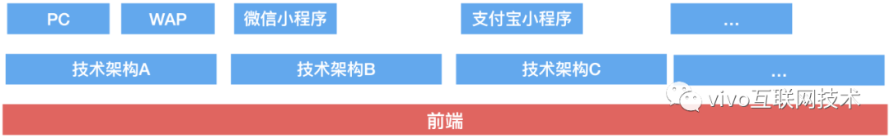

到

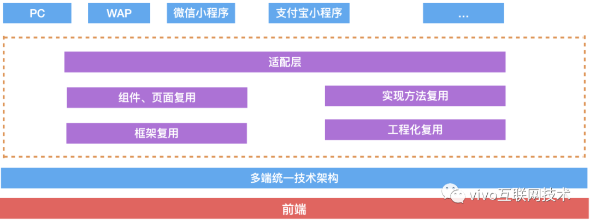

 

我们实现了技术架构方案的统一。通过统一，极大的降低了开发成本、维护成本。同时具备高复用、高效率。


## 2、释放大量人力资源

技术架构方案的统一，对业务的横向扩张提供了强大的技术支持和可实现保障。

下图是使用新的技术架构后的开发人力投入比。

 

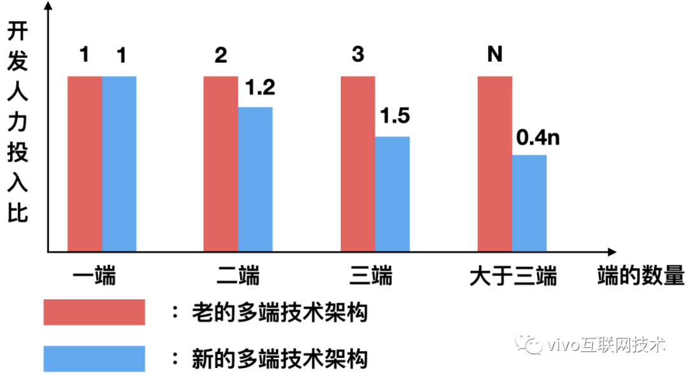

 

从上图可以看出，通过技术架构的升级，释放了可观的开发资源。让释放的开发资源去做更多有价值的事情。


# 三、我们为什么要做多端统一

大家可能会有疑问，那就是多端统一是什么？

这里我先卖个关子，先不谈统一，我们来说说多端一词。多端是什么呢？想必大家都能说个八九不离十。

关于多端，我画了个图，如下所示：

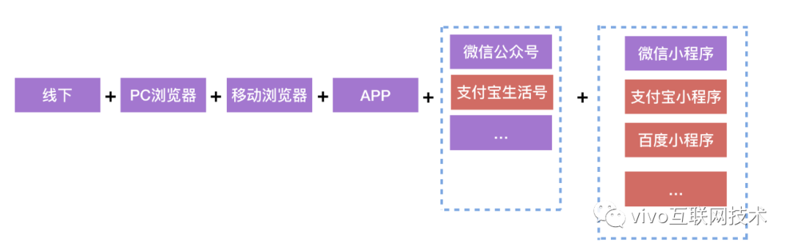

从上图可以看到，线下、pc、wap、APP、微信公众号、微信小程序等，每一个都可以称为一个端。知道了多端的含义，现在，我们再回头看多端统一。

完整的多端统一，要包含以下几个方面的统一

> - 大前端【前端+客户端】的多端统一
> - 服务端的多端统一
> - 业务的多端统一

这里，我们只讨论前端的多端统一。

从 PC 浏览器，到移动端浏览器、到 APP 内嵌，再到各个小程序，再到服务端、客户端。繁荣的生态，犹如百家争鸣，百花齐放。然而，繁荣的背后，对前端工程师的挑战，则与日俱增。

我们承接的端越来越多，新的端不断的出现，如小程序、快应用等。前端工程师陷入了如下套娃陷阱：

1. 现有代码、新代码要适配新的端开发场景
2. 已经适配新的端开发场景的代码成为了现有代码
3. 现有代码、新代码要适配新的端开发场景
4. 循环...

我们希望解决这种问题，希望做到一套技术架构方案【代码】，可以覆盖现在的端和未来的端。

通俗点说，我们希望做到如下图所示的能力：

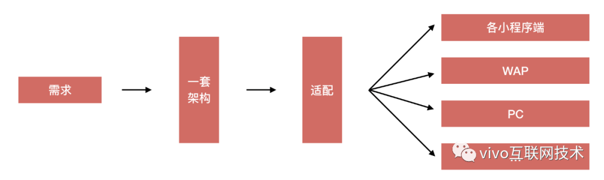

在这种前端开发背景下，多端统一出现了。它是前端的一个未来趋势，它也是解决上面套娃陷阱的一剂良药。


# 四、如何满足日益增加的多端业务需求

随着时间的推移，各小程序端业务被逐渐重视起来，尤其是 vivo 商城微信小程序。

业务方的述求有两点，如下所示：

**第一点：**让现有 vivo 商城微信小程序的核心功能和商城 H5 功能保持一致。

**第二点：**后续版本迭代，小程序端和 H5 端同步进行。

而现实是：**现有的商城微信小程序，其版本迭代已经较大的落后商城 H5 版本了**。

> 我们用新老版本的小程序购买流程视频做对比，让大家有个较为直观的感受。

老版商城小程序：[视频>>](https://www.oschina.net/action/GoToLink?url=https%3A%2F%2Fmp.weixin.qq.com%2Fs%2FxqsIQGjuNnEfDU5Elf3ijg)

新版商城小程序：[视频>>](https://www.oschina.net/action/GoToLink?url=https%3A%2F%2Fmp.weixin.qq.com%2Fs%2FxqsIQGjuNnEfDU5Elf3ijg)

> 从上面两个视频可以看出两者的差异，我们面临的挑战很大。

根据业务方的述求，我们需要做的事情在解决上面两点的情况下，增加一点，共有三点，如下所示：

> - **第一点：**在最短的时间内，将商城 H5 的基本功能和流程在微信小程序上实现出来
> - **第二点：**在后续小程序端和 H5 端版本功能同步迭代时，做到高复用，高效率。
> - **第三点：**提前考虑未来其他端业务场景的落地，做好扩展性、多端复用性。

在业务驱动下，我们进行了技术调研、demo 验证、mvp 验证。最终在综合考虑下，采用了 uni-app 多端架构来解决上面两个难点。

> 这里提一下，业务驱动的良好模式，大概如下图所示：

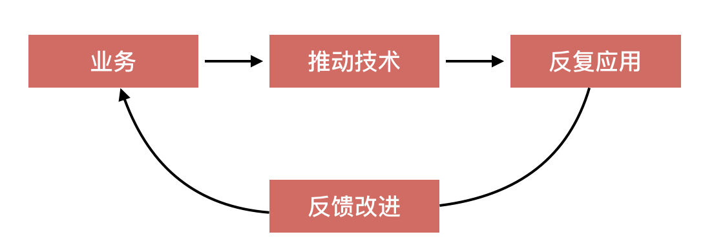

通过业务来推动技术的优化和改变，在反复应用的过程中，实时反馈改进，最后回报给业务。在这个过程中，技术和业务形成了良性闭环。

NOW. 剩下的事情，就是落地实践了。


# 五、我们的多端做了哪些实践和创新

有句名言是这样说的：**实践是检验真理的唯一标准**。诚然，成功者的背后，有你看不见的努力和坚持。


## 1、实践

在实践过程中，要考虑的因素很多，列举如下：

> 1. 现有小程序的原生代码如何转成多端项目写法，保证转换代码可读、可控。
> 2. 现有小程序的部分功能逻辑需要完整保留，甚至是小程序原生 api 和逻辑，这些和多端项目如何共存。
> 3. 如何将 H5 的代码逻辑最大程度的复用到多端项目中。
> 4. 如何优雅将 H5 的各种组件、设计模式、工程化、工具方法适配到多端项目中。
> 5. 等等...

> 那么我们是如何处理这些因素的呢？

我们可以用一张图整体概括下，如下图所示：

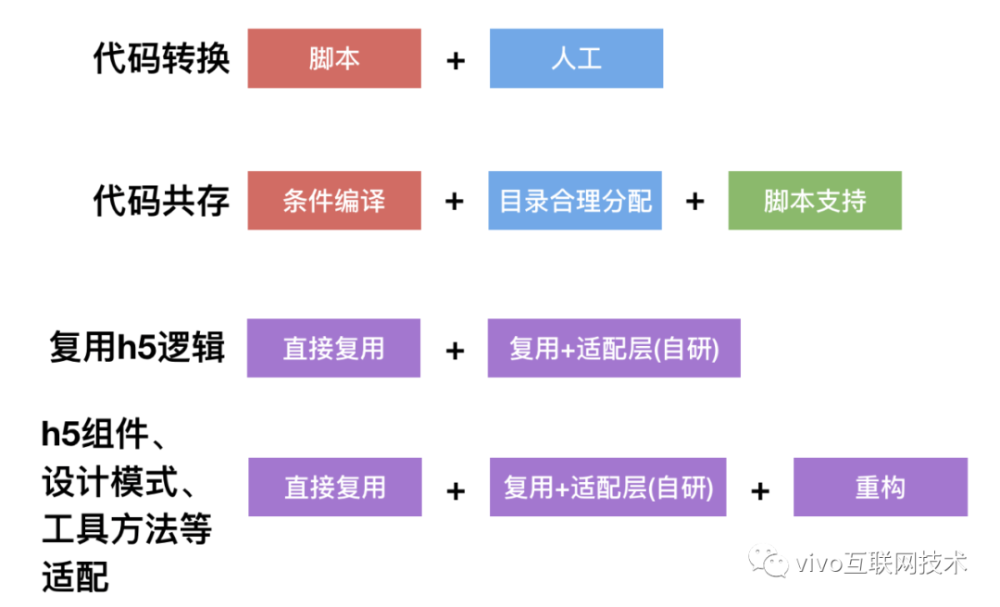

 

下面就介绍下我们是如何处理这些因素的。


## 2、代码转换

> 现有小程序的原生代码如何转成多端项目写法，保证转换代码可读、可控？

我们使用的是开源转换器 miniprogram-to-uniapp 来做的转换，然后再通过人工，去解决转换过程中不匹配的问题。解决方案就是这么朴实无华，也许大家觉得方案很简单，但是选择这个解决方案的背后，我们做了详细的评估，包括和该开源转换器的作者进行了微信交流。在和作者沟通交流的过程中，我们知道了该转换器的过去、现在和未来，在当时的情况下，这是一个合适且正确的解决方案。


## 3、代码共存

> 现有小程序的部分功能逻辑需要完整保留，甚至是小程序原生 api 和逻辑，这些和多端项目如何共存？

我们通过对项目进行合理的目录划分，来达到天然的隔离，如下图所示：

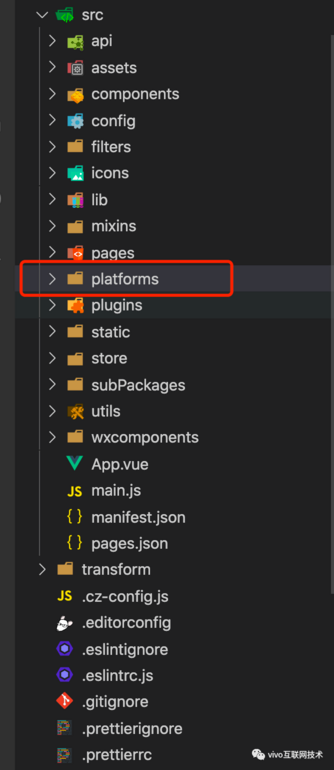

 

我们把一些现在还不能适配多端的代码，统一放到 platforms 目录下。同时，我们会使用条件编译来将现在还不能转换成多端的平台隔离开。如下图所示：

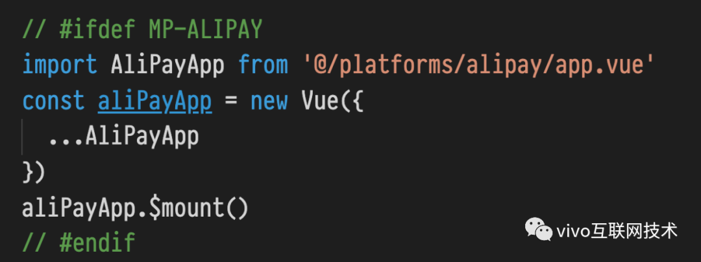


## 4、复用和适配 h5

复用讲究的是一个懒字，能直接复用的就果断复用，不要做二次调整，保证和 H5 高度一致。

适配讲究的是一个以不变应万变，我们不需要改动 H5 的代码，我们只需要为他们做一个适配层，如适配 H5 路由，一些不兼容的组件，甚至说适配 window.location 都可以。

从上面介绍的解决方案中，我们可以体会到，处理这些因素的核心秘诀就是下面两句话：

> 第一句：**因地制宜，找到平衡。**
>
> 第二句：**提高复用，降低改动。**


## 5、创新

有句话是这样说的：**平凡中孕育着伟大**。放在这里，我们换个说法，那就是 **实践中孕育着创新**。

在实践的过程中，我们解决了很多问题。在解决问题的过程中，我们做出了一些令人高兴的创新。

- **vuex 创新**

> 这个创新来源于一个问题，这个问题的背景如下：

商城 H5 商品详情页用  vuex 管理数据，在将 vuex 移到小程序商品详情页中时，发现一个现象，如下动图所示：


从上面动图中，我们发现，在使用 vuex 时 ，我们从 A 商品的详情页中点击 B 商品，进入 B 商品详情页。这时，我们点击左上角返回 A 商品详情页，会发现，此时商品详情页已经变成 B 商品，也就是说，A 商品的数据已经没了。

这是一个非常大的问题，经过排查，发现原因如下：

vuex 的 namespace 默认是一个，无法自动新增 namespace 。当在小程序页面里面使用 vuex 进行数据管理时，由于小程序页面数据机制，在点击返回时，页面数据使用的是同一个 vuex 的数据，从而导致了上面出现的现象。

这里，有人可能要说，在 onShow 生命周期里面，刷新数据，不就解决了吗。其实不然，在这种场景下，进行数据刷新是非常不合理的。

> 那么该如何解决呢？

我们知道，小程序页面数据在使用 vuex 后，多次进入同一个页面后，返回会有展示问题。随后，组内进行了讨论，综合权衡后，确定继续用 vuex ，通过给 vuex 加一个适配层来解决这个问题。

随后，组内进行了讨论，综合权衡后，确定继续用 vuex 。通过给 vuex 加一个适配层来解决这个问题。

首先我们看下，在给 vuex 加一个适配层后，进行上面的操作，会是什么现象。

如下动图所示：

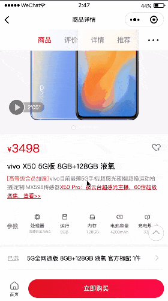

从上面的动图，我们可以发现，在给 vuex 加了一个适配层后。成功的解决了小程序页面数据在使用 vuex 后，多次进入同一个页面后，点击返回时，出现的展示问题。

> 我们是如何解决这个问题的呢？

核心方案：**通过让 vuex 支持自动扩展、自动注销 namespace，来做到更加智能化的数据流管理方案**。

核心架构图如下所示

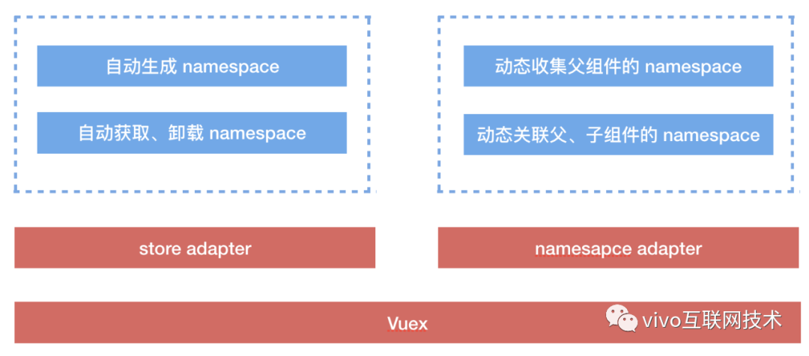

 

通过在 store 中自动生成 namespace，保证了同一个页面进入多次后，每个页面数据都是保留的。当页面返回时，通过动态收集父组件的 namespace ，完成了父子组件的 namespace 关联。

通过上面的技术方案，我们解决了 vuex 在小程序里面使用时，存在的问题。这里，核心架构方案已经给出，具体实现，就不再细述了。


## 6、解耦创新

> 这个创新来源于一个问题，这个问题的背景如下：

我们现在有普通、 秒杀 、 拼团 商品详情页，后面还会有其他商品详情页，那么我们如何复用这些详情页里面的业务组件呢？

面对上面的问题，大家会有以下思考：

- 不同页面，业务组件内的数据处理是有差别的
- 不同页面，业务组件内的埋点是不一样的
- 不同页面，业务组件内可能存在特定的接口请求

上面的这些思考，大家看过应该是有感触的，复用业务组件本身就是一件很困难的事情，如果想彻底的解耦更是难上加难。

> 那么，我们是如何做到尽可能解耦的呢？

我们做了以下几点：

1. 在上游保证埋点统一，通过设计组件层面的埋点来达到埋点统一。
2. 在组件层面，对特定接口，进行条件判断。
3. 将业务组件的数据分解成源数据和派生数据，源数据在 vuex 层面保证一致，派生数据在业务组件内根据实际情况进行相应的适配。
4. 对 vuex 进行改造，让业务组件和页面的通信彻底解耦，业务组件不再需要知道页面的 vuex 命名空间。

> 开发过商城项目的同学应该都清楚已选弹层的逻辑是很复杂的，这里就拿 已选弹层 业务组件做例子来说下我们是如何去做业务组件复用的。

下面是目前已经复用的已选弹层组件的组成：

```javascript
├── components
│   ├── sku-number
│   ├── sku-product
│   ├── sku-service
│   ├── sku-spec
│   └── ...
├── index.js
├── index.scss
├── index.vue
├── mutation-types.js
└── track.js
```

我们将已选弹层组件的数据分为源数据和派生数据，源数据通过 vuex 层面去统一，如下图所示：

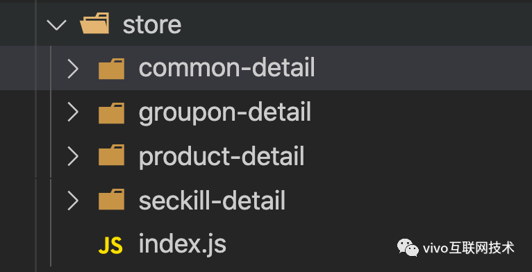

 

我们为每个详情页写一个 vuex ，同时将相同的部分抽离到 common-detail 中。之后，我们在 vuex 中进行处理，保证不同页面给出的源数据是相同的。这些源数据是要传到业务组件中的。

如下代码所示：

```javascript
// 这是已选弹层业务组件
// 通过 @vivo/smartx 解耦组件和页面的通信
import { mapState, mapGetters, mapMutations, mapActions } from '@vivo/smartx'

// 获取源数据
computed: {
  ...mapState([
    'spuInfo',
    'skuInfo'
  ]),
  ...mapGetters([
    'price',
    'pageType'
  ]),
}

methods: {
  fn() {
    // 策略模式
  }
}
```

通过上面的处理，就可以将类似的业务组件很好的从不同页面中解耦出来，从而提高代码的复用性、可维护性以及可扩展性。

这种解耦业务组件的思想就在于：

> 不必刻意将数据与视图彻底分离，通过源数据和派生数据,平衡好变和不变的数据，再通过自研的 @vivo/smartx 将变到不变变成孤岛，将不变到变变成孤岛。

每一次创新，都是一次考验，它总是不经意间给你出难点，然后逼迫你，去突破自己，从而创造出更好的东西，循环往复。

最后，多端架构的 vivo 官方商城微信小程序已经上线了。大家可以点击[vivo官方商城](https://www.oschina.net/action/GoToLink?url=https%3A%2F%2Fmp.weixin.qq.com%2Fs%3F__biz%3DMzI4NjY4MTU5Nw%3D%3D%26mid%3D2247488400%26idx%3D1%26sn%3D817c6d2da04d77115d0984cc86c417ea%26chksm%3Debd86302dcafea140d8b3760f2db085e59541d2975554e997732da33af0a32ed7b38fef0361e%26token%3D1976076906%26lang%3Dzh_CN)体验一下哦。

# 六、总结

本文我们一起回顾了， vivo 商城微信小程序的多端统一之路。从业务需要，存在价值，到技术实践与创新，我们希望用技术让多端之路能够更加平坦。

> vivo 官网商城前端团队